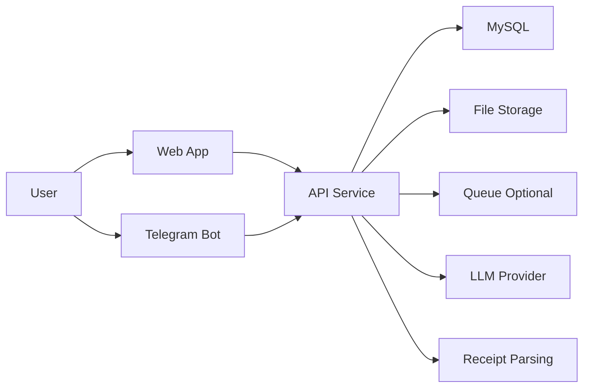

# Implementation Plan: Personal/Family Finance Management Application

## 1. Overview

### Project Description
This plan describes an incremental, deployable implementation roadmap for a personal/family finance management platform spanning a web app, Telegram bot, and Telegram mini app. The scope includes multi-provider authentication, group management, income/expense tracking (including loans, mortgages, and installment plans with configurable interest and payment counts), receipt ingestion, analytics, and LLM-assisted insights. The system targets a single dedicated Ubuntu server with Docker-based environments and GitHub Actions CI/CD.

### Recommended Technology Stack (Target Environment: Dedicated Ubuntu + Docker)
- **Frontend (Web)**: Next.js (React + TypeScript)
- **Backend API**: NestJS (TypeScript)
- **Database**: MySQL + Prisma
- **Authentication**: Auth.js (NextAuth) for session-based auth
- **File Storage**: Local filesystem initially; optional migration to managed S3
- **Receipt Processing**: URL ingestion early; LLM-based extraction for PDFs/photos later in Phase 12
- **Message Queue**: Optional (BullMQ + Redis) for async processing
- **Telegram Integration**: grammy.js
- **LLM Integration**: OpenAI API (with a structured extraction pipeline)
- **CI/CD**: GitHub Actions
- **Hosting/Deployment**: Docker Compose on Ubuntu, Nginx reverse proxy

### Architecture Overview (Mermaid)


## 2. Local Development Guide
### Prerequisites
- Node.js (LTS)
- Docker + Docker Compose
- MySQL client tools (optional for local inspection)

### Environment Setup
- Copy env templates into `.env` files for web, API, and services
- Configure database credentials and API secrets
- Run database migrations and seed data

### Running the Stack Locally
- Start all services: `docker compose up`
- Start a single service in dev mode: `npm run dev -- --filter=<service>`
- Restart a single service: `docker compose restart <service>`

### Tests (Local)
- Unit tests: `npm run test:unit`
- Integration tests: `npm run test:integration`
- E2E tests: `npm run test:e2e`

### Database Seeding
- Seed initial data: `npm run db:seed`
- Reset + seed: `npm run db:reset`

### Service-Specific Development
- Run API only: `npm run dev -- --filter=api`
- Run web only: `npm run dev -- --filter=web`
- Run bot only: `npm run dev -- --filter=bot`

## 3. Phases and Iterations (Micro-Iterations)
Each iteration is deployable, includes tests, and expands CI/CD coverage. Order follows the required sequence.

Iteration count summary: Phase 0 (6), Phase 1 (10), Phase 2 (4), Phase 3 (4), Phase 4 (12), Phase 5 (8), Phase 6 (11), Phase 7 (8), Phase 8 (8), Phase 9 (16), Phase 10 (5), Phase 11 (4), Phase 12 (4), Phase 13 (8). Total: 108 iterations.

### Phase 0: Foundation (MVP Setup)
| Iteration | Objective | Scope | Testing | CI/CD | Deployment | Acceptance Criteria |
|---|---|---|---|---|---|---|
| 0.1 | Local dev readiness | Docker Compose, env templates, seed data | Local `npm test`, lint | lint + typecheck + unit | Deploy dev stack | Dev stack runs with docs |
| 0.2 | Project scaffolding | Monorepo structure, shared libs, API versioning `/api/v1/` | Smoke tests | lint + typecheck + unit | Deploy empty services | Repo builds end-to-end |
| 0.3 | Baseline CI | Lint, typecheck, unit tests | CI checks | lint + typecheck + unit | N/A | PRs blocked on CI |
| 0.4 | Basic CD | Staging deploy, env config | Staging smoke test | lint + typecheck | Deploy to staging | Staging reachable |
| 0.5 | Backup strategy | Automated DB backup config, restore test, CI verification job | Restore dry-run test | lint + typecheck + integration | Deploy backup jobs | Backups verified and restorable |
| 0.6 | Observability baseline | Structured logging, health checks, metrics, error tracking | Health check tests | lint + typecheck + integration | Deploy observability config | Health + logs visible |

### Phase 1: Basic Authentication
| Iteration | Objective | Scope | Testing | CI/CD | Deployment | Acceptance Criteria |
|---|---|---|---|---|---|---|
| 1.1 | User schema | Users table, migrations | Migration test | lint + typecheck + unit | Apply in staging | Schema applied |
| 1.2a | Registration API | Registration endpoint | Unit + API tests | lint + typecheck + integration | Deploy API | Registration works |
| 1.2b | Login API | Login endpoint | Unit + API tests | lint + typecheck + integration | Deploy API | Login works |
| 1.2c | Password hashing | Hashing + validation strategy | Unit tests | lint + typecheck + unit | Deploy API | Passwords validated |
| 1.3 | Login UI | Login page UI | UI smoke | lint + typecheck + unit | Deploy web | UI loads |
| 1.4 | Registration UI | Registration page | UI smoke | lint + typecheck + unit | Deploy web | UI loads |
| 1.5 | Integration | FE-BE auth wiring | E2E smoke | full suite | Deploy both | User can login |
| 1.6 | Sessions | Auth.js session strategy | Session tests | lint + typecheck + unit | Deploy | Sessions persist |
| 1.7 | Protected routes | Route guards | E2E guarded flows | full suite | Deploy | Unauthorized blocked |
| 1.8 | Error handling | Global error middleware, React error boundary, friendly messages, error logging | Error scenario tests | lint + typecheck + integration | Deploy | Errors handled gracefully |

### Phase 2: Google Authentication
| Iteration | Objective | Scope | Testing | CI/CD | Deployment | Acceptance Criteria |
|---|---|---|---|---|---|---|
| 2.1 | OAuth setup | Google OAuth app config | Manual test | lint + typecheck | Deploy | OAuth callback ok |
| 2.2 | Backend integration | Provider config in Auth.js | Unit tests | lint + typecheck + unit | Deploy | Google login works |
| 2.3 | Google button | UI button + UX | UI test | lint + typecheck + unit | Deploy | Button initiates flow |
| 2.4 | Account linking | Link existing users | Integration test | lint + typecheck + integration | Deploy | Link without duplicates |

### Phase 3: Telegram Authentication
| Iteration | Objective | Scope | Testing | CI/CD | Deployment | Acceptance Criteria |
|---|---|---|---|---|---|---|
| 3.1 | Login widget | Telegram login widget | Manual test | lint + typecheck | Deploy | Widget appears |
| 3.2 | Backend verify | Telegram auth verification | Unit tests | lint + typecheck + unit | Deploy | Verified login |
| 3.3 | Login UI | Telegram login button | UI test | lint + typecheck + unit | Deploy | Login works |
| 3.4 | Account linking | Link Telegram user | Integration test | lint + typecheck + integration | Deploy | Accounts linked |

### Phase 4: Family/Group Management
| Iteration | Objective | Scope | Testing | CI/CD | Deployment | Acceptance Criteria |
|---|---|---|---|---|---|---|
| 4.1 | Group schema | Groups, memberships | Migration tests | lint + typecheck + unit | Deploy | Schema applied |
| 4.2 | Create API | Create group endpoint | Unit tests | lint + typecheck + unit | Deploy | Group created |
| 4.3 | Create UI | Group creation UI | UI tests | lint + typecheck + unit | Deploy | UI creates group |
| 4.4 | Invite API | Invite tokens | Unit tests | lint + typecheck + unit | Deploy | Invite generated |
| 4.5 | Accept invite | Join flow | Integration test | lint + typecheck + integration | Deploy | Member joins |
| 4.6 | Group dashboard | Basic view | UI tests | lint + typecheck + unit | Deploy | Dashboard shows |
| 4.7 | Member management | List/remove members | E2E tests | full suite | Deploy | Members managed |
| 4.8 | Roles/permissions | Admin/member roles | Permission tests | lint + typecheck + unit | Deploy | Access enforced |
| 4.9 | Profile view | User profile page | UI tests | lint + typecheck + unit | Deploy | Profile visible |
| 4.10 | Profile edit | Name, timezone, preferences | Integration tests | lint + typecheck + integration | Deploy | Profile updates saved |
| 4.11 | Password change | Change password flow | Integration tests | lint + typecheck + integration | Deploy | Password updated |
| 4.12 | Account deletion | GDPR-compliant deletion | E2E tests | full suite | Deploy | Account removed |

### Phase 5: Income Management
| Iteration | Objective | Scope | Testing | CI/CD | Deployment | Acceptance Criteria |
|---|---|---|---|---|---|---|
| 5.1 | Income schema | Incomes table | Migration tests | lint + typecheck + unit | Deploy | Schema applied |
| 5.2 | Categories | Predefined/custom | Unit tests | lint + typecheck + unit | Deploy | Categories usable |
| 5.3 | Add API | Create income endpoint | API tests | lint + typecheck + integration | Deploy | Income saved |
| 5.4 | Add UI | Income form | UI tests | lint + typecheck + unit | Deploy | Income created |
| 5.5 | Types | Recurring/limited | Unit tests | lint + typecheck + unit | Deploy | Types supported |
| 5.6 | List API + UI | List incomes | E2E tests | full suite | Deploy | Lists shown |
| 5.7 | Edit/delete | Update endpoints | API tests | lint + typecheck + integration | Deploy | CRUD works |
| 5.8 | Attribution | Personal vs group | Integration tests | lint + typecheck + integration | Deploy | Attribution enforced |

### Phase 6: Expense Management
| Iteration | Objective | Scope | Testing | CI/CD | Deployment | Acceptance Criteria |
|---|---|---|---|---|---|---|
| 6.1 | Expense schema | Expenses table | Migration tests | lint + typecheck + unit | Deploy | Schema applied |
| 6.2 | Categories | Predefined/custom | Unit tests | lint + typecheck + unit | Deploy | Categories usable |
| 6.3 | Add API | Create expense endpoint | API tests | lint + typecheck + integration | Deploy | Expense saved |
| 6.4 | Add UI | Expense form | UI tests | lint + typecheck + unit | Deploy | Expense created |
| 6.5 | Auto-categorize | Rules-based | Unit tests | lint + typecheck + unit | Deploy | Rules applied |
| 6.6 | List API + UI | List expenses | E2E tests | full suite | Deploy | Lists shown |
| 6.7 | Edit/delete | Update endpoints | API tests | lint + typecheck + integration | Deploy | CRUD works |
| 6.8 | Attribution | Personal vs group | Integration tests | lint + typecheck + integration | Deploy | Attribution enforced |
| 6.9 | Loans & mortgages | Principal, interest, schedule | Unit tests | lint + typecheck + unit | Deploy | Loan expenses supported |
| 6.10 | Installments | Zero or custom interest, payments count | Integration tests | lint + typecheck + integration | Deploy | Installments tracked |
| 6.11 | Remember choice | Last classification | Unit tests | lint + typecheck + unit | Deploy | Defaults applied |

### Phase 7: Receipt Processing
| Iteration | Objective | Scope | Testing | CI/CD | Deployment | Acceptance Criteria |
|---|---|---|---|---|---|---|
| 7.1 | File infra | Local storage paths | Unit tests | lint + typecheck + unit | Deploy | Files stored |
| 7.2 | Upload API | Receipt upload endpoint | API tests | lint + typecheck + integration | Deploy | Upload works |
| 7.3 | Upload UI | Drag-and-drop UI | UI tests | lint + typecheck + unit | Deploy | UI uploads |
| 7.4 | URL ingestion | URL receipt input | Integration tests | lint + typecheck + integration | Deploy | URL saved |
| 7.5 | OCR parsing | Tesseract OCR for images | Unit tests | lint + typecheck + unit | Deploy | OCR fields extracted |
| 7.6 | Expense from receipt | Create expense flow | E2E tests | full suite | Deploy | Expense created |
| 7.7 | PDF support | PDF upload handling | Integration tests | lint + typecheck + integration | Deploy | PDF accepted |
| 7.8 | URL scraping | URL scraping for online receipts | Unit tests | lint + typecheck + unit | Deploy | HTML parsed |

### Phase 8: Purchase Analytics
| Iteration | Objective | Scope | Testing | CI/CD | Deployment | Acceptance Criteria |
|---|---|---|---|---|---|---|
| 8.1 | Stores model | Stores table | Migration tests | lint + typecheck + unit | Deploy | Schema applied |
| 8.2 | Goods tracking | Purchased items model | Unit tests | lint + typecheck + unit | Deploy | Items stored |
| 8.3 | Analytics API | Spending by category/time | API tests | lint + typecheck + integration | Deploy | API returns metrics |
| 8.4 | Dashboard UI | Analytics UI | UI tests | lint + typecheck + unit | Deploy | Charts render |
| 8.5 | Price history | History model | Unit tests | lint + typecheck + unit | Deploy | Price stored |
| 8.6 | Price charts | Trends UI | UI tests | lint + typecheck + unit | Deploy | Charts show |
| 8.7 | Store analytics | Store breakdown | API tests | lint + typecheck + integration | Deploy | Store metrics |
| 8.8 | Group analytics | Group aggregate | Integration tests | lint + typecheck + integration | Deploy | Group view |

### Phase 9: Telegram Bot
| Iteration | Objective | Scope | Testing | CI/CD | Deployment | Acceptance Criteria |
|---|---|---|---|---|---|---|
| 9.1 | Bot setup | Bot registration | Manual test | lint + typecheck | Deploy | Bot responds |
| 9.2 | Framework | grammy.js app | Unit tests | lint + typecheck + unit | Deploy | Bot alive |
| 9.3 | Commands | /start /help | Manual test | lint + typecheck | Deploy | Commands respond |
| 9.4 | User linking | Link accounts | Integration test | lint + typecheck + integration | Deploy | Link succeeds |
| 9.5 | Balance command | Summary balance | Unit tests | lint + typecheck + unit | Deploy | Command outputs |
| 9.6a | Expense flow init | `/expense` command initialization | Integration tests | lint + typecheck + integration | Deploy | Flow starts |
| 9.6b | Amount parsing | Parse amount from message | Unit tests | lint + typecheck + unit | Deploy | Amount captured |
| 9.6c | Category selection | Inline keyboard category choice | Integration tests | lint + typecheck + integration | Deploy | Category selected |
| 9.6d | Description input | Optional description prompt | Integration tests | lint + typecheck + integration | Deploy | Description captured |
| 9.6e | Confirm + save | Confirmation and save | Integration tests | lint + typecheck + integration | Deploy | Expense saved |
| 9.7a | Income flow init | `/income` command initialization | Integration tests | lint + typecheck + integration | Deploy | Flow starts |
| 9.7b | Amount/source parsing | Amount and source parsing | Unit tests | lint + typecheck + unit | Deploy | Amount captured |
| 9.7c | Income type selection | Inline keyboard type choice | Integration tests | lint + typecheck + integration | Deploy | Type selected |
| 9.7d | Confirm + save | Confirmation and save | Integration tests | lint + typecheck + integration | Deploy | Income saved |
| 9.8 | Recent txns | Last transactions | API tests | lint + typecheck + integration | Deploy | List shown |
| 9.9 | Notifications | Alerts schedule | Integration tests | lint + typecheck + integration | Deploy | Alerts sent |

### Phase 10: Telegram Mini App
| Iteration | Objective | Scope | Testing | CI/CD | Deployment | Acceptance Criteria |
|---|---|---|---|---|---|---|
| 10.1 | Mini app setup | Mini app project scaffolding | Smoke tests | lint + typecheck + unit | Deploy | Mini app builds |
| 10.2 | Mini app auth | Link mini app session to main account | Integration tests | lint + typecheck + integration | Deploy | Account linked |
| 10.3 | Mini app UI shell | Dashboard layout + navigation | UI tests | lint + typecheck + unit | Deploy | Dashboard loads |
| 10.4 | Expense entry | Mini app expense form | Integration tests | lint + typecheck + integration | Deploy | Expense saved |
| 10.5 | Group/family view | Group balances and members | Integration tests | lint + typecheck + integration | Deploy | Group view shows |

### Phase 11: Telegram Bot - Receipt Processing
| Iteration | Objective | Scope | Testing | CI/CD | Deployment | Acceptance Criteria |
|---|---|---|---|---|---|---|
| 11.1 | URL handling | URL receipt ingestion | Integration tests | lint + typecheck + integration | Deploy | URL stored |
| 11.2 | URL parsing | Parse receipt from URL | Unit tests | lint + typecheck + unit | Deploy | Parsed fields |
| 11.3 | Confirmation | Review flow | E2E tests | full suite | Deploy | User confirms |
| 11.4 | Quick create | Expense creation | E2E tests | full suite | Deploy | Expense created |

### Phase 12: Telegram Bot - Analytics
| Iteration | Objective | Scope | Testing | CI/CD | Deployment | Acceptance Criteria |
|---|---|---|---|---|---|---|
| 12.1 | Summary command | Quick stats | API tests | lint + typecheck + integration | Deploy | Stats delivered |
| 12.2 | Category breakdown | Breakdown view | API tests | lint + typecheck + integration | Deploy | Breakdown shown |
| 12.3 | Group analytics | Group stats | Integration tests | lint + typecheck + integration | Deploy | Group stats |
| 12.4 | Inline charts | Text or image chart | UI tests | lint + typecheck + unit | Deploy | Chart sent |

### Phase 13: LLM Assistant
| Iteration | Objective | Scope | Testing | CI/CD | Deployment | Acceptance Criteria |
|---|---|---|---|---|---|---|
| 13.1 | LLM integration | OpenAI client + secrets | Unit tests | lint + typecheck + unit | Deploy | LLM responds |
| 13.2 | Context prep | Summaries, budgets | Unit tests | lint + typecheck + unit | Deploy | Context produced |
| 13.3 | Chat API | Chat endpoint | API tests | lint + typecheck + integration | Deploy | Chat returns |
| 13.4 | Chat UI | UI component | UI tests | lint + typecheck + unit | Deploy | Chat works |
| 13.5 | Personal Q&A | Personal insights | Integration tests | lint + typecheck + integration | Deploy | Answers correct |
| 13.6 | Group Q&A | Group insights | Integration tests | lint + typecheck + integration | Deploy | Answers correct |
| 13.7 | Insight generation | Recommendations | Integration tests | lint + typecheck + integration | Deploy | Insights shown |
| 13.8 | LLM receipts | LLM extraction for PDFs and photos | E2E tests | full suite | Deploy | Receipt parsed |

## 4. Suggested Technology Stack (Details)
| Layer | Recommendation | Notes |
|---|---|---|
| Frontend | Next.js + TypeScript | SSR, routing, Auth.js integration |
| Backend API | NestJS + TypeScript | Modular architecture, DTO validation |
| Database | MySQL + Prisma | Migrations, type-safe queries |
| Authentication | Auth.js (NextAuth) | Email/password + Google + Telegram |
| File Storage | Local filesystem | Optional future move to S3 |
| Receipt Processing | URL ingestion early, LLM extraction for PDFs/photos later | LLM in Phase 12 |
| Queue | BullMQ + Redis (optional) | Async parsing, analytics jobs |
| Telegram | grammy.js | Bot + mini app hooks |
| LLM | OpenAI API | Structured output for receipts |
| CI/CD | GitHub Actions | Lint/test/build/deploy |
| Hosting | Docker Compose + Nginx | Dedicated Ubuntu server |

## 5. Phase Breakdown (Summary)
This section mirrors the required order with short summaries. Detailed micro-iterations are in Section 2.

- **Phase 0**: Environment, scaffolding, CI/CD foundations.
- **Phase 1**: Core auth (email/password) + protected routes.
- **Phase 2**: Google auth integration.
- **Phase 3**: Telegram login integration.
- **Phase 4**: Family/group creation, invites, roles, and profile management.
- **Phase 5**: Manual income tracking.
- **Phase 6**: Manual expense tracking with loans/mortgages/installments.
- **Phase 7**: Receipt upload + URL ingestion; parsing V1.
- **Phase 8**: Analytics dashboards and models.
- **Phase 9**: Telegram bot core features.
- **Phase 10**: Telegram mini app.
- **Phase 11**: Bot receipt workflows.
- **Phase 12**: Bot analytics.
- **Phase 13**: LLM assistant and LLM-based receipt extraction.

## 6. Deployment Strategy
| Item | Strategy |
|---|---|
| Environments | dev, staging, production on Ubuntu via Docker Compose |
| Migrations | Prisma migrations in CI/CD, gated by backup |
| Feature flags | Simple DB-backed flags or env flags |
| Rollbacks | Blue-green or container rollback with versioned images |

### Example CI/CD Workflow (GitHub Actions)
```yaml
name: ci
on:
  pull_request:
  push:
    branches: [main]
jobs:
  build:
    runs-on: ubuntu-latest
    steps:
      - uses: actions/checkout@v4
      - uses: actions/setup-node@v4
        with:
          node-version: 20
      - run: npm ci
      - run: npm run lint
      - run: npm run test
      - run: npm run build
```

## 7. Sequencing and Critical Path (No Durations)
| Area | Critical Path Notes | Parallelization |
|---|---|---|
| Foundation | CI/CD and environment are prerequisites | Can parallelize scaffolding and basic CD |
| Auth | Email/password before OAuth providers | UI and API can parallelize after schema |
| Group Mgmt | Depends on auth and user schema | Frontend and backend in parallel |
| Income/Expense | Depends on groups and auth | Income and expense modules in parallel |
| Receipts | Depends on expenses + storage | URL ingestion can parallel with file infra |
| Analytics | Depends on income/expense models | UI can parallel with API once models done |
| Telegram | Depends on auth linking | Bot commands and data access can parallel |
| LLM | Depends on analytics + receipts | LLM receipt parsing last |

## 8. Security and Scalability Considerations
- Use HTTPS with Nginx reverse proxy and TLS certificates.
- Store secrets in environment variables and CI secrets.
- Add rate limits on auth endpoints.
- Validate and sanitize file uploads.
- Use least-privilege DB credentials.

## 9. Next Steps
- Confirm the plan structure and any missing constraints.
- Approve the plan to proceed with implementation mode.

---

**Plan file**: [`IMPLEMENTATION-PLAN.md`](IMPLEMENTATION-PLAN.md)
