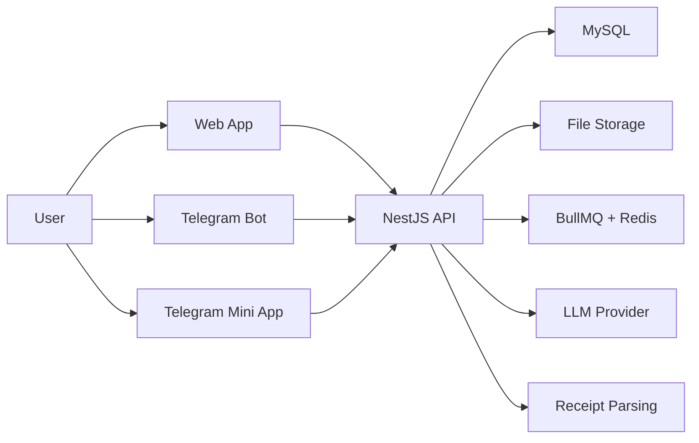
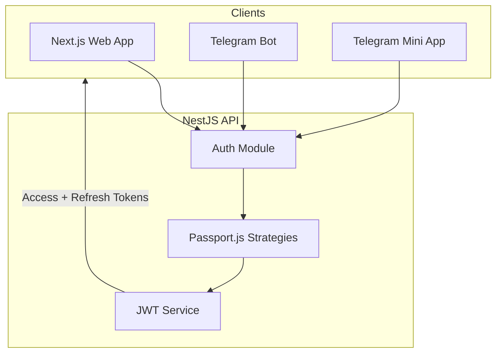
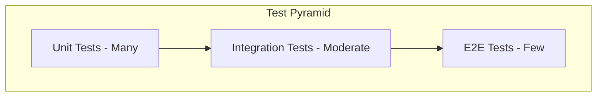
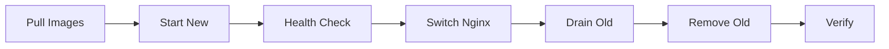
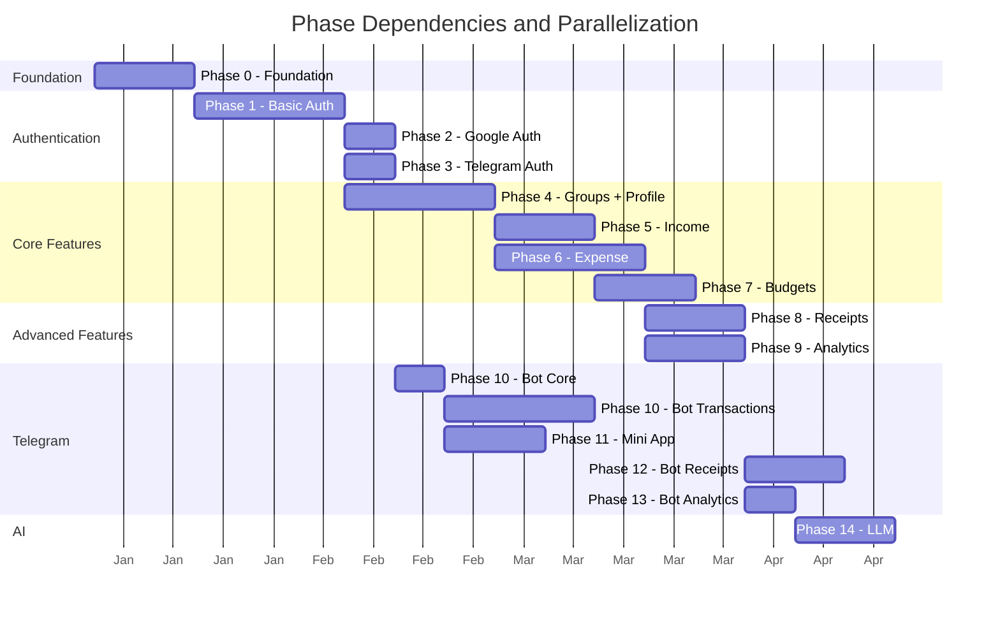

# Implementation Plan: Personal/Family Finance Management Application

## 1. Overview

### Project Description
This plan describes an incremental, deployable implementation roadmap for a personal/family finance management platform spanning a web app, Telegram bot, and Telegram mini app. The scope includes multi-provider authentication with API-first JWT architecture, group management, income/expense tracking (including loans, mortgages, and installment plans with configurable interest and payment counts), budgets and spending targets, receipt ingestion, analytics, and LLM-assisted insights. The system targets a single dedicated Ubuntu server with Docker-based environments and GitHub Actions CI/CD.

### Recommended Technology Stack (Target Environment: Dedicated Ubuntu + Docker)
| Layer | Recommendation | Notes |
|---|---|---|
| Frontend (Web) | Next.js + TypeScript | SSR, routing, thin auth client |
| Frontend i18n | next-intl | Localization for web, RTL support |
| Backend API | NestJS + TypeScript | Modular architecture, DTO validation, JWT auth |
| Database | MySQL + Prisma | Migrations, type-safe queries |
| Authentication | Passport.js (NestJS) | JWT access + refresh tokens, all auth via API |
| Currency Handling | dinero.js | Safe money arithmetic, amounts stored as integer cents |
| File Storage | Local filesystem | Optional future move to S3 |
| Receipt Processing | URL ingestion early, LLM extraction for PDFs/photos later | LLM in Phase 14 |
| Queue | BullMQ + Redis | Async parsing, analytics jobs, recurring transactions |
| Telegram | grammy.js | Bot + mini app hooks |
| Telegram i18n | @grammyjs/fluent | Bot message localization |
| LLM | OpenAI API | Structured output for receipts |
| API Documentation | @nestjs/swagger | Auto-generated OpenAPI docs |
| E2E Testing | Playwright | Web E2E tests, visual regression |
| Integration Testing | Testcontainers | Isolated MySQL for API tests |
| CI/CD | GitHub Actions | Lint/test/build/deploy |
| Hosting | Docker Compose + Nginx | Dedicated Ubuntu server |

### Architecture Overview (Mermaid)


### Authentication Architecture (API-First)
All clients authenticate against the NestJS API. The API issues JWT tokens (access + refresh).



## 2. Local Development Guide
### Prerequisites
- Node.js (LTS)
- pnpm (package manager)
- Docker + Docker Compose
- MySQL client tools (optional for local inspection)

### Environment Setup
- Copy env templates into `.env` files for web, API, and services
- Configure database credentials and API secrets
- Run database migrations and seed data

### Running the Stack Locally
- Start all services: `docker compose up`
- Start a single service in dev mode: `pnpm --filter <service> dev`
- Restart a single service: `docker compose restart <service>`

### Tests (Local)
- Unit tests: `pnpm run test:unit`
- Integration tests: `pnpm run test:integration`
- E2E tests: `pnpm run test:e2e`

### Database Seeding
- Seed initial data: `pnpm run db:seed`
- Reset + seed: `pnpm run db:reset`

### Service-Specific Development
- Run API only: `pnpm --filter api dev`
- Run web only: `pnpm --filter web dev`
- Run bot only: `pnpm --filter bot dev`

## 3. Cross-Cutting Concerns

### 3.1 Currency Handling
All monetary values follow these conventions:
- **Storage**: Amounts stored as integer cents (e.g., $10.50 = 1050)
- **Currency Field**: Every transaction includes ISO 4217 currency code
- **Arithmetic**: Use `dinero.js` for all money calculations
- **User Profile**: Default currency stored in user preferences
- **Display**: Currency formatting based on user locale

### 3.2 Pagination Strategy
All list endpoints support cursor-based pagination:
- **Standard DTOs**: Defined in `packages/shared`
- **Response Envelope**: `{ data: T[], cursor: string, hasMore: boolean }`
- **Cursor Format**: Opaque base64-encoded cursor
- **Default Page Size**: 20 items, max 100

### 3.3 Database Indexing Strategy
Every schema migration must include index analysis:
- **Composite Indexes**: `(user_id, created_at)`, `(group_id, category_id)`, `(store_id, product_id, date)`
- **Foreign Keys**: All relationship columns indexed
- **Query Patterns**: Indexes designed for common query patterns
- **Documentation**: Each phase notes specific indexes required

### 3.4 Error Handling Strategy
- **NestJS**: Global exception filter with standardized error codes
- **Frontend**: React error boundary + toast notification system
- **External APIs**: Retry middleware with exponential backoff
- **Circuit Breaker**: Pattern for Google, Telegram, OpenAI services
- **Transactions**: Partial save handling, explicit rollbacks

### 3.5 Testing Strategy

#### Test Pyramid
Follow the test pyramid principle to balance coverage and execution speed:



| Test Type | Quantity | Focus | Tools |
|---|---|---|---|
| Unit Tests | Many (~70%) | Business logic, utilities, pure functions | Jest, Vitest |
| Integration Tests | Moderate (~25%) | API endpoints, database operations, service interactions | NestJS Testing Module, Testcontainers |
| E2E Tests | Few (~5%) | Critical user flows, smoke tests | Playwright |

#### E2E Test Framework
- **Framework**: Playwright for web E2E tests
- **Setup**: Add to Phase 0.2 scaffolding
- **Scope**: Login flows, transaction creation, core user journeys
- **Configuration**: Headless CI mode, headed local debugging

#### API Integration Testing
- **Framework**: NestJS Testing Module
- **Database**: Testcontainers for isolated MySQL instances per test suite
- **Fixtures**: Factory functions for test data generation
- **Cleanup**: Transaction rollback or database reset between tests

#### Test Coverage Thresholds
| Category | Threshold | Enforcement |
|---|---|---|
| Business Logic (services, utils) | 80% minimum | CI fails if below |
| Overall Codebase | 60% minimum | CI warns if below |
| New Code (PR diff) | 70% minimum | PR check |

Coverage enforced via `jest --coverage` with thresholds in `jest.config.js`:
```javascript
coverageThreshold: {
  global: { branches: 60, functions: 60, lines: 60, statements: 60 },
  './src/services/**': { branches: 80, functions: 80, lines: 80, statements: 80 }
}
```

#### Visual Regression Testing
- **Tool**: Playwright visual snapshots
- **Scope**: Analytics dashboards, charts, complex UI components
- **Baseline**: Stored in repository, updated intentionally
- **CI Integration**: Compare screenshots on PR, block on unexpected changes

#### Load Testing (Optional - Late Phases)
- **Tool**: k6 or Artillery
- **Scope**: High-traffic endpoints (transaction list, analytics API)
- **Thresholds**: p95 response time < 500ms, error rate < 1%
- **Schedule**: Pre-release performance validation

#### Contract Testing (Optional)
- **Tool**: Pact
- **Scope**: API contracts between frontend and backend
- **Use Case**: Prevent breaking changes when API evolves

#### Testing in CI Pipeline
```yaml
test:
  stage: test
  script:
    - pnpm run test:unit --coverage
    - pnpm run test:integration
    - pnpm run test:e2e
  coverage:
    report:
      coverage_format: cobertura
      path: coverage/cobertura-coverage.xml
```

### 3.6 Internationalization (i18n) Plan

Full localization can be deferred, but the foundation should be set early to avoid costly refactoring.

#### Web Application
- **Framework**: `next-intl` or `react-i18next` for Next.js
- **String storage**: All user-facing strings in translation JSON files from the start
- **Default locale**: English (en), with Hebrew (he) as second target
- **File structure**: `locales/en.json`, `locales/he.json` per module

#### Telegram Bot
- **Framework**: `@grammyjs/fluent` (grammy fluent plugin) for message localization
- **String storage**: Fluent `.ftl` files per locale
- **User preference**: Respect user locale setting for bot responses

#### User Profile Schema
- Add `locale` preference field to user profile (Phase 4B)
- Default to browser/Telegram client locale on first login
- Allow manual override in profile settings

#### RTL Layout Support
- **CSS**: Use `dir="rtl"` attribute and CSS logical properties (`margin-inline-start` instead of `margin-left`)
- **Components**: Ensure all UI components support bidirectional text
- **Testing**: Include RTL visual regression tests for Hebrew locale

#### Implementation Timeline
| Phase | i18n Action |
|---|---|
| Phase 0 | Install i18n library, configure locale files, set up extraction tooling |
| Phase 1 | Wrap auth UI strings in translation functions |
| Phase 4B | Add `locale` field to user profile schema |
| Ongoing | All new UI strings use translation keys, never hardcoded |
| Late | Full Hebrew translation, RTL layout pass |

## 4. Security Architecture

### 4.1 Authentication Security
- JWT access tokens: 15-minute expiry
- JWT refresh tokens: 7-day expiry, stored in httpOnly cookie
- Token rotation on refresh
- Secure cookie settings: httpOnly, secure, sameSite=strict

### 4.2 CSRF Protection
- SameSite=strict cookies for session/refresh tokens
- CSRF tokens for custom form endpoints
- Origin/Referer header validation

### 4.3 XSS Prevention
- Helmet middleware in NestJS (Content Security Policy)
- Input sanitization on all user content
- Output encoding in templates

### 4.4 Input Validation
- NestJS class-validator on all DTOs
- Whitelist validation (strip unknown properties)
- Custom validators for business rules

### 4.5 File Upload Security
- Maximum file size limits (10MB for receipts)
- MIME type validation (whitelist approach)
- File storage outside web root
- Virus scanning (optional, future)

### 4.6 API Rate Limiting
- @nestjs/throttler on all endpoints
- Stricter limits on auth endpoints (5 requests/minute)
- IP-based and user-based rate limiting

### 4.7 Audit Logging
- All authentication events logged
- Permission changes logged
- Financial data modifications logged
- Log retention policy: 90 days

### 4.8 Data Encryption
- TLS in transit (HTTPS required)
- Sensitive fields encrypted at rest (optional, future)
- Database connection encryption

## 5. Phases and Iterations (Micro-Iterations)
Each iteration is deployable, includes tests, and expands CI/CD coverage. Order follows the required sequence.

**Iteration count summary**: Phase 0 (8), Phase 1 (12), Phase 2 (4), Phase 3 (4), Phase 4 (14), Phase 5 (10), Phase 6 (13), Phase 7 (10), Phase 8 (8), Phase 9 (8), Phase 10-Core (4), Phase 10-Transactions (12), Phase 11 (10), Phase 12 (8), Phase 13 (4), Phase 14 (8). **Total: 127 iterations.**

### Phase Size Guidelines
| Phase | Iterations | Size Category | Notes |
|---|---|---|---|
| Phase 0: Foundation | 8 | Medium | Infrastructure setup, one-time |
| Phase 1: Basic Auth | 12 | Medium-Large | Core feature, granular for security |
| Phase 2: Google Auth | 4 | Small | OAuth integration |
| Phase 3: Telegram Auth | 4 | Small | Widget integration |
| Phase 4: Groups + Profile | 8 + 6 | Medium | Groups (4.1-4.8) + Profile sub-section (4.9-4.14) |
| Phase 5: Income | 10 | Medium | Core transaction type |
| Phase 6: Expense | 13 | Medium-Large | More complex with loans/installments |
| Phase 7: Budgets | 10 | Medium | Depends on income/expense |
| Phase 8: Receipts | 8 | Medium | File handling complexity |
| Phase 9: Analytics | 8 | Medium | Dashboard and charts |
| Phase 10: Telegram Bot | 4 + 12 | Large | Split: Core (10.1-10.4) + Transactions (10.5-10.9) |
| Phase 11: Mini App | 10 | Medium | Mobile-first interface |
| Phase 12: Bot Receipts | 8 | Medium | Photo and URL processing |
| Phase 13: Bot Analytics | 4 | Small | Summary commands |
| Phase 14: LLM | 8 | Medium | AI integration |

**Target phase size**: 6-10 iterations recommended. Larger phases are split into logical sub-sections.

### Phase 0: Foundation (MVP Setup)
| Iteration | Objective | Scope | Testing | CI/CD | Deployment | Acceptance Criteria |
|---|---|---|---|---|---|---|
| 0.1 | Local dev readiness | Docker Compose, env templates, seed data | Local `pnpm test`, lint | lint + typecheck + unit | Deploy dev stack | Dev stack runs with docs |
| 0.2 | Project scaffolding | Monorepo structure, shared libs, API versioning `/api/v1/`, @nestjs/swagger setup, Playwright E2E config, Testcontainers setup | Smoke tests | lint + typecheck + unit | Deploy empty services | Repo builds end-to-end, OpenAPI docs accessible, Playwright runs sample test |
| 0.3 | Shared DTOs | Pagination DTOs, error response DTOs, currency types in `packages/shared` | Unit tests | lint + typecheck + unit | N/A | Shared types importable across packages |
| 0.4 | Baseline CI | Lint, typecheck, unit tests | CI checks | lint + typecheck + unit | N/A | PRs blocked on CI |
| 0.5 | Basic CD | Staging deploy, env config | Staging smoke test | lint + typecheck | Deploy to staging | Staging reachable |
| 0.6 | Backup strategy | Automated DB backup config, restore test, CI verification job, backup age alerting | Restore dry-run test with real backup | lint + typecheck + integration | Deploy backup jobs | Backups verified and restorable, alert if backup older than 26 hours |
| 0.7 | Observability baseline | Structured logging, health checks, metrics, error tracking | Health check tests | lint + typecheck + integration | Deploy observability config | Health + logs visible |
| 0.8 | Rate limiting setup | @nestjs/throttler configuration, global rate limits | Rate limit tests | lint + typecheck + unit | Deploy | Rate limiting active |

### Phase 1: Basic Authentication (API-First JWT)
| Iteration | Objective | Scope | Testing | CI/CD | Deployment | Acceptance Criteria |
|---|---|---|---|---|---|---|
| 1.1 | User schema | Users table with currency preferences, migrations | Migration test | lint + typecheck + unit | Apply in staging | Schema applied |
| 1.2 | Registration API | NestJS registration endpoint with class-validator | Unit + API tests | lint + typecheck + integration | Deploy API | Registration works |
| 1.3 | Password hashing | Argon2 hashing + validation strategy | Unit tests | lint + typecheck + unit | Deploy API | Passwords validated |
| 1.4 | Login API | NestJS login endpoint, Passport local strategy | Unit + API tests | lint + typecheck + integration | Deploy API | Login works |
| 1.5 | JWT issuance | Access token (15min) + refresh token (7d) generation | Unit tests | lint + typecheck + unit | Deploy API | Tokens issued correctly |
| 1.6 | Token refresh API | Refresh endpoint, token rotation | Unit + API tests | lint + typecheck + integration | Deploy API | Token refresh works |
| 1.7 | Login UI | Next.js login page, API client | UI smoke | lint + typecheck + unit | Deploy web | Login page renders with email/password fields, submit button, and links to registration and OAuth providers |
| 1.8 | Registration UI | Next.js registration page | UI smoke | lint + typecheck + unit | Deploy web | Registration page renders with name, email, password, confirm password fields, and validation error messages |
| 1.9 | Frontend auth integration | JWT storage, auto-refresh, auth context | E2E smoke | full suite | Deploy both | User can login |
| 1.10 | Protected routes | NestJS JWT guards, frontend route guards | E2E guarded flows | full suite | Deploy | Unauthorized blocked |
| 1.11 | Error handling | Global exception filter, React error boundary, toast system, error logging | Error scenario tests | lint + typecheck + integration | Deploy | Errors handled gracefully |
| 1.12 | Auth rate limiting | Strict rate limits on auth endpoints (5/min) | Rate limit tests | lint + typecheck + unit | Deploy | Auth endpoints protected |

### Phase 2: Google Authentication
| Iteration | Objective | Scope | Testing | CI/CD | Deployment | Acceptance Criteria |
|---|---|---|---|---|---|---|
| 2.1 | OAuth setup | Google OAuth app config, Passport Google strategy | Manual test | lint + typecheck | Deploy | OAuth callback ok |
| 2.2 | Backend integration | Google OAuth flow in NestJS, JWT issuance after OAuth | Unit tests | lint + typecheck + unit | Deploy | Google login returns JWT |
| 2.3 | Google button | UI button + UX | UI test | lint + typecheck + unit | Deploy | Button initiates flow |
| 2.4 | Account linking | Link existing users via email match | Integration test | lint + typecheck + integration | Deploy | Link without duplicates |

### Phase 3: Telegram Authentication
| Iteration | Objective | Scope | Testing | CI/CD | Deployment | Acceptance Criteria |
|---|---|---|---|---|---|---|
| 3.1 | Login widget | Telegram login widget setup | Manual test | lint + typecheck | Deploy | Widget appears |
| 3.2 | Backend verify | Telegram auth verification in NestJS, JWT issuance | Unit tests | lint + typecheck + unit | Deploy | Verified login returns JWT |
| 3.3 | Login UI | Telegram login button | UI test | lint + typecheck + unit | Deploy | Login works |
| 3.4 | Account linking | Link Telegram user to existing account | Integration test | lint + typecheck + integration | Deploy | Accounts linked |

### Phase 4: Family/Group Management

#### 4A: Group Management (Iterations 4.1–4.8)
| Iteration | Objective | Scope | Testing | CI/CD | Deployment | Acceptance Criteria |
|---|---|---|---|---|---|---|
| 4.1 | Group schema | Groups, memberships tables with indexes | Migration tests | lint + typecheck + unit | Deploy | Schema applied |
| 4.2 | Create API | Create group endpoint | Unit tests | lint + typecheck + unit | Deploy | Group created |
| 4.3 | Create UI | Group creation UI | UI tests | lint + typecheck + unit | Deploy | UI creates group |
| 4.4 | Invite API | Invite tokens | Unit tests | lint + typecheck + unit | Deploy | Invite generated |
| 4.5 | Accept invite | Join flow | Integration test | lint + typecheck + integration | Deploy | Member joins |
| 4.6 | Group dashboard | Basic view | UI tests | lint + typecheck + unit | Deploy | Dashboard displays group name, member list, recent transactions, and total balance |
| 4.7 | Member management | List/remove members | E2E tests | full suite | Deploy | Members managed |
| 4.8 | Roles/permissions | Admin/member roles with audit logging | Permission tests | lint + typecheck + unit | Deploy | Access enforced |

#### 4B: User Profile Management (Iterations 4.9–4.14)
| Iteration | Objective | Scope | Testing | CI/CD | Deployment | Acceptance Criteria |
|---|---|---|---|---|---|---|
| 4.9 | Profile view | User profile page with avatar, name, email, timezone, default currency, and locale | UI tests | lint + typecheck + unit | Deploy | Profile page displays all user settings with edit buttons |
| 4.10 | Profile edit | Name, timezone, default currency, locale preferences | Integration tests | lint + typecheck + integration | Deploy | Profile updates saved and reflected immediately in UI |
| 4.11 | Password change | Change password flow with current password validation | Integration tests | lint + typecheck + integration | Deploy | Password updated with confirmation email sent |
| 4.12 | Account deletion | GDPR-compliant deletion with cascade | E2E tests | full suite | Deploy | Account and all associated data permanently removed |
| 4.13 | Data export | JSON/CSV export of all user data | Integration tests | lint + typecheck + integration | Deploy | Export contains transactions, groups, categories, and settings |
| 4.14 | Export UI | Profile page download button | UI tests | lint + typecheck + unit | Deploy | Download initiates and completes with progress indicator |

### Phase 5: Income Management
| Iteration | Objective | Scope | Testing | CI/CD | Deployment | Acceptance Criteria |
|---|---|---|---|---|---|---|
| 5.1 | Income schema | Incomes table with currency field (ISO 4217), amount as cents, indexes on (user_id, created_at) | Migration tests | lint + typecheck + unit | Deploy | Schema applied |
| 5.2 | Categories | Predefined/custom income categories | Unit tests | lint + typecheck + unit | Deploy | Categories usable |
| 5.3 | Add API | Create income endpoint with currency validation | API tests | lint + typecheck + integration | Deploy | Income saved |
| 5.4 | Add UI | Income form with currency selector | UI tests | lint + typecheck + unit | Deploy | Income created |
| 5.5 | Types | Recurring/limited income types | Unit tests | lint + typecheck + unit | Deploy | Types supported |
| 5.6 | List API + UI | List incomes with pagination | E2E tests | full suite | Deploy | Lists shown with cursor pagination |
| 5.7 | Edit/delete | Update endpoints | API tests | lint + typecheck + integration | Deploy | CRUD works |
| 5.8 | Attribution | Personal vs group income | Integration tests | lint + typecheck + integration | Deploy | Attribution enforced |
| 5.9 | Recurring engine | BullMQ cron-based scheduler for recurring income generation; support daily, weekly, biweekly, monthly, quarterly, annual frequencies; auto-generation with user notification; handling of missed/late recurring transactions with catch-up logic | Integration tests | lint + typecheck + integration | Deploy | Recurring incomes auto-created on schedule; missed transactions detected and generated; user notified of each auto-created income |
| 5.10 | Audit logging | Log all income modifications | Unit tests | lint + typecheck + unit | Deploy | Modifications logged |

### Phase 6: Expense Management
| Iteration | Objective | Scope | Testing | CI/CD | Deployment | Acceptance Criteria |
|---|---|---|---|---|---|---|
| 6.1 | Expense schema | Expenses table with currency field, amount as cents, indexes | Migration tests | lint + typecheck + unit | Deploy | Schema applied |
| 6.2 | Categories | Predefined/custom expense categories | Unit tests | lint + typecheck + unit | Deploy | Categories usable |
| 6.3 | Add API | Create expense endpoint with currency validation | API tests | lint + typecheck + integration | Deploy | Expense saved |
| 6.4 | Add UI | Expense form with currency support | UI tests | lint + typecheck + unit | Deploy | Expense created |
| 6.5 | Auto-categorize | Rules-based categorization | Unit tests | lint + typecheck + unit | Deploy | Rules applied |
| 6.6 | List API + UI | List expenses with cursor pagination | E2E tests | full suite | Deploy | Lists shown |
| 6.7 | Edit/delete | Update endpoints | API tests | lint + typecheck + integration | Deploy | CRUD works |
| 6.8 | Attribution | Personal vs group expense | Integration tests | lint + typecheck + integration | Deploy | Attribution enforced |
| 6.9 | Loans & mortgages | Principal, interest, schedule | Unit tests | lint + typecheck + unit | Deploy | Loan expenses supported |
| 6.10 | Installments | Zero or custom interest, payments count | Integration tests | lint + typecheck + integration | Deploy | Installments tracked |
| 6.11 | Remember choice | Last classification preference | Unit tests | lint + typecheck + unit | Deploy | Defaults applied |
| 6.12 | Recurring expenses | BullMQ cron-based scheduler for recurring expense generation; reuse recurring engine from 5.9; support daily, weekly, biweekly, monthly, quarterly, annual frequencies; auto-generation with user notification; missed/late transaction catch-up | Integration tests | lint + typecheck + integration | Deploy | Recurring expenses auto-created on schedule; missed transactions detected and generated; user notified of each auto-created expense |
| 6.13 | Audit logging | Log all expense modifications | Unit tests | lint + typecheck + unit | Deploy | Modifications logged |

### Phase 7: Budgets & Spending Targets
| Iteration | Objective | Scope | Testing | CI/CD | Deployment | Acceptance Criteria |
|---|---|---|---|---|---|---|
| 7.1 | Budget schema | Budgets/targets table with personal + group scope, timeframe, currency | Migration tests | lint + typecheck + unit | Deploy | Schema applied |
| 7.2 | Create target API | CRUD endpoints for spending targets | API tests | lint + typecheck + integration | Deploy | Target created |
| 7.3 | Create target UI | Target creation form with amount, timeframe | UI tests | lint + typecheck + unit | Deploy | UI creates target |
| 7.4 | List/edit targets | Target list and edit functionality | E2E tests | full suite | Deploy | Targets manageable |
| 7.5 | Progress tracking | Calculate progress percentage against expenses | Integration tests | lint + typecheck + integration | Deploy | Progress accurate |
| 7.6 | Personal dashboard | Dashboard with budget overview, progress bars | UI tests | lint + typecheck + unit | Deploy | Dashboard displays each budget with name, amount, spent, remaining, and progress bar with percentage |
| 7.7 | Group targets | Group-scoped budgets and targets | Integration tests | lint + typecheck + integration | Deploy | Group members can create, view, and track shared budget targets |
| 7.8 | Group dashboard | Group budget overview | UI tests | lint + typecheck + unit | Deploy | Group dashboard displays shared budgets with per-member contribution breakdown |
| 7.9 | Alert configuration | Threshold alerts, low balance warnings | Integration tests | lint + typecheck + integration | Deploy | Alerts configurable |
| 7.10 | Due payment reminders | Reminder scheduling for upcoming payments | Integration tests | lint + typecheck + integration | Deploy | Reminders scheduled |

### Phase 8: Receipt Processing
| Iteration | Objective | Scope | Testing | CI/CD | Deployment | Acceptance Criteria |
|---|---|---|---|---|---|---|
| 8.1 | File infra | Local storage paths, security constraints (outside web root) | Unit tests | lint + typecheck + unit | Deploy | Files stored securely |
| 8.2 | Upload API | Receipt upload endpoint with MIME validation, size limits (10MB) | API tests | lint + typecheck + integration | Deploy | Upload works |
| 8.3 | Upload UI | Drag-and-drop UI | UI tests | lint + typecheck + unit | Deploy | UI uploads |
| 8.4 | URL ingestion | URL receipt input | Integration tests | lint + typecheck + integration | Deploy | URL saved |
| 8.5 | OCR parsing | Tesseract OCR for images | Unit tests | lint + typecheck + unit | Deploy | OCR fields extracted |
| 8.6 | Expense from receipt | Create expense flow with currency detection | E2E tests | full suite | Deploy | Expense created |
| 8.7 | PDF support | PDF upload handling | Integration tests | lint + typecheck + integration | Deploy | PDF accepted |
| 8.8 | URL scraping | URL scraping for online receipts with retry/circuit breaker | Unit tests | lint + typecheck + unit | Deploy | HTML parsed |

### Phase 9: Purchase Analytics
| Iteration | Objective | Scope | Testing | CI/CD | Deployment | Acceptance Criteria |
|---|---|---|---|---|---|---|
| 9.1 | Stores model | Stores table with indexes | Migration tests | lint + typecheck + unit | Deploy | Schema applied |
| 9.2 | Goods tracking | Purchased items model | Unit tests | lint + typecheck + unit | Deploy | Items stored |
| 9.3 | Analytics API | Spending by category/time with pagination | API tests | lint + typecheck + integration | Deploy | API returns spending-by-category, spending-by-month, and top-merchants aggregations with correct totals |
| 9.4 | Dashboard UI | Analytics UI with charts | UI tests | lint + typecheck + unit | Deploy | Spending-by-category pie chart and monthly trend line chart render with responsive layout and currency formatting |
| 9.5 | Price history | History model with indexes (store_id, product_id, date) | Unit tests | lint + typecheck + unit | Deploy | Price history records saved with store, product, date, and amount |
| 9.6 | Price charts | Trends UI | UI tests | lint + typecheck + unit | Deploy | Price trend line chart shows historical prices per product with date range selector |
| 9.7 | Store analytics | Store breakdown | API tests | lint + typecheck + integration | Deploy | API returns per-store spending totals, visit counts, and average transaction amount |
| 9.8 | Group analytics | Group aggregate with member breakdown | Integration tests | lint + typecheck + integration | Deploy | Group analytics shows total group spending with per-member contribution percentages and category breakdown |

### Phase 10: Telegram Bot

#### 10A: Bot Core (Iterations 10.1–10.4)
Setup, commands, and user account linking.

| Iteration | Objective | Scope | Testing | CI/CD | Deployment | Acceptance Criteria |
|---|---|---|---|---|---|---|
| 10.1 | Bot setup | Bot registration with BotFather, webhook configuration | Manual test | lint + typecheck | Deploy | Bot responds to /start with welcome message |
| 10.2 | Framework | grammy.js app with middleware, session, error handling | Unit tests | lint + typecheck + unit | Deploy | Bot process runs and handles errors gracefully |
| 10.3 | Commands | /start /help with command descriptions | Manual test | lint + typecheck | Deploy | Commands respond with formatted help text |
| 10.4 | User linking | Link accounts via JWT validation, /link command | Integration test | lint + typecheck + integration | Deploy | User can link Telegram to existing web account |

#### 10B: Bot Transactions (Iterations 10.5–10.9)
Expense/income flows and notifications.

| Iteration | Objective | Scope | Testing | CI/CD | Deployment | Acceptance Criteria |
|---|---|---|---|---|---|---|
| 10.5 | Balance command | Summary balance with currency formatting | Unit tests | lint + typecheck + unit | Deploy | /balance shows total income, expenses, and net balance |
| 10.6a | Expense flow init | `/expense` command initialization | Integration tests | lint + typecheck + integration | Deploy | Flow starts with amount prompt |
| 10.6b | Amount parsing | Parse amount from message with currency detection | Unit tests | lint + typecheck + unit | Deploy | Amount and currency extracted from input like "50.00 USD" |
| 10.6c | Category selection | Inline keyboard category choice | Integration tests | lint + typecheck + integration | Deploy | Category selected via inline buttons |
| 10.6d | Description input | Optional description prompt | Integration tests | lint + typecheck + integration | Deploy | Description captured or skipped |
| 10.6e | Confirm + save | Confirmation and save | Integration tests | lint + typecheck + integration | Deploy | Expense saved with confirmation message |
| 10.7a | Income flow init | `/income` command initialization | Integration tests | lint + typecheck + integration | Deploy | Flow starts with amount prompt |
| 10.7b | Amount/source parsing | Amount and source parsing | Unit tests | lint + typecheck + unit | Deploy | Amount and source extracted correctly |
| 10.7c | Income type selection | Inline keyboard type choice (one-time/recurring) | Integration tests | lint + typecheck + integration | Deploy | Type selected via inline buttons |
| 10.7d | Confirm + save | Confirmation and save | Integration tests | lint + typecheck + integration | Deploy | Income saved with confirmation message |
| 10.8 | Recent txns | Last transactions via /recent command | API tests | lint + typecheck + integration | Deploy | Last 10 transactions shown with amount, category, date |
| 10.9 | Notifications | Due payment and low balance alerts via Telegram | Integration tests | lint + typecheck + integration | Deploy | Alerts sent to linked users when thresholds triggered |

### Phase 11: Telegram Mini App (Expanded)
| Iteration | Objective | Scope | Testing | CI/CD | Deployment | Acceptance Criteria |
|---|---|---|---|---|---|---|
| 11.1 | Mini app setup | Mini app project scaffolding | Smoke tests | lint + typecheck + unit | Deploy | Mini app builds |
| 11.2 | Mini app auth | Link mini app session to main account via JWT | Integration tests | lint + typecheck + integration | Deploy | Account linked |
| 11.3 | Mini app UI shell | Dashboard layout + navigation | UI tests | lint + typecheck + unit | Deploy | Dashboard renders with bottom navigation, balance summary card, and recent activity list |
| 11.4 | Expense entry | Mini app expense form with currency | Integration tests | lint + typecheck + integration | Deploy | Expense form submits with amount, category picker, and optional note; saved to backend |
| 11.5 | Income entry | Mini app income form | Integration tests | lint + typecheck + integration | Deploy | Income form submits with amount, source, type, and optional note; saved to backend |
| 11.6 | Analytics views | Spending analytics in mini app | UI tests | lint + typecheck + unit | Deploy | Mini app shows spending-by-category chart and monthly totals with period selector |
| 11.7 | Receipt upload | Photo upload from mini app | Integration tests | lint + typecheck + integration | Deploy | Camera/gallery photo captured, uploaded, and receipt record created with file reference |
| 11.8 | Budget/target view | Budget management in mini app | UI tests | lint + typecheck + unit | Deploy | Budget list shows each target with progress bar, spent/remaining amounts, and timeframe |
| 11.9 | Group/family view | Group balances and members | Integration tests | lint + typecheck + integration | Deploy | Group view displays group name, member avatars, shared balance, and recent group transactions |
| 11.10 | Group member expenses | View expenses by group member | Integration tests | lint + typecheck + integration | Deploy | Member breakdown visible |

### Phase 12: Telegram Bot - Receipt Processing (Photo + URL)
| Iteration | Objective | Scope | Testing | CI/CD | Deployment | Acceptance Criteria |
|---|---|---|---|---|---|---|
| 12.1 | URL handling | URL receipt ingestion via bot | Integration tests | lint + typecheck + integration | Deploy | URL stored |
| 12.2 | URL parsing | Parse receipt from URL | Unit tests | lint + typecheck + unit | Deploy | Parsed fields |
| 12.3 | Photo handling | Receive photo from Telegram, download and store file | Integration tests | lint + typecheck + integration | Deploy | Photo stored |
| 12.4 | Photo OCR | Photo → OCR extraction pipeline (reuse Phase 8 OCR) | Unit tests | lint + typecheck + unit | Deploy | OCR fields extracted |
| 12.5 | Confirmation flow (URL) | Review flow for URL receipts | E2E tests | full suite | Deploy | User confirms |
| 12.6 | Confirmation flow (photo) | Review flow for photo receipts, show extracted data | E2E tests | full suite | Deploy | User confirms extracted data |
| 12.7 | Quick create (URL) | Expense creation from URL | E2E tests | full suite | Deploy | Expense created |
| 12.8 | Quick create (photo) | Expense creation from confirmed photo data | E2E tests | full suite | Deploy | Expense created |

### Phase 13: Telegram Bot - Analytics
| Iteration | Objective | Scope | Testing | CI/CD | Deployment | Acceptance Criteria |
|---|---|---|---|---|---|---|
| 13.1 | Summary command | Quick stats with currency formatting | API tests | lint + typecheck + integration | Deploy | /stats returns total income, total expenses, net balance, and top 3 expense categories for current month |
| 13.2 | Category breakdown | Breakdown view | API tests | lint + typecheck + integration | Deploy | /breakdown shows per-category spending with amounts and percentages, formatted as readable table |
| 13.3 | Group analytics | Group stats with member breakdown | Integration tests | lint + typecheck + integration | Deploy | /groupstats shows group total, per-member contributions, and top shared expenses |
| 13.4 | Inline charts | Text or image chart | UI tests | lint + typecheck + unit | Deploy | Chart image generated and sent as photo message with spending distribution visualization |

### Phase 14: LLM Assistant
| Iteration | Objective | Scope | Testing | CI/CD | Deployment | Acceptance Criteria |
|---|---|---|---|---|---|---|
| 14.1 | LLM integration | OpenAI client + secrets, retry/circuit breaker | Unit tests | lint + typecheck + unit | Deploy | OpenAI client initialized, API key validated, retry on 429/500 errors with exponential backoff |
| 14.2 | Context prep | Summaries, budgets, currency-aware | Unit tests | lint + typecheck + unit | Deploy | Context builder produces structured prompt with user income/expense summary, budget status, and currency |
| 14.3 | Chat API | Chat endpoint | API tests | lint + typecheck + integration | Deploy | POST /chat returns streamed or complete LLM response within 10s timeout |
| 14.4 | Chat UI | UI component | UI tests | lint + typecheck + unit | Deploy | Chat widget renders with message input, conversation history, typing indicator, and error state |
| 14.5 | Personal Q&A | Personal insights | Integration tests | lint + typecheck + integration | Deploy | Answers correct |
| 14.6 | Group Q&A | Group insights | Integration tests | lint + typecheck + integration | Deploy | Answers correct |
| 14.7 | Insight generation | Recommendations | Integration tests | lint + typecheck + integration | Deploy | Insights shown |
| 14.8 | LLM receipts | LLM extraction for PDFs and photos | E2E tests | full suite | Deploy | Receipt parsed |

## 6. Suggested Technology Stack (Details)
| Layer | Recommendation | Notes |
|---|---|---|
| Frontend | Next.js + TypeScript | SSR, routing, thin auth client (no Auth.js) |
| Frontend i18n | next-intl | Localization for web, RTL support |
| Backend API | NestJS + TypeScript | Modular architecture, DTO validation, all auth logic |
| Database | MySQL + Prisma | Migrations, type-safe queries |
| Authentication | Passport.js (in NestJS) | Local + Google + Telegram strategies, JWT issuance |
| JWT | @nestjs/jwt | Access (15min) + refresh (7d) tokens |
| Currency | dinero.js | Safe money arithmetic, integer cents storage |
| File Storage | Local filesystem | Optional future move to S3 |
| Receipt Processing | URL ingestion early, LLM extraction for PDFs/photos later | LLM in Phase 14 |
| Queue | BullMQ + Redis | Async parsing, analytics jobs, recurring transactions |
| Rate Limiting | @nestjs/throttler | API and auth endpoint protection |
| API Documentation | @nestjs/swagger | Auto-generated OpenAPI docs |
| E2E Testing | Playwright | Web E2E tests, visual regression |
| Integration Testing | Testcontainers | Isolated MySQL for test suites |
| Telegram | grammy.js | Bot + mini app hooks |
| Telegram i18n | @grammyjs/fluent | Bot message localization |
| LLM | OpenAI API | Structured output for receipts |
| CI/CD | GitHub Actions | Lint/test/build/deploy |
| Hosting | Docker Compose + Nginx | Dedicated Ubuntu server |

## 7. Phase Breakdown (Summary)
This section mirrors the required order with short summaries. Detailed micro-iterations are in Section 5.

- **Phase 0**: Environment, scaffolding, CI/CD foundations, rate limiting, shared DTOs.
- **Phase 1**: Core auth (API-first JWT) + protected routes + error handling.
- **Phase 2**: Google auth integration via NestJS.
- **Phase 3**: Telegram login integration via NestJS.
- **Phase 4**: Family/group creation, invites, roles, profile management, and GDPR data export.
- **Phase 5**: Manual income tracking with currency support and recurring transactions.
- **Phase 6**: Manual expense tracking with loans/mortgages/installments and recurring transactions.
- **Phase 7**: Budgets and spending targets with progress tracking and alerts.
- **Phase 8**: Receipt upload + URL ingestion; parsing V1 with file security.
- **Phase 9**: Analytics dashboards and models.
- **Phase 10**: Telegram bot core features with notifications.
- **Phase 11**: Telegram mini app (expanded: income, analytics, receipts, budgets, group views).
- **Phase 12**: Bot receipt workflows (both URL and photo with OCR).
- **Phase 13**: Bot analytics.
- **Phase 14**: LLM assistant and LLM-based receipt extraction.

## 8. Deployment Strategy

### 8.1 Environment Overview
| Item | Strategy |
|---|---|
| Environments | dev, staging, production on Ubuntu via Docker Compose |
| Migrations | Prisma migrations in CI/CD, gated by backup |
| Feature flags | Simple DB-backed flags or env flags |
| Rollbacks | Blue-green or container rollback with versioned images |

### 8.2 Zero-Downtime Deployment Procedure

All production deployments follow this sequence to prevent service interruption:

1. **Pull new images**: `docker compose pull` to fetch latest versioned images
2. **Start new containers**: Launch new containers alongside old ones
3. **Health check**: Wait for `/health` endpoint to return 200 on new containers
4. **Switch Nginx upstream**: Update Nginx config to route traffic to new containers
5. **Drain old containers**: Wait for in-flight requests to complete (30s grace period)
6. **Remove old containers**: Stop and remove previous version containers
7. **Verify**: Run post-deploy smoke test against production



### 8.3 Database Migration Safety

Prisma migrations must follow the **expand-then-contract** pattern to maintain backward compatibility:

| Step | Action | Description |
|---|---|---|
| Expand | Add new column/table | New schema is additive, old code still works |
| Migrate | Deploy new code | New code uses new schema |
| Contract | Remove old column/table | Cleanup in a separate migration after verification |

**Rules**:
- Never rename or remove a column in the same deploy as code changes
- Always test migrations against a production-size dataset in staging
- Run `prisma migrate diff` to review SQL before applying

### 8.4 Rollback Procedure

Step-by-step documented rollback, tested periodically in CI:

1. **Identify**: Alert triggers or manual detection of deployment issue
2. **Decision**: If within 5 minutes of deploy, immediate rollback; otherwise, assess
3. **Revert Nginx**: Point upstream back to previous container version
4. **Verify old containers**: Ensure previous version still running and healthy
5. **Database**: If migration was applied, run reverse migration (must be pre-tested)
6. **Notify**: Post to Telegram/Slack channel with rollback details
7. **Post-mortem**: Document cause and prevention plan

### 8.5 Deployment Notifications

Automated notifications on deploy events:
- **Success**: Telegram/Slack webhook with version, timestamp, changelog summary
- **Failure**: Immediate alert with error details and rollback instructions
- **Rollback**: Alert with reason and affected version
- **Configuration**: Webhook URLs stored in CI secrets

### 8.6 Docker Image Optimization

Production Dockerfiles must follow these practices for minimal image size:

- **Multi-stage builds**: Separate build stage from runtime stage
- **Production deps only**: `pnpm install --frozen-lockfile --prod` in runtime stage
- **No devDependencies**: Never copy full `node_modules` with devDependencies to production
- **Minimal base image**: Use `node:20-alpine` for runtime
- **Layer caching**: Order Dockerfile commands for optimal cache reuse

Example production Dockerfile pattern:
```dockerfile
# Build stage
FROM node:20-alpine AS builder
WORKDIR /app
COPY pnpm-lock.yaml package.json ./
RUN pnpm install --frozen-lockfile
COPY . .
RUN pnpm run build

# Runtime stage
FROM node:20-alpine AS runtime
WORKDIR /app
COPY pnpm-lock.yaml package.json ./
RUN pnpm install --frozen-lockfile --prod
COPY --from=builder /app/dist ./dist
CMD ["node", "dist/main.js"]
```

### 8.7 Backup Verification Strategy

Production backups must be verified with actual data, not mock or test data:

- **CI verification job**: Scheduled nightly (or after each backup) to validate backups
- **Process**: Download latest production backup → restore to isolated test environment → run validation queries → report status
- **Validation queries**: Verify row counts, data integrity checks, latest timestamp validation
- **Backup age monitoring**: Alert if most recent backup is older than 26 hours
- **Retention**: Keep last 30 daily backups, last 12 weekly backups, last 6 monthly backups
- **Alerting**: Failed verification triggers Telegram/Slack notification immediately

### 8.8 Example CI/CD Workflow (GitHub Actions)
```yaml
name: ci
on:
  pull_request:
  push:
    branches: [main]
jobs:
  build:
    runs-on: ubuntu-latest
    steps:
      - uses: actions/checkout@v4
      - uses: pnpm/action-setup@v2
        with:
          version: 9
      - uses: actions/setup-node@v4
        with:
          node-version: 20
          cache: 'pnpm'
      - run: pnpm install --frozen-lockfile
      - run: pnpm run lint
      - run: pnpm run test
      - run: pnpm run build
  deploy:
    needs: build
    if: github.ref == 'refs/heads/main'
    runs-on: ubuntu-latest
    steps:
      - uses: actions/checkout@v4
      - name: Deploy to production
        run: ./scripts/deploy.sh
      - name: Notify success
        if: success()
        run: ./scripts/notify.sh success
      - name: Notify failure
        if: failure()
        run: ./scripts/notify.sh failure
```

## 9. Sequencing and Critical Path

### 9.1 Critical Path Overview
| Area | Critical Path Notes | Parallelization |
|---|---|---|
| Foundation | CI/CD, shared DTOs, and environment are prerequisites | Can parallelize scaffolding and basic CD |
| Auth | JWT auth before OAuth providers; NestJS handles all auth | UI and API can parallelize after schema |
| Group Mgmt | Depends on auth and user schema | Frontend and backend in parallel |
| Income/Expense | Depends on groups and auth | Income and expense modules in parallel |
| Budgets | Depends on income/expense for progress tracking | Can start schema early |
| Receipts | Depends on expenses + storage | URL ingestion can parallel with file infra |
| Analytics | Depends on income/expense models | UI can parallel with API once models done |
| Telegram Bot | Depends on auth linking | Bot commands and data access can parallel |
| Mini App | Depends on bot + auth | Can parallel with bot receipt processing |
| LLM | Depends on analytics + receipts | LLM receipt parsing last |

### 9.2 Parallelization Opportunities

The following phases can run in parallel to accelerate delivery:

| Parallel Track | Phases | Prerequisites | Notes |
|---|---|---|---|
| OAuth Providers | Phase 2 (Google) ∥ Phase 3 (Telegram) | Phase 1 complete | Both depend only on JWT auth |
| Transaction Types | Phase 5 (Income) ∥ Phase 6 (Expense) | Phase 4 complete | Independent schemas and APIs |
| Post-Expense Features | Phase 8 (Receipts) ∥ Phase 9 (Analytics) | Phase 6 complete | Receipts need expenses; Analytics needs income+expense |
| Telegram Ecosystem | Phase 10 (Bot) after Phase 3 | Telegram Auth done | Bot can start once TG auth exists |
| Mini App + Bot Features | Phase 11 (Mini App) ∥ Phase 12 (Bot Receipts) | Phase 10 Core complete | Both build on bot foundation |

### 9.3 Phase Dependency Gantt Chart



### 9.4 Recommended Parallel Execution Strategy

For a team with 2+ developers, consider these parallel tracks:

**Track A (Core Web)**:
1. Phase 0 → Phase 1 → Phase 4 → Phase 5/6 → Phase 7 → Phase 9

**Track B (Telegram + OAuth)**:
1. After Phase 1: Phase 2 + Phase 3
2. After Phase 3: Phase 10 → Phase 11 → Phase 12 → Phase 13

**Track C (Receipts + LLM)** (can join later):
1. After Phase 6: Phase 8 → Phase 14

## 10. Security and Scalability Considerations
### Security Checklist
- [ ] HTTPS with Nginx reverse proxy and TLS certificates
- [ ] JWT tokens with short expiry (15min access, 7d refresh)
- [ ] Secure cookie settings (httpOnly, secure, sameSite=strict)
- [ ] CSRF protection via SameSite cookies
- [ ] XSS prevention via Helmet middleware and CSP headers
- [ ] Rate limits on all endpoints, stricter on auth (5/min)
- [ ] Input validation with class-validator on all DTOs
- [ ] File upload security: 10MB limit, MIME validation, storage outside web root
- [ ] Audit logging for auth events and financial modifications
- [ ] Secrets in environment variables and CI secrets
- [ ] Least-privilege DB credentials
- [ ] Retry/circuit breaker for external APIs (Google, Telegram, OpenAI)

### Scalability Path
| Stage | Strategy |
|---|---|
| Phase 0-9 | Single MySQL instance |
| Phase 10+ | BullMQ for async processing |
| High scale | Read replicas, connection pooling |

## 11. Next Steps
- Confirm the plan structure and any missing constraints.
- Approve the plan to proceed with implementation mode.

---

**Plan file**: [`IMPLEMENTATION-PLAN.md`](IMPLEMENTATION-PLAN.md)

