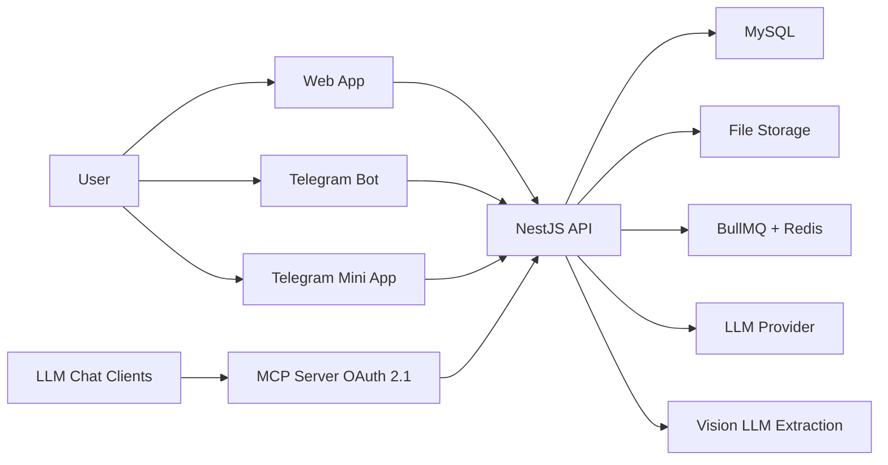
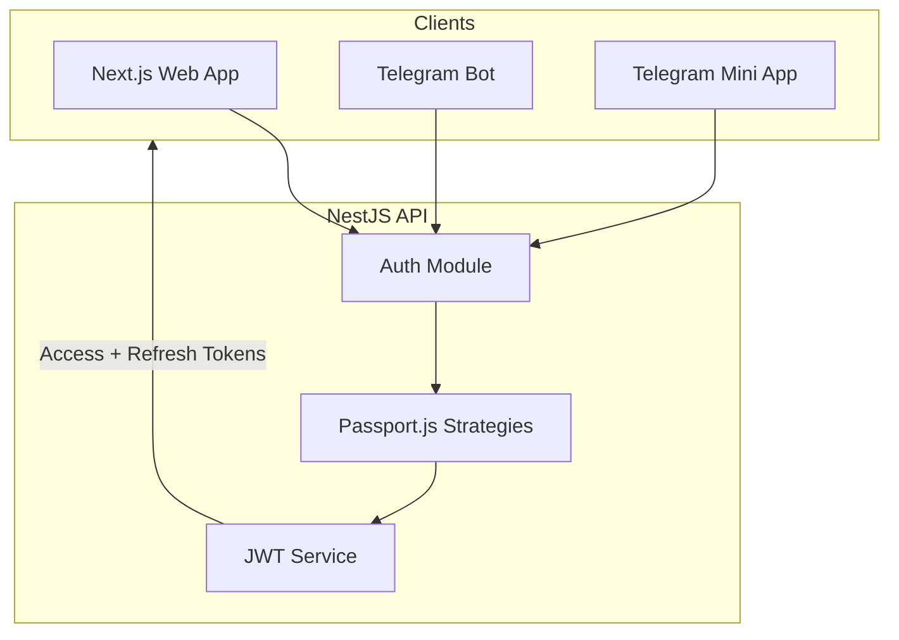
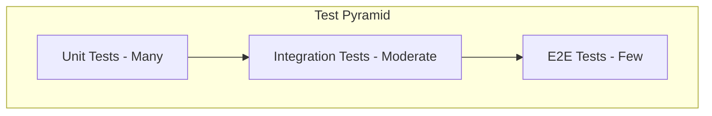
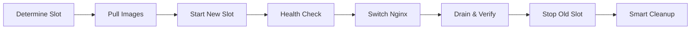
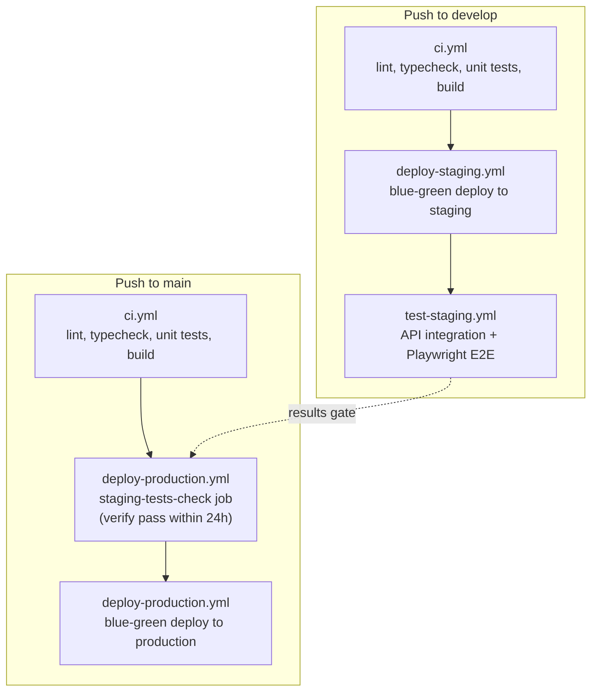
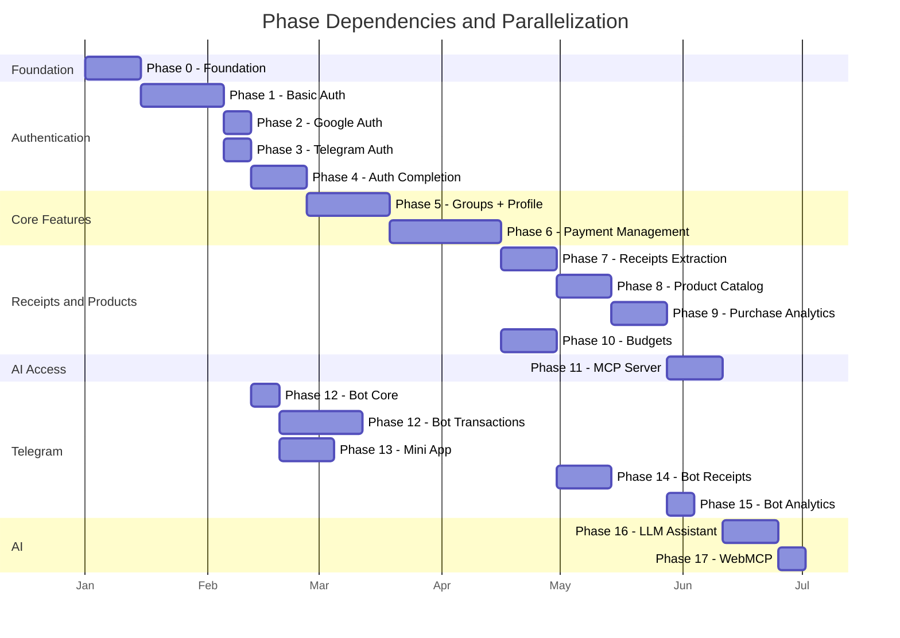

# Implementation Plan: Personal/Family Finance Management Application

## 1. Overview

### Project Description

This plan describes an incremental, deployable implementation roadmap for a personal/family finance management platform spanning a web app, Telegram bot, and Telegram mini app. The scope includes multi-provider authentication with API-first JWT architecture, group management, income/expense tracking (including loans, mortgages, and installment plans with configurable interest and payment counts), budgets and spending targets, receipt ingestion with vision-LLM extraction, a two-layer product catalog with barcode identification, configurable purchase analytics, an MCP server giving LLM chat clients secure user-scoped access to purchases, WebMCP in-GUI agent tools, and LLM-assisted insights. The system targets a single dedicated Ubuntu server with Docker-based environments and GitHub Actions CI/CD.

### Recommended Technology Stack (Target Environment: Dedicated Ubuntu + Docker)

| Layer               | Recommendation                                   | Notes                                                  |
| ------------------- | ------------------------------------------------ | ------------------------------------------------------ |
| Frontend (Web)      | Next.js + TypeScript                             | SSR, routing, thin auth client                         |
| Frontend i18n       | next-intl                                        | Localization for web, RTL support                      |
| Backend API         | NestJS + TypeScript                              | Modular architecture, DTO validation, JWT auth         |
| Database            | MySQL + Prisma                                   | Migrations, type-safe queries                          |
| Authentication      | Passport.js (NestJS)                             | JWT access + refresh tokens, all auth via API          |
| Currency Handling   | dinero.js                                        | Safe money arithmetic, amounts stored as integer cents |
| File Storage        | Local filesystem                                 | Optional future move to S3                             |
| Receipt Processing  | Vision-LLM extraction (pluggable provider)       | Structured output; photos, PDFs, URLs (Phase 7)        |
| Queue               | BullMQ + Redis                                   | Async parsing, analytics jobs, recurring transactions  |
| Telegram            | grammy.js                                        | Bot + mini app hooks                                   |
| Telegram i18n       | @grammyjs/fluent                                 | Bot message localization                               |
| LLM                 | Pluggable provider (OpenAI / Anthropic / Gemini) | Receipt extraction + assistant, structured output      |
| MCP Server          | @modelcontextprotocol/sdk (Streamable HTTP)      | OAuth 2.1: PKCE + dynamic client registration          |
| Barcode Scanning    | BarcodeDetector API + @zxing/browser fallback    | Camera via getUserMedia; barcode = product identifier  |
| Product Data        | Open Food Facts API                              | Prefill for unknown barcodes                           |
| API Documentation   | @nestjs/swagger                                  | Auto-generated OpenAPI docs                            |
| E2E Testing         | Playwright                                       | Web E2E tests, visual regression                       |
| Integration Testing | Testcontainers                                   | Isolated MySQL for API tests                           |
| CI/CD               | GitHub Actions                                   | Lint/test/build/deploy                                 |
| Hosting             | Docker Compose + Nginx                           | Dedicated Ubuntu server                                |

### Architecture Overview (Mermaid)


```mermaid
flowchart LR
  user[User] --> web[Web App]
  user --> tg[Telegram Bot]
  user --> mini[Telegram Mini App]
  web --> api[NestJS API]
  tg --> api
  mini --> api
  api --> db[MySQL]
  api --> fs[File Storage]
  api --> mq[BullMQ + Redis]
  api --> llm[LLM Provider]
  api --> vision[Vision LLM Extraction]
  chat[LLM Chat Clients] --> mcp[MCP Server OAuth 2.1]
  mcp --> api
```

### Authentication Architecture (API-First)

All clients authenticate against the NestJS API. The API issues JWT tokens (access + refresh).


```mermaid
flowchart TD
  subgraph Clients
    WEB[Next.js Web App]
    BOT[Telegram Bot]
    MINI[Telegram Mini App]
  end
  subgraph NestJS API
    AUTH[Auth Module]
    PASSPORT[Passport.js Strategies]
    JWT[JWT Service]
  end
  WEB --> AUTH
  BOT --> AUTH
  MINI --> AUTH
  AUTH --> PASSPORT
  PASSPORT --> JWT
  JWT -->|Access + Refresh Tokens| Clients
```

## 2. Local Development Guide

### Prerequisites

- Node.js (LTS)
- pnpm (package manager)
- Docker + Docker Compose
- MySQL client tools (optional for local inspection)

### Environment Setup

- Copy env templates into `.env` files for web, API, and services
- Configure database credentials and API secrets
- Run database migrations and seed data

### Running the Stack Locally

- Start all services: `docker compose up`
- Start a single service in dev mode: `pnpm --filter <service> dev`
- Restart a single service: `docker compose restart <service>`

### Tests (Local)

- Unit tests: `pnpm run test:unit`
- Integration tests: `pnpm run test:integration`
- E2E tests: `pnpm run test:e2e`

### Database Seeding

- Seed initial data: `pnpm run db:seed`
- Reset + seed: `pnpm run db:reset`

### Service-Specific Development

- Run API only: `pnpm --filter api dev`
- Run web only: `pnpm --filter web dev`
- Run bot only: `pnpm --filter bot dev`

## 3. Cross-Cutting Concerns

### 3.1 Currency Handling

All monetary values follow these conventions:

- **Storage**: Amounts stored as integer cents (e.g., $10.50 = 1050)
- **Currency Field**: Every transaction includes ISO 4217 currency code
- **Arithmetic**: Use `dinero.js` for all money calculations
- **User Profile**: Default currency stored in user preferences
- **Display**: Currency formatting based on user locale

### 3.2 Pagination Strategy

All list endpoints support cursor-based pagination:

- **Standard DTOs**: Defined in `packages/shared`
- **Response Envelope**: `{ data: T[], cursor: string, hasMore: boolean }`
- **Cursor Format**: Opaque base64-encoded cursor
- **Default Page Size**: 20 items, max 100

### 3.3 Database Indexing Strategy

Every schema migration must include index analysis:

- **Composite Indexes**: `(user_id, created_at)`, `(group_id, category_id)`, `(store_id, product_id, date)`
- **Foreign Keys**: All relationship columns indexed
- **Query Patterns**: Indexes designed for common query patterns
- **Documentation**: Each phase notes specific indexes required

### 3.4 Error Handling Strategy

- **NestJS**: Global exception filter with standardized error codes
- **Frontend**: React error boundary + toast notification system
- **External APIs**: Retry middleware with exponential backoff
- **Circuit Breaker**: Pattern for Google, Telegram, OpenAI services
- **Transactions**: Partial save handling, explicit rollbacks

### 3.5 Testing Strategy

#### Test Pyramid

Follow the test pyramid principle to balance coverage and execution speed:


```mermaid
flowchart TB
    subgraph pyramid[Test Pyramid]
        e2e[E2E Tests - Few]
        integration[Integration Tests - Moderate]
        unit[Unit Tests - Many]
    end
    unit --> integration --> e2e
```

| Test Type         | Quantity        | Focus                                                    | Tools                                 |
| ----------------- | --------------- | -------------------------------------------------------- | ------------------------------------- |
| Unit Tests        | Many (~70%)     | Business logic, utilities, pure functions                | Jest, Vitest                          |
| Integration Tests | Moderate (~25%) | API endpoints, database operations, service interactions | NestJS Testing Module, Testcontainers |
| E2E Tests         | Few (~5%)       | Critical user flows, smoke tests                         | Playwright                            |

#### E2E Test Framework

- **Framework**: Playwright for web E2E tests
- **Setup**: Add to Phase 0.2 scaffolding
- **Scope**: Login flows, transaction creation, core user journeys
- **Configuration**: Headless CI mode, headed local debugging

#### API Integration Testing

- **Framework**: NestJS Testing Module
- **Database**: Testcontainers for isolated MySQL instances per test suite
- **Fixtures**: Factory functions for test data generation
- **Cleanup**: Transaction rollback or database reset between tests

#### Test Coverage Thresholds

| Category                         | Threshold   | Enforcement       |
| -------------------------------- | ----------- | ----------------- |
| Business Logic (services, utils) | 80% minimum | CI fails if below |
| Overall Codebase                 | 60% minimum | CI warns if below |
| New Code (PR diff)               | 70% minimum | PR check          |

Coverage enforced via `jest --coverage` with thresholds in `jest.config.js`:

```javascript
coverageThreshold: {
  global: { branches: 60, functions: 60, lines: 60, statements: 60 },
  './src/services/**': { branches: 80, functions: 80, lines: 80, statements: 80 }
}
```

#### Visual Regression Testing

- **Tool**: Playwright visual snapshots
- **Scope**: Analytics dashboards, charts, complex UI components
- **Baseline**: Stored in repository, updated intentionally
- **CI Integration**: Compare screenshots on PR, block on unexpected changes

#### Load Testing (Optional - Late Phases)

- **Tool**: k6 or Artillery
- **Scope**: High-traffic endpoints (transaction list, analytics API)
- **Thresholds**: p95 response time < 500ms, error rate < 1%
- **Schedule**: Pre-release performance validation

#### Contract Testing (Optional)

- **Tool**: Pact
- **Scope**: API contracts between frontend and backend
- **Use Case**: Prevent breaking changes when API evolves

#### Testing in CI Pipeline

```yaml
test:
  stage: test
  script:
    - pnpm run test:unit --coverage
    - pnpm run test:integration
    - pnpm run test:e2e
  coverage:
    report:
      coverage_format: cobertura
      path: coverage/cobertura-coverage.xml
```

#### Staging Integration Tests

After each staging deployment, a dedicated workflow runs integration and E2E tests against the live staging environment:

- **API HTTP-based integration tests** (Jest): Run against the staging API URL. Test suites cover health endpoints, API root, Swagger docs, and rate limiting — verifying the deployed API is fully functional.
- **Playwright E2E tests**: Run against the staging frontend URL. Test suites cover homepage rendering, API proxy forwarding, i18n locale switching, and responsive layout — verifying the deployed frontend works end-to-end.
- **Auto-triggered**: The `test-staging.yml` workflow runs automatically after each successful staging deployment via `workflow_run` trigger.
- **Manual trigger**: Can also be triggered manually via `workflow_dispatch` for ad-hoc validation.
- **Production gate**: Results gate production deployment — the `deploy-production.yml` workflow verifies the latest staging test run was successful and less than 24 hours old before proceeding. If staging tests are stale or failed, production deployment is blocked.

| Test Type              | Framework   | Suites | Tests | What it validates                            |
| ---------------------- | ----------- | ------ | ----- | -------------------------------------------- |
| API staging tests      | Jest (HTTP) | 4      | 16    | Health, API root, Swagger, rate limiting     |
| Playwright staging E2E | Playwright  | 4      | 14    | Homepage, API proxy, i18n, responsive layout |

### 3.6 Internationalization (i18n) Plan

Full localization can be deferred, but the foundation should be set early to avoid costly refactoring.

#### Web Application

- **Framework**: `next-intl` or `react-i18next` for Next.js
- **String storage**: All user-facing strings in translation JSON files from the start
- **Default locale**: English (en), with Hebrew (he) as second target
- **File structure**: `locales/en.json`, `locales/he.json` per module

#### Telegram Bot

- **Framework**: `@grammyjs/fluent` (grammy fluent plugin) for message localization
- **String storage**: Fluent `.ftl` files per locale
- **User preference**: Respect user locale setting for bot responses

#### User Profile Schema

- Add `locale` preference field to user profile (Phase 4B)
- Default to browser/Telegram client locale on first login
- Allow manual override in profile settings

#### RTL Layout Support

- **CSS**: Use `dir="rtl"` attribute and CSS logical properties (`margin-inline-start` instead of `margin-left`)
- **Components**: Ensure all UI components support bidirectional text
- **Testing**: Include RTL visual regression tests for Hebrew locale

#### Implementation Timeline

| Phase    | i18n Action                                                             |
| -------- | ----------------------------------------------------------------------- |
| Phase 0  | Install i18n library, configure locale files, set up extraction tooling |
| Phase 1  | Wrap auth UI strings in translation functions                           |
| Phase 4B | Add `locale` field to user profile schema                               |
| Ongoing  | All new UI strings use translation keys, never hardcoded                |
| Late     | Full Hebrew translation, RTL layout pass                                |

## 4. Security Architecture

### 4.1 Authentication Security

- JWT access tokens: 15-minute expiry
- JWT refresh tokens: 7-day expiry, stored in httpOnly cookie
- Token rotation on refresh
- Secure cookie settings: httpOnly, secure, sameSite=strict

### 4.2 CSRF Protection

- SameSite=strict cookies for session/refresh tokens
- CSRF tokens for custom form endpoints
- Origin/Referer header validation

### 4.3 XSS Prevention

- Helmet middleware in NestJS (Content Security Policy)
- Input sanitization on all user content
- Output encoding in templates

### 4.4 Input Validation

- NestJS class-validator on all DTOs
- Whitelist validation (strip unknown properties)
- Custom validators for business rules

### 4.5 File Upload Security

- Maximum file size limits (10MB for receipts)
- MIME type validation (whitelist approach)
- File storage outside web root
- Virus scanning (optional, future)

### 4.6 API Rate Limiting

- @nestjs/throttler on all endpoints
- Stricter limits on auth endpoints (5 requests/minute)
- IP-based and user-based rate limiting

### 4.7 Audit Logging

- All authentication events logged
- Permission changes logged
- Financial data modifications logged
- Log retention policy: 90 days

### 4.8 Data Encryption

- TLS in transit (HTTPS required)
- Sensitive fields encrypted at rest (optional, future)
- Database connection encryption

## 5. Phases and Iterations (Micro-Iterations)

Each iteration is deployable, includes tests, and expands CI/CD coverage. Order follows the required sequence.

**Iteration count summary**: Phase 0 (8), Phase 1 (12), Phase 2 (4), Phase 3 (4), Phase 4 (15), Phase 5 (14), Phase 6 — unified Payment Management (21, replaces original Phase 6 + 7), Phase 7 — Receipts & Extraction (10), Phase 8 — Product Catalog & Barcode (10), Phase 9 — Purchase Analytics (8), Phase 10 — Budgets (10), Phase 11 — MCP Server (8), Phase 12-Core (4), Phase 12-Transactions (12), Phase 13 — Mini App (10), Phase 14 — Bot Receipts (6), Phase 15 — Bot Analytics (4), Phase 16 — LLM Assistant (7), Phase 17 — WebMCP (4). **Total: 171 iterations.**

> **Re-plan (2026-07-03)**: Everything after Phase 6 was restructured around receipt ingestion and the product catalog: receipts moved ahead of budgets, Tesseract OCR was replaced by pluggable vision-LLM extraction, and new phases were added for the product catalog + barcode scanning (8), the MCP server (11), and WebMCP (17). Old → new numbering: Budgets 8→10, Receipts 9→7 (rewritten), Analytics 10→9 (rewritten), Bot 11→12, Mini App 12→13, Bot Receipts 13→14 (reduced), Bot Analytics 14→15, LLM Assistant 15→16 (extraction moved to 7).

### Phase Size Guidelines

| Phase                                                     | Iterations | Size Category | Notes                                                                                                                                                                                                              |
| --------------------------------------------------------- | ---------- | ------------- | ------------------------------------------------------------------------------------------------------------------------------------------------------------------------------------------------------------------ |
| Phase 0: Foundation                                       | 8          | Medium        | Infrastructure setup, one-time                                                                                                                                                                                     |
| Phase 1: Basic Auth                                       | 12         | Medium-Large  | Core feature, granular for security                                                                                                                                                                                |
| Phase 2: Google Auth                                      | 4          | Small         | OAuth integration                                                                                                                                                                                                  |
| Phase 3: Telegram Auth                                    | 4          | Small         | Widget integration                                                                                                                                                                                                 |
| Phase 4: Auth Completion                                  | 15         | Medium        | Email confirm, password reset, delete, settings consolidation, currency/TZ, legal pages, Haraka SMTP                                                                                                               |
| Phase 5: Groups + Profile                                 | 8 + 6      | Medium        | Groups (5.1-5.8) + Profile sub-section (5.9-5.14)                                                                                                                                                                  |
| Phase 6: Payment Management (incomes + expenses, unified) | 21         | Large         | Replaces original Phase 6 (Income) + Phase 7 (Expense); single Payment entity with direction IN/OUT; shared UI, attributions, categories, schedules, plans, stars, comments; BullMQ recurring worker; amortisation |
| Phase 7: Receipt Ingestion & LLM Extraction               | 10         | Medium        | Pluggable vision-LLM extraction; receipts/items/merchants schema; review flow; URL ingestion                                                                                                                       |
| Phase 8: Product Catalog, Matching & Barcode              | 10         | Medium        | Two-layer product DB (global registry + private data); staged matching; walkthrough UI; camera barcode scanning; Open Food Facts                                                                                   |
| Phase 9: Purchase Analytics (configurable)                | 8          | Medium        | Composable dimensions/filters, saved views, price dynamics, habit summaries                                                                                                                                        |
| Phase 10: Budgets                                         | 10         | Medium        | Renumbered from original Phase 8; depends on payments                                                                                                                                                              |
| Phase 11: MCP Server                                      | 8          | Medium        | OAuth 2.1 + Streamable HTTP MCP; read/write tools; purchase comments; client verification                                                                                                                          |
| Phase 12: Telegram Bot                                    | 4 + 12     | Large         | Split: Core (12.1-12.4) + Transactions (12.5-12.9)                                                                                                                                                                 |
| Phase 13: Mini App                                        | 10         | Medium        | Mobile-first interface                                                                                                                                                                                             |
| Phase 14: Bot Receipts                                    | 6          | Small-Medium  | Entry points into the Phase 7 pipeline                                                                                                                                                                             |
| Phase 15: Bot Analytics                                   | 4          | Small         | Summary commands                                                                                                                                                                                                   |
| Phase 16: LLM Assistant                                   | 7          | Medium        | In-app chat; reuses Phase 7 provider layer                                                                                                                                                                         |
| Phase 17: WebMCP                                          | 4          | Small         | Feature-detected in-GUI agent tools; reuses Phase 11 tool contracts                                                                                                                                                |

**Target phase size**: 6-10 iterations recommended. Larger phases are split into logical sub-sections.

### Phase 0: Foundation (MVP Setup)

| Iteration | Objective              | Scope                                                                                                                          | Testing                               | CI/CD                          | Deployment                  | Acceptance Criteria                                                          |
| --------- | ---------------------- | ------------------------------------------------------------------------------------------------------------------------------ | ------------------------------------- | ------------------------------ | --------------------------- | ---------------------------------------------------------------------------- |
| 0.1       | Local dev readiness    | Docker Compose, env templates, seed data                                                                                       | Local `pnpm test`, lint               | lint + typecheck + unit        | Deploy dev stack            | Dev stack runs with docs                                                     |
| 0.2       | Project scaffolding    | Monorepo structure, shared libs, API versioning `/api/v1/`, @nestjs/swagger setup, Playwright E2E config, Testcontainers setup | Smoke tests                           | lint + typecheck + unit        | Deploy empty services       | Repo builds end-to-end, OpenAPI docs accessible, Playwright runs sample test |
| 0.3       | Shared DTOs            | Pagination DTOs, error response DTOs, currency types in `packages/shared`                                                      | Unit tests                            | lint + typecheck + unit        | N/A                         | Shared types importable across packages                                      |
| 0.4       | Baseline CI            | Lint, typecheck, unit tests                                                                                                    | CI checks                             | lint + typecheck + unit        | N/A                         | PRs blocked on CI                                                            |
| 0.5       | Basic CD               | Staging deploy, env config                                                                                                     | Staging smoke test                    | lint + typecheck               | Deploy to staging           | Staging reachable                                                            |
| 0.6       | Backup strategy        | Automated DB backup config, restore test, CI verification job, backup age alerting                                             | Restore dry-run test with real backup | lint + typecheck + integration | Deploy backup jobs          | Backups verified and restorable, alert if backup older than 26 hours         |
| 0.7       | Observability baseline | Structured logging, health checks, metrics, error tracking                                                                     | Health check tests                    | lint + typecheck + integration | Deploy observability config | Health + logs visible                                                        |
| 0.8       | Rate limiting setup    | @nestjs/throttler configuration, global rate limits                                                                            | Rate limit tests                      | lint + typecheck + unit        | Deploy                      | Rate limiting active                                                         |

### Phase 1: Basic Authentication (API-First JWT)

| Iteration | Objective                 | Scope                                                                      | Testing              | CI/CD                          | Deployment       | Acceptance Criteria                                                                                          |
| --------- | ------------------------- | -------------------------------------------------------------------------- | -------------------- | ------------------------------ | ---------------- | ------------------------------------------------------------------------------------------------------------ |
| 1.1       | User schema               | Users table with currency preferences, migrations                          | Migration test       | lint + typecheck + unit        | Apply in staging | Schema applied                                                                                               |
| 1.2       | Registration API          | NestJS registration endpoint with class-validator                          | Unit + API tests     | lint + typecheck + integration | Deploy API       | Registration works                                                                                           |
| 1.3       | Password hashing          | Argon2 hashing + validation strategy                                       | Unit tests           | lint + typecheck + unit        | Deploy API       | Passwords validated                                                                                          |
| 1.4       | Login API                 | NestJS login endpoint, Passport local strategy                             | Unit + API tests     | lint + typecheck + integration | Deploy API       | Login works                                                                                                  |
| 1.5       | JWT issuance              | Access token (15min) + refresh token (7d) generation                       | Unit tests           | lint + typecheck + unit        | Deploy API       | Tokens issued correctly                                                                                      |
| 1.6       | Token refresh API         | Refresh endpoint, token rotation                                           | Unit + API tests     | lint + typecheck + integration | Deploy API       | Token refresh works                                                                                          |
| 1.7       | Login UI                  | Next.js login page, API client                                             | UI smoke             | lint + typecheck + unit        | Deploy web       | Login page renders with email/password fields, submit button, and links to registration and OAuth providers  |
| 1.8       | Registration UI           | Next.js registration page                                                  | UI smoke             | lint + typecheck + unit        | Deploy web       | Registration page renders with name, email, password, confirm password fields, and validation error messages |
| 1.9       | Frontend auth integration | JWT storage, auto-refresh, auth context                                    | E2E smoke            | full suite                     | Deploy both      | User can login                                                                                               |
| 1.10      | Protected routes          | NestJS JWT guards, frontend route guards                                   | E2E guarded flows    | full suite                     | Deploy           | Unauthorized blocked                                                                                         |
| 1.11      | Error handling            | Global exception filter, React error boundary, toast system, error logging | Error scenario tests | lint + typecheck + integration | Deploy           | Errors handled gracefully                                                                                    |
| 1.12      | Auth rate limiting        | Strict rate limits on auth endpoints (5/min)                               | Rate limit tests     | lint + typecheck + unit        | Deploy           | Auth endpoints protected                                                                                     |

### Phase 2: Google Authentication

| Iteration | Objective           | Scope                                                 | Testing          | CI/CD                          | Deployment | Acceptance Criteria      |
| --------- | ------------------- | ----------------------------------------------------- | ---------------- | ------------------------------ | ---------- | ------------------------ |
| 2.1       | OAuth setup         | Google OAuth app config, Passport Google strategy     | Manual test      | lint + typecheck               | Deploy     | OAuth callback ok        |
| 2.2       | Backend integration | Google OAuth flow in NestJS, JWT issuance after OAuth | Unit tests       | lint + typecheck + unit        | Deploy     | Google login returns JWT |
| 2.3       | Google button       | UI button + UX                                        | UI test          | lint + typecheck + unit        | Deploy     | Button initiates flow    |
| 2.4       | Account linking     | Link existing users via email match                   | Integration test | lint + typecheck + integration | Deploy     | Link without duplicates  |

### Phase 3: Telegram Authentication

| Iteration | Objective       | Scope                                              | Testing          | CI/CD                          | Deployment | Acceptance Criteria        |
| --------- | --------------- | -------------------------------------------------- | ---------------- | ------------------------------ | ---------- | -------------------------- |
| 3.1       | Login widget    | Telegram login widget setup                        | Manual test      | lint + typecheck               | Deploy     | Widget appears             |
| 3.2       | Backend verify  | Telegram auth verification in NestJS, JWT issuance | Unit tests       | lint + typecheck + unit        | Deploy     | Verified login returns JWT |
| 3.3       | Login UI        | Telegram login button                              | UI test          | lint + typecheck + unit        | Deploy     | Login works                |
| 3.4       | Account linking | Link Telegram user to existing account             | Integration test | lint + typecheck + integration | Deploy     | Accounts linked            |

### Phase 4: Auth Completion & Legal Pages

| Iteration | Objective                      | Scope                                                                                           | Testing           | CI/CD                          | Deployment | Acceptance Criteria                                        |
| --------- | ------------------------------ | ----------------------------------------------------------------------------------------------- | ----------------- | ------------------------------ | ---------- | ---------------------------------------------------------- |
| 4.1       | Email service infrastructure   | Nodemailer + SMTP transport, email templates, graceful fallback                                 | Unit tests        | lint + typecheck + unit        | Deploy     | Email service sends emails (or logs in dev)                |
| 4.2       | Email confirmation — backend   | Verification token model, send/verify endpoints, auto-send on register                          | Unit + API tests  | lint + typecheck + integration | Deploy     | Verification email sent, token validates                   |
| 4.3       | Email confirmation — frontend  | Verification banner, verify-email page, resend button                                           | UI + E2E tests    | lint + typecheck + unit        | Deploy     | Unverified users see banner, verification link works       |
| 4.4       | Password reset — backend       | Reset token model, forgot-password + reset-password endpoints, session revocation               | Unit + API tests  | lint + typecheck + integration | Deploy     | Password reset flow works end-to-end                       |
| 4.5       | Password reset — frontend      | Forgot password page, reset password page, login page link update                               | UI + E2E tests    | lint + typecheck + unit        | Deploy     | Forgot password and reset password pages functional        |
| 4.6       | Delete account — backend       | Soft delete with scheduledDeletionAt, cancel-deletion, login-based reactivation, deletion email | Unit + API tests  | lint + typecheck + integration | Deploy     | Soft delete sets 30-day grace period, cancellation works   |
| 4.7       | Delete account — frontend      | Account settings page, deletion dialog, deletion banner, cancel deletion                        | UI + E2E tests    | lint + typecheck + unit        | Deploy     | Users can request and cancel deletion via UI               |
| 4.7.1     | Consolidate connected accounts | Move Connected Accounts into Account Settings page, remove separate nav link and page           | UI tests          | lint + typecheck + unit        | Deploy     | Single unified settings page with all account sections     |
| 4.7.2     | Currency & timezone settings   | PATCH /auth/profile endpoint, currency/timezone dropdowns on settings page                      | Unit + API tests  | lint + typecheck + unit        | Deploy     | Users can update currency and timezone preferences         |
| 4.8       | Account deletion scheduler     | NestJS @Cron daily job: hard delete expired accounts, anonymize audit logs                      | Unit tests        | lint + typecheck + unit        | Deploy     | Expired soft-deleted accounts permanently removed          |
| 4.9       | Terms of Use + Privacy Policy  | Static pages at /legal/terms and /legal/privacy with bilingual content                          | UI tests          | lint + typecheck + unit        | Deploy     | Legal pages render correctly in en and he                  |
| 4.10      | How-to Guide                   | Help page at /help with step-by-step instructions for all auth features                         | UI tests          | lint + typecheck + unit        | Deploy     | Help page renders with all sections                        |
| 4.11      | Consent + footer               | Registration consent checkbox, global footer with legal links                                   | UI tests          | lint + typecheck + unit        | Deploy     | Registration requires consent, footer visible on all pages |
| 4.12      | Integration + E2E tests        | Comprehensive integration tests for all Phase 4 features + E2E Playwright tests                 | Integration + E2E | full suite                     | Deploy     | All Phase 4 features tested end-to-end                     |
| 4.13      | Haraka SMTP infrastructure     | Self-hosted Haraka SMTP server in Docker, DKIM signing, SPF/DMARC DNS records                   | Manual + delivery | lint + typecheck               | Deploy     | Emails delivered to real inboxes with DKIM/SPF pass        |

> **Detailed design**: See [`docs/phase-4-design.md`](docs/phase-4-design.md) for the full Phase 4 design document.

### Phase 5: Group Management & Password Change

> **Detailed design**: See [`docs/phase-5-design.md`](docs/phase-5-design.md) for the Phase 5 design document with architecture, schema, API endpoints, and iteration-by-iteration plan.

> **Scope changes from original plan**: After auditing the original iterations, several 5B items were found to be already implemented in Phase 4 (profile view 5.9, profile edit 5.10, account deletion 5.12) and were skipped. Data export (5.13, 5.14) was deferred to post-Phase 6 since no meaningful data exists to export yet. Groups were redesigned as a scalable, type-based entity (not hardcoded "family") with `type` field supporting `family` now and extensible to `team`, `project`, `company`, etc. later. Effective Phase 5 scope: 5.1–5.8 + 5.11 = **9 iterations**.

#### 5A: Group Management (Iterations 5.1–5.8) — ✅ Complete

| Iteration | Objective                | Scope                                                                                        | Testing            | CI/CD                          | Deployment | Acceptance Criteria                                      | Status |
| --------- | ------------------------ | -------------------------------------------------------------------------------------------- | ------------------ | ------------------------------ | ---------- | -------------------------------------------------------- | ------ |
| 5.1       | Group schema             | Group, GroupMembership, GroupInviteToken tables; expand-only migration                       | Migration tests    | lint + typecheck + unit        | Deploy     | Schema applied to staging and production                 | ✅     |
| 5.2       | Group CRUD API           | NestJS GroupModule with create/list/get/update/delete; shared types in packages/shared       | Unit tests         | lint + typecheck + unit        | Deploy     | Group CRUD works via API with role-based guards          | ✅     |
| 5.3       | Group list + create UI   | /groups page with grid of cards; CreateGroupDialog; Header nav link                          | UI tests           | lint + typecheck + unit        | Deploy     | Users can view and create groups from the web UI         | ✅     |
| 5.4       | Invite token API         | POST :id/invites, GET /invite/:token, POST /invite/:token/accept; SHA-256 hash, 7-day expiry | Unit tests         | lint + typecheck + unit        | Deploy     | Invite tokens can be generated and accepted              | ✅     |
| 5.5       | Accept invite UI         | /groups/invite/[token] page with join flow, error handling for invalid/expired/used tokens   | Unit + E2E tests   | lint + typecheck + integration | Deploy     | Users can accept invite links and join groups            | ✅     |
| 5.6       | Group dashboard view     | /groups/[groupId] page with members list, roles, joined dates, "You" marker                  | UI tests           | lint + typecheck + unit        | Deploy     | Group dashboard renders with full member info            | ✅     |
| 5.7       | Group settings + members | Admin-only settings page: group info edit, invite link generation, role management, delete   | Unit + integration | full suite                     | Deploy     | Admins can manage all aspects of their groups            | ✅     |
| 5.8       | Leave group + audit logs | POST :id/leave; last-admin protection; last-member auto-delete; full audit log coverage      | Unit + integration | lint + typecheck + unit        | Deploy     | Members can leave groups; all group actions audit-logged | ✅     |

#### 5B: Password Change (Iteration 5.11) — ✅ Complete

| Iteration | Objective       | Scope                                                                                                                                                       | Testing            | CI/CD                          | Deployment | Acceptance Criteria                                                                      | Status |
| --------- | --------------- | ----------------------------------------------------------------------------------------------------------------------------------------------------------- | ------------------ | ------------------------------ | ---------- | ---------------------------------------------------------------------------------------- | ------ |
| 5.11      | Password change | POST /auth/change-password with argon2 verify/hash; revokes all refresh tokens; rejects OAuth-only users; ChangePasswordForm integrated in Account Settings | Unit + integration | lint + typecheck + integration | Deploy     | Users with a password can change it; OAuth-only users get clear "use password reset" CTA | ✅     |

#### 5C: Skipped / Deferred (from original plan)

| Original | Objective        | Reason                                                                                                                                   |
| -------- | ---------------- | ---------------------------------------------------------------------------------------------------------------------------------------- |
| 5.9      | Profile view     | Already implemented in Phase 4.7 (Account Settings page)                                                                                 |
| 5.10     | Profile edit     | Already implemented in Phase 4.7.2 (currency/timezone settings) and Phase 4.16 (locale settings)                                         |
| 5.12     | Account deletion | Already implemented in Phase 4.6–4.8 (soft-delete, grace period, scheduler); cascade behavior for groups handled in 5.7/5.8 delete flows |
| 5.13     | Data export      | Deferred to post-Phase 6 — no meaningful financial data exists to export until transactions are implemented                              |
| 5.14     | Export UI        | Deferred — depends on 5.13                                                                                                               |

### Phase 6: Payment Management (Unified Income + Expense)

> **Scope change**: The original Phase 6 (Income, 10 iterations) and Phase 7 (Expense, 13 iterations) have been **merged** into a single unified Phase 6. Incomes and expenses are the same entity with a `direction` field (`IN` / `OUT`); all CRUD flows, UI components, categories, schedules, plans, stars, and comments are shared — hitting the `dna.md` DRY rule. This also adds payment notes, a document placeholder (for Phase 7 receipts), per-user stars/favourites, and a comments entity for group discussions.
>
> **Detailed design**: See [`docs/phase-6-payments-design.md`](docs/phase-6-payments-design.md).
>
> The original **Phase 7** number was freed by this merge and is now used by **Receipt Ingestion & LLM Extraction** (re-plan 2026-07-03).

#### Part A — Foundations

| Iteration | Objective               | Scope                                                                                                                                                                                            | Testing            | CI/CD                          | Deployment | Acceptance Criteria                                              |
| --------- | ----------------------- | ------------------------------------------------------------------------------------------------------------------------------------------------------------------------------------------------ | ------------------ | ------------------------------ | ---------- | ---------------------------------------------------------------- |
| 6.1       | Shared types + DTOs     | `packages/shared`: `PaymentDirection`, `PaymentType`, `PaymentStatus`, `PaymentFrequency`, `AttributionScope`, default category slugs                                                            | Unit tests         | lint + typecheck + unit        | N/A        | Types importable across workspaces                               |
| 6.2       | DB schema + migration   | Prisma models: `payments`, `payment_attributions`, `categories`, `payment_schedules`, `payment_plans`, `payment_documents`, `payment_comments`, `payment_stars` + indexes; expand-only migration | Migration tests    | lint + typecheck + unit        | Deploy     | Migration applies on staging; schema matches design doc          |
| 6.3       | Seed default categories | Idempotent seed of ~22 system categories (15 OUT + 7 IN) with stable slugs                                                                                                                       | Unit tests         | lint + typecheck + unit        | Deploy     | Fresh and existing DBs end up with the same default category set |
| 6.4       | Categories API          | `CategoryModule`: list + personal/group CRUD with owner/admin guards; reject delete when in use                                                                                                  | Unit + integration | lint + typecheck + integration | Deploy     | Categories manageable via Swagger; visibility respects scope     |

#### Part B — Payment core API (one-time)

| Iteration | Objective           | Scope                                                                                                                    | Testing            | CI/CD                                       | Deployment         | Acceptance Criteria                                                                      |
| --------- | ------------------- | ------------------------------------------------------------------------------------------------------------------------ | ------------------ | ------------------------------------------- | ------------------ | ---------------------------------------------------------------------------------------- | ------ | ----------------------------------------------------------------------------------------- |
| 6.5       | Create payment API  | `POST /payments` (ONE_TIME); validates attributions, category direction, currency, amount                                | Unit + integration | lint + typecheck + integration              | Deploy             | Personal, group, and mixed attributions all create successfully; invalid scopes rejected |
| 6.6       | List payments API   | `GET /payments` with cursor pagination and filters: scope / direction / category / date / starred / type / search / sort | Unit + integration | lint + typecheck + integration              | Deploy             | Filters honoured; pagination stable; visibility = user's personal ∪ member groups        |
| 6.7       | Get-one + edit API  | `GET /payments/:id` (access guard) + `PATCH /payments/:id` (creator only)                                                | Unit + integration | lint + typecheck + integration              | Deploy             | Creator edits; non-creator blocked; non-accessor 404                                     |
| 6.8       | Delete API (scoped) | `DELETE /payments/:id?scope=personal                                                                                     | group:<id>         | all`; last attribution triggers hard delete | Unit + integration | lint + typecheck + integration                                                           | Deploy | Only accessible attributions removed; other users' / non-member groups' attributions kept |

#### Part C — Social features API

| Iteration | Objective       | Scope                                                                                                              | Testing            | CI/CD                          | Deployment | Acceptance Criteria                                                                 |
| --------- | --------------- | ------------------------------------------------------------------------------------------------------------------ | ------------------ | ------------------------------ | ---------- | ----------------------------------------------------------------------------------- |
| 6.9       | Star toggle API | `POST /payments/:id/star` toggles per-user star; list returns `starredByMe`                                        | Unit + integration | lint + typecheck + integration | Deploy     | Star isolation per user; list filter `?starred=true` works                          |
| 6.10      | Comments API    | `GET/POST/PATCH/DELETE /payments/:id/comments[/:commentId]` — any accessor can comment; author can edit/delete own | Unit + integration | lint + typecheck + integration | Deploy     | Comment thread functional; edit/delete limited to author; soft delete preserves row |

#### Part D — DRY frontend

| Iteration | Objective                | Scope                                                                                                                                                    | Testing            | CI/CD                   | Deployment | Acceptance Criteria                                                                              |
| --------- | ------------------------ | -------------------------------------------------------------------------------------------------------------------------------------------------------- | ------------------ | ----------------------- | ---------- | ------------------------------------------------------------------------------------------------ |
| 6.11      | PaymentContext + helpers | `PaymentProvider`, types, formatters, `remember.ts` (localStorage for last-used scopes/direction/type)                                                   | Unit (vitest)      | lint + typecheck + unit | Deploy     | Provider mounts; formatters handle USD/ILS/EUR × en/he                                           |
| 6.12      | `<PaymentsList>`         | Reusable list with filter bar, sorting, star/edit/delete controls; responsive table/card                                                                 | Unit + interaction | lint + typecheck + unit | Deploy     | Component reusable with any scope; filters trigger refetch; delete dialog presents scope options |
| 6.13      | `<PaymentFormDialog>`    | Add/edit dialog: direction toggle, amount+currency, note, scope multiselect (w/ remember), category picker, type selector with recurring/plan disclosure | Unit + interaction | lint + typecheck + unit | Deploy     | Valid payloads for ONE_TIME, RECURRING, INSTALLMENT, LOAN form submissions                       |
| 6.14      | Payment detail page      | `/payments/:id` with note, documents placeholder, comments thread, star, edit/delete; schedule/plan summary                                              | Unit + E2E         | lint + typecheck + unit | Deploy     | Detail page deep-links from list and dashboard; comments + star update live                      |
| 6.15      | Aggregated dashboard     | `/dashboard` with totals, recent activity, starred section, and scope entry cards (personal + each group)                                                | Unit + E2E smoke   | lint + typecheck + unit | Deploy     | Dashboard shows aggregated data; scope cards link to expanded views                              |

#### Part E — Per-scope views & categories UI

| Iteration | Objective                               | Scope                                                                                                                                         | Testing    | CI/CD                          | Deployment | Acceptance Criteria                                                                       |
| --------- | --------------------------------------- | --------------------------------------------------------------------------------------------------------------------------------------------- | ---------- | ------------------------------ | ---------- | ----------------------------------------------------------------------------------------- |
| 6.16      | Personal + group views, CategoryManager | `/payments?scope=personal`, `/payments/starred`, Payments tab inside `/groups/[groupId]`, personal + group Category manager on settings pages | Unit + E2E | lint + typecheck + integration | Deploy     | All scope filters usable; categories can be added/edited/deleted from both settings pages |

#### Part F — Recurring & limited-period

| Iteration | Objective                     | Scope                                                                               | Testing            | CI/CD                          | Deployment | Acceptance Criteria                                                                     |
| --------- | ----------------------------- | ----------------------------------------------------------------------------------- | ------------------ | ------------------------------ | ---------- | --------------------------------------------------------------------------------------- |
| 6.17      | Schedules API + BullMQ worker | `PaymentSchedule` flow, hourly cron, catch-up for missed occurrences, audit logging | Unit + integration | lint + typecheck + integration | Deploy     | Recurring payment with back-dated `startsAt` generates missed occurrences on first tick |
| 6.18      | Recurring UI                  | "Make recurring" disclosure in form, schedule summary on detail page, pause/cancel  | Unit + E2E         | lint + typecheck + integration | Deploy     | User can create / pause / cancel recurring payments from the UI                         |

#### Part G — Installments & loans/mortgages

| Iteration | Objective                | Scope                                                                                            | Testing            | CI/CD                          | Deployment | Acceptance Criteria                                                             |
| --------- | ------------------------ | ------------------------------------------------------------------------------------------------ | ------------------ | ------------------------------ | ---------- | ------------------------------------------------------------------------------- |
| 6.19      | Plans API + amortisation | `PaymentPlan` creation, amortisation util (equal + french), pre-generate N occurrences           | Unit + integration | lint + typecheck + integration | Deploy     | Reference amortisation schedules match hand-calculated fixtures                 |
| 6.20      | Plans UI                 | Installment / loan / mortgage disclosure in form, amortisation table on detail page, cancel plan | Unit + E2E         | lint + typecheck + integration | Deploy     | User can create a loan/installment/mortgage and see the full amortisation table |

#### Part H — Polish & production merge

| Iteration | Objective             | Scope                                                                                                                                                                                           | Testing         | CI/CD      | Deployment | Acceptance Criteria                                                   |
| --------- | --------------------- | ----------------------------------------------------------------------------------------------------------------------------------------------------------------------------------------------- | --------------- | ---------- | ---------- | --------------------------------------------------------------------- |
| 6.21      | Audit + tests + merge | Full audit-log matrix, integration + Playwright E2E happy paths (one-time / recurring / loan), i18n EN+HE sweep, dark-mode contrast pass; merge `develop` → `main` and verify production deploy | Full test suite | full suite | Deploy     | Production green; user-verified; progress doc updated to "Phase 6 ✅" |

### Phase 7: Receipt Ingestion & LLM Extraction

> **Re-plan (2026-07-03)**: This phase replaces the original Phase 9 (Receipt Processing) and absorbs original 15.8 (LLM receipt extraction). Classical OCR (Tesseract) is dropped entirely — extraction is done by a **pluggable vision-LLM provider layer** (structured JSON output) from day one. Extracted data: merchant ("place"), purchase date/time, currency, line items (name, quantity, unit price, applied discounts, line total), and receipt totals.
>
> **Core concepts**:
>
> - **Receipt lifecycle**: `UPLOADED → EXTRACTING → REVIEW → CONFIRMED` (or `FAILED`). Extraction is async via BullMQ; the existing realtime (SSE) stack notifies the UI on transitions.
> - **One confirmed receipt = one `Payment`** (direction `OUT`, type `ONE_TIME`) with the file attached as a `PaymentDocument` (kind `receipt`) and line items in a new `receipt_items` table.
> - **Per-item categories**: each line item is classified by the LLM against the user's _existing_ categories (system + personal + group, direction `OUT`); the user confirms during review. The payment keeps a primary category; analytics uses item-level categories.
> - **Merchants** are a global registry (like products in Phase 8): normalized name + aliases; extraction output is fuzzy-matched against existing merchants and the user confirms.
> - **Provider abstraction**: `ReceiptExtractionProvider` interface with one config-selected default implementation (OpenAI / Anthropic / Gemini); retry + circuit breaker + per-call cost logging.
>
> **Detailed design**: `docs/phase-7-receipts-design.md` (to be written at phase kickoff).

| Iteration | Objective                  | Scope                                                                                                                                                                  | Testing            | CI/CD                          | Deployment | Acceptance Criteria                                                                                     |
| --------- | -------------------------- | ---------------------------------------------------------------------------------------------------------------------------------------------------------------------- | ------------------ | ------------------------------ | ---------- | ------------------------------------------------------------------------------------------------------- |
| 7.1       | Shared types + DTOs        | `packages/shared`: `ReceiptStatus`, extraction result JSON schema (merchant, time, currency, items, discounts, totals), receipt DTOs                                   | Unit tests         | lint + typecheck + unit        | N/A        | Types importable across workspaces; extraction schema validates fixture receipts                        |
| 7.2       | DB schema + migration      | Prisma models: `receipts`, `receipt_items`, `merchants` + indexes; expand-only migration                                                                               | Migration tests    | lint + typecheck + unit        | Deploy     | Migration applies on staging; schema matches design doc                                                 |
| 7.3       | File infra                 | Receipt storage outside web root, MIME whitelist (JPEG/PNG/WebP/HEIC/PDF), 10MB limit, authenticated download endpoint                                                 | Unit tests         | lint + typecheck + unit        | Deploy     | Files stored securely; only the uploader / attributed group members can download                        |
| 7.4       | Upload API                 | `POST /receipts` (multipart) creates receipt row (`UPLOADED`) + enqueues BullMQ extraction job; `GET /receipts` list + status; realtime events                         | API tests          | lint + typecheck + integration | Deploy     | Upload returns receipt id; status transitions observable via list endpoint and SSE                      |
| 7.5       | Extraction provider layer  | `ReceiptExtractionProvider` interface + default vision-LLM impl (config-selected); structured output; retry/circuit breaker; cost logging                              | Unit tests (mocks) | lint + typecheck + unit        | Deploy     | Provider swappable via env config; fixture receipts (EN + HE) extract merchant, time, items, discounts  |
| 7.6       | Extraction worker          | BullMQ consumer: run provider, totals validation (Σ items − discounts ≈ total), persist raw + parsed result, status transitions, SSE event                             | Integration tests  | lint + typecheck + integration | Deploy     | Uploaded fixture receipt reaches `REVIEW` with parsed line items; failures land in `FAILED` with reason |
| 7.7       | Upload UI                  | `/receipts` page: drag-and-drop + mobile camera capture, upload progress, receipt list with live status (existing realtime stack)                                      | UI tests           | lint + typecheck + unit        | Deploy     | User can upload a photo/PDF from desktop and mobile and watch it reach `REVIEW`                         |
| 7.8       | Review UI — header + items | Review page: receipt image side-by-side with extracted merchant/date/time/total; merchant suggestions (fuzzy match); editable line items with LLM-suggested categories | UI + interaction   | lint + typecheck + unit        | Deploy     | User can correct any extracted field; per-item category defaults suggested from existing categories     |
| 7.9       | Confirm → payment          | Confirming creates `Payment` (OUT) + attributions (remembered scopes) + `PaymentDocument` link; payment detail page shows line-item breakdown                          | Integration + E2E  | full suite                     | Deploy     | Confirmed receipt appears as a payment with correct total, scope, document, and item breakdown          |
| 7.10      | URL ingestion + polish     | URL receipts (fetch HTML/screenshot → same extraction pipeline) with retry/circuit breaker; audit-log matrix; i18n EN+HE sweep; Playwright E2E                         | Full test suite    | full suite                     | Deploy     | URL receipt reaches `REVIEW`; audit trail complete; E2E covers upload → extract → review → confirm      |

### Phase 8: Product Catalog, Matching & Barcode

> **Re-plan (2026-07-03)**: New phase. Implements the **two-layer product database**: a **global product registry** shared by all users (barcode/GTIN as the primary identifier, canonical name, brand, one image, default category, multi-language aliases) plus **private purchase data** (receipt items, prices, stats) scoped per user/group. The registry updates automatically as new products appear in receipts.
>
> **Core concepts**:
>
> - **Staged matching**: barcode → confirmed alias → normalized exact name → fuzzy (trigram) candidates; the extraction LLM ranks candidates and proposes matches in the same extraction call (handles cross-language matches like `חלב` ↔ `Milk`).
> - **Walkthrough**: after extraction the user steps through every line item, confirming the proposed product match, picking another candidate, or creating a new product. Each confirmation records an alias (name + locale) and strengthens future matching.
> - **Barcode scanning**: camera via `getUserMedia`, native `BarcodeDetector` API where available with `@zxing/browser` fallback (HTTPS already in place). Barcode is the primary product identifier.
> - **Open Food Facts enrichment**: unknown barcodes trigger an async OFF lookup to prefill name/brand/image; manual entry remains the fallback.
> - **Product images**: one per product, uploaded in the background (BullMQ resize job) or captured manually.
> - **Price history is derived** from confirmed `receipt_items` (product × merchant × date × unit price) — no separate price table; indexes support the Phase 9 queries.
>
> **Detailed design**: `docs/phase-8-products-design.md` (to be written at phase kickoff).

| Iteration | Objective              | Scope                                                                                                                                                                                                                                                                           | Testing              | CI/CD                          | Deployment | Acceptance Criteria                                                                                       |
| --------- | ---------------------- | ------------------------------------------------------------------------------------------------------------------------------------------------------------------------------------------------------------------------------------------------------------------------------- | -------------------- | ------------------------------ | ---------- | --------------------------------------------------------------------------------------------------------- |
| 8.1       | Product schema         | Prisma models: `products` (global; unique nullable barcode, canonical name, brand, image ref, default category), `product_aliases` (name, locale, source, confirmation count); `receipt_items.product_id` FK; indexes incl. `(product_id, purchased_at)`; expand-only migration | Migration tests      | lint + typecheck + unit        | Deploy     | Schema applied; barcode uniqueness enforced; alias lookups indexed                                        |
| 8.2       | Product API            | Search (normalized + fuzzy), get/create/update, alias add/confirm, barcode lookup endpoint                                                                                                                                                                                      | Unit + integration   | lint + typecheck + integration | Deploy     | Product searchable by partial name in any recorded language and by barcode                                |
| 8.3       | Matching service       | Staged matcher (barcode → alias → exact → trigram fuzzy); candidate list injected into extraction call for LLM ranking; confidence scores                                                                                                                                       | Unit + integration   | lint + typecheck + integration | Deploy     | Fixture receipts produce correct match proposals incl. cross-language cases; confidence thresholds tested |
| 8.4       | Item walkthrough UI    | Step-through of receipt items: proposed match + candidates with confidence, confirm / pick other / create new; per-item category confirm                                                                                                                                        | UI + interaction     | lint + typecheck + unit        | Deploy     | User can process an entire receipt item-by-item with keyboard-fast flow; skipped items resumable          |
| 8.5       | Registry auto-update   | Confirming a match records alias (name + locale) and bumps confidence; creating a product publishes to the global registry; audit logging                                                                                                                                       | Integration tests    | lint + typecheck + integration | Deploy     | Second upload of a same-store receipt auto-matches items confirmed the first time                         |
| 8.6       | Barcode scanning UI    | Camera access, `BarcodeDetector` + `@zxing/browser` fallback; attach barcode to product; scan-to-find during walkthrough                                                                                                                                                        | UI + manual (device) | lint + typecheck + unit        | Deploy     | Barcode scanned from a phone camera attaches to a product and resolves it in later scans                  |
| 8.7       | Open Food Facts lookup | Unknown barcode → async OFF query (name/brand/image prefill) with circuit breaker + rate limiting; manual fallback                                                                                                                                                              | Unit + integration   | lint + typecheck + integration | Deploy     | Known OFF barcode prefills product fields; OFF outage degrades gracefully to manual entry                 |
| 8.8       | Product images         | One image per product; manual upload + background processing queue (resize/strip EXIF); served via API                                                                                                                                                                          | Integration tests    | lint + typecheck + integration | Deploy     | Image uploads process in background; product cards show images                                            |
| 8.9       | Catalog UI             | `/products` catalog: search, product detail (names/aliases, barcode, image, purchase history, price per merchant)                                                                                                                                                               | UI tests             | lint + typecheck + unit        | Deploy     | User can browse purchased products and see per-merchant purchase history                                  |
| 8.10      | Tests + polish         | Integration + Playwright E2E (upload → extract → walkthrough → confirm → catalog), i18n EN+HE sweep, dark-mode pass                                                                                                                                                             | Full test suite      | full suite                     | Deploy     | Full receipt-to-catalog flow green in E2E; staging user-verified                                          |

### Phase 9: Purchase Analytics (Configurable)

> **Re-plan (2026-07-03)**: Replaces the original Phase 10. The original stores/goods/price-history models are subsumed by Phase 7 `merchants` and Phase 7/8 `receipt_items` + `products`. The centerpiece is a **configurable analytics engine**: the user composes dimensions and filter conditions (where do I/my groups buy, how much per category/product/merchant/member/period) and can save named views.

| Iteration | Objective           | Scope                                                                                                                                                            | Testing            | CI/CD                          | Deployment | Acceptance Criteria                                                                           |
| --------- | ------------------- | ---------------------------------------------------------------------------------------------------------------------------------------------------------------- | ------------------ | ------------------------------ | ---------- | --------------------------------------------------------------------------------------------- |
| 9.1       | Aggregation API     | Spend aggregations by composable dimensions (merchant / category / product / member / group / scope / period) with filters, cursor pagination, currency handling | API tests          | lint + typecheck + integration | Deploy     | API returns correct totals for arbitrary dimension combinations against seeded fixtures       |
| 9.2       | Query builder UI    | Configurable analysis view: pick dimensions + conditions, run, and **save named views** per user                                                                 | UI tests           | lint + typecheck + unit        | Deploy     | User composes "spend by category at merchant X last 3 months", saves it, reloads it           |
| 9.3       | Dashboards + charts | Category pie, monthly trend line, top merchants, top products; responsive + currency formatting                                                                  | UI tests           | lint + typecheck + unit        | Deploy     | Charts render with correct data, responsive layout, EN+HE locales                             |
| 9.4       | Price dynamics      | Price history charts per product (overall + per merchant) derived from receipt items, date range selector                                                        | UI + API tests     | lint + typecheck + integration | Deploy     | Product bought multiple times shows a price trend overall and split by merchant               |
| 9.5       | Merchant analytics  | Per-merchant totals, visit counts, average basket, category mix                                                                                                  | API tests          | lint + typecheck + integration | Deploy     | API returns per-merchant spending totals, visit counts, and average transaction amount        |
| 9.6       | Group analytics     | Group aggregates with per-member contribution breakdown and drilldown                                                                                            | Integration tests  | lint + typecheck + integration | Deploy     | Group analytics shows totals with per-member percentages and category breakdown               |
| 9.7       | Habit summaries     | Weekly/monthly recurring-purchase detection (what is bought regularly, typical spend); persisted summaries for MCP (Phase 11)                                    | Unit + integration | lint + typecheck + integration | Deploy     | Seeded repeat purchases are detected as weekly/monthly habits with typical quantity and spend |
| 9.8       | Performance + tests | Index/query performance on realistic volumes, visual regression on charts, Playwright E2E                                                                        | Full test suite    | full suite                     | Deploy     | p95 < 500ms on analytics endpoints with production-size fixtures; visual baselines committed  |

### Phase 10: Budgets & Spending Targets

> **Re-plan (2026-07-03)**: Renumbered from original Phase 8, content unchanged; moved after the receipt/product/analytics track.

| Iteration | Objective             | Scope                                                                  | Testing           | CI/CD                          | Deployment | Acceptance Criteria                                                                                  |
| --------- | --------------------- | ---------------------------------------------------------------------- | ----------------- | ------------------------------ | ---------- | ---------------------------------------------------------------------------------------------------- |
| 10.1      | Budget schema         | Budgets/targets table with personal + group scope, timeframe, currency | Migration tests   | lint + typecheck + unit        | Deploy     | Schema applied                                                                                       |
| 10.2      | Create target API     | CRUD endpoints for spending targets                                    | API tests         | lint + typecheck + integration | Deploy     | Target created                                                                                       |
| 10.3      | Create target UI      | Target creation form with amount, timeframe                            | UI tests          | lint + typecheck + unit        | Deploy     | UI creates target                                                                                    |
| 10.4      | List/edit targets     | Target list and edit functionality                                     | E2E tests         | full suite                     | Deploy     | Targets manageable                                                                                   |
| 10.5      | Progress tracking     | Calculate progress percentage against expenses                         | Integration tests | lint + typecheck + integration | Deploy     | Progress accurate                                                                                    |
| 10.6      | Personal dashboard    | Dashboard with budget overview, progress bars                          | UI tests          | lint + typecheck + unit        | Deploy     | Dashboard displays each budget with name, amount, spent, remaining, and progress bar with percentage |
| 10.7      | Group targets         | Group-scoped budgets and targets                                       | Integration tests | lint + typecheck + integration | Deploy     | Group members can create, view, and track shared budget targets                                      |
| 10.8      | Group dashboard       | Group budget overview                                                  | UI tests          | lint + typecheck + unit        | Deploy     | Group dashboard displays shared budgets with per-member contribution breakdown                       |
| 10.9      | Alert configuration   | Threshold alerts, low balance warnings                                 | Integration tests | lint + typecheck + integration | Deploy     | Alerts configurable                                                                                  |
| 10.10     | Due payment reminders | Reminder scheduling for upcoming payments                              | Integration tests | lint + typecheck + integration | Deploy     | Reminders scheduled                                                                                  |

### Phase 11: MCP Server (LLM Access to Purchases)

> **Re-plan (2026-07-03)**: New phase. A **remote MCP server** (Streamable HTTP, `@modelcontextprotocol/sdk`) hosted alongside the API with an **OAuth 2.1 authorization layer** (authorization code + PKCE + dynamic client registration) built on the existing auth stack — so users can connect ChatGPT, Claude, Gemini, etc. as first-class connectors. All access is strictly user-scoped by the OAuth token.
>
> **Capabilities**: read purchases/payments/stats/habits for advice; add payments; **upload receipts from chat** (the chat client becomes an alternative UI — our system plays the database role with add/read layers); confirm product matches conversationally; add/read **purchase comments** to remember item context.

| Iteration | Objective                  | Scope                                                                                                                           | Testing            | CI/CD                          | Deployment | Acceptance Criteria                                                                                |
| --------- | -------------------------- | ------------------------------------------------------------------------------------------------------------------------------- | ------------------ | ------------------------------ | ---------- | -------------------------------------------------------------------------------------------------- |
| 11.1      | OAuth 2.1 server           | Authorization code + PKCE, dynamic client registration (RFC 7591), consent screen, scoped access tokens on existing auth stack  | Unit + integration | lint + typecheck + integration | Deploy     | A standards-compliant OAuth client can register, obtain consent, and receive a scoped token        |
| 11.2      | MCP endpoint skeleton      | Streamable HTTP transport mounted on the API, user-scoped sessions from OAuth tokens, tool registry, protocol conformance       | Integration tests  | lint + typecheck + integration | Deploy     | MCP inspector connects, lists tools, and calls a ping tool as the authenticated user               |
| 11.3      | Read tools                 | Search/list payments, receipts, purchase items, products; stats + habit-summary tools (reusing Phase 9 aggregations)            | Integration tests  | lint + typecheck + integration | Deploy     | LLM client can answer "what do I buy weekly?" and "how much did I spend on groceries?" via tools   |
| 11.4      | Write tools                | Add payment; upload receipt (base64 / URL → Phase 7 pipeline); confirm/reject product match proposals conversationally          | Integration tests  | lint + typecheck + integration | Deploy     | Receipt uploaded from an LLM chat lands in the same review pipeline; matches confirmable via tools |
| 11.5      | Purchase comments          | Item-level comments (schema + API + web UI section) + MCP add/read comment tools for purchase context                           | Unit + integration | lint + typecheck + integration | Deploy     | Comments attached to a purchase item are readable/writable from both web UI and MCP                |
| 11.6      | Security hardening         | Scope enforcement per tool, per-token rate limits, audit logging of all MCP actions, connection/token revocation UI in settings | Integration tests  | lint + typecheck + integration | Deploy     | Out-of-scope tool calls rejected; user can list and revoke connected LLM clients                   |
| 11.7      | Client verification + docs | End-to-end verification with Claude and ChatGPT connectors; `/help` docs for connecting an assistant                            | Manual + E2E       | full suite                     | Deploy     | Documented happy path works against staging from at least two real LLM clients                     |
| 11.8      | Tests + merge              | Integration tests for OAuth + MCP flows, load sanity check, merge to production                                                 | Full test suite    | full suite                     | Deploy     | Production green; MCP endpoint live and user-verified                                              |

### Phase 12: Telegram Bot

> Renumbered from original Phase 11; content unchanged.

#### 12A: Bot Core (Iterations 12.1–12.4)

Setup, commands, and user account linking.

| Iteration | Objective    | Scope                                                  | Testing          | CI/CD                          | Deployment | Acceptance Criteria                            |
| --------- | ------------ | ------------------------------------------------------ | ---------------- | ------------------------------ | ---------- | ---------------------------------------------- |
| 12.1      | Bot setup    | Bot registration with BotFather, webhook configuration | Manual test      | lint + typecheck               | Deploy     | Bot responds to /start with welcome message    |
| 12.2      | Framework    | grammy.js app with middleware, session, error handling | Unit tests       | lint + typecheck + unit        | Deploy     | Bot process runs and handles errors gracefully |
| 12.3      | Commands     | /start /help with command descriptions                 | Manual test      | lint + typecheck               | Deploy     | Commands respond with formatted help text      |
| 12.4      | User linking | Link accounts via JWT validation, /link command        | Integration test | lint + typecheck + integration | Deploy     | User can link Telegram to existing web account |

#### 12B: Bot Transactions (Iterations 12.5–12.9)

Expense/income flows and notifications.

| Iteration | Objective             | Scope                                             | Testing           | CI/CD                          | Deployment | Acceptance Criteria                                       |
| --------- | --------------------- | ------------------------------------------------- | ----------------- | ------------------------------ | ---------- | --------------------------------------------------------- |
| 12.5      | Balance command       | Summary balance with currency formatting          | Unit tests        | lint + typecheck + unit        | Deploy     | /balance shows total income, expenses, and net balance    |
| 12.6a     | Expense flow init     | `/expense` command initialization                 | Integration tests | lint + typecheck + integration | Deploy     | Flow starts with amount prompt                            |
| 12.6b     | Amount parsing        | Parse amount from message with currency detection | Unit tests        | lint + typecheck + unit        | Deploy     | Amount and currency extracted from input like "50.00 USD" |
| 12.6c     | Category selection    | Inline keyboard category choice                   | Integration tests | lint + typecheck + integration | Deploy     | Category selected via inline buttons                      |
| 12.6d     | Description input     | Optional description prompt                       | Integration tests | lint + typecheck + integration | Deploy     | Description captured or skipped                           |
| 12.6e     | Confirm + save        | Confirmation and save                             | Integration tests | lint + typecheck + integration | Deploy     | Expense saved with confirmation message                   |
| 12.7a     | Income flow init      | `/income` command initialization                  | Integration tests | lint + typecheck + integration | Deploy     | Flow starts with amount prompt                            |
| 12.7b     | Amount/source parsing | Amount and source parsing                         | Unit tests        | lint + typecheck + unit        | Deploy     | Amount and source extracted correctly                     |
| 12.7c     | Income type selection | Inline keyboard type choice (one-time/recurring)  | Integration tests | lint + typecheck + integration | Deploy     | Type selected via inline buttons                          |
| 12.7d     | Confirm + save        | Confirmation and save                             | Integration tests | lint + typecheck + integration | Deploy     | Income saved with confirmation message                    |
| 12.8      | Recent txns           | Last transactions via /recent command             | API tests         | lint + typecheck + integration | Deploy     | Last 10 transactions shown with amount, category, date    |
| 12.9      | Notifications         | Due payment and low balance alerts via Telegram   | Integration tests | lint + typecheck + integration | Deploy     | Alerts sent to linked users when thresholds triggered     |

### Phase 13: Telegram Mini App (Expanded)

> Renumbered from original Phase 12; receipt upload (13.7) now feeds the Phase 7 extraction pipeline.

| Iteration | Objective             | Scope                                         | Testing           | CI/CD                          | Deployment | Acceptance Criteria                                                                           |
| --------- | --------------------- | --------------------------------------------- | ----------------- | ------------------------------ | ---------- | --------------------------------------------------------------------------------------------- |
| 13.1      | Mini app setup        | Mini app project scaffolding                  | Smoke tests       | lint + typecheck + unit        | Deploy     | Mini app builds                                                                               |
| 13.2      | Mini app auth         | Link mini app session to main account via JWT | Integration tests | lint + typecheck + integration | Deploy     | Account linked                                                                                |
| 13.3      | Mini app UI shell     | Dashboard layout + navigation                 | UI tests          | lint + typecheck + unit        | Deploy     | Dashboard renders with bottom navigation, balance summary card, and recent activity list      |
| 13.4      | Expense entry         | Mini app expense form with currency           | Integration tests | lint + typecheck + integration | Deploy     | Expense form submits with amount, category picker, and optional note; saved to backend        |
| 13.5      | Income entry          | Mini app income form                          | Integration tests | lint + typecheck + integration | Deploy     | Income form submits with amount, source, type, and optional note; saved to backend            |
| 13.6      | Analytics views       | Spending analytics in mini app                | UI tests          | lint + typecheck + unit        | Deploy     | Mini app shows spending-by-category chart and monthly totals with period selector             |
| 13.7      | Receipt upload        | Photo upload from mini app → Phase 7 pipeline | Integration tests | lint + typecheck + integration | Deploy     | Camera/gallery photo captured, uploaded, and receipt enters the extraction pipeline           |
| 13.8      | Budget/target view    | Budget management in mini app                 | UI tests          | lint + typecheck + unit        | Deploy     | Budget list shows each target with progress bar, spent/remaining amounts, and timeframe       |
| 13.9      | Group/family view     | Group balances and members                    | Integration tests | lint + typecheck + integration | Deploy     | Group view displays group name, member avatars, shared balance, and recent group transactions |
| 13.10     | Group member expenses | View expenses by group member                 | Integration tests | lint + typecheck + integration | Deploy     | Member breakdown visible                                                                      |

### Phase 14: Telegram Bot — Receipt Processing

> **Re-plan (2026-07-03)**: Renumbered from original Phase 13 and reduced from 8 to 6 iterations — the extraction pipeline, review semantics, and product matching all come from Phases 7–8; the bot is only another entry point.

| Iteration | Objective                | Scope                                                                                      | Testing           | CI/CD                          | Deployment | Acceptance Criteria                                                           |
| --------- | ------------------------ | ------------------------------------------------------------------------------------------ | ----------------- | ------------------------------ | ---------- | ----------------------------------------------------------------------------- |
| 14.1      | Photo handling           | Receive photo via bot, download, store, enqueue Phase 7 extraction                         | Integration tests | lint + typecheck + integration | Deploy     | Photo sent to bot appears as a receipt in `EXTRACTING` status                 |
| 14.2      | URL handling             | URL receipt ingestion via bot → same pipeline                                              | Integration tests | lint + typecheck + integration | Deploy     | URL sent to bot creates a receipt and extraction job                          |
| 14.3      | Extraction notifications | Bot notifies when extraction completes; deep link to web review page                       | Integration tests | lint + typecheck + integration | Deploy     | User gets a message with extracted total + merchant and a review link         |
| 14.4      | Quick confirm flow       | Inline confirmation of merchant/total/date for simple receipts; creates payment            | E2E tests         | full suite                     | Deploy     | Simple receipt confirmable entirely inside Telegram                           |
| 14.5      | Item walkthrough (bot)   | Simplified product-match confirmation via inline keyboards; defer-to-web for complex cases | Integration tests | lint + typecheck + integration | Deploy     | Items with high-confidence matches confirmable in chat; rest deep-link to web |
| 14.6      | Tests + polish           | E2E happy paths (photo + URL), i18n sweep                                                  | Full test suite   | full suite                     | Deploy     | Bot receipt flows green in E2E                                                |

### Phase 15: Telegram Bot — Analytics

> Renumbered from original Phase 14; content unchanged.

| Iteration | Objective          | Scope                                | Testing           | CI/CD                          | Deployment | Acceptance Criteria                                                                                      |
| --------- | ------------------ | ------------------------------------ | ----------------- | ------------------------------ | ---------- | -------------------------------------------------------------------------------------------------------- |
| 15.1      | Summary command    | Quick stats with currency formatting | API tests         | lint + typecheck + integration | Deploy     | /stats returns total income, total expenses, net balance, and top 3 expense categories for current month |
| 15.2      | Category breakdown | Breakdown view                       | API tests         | lint + typecheck + integration | Deploy     | /breakdown shows per-category spending with amounts and percentages, formatted as readable table         |
| 15.3      | Group analytics    | Group stats with member breakdown    | Integration tests | lint + typecheck + integration | Deploy     | /groupstats shows group total, per-member contributions, and top shared expenses                         |
| 15.4      | Inline charts      | Text or image chart                  | UI tests          | lint + typecheck + unit        | Deploy     | Chart image generated and sent as photo message with spending distribution visualization                 |

### Phase 16: LLM Assistant (In-App)

> **Re-plan (2026-07-03)**: Renumbered from original Phase 15. Original 15.8 (LLM receipt extraction) moved into Phase 7. The assistant reuses the pluggable provider layer from Phase 7 and the habit summaries from Phase 9.

| Iteration | Objective          | Scope                                                                             | Testing           | CI/CD                          | Deployment | Acceptance Criteria                                                                                         |
| --------- | ------------------ | --------------------------------------------------------------------------------- | ----------------- | ------------------------------ | ---------- | ----------------------------------------------------------------------------------------------------------- |
| 16.1      | LLM integration    | Reuse pluggable provider layer (Phase 7) for chat; secrets, retry/circuit breaker | Unit tests        | lint + typecheck + unit        | Deploy     | Chat provider initialized, retry on 429/500 with exponential backoff                                        |
| 16.2      | Context prep       | Summaries, budgets, habits, currency-aware context builder                        | Unit tests        | lint + typecheck + unit        | Deploy     | Context builder produces structured prompt with income/expense summary, budget status, habits, and currency |
| 16.3      | Chat API           | Chat endpoint                                                                     | API tests         | lint + typecheck + integration | Deploy     | POST /chat returns streamed or complete LLM response within 10s timeout                                     |
| 16.4      | Chat UI            | UI component                                                                      | UI tests          | lint + typecheck + unit        | Deploy     | Chat widget renders with message input, conversation history, typing indicator, and error state             |
| 16.5      | Personal Q&A       | Personal insights                                                                 | Integration tests | lint + typecheck + integration | Deploy     | Answers correct                                                                                             |
| 16.6      | Group Q&A          | Group insights                                                                    | Integration tests | lint + typecheck + integration | Deploy     | Answers correct                                                                                             |
| 16.7      | Insight generation | Recommendations                                                                   | Integration tests | lint + typecheck + integration | Deploy     | Insights shown                                                                                              |

### Phase 17: WebMCP (In-GUI Agent Tools)

> **Re-plan (2026-07-03)**: New phase, deliberately last. WebMCP (`navigator.modelContext`, Chromium origin trial) lets in-browser agents call the app's functions directly instead of driving the DOM. The spec is still moving, so everything ships behind **feature detection** with zero impact when the API is absent, and the tool contracts **reuse the Phase 11 MCP tool shapes** so there is one canonical tool surface.

| Iteration | Objective        | Scope                                                                                              | Testing                  | CI/CD                   | Deployment | Acceptance Criteria                                                                       |
| --------- | ---------------- | -------------------------------------------------------------------------------------------------- | ------------------------ | ----------------------- | ---------- | ----------------------------------------------------------------------------------------- |
| 17.1      | Foundation       | Feature detection, tool registration module, shared tool contracts with Phase 11 (packages/shared) | Unit tests               | lint + typecheck + unit | Deploy     | App loads unchanged in non-supporting browsers; tools register in Chromium with flag      |
| 17.2      | Read tools       | Expose search payments/products, stats, and current-view context as WebMCP tools                   | Unit + manual (Chromium) | lint + typecheck + unit | Deploy     | In-browser agent can query purchases and stats without DOM automation                     |
| 17.3      | Write tools      | Add payment/purchase, start receipt upload, confirm product matches                                | Unit + manual (Chromium) | lint + typecheck + unit | Deploy     | In-browser agent can add a purchase end-to-end; all writes go through existing API guards |
| 17.4      | Hardening + docs | Permission prompts/confirmation UX for write tools, spec-drift isolation layer, docs               | E2E (Chromium)           | full suite              | Deploy     | Write tools require explicit user confirmation; WebMCP layer isolated behind one adapter  |

## 6. Suggested Technology Stack (Details)

| Layer               | Recommendation                                   | Notes                                                 |
| ------------------- | ------------------------------------------------ | ----------------------------------------------------- |
| Frontend            | Next.js + TypeScript                             | SSR, routing, thin auth client (no Auth.js)           |
| Frontend i18n       | next-intl                                        | Localization for web, RTL support                     |
| Backend API         | NestJS + TypeScript                              | Modular architecture, DTO validation, all auth logic  |
| Database            | MySQL + Prisma                                   | Migrations, type-safe queries                         |
| Authentication      | Passport.js (in NestJS)                          | Local + Google + Telegram strategies, JWT issuance    |
| JWT                 | @nestjs/jwt                                      | Access (15min) + refresh (7d) tokens                  |
| Currency            | dinero.js                                        | Safe money arithmetic, integer cents storage          |
| File Storage        | Local filesystem                                 | Optional future move to S3                            |
| Receipt Processing  | Vision-LLM extraction (pluggable provider)       | Structured output; photos, PDFs, URLs (Phase 7)       |
| Queue               | BullMQ + Redis                                   | Async parsing, analytics jobs, recurring transactions |
| Rate Limiting       | @nestjs/throttler                                | API and auth endpoint protection                      |
| API Documentation   | @nestjs/swagger                                  | Auto-generated OpenAPI docs                           |
| E2E Testing         | Playwright                                       | Web E2E tests, visual regression                      |
| Integration Testing | Testcontainers                                   | Isolated MySQL for test suites                        |
| Telegram            | grammy.js                                        | Bot + mini app hooks                                  |
| Telegram i18n       | @grammyjs/fluent                                 | Bot message localization                              |
| LLM                 | Pluggable provider (OpenAI / Anthropic / Gemini) | Receipt extraction + assistant, structured output     |
| MCP Server          | @modelcontextprotocol/sdk (Streamable HTTP)      | OAuth 2.1: PKCE + dynamic client registration         |
| Barcode Scanning    | BarcodeDetector API + @zxing/browser fallback    | Camera via getUserMedia; barcode = product identifier |
| Product Data        | Open Food Facts API                              | Prefill for unknown barcodes                          |
| CI/CD               | GitHub Actions                                   | Lint/test/build/deploy                                |
| Hosting             | Docker Compose + Nginx                           | Dedicated Ubuntu server                               |

## 7. Phase Breakdown (Summary)

This section mirrors the required order with short summaries. Detailed micro-iterations are in Section 5.

- **Phase 0**: Environment, scaffolding, CI/CD foundations, rate limiting, shared DTOs.
- **Phase 1**: Core auth (API-first JWT) + protected routes + error handling.
- **Phase 2**: Google auth integration via NestJS.
- **Phase 3**: Telegram login integration via NestJS.
- **Phase 4**: Auth completion — email confirmation, password reset, account deletion, legal pages.
- **Phase 5**: Family/group creation, invites, roles, profile management, and GDPR data export.
- **Phase 6**: Unified Payment Management (incomes + expenses in one entity with a `direction` field). Attribution to personal and/or groups; system + custom per-scope categories; one-time, recurring, limited-period, installment, loan, and mortgage types; per-user stars; comments; documents placeholder for Phase 7 receipts; amortisation; BullMQ recurring engine. Replaces original Phase 6 + Phase 7. (21 iterations — see [`docs/phase-6-payments-design.md`](docs/phase-6-payments-design.md).)
- **Phase 7**: Receipt ingestion & LLM extraction — upload (photo/PDF/URL), pluggable vision-LLM structured extraction (merchant, time, items, quantities, discounts), review flow, receipt → payment with line items.
- **Phase 8**: Product catalog, matching & barcode — two-layer product DB (global barcode-keyed registry + private purchase data), multi-language aliases, item walkthrough with match proposals, camera barcode scanning, Open Food Facts enrichment, product images.
- **Phase 9**: Configurable purchase analytics — composable dimensions/filters (merchant / category / product / member / group / period), saved views, price dynamics, habit summaries.
- **Phase 10**: Budgets and spending targets with progress tracking and alerts (renumbered from original Phase 8).
- **Phase 11**: MCP server — remote Streamable HTTP + OAuth 2.1; user-scoped read/write tools (purchases, stats, habits, receipt upload from chat, match confirmation, purchase comments).
- **Phase 12**: Telegram bot core features with notifications.
- **Phase 13**: Telegram mini app (expanded: income, analytics, receipts, budgets, group views).
- **Phase 14**: Bot receipt workflows (photo + URL entry points into the Phase 7 pipeline).
- **Phase 15**: Bot analytics.
- **Phase 16**: In-app LLM assistant (receipt extraction already lives in Phase 7).
- **Phase 17**: WebMCP — in-GUI agent tools behind feature detection, reusing the MCP tool contracts.

## 8. Deployment Strategy

> **Detailed design**: See [`docs/blue-green-deployment.md`](docs/blue-green-deployment.md) for the full blue-green deployment design document with compose file restructuring, smart cleanup logic, and implementation details.

### 8.1 Environment Overview

| Item          | Strategy                                                                         |
| ------------- | -------------------------------------------------------------------------------- |
| Environments  | dev, staging, production on Hetzner VPS via Docker Compose                       |
| Architecture  | Blue-green slots with Nginx traffic switching (see blue-green deployment design) |
| Migrations    | Prisma migrations in CI/CD, gated by backup, expand-then-contract pattern        |
| Feature flags | Simple DB-backed flags or env flags                                              |
| Rollbacks     | Instant slot-based rollback using preserved N-1 images                           |
| Cleanup       | Smart image cleanup: keep current + previous deployment, remove older images     |
| Images        | Built in GitHub Actions CI, pushed to GHCR, tagged with git SHA                  |

### 8.2 Blue-Green Zero-Downtime Deployment

All staging and production deployments use **blue-green slots** to achieve zero-downtime:

1. **Determine slots**: Read active slot (blue/green) from state file; deploy to the other
2. **Pull new images**: Fetch versioned images from GHCR to the inactive slot
3. **Ensure infrastructure**: Verify MySQL, Redis, Nginx are healthy (separate infra compose stack)
4. **Run migrations**: Execute Prisma migrations via one-off container (must be backward-compatible)
5. **Start new slot**: Launch new API + Web containers with network aliases for the new slot
6. **Health check**: Wait for Docker health checks to report "healthy" on new slot containers
7. **Switch Nginx upstream**: Generate nginx config pointing to new slot, `nginx -s reload`
8. **Drain & verify**: Wait 5s for in-flight requests, verify via live health endpoint
9. **Stop old slot**: Bring down previous slot containers
10. **Save state**: Write active slot + deployment metadata to state files
11. **Smart cleanup**: Remove old Docker images, keep current + N-1 for rollback


```mermaid
flowchart LR
    A[Determine Slot] --> B[Pull Images]
    B --> C[Start New Slot]
    C --> D[Health Check]
    D --> E[Switch Nginx]
    E --> F[Drain & Verify]
    F --> G[Stop Old Slot]
    G --> H[Smart Cleanup]
```

**Compose file structure** (per environment):

- `docker-compose.{env}.infra.yml` — MySQL, Redis, Nginx (long-lived, never recreated during deploys)
- `docker-compose.{env}.app.yml` — API, Web (slot-aware, uses `DEPLOY_SLOT` env var for container names and network aliases)

### 8.3 Database Migration Safety

Prisma migrations must follow the **expand-then-contract** pattern to maintain backward compatibility during blue-green overlap:

| Step     | Action                  | Description                                        |
| -------- | ----------------------- | -------------------------------------------------- |
| Expand   | Add new column/table    | New schema is additive, old code still works       |
| Migrate  | Deploy new code         | New code uses new schema                           |
| Contract | Remove old column/table | Cleanup in a separate migration after verification |

**Rules**:

- Never rename or remove a column in the same deploy as code changes
- Always test migrations against a production-size dataset in staging
- Run `prisma migrate diff` to review SQL before applying
- During blue-green transition, both old and new API versions may briefly coexist — the schema MUST be compatible with both

### 8.4 Rollback Procedure

Rollback is an instant slot-switch operation (~30-45 seconds total):

1. **Identify**: Alert triggers or manual detection of deployment issue
2. **Decision**: If within 5 minutes of deploy, immediate rollback; otherwise, assess
3. **Start previous slot**: Launch containers from preserved N-1 images (already cached locally)
4. **Health check**: Wait for previous slot containers to become healthy
5. **Switch Nginx**: Generate config pointing to previous slot, `nginx -s reload`
6. **Stop failed slot**: Bring down the broken slot containers
7. **Database**: If migration was applied, run reverse migration (must be pre-tested)
8. **Notify**: Post to Telegram/Slack channel with rollback details
9. **Post-mortem**: Document cause and prevention plan

> **Key advantage**: Since N-1 images are preserved locally by the smart cleanup, rollback avoids the slowest step (pulling images from GHCR).

### 8.5 Deployment Notifications

Automated notifications on deploy events:

- **Success**: Telegram/Slack webhook with version, timestamp, changelog summary
- **Failure**: Immediate alert with error details and rollback instructions
- **Rollback**: Alert with reason and affected version
- **Configuration**: Webhook URLs stored in CI secrets

### 8.6 Docker Image Optimization

Production Dockerfiles must follow these practices for minimal image size:

- **Multi-stage builds**: Separate build stage from runtime stage
- **Production deps only**: `pnpm install --frozen-lockfile --prod` in runtime stage
- **No devDependencies**: Never copy full `node_modules` with devDependencies to production
- **Minimal base image**: Use `node:24-alpine` for runtime
- **Layer caching**: Order Dockerfile commands for optimal cache reuse

Example production Dockerfile pattern:

```dockerfile
# Build stage
FROM node:24-alpine AS builder
WORKDIR /app
COPY pnpm-lock.yaml package.json ./
RUN pnpm install --frozen-lockfile
COPY . .
RUN pnpm run build

# Runtime stage
FROM node:24-alpine AS runtime
WORKDIR /app
COPY pnpm-lock.yaml package.json ./
RUN pnpm install --frozen-lockfile --prod
COPY --from=builder /app/dist ./dist
CMD ["node", "dist/main.js"]
```

### 8.7 Backup Verification Strategy

Production backups must be verified with actual data, not mock or test data:

- **CI verification job**: Scheduled nightly (or after each backup) to validate backups
- **Process**: Download latest production backup → restore to isolated test environment → run validation queries → report status
- **Validation queries**: Verify row counts, data integrity checks, latest timestamp validation
- **Backup age monitoring**: Alert if most recent backup is older than 26 hours
- **Retention**: Keep last 30 daily backups, last 12 weekly backups, last 6 monthly backups
- **Alerting**: Failed verification triggers Telegram/Slack notification immediately

### 8.8 CI/CD Pipeline (GitHub Actions)

The full pipeline consists of four workflows:


```mermaid
flowchart TB
    subgraph develop["Push to develop"]
        CI_S["ci.yml<br/>lint, typecheck, unit tests, build"]
        DS["deploy-staging.yml<br/>blue-green deploy to staging"]
        TS["test-staging.yml<br/>API integration + Playwright E2E"]
        CI_S --> DS --> TS
    end

    subgraph main["Push to main"]
        CI_P["ci.yml<br/>lint, typecheck, unit tests, build"]
        VST["deploy-production.yml<br/>staging-tests-check job<br/>(verify pass within 24h)"]
        DP["deploy-production.yml<br/>blue-green deploy to production"]
        CI_P --> VST --> DP
    end

    TS -.->|results gate| VST
```

| Workflow          | File                    | Trigger                       | Purpose                                     |
| ----------------- | ----------------------- | ----------------------------- | ------------------------------------------- |
| CI                | `ci.yml`                | PR or push to develop/main    | Lint, typecheck, unit tests, build          |
| Deploy Staging    | `deploy-staging.yml`    | Push to develop / manual      | Blue-green deploy to staging                |
| Test Staging      | `test-staging.yml`      | After staging deploy / manual | API integration + Playwright E2E vs staging |
| Deploy Production | `deploy-production.yml` | Push to main / manual         | Staging test gate + blue-green deploy       |

**Production deployment gating**: `deploy-production.yml` includes a `staging-tests-check` job that queries the GitHub API for the latest `test-staging.yml` run. It verifies the run was successful and completed within the last 24 hours. If either check fails, production deployment is blocked with a clear error message.

## 9. Sequencing and Critical Path

### 9.1 Critical Path Overview

| Area                | Critical Path Notes                                                   | Parallelization                                                     |
| ------------------- | --------------------------------------------------------------------- | ------------------------------------------------------------------- |
| Foundation          | CI/CD, shared DTOs, and environment are prerequisites                 | Can parallelize scaffolding and basic CD                            |
| Auth                | JWT auth before OAuth providers; NestJS handles all auth              | UI and API can parallelize after schema                             |
| Group Mgmt          | Depends on auth and user schema                                       | Frontend and backend in parallel                                    |
| Payments (unified)  | Depends on groups and auth; replaces separate income + expense phases | Backend API, BullMQ worker, and frontend components can parallelise |
| Receipts (7)        | Depends on payments + file storage; extraction provider layer first   | Upload UI can parallel with extraction worker                       |
| Product Catalog (8) | Depends on receipt items                                              | Barcode/OFF work can parallel with matching service                 |
| Analytics (9)       | Depends on receipt items + products                                   | UI can parallel with API once aggregations done                     |
| Budgets (10)        | Depends on payments for progress tracking                             | Can start schema early                                              |
| MCP Server (11)     | Depends on analytics habits (9.7) + receipt pipeline                  | OAuth server can parallel with tool implementation                  |
| Telegram Bot        | Depends on auth linking                                               | Bot commands and data access can parallel                           |
| Mini App            | Depends on bot + auth                                                 | Can parallel with bot receipt processing                            |
| LLM Assistant (16)  | Depends on analytics + receipts                                       | Reuses Phase 7 provider layer                                       |
| WebMCP (17)         | Depends on MCP tool contracts (11)                                    | Can start once Phase 11 tool shapes stabilise                       |

### 9.2 Parallelization Opportunities

The following phases can run in parallel to accelerate delivery:

| Parallel Track          | Phases                                        | Prerequisites          | Notes                                                   |
| ----------------------- | --------------------------------------------- | ---------------------- | ------------------------------------------------------- |
| OAuth Providers         | Phase 2 (Google) ∥ Phase 3 (Telegram)         | Phase 1 complete       | Both depend only on JWT auth                            |
| Auth Completion         | Phase 4 (Auth Completion) after Phase 3       | Phase 3 complete       | Email infra, legal pages can parallel with features     |
| Receipt Track           | Phase 7 (Receipts) → Phase 8 (Products)       | Phase 6 complete       | Product matching builds on receipt items                |
| Analytics ∥ Budgets     | Phase 9 (Analytics) ∥ Phase 10 (Budgets)      | Phase 8 / 6 complete   | Budgets only needs payments; can start any time after 6 |
| MCP Server              | Phase 11 (MCP) after Phase 9                  | Habit summaries (9.7)  | OAuth 2.1 groundwork can start right after Phase 6      |
| Telegram Ecosystem      | Phase 12 (Bot) after Phase 3                  | Telegram Auth done     | Bot can start once TG auth exists                       |
| Mini App + Bot Features | Phase 13 (Mini App) ∥ Phase 14 (Bot Receipts) | Phase 12 Core complete | Both build on bot foundation                            |
| WebMCP                  | Phase 17 after Phase 11                       | MCP tool contracts     | Spec-gated; any time after MCP ships                    |

### 9.3 Phase Dependency Gantt Chart


```mermaid
gantt
    title Phase Dependencies and Parallelization
    dateFormat YYYY-MM-DD
    axisFormat %b

    section Foundation
    Phase 0 - Foundation           :p0, 2025-01-01, 14d

    section Authentication
    Phase 1 - Basic Auth           :p1, after p0, 21d
    Phase 2 - Google Auth          :p2, after p1, 7d
    Phase 3 - Telegram Auth        :p3, after p1, 7d
    Phase 4 - Auth Completion      :p4, after p3, 14d

    section Core Features
    Phase 5 - Groups + Profile     :p5, after p4, 21d
    Phase 6 - Payment Management   :p6, after p5, 28d

    section Receipts and Products
    Phase 7 - Receipts Extraction  :p7, after p6, 14d
    Phase 8 - Product Catalog      :p8, after p7, 14d
    Phase 9 - Purchase Analytics   :p9, after p8, 14d
    Phase 10 - Budgets             :p10, after p6, 14d

    section AI Access
    Phase 11 - MCP Server          :p11, after p9, 14d

    section Telegram
    Phase 12 - Bot Core            :p12a, after p3, 7d
    Phase 12 - Bot Transactions    :p12b, after p12a, 21d
    Phase 13 - Mini App            :p13, after p12a, 14d
    Phase 14 - Bot Receipts        :p14, after p7, 14d
    Phase 15 - Bot Analytics       :p15, after p9, 7d

    section AI
    Phase 16 - LLM Assistant       :p16, after p11, 14d
    Phase 17 - WebMCP              :p17, after p16, 7d
```

### 9.4 Recommended Parallel Execution Strategy

For a team with 2+ developers, consider these parallel tracks:

**Track A (Core Web)**:

1. Phase 0 → Phase 1 → Phase 4 → Phase 5 → Phase 6 (Payments) → Phase 7 (Receipts) → Phase 8 (Products) → Phase 9 (Analytics) → Phase 10 (Budgets)

**Track B (Telegram + OAuth)**:

1. After Phase 1: Phase 2 + Phase 3
2. After Phase 3: Phase 12 (Bot) → Phase 13 (Mini App) → Phase 14 (Bot Receipts) → Phase 15 (Bot Analytics)

**Track C (AI Access)** (can join later):

1. After Phase 9: Phase 11 (MCP Server) → Phase 16 (LLM Assistant) → Phase 17 (WebMCP)

## 10. Security and Scalability Considerations

### Security Checklist

- [ ] HTTPS with Nginx reverse proxy and TLS certificates
- [ ] JWT tokens with short expiry (15min access, 7d refresh)
- [ ] Secure cookie settings (httpOnly, secure, sameSite=strict)
- [ ] CSRF protection via SameSite cookies
- [ ] XSS prevention via Helmet middleware and CSP headers
- [ ] Rate limits on all endpoints, stricter on auth (5/min)
- [ ] Input validation with class-validator on all DTOs
- [ ] File upload security: 10MB limit, MIME validation, storage outside web root
- [ ] Audit logging for auth events and financial modifications
- [ ] Secrets in environment variables and CI secrets
- [ ] Least-privilege DB credentials
- [ ] Retry/circuit breaker for external APIs (Google, Telegram, LLM providers, Open Food Facts)
- [ ] MCP: OAuth 2.1 scopes per tool, per-token rate limits, full audit logging, connection revocation UI
- [ ] Product images: background processing strips EXIF metadata before storage
- [ ] WebMCP write tools require explicit in-app user confirmation

### Scalability Path

| Stage      | Strategy                          |
| ---------- | --------------------------------- |
| Phase 0-10 | Single MySQL instance             |
| Phase 6+   | BullMQ for async processing       |
| High scale | Read replicas, connection pooling |

## 11. Next Steps

- Confirm the plan structure and any missing constraints.
- Approve the plan to proceed with implementation mode.

---

**Plan file**: [`IMPLEMENTATION-PLAN.md`](IMPLEMENTATION-PLAN.md)
