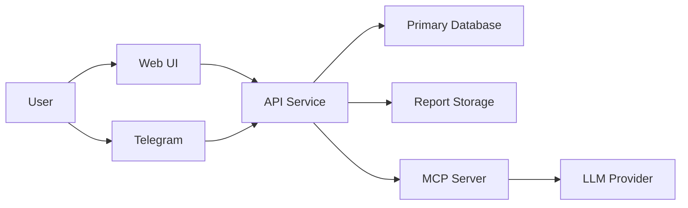
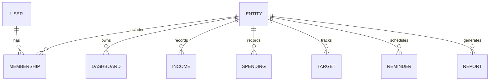

<!-- Primary specification for the finance dashboard web application. -->

# Finance Dashboard Web Application Specification

## 1. Executive Summary
This document defines the comprehensive specification for a personal, family, and group finance dashboard web application. The system provides multi-entity dashboards, scalable income and spending management, target-based budgeting, reminders, reporting, and internationalization. It is designed to be Dockerized from the MVP stage and incrementally expanded through a phased delivery plan that includes CI/CD, authentication, Telegram integrations, and an MCP server for LLM-assisted insights.

## 2. Project Goals and Objectives
- Provide a clear financial overview for individuals and groups via dashboards.
- Support configurable income and spending tracking with scalable categories and types.
- Enable budgeting targets with progress monitoring and notifications.
- Allow multiple entity types with scoped data access and collaboration.
- Deliver multi-language and multi-currency experiences.
- Provide reporting and export capabilities for audits and sharing.
- Integrate with Telegram for bot and mini app experiences.
- Establish a secure MCP server to expose budget data to LLMs in a controlled manner.

## 3. User Stories / Use Cases
### 3.1 Personal User
- As a personal user, I can create a dashboard for myself and see monthly income, spending, and targets progress.
- As a personal user, I can define custom income types and categorize incomes as one-time, limited period, or regular.
- As a personal user, I can set reminders for due payments and low balance alerts.
- As a personal user, I can create spending targets with a name, amount, and timeframe, and track progress.
- As a personal user, I can add information of my purchaices, salaries, expences, loans, depdts, subscriptions, with prices, periodic types, interest, periods.

### 3.2 Family Owner
- As a family owner, I can invite other people to join my family entity and share a budget dashboard.
- As a family owner, I can assign budgets and targets scoped to the family and track progress.

### 3.3 Group Admin
- As a group admin, I can create a group budget for shared expenses and view aggregated reports.
- As a group admin, I can manage participants and define spending categories tailored to the group.

### 3.4 Telegram User
- As a Telegram user, I can check balances and reminders through a bot with buttons and dialogs.
- As a Telegram user, I can open the mini app to manage budgets and targets on mobile.
- As a Telegram user, I can receive notifications about due payments and low balances.

### 3.5 LLM-Assisted User
- As a user, I can ask an AI assistant questions about my finances, and receive personalized insights based on my budget data.

## 4. Feature Specifications
### 4.1 Dashboards
- Provide an at-a-glance overview of income, spending, targets, and balances.
- Dashboard scope is based on entity type: personal, family, or group.
- Widgets: total income, total spending, balance trend, target progress, upcoming reminders.

### 4.2 Budget Targets
- Users can create targets with name, amount, timeframe, and entity scope.
- Track progress via linked transactions or manual progress updates.
- Target status states: planned, in-progress, completed, overdue.

### 4.3 Income Management (Scalable)
**Income Types:** salaries, contracts, pensions, gifts, insurance, custom.

**Income Categories:**
- One-time: single receipt.
- Limited period: start and end date.
- Regular: recurring schedule.

**Requirements:**
- User-defined types and categories.
- Assign income to an entity and to a payer source.

### 4.4 Spending Management (Scalable)
- System supports hierarchical categories and custom types per entity.
- Spending items can be assigned to targets, budgets, and reminders.

### 4.5 Reminders System
- Due payment reminders: based on due date and frequency.
- Low balance alerts: configurable threshold per entity or account.
- Target progress notifications: progress milestones (25%, 50%, 75%, 100%) and overdue warnings.

### 4.6 Entity System (Scalable)
- Entity types: person, family, group.
- Person can invite other persons to a family or group.
- Dashboards and budgets are scoped to an entity.
- Roles: owner, admin, member, viewer with configurable permissions.

### 4.7 Internationalization
**Languages:** English, Hebrew, Russian.

**Currencies:** ILS, USD, RUB.

**Requirements:**
- Locale-based formatting for dates, numbers, and currency.
- Right-to-left layout support for Hebrew.

### 4.8 Reports
- Monthly and yearly income, spending, and target progress, scalable, with ability to set custom timeframes.
- Export to PDF.
- Integration with Google Docs for report export and sharing.

### 4.9 Authentication
- Google Login (OAuth2).
- Telegram Login (Telegram OAuth).

### 4.10 Telegram Integration
- Telegram bot with buttons and dialogs for key actions: add expence/income, balance, reminders, targets.
- Telegram mini app for full dashboard access.
- Telegram UI elements: inline keyboard, dialogs, and notifications.

### 4.11 DevOps
- Dockerized application from MVP.
- CI/CD pipeline for testing and deployment.
- Environment configuration via secrets and environment variables.

### 4.12 MCP Server for LLM Integration (Later Phase)
- MCP server exposes budget data securely to LLMs.
- Supports query endpoints for summaries, trends, and target progress.
- LLM uses MCP to answer user questions and provide personalized financial advice.
- Strong access control with token-scoped permissions and audit logging.

## 5. Technical Architecture Overview
### 5.1 High-Level Architecture

### 5.2 Core Services
- **Web UI:** dashboard, budgets, targets, reports.
- **API Service:** business logic, entity scoping, auth integration, i18n.
- **Notification Service:** reminders and alert scheduling.
- **Report Service:** PDF export and Google Docs integration.
- **MCP Server:** LLM query interface and access control.

## 6. Data Models / Entity Relationships
### 6.1 Key Entities
- **User:** authentication profile, preferences, locale, default currency.
- **Entity:** person, family, group with membership and roles.
- **Dashboard:** scoped to entity; summary preferences.
- **Income:** amount, type, category, schedule, entity association.
- **Spending:** amount, category, type, schedule, entity association.
- **Target:** amount, timeframe, progress, entity association.
- **Reminder:** trigger type, schedule, threshold, entity association.
- **Report:** time range, entity, format, export destination.

### 6.2 Relationship Diagram

## 7. API Endpoints (High-Level)
### 7.1 Authentication
- `POST /auth/google`
- `POST /auth/telegram`
- `POST /auth/logout`

### 7.2 Entities and Membership
- `GET /entities`
- `POST /entities`
- `POST /entities/{id}/invite`
- `PATCH /entities/{id}/members/{memberId}`

### 7.3 Dashboards
- `GET /entities/{id}/dashboard`
- `PATCH /entities/{id}/dashboard/preferences`

### 7.4 Income
- `GET /entities/{id}/income`
- `POST /entities/{id}/income`
- `PATCH /income/{id}`
- `DELETE /income/{id}`

### 7.5 Spending
- `GET /entities/{id}/spending`
- `POST /entities/{id}/spending`
- `PATCH /spending/{id}`
- `DELETE /spending/{id}`

### 7.6 Targets
- `GET /entities/{id}/targets`
- `POST /entities/{id}/targets`
- `PATCH /targets/{id}`

### 7.7 Reminders
- `GET /entities/{id}/reminders`
- `POST /entities/{id}/reminders`
- `PATCH /reminders/{id}`

### 7.8 Reports
- `GET /entities/{id}/reports`
- `POST /entities/{id}/reports`
- `GET /reports/{id}/download`
- `POST /reports/{id}/export/google-docs`

### 7.9 MCP Server
- `POST /mcp/query`
- `GET /mcp/schemas`
- `POST /mcp/audit`

## 8. Security Considerations
- OAuth2 for Google and Telegram authentication.
- Role-based access control for entities and data.
- Data encryption at rest and in transit.
- Audit logging for MCP queries and exports.
- Rate limiting and abuse detection for Telegram endpoints.
- Secure secret management for CI/CD.

## 9. Implementation Phases with Detailed Milestones
### Phase 1: MVP (Local Dockerized App)
- Basic entity system: person-only.
- Core dashboards for personal budgets.
- Income and spending CRUD.
- Budget targets and progress.
- Local reminders (in-app and email optional).
- Dockerized deployment for local use.

### Phase 2: CI/CD Integration
- Automated tests: unit, integration, API contract tests.
- Linting and formatting pipeline.
- Build and deploy pipeline for staging environment.

### Phase 3: Authentication Integration
- Google OAuth2 login.
- Telegram Login Widget.
- Session handling and token refresh.
- RBAC enforcement with authenticated sessions.

### Phase 4: Telegram Bot (Simple)
- Telegram bot with simple menu.
- Buttons and dialogs for balance, reminders, and targets.
- Webhook integration with API.

### Phase 5: Telegram Mini App
- Mini app front-end integrated with API.
- Responsive UI for mobile.
- Entity switching and dashboard access.

### Phase 6: MCP Server for AI/LLM Integration
- MCP server with defined schemas for budget data.
- Secure query layer and permission checks.
- LLM integration for user questions.
- Personalized advice based on target progress and spending patterns.

## 10. Technology Stack Recommendations
| Layer | Recommended Stack |
| --- | --- |
| Frontend | React or Next.js, TypeScript, i18n framework |
| Backend | Node.js or Python FastAPI, REST API |
| Database | PostgreSQL for relational data |
| Caching | Redis for reminders and sessions |
| Messaging | RabbitMQ or Redis streams for reminders |
| Auth | OAuth2 and JWT |
| DevOps | Docker, GitHub Actions or GitLab CI |
| Integrations | Telegram Bot API, Google Docs API |

## 11. Non-functional Requirements
- **Performance:** dashboard load under 2 seconds for standard usage.
- **Scalability:** support thousands of entities with independent data partitions.
- **Availability:** 99.5% uptime for hosted environments.
- **Security:** regular dependency scans and penetration testing.
- **Localization:** language switching without page reload.
- **Compliance:** ensure data handling aligns with GDPR-like privacy expectations.

## 12. Appendix: Notes for Developers
- All feature development must respect entity scoping rules.
- Internationalization must be part of UI and data formatting layers.
- Telegram integrations should be isolated to avoid coupling with core business logic.
