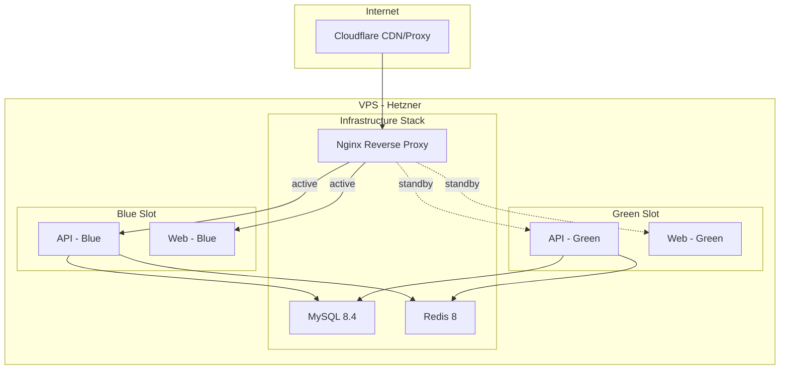
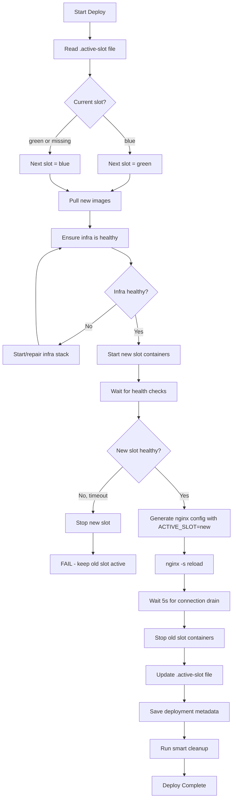
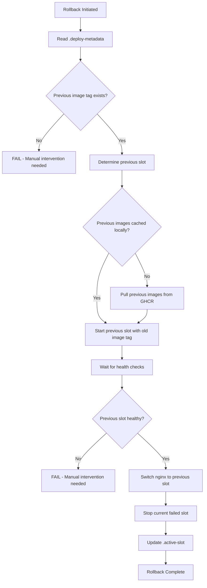
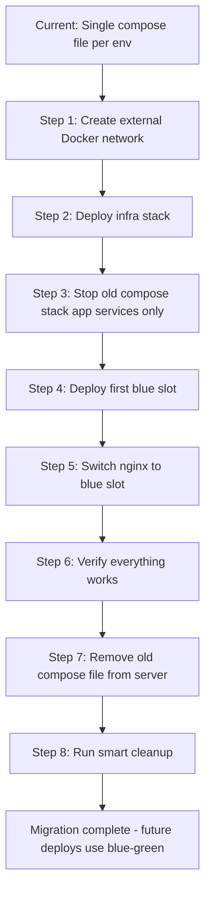

# Blue-Green Deployment Strategy with Smart Cleanup

> **Status**: Design — not yet implemented
> **Last Updated**: 2026-03-06
> **Related Files**: [`docker-compose.staging.yml`](../docker-compose.staging.yml), [`docker-compose.production.yml`](../docker-compose.production.yml), [`scripts/deploy.sh`](../scripts/deploy.sh), [`scripts/rollback.sh`](../scripts/rollback.sh)

---

## Table of Contents

1. [Overview](#1-overview)
2. [Current Problems](#2-current-problems)
3. [Architecture Design](#3-architecture-design)
4. [Compose File Restructuring](#4-compose-file-restructuring)
5. [Deployment Sequence](#5-deployment-sequence)
6. [Smart Cleanup Logic](#6-smart-cleanup-logic)
7. [Rollback Procedure](#7-rollback-procedure)
8. [One-Time Disk Space Recovery](#8-one-time-disk-space-recovery)
9. [Cloudflare DNS Integration](#9-cloudflare-dns-integration)
10. [File Changes Summary](#10-file-changes-summary)
11. [State & Metadata Files](#11-state--metadata-files)
12. [Failure Modes & Recovery](#12-failure-modes--recovery)
13. [Testing the Strategy](#13-testing-the-strategy)

---

## 1. Overview

### Goal

Achieve zero-downtime deployments on a single VPS using Docker Compose by running two application "slots" (blue and green) and switching traffic via Nginx — while keeping disk usage under control through smart image cleanup that preserves exactly one rollback version.

### Key Principles

- **Infrastructure services** (MySQL, Redis, Nginx) are long-lived and never recreated during application deploys
- **Application services** (API, Web) deploy into alternating blue/green slots
- **Nginx is the traffic switch** — an `nginx -s reload` moves traffic from old to new with zero dropped connections
- **Rollback is instant** — previous slot's images are preserved; rollback is just "switch back"
- **Cleanup is conservative** — only remove images that are neither current nor previous deployment

---

## 2. Current Problems

### 2.1 In-Place Restart Causes Downtime

The current workflow runs `docker compose up -d` which stops old containers before new ones are healthy. During the gap (10-30 seconds for Node.js startup + health checks), users see errors.

**Current flow in** [`deploy-staging.yml`](../.github/workflows/deploy-staging.yml:204-208):

```bash
docker compose -f docker-compose.staging.yml pull api web
docker compose -f docker-compose.staging.yml up -d
```

### 2.2 Rollback Is Fragile

[`scripts/rollback.sh`](../scripts/rollback.sh:51-76) tries to find previous images by grepping `docker images` output, which is unreliable. It doesn't actually `docker compose up` with the previous image tag — it just stops containers and hopes Docker cached the right layers.

### 2.3 Disk Space Accumulates

The only cleanup is `docker image prune -f` (dangling images only). SHA-tagged images from every deployment accumulate:

```
ghcr.io/aleksei-michnik/myfinpro/api:staging-abc1234    250MB
ghcr.io/aleksei-michnik/myfinpro/api:staging-def5678    250MB
ghcr.io/aleksei-michnik/myfinpro/api:staging-ghi9012    250MB
...
```

A `docker system prune -af` would fix disk space but remove ALL images, including the one needed for rollback.

### 2.4 Fixed Container Names Block Parallel Slots

Hard-coded `container_name` values in compose files (e.g., `myfinpro-staging-api`) prevent running two versions simultaneously — Docker enforces unique container names.

---

## 3. Architecture Design

### 3.1 High-Level Architecture



### 3.2 Slot Design

Each environment (staging, production) has two **slots**: `blue` and `green`. At any time, exactly one slot is **active** (receiving traffic) and the other is either **idle** (no containers) or **deploying** (containers starting up).

| Concept              | Implementation                                           |
| -------------------- | -------------------------------------------------------- |
| Slot identifier      | `blue` or `green`                                        |
| Active slot tracking | File: `/opt/myfinpro/{env}/.active-slot`                 |
| Container naming     | `myfinpro-{env}-api-{slot}`, `myfinpro-{env}-web-{slot}` |
| Network aliases      | `api-{slot}`, `web-{slot}` on shared Docker network      |
| Traffic switching    | Nginx upstream + `nginx -s reload`                       |
| Compose project name | `myfinpro-{env}-{slot}` (e.g., `myfinpro-staging-blue`)  |

### 3.3 Network Architecture

All services share a single Docker network per environment. Infrastructure and both app slots connect to it:

```
Network: myfinpro-staging
├── mysql          (infra stack)
├── redis          (infra stack)
├── nginx          (infra stack)
├── api-blue       (app blue slot — network alias)
├── web-blue       (app blue slot — network alias)
├── api-green      (app green slot — network alias)
└── web-green      (app green slot — network alias)
```

The network is created as an **external** Docker network (not managed by compose lifecycle), ensuring it persists across compose up/down operations.

---

## 4. Compose File Restructuring

### 4.1 Current → New File Mapping

| Current File                    | New File(s)                           | Purpose               |
| ------------------------------- | ------------------------------------- | --------------------- |
| `docker-compose.staging.yml`    | `docker-compose.staging.infra.yml`    | MySQL, Redis, Nginx   |
|                                 | `docker-compose.staging.app.yml`      | API, Web (slot-aware) |
| `docker-compose.production.yml` | `docker-compose.production.infra.yml` | MySQL, Redis, Nginx   |
|                                 | `docker-compose.production.app.yml`   | API, Web (slot-aware) |
| `docker-compose.yml`            | `docker-compose.yml`                  | Local dev (unchanged) |

> **Note**: The original `docker-compose.staging.yml` and `docker-compose.production.yml` should be kept temporarily for migration but marked deprecated.

### 4.2 Infrastructure Compose File (staging example)

```yaml
# docker-compose.staging.infra.yml
# Long-lived infrastructure services. Managed separately from app deploys.

services:
  mysql:
    image: mysql:8.4
    container_name: myfinpro-staging-mysql
    restart: unless-stopped
    environment:
      MYSQL_ROOT_PASSWORD: ${MYSQL_ROOT_PASSWORD}
      MYSQL_DATABASE: ${MYSQL_DATABASE}
      MYSQL_USER: ${MYSQL_USER}
      MYSQL_PASSWORD: ${MYSQL_PASSWORD}
    volumes:
      - myfinpro-staging-mysql:/var/lib/mysql
      - ./infrastructure/mysql/init:/docker-entrypoint-initdb.d:ro
    networks:
      - myfinpro-staging
    healthcheck:
      test: ['CMD', 'mysqladmin', 'ping', '-h', 'localhost']
      interval: 10s
      timeout: 5s
      retries: 5
      start_period: 30s
    command: >
      --character-set-server=utf8mb4
      --collation-server=utf8mb4_unicode_ci

  redis:
    image: redis:8-alpine
    container_name: myfinpro-staging-redis
    restart: unless-stopped
    volumes:
      - myfinpro-staging-redis:/data
    networks:
      - myfinpro-staging
    healthcheck:
      test: ['CMD', 'redis-cli', 'ping']
      interval: 10s
      timeout: 5s
      retries: 5
    command: redis-server --appendonly yes --maxmemory 256mb --maxmemory-policy allkeys-lru

  nginx:
    image: nginx:1.28-alpine
    container_name: myfinpro-staging-nginx
    restart: unless-stopped
    ports:
      - '80:80'
      - '443:443'
    volumes:
      - ./infrastructure/nginx/nginx.conf:/etc/nginx/nginx.conf:ro
      - ./infrastructure/nginx/conf.d:/etc/nginx/conf.d:ro
      - ./infrastructure/ssl:/etc/letsencrypt:ro
    networks:
      - myfinpro-staging
    healthcheck:
      test: ['CMD', 'wget', '--no-verbose', '--tries=1', '--spider', 'http://localhost/health']
      interval: 15s
      timeout: 5s
      retries: 3

volumes:
  myfinpro-staging-mysql:
    driver: local
  myfinpro-staging-redis:
    driver: local

networks:
  myfinpro-staging:
    name: myfinpro-staging
    driver: bridge
```

**Key changes from current:**

- Nginx no longer has `depends_on` on api/web — those are in a separate compose file
- The network is explicitly named (`name: myfinpro-staging`) so other compose files can reference it
- No application services in this file

### 4.3 Application Compose File (staging example)

```yaml
# docker-compose.staging.app.yml
# Application services deployed as blue/green slots.
# DEPLOY_SLOT env var determines which slot this instance represents.
# Usage: DEPLOY_SLOT=blue docker compose -p myfinpro-staging-blue -f docker-compose.staging.app.yml up -d

services:
  api:
    image: ghcr.io/${GHCR_REPO}/api:${IMAGE_TAG:-staging}
    container_name: myfinpro-staging-api-${DEPLOY_SLOT:-blue}
    restart: unless-stopped
    environment:
      DATABASE_URL: ${DATABASE_URL}
      JWT_SECRET: ${JWT_SECRET}
      JWT_REFRESH_SECRET: ${JWT_REFRESH_SECRET}
      REDIS_URL: ${REDIS_URL}
      NODE_ENV: ${NODE_ENV}
      API_PORT: ${API_PORT}
      CORS_ORIGINS: ${CORS_ORIGINS}
      LOG_LEVEL: ${LOG_LEVEL}
      SWAGGER_ENABLED: ${SWAGGER_ENABLED}
      RATE_LIMIT_TTL: ${RATE_LIMIT_TTL}
      RATE_LIMIT_MAX: ${RATE_LIMIT_MAX}
      NEXT_PUBLIC_API_URL: ${NEXT_PUBLIC_API_URL}
      API_INTERNAL_URL: ${API_INTERNAL_URL}
    networks:
      myfinpro-staging:
        aliases:
          - api-${DEPLOY_SLOT:-blue}
    healthcheck:
      test:
        [
          'CMD',
          'wget',
          '--no-verbose',
          '--tries=1',
          '--spider',
          'http://localhost:3001/api/v1/health',
        ]
      interval: 10s
      timeout: 5s
      retries: 5
      start_period: 30s

  web:
    image: ghcr.io/${GHCR_REPO}/web:${IMAGE_TAG:-staging}
    container_name: myfinpro-staging-web-${DEPLOY_SLOT:-blue}
    restart: unless-stopped
    environment:
      NEXT_PUBLIC_API_URL: ${NEXT_PUBLIC_API_URL}
      API_INTERNAL_URL: ${API_INTERNAL_URL}
      NODE_ENV: ${NODE_ENV}
    networks:
      myfinpro-staging:
        aliases:
          - web-${DEPLOY_SLOT:-blue}
    healthcheck:
      test: ['CMD', 'wget', '--no-verbose', '--tries=1', '--spider', 'http://localhost:3000']
      interval: 10s
      timeout: 5s
      retries: 5
      start_period: 30s

networks:
  myfinpro-staging:
    external: true
    name: myfinpro-staging
```

**Key design decisions:**

- **No `depends_on`** — the deploy script ensures infra is healthy before starting the app
- **No host port mapping** — app containers are accessed only via Nginx through the Docker network
- **Network aliases** use `api-${DEPLOY_SLOT}` so Nginx can target `api-blue:3001` or `api-green:3001`
- **More aggressive health checks** (`interval: 10s`, `retries: 5`) for faster deployment feedback
- **`container_name` includes the slot** — allows both blue and green to exist simultaneously

### 4.4 Nginx SSL Template Update

[`infrastructure/nginx/conf.d/ssl.conf.template`](../infrastructure/nginx/conf.d/ssl.conf.template) needs a new variable for the active slot:

```nginx
# ssl.conf.template (updated for blue-green)
# Processed at deploy time:
#   envsubst '$SERVER_NAME $ACTIVE_SLOT' < ssl.conf.template > default.conf
# Only ${SERVER_NAME} and ${ACTIVE_SLOT} are substituted.

upstream api_upstream {
    server api-${ACTIVE_SLOT}:3001;
}

upstream web_upstream {
    server web-${ACTIVE_SLOT}:3000;
}

# ... rest of the template stays the same ...
```

The only change is in the `upstream` blocks — `server api:3001` becomes `server api-${ACTIVE_SLOT}:3001`.

**The `envsubst` call** changes from:

```bash
envsubst '$SERVER_NAME' < ssl.conf.template > default.conf
```

to:

```bash
envsubst '$SERVER_NAME $ACTIVE_SLOT' < ssl.conf.template > default.conf
```

---

## 5. Deployment Sequence

### 5.1 Deployment Flow Diagram



### 5.2 Step-by-Step Deployment Sequence

The [`scripts/deploy.sh`](../scripts/deploy.sh) script will be rewritten. Here is the detailed sequence:

#### Step 1: Determine Slots

```bash
ACTIVE_SLOT=$(cat /opt/myfinpro/${ENV}/.active-slot 2>/dev/null || echo "none")
if [ "$ACTIVE_SLOT" = "blue" ]; then
  NEXT_SLOT="green"
else
  NEXT_SLOT="blue"    # Default: first deploy goes to blue
  ACTIVE_SLOT="none"  # No previous slot to stop
fi
```

#### Step 2: Pull New Images

```bash
export DEPLOY_SLOT="$NEXT_SLOT"
docker compose -p "myfinpro-${ENV}-${NEXT_SLOT}" \
  -f "docker-compose.${ENV}.app.yml" pull
```

#### Step 3: Ensure Infrastructure is Running

```bash
docker compose -p "myfinpro-${ENV}-infra" \
  -f "docker-compose.${ENV}.infra.yml" up -d

# Wait for MySQL and Redis health
wait_for_container_health "myfinpro-${ENV}-mysql" 60
wait_for_container_health "myfinpro-${ENV}-redis" 30
```

#### Step 4: Run Database Migrations (if needed)

```bash
# Run migrations using a one-off container on the new image
docker run --rm --network "myfinpro-${ENV}" \
  -e DATABASE_URL="$DATABASE_URL" \
  "ghcr.io/${GHCR_REPO}/api:${IMAGE_TAG}" \
  npx prisma migrate deploy --schema=prisma/schema.prisma
```

> **Important**: Migrations must be backward-compatible (expand/migrate/contract pattern). The old slot's API must still work with the new schema during the brief overlap period.

#### Step 5: Start New Slot

```bash
export DEPLOY_SLOT="$NEXT_SLOT"
docker compose -p "myfinpro-${ENV}-${NEXT_SLOT}" \
  -f "docker-compose.${ENV}.app.yml" up -d
```

#### Step 6: Wait for Health Checks

```bash
wait_for_container_health "myfinpro-${ENV}-api-${NEXT_SLOT}" 90
wait_for_container_health "myfinpro-${ENV}-web-${NEXT_SLOT}" 90
```

The `wait_for_container_health` function polls Docker's built-in health check status:

```bash
wait_for_container_health() {
  local container="$1"
  local timeout="$2"
  local elapsed=0
  while [ $elapsed -lt $timeout ]; do
    local status=$(docker inspect --format='{{.State.Health.Status}}' "$container" 2>/dev/null || echo "not_found")
    case "$status" in
      healthy) return 0 ;;
      unhealthy) return 1 ;;
    esac
    sleep 5
    elapsed=$((elapsed + 5))
  done
  return 1  # timeout
}
```

#### Step 7: Switch Traffic

```bash
# Generate new nginx config pointing to the new slot
export ACTIVE_SLOT="$NEXT_SLOT"
envsubst '$SERVER_NAME $ACTIVE_SLOT' \
  < infrastructure/nginx/conf.d/ssl.conf.template \
  > infrastructure/nginx/conf.d/default.conf

# Graceful reload — no dropped connections
docker exec "myfinpro-${ENV}-nginx" nginx -s reload
```

#### Step 8: Drain & Verify

```bash
# Allow in-flight requests to complete
sleep 5

# Verify via the live endpoint
curl -sf "http://localhost/api/v1/health" || {
  echo "CRITICAL: Health check through nginx failed after switch!"
  # Emergency: switch back
  export ACTIVE_SLOT="$ACTIVE_SLOT_PREV"
  envsubst '$SERVER_NAME $ACTIVE_SLOT' < ssl.conf.template > default.conf
  docker exec "myfinpro-${ENV}-nginx" nginx -s reload
  exit 1
}
```

#### Step 9: Stop Old Slot

```bash
if [ "$ACTIVE_SLOT_PREV" != "none" ]; then
  docker compose -p "myfinpro-${ENV}-${ACTIVE_SLOT_PREV}" \
    -f "docker-compose.${ENV}.app.yml" down
fi
```

#### Step 10: Save State & Metadata

```bash
echo "$NEXT_SLOT" > "/opt/myfinpro/${ENV}/.active-slot"

# Save deployment metadata for rollback
cat > "/opt/myfinpro/${ENV}/.deploy-metadata" << EOF
DEPLOY_TIMESTAMP=$(date -u +%Y-%m-%dT%H:%M:%SZ)
ACTIVE_SLOT=${NEXT_SLOT}
PREVIOUS_SLOT=${ACTIVE_SLOT_PREV}
IMAGE_TAG=${IMAGE_TAG}
PREVIOUS_IMAGE_TAG=${PREV_IMAGE_TAG}
GIT_SHA=${GIT_SHA}
PREVIOUS_GIT_SHA=${PREV_GIT_SHA}
EOF
```

#### Step 11: Smart Cleanup

```bash
bash scripts/cleanup-images.sh "$ENV"
```

---

## 6. Smart Cleanup Logic

### 6.1 Cleanup Philosophy

| Category                                | Action               | Reason                             |
| --------------------------------------- | -------------------- | ---------------------------------- |
| Current deployment images               | **KEEP**             | Active containers need them        |
| Previous deployment images (N-1)        | **KEEP**             | Needed for instant rollback        |
| Older deployment images (N-2, N-3, ...) | **REMOVE**           | No longer needed                   |
| Dangling images (untagged)              | **REMOVE**           | Wasted space                       |
| Docker build cache                      | **PRUNE** (keep 1GB) | Images are built in CI, not on VPS |
| Docker volumes                          | **NEVER TOUCH**      | Contains database data!            |
| System logs older than 7 days           | **ROTATE**           | Reclaim space                      |

### 6.2 Cleanup Script: `scripts/cleanup-images.sh`

```bash
#!/usr/bin/env bash
# scripts/cleanup-images.sh — Smart Docker image cleanup
# Keeps current + previous deployment images, removes everything else
# Usage: ./scripts/cleanup-images.sh [staging|production]

set -euo pipefail

ENV="${1:-staging}"
DEPLOY_DIR="/opt/myfinpro/${ENV}"
METADATA_FILE="${DEPLOY_DIR}/.deploy-metadata"
GHCR_PREFIX="ghcr.io/aleksei-michnik/myfinpro"

# Load current and previous image tags from deployment metadata
if [ -f "$METADATA_FILE" ]; then
  source "$METADATA_FILE"
fi

KEEP_TAGS=()

# Current deployment tag
if [ -n "${IMAGE_TAG:-}" ]; then
  KEEP_TAGS+=("${IMAGE_TAG}")
fi

# Previous deployment tag
if [ -n "${PREVIOUS_IMAGE_TAG:-}" ]; then
  KEEP_TAGS+=("${PREVIOUS_IMAGE_TAG}")
fi

# Also keep the environment's "latest" and "staging" floating tags
KEEP_TAGS+=("latest" "staging")

echo "=== Smart Image Cleanup for ${ENV} ==="
echo "Keeping tags: ${KEEP_TAGS[*]}"

# List all images for our repo
ALL_IMAGES=$(docker images --format '{{.Repository}}:{{.Tag}}' \
  | grep "^${GHCR_PREFIX}" | sort -u)

for image in $ALL_IMAGES; do
  tag="${image##*:}"
  should_keep=false

  for keep_tag in "${KEEP_TAGS[@]}"; do
    if [ "$tag" = "$keep_tag" ]; then
      should_keep=true
      break
    fi
    # Also check SHA-prefixed tags (e.g., "staging-abc1234")
    if [[ "$tag" == *"-${keep_tag}" ]] || [[ "$tag" == "${keep_tag}-"* ]]; then
      should_keep=true
      break
    fi
  done

  if [ "$should_keep" = true ]; then
    echo "  KEEP: $image"
  else
    echo "  REMOVE: $image"
    docker rmi "$image" 2>/dev/null || true
  fi
done

# Clean dangling images
echo "Pruning dangling images..."
docker image prune -f 2>/dev/null || true

# Clean build cache (keep 1GB for minor local operations)
echo "Pruning build cache..."
docker builder prune -f --keep-storage=1073741824 2>/dev/null || true

# Prune stopped containers (should not be many)
echo "Pruning stopped containers..."
docker container prune -f 2>/dev/null || true

# Report disk usage
echo "=== Docker Disk Usage ==="
docker system df

echo "=== Cleanup Complete ==="
```

### 6.3 What We Never Touch

- **Named volumes** (`myfinpro-staging-mysql`, `myfinpro-production-mysql`, etc.) — these contain the actual database data
- **Infrastructure images** (mysql:8.4, redis:8-alpine, nginx:1.28-alpine) — these are small and shared
- **SSL certificates** mounted from host filesystem

---

## 7. Rollback Procedure

### 7.1 Rollback Flow



### 7.2 Rollback Script Logic

The key insight: **rollback is just another deployment**, but using the previous image tag instead of a new one.

```bash
# Read previous deployment info
source /opt/myfinpro/${ENV}/.deploy-metadata

# Swap: the "previous" becomes "current", and vice versa
ROLLBACK_SLOT="$PREVIOUS_SLOT"
ROLLBACK_TAG="$PREVIOUS_IMAGE_TAG"

# Start the rollback slot with the previous image
export DEPLOY_SLOT="$ROLLBACK_SLOT"
export IMAGE_TAG="$ROLLBACK_TAG"

docker compose -p "myfinpro-${ENV}-${ROLLBACK_SLOT}" \
  -f "docker-compose.${ENV}.app.yml" up -d

# Wait for health, switch nginx, stop failed slot
# (same steps 6-9 from deploy sequence)
```

### 7.3 Rollback Speed

Because we preserve N-1 images locally, rollback avoids the slowest step (pulling images from GHCR). Expected rollback time:

| Step                                | Duration           |
| ----------------------------------- | ------------------ |
| Start containers from cached images | 5-10s              |
| Health checks pass                  | 15-30s             |
| Nginx reload                        | <1s                |
| Stop old containers                 | 2-5s               |
| **Total**                           | **~30-45 seconds** |

### 7.4 Rollback from GitHub Actions

The workflow's failure step in [`deploy-staging.yml`](../.github/workflows/deploy-staging.yml:255-268) will call the updated rollback script:

```yaml
- name: Rollback on failure
  if: failure()
  uses: appleboy/ssh-action@v1
  with:
    host: ${{ secrets.STAGING_HOST }}
    username: ${{ secrets.STAGING_USER }}
    key: ${{ secrets.STAGING_SSH_KEY }}
    envs: MYSQL_ROOT_PASSWORD,MYSQL_DATABASE,... # same env vars
    script: |
      cd /opt/myfinpro/staging
      chmod +x scripts/rollback.sh
      ./scripts/rollback.sh staging
```

---

## 8. One-Time Disk Space Recovery

Before implementing blue-green, perform a one-time cleanup to reclaim disk space. This is a **manual procedure** to run via SSH.

### 8.1 Assessment

```bash
# Check current disk usage
df -h /
docker system df
docker system df -v | head -50

# List all myfinpro images sorted by size
docker images --format 'table {{.Repository}}\t{{.Tag}}\t{{.Size}}\t{{.CreatedAt}}' \
  | grep myfinpro | sort -k4
```

### 8.2 Safe Cleanup Steps

```bash
# Step 1: Identify which images are CURRENTLY running
docker ps --format '{{.Image}}' | sort -u
# Output example:
#   ghcr.io/aleksei-michnik/myfinpro/api:staging
#   ghcr.io/aleksei-michnik/myfinpro/web:staging
#   mysql:8.4
#   redis:8-alpine
#   nginx:1.28-alpine

# Step 2: Remove OLD SHA-tagged images (keep only the currently running ones)
# List candidates for removal:
docker images --format '{{.Repository}}:{{.Tag}}' \
  | grep 'ghcr.io/aleksei-michnik/myfinpro' \
  | grep -v -F "$(docker ps --format '{{.Image}}')" \
  | sort

# Step 3: Remove them (review the list first!)
docker images --format '{{.Repository}}:{{.Tag}}' \
  | grep 'ghcr.io/aleksei-michnik/myfinpro' \
  | grep -v -F "$(docker ps --format '{{.Image}}')" \
  | xargs -r docker rmi

# Step 4: Prune dangling images
docker image prune -f

# Step 5: Prune build cache
docker builder prune -af

# Step 6: Prune unused networks
docker network prune -f

# Step 7: Clean old deploy logs
find /opt/myfinpro/ -name 'deploy-*.log' -mtime +30 -delete
find /opt/myfinpro/ -name 'rollback-*.log' -mtime +30 -delete

# Step 8: Clean system journal logs
sudo journalctl --vacuum-time=7d

# Step 9: Verify
df -h /
docker system df
```

### 8.3 Expected Space Recovery

| Category                                | Estimated Size |
| --------------------------------------- | -------------- |
| Old SHA-tagged images (10+ deployments) | 2-5 GB         |
| Dangling images                         | 0.5-2 GB       |
| Build cache                             | 1-3 GB         |
| Old logs                                | 0.1-0.5 GB     |
| **Total estimated recovery**            | **~3-10 GB**   |

---

## 9. Cloudflare DNS Integration

### 9.1 Current Setup

Cloudflare proxies all traffic to the VPS. The SSL termination happens at **two levels**:

1. **Client → Cloudflare**: Cloudflare's SSL certificate (automatic)
2. **Cloudflare → VPS**: Origin certificate (Let's Encrypt certs on the VPS)


### 9.2 Blue-Green and Cloudflare

Blue-green deployment is **invisible to Cloudflare**. The DNS A record points to the VPS IP, and Nginx handles the internal switching. No Cloudflare configuration changes are needed during deployments.

**Important settings to verify in Cloudflare:**

- **SSL/TLS mode**: Full (strict) — ensures Cloudflare validates the origin cert
- **Caching**: Consider purging Cloudflare cache after deployments if static assets change
- **Health checks**: Cloudflare's origin health checks (if configured) should target `/health` on port 80 (HTTP), which Nginx handles independently of the app slots

### 9.3 Domain Configuration

Domain names are stored as GitHub Secrets and passed to the deploy workflow:

- `CLOUDFLARE_STAGING_SUBDOMAIN` → used as `SERVER_NAME` in Nginx
- `CLOUDFLARE_PRODUCTION_SUBDOMAIN` → used as `SERVER_NAME` in Nginx

The Nginx template in [`ssl.conf.template`](../infrastructure/nginx/conf.d/ssl.conf.template:47) uses `${SERVER_NAME}` for the `server_name` directive and SSL cert paths. This pattern remains unchanged with blue-green — the template just gains an additional `${ACTIVE_SLOT}` variable for upstream blocks.

---

## 10. File Changes Summary

### 10.1 New Files

| File                                  | Purpose                                          |
| ------------------------------------- | ------------------------------------------------ |
| `docker-compose.staging.infra.yml`    | Infrastructure services for staging              |
| `docker-compose.staging.app.yml`      | Application services for staging (slot-aware)    |
| `docker-compose.production.infra.yml` | Infrastructure services for production           |
| `docker-compose.production.app.yml`   | Application services for production (slot-aware) |
| `scripts/cleanup-images.sh`           | Smart Docker image cleanup                       |

### 10.2 Modified Files

| File                                                                                                | Changes                                                                                             |
| --------------------------------------------------------------------------------------------------- | --------------------------------------------------------------------------------------------------- |
| [`scripts/deploy.sh`](../scripts/deploy.sh)                                                         | Complete rewrite for blue-green slot logic                                                          |
| [`scripts/rollback.sh`](../scripts/rollback.sh)                                                     | Rewrite for slot-based rollback                                                                     |
| [`infrastructure/nginx/conf.d/ssl.conf.template`](../infrastructure/nginx/conf.d/ssl.conf.template) | Add `${ACTIVE_SLOT}` to upstream blocks                                                             |
| [`.github/workflows/deploy-staging.yml`](../.github/workflows/deploy-staging.yml)                   | Update deploy step: add `DEPLOY_SLOT`, `ACTIVE_SLOT`; use new compose files; call updated deploy.sh |
| [`.github/workflows/deploy-production.yml`](../.github/workflows/deploy-production.yml)             | Same changes as staging workflow                                                                    |

### 10.3 Deprecated Files (remove after migration)

| File                            | Replaced By                                                                 |
| ------------------------------- | --------------------------------------------------------------------------- |
| `docker-compose.staging.yml`    | `docker-compose.staging.infra.yml` + `docker-compose.staging.app.yml`       |
| `docker-compose.production.yml` | `docker-compose.production.infra.yml` + `docker-compose.production.app.yml` |

### 10.4 Workflow Changes Detail

The deploy step in the GitHub Actions workflow changes from:

```yaml
# BEFORE (in-place restart)
script: |
  docker compose -f docker-compose.staging.yml pull api web
  docker compose -f docker-compose.staging.yml up -d
  docker image prune -f
```

To:

```yaml
# AFTER (blue-green with slot switching)
script: |
  cd /opt/myfinpro/staging
  chmod +x scripts/deploy.sh
  export GHCR_REPO IMAGE_TAG SERVER_NAME  # ... all env vars
  ./scripts/deploy.sh staging
```

The heavy lifting moves from inline workflow YAML into `scripts/deploy.sh`, making it testable and consistent between CI and manual deployments.

### 10.5 Files Copied to Server

The `scp-action` step needs to copy the new compose files:

```yaml
source: >-
  docker-compose.staging.infra.yml,
  docker-compose.staging.app.yml,
  infrastructure/nginx/,
  infrastructure/mysql/,
  scripts/deploy.sh,
  scripts/rollback.sh,
  scripts/cleanup-images.sh
```

---

## 11. State & Metadata Files

### 11.1 State Files on Server

These files live in `/opt/myfinpro/{env}/` and track deployment state:

| File               | Content                  | Example   |
| ------------------ | ------------------------ | --------- |
| `.active-slot`     | Current active slot name | `blue`    |
| `.deploy-metadata` | Full deployment metadata | See below |

### 11.2 Deploy Metadata Format

```bash
# /opt/myfinpro/staging/.deploy-metadata
DEPLOY_TIMESTAMP=2026-03-06T20:55:00Z
ACTIVE_SLOT=green
PREVIOUS_SLOT=blue
IMAGE_TAG=staging-abc1234
PREVIOUS_IMAGE_TAG=staging-def5678
GIT_SHA=abc1234567890
PREVIOUS_GIT_SHA=def5678901234
DEPLOY_STATUS=success
```

This file is written at the end of each successful deployment and read at the start of the next deployment (to shift "current" → "previous").

---

## 12. Failure Modes & Recovery

### 12.1 Failure During Deployment

| Failure Point                  | Impact                          | Automatic Recovery                               |
| ------------------------------ | ------------------------------- | ------------------------------------------------ |
| Image pull fails               | New slot never starts           | Old slot still active, no impact                 |
| New slot fails health checks   | New containers are unhealthy    | Deploy script stops new slot, old slot untouched |
| Nginx reload fails             | Unlikely (config is validated)  | Old nginx config still active                    |
| Post-switch health check fails | Traffic may hit broken new slot | Emergency: switch nginx back to old slot         |
| Old slot stop fails            | Zombie containers               | Logged; manual cleanup needed                    |

### 12.2 Failure During Rollback

If rollback also fails (both slots are broken), the procedure is:

1. Check infra services: `docker compose -p myfinpro-${ENV}-infra -f infra.yml ps`
2. Check container logs: `docker logs myfinpro-${ENV}-api-${SLOT}`
3. If DB issue: check MySQL logs and connectivity
4. If image issue: manually pull a known-good image tag from GHCR
5. Last resort: deploy a specific version manually

### 12.3 Split-Brain Prevention

The concurrency group in GitHub Actions prevents parallel deployments:

```yaml
concurrency:
  group: deploy-staging
  cancel-in-progress: false
```

Additionally, the deploy script uses a lock file:

```bash
LOCK_FILE="/opt/myfinpro/${ENV}/.deploy.lock"
exec 200>"$LOCK_FILE"
flock -n 200 || { echo "Another deployment is in progress"; exit 1; }
```

---

## 13. Testing the Strategy

### 13.1 Test on Staging First

The migration to blue-green should be tested on staging before production:

1. SSH into staging server
2. Create the external Docker network: `docker network create myfinpro-staging`
3. Start infra stack: `docker compose -p myfinpro-staging-infra -f docker-compose.staging.infra.yml up -d`
4. Run first blue-green deploy manually: `DEPLOY_SLOT=blue ./scripts/deploy.sh staging`
5. Verify services are healthy
6. Run a second deploy to test slot switching: `DEPLOY_SLOT=green ./scripts/deploy.sh staging`
7. Verify zero-downtime (run `watch curl -s http://localhost/api/v1/health` during deploy)
8. Test rollback: `./scripts/rollback.sh staging`
9. Verify services recovered

### 13.2 Migration Path from Current Setup



The migration is a one-time procedure per environment:

1. **Create the network**: `docker network create myfinpro-staging`
2. **Start infra**: Move MySQL, Redis, Nginx to the infra compose file; `docker compose up -d`
3. **Stop old app containers**: `docker stop myfinpro-staging-api myfinpro-staging-web`
4. **Connect existing infra containers to new network**: The infra compose file creates the named network, so existing volumes are preserved
5. **Deploy first blue slot**: The deploy script handles this automatically
6. **Clean up**: Remove the old `docker-compose.staging.yml` from the server

> **Critical**: MySQL and Redis volumes must NOT be recreated. Use the same volume names as the current setup.

---

## Appendix A: Production Compose Differences

The production compose files follow the same structure as staging but include:

- **Resource limits** (`deploy.resources.limits`) on all services
- **No host port exposure** for app containers (only Nginx exposes 80/443)
- **Stricter logging** (`json-file` driver with size/rotation limits)
- **Higher MySQL tuning** (buffer pool, max connections)
- Different image tags (`latest` instead of `staging`)

These are preserved in `docker-compose.production.infra.yml` and `docker-compose.production.app.yml`.

---

## Appendix B: Cron-Based Periodic Cleanup

In addition to post-deploy cleanup, a weekly cron job should run on the VPS:

```cron
# /etc/cron.d/myfinpro-cleanup
0 3 * * 0  root  /opt/myfinpro/staging/scripts/cleanup-images.sh staging >> /var/log/myfinpro-cleanup.log 2>&1
0 3 * * 0  root  /opt/myfinpro/production/scripts/cleanup-images.sh production >> /var/log/myfinpro-cleanup.log 2>&1
```

This catches any images that accumulated from failed or partial deployments.

---

## Appendix C: Environment Variable Reference

Variables used by the blue-green deploy system:

| Variable         | Source         | Used In                                            |
| ---------------- | -------------- | -------------------------------------------------- |
| `DEPLOY_SLOT`    | Deploy script  | App compose file: container names, network aliases |
| `ACTIVE_SLOT`    | Deploy script  | Nginx template: upstream targets                   |
| `IMAGE_TAG`      | CI workflow    | App compose file: image version                    |
| `GHCR_REPO`      | CI workflow    | App compose file: image registry path              |
| `SERVER_NAME`    | GitHub Secret  | Nginx template: server_name, SSL cert paths        |
| All app env vars | GitHub Secrets | App compose file: passed to containers             |
