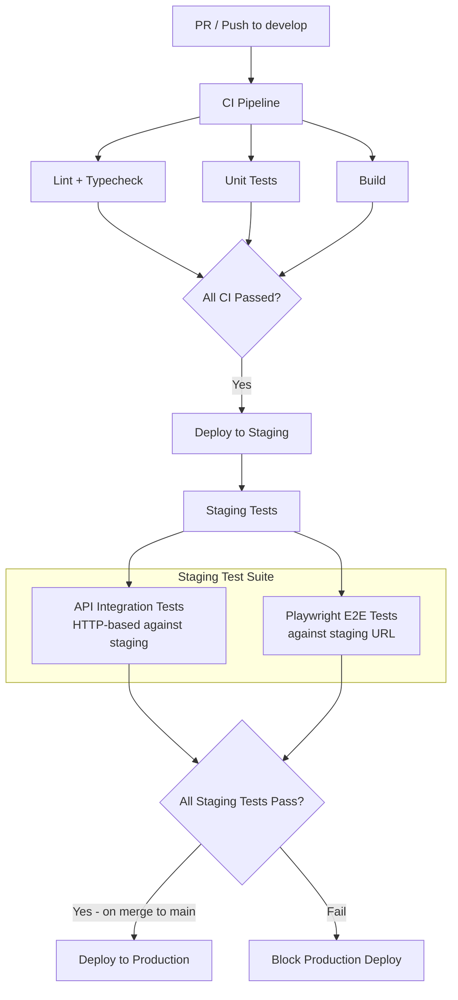
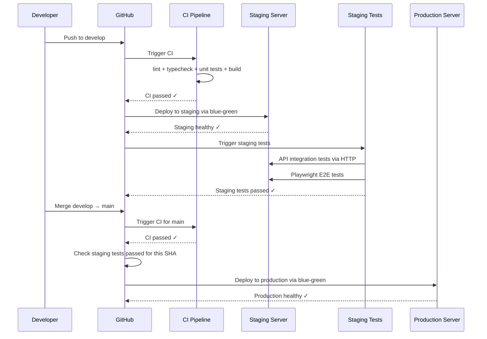

# Testing & Deployment Pipeline Plan

## 1. Current State Analysis

### Existing Tests

- **API unit tests** (7 spec files): `app.controller.spec.ts`, `health.controller.spec.ts`, `logger.service.spec.ts`, `metrics.service.spec.ts`, `throttler.guard.spec.ts`, `throttle.decorator.spec.ts`, `prisma.service.spec.ts`
- **API integration test** (1 file): `app.integration.spec.ts` — uses NestJS Testing Module (no Testcontainers yet)
- **Shared package tests** (3 files): `common.test.ts`, `currency.test.ts`, `pagination.test.ts`
- **E2E test** (1 file): `smoke.spec.ts` — basic Playwright smoke test (homepage + health)

### Existing CI/CD Pipelines

- **`ci.yml`**: lint → typecheck → unit tests → build (runs on PR + push to main/develop)
- **`deploy-staging.yml`**: wait for CI → build images → deploy to staging server (blue-green)
- **`deploy-production.yml`**: validate → wait for CI → build images → deploy to production (blue-green)

### Gaps Identified

1. **No integration tests run in CI** — only unit tests
2. **No tests run against staging** after deployment
3. **No Playwright E2E tests against staging** — only local smoke tests
4. **Production deploys without verifying staging** — no gate
5. **Minimal web frontend tests** — no component tests
6. **Missing deployment monitoring commands** in docs

---

## 2. Target Architecture

### Test Pipeline Flow



### Deployment Gating Strategy



---

## 3. Implementation Plan

### 3.1 Additional API Unit Tests

**Goal**: Increase API unit test coverage for existing services.

**New test files to create:**

| File                                                             | Tests                                                                    |
| ---------------------------------------------------------------- | ------------------------------------------------------------------------ |
| `apps/api/src/app.service.spec.ts`                               | AppService.getRoot returns expected shape                                |
| `apps/api/src/common/filters/all-exceptions.filter.spec.ts`      | Test HttpException handling, unknown exception handling, response format |
| `apps/api/src/common/filters/http-exception.filter.spec.ts`      | Test HTTP exception formatting, status codes                             |
| `apps/api/src/common/interceptors/transform.interceptor.spec.ts` | Test response wrapping, passthrough for paginated data                   |
| `apps/api/src/common/pipes/validation.pipe.spec.ts`              | Test pipe creation with defaults                                         |
| `apps/api/src/common/context/request-context.middleware.spec.ts` | Test correlation ID generation                                           |
| `apps/api/src/common/context/request-context.spec.ts`            | Test AsyncLocalStorage context                                           |

### 3.2 Web Frontend Unit Tests

**Goal**: Add component tests using Vitest + React Testing Library.

**New test files to create:**

| File                                             | Tests                                                     |
| ------------------------------------------------ | --------------------------------------------------------- |
| `apps/web/src/components/ui/Button.spec.tsx`     | Button rendering, variants, click handler, disabled state |
| `apps/web/src/components/layout/Header.spec.tsx` | Header rendering, navigation links, locale display        |
| `apps/web/src/lib/api-client.spec.ts`            | API client methods, error handling, base URL resolution   |
| `apps/web/src/app/[locale]/page.spec.tsx`        | Home page rendering with i18n                             |

### 3.3 Staging API Integration Tests

**Goal**: HTTP-based integration tests that run against the live staging environment (not Testcontainers).

**New directory**: `apps/api/test/staging/`

**New test files:**

| File                                                  | Tests                                                    |
| ----------------------------------------------------- | -------------------------------------------------------- |
| `apps/api/test/staging/health.staging.spec.ts`        | API health endpoint returns healthy, all indicators pass |
| `apps/api/test/staging/api-root.staging.spec.ts`      | API root endpoint returns expected response              |
| `apps/api/test/staging/swagger.staging.spec.ts`       | Swagger docs endpoint is accessible                      |
| `apps/api/test/staging/rate-limiting.staging.spec.ts` | Rate limiting headers present, 429 after threshold       |

**Configuration**:

- New Jest config: `apps/api/jest.staging.config.ts` — reads `STAGING_API_URL` from env
- New npm script: `test:staging` in `apps/api/package.json`
- Tests use `fetch` or `supertest` against the staging URL (no NestJS app bootstrap)

### 3.4 Staging Playwright E2E Tests

**Goal**: Playwright tests against the staging frontend URL.

**New directory**: `apps/web/e2e/staging/`

**New test files:**

| File                                              | Tests                                                               |
| ------------------------------------------------- | ------------------------------------------------------------------- |
| `apps/web/e2e/staging/homepage.staging.spec.ts`   | Homepage loads, title correct, locale redirect works                |
| `apps/web/e2e/staging/navigation.staging.spec.ts` | Navigation between pages, locale switching (en/he)                  |
| `apps/web/e2e/staging/api-proxy.staging.spec.ts`  | API requests through nginx proxy work, health endpoint returns ok   |
| `apps/web/e2e/staging/i18n.staging.spec.ts`       | English and Hebrew content renders correctly, RTL layout for Hebrew |
| `apps/web/e2e/staging/responsive.staging.spec.ts` | Mobile viewport renders correctly, desktop layout works             |

**Configuration**:

- New Playwright config: `apps/web/playwright.staging.config.ts`
  - `baseURL` reads from `STAGING_URL` env var (e.g., `https://<staging domain>`)
  - Only runs Chromium in CI (faster, sufficient for staging validation)
  - Generates HTML report + GitHub Actions reporter
- New npm script: `test:e2e:staging` in `apps/web/package.json`

### 3.5 GitHub Actions: `test-staging.yml`

**New workflow**: `.github/workflows/test-staging.yml`

**Trigger**: `workflow_run` on `deploy-staging.yml` completion (success only)

**Jobs**:

```
Job 1: api-staging-tests
  - Checkout code
  - Install dependencies
  - Run: pnpm --filter api test:staging
  - Environment: STAGING_API_URL from secrets

Job 2: e2e-staging-tests
  - Checkout code
  - Install dependencies
  - Install Playwright browsers
  - Run: pnpm --filter web test:e2e:staging
  - Environment: STAGING_URL from secrets
  - Upload Playwright report as artifact
```

### 3.6 Modify `deploy-production.yml` — Gate on Staging Tests

**Changes**:

- Add new job `staging-tests-check` that runs before `build-and-push`
- This job checks that the latest `test-staging.yml` workflow run for the same commit SHA (or the `develop` branch HEAD) passed successfully
- If staging tests haven't passed, production deploy is blocked

**Logic**:

1. Find the latest `test-staging.yml` run for the repository
2. Verify it completed successfully
3. Optionally verify it ran against a commit that's an ancestor of the current `main` HEAD
4. If not found or failed → block deployment

### 3.7 Modify `deploy-staging.yml` — Trigger Staging Tests

**Changes**:

- After successful deployment, the workflow already completes
- The `test-staging.yml` is triggered automatically via `workflow_run` event
- No changes needed to `deploy-staging.yml` itself (the trigger is on the test-staging side)

### 3.8 Root `package.json` Scripts

**New scripts to add:**

```json
{
  "test:staging": "pnpm --filter api test:staging",
  "test:e2e:staging": "pnpm --filter web test:e2e:staging"
}
```

### 3.9 Rewrite `docs/deployment.md`

**Complete rewrite** with these sections:

1. **Overview** — Updated architecture with test gating
2. **Deployment Pipeline Diagram** — Mermaid showing full CI → staging → tests → production flow
3. **Real-Time Deployment Monitoring Commands**:
   - `gh run watch` — Watch GitHub Actions workflow progress
   - `gh run list --workflow=deploy-staging.yml` — List recent staging deployments
   - `gh run view <run-id> --log` — View deployment logs
   - SSH commands for on-server monitoring
4. **Test Execution and Status Commands**:
   - `gh run list --workflow=test-staging.yml` — List staging test runs
   - `gh run view <run-id>` — View test results
   - Local test execution commands
   - Playwright report viewing
5. **How to Deploy** — Updated staging and production instructions
6. **Production Deployment Gating** — Explanation of how staging tests gate production
7. **Rollback Procedures** — Existing content enhanced
8. **Troubleshooting** — Extended with test-related issues

### 3.10 Update `docs/progress.md`

**Add new section** documenting the testing infrastructure:

- New test files added
- Staging test pipeline
- Production gating mechanism
- Updated quality metrics

### 3.11 Update `IMPLEMENTATION-PLAN.md`

**Update section 3.5 Testing Strategy** to reflect:

- Staging integration tests as part of the pipeline
- Playwright E2E tests against staging
- Production gating on staging test results

---

## 4. File Changes Summary

### New Files

| File                                                             | Purpose                                  |
| ---------------------------------------------------------------- | ---------------------------------------- |
| `.github/workflows/test-staging.yml`                             | Staging test workflow (API + Playwright) |
| `apps/api/jest.staging.config.ts`                                | Jest config for staging HTTP tests       |
| `apps/api/test/staging/health.staging.spec.ts`                   | API health staging test                  |
| `apps/api/test/staging/api-root.staging.spec.ts`                 | API root staging test                    |
| `apps/api/test/staging/swagger.staging.spec.ts`                  | Swagger docs staging test                |
| `apps/api/test/staging/rate-limiting.staging.spec.ts`            | Rate limiting staging test               |
| `apps/api/test/staging/setup.ts`                                 | Staging test setup with base URL         |
| `apps/api/src/app.service.spec.ts`                               | AppService unit test                     |
| `apps/api/src/common/filters/all-exceptions.filter.spec.ts`      | AllExceptionsFilter unit test            |
| `apps/api/src/common/filters/http-exception.filter.spec.ts`      | HttpExceptionFilter unit test            |
| `apps/api/src/common/interceptors/transform.interceptor.spec.ts` | TransformInterceptor unit test           |
| `apps/api/src/common/pipes/validation.pipe.spec.ts`              | ValidationPipe unit test                 |
| `apps/api/src/common/context/request-context.middleware.spec.ts` | RequestContext middleware unit test      |
| `apps/api/src/common/context/request-context.spec.ts`            | RequestContext unit test                 |
| `apps/web/src/components/ui/Button.spec.tsx`                     | Button component test                    |
| `apps/web/src/components/layout/Header.spec.tsx`                 | Header component test                    |
| `apps/web/src/lib/api-client.spec.ts`                            | API client test                          |
| `apps/web/playwright.staging.config.ts`                          | Playwright config for staging            |
| `apps/web/e2e/staging/homepage.staging.spec.ts`                  | Homepage staging E2E test                |
| `apps/web/e2e/staging/navigation.staging.spec.ts`                | Navigation staging E2E test              |
| `apps/web/e2e/staging/api-proxy.staging.spec.ts`                 | API proxy staging E2E test               |
| `apps/web/e2e/staging/i18n.staging.spec.ts`                      | i18n staging E2E test                    |
| `apps/web/e2e/staging/responsive.staging.spec.ts`                | Responsive staging E2E test              |

### Modified Files

| File                                      | Changes                                                   |
| ----------------------------------------- | --------------------------------------------------------- |
| `.github/workflows/deploy-production.yml` | Add staging test gate job                                 |
| `.github/workflows/ci.yml`                | Add integration test job (Testcontainers-based, optional) |
| `apps/api/package.json`                   | Add `test:staging` script                                 |
| `apps/web/package.json`                   | Add `test:e2e:staging` script                             |
| `package.json`                            | Add root `test:staging` and `test:e2e:staging` scripts    |
| `docs/deployment.md`                      | Complete rewrite with monitoring commands and test gating |
| `docs/progress.md`                        | Add testing infrastructure section                        |
| `IMPLEMENTATION-PLAN.md`                  | Update testing strategy                                   |

---

## 5. Key Design Decisions

### Why HTTP-based staging tests (not Testcontainers)?

- Staging tests validate the **real deployed environment** — Docker containers, nginx proxy, database, Redis
- Testcontainers are for local/CI isolation; staging tests need to hit the actual infrastructure
- This catches deployment-specific issues (env vars, networking, SSL) that local tests miss

### Why a separate `test-staging.yml` workflow?

- Decouples testing from deployment — deploy completes first, then tests run
- If tests fail, staging is already deployed (can be inspected/debugged)
- Uses `workflow_run` trigger for clean separation

### Why Chromium-only for staging Playwright?

- Cross-browser testing is important for development (covered by local Playwright config)
- Staging tests are for deployment validation, not browser compatibility
- Running 1 browser instead of 5 reduces CI time significantly

### How does production gating work?

- `deploy-production.yml` adds a `staging-tests-check` job
- This job uses GitHub API to find the latest `test-staging.yml` run
- Verifies it completed with `conclusion: success`
- If no passing run found → deployment fails early with clear error message

---

## 6. GitHub Secrets Required

New secrets needed for staging tests:

| Secret            | Description                        | Example                           |
| ----------------- | ---------------------------------- | --------------------------------- |
| `STAGING_URL`     | Full HTTPS URL to staging frontend | `https://<staging domain>`        |
| `STAGING_API_URL` | Full URL to staging API            | `https://<staging domain>/api/v1` |

These can be derived from existing `CLOUDFLARE_STAGING_SUBDOMAIN` secret within the workflow.
