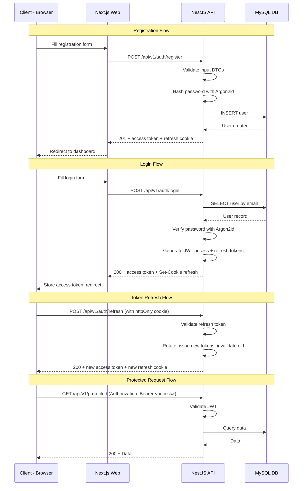
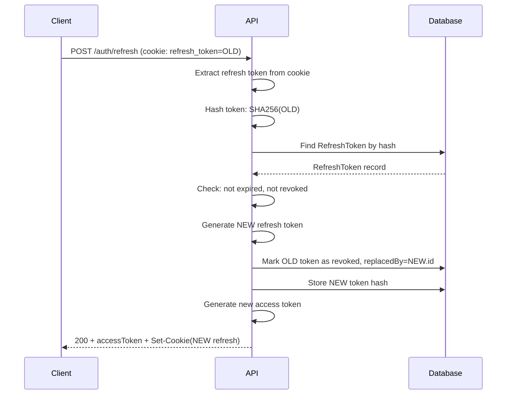

# Phase 1 — Basic Authentication (API-First JWT) — Design Document

> **Purpose**: This document specifies all implementation details for Phase 1: Basic Authentication. It covers user schema, registration, login, JWT tokens, frontend auth pages, route protection, error handling, and auth rate limiting. Security is the top priority.

---

## Table of Contents

1. [Overview](#1-overview)
2. [Iteration 1.0: Infrastructure Prerequisites](#2-iteration-10-infrastructure-prerequisites)
3. [Iteration 1.1: User Schema](#3-iteration-11-user-schema)
4. [Iteration 1.2: Registration API](#4-iteration-12-registration-api)
5. [Iteration 1.3: Password Hashing](#5-iteration-13-password-hashing)
6. [Iteration 1.4: Login API](#6-iteration-14-login-api)
7. [Iteration 1.5: JWT Issuance](#7-iteration-15-jwt-issuance)
8. [Iteration 1.6: Token Refresh API](#8-iteration-16-token-refresh-api)
9. [Iteration 1.7: Login UI](#9-iteration-17-login-ui)
10. [Iteration 1.8: Registration UI](#10-iteration-18-registration-ui)
11. [Iteration 1.9: Frontend Auth Integration](#11-iteration-19-frontend-auth-integration)
12. [Iteration 1.10: Protected Routes](#12-iteration-110-protected-routes)
13. [Iteration 1.11: Error Handling](#13-iteration-111-error-handling)
14. [Iteration 1.12: Auth Rate Limiting](#14-iteration-112-auth-rate-limiting)
15. [Security Architecture](#15-security-architecture)
16. [Database Migration Strategy](#16-database-migration-strategy)
17. [Testing Strategy](#17-testing-strategy)
18. [File Changes Summary](#18-file-changes-summary)

---

## 1. Overview

### Goals

Phase 1 implements the core authentication system using an API-first JWT architecture. All clients (web, bot, mini app) authenticate against the NestJS API, which issues JWT access + refresh tokens.

### Key Security Principles

- **Argon2id** for password hashing (memory-hard, resistant to GPU attacks)
- **Short-lived access tokens** (15 minutes) with **long-lived refresh tokens** (7 days)
- **Refresh tokens stored in httpOnly cookies** (not accessible to JavaScript)
- **Token rotation on refresh** (old refresh token invalidated)
- **CSRF protection** via SameSite=Strict cookies
- **Helmet middleware** for Content Security Policy headers
- **Input validation** on all DTOs (whitelist + forbidNonWhitelisted)
- **Rate limiting** on auth endpoints (5 requests/minute)
- **Audit logging** on all auth events

### Authentication Flow



---

## 2. Iteration 1.0: Infrastructure Prerequisites

Before implementing auth, prepare infrastructure changes.

### 2a. Hourly Backups

Update [`infrastructure/backup/crontab`](../infrastructure/backup/crontab) to run backups hourly instead of daily:

```crontab
# Hourly backup
0 * * * * /opt/myfinpro/scripts/backup.sh --docker >> /var/log/myfinpro/backup.log 2>&1

# Backup age check every 6 hours (alert if > 2 hours old for hourly frequency)
0 */6 * * * /opt/myfinpro/scripts/check-backup-age.sh --max-age 2 >> /var/log/myfinpro/backup-check.log 2>&1
```

Backups are already compressed (gzip) in [`scripts/backup.sh`](../scripts/backup.sh). No changes needed there.

### 2b. Helmet Security Headers

Add `helmet` middleware to every NestJS response for security headers including Content Security Policy.

**New dependency**: `helmet` package in [`apps/api/package.json`](../apps/api/package.json)

Applied in [`apps/api/src/main.ts`](../apps/api/src/main.ts):

```typescript
import helmet from 'helmet';
// ...
app.use(helmet({
  contentSecurityPolicy: {
    directives: {
      defaultSrc: ["'self'"],
      scriptSrc: ["'self'"],
      styleSrc: ["'self'", "'unsafe-inline'"],
      imgSrc: ["'self'", 'data:', 'https:'],
      connectSrc: ["'self'"],
      fontSrc: ["'self'"],
      objectSrc: ["'none'"],
      upgradeInsecureRequests: [],
    },
  },
  crossOriginEmbedderPolicy: false,
}));
```

### 2c. Migration Flow in Deploy Script

Currently [`scripts/deploy.sh`](../scripts/deploy.sh) uses `prisma db push --accept-data-loss` which is unsafe for production data. Change to use `prisma migrate deploy` for proper migration management:

```bash
# Step 4.5 in deploy.sh — changed from db push to migrate deploy
docker exec "${CONTAINER_PREFIX}-api-${NEXT_SLOT}" npx prisma migrate deploy
```

### Files Changed

| File | Change |
|------|--------|
| [`infrastructure/backup/crontab`](../infrastructure/backup/crontab) | Change to hourly backup schedule |
| [`apps/api/package.json`](../apps/api/package.json) | Add `helmet` dependency |
| [`apps/api/src/main.ts`](../apps/api/src/main.ts) | Add Helmet middleware |
| [`scripts/deploy.sh`](../scripts/deploy.sh) | Switch prisma db push to prisma migrate deploy |

---

## 3. Iteration 1.1: User Schema

### Prisma Schema Update

Expand the existing minimal User model in [`apps/api/prisma/schema.prisma`](../apps/api/prisma/schema.prisma):

```prisma
model User {
  id               String    @id @default(uuid()) @db.VarChar(36)
  email            String    @unique @db.VarChar(255)
  passwordHash     String?   @map("password_hash") @db.VarChar(255)
  name             String    @db.VarChar(100)
  defaultCurrency  String    @default("USD") @map("default_currency") @db.VarChar(3)
  locale           String    @default("en") @db.VarChar(5)
  timezone         String    @default("UTC") @db.VarChar(50)
  isActive         Boolean   @default(true) @map("is_active")
  emailVerified    Boolean   @default(false) @map("email_verified")
  lastLoginAt      DateTime? @map("last_login_at")
  createdAt        DateTime  @default(now()) @map("created_at")
  updatedAt        DateTime  @updatedAt @map("updated_at")

  refreshTokens    RefreshToken[]

  @@index([email])
  @@index([createdAt])
  @@map("users")
}

model RefreshToken {
  id          String   @id @default(uuid()) @db.VarChar(36)
  tokenHash   String   @unique @map("token_hash") @db.VarChar(255)
  userId      String   @map("user_id") @db.VarChar(36)
  user        User     @relation(fields: [userId], references: [id], onDelete: Cascade)
  expiresAt   DateTime @map("expires_at")
  createdAt   DateTime @default(now()) @map("created_at")
  revokedAt   DateTime? @map("revoked_at")
  replacedBy  String?  @map("replaced_by") @db.VarChar(36)
  userAgent   String?  @map("user_agent") @db.VarChar(500)
  ipAddress   String?  @map("ip_address") @db.VarChar(45)

  @@index([userId])
  @@index([expiresAt])
  @@map("refresh_tokens")
}

model AuditLog {
  id         String   @id @default(uuid()) @db.VarChar(36)
  userId     String?  @map("user_id") @db.VarChar(36)
  action     String   @db.VarChar(100)
  entity     String   @db.VarChar(100)
  entityId   String?  @map("entity_id") @db.VarChar(36)
  details    Json?
  ipAddress  String?  @map("ip_address") @db.VarChar(45)
  userAgent  String?  @map("user_agent") @db.VarChar(500)
  createdAt  DateTime @default(now()) @map("created_at")

  @@index([userId])
  @@index([action])
  @@index([createdAt])
  @@map("audit_logs")
}
```

**Migration strategy**: Since we're changing the User id from `Int autoincrement` to `String uuid`, and the existing `users` table in staging/production may have the phase 0 placeholder rows, we need a Prisma migration. This is a breaking change but acceptable since no real user data exists yet.

### Key Design Decisions

- **UUID for user IDs**: Prevents enumeration attacks (vs sequential integers)
- **passwordHash nullable**: Supports OAuth-only users in future phases (Google, Telegram)
- **RefreshToken model**: Tracks all issued refresh tokens for token rotation and revocation
- **AuditLog model**: Immutable log of all auth events for security compliance
- **Soft-delete style with isActive**: Preserves data for audit, GDPR compliance later

### Tests

- **Migration test**: Verify migration applies cleanly to a fresh database
- **Schema test**: Verify all indexes exist, constraints work

### Files Changed/Created

| File | Change |
|------|--------|
| [`apps/api/prisma/schema.prisma`](../apps/api/prisma/schema.prisma) | Update User model, add RefreshToken and AuditLog models |
| `apps/api/prisma/migrations/YYYYMMDD_phase1_user_schema/` | New migration |
| [`apps/api/prisma/seed.ts`](../apps/api/prisma/seed.ts) | Update seed for new User schema (dev user for testing) |

---

## 4. Iteration 1.2: Registration API

### Endpoint

`POST /api/v1/auth/register`

### DTOs

```typescript
// apps/api/src/auth/dto/register.dto.ts
class RegisterDto {
  @IsEmail()
  @Transform(({ value }) => value?.toLowerCase().trim())
  email: string;

  @IsString()
  @MinLength(8)
  @MaxLength(128)
  @Matches(/^(?=.*[a-z])(?=.*[A-Z])(?=.*\d)/, {
    message: 'Password must contain at least one uppercase letter, one lowercase letter, and one number',
  })
  password: string;

  @IsString()
  @MinLength(1)
  @MaxLength(100)
  @Transform(({ value }) => value?.trim())
  name: string;

  @IsOptional()
  @IsIn(CURRENCIES)
  defaultCurrency?: string;

  @IsOptional()
  @IsIn(LOCALES)
  locale?: string;
}
```

### Response

```typescript
// 201 Created
{
  data: {
    user: {
      id: string;
      email: string;
      name: string;
      defaultCurrency: string;
      locale: string;
    };
    accessToken: string;
  }
}
// + Set-Cookie: refresh_token=<token>; HttpOnly; Secure; SameSite=Strict; Path=/api/v1/auth; Max-Age=604800
```

### Business Rules

- Email must be unique (409 Conflict if exists)
- Password minimum 8 characters, requires uppercase + lowercase + digit
- Name is required, 1-100 characters
- Default currency defaults to USD, locale defaults to en
- Upon successful registration, issue access + refresh tokens immediately (auto-login)
- Log registration event to AuditLog

### Files Created

| File | Purpose |
|------|---------|
| `apps/api/src/auth/auth.module.ts` | Auth module with all providers |
| `apps/api/src/auth/auth.controller.ts` | Auth endpoints |
| `apps/api/src/auth/auth.service.ts` | Auth business logic |
| `apps/api/src/auth/dto/register.dto.ts` | Registration DTO |
| `apps/api/src/auth/dto/login.dto.ts` | Login DTO (placeholder for 1.4) |
| `apps/api/src/auth/dto/auth-response.dto.ts` | Auth response DTO |
| `apps/api/src/auth/auth.controller.spec.ts` | Controller unit tests |
| `apps/api/src/auth/auth.service.spec.ts` | Service unit tests |
| `apps/api/test/integration/auth.integration.spec.ts` | Integration tests |

---

## 5. Iteration 1.3: Password Hashing

### Argon2 Configuration

```typescript
// apps/api/src/auth/services/password.service.ts
import * as argon2 from 'argon2';

@Injectable()
export class PasswordService {
  private readonly hashOptions: argon2.Options = {
    type: argon2.argon2id,     // Hybrid: resistant to both side-channel and GPU attacks
    memoryCost: 65536,          // 64 MB memory
    timeCost: 3,                // 3 iterations
    parallelism: 4,             // 4 threads
    hashLength: 32,             // 32 bytes output
  };

  async hash(password: string): Promise<string> {
    return argon2.hash(password, this.hashOptions);
  }

  async verify(hash: string, password: string): Promise<boolean> {
    return argon2.verify(hash, password);
  }
}
```

### Password Validation Rules

- Minimum 8 characters, maximum 128 characters
- At least one uppercase letter
- At least one lowercase letter
- At least one digit
- No password reuse check (added in later phases with password history)
- Password is validated in the DTO before reaching the service layer

### Security Notes

- Argon2id is the recommended algorithm (OWASP 2024)
- Memory cost of 64MB prevents efficient GPU parallel attacks
- Passwords are never logged or returned in responses
- Hash comparison is constant-time (provided by argon2 library)

### Files Created

| File | Purpose |
|------|---------|
| `apps/api/src/auth/services/password.service.ts` | Password hashing/verification |
| `apps/api/src/auth/services/password.service.spec.ts` | Password service tests |

### Dependencies

Add to [`apps/api/package.json`](../apps/api/package.json): `argon2`

---

## 6. Iteration 1.4: Login API

### Endpoint

`POST /api/v1/auth/login`

### DTO

```typescript
// apps/api/src/auth/dto/login.dto.ts
class LoginDto {
  @IsEmail()
  @Transform(({ value }) => value?.toLowerCase().trim())
  email: string;

  @IsString()
  @MinLength(1)
  password: string;
}
```

### Passport Local Strategy

```typescript
// apps/api/src/auth/strategies/local.strategy.ts
@Injectable()
export class LocalStrategy extends PassportStrategy(Strategy) {
  constructor(private authService: AuthService) {
    super({ usernameField: 'email' });
  }

  async validate(email: string, password: string): Promise<User> {
    const user = await this.authService.validateUser(email, password);
    if (!user) {
      throw new UnauthorizedException('Invalid email or password');
    }
    return user;
  }
}
```

### Response

Same format as registration — returns access token in body, refresh token in httpOnly cookie.

### Business Rules

- Generic error message for invalid email OR invalid password (prevent user enumeration)
- Update `lastLoginAt` on successful login
- Log login event to AuditLog (include IP, user agent)
- Log failed login attempts to AuditLog (without exposing which field is wrong)
- Account must be active (`isActive: true`)

### Files Created/Modified

| File | Purpose |
|------|---------|
| `apps/api/src/auth/strategies/local.strategy.ts` | Passport local strategy |
| `apps/api/src/auth/guards/local-auth.guard.ts` | Local auth guard |
| `apps/api/src/auth/dto/login.dto.ts` | Login DTO |

### Dependencies

Add to [`apps/api/package.json`](../apps/api/package.json): `@nestjs/passport`, `passport`, `passport-local`, `@types/passport-local`

---

## 7. Iteration 1.5: JWT Issuance

### Token Configuration

| Token | Expiry | Storage | Purpose |
|-------|--------|---------|---------|
| Access Token | 15 minutes | Response body → client memory/localStorage | API authentication |
| Refresh Token | 7 days | httpOnly Secure SameSite=Strict cookie | Token refresh |

### JWT Strategy

```typescript
// apps/api/src/auth/strategies/jwt.strategy.ts
@Injectable()
export class JwtStrategy extends PassportStrategy(Strategy) {
  constructor(private configService: ConfigService) {
    super({
      jwtFromRequest: ExtractJwt.fromAuthHeaderAsBearerToken(),
      ignoreExpiration: false,
      secretOrKey: configService.get<string>('JWT_ACCESS_SECRET'),
    });
  }

  async validate(payload: JwtPayload): Promise<JwtPayload> {
    return payload;
  }
}
```

### JWT Payload

```typescript
interface JwtPayload {
  sub: string;       // User ID (UUID)
  email: string;
  name: string;
  iat: number;
  exp: number;
}
```

### Token Service

```typescript
// apps/api/src/auth/services/token.service.ts
@Injectable()
export class TokenService {
  generateAccessToken(user: User): string;
  generateRefreshToken(): string;       // Random UUID, stored hashed in DB
  setRefreshTokenCookie(response: Response, token: string): void;
  clearRefreshTokenCookie(response: Response): void;
  hashToken(token: string): string;     // SHA-256 for DB storage
}
```

### Cookie Configuration

```typescript
{
  httpOnly: true,
  secure: process.env.NODE_ENV === 'production',
  sameSite: 'strict',
  path: '/api/v1/auth',
  maxAge: 7 * 24 * 60 * 60 * 1000, // 7 days in ms
}
```

### Files Created

| File | Purpose |
|------|---------|
| `apps/api/src/auth/strategies/jwt.strategy.ts` | JWT strategy for Passport |
| `apps/api/src/auth/guards/jwt-auth.guard.ts` | JWT auth guard |
| `apps/api/src/auth/services/token.service.ts` | Token generation + cookie management |
| `apps/api/src/auth/services/token.service.spec.ts` | Token service tests |
| `apps/api/src/auth/interfaces/jwt-payload.interface.ts` | JWT payload type |

### Dependencies

Add: `@nestjs/jwt`, `passport-jwt`, `@types/passport-jwt`, `cookie-parser`, `@types/cookie-parser`

---

## 8. Iteration 1.6: Token Refresh API

### Endpoints

- `POST /api/v1/auth/refresh` — Refresh tokens
- `POST /api/v1/auth/logout` — Revoke refresh token + clear cookie

### Token Rotation Flow



### Reuse Detection

If a revoked refresh token is used (potential token theft):
1. Find the token chain via `replacedBy` links
2. Revoke ALL tokens in the family (all descendants)
3. Return 401 with `token_reuse_detected` error code
4. Log security event to AuditLog

### Logout

```typescript
// POST /api/v1/auth/logout
// Revokes the current refresh token and clears the cookie
async logout(refreshToken: string, response: Response): Promise<void> {
  // Hash and find the token
  // Mark as revoked
  // Clear the cookie
  // Log audit event
}
```

### Files Created

| File | Purpose |
|------|---------|
| `apps/api/src/auth/services/refresh-token.service.ts` | Refresh token CRUD + rotation |
| `apps/api/src/auth/services/refresh-token.service.spec.ts` | Tests |
| `apps/api/src/auth/services/audit.service.ts` | Audit logging service |
| `apps/api/src/auth/services/audit.service.spec.ts` | Tests |

---

## 9. Iteration 1.7: Login UI

### Page: `/[locale]/auth/login`

Design following security best practices:

- Email + password fields
- Submit button
- Link to registration page
- "Forgot password?" link (disabled/placeholder for future)
- Future: Google OAuth and Telegram login buttons (placeholders)
- All strings via i18n translation keys

### Wireframe

```
┌─────────────────────────────────────┐
│          MyFinPro Header            │
├─────────────────────────────────────┤
│                                     │
│         Sign In to MyFinPro         │
│                                     │
│  ┌─────────────────────────────┐    │
│  │  Email                      │    │
│  └─────────────────────────────┘    │
│  ┌─────────────────────────────┐    │
│  │  Password                   │    │
│  └─────────────────────────────┘    │
│                                     │
│  [        Sign In           ]       │
│                                     │
│  ────── or sign in with ──────      │
│                                     │
│  [ Google ] [ Telegram ] (disabled) │
│                                     │
│  Dont have an account? Sign up      │
│  Forgot your password? (future)     │
│                                     │
└─────────────────────────────────────┘
```

### i18n Keys

Add to `messages/en.json` and `messages/he.json`:

```json
{
  "auth": {
    "signIn": "Sign In",
    "signUp": "Sign Up",
    "email": "Email",
    "password": "Password",
    "confirmPassword": "Confirm Password",
    "name": "Full Name",
    "signInTitle": "Sign in to MyFinPro",
    "signUpTitle": "Create your account",
    "noAccount": "Don't have an account?",
    "hasAccount": "Already have an account?",
    "forgotPassword": "Forgot your password?",
    "orSignInWith": "Or sign in with",
    "google": "Google",
    "telegram": "Telegram",
    "signingIn": "Signing in...",
    "signingUp": "Creating account...",
    "invalidCredentials": "Invalid email or password",
    "emailRequired": "Email is required",
    "passwordRequired": "Password is required",
    "passwordMinLength": "Password must be at least 8 characters",
    "passwordRequirements": "Must contain uppercase, lowercase, and a number",
    "nameRequired": "Name is required",
    "emailAlreadyExists": "An account with this email already exists",
    "registrationSuccess": "Account created successfully!",
    "loginSuccess": "Welcome back!"
  }
}
```

### Files Created

| File | Purpose |
|------|---------|
| `apps/web/src/app/[locale]/auth/login/page.tsx` | Login page |
| `apps/web/src/components/auth/LoginForm.tsx` | Login form component |
| `apps/web/src/components/auth/LoginForm.spec.tsx` | Login form tests |
| `apps/web/messages/en.json` | Updated with auth i18n keys |
| `apps/web/messages/he.json` | Updated with auth i18n keys |

---

## 10. Iteration 1.8: Registration UI

### Page: `/[locale]/auth/register`

- Name, email, password, confirm password fields
- Password strength indicator
- Client-side validation matching server-side rules
- Submit button with loading state
- Link to login page
- All strings via i18n

### Wireframe

```
┌─────────────────────────────────────┐
│          MyFinPro Header            │
├─────────────────────────────────────┤
│                                     │
│       Create your account           │
│                                     │
│  ┌─────────────────────────────┐    │
│  │  Full Name                  │    │
│  └─────────────────────────────┘    │
│  ┌─────────────────────────────┐    │
│  │  Email                      │    │
│  └─────────────────────────────┘    │
│  ┌─────────────────────────────┐    │
│  │  Password                   │    │
│  └─────────────────────────────┘    │
│  Password strength: ████░░░░ Good   │
│  ┌─────────────────────────────┐    │
│  │  Confirm Password           │    │
│  └─────────────────────────────┘    │
│                                     │
│  [      Create Account      ]       │
│                                     │
│  Already have an account? Sign in   │
│                                     │
└─────────────────────────────────────┘
```

### Validation Rules (Client-side)

- Name: required, 1-100 chars
- Email: valid email format
- Password: min 8 chars, uppercase + lowercase + digit
- Confirm password: must match password
- Show field-level error messages on blur and submit

### Files Created

| File | Purpose |
|------|---------|
| `apps/web/src/app/[locale]/auth/register/page.tsx` | Registration page |
| `apps/web/src/components/auth/RegisterForm.tsx` | Registration form component |
| `apps/web/src/components/auth/RegisterForm.spec.tsx` | Registration form tests |
| `apps/web/src/components/auth/PasswordStrength.tsx` | Password strength indicator |
| `apps/web/src/components/auth/PasswordStrength.spec.tsx` | Password strength tests |
| `apps/web/src/components/ui/Input.tsx` | Reusable input component |
| `apps/web/src/components/ui/Input.spec.tsx` | Input component tests |

---

## 11. Iteration 1.9: Frontend Auth Integration

### Auth Context

```typescript
// apps/web/src/lib/auth/auth-context.tsx
interface AuthContextType {
  user: User | null;
  isAuthenticated: boolean;
  isLoading: boolean;
  login: (email: string, password: string) => Promise<void>;
  register: (data: RegisterData) => Promise<void>;
  logout: () => Promise<void>;
  refreshToken: () => Promise<void>;
}
```

### Token Storage

- **Access token**: Stored in memory (React state) — cleared on page refresh
- **Refresh token**: httpOnly cookie (managed by server, not accessible to JS)
- On page load: attempt silent refresh via `POST /auth/refresh` to restore session

### Auto-Refresh Mechanism

```typescript
// Interceptor pattern:
// 1. On any 401 response, attempt token refresh
// 2. If refresh succeeds, retry the original request
// 3. If refresh fails, redirect to login
```

### API Client Enhancement

Extend [`apps/web/src/lib/api-client.ts`](../apps/web/src/lib/api-client.ts) with:

- Authorization header injection from auth context
- 401 response interception with auto-refresh
- Cookie inclusion (`credentials: 'include'`)

### Files Created/Modified

| File | Purpose |
|------|---------|
| `apps/web/src/lib/auth/auth-context.tsx` | React auth context provider |
| `apps/web/src/lib/auth/auth-context.spec.tsx` | Auth context tests |
| `apps/web/src/lib/auth/types.ts` | Auth-related types |
| [`apps/web/src/lib/api-client.ts`](../apps/web/src/lib/api-client.ts) | Enhanced with auth headers + refresh interceptor |
| [`apps/web/src/app/[locale]/layout.tsx`](../apps/web/src/app/[locale]/layout.tsx) | Wrap with AuthProvider |

---

## 12. Iteration 1.10: Protected Routes

### Backend: JWT Guards

```typescript
// Already built in 1.5
// Apply @UseGuards(JwtAuthGuard) to protected endpoints
```

### Backend: Current User Decorator

```typescript
// apps/api/src/auth/decorators/current-user.decorator.ts
export const CurrentUser = createParamDecorator(
  (data: string | undefined, ctx: ExecutionContext) => {
    const request = ctx.switchToHttp().getRequest();
    const user = request.user;
    return data ? user?.[data] : user;
  },
);
```

### Backend: Test Protected Endpoint

Create a simple `/api/v1/auth/me` endpoint that returns the current user's profile:

```typescript
@Get('me')
@UseGuards(JwtAuthGuard)
@ApiBearerAuth('access-token')
getProfile(@CurrentUser() user: JwtPayload) {
  return this.authService.getProfile(user.sub);
}
```

### Frontend: Route Guards

```typescript
// apps/web/src/components/auth/ProtectedRoute.tsx
// Wraps children, redirects to /auth/login if not authenticated
// Shows loading spinner during auth check
```

### Frontend: Protected Dashboard Page

Create a simple `/[locale]/dashboard` page behind auth:

```
┌─────────────────────────────────────┐
│  MyFinPro   [Dashboard] [Logout]    │
├─────────────────────────────────────┤
│                                     │
│  Welcome back, {name}!              │
│                                     │
│  This is a protected page.          │
│  Your profile:                      │
│  - Email: user@example.com          │
│  - Currency: USD                    │
│  - Locale: en                       │
│                                     │
└─────────────────────────────────────┘
```

### Files Created

| File | Purpose |
|------|---------|
| `apps/api/src/auth/decorators/current-user.decorator.ts` | Extract current user from request |
| `apps/web/src/components/auth/ProtectedRoute.tsx` | Client-side route protection |
| `apps/web/src/components/auth/ProtectedRoute.spec.tsx` | Protected route tests |
| `apps/web/src/app/[locale]/dashboard/page.tsx` | Protected dashboard page |
| `apps/web/e2e/auth.spec.ts` | E2E auth flow tests (Playwright) |

### Playwright E2E Tests

```typescript
test('unauthenticated user is redirected to login', async ({ page }) => { ... });
test('user can register and see dashboard', async ({ page }) => { ... });
test('user can login and see dashboard', async ({ page }) => { ... });
test('user can logout and is redirected', async ({ page }) => { ... });
```

---

## 13. Iteration 1.11: Error Handling

### Backend: Enhanced Exception Filter

The existing [`AllExceptionsFilter`](../apps/api/src/common/filters/all-exceptions.filter.ts) is already in place. Enhancements:

- Add structured error codes for auth errors
- Classification of auth errors:
  - `AUTH_INVALID_CREDENTIALS` — wrong email/password
  - `AUTH_EMAIL_EXISTS` — duplicate email registration
  - `AUTH_TOKEN_EXPIRED` — JWT expired
  - `AUTH_TOKEN_INVALID` — JWT malformed
  - `AUTH_REFRESH_EXPIRED` — refresh token expired
  - `AUTH_REFRESH_REUSED` — token reuse detected (security event)
  - `AUTH_ACCOUNT_INACTIVE` — deactivated account

### Frontend: Error Boundary

```typescript
// apps/web/src/components/error/ErrorBoundary.tsx
// Catches React rendering errors, shows fallback UI
```

### Frontend: Toast Notification System

```typescript
// apps/web/src/components/ui/Toast.tsx
// apps/web/src/lib/toast/toast-context.tsx
// Provides showToast(message, type) function
// Types: success, error, warning, info
// Auto-dismiss after 5 seconds
```

### Files Created

| File | Purpose |
|------|---------|
| `apps/api/src/auth/constants/error-codes.ts` | Auth error code constants |
| `apps/web/src/components/error/ErrorBoundary.tsx` | React error boundary |
| `apps/web/src/components/error/ErrorBoundary.spec.tsx` | Error boundary tests |
| `apps/web/src/components/ui/Toast.tsx` | Toast notification component |
| `apps/web/src/components/ui/Toast.spec.tsx` | Toast tests |
| `apps/web/src/lib/toast/toast-context.tsx` | Toast context provider |

---

## 14. Iteration 1.12: Auth Rate Limiting

### Configuration

| Endpoint | Rate Limit | Window |
|----------|-----------|--------|
| `POST /auth/register` | 5 requests | 60 seconds |
| `POST /auth/login` | 5 requests | 60 seconds |
| `POST /auth/refresh` | 10 requests | 60 seconds |
| `POST /auth/logout` | 10 requests | 60 seconds |
| All other endpoints | 60 requests | 60 seconds (existing) |

### Implementation

Use the existing [`@CustomThrottle`](../apps/api/src/common/decorators/throttle.decorator.ts) decorator on auth endpoints:

```typescript
@Controller('auth')
export class AuthController {
  @Post('register')
  @CustomThrottle({ limit: 5, ttl: 60000 })
  register(@Body() dto: RegisterDto) { ... }

  @Post('login')
  @CustomThrottle({ limit: 5, ttl: 60000 })
  login(@Body() dto: LoginDto) { ... }
}
```

### Tests

- Verify 429 response after exceeding limit
- Verify rate limit headers in response (`X-RateLimit-Limit`, `X-RateLimit-Remaining`)
- Staging integration test for rate limiting on auth endpoints

### Files Modified

| File | Change |
|------|--------|
| `apps/api/src/auth/auth.controller.ts` | Add @CustomThrottle decorators |
| `apps/api/test/integration/auth-rate-limit.integration.spec.ts` | Rate limit integration tests |
| `apps/api/test/staging/auth-rate-limiting.staging.spec.ts` | Staging rate limit tests |

---

## 15. Security Architecture

### Security Checklist for Phase 1

- [ ] Argon2id password hashing (64MB memory, 3 iterations)
- [ ] JWT access tokens: 15-minute expiry, signed with HS256
- [ ] Refresh tokens: 7-day expiry, stored hashed (SHA-256) in DB
- [ ] httpOnly Secure SameSite=Strict cookies for refresh tokens
- [ ] Token rotation on refresh (old token revoked)
- [ ] Token reuse detection (revoke entire family on detection)
- [ ] Helmet middleware with Content Security Policy
- [ ] Input validation on ALL DTOs (whitelist, forbidNonWhitelisted)
- [ ] Generic error messages (prevent user enumeration)
- [ ] Rate limiting on auth endpoints (5/min)
- [ ] Audit logging for all auth events
- [ ] Password complexity requirements enforced
- [ ] UUID user IDs (prevent sequential enumeration)
- [ ] CORS configured with specific origins
- [ ] cookie-parser for httpOnly cookie extraction

### Threat Model

| Threat | Mitigation |
|--------|-----------|
| Password brute force | Rate limiting (5/min), Argon2 slow hashing |
| Token theft (XSS) | Access token in memory, refresh in httpOnly cookie |
| Token theft (CSRF) | SameSite=Strict, CORS |
| User enumeration | Generic login error messages |
| Token replay | Token rotation, reuse detection |
| SQL injection | Prisma parameterized queries |
| XSS | Helmet CSP headers, React auto-escaping |
| Session fixation | New tokens on login/register |

---

## 16. Database Migration Strategy

### Expand-Then-Contract Pattern

Since this is the first major schema change, and there is no real user data yet (only Phase 0 placeholder):

1. **Create new migration**: Drop old User table (id Int), create new User (id String UUID) + RefreshToken + AuditLog
2. **Apply in deploy**: `prisma migrate deploy` runs before new code starts
3. **Blue-green safety**: The new schema is only used by new code. Old slot doesn't exist simultaneously for Phase 1 (fresh deploy).

### For future phases (where data exists):

- Always ADD columns/tables first (expand)
- Deploy code that uses new schema
- Remove old columns/tables in a separate migration later (contract)

---

## 17. Testing Strategy

### Test Counts per Iteration

| Iteration | Unit Tests | Integration Tests | E2E Tests |
|-----------|-----------|-------------------|-----------|
| 1.0 | 2 (Helmet) | 0 | 0 |
| 1.1 | 3 (schema validation) | 2 (migration) | 0 |
| 1.2 | 8 (controller + service) | 4 (registration flow) | 0 |
| 1.3 | 5 (password hash/verify) | 0 | 0 |
| 1.4 | 6 (login flow) | 4 (login integration) | 0 |
| 1.5 | 8 (token generation) | 2 (token flow) | 0 |
| 1.6 | 10 (refresh/rotation/reuse) | 4 (refresh integration) | 0 |
| 1.7 | 4 (login form render) | 0 | 2 (page loads, form works) |
| 1.8 | 6 (register form render) | 0 | 2 (page loads, validation) |
| 1.9 | 6 (auth context) | 0 | 4 (full auth flow) |
| 1.10 | 4 (route guards) | 2 (protected endpoint) | 4 (protected routes) |
| 1.11 | 6 (error boundary, toast) | 0 | 2 (error scenarios) |
| 1.12 | 4 (rate limiting) | 2 (rate limit integration) | 0 |

**Total estimated: ~92 new tests**

### Playwright E2E Scenarios

1. Homepage loads and shows login/register links
2. Navigate to login page — form renders correctly
3. Navigate to register page — form renders correctly
4. Register a new user — see dashboard
5. Logout — redirected to home/login
6. Login with created user — see dashboard
7. Access dashboard without auth — redirected to login
8. Login with wrong password — see error message
9. Register with existing email — see error message
10. Rate limiting — rapid login attempts show rate limit error

---

## 18. File Changes Summary

### New Files (by module)

**Auth Module (API):**

| File | Purpose |
|------|---------|
| `apps/api/src/auth/auth.module.ts` | Auth module |
| `apps/api/src/auth/auth.controller.ts` | Auth endpoints |
| `apps/api/src/auth/auth.service.ts` | Auth business logic |
| `apps/api/src/auth/auth.controller.spec.ts` | Controller tests |
| `apps/api/src/auth/auth.service.spec.ts` | Service tests |
| `apps/api/src/auth/dto/register.dto.ts` | Register DTO |
| `apps/api/src/auth/dto/login.dto.ts` | Login DTO |
| `apps/api/src/auth/dto/auth-response.dto.ts` | Response DTO |
| `apps/api/src/auth/services/password.service.ts` | Argon2 hashing |
| `apps/api/src/auth/services/password.service.spec.ts` | Tests |
| `apps/api/src/auth/services/token.service.ts` | JWT + refresh token |
| `apps/api/src/auth/services/token.service.spec.ts` | Tests |
| `apps/api/src/auth/services/refresh-token.service.ts` | Refresh token CRUD |
| `apps/api/src/auth/services/refresh-token.service.spec.ts` | Tests |
| `apps/api/src/auth/services/audit.service.ts` | Audit logging |
| `apps/api/src/auth/services/audit.service.spec.ts` | Tests |
| `apps/api/src/auth/strategies/local.strategy.ts` | Passport local |
| `apps/api/src/auth/strategies/jwt.strategy.ts` | Passport JWT |
| `apps/api/src/auth/guards/local-auth.guard.ts` | Local auth guard |
| `apps/api/src/auth/guards/jwt-auth.guard.ts` | JWT auth guard |
| `apps/api/src/auth/decorators/current-user.decorator.ts` | Current user decorator |
| `apps/api/src/auth/interfaces/jwt-payload.interface.ts` | JWT payload type |
| `apps/api/src/auth/constants/error-codes.ts` | Error code constants |

**Auth UI (Web):**

| File | Purpose |
|------|---------|
| `apps/web/src/app/[locale]/auth/login/page.tsx` | Login page |
| `apps/web/src/app/[locale]/auth/register/page.tsx` | Register page |
| `apps/web/src/app/[locale]/dashboard/page.tsx` | Dashboard (protected) |
| `apps/web/src/components/auth/LoginForm.tsx` | Login form |
| `apps/web/src/components/auth/LoginForm.spec.tsx` | Tests |
| `apps/web/src/components/auth/RegisterForm.tsx` | Register form |
| `apps/web/src/components/auth/RegisterForm.spec.tsx` | Tests |
| `apps/web/src/components/auth/PasswordStrength.tsx` | Password meter |
| `apps/web/src/components/auth/PasswordStrength.spec.tsx` | Tests |
| `apps/web/src/components/auth/ProtectedRoute.tsx` | Route protection |
| `apps/web/src/components/auth/ProtectedRoute.spec.tsx` | Tests |
| `apps/web/src/components/error/ErrorBoundary.tsx` | Error boundary |
| `apps/web/src/components/error/ErrorBoundary.spec.tsx` | Tests |
| `apps/web/src/components/ui/Input.tsx` | Input component |
| `apps/web/src/components/ui/Input.spec.tsx` | Tests |
| `apps/web/src/components/ui/Toast.tsx` | Toast component |
| `apps/web/src/components/ui/Toast.spec.tsx` | Tests |
| `apps/web/src/lib/auth/auth-context.tsx` | Auth provider |
| `apps/web/src/lib/auth/auth-context.spec.tsx` | Tests |
| `apps/web/src/lib/auth/types.ts` | Auth types |
| `apps/web/src/lib/toast/toast-context.tsx` | Toast provider |

**Tests:**

| File | Purpose |
|------|---------|
| `apps/api/test/integration/auth.integration.spec.ts` | Auth integration tests |
| `apps/api/test/integration/auth-rate-limit.integration.spec.ts` | Rate limit tests |
| `apps/api/test/staging/auth.staging.spec.ts` | Staging auth tests |
| `apps/api/test/staging/auth-rate-limiting.staging.spec.ts` | Staging rate limit tests |
| `apps/web/e2e/auth.spec.ts` | Full E2E auth flow |
| `apps/web/e2e/staging/auth.staging.spec.ts` | Staging auth E2E |

### Modified Files

| File | Change |
|------|--------|
| [`apps/api/prisma/schema.prisma`](../apps/api/prisma/schema.prisma) | New User, RefreshToken, AuditLog models |
| [`apps/api/prisma/seed.ts`](../apps/api/prisma/seed.ts) | Dev user seed data |
| [`apps/api/src/app.module.ts`](../apps/api/src/app.module.ts) | Import AuthModule |
| [`apps/api/src/main.ts`](../apps/api/src/main.ts) | Add Helmet, cookie-parser |
| [`apps/api/package.json`](../apps/api/package.json) | New dependencies |
| [`apps/web/package.json`](../apps/web/package.json) | New dependencies if needed |
| [`apps/web/src/app/[locale]/layout.tsx`](../apps/web/src/app/[locale]/layout.tsx) | Add AuthProvider, ToastProvider |
| [`apps/web/src/lib/api-client.ts`](../apps/web/src/lib/api-client.ts) | Auth header + refresh interceptor |
| [`apps/web/src/components/layout/Header.tsx`](../apps/web/src/components/layout/Header.tsx) | Add auth nav items |
| [`apps/web/messages/en.json`](../apps/web/messages/en.json) | Auth i18n keys |
| [`apps/web/messages/he.json`](../apps/web/messages/he.json) | Auth i18n keys |
| [`infrastructure/backup/crontab`](../infrastructure/backup/crontab) | Hourly backup schedule |
| [`scripts/deploy.sh`](../scripts/deploy.sh) | Change to prisma migrate deploy |
| [`docs/progress.md`](progress.md) | Document each iteration progress |

### New Dependencies

**API (`apps/api/package.json`):**

| Package | Purpose |
|---------|---------|
| `argon2` | Password hashing |
| `@nestjs/passport` | Passport integration |
| `passport` | Authentication framework |
| `passport-local` | Local (email/password) strategy |
| `passport-jwt` | JWT strategy |
| `@nestjs/jwt` | JWT token generation |
| `cookie-parser` | Parse httpOnly cookies |
| `helmet` | Security headers |
| `@types/passport-local` | TypeScript types |
| `@types/passport-jwt` | TypeScript types |
| `@types/cookie-parser` | TypeScript types |

---

## Appendix: Iteration Execution Order

```mermaid
gantt
    title Phase 1 Execution Order
    dateFormat X
    axisFormat %s

    section Infrastructure
    1.0 Backup + Helmet + Migration flow :i0, 0, 1

    section Schema
    1.1 User Schema + Migration :i1, after i0, 1

    section API Auth Backend
    1.2 Registration API :i2, after i1, 1
    1.3 Password Hashing :i3, after i2, 1
    1.4 Login API :i4, after i3, 1
    1.5 JWT Issuance :i5, after i4, 1
    1.6 Token Refresh + Logout :i6, after i5, 1

    section Frontend Auth
    1.7 Login UI :i7, after i6, 1
    1.8 Registration UI :i8, after i7, 1
    1.9 Auth Integration :i9, after i8, 1

    section Protection + Polish
    1.10 Protected Routes :i10, after i9, 1
    1.11 Error Handling :i11, after i10, 1
    1.12 Auth Rate Limiting :i12, after i11, 1
```



Each iteration deploys to both staging and production via the existing CI/CD pipeline.
