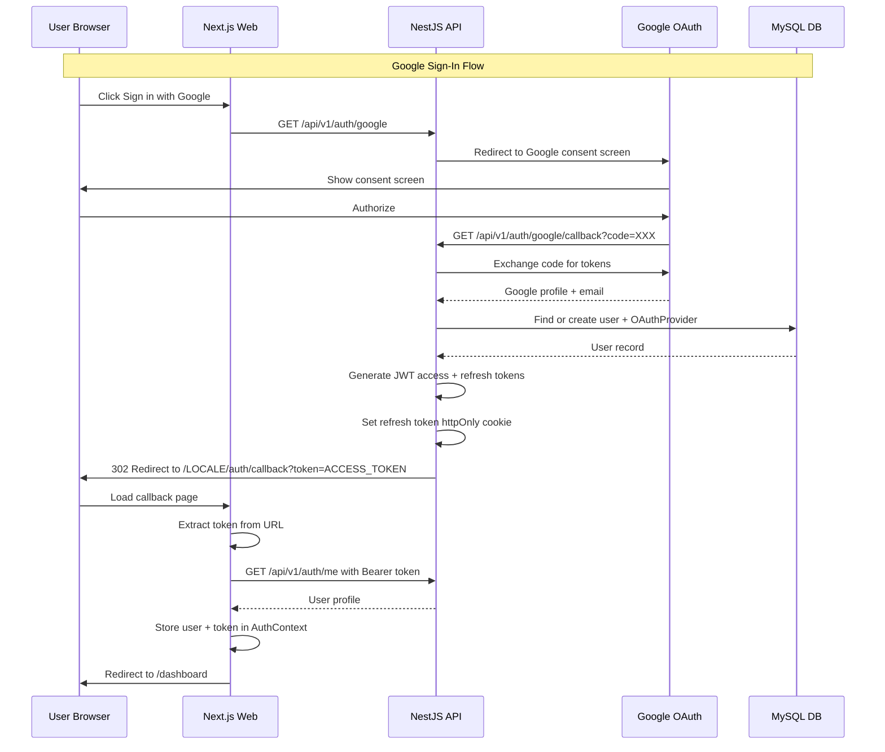
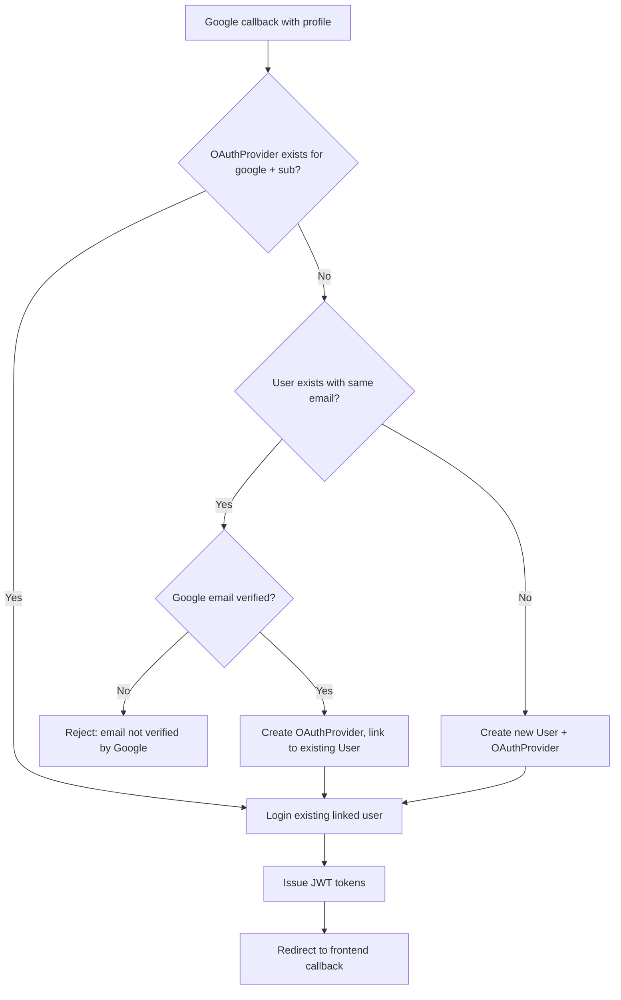

# Phase 2 — Google Authentication (OAuth 2.0) — Design Document

> **Purpose**: This document specifies all implementation details for Phase 2: Google Authentication. It covers the OAuthProvider schema, Google OAuth 2.0 flow via Passport.js, frontend callback handling, account linking strategy, and CI/CD updates. Builds on the Phase 1 JWT auth system.

---

## Table of Contents

1. [Overview](#1-overview)
2. [Iteration 2.1: OAuth Setup](#2-iteration-21-oauth-setup)
3. [Iteration 2.2: Backend Integration](#3-iteration-22-backend-integration)
4. [Iteration 2.3: Google Button UI](#4-iteration-23-google-button-ui)
5. [Iteration 2.4: Account Linking](#5-iteration-24-account-linking)
6. [Security Considerations](#6-security-considerations)
7. [Database Migration Strategy](#7-database-migration-strategy)
8. [Testing Strategy](#8-testing-strategy)
9. [File Changes Summary](#9-file-changes-summary)

---

## 1. Overview

### Goals

Phase 2 adds Google OAuth 2.0 as a federated login option, enabling users to sign in with their Google account. The implementation reuses the Phase 1 JWT infrastructure — after Google validates the user, the backend issues the same JWT access + refresh token pair used by email/password auth.

### Key Principles

- **Reusable federated credentials table** — `OAuthProvider` model supports Google now, Telegram in Phase 3, and any future provider
- **Server-side redirect flow** — Passport.js handles the OAuth dance; no client-side token exchange
- **Seamless account linking** — Google login auto-links to existing email/password accounts when emails match
- **No new auth token format** — Google OAuth produces the same JWT access + httpOnly refresh cookie as Phase 1
- **Zero disruption** — Existing email/password auth remains unchanged

### Google OAuth Flow



### Account Linking Decision Flow



---

## 2. Iteration 2.1: OAuth Setup

### Objective

Configure Google OAuth application, add Passport Google strategy, and create the `OAuthProvider` database model.

### 2.1a. Google Cloud Console Setup

Create OAuth 2.0 credentials in Google Cloud Console:

1. Go to **APIs & Services → Credentials → Create Credentials → OAuth client ID**
2. Application type: **Web application**
3. Authorized redirect URIs:
   - `http://localhost/api/v1/auth/google/callback` (development)
   - `https://stage-myfin.michnik.pro/api/v1/auth/google/callback` (staging)
   - `https://myfin.michnik.pro/api/v1/auth/google/callback` (production)
4. Note the **Client ID** and **Client Secret**

### 2.1b. OAuthProvider Prisma Model

Add to [`apps/api/prisma/schema.prisma`](../apps/api/prisma/schema.prisma):

```prisma
// ── Phase 2: OAuth provider models ──

model OAuthProvider {
  id         String   @id @default(uuid()) @db.VarChar(36)
  provider   String   @db.VarChar(50)     // 'google', 'telegram' (Phase 3)
  providerId String   @map("provider_id") @db.VarChar(255)  // Google sub ID
  userId     String   @map("user_id") @db.VarChar(36)
  user       User     @relation(fields: [userId], references: [id], onDelete: Cascade)
  email      String?  @db.VarChar(255)    // Provider email (for linking)
  name       String?  @db.VarChar(255)    // Provider display name
  avatarUrl  String?  @map("avatar_url") @db.VarChar(500)
  metadata   Json?                         // Extra provider data
  createdAt  DateTime @default(now()) @map("created_at")
  updatedAt  DateTime @updatedAt @map("updated_at")

  @@unique([provider, providerId])
  @@index([userId])
  @@index([provider, email])
  @@map("oauth_providers")
}
```

Update the existing `User` model to add the relation:

```prisma
model User {
  // ... existing fields ...

  refreshTokens   RefreshToken[]
  oauthProviders  OAuthProvider[]    // ← Add this line

  // ... existing indexes and map ...
}
```

### 2.1c. Environment Variables

Add to [`apps/api/.env.example`](../apps/api/.env.example):

```env
# ── Google OAuth ──
GOOGLE_CLIENT_ID=your-google-client-id
GOOGLE_CLIENT_SECRET=your-google-client-secret
GOOGLE_CALLBACK_URL=http://localhost/api/v1/auth/google/callback
```

Add to [`.env.staging.template`](../.env.staging.template) and [`.env.production.template`](../.env.production.template):

```env
# ── Google OAuth ──
GOOGLE_CLIENT_ID=${GOOGLE_CLIENT_ID}
GOOGLE_CLIENT_SECRET=${GOOGLE_CLIENT_SECRET}
GOOGLE_CALLBACK_URL=https://${SERVER_NAME}/api/v1/auth/google/callback
```

### 2.1d. Dependencies

Add to [`apps/api/package.json`](../apps/api/package.json):

| Package                          | Purpose                   |
| -------------------------------- | ------------------------- |
| `passport-google-oauth20`        | Passport Google strategy  |
| `@types/passport-google-oauth20` | TypeScript types (devDep) |

### 2.1e. Google Strategy

```typescript
// apps/api/src/auth/strategies/google.strategy.ts
import { Injectable } from '@nestjs/common';
import { ConfigService } from '@nestjs/config';
import { PassportStrategy } from '@nestjs/passport';
import { Strategy, VerifyCallback, Profile } from 'passport-google-oauth20';

export interface GoogleProfile {
  googleId: string;
  email: string;
  emailVerified: boolean;
  name: string;
  avatarUrl?: string;
}

@Injectable()
export class GoogleStrategy extends PassportStrategy(Strategy, 'google') {
  constructor(private readonly configService: ConfigService) {
    super({
      clientID: configService.getOrThrow<string>('GOOGLE_CLIENT_ID'),
      clientSecret: configService.getOrThrow<string>('GOOGLE_CLIENT_SECRET'),
      callbackURL: configService.getOrThrow<string>('GOOGLE_CALLBACK_URL'),
      scope: ['email', 'profile'],
      state: true, // CSRF protection
    });
  }

  async validate(
    accessToken: string,
    refreshToken: string,
    profile: Profile,
    done: VerifyCallback,
  ): Promise<void> {
    const googleProfile: GoogleProfile = {
      googleId: profile.id,
      email: profile.emails?.[0]?.value ?? '',
      emailVerified:
        profile.emails?.[0]?.verified === 'true' ||
        (profile.emails?.[0] as Record<string, unknown>)?.verified === true,
      name: profile.displayName ?? '',
      avatarUrl: profile.photos?.[0]?.value,
    };
    done(null, googleProfile);
  }
}
```

### Files Created/Modified

| File                                                                      | Change                                            |
| ------------------------------------------------------------------------- | ------------------------------------------------- |
| [`apps/api/prisma/schema.prisma`](../apps/api/prisma/schema.prisma)       | Add `OAuthProvider` model, add relation to `User` |
| `apps/api/prisma/migrations/YYYYMMDD_phase2_oauth_provider/migration.sql` | New migration                                     |
| `apps/api/src/auth/strategies/google.strategy.ts`                         | New: Passport Google strategy                     |
| [`apps/api/.env.example`](../apps/api/.env.example)                       | Add Google OAuth env vars                         |
| [`.env.staging.template`](../.env.staging.template)                       | Add Google OAuth env vars                         |
| [`.env.production.template`](../.env.production.template)                 | Add Google OAuth env vars                         |
| [`apps/api/package.json`](../apps/api/package.json)                       | Add `passport-google-oauth20` + types             |

### Acceptance Criteria

- [x] `OAuthProvider` table created via Prisma migration
- [x] `User` ↔ `OAuthProvider` relation works
- [x] Google strategy instantiates without errors
- [x] `@@unique([provider, providerId])` constraint prevents duplicate provider entries
- [x] Manual test: `GET /api/v1/auth/google` redirects to Google consent screen

---

## 3. Iteration 2.2: Backend Integration

### Objective

Complete the Google OAuth flow in NestJS — handle the callback, find/create users, issue JWT tokens, and redirect to the frontend.

### 3.2a. OAuth Service

```typescript
// apps/api/src/auth/services/oauth.service.ts
import { Injectable, Logger } from '@nestjs/common';
import { PrismaService } from '../../prisma/prisma.service';
import { TokenService } from './token.service';
import { GoogleProfile } from '../strategies/google.strategy';
import { Response } from 'express';

export interface OAuthLoginResult {
  accessToken: string;
  isNewUser: boolean;
  userId: string;
}

@Injectable()
export class OAuthService {
  private readonly logger = new Logger(OAuthService.name);

  constructor(
    private readonly prisma: PrismaService,
    private readonly tokenService: TokenService,
  ) {}

  /**
   * Handle Google OAuth callback:
   * 1. Find existing OAuthProvider → login
   * 2. Find User by email → link + login
   * 3. Create new User + OAuthProvider → login
   */
  async handleGoogleLogin(
    profile: GoogleProfile,
    response: Response,
    ip?: string,
    userAgent?: string,
  ): Promise<OAuthLoginResult> {
    // Step 1: Check for existing OAuth link
    const existingProvider = await this.prisma.oAuthProvider.findUnique({
      where: {
        provider_providerId: {
          provider: 'google',
          providerId: profile.googleId,
        },
      },
      include: { user: true },
    });

    if (existingProvider) {
      return this.loginOAuthUser(existingProvider.user, response, ip, userAgent, false);
    }

    // Step 2: Check for existing user by email (account linking)
    if (profile.email && profile.emailVerified) {
      const existingUser = await this.prisma.user.findUnique({
        where: { email: profile.email.toLowerCase() },
      });

      if (existingUser) {
        // Link Google to existing account
        await this.createOAuthProvider(existingUser.id, profile);
        this.logger.log(
          `Linked Google account to existing user: ${existingUser.email} (${existingUser.id})`,
        );
        return this.loginOAuthUser(existingUser, response, ip, userAgent, false);
      }
    }

    // Step 3: Create new user + OAuthProvider
    const newUser = await this.prisma.user.create({
      data: {
        email: profile.email.toLowerCase(),
        name: profile.name,
        emailVerified: profile.emailVerified,
        // passwordHash is null — OAuth-only user
      },
    });

    await this.createOAuthProvider(newUser.id, profile);

    this.logger.log(`Created new user via Google OAuth: ${newUser.email} (${newUser.id})`);

    // Audit log
    await this.prisma.auditLog.create({
      data: {
        userId: newUser.id,
        action: 'USER_REGISTERED_OAUTH',
        entity: 'User',
        entityId: newUser.id,
        details: { provider: 'google', email: newUser.email },
        ipAddress: ip,
        userAgent: userAgent,
      },
    });

    return this.loginOAuthUser(newUser, response, ip, userAgent, true);
  }

  private async createOAuthProvider(userId: string, profile: GoogleProfile): Promise<void> {
    await this.prisma.oAuthProvider.create({
      data: {
        provider: 'google',
        providerId: profile.googleId,
        userId,
        email: profile.email,
        name: profile.name,
        avatarUrl: profile.avatarUrl,
      },
    });

    // Audit log for linking
    await this.prisma.auditLog.create({
      data: {
        userId,
        action: 'OAUTH_PROVIDER_LINKED',
        entity: 'OAuthProvider',
        details: { provider: 'google', providerId: profile.googleId },
      },
    });
  }

  private async loginOAuthUser(
    user: {
      id: string;
      email: string;
      name: string;
      defaultCurrency: string;
      locale: string;
      isActive: boolean;
    },
    response: Response,
    ip?: string,
    userAgent?: string,
    isNewUser: boolean = false,
  ): Promise<OAuthLoginResult> {
    if (!user.isActive) {
      throw new Error('User account is inactive');
    }

    // Update last login time
    await this.prisma.user.update({
      where: { id: user.id },
      data: { lastLoginAt: new Date() },
    });

    // Generate tokens (same as Phase 1 email/password flow)
    const accessToken = this.tokenService.generateAccessToken(user);
    const refreshToken = this.tokenService.generateRefreshToken();

    // Store hashed refresh token
    await this.prisma.refreshToken.create({
      data: {
        tokenHash: this.tokenService.hashToken(refreshToken),
        userId: user.id,
        expiresAt: this.tokenService.getRefreshExpirationDate(),
        ipAddress: ip,
        userAgent: userAgent,
      },
    });

    // Set refresh token as httpOnly cookie
    this.tokenService.setRefreshTokenCookie(response, refreshToken);

    // Audit log
    await this.prisma.auditLog.create({
      data: {
        userId: user.id,
        action: 'USER_LOGIN_OAUTH',
        entity: 'User',
        entityId: user.id,
        details: { provider: 'google' },
        ipAddress: ip,
        userAgent: userAgent,
      },
    });

    return { accessToken, isNewUser, userId: user.id };
  }
}
```

### 3.2b. Auth Controller — Google Endpoints

Add to [`apps/api/src/auth/auth.controller.ts`](../apps/api/src/auth/auth.controller.ts):

```typescript
import { GoogleAuthGuard } from './guards/google-auth.guard';
import { GoogleProfile } from './strategies/google.strategy';
import { OAuthService } from './services/oauth.service';

// ... existing constructor updated:
constructor(
  private readonly authService: AuthService,
  private readonly oauthService: OAuthService,
  private readonly configService: ConfigService,
) {}

// --- New endpoints ---

@CustomThrottle({ limit: 5, ttl: 60000 })
@Get('google')
@UseGuards(GoogleAuthGuard)
@ApiOperation({ summary: 'Initiate Google OAuth flow' })
@ApiResponse({ status: 302, description: 'Redirects to Google consent screen' })
googleAuth() {
  // Guard handles the redirect to Google
}

@CustomThrottle({ limit: 5, ttl: 60000 })
@Get('google/callback')
@UseGuards(GoogleAuthGuard)
@ApiOperation({ summary: 'Google OAuth callback' })
@ApiResponse({ status: 302, description: 'Redirects to frontend with token' })
async googleCallback(
  @Req() request: Request,
  @Res() response: Response,
) {
  const googleProfile = request.user as GoogleProfile;
  const ip = request.ip;
  const userAgent = request.headers['user-agent'];

  try {
    const result = await this.oauthService.handleGoogleLogin(
      googleProfile,
      response,
      ip,
      userAgent,
    );

    // Determine locale from user preferences or default
    const user = await this.authService.getUser(result.userId);
    const locale = user.locale || 'en';

    // Redirect to frontend callback page with access token
    const frontendUrl = this.configService.get<string>('FRONTEND_URL', '');
    const callbackUrl = `${frontendUrl}/${locale}/auth/callback?token=${result.accessToken}`;

    return response.redirect(callbackUrl);
  } catch (error) {
    // On failure, redirect to login page with error
    const frontendUrl = this.configService.get<string>('FRONTEND_URL', '');
    const loginUrl = `${frontendUrl}/en/auth/login?error=oauth_failed`;

    return response.redirect(loginUrl);
  }
}
```

### 3.2c. Google Auth Guard

```typescript
// apps/api/src/auth/guards/google-auth.guard.ts
import { Injectable } from '@nestjs/common';
import { AuthGuard } from '@nestjs/passport';

@Injectable()
export class GoogleAuthGuard extends AuthGuard('google') {}
```

### 3.2d. Auth Module Updates

Update [`apps/api/src/auth/auth.module.ts`](../apps/api/src/auth/auth.module.ts) to register the new providers:

```typescript
import { GoogleStrategy } from './strategies/google.strategy';
import { OAuthService } from './services/oauth.service';

@Module({
  imports: [
    PrismaModule,
    ConfigModule, // ← Add if not already imported
    PassportModule,
    JwtModule.registerAsync({
      /* existing config */
    }),
  ],
  controllers: [AuthController],
  providers: [
    AuthService,
    OAuthService, // ← New
    PasswordService,
    TokenService,
    RefreshTokenService,
    LocalStrategy,
    JwtStrategy,
    GoogleStrategy, // ← New
  ],
  exports: [AuthService, OAuthService, PasswordService, TokenService, RefreshTokenService],
})
export class AuthModule {}
```

### 3.2e. New Environment Variable — FRONTEND_URL

Since the Google callback redirects to the frontend, the backend needs to know the frontend URL:

| Environment | `FRONTEND_URL` value                     |
| ----------- | ---------------------------------------- |
| Development | `` (empty — relative redirect)           |
| Staging     | `` (empty — same domain via nginx proxy) |
| Production  | `` (empty — same domain via nginx proxy) |

Because nginx proxies both the API and frontend on the same domain, `FRONTEND_URL` can be empty (relative redirect). The redirect path `/${locale}/auth/callback?token=...` will resolve to the same origin.

Add to [`apps/api/.env.example`](../apps/api/.env.example):

```env
FRONTEND_URL=
```

### 3.2f. Auth Error Constants

Add to [`apps/api/src/auth/constants/auth-errors.ts`](../apps/api/src/auth/constants/auth-errors.ts):

```typescript
export const AUTH_ERRORS = {
  // ... existing error codes ...
  OAUTH_EMAIL_NOT_VERIFIED: 'OAUTH_EMAIL_NOT_VERIFIED',
  OAUTH_ACCOUNT_INACTIVE: 'OAUTH_ACCOUNT_INACTIVE',
  OAUTH_FAILED: 'OAUTH_FAILED',
} as const;
```

### Unit Tests

```typescript
// apps/api/src/auth/services/oauth.service.spec.ts
describe('OAuthService', () => {
  describe('handleGoogleLogin', () => {
    it('should login existing user with linked Google account');
    it('should link Google to existing user with matching email');
    it('should create new user when no match found');
    it('should reject when Google email is not verified');
    it('should reject when user account is inactive');
    it('should generate JWT access + refresh tokens');
    it('should set refresh token cookie');
    it('should create audit log entries');
    it('should update lastLoginAt timestamp');
  });
});

// apps/api/src/auth/strategies/google.strategy.spec.ts
describe('GoogleStrategy', () => {
  it('should extract profile from Google response');
  it('should handle missing email gracefully');
  it('should determine email verification status');
});
```

### Files Created/Modified

| File                                                                                          | Change                                       |
| --------------------------------------------------------------------------------------------- | -------------------------------------------- |
| `apps/api/src/auth/services/oauth.service.ts`                                                 | New: OAuth business logic                    |
| `apps/api/src/auth/services/oauth.service.spec.ts`                                            | New: Unit tests                              |
| `apps/api/src/auth/guards/google-auth.guard.ts`                                               | New: Passport Google guard                   |
| `apps/api/src/auth/strategies/google.strategy.spec.ts`                                        | New: Strategy unit tests                     |
| [`apps/api/src/auth/auth.controller.ts`](../apps/api/src/auth/auth.controller.ts)             | Add `google` and `google/callback` endpoints |
| [`apps/api/src/auth/auth.controller.spec.ts`](../apps/api/src/auth/auth.controller.spec.ts)   | Add tests for Google endpoints               |
| [`apps/api/src/auth/auth.module.ts`](../apps/api/src/auth/auth.module.ts)                     | Register `GoogleStrategy`, `OAuthService`    |
| [`apps/api/src/auth/constants/auth-errors.ts`](../apps/api/src/auth/constants/auth-errors.ts) | Add OAuth error codes                        |
| [`apps/api/.env.example`](../apps/api/.env.example)                                           | Add `FRONTEND_URL`                           |

### Acceptance Criteria

- [x] `GET /api/v1/auth/google` redirects to Google consent screen
- [x] `GET /api/v1/auth/google/callback` processes Google response
- [x] Callback redirects to `/{locale}/auth/callback?token={accessToken}`
- [x] Refresh token cookie is set during callback
- [x] JWT access token is valid and can be used with `GET /api/v1/auth/me`
- [x] Audit logs created for OAuth login events
- [x] Unit tests pass for `OAuthService`

---

## 4. Iteration 2.3: Google Button UI

### Objective

Enable the Google sign-in button on the login and register pages, and create the frontend callback page that receives the OAuth redirect.

### 4.3a. Frontend Callback Page

```typescript
// apps/web/src/app/[locale]/auth/callback/page.tsx
'use client';

import { useSearchParams } from 'next/navigation';
import { useEffect, useRef } from 'react';
import { useRouter } from '@/i18n/navigation';
import { useAuth } from '@/lib/auth/auth-context';

export default function AuthCallbackPage() {
  const searchParams = useSearchParams();
  const router = useRouter();
  const { loginWithToken } = useAuth();
  const processedRef = useRef(false);

  useEffect(() => {
    if (processedRef.current) return;
    processedRef.current = true;

    const token = searchParams.get('token');
    const error = searchParams.get('error');

    if (error) {
      router.push('/auth/login?error=oauth_failed');
      return;
    }

    if (!token) {
      router.push('/auth/login');
      return;
    }

    loginWithToken(token)
      .then(() => router.push('/dashboard'))
      .catch(() => router.push('/auth/login?error=oauth_failed'));
  }, [searchParams, router, loginWithToken]);

  return (
    <div className="flex min-h-screen items-center justify-center">
      <div className="text-center">
        <div className="animate-spin h-8 w-8 border-4 border-primary-600 border-t-transparent rounded-full mx-auto" />
        <p className="mt-4 text-gray-600">Signing you in...</p>
      </div>
    </div>
  );
}
```

### 4.3b. Auth Context — `loginWithToken` Method

Add to [`apps/web/src/lib/auth/auth-context.tsx`](../apps/web/src/lib/auth/auth-context.tsx):

```typescript
interface AuthContextType {
  // ... existing fields ...
  loginWithToken: (token: string) => Promise<void>; // ← New
}

// Inside AuthProvider:
const loginWithToken = useCallback(async (token: string) => {
  // Fetch user profile using the provided access token
  const res = await fetch(`${API_BASE}/auth/me`, {
    headers: {
      Authorization: `Bearer ${token}`,
      'Content-Type': 'application/json',
    },
    credentials: 'include',
  });

  if (!res.ok) {
    throw new Error('Failed to fetch user profile');
  }

  const user: User = await res.json();
  setUser(user);
  setAccessToken(token);
}, []);
```

### 4.3c. Enable Google Button in LoginForm

Update [`apps/web/src/components/auth/LoginForm.tsx`](../apps/web/src/components/auth/LoginForm.tsx):

```typescript
// Replace the disabled Google button with an active one:
<div className="grid grid-cols-2 gap-3">
  <Button
    type="button"
    variant="outline"
    onClick={() => {
      // Navigate to backend Google OAuth endpoint
      window.location.href = `${API_BASE}/auth/google`;
    }}
  >
    {t('google')}
  </Button>
  <Button type="button" variant="outline" disabled className="opacity-50">
    {t('telegram')}
  </Button>
</div>
```

### 4.3d. Enable Google Button in RegisterForm

Update [`apps/web/src/components/auth/RegisterForm.tsx`](../apps/web/src/components/auth/RegisterForm.tsx) with the same active Google button pattern. The Google OAuth flow works identically for both login and registration — the backend handles user creation automatically.

### 4.3e. Login Page Error Handling

Update [`apps/web/src/app/[locale]/auth/login/page.tsx`](../apps/web/src/app/[locale]/auth/login/page.tsx) to display OAuth errors from query params:

```typescript
// Inside the login page component:
const searchParams = useSearchParams();
const oauthError = searchParams.get('error');

// Render error toast/message if oauthError === 'oauth_failed'
```

### 4.3f. i18n Updates

Add to [`apps/web/messages/en.json`](../apps/web/messages/en.json):

```json
{
  "auth": {
    // ... existing keys ...
    "signingInOAuth": "Signing you in...",
    "oauthFailed": "Sign-in with Google failed. Please try again.",
    "oauthLinkSuccess": "Google account linked successfully!"
  }
}
```

Add to [`apps/web/messages/he.json`](../apps/web/messages/he.json):

```json
{
  "auth": {
    // ... existing keys ...
    "signingInOAuth": "מחבר אותך...",
    "oauthFailed": "ההתחברות עם Google נכשלה. נסה שוב.",
    "oauthLinkSuccess": "חשבון Google חובר בהצלחה!"
  }
}
```

### UI Tests

```typescript
// apps/web/src/app/[locale]/auth/callback/callback.spec.tsx
describe('AuthCallbackPage', () => {
  it('should call loginWithToken when token is present in URL');
  it('should redirect to dashboard on successful token login');
  it('should redirect to login page when no token present');
  it('should redirect to login page with error when error param present');
  it('should redirect to login page on loginWithToken failure');
  it('should show loading spinner during processing');
});

// apps/web/src/components/auth/LoginForm.spec.tsx — add tests:
describe('LoginForm - Google button', () => {
  it('should render enabled Google button');
  it('should navigate to /api/v1/auth/google on click');
});
```

### Files Created/Modified

| File                                                                                                          | Change                      |
| ------------------------------------------------------------------------------------------------------------- | --------------------------- |
| `apps/web/src/app/[locale]/auth/callback/page.tsx`                                                            | New: OAuth callback page    |
| `apps/web/src/app/[locale]/auth/callback/callback.spec.tsx`                                                   | New: Callback page tests    |
| [`apps/web/src/lib/auth/auth-context.tsx`](../apps/web/src/lib/auth/auth-context.tsx)                         | Add `loginWithToken` method |
| [`apps/web/src/lib/auth/auth-context.spec.tsx`](../apps/web/src/lib/auth/auth-context.spec.tsx)               | Add `loginWithToken` tests  |
| [`apps/web/src/components/auth/LoginForm.tsx`](../apps/web/src/components/auth/LoginForm.tsx)                 | Enable Google button        |
| [`apps/web/src/components/auth/LoginForm.spec.tsx`](../apps/web/src/components/auth/LoginForm.spec.tsx)       | Add Google button tests     |
| [`apps/web/src/components/auth/RegisterForm.tsx`](../apps/web/src/components/auth/RegisterForm.tsx)           | Enable Google button        |
| [`apps/web/src/components/auth/RegisterForm.spec.tsx`](../apps/web/src/components/auth/RegisterForm.spec.tsx) | Add Google button tests     |
| [`apps/web/messages/en.json`](../apps/web/messages/en.json)                                                   | Add OAuth i18n keys         |
| [`apps/web/messages/he.json`](../apps/web/messages/he.json)                                                   | Add OAuth i18n keys         |

### Acceptance Criteria

- [x] Google button is clickable and initiates OAuth flow
- [x] Callback page extracts token and stores in auth context
- [x] User is redirected to dashboard after successful Google sign-in
- [x] Error is shown on login page if OAuth fails
- [x] Telegram button remains disabled
- [x] Loading spinner shown during callback processing

---

## 5. Iteration 2.4: Account Linking

### Objective

Ensure robust account linking: when a Google user has an existing email/password account, link them without creating duplicates. Add integration tests for all linking scenarios.

### 5.4a. Account Linking Scenarios

| #   | Scenario                                  | Input                                                               | Expected Behavior                           |
| --- | ----------------------------------------- | ------------------------------------------------------------------- | ------------------------------------------- |
| 1   | New Google user, no existing account      | Google sub=123, email=new@test.com                                  | Create User + OAuthProvider                 |
| 2   | Existing user, same email, no Google link | Google sub=123, email=existing@test.com                             | Create OAuthProvider, link to existing User |
| 3   | Existing user, already linked to Google   | Google sub=123, email=existing@test.com                             | Login directly via OAuthProvider lookup     |
| 4   | Google email not verified                 | Google sub=123, email=unverified@test.com, verified=false           | Reject with error                           |
| 5   | User account inactive                     | Google sub=123, linked to inactive user                             | Reject with error                           |
| 6   | Different Google account, same email      | Google sub=456, email=existing@test.com (already linked to sub=123) | Create second OAuthProvider for same User   |
| 7   | OAuth-only user logs in again             | Google sub=123, previously created without password                 | Login via OAuthProvider lookup              |

### 5.4b. OAuthService Enhancements for Edge Cases

The `handleGoogleLogin` method in [`apps/api/src/auth/services/oauth.service.ts`](../apps/api/src/auth/services/oauth.service.ts) must handle:

1. **Email not verified**: If `profile.emailVerified` is false and no existing OAuthProvider link exists, reject the login. Log a security event.

2. **Inactive user**: If the matched user has `isActive: false`, reject with `OAUTH_ACCOUNT_INACTIVE`.

3. **Multiple Google accounts**: A user could have multiple Google accounts linked. Each gets its own `OAuthProvider` record (unique on `[provider, providerId]`).

4. **Race conditions**: Use a database transaction for the find-or-create logic to prevent duplicate user creation under concurrent requests.

```typescript
// Transaction wrapper for handleGoogleLogin critical section:
async handleGoogleLogin(profile: GoogleProfile, response: Response, ip?: string, userAgent?: string) {
  return this.prisma.$transaction(async (tx) => {
    // ... all DB operations use tx instead of this.prisma ...
  });
}
```

### 5.4c. Integration Tests

```typescript
// apps/api/test/integration/oauth.integration.spec.ts
describe('OAuth Integration', () => {
  describe('Account Linking', () => {
    it('should create new user for first-time Google login');
    it('should link Google to existing email/password user');
    it('should login directly when Google already linked');
    it('should not create duplicate users for same email');
    it('should not create duplicate OAuthProvider for same google+sub');
    it('should reject unverified Google email');
    it('should reject inactive user');
    it('should allow multiple Google accounts for same user');
    it('should handle concurrent OAuth requests without duplicates');
  });

  describe('Token Issuance', () => {
    it('should issue valid JWT access token after Google login');
    it('should set httpOnly refresh cookie after Google login');
    it('should allow token refresh after Google login');
  });

  describe('Audit Logging', () => {
    it('should log USER_REGISTERED_OAUTH for new users');
    it('should log OAUTH_PROVIDER_LINKED for account linking');
    it('should log USER_LOGIN_OAUTH for returning users');
  });
});
```

### Files Created/Modified

| File                                                                                                      | Change                                           |
| --------------------------------------------------------------------------------------------------------- | ------------------------------------------------ |
| [`apps/api/src/auth/services/oauth.service.ts`](../apps/api/src/auth/services/oauth.service.ts)           | Add transaction wrapping, edge case handling     |
| [`apps/api/src/auth/services/oauth.service.spec.ts`](../apps/api/src/auth/services/oauth.service.spec.ts) | Add edge case unit tests                         |
| `apps/api/test/integration/oauth.integration.spec.ts`                                                     | New: Integration tests for all linking scenarios |

### Acceptance Criteria

- [x] Existing email/password users can link Google without creating duplicate accounts
- [x] New Google users get auto-registered
- [x] Returning Google users login directly
- [x] Unverified Google emails are rejected
- [x] Inactive accounts are rejected
- [x] No duplicate users or OAuthProvider records under concurrent requests
- [x] All scenarios covered by integration tests

---

## 6. Security Considerations

### Security Checklist for Phase 2

- [ ] Google OAuth state parameter for CSRF protection (`state: true` in strategy)
- [ ] Validate `emailVerified` from Google profile before auto-linking
- [ ] Rate limit on OAuth endpoints (5/min, same as login/register)
- [ ] Audit log all OAuth events: login, registration, linking, failures
- [ ] Use HTTPS for all callback URLs in staging/production
- [ ] Google Client Secret stored only in GitHub Secrets, never in code
- [ ] Database transaction for find-or-create to prevent race conditions
- [ ] Access token passed via URL query param (not fragment) — short-lived (15min), single-use redirect
- [ ] CSP headers allow redirects to `accounts.google.com`
- [ ] Validate that the Google profile email is present before creating a user

### Threat Model — Phase 2 Additions

| Threat                            | Mitigation                                                                 |
| --------------------------------- | -------------------------------------------------------------------------- |
| CSRF on OAuth flow                | Passport `state: true` generates random state parameter                    |
| OAuth token theft in URL          | Access token is short-lived (15min); callback page consumes it immediately |
| Account hijacking via email match | Only link if Google reports `emailVerified: true`                          |
| Race condition duplicate users    | Database transaction + unique constraints                                  |
| Malicious OAuth redirect          | Callback URL is hardcoded in Google Console; Passport validates it         |
| Google Client Secret leak         | Stored in GitHub Secrets; env var in container, not in code                |

### CSP Header Update

Update Helmet configuration in [`apps/api/src/main.ts`](../apps/api/src/main.ts) to allow OAuth redirects:

```typescript
app.use(
  helmet({
    contentSecurityPolicy: {
      directives: {
        defaultSrc: ["'self'"],
        scriptSrc: ["'self'"],
        styleSrc: ["'self'", "'unsafe-inline'"],
        imgSrc: ["'self'", 'data:', 'https:'],
        connectSrc: ["'self'"],
        fontSrc: ["'self'"],
        objectSrc: ["'none'"],
        formAction: ["'self'", 'https://accounts.google.com'], // ← Allow OAuth redirect
        upgradeInsecureRequests: [],
      },
    },
    crossOriginEmbedderPolicy: false,
  }),
);
```

---

## 7. Database Migration Strategy

### Migration: Add OAuthProvider Table

This is an **additive-only** migration — no existing tables are modified (except adding a relation field to User, which Prisma handles without data loss).

Steps:

1. Create migration: `npx prisma migrate dev --name phase2_oauth_provider`
2. This generates:
   - `CREATE TABLE oauth_providers` with all columns
   - `ADD CONSTRAINT` for foreign key `user_id → users.id`
   - `CREATE UNIQUE INDEX` on `(provider, provider_id)`
   - `CREATE INDEX` on `user_id` and `(provider, email)`
3. Deploy: `prisma migrate deploy` runs before new code starts (handled by [`scripts/deploy.sh`](../scripts/deploy.sh))

### Rollback Safety

Since this is purely additive:

- Rollback to Phase 1 code is safe — old code simply ignores the `oauth_providers` table
- No data loss risk — existing `users` and `refresh_tokens` tables are untouched
- Blue-green deploy safety: both old and new slots can run simultaneously

---

## 8. Testing Strategy

### Test Counts per Iteration

| Iteration | Unit Tests                   | Integration Tests      | UI Tests     |
| --------- | ---------------------------- | ---------------------- | ------------ |
| 2.1       | 3 (Google strategy)          | 2 (migration, schema)  | 0            |
| 2.2       | 9 (OAuthService, controller) | 0                      | 0            |
| 2.3       | 6 (callback page, button)    | 0                      | 6 (UI tests) |
| 2.4       | 4 (edge cases)               | 11 (linking scenarios) | 0            |

**Total estimated: ~41 new tests**

### Key Test Scenarios

**Backend Unit Tests:**

- Google strategy extracts correct profile data
- OAuthService creates new user on first Google login
- OAuthService links Google to existing email user
- OAuthService rejects unverified email
- OAuthService uses database transaction
- Auth controller redirects correctly after OAuth
- Auth controller handles OAuth errors gracefully

**Backend Integration Tests (with Testcontainers):**

- Full Google OAuth flow with mock profile
- Account linking with pre-existing email user
- Duplicate prevention with unique constraints
- Token issuance and refresh after OAuth login
- Audit log verification

**Frontend UI Tests:**

- Callback page processes token correctly
- Callback page handles missing token
- Callback page handles error param
- Google button is enabled and clickable
- Google button navigates to correct OAuth URL
- Loading state shown during callback

---

## 9. File Changes Summary

### New Files

**Auth Module (API):**

| File                                                                      | Purpose                        |
| ------------------------------------------------------------------------- | ------------------------------ |
| `apps/api/src/auth/strategies/google.strategy.ts`                         | Passport Google OAuth strategy |
| `apps/api/src/auth/strategies/google.strategy.spec.ts`                    | Strategy tests                 |
| `apps/api/src/auth/services/oauth.service.ts`                             | OAuth business logic           |
| `apps/api/src/auth/services/oauth.service.spec.ts`                        | OAuth service tests            |
| `apps/api/src/auth/guards/google-auth.guard.ts`                           | Google auth guard              |
| `apps/api/prisma/migrations/YYYYMMDD_phase2_oauth_provider/migration.sql` | Database migration             |

**Auth UI (Web):**

| File                                                        | Purpose             |
| ----------------------------------------------------------- | ------------------- |
| `apps/web/src/app/[locale]/auth/callback/page.tsx`          | OAuth callback page |
| `apps/web/src/app/[locale]/auth/callback/callback.spec.tsx` | Callback page tests |

**Tests:**

| File                                                  | Purpose                 |
| ----------------------------------------------------- | ----------------------- |
| `apps/api/test/integration/oauth.integration.spec.ts` | OAuth integration tests |

### Modified Files

| File                                                                                                          | Change                                                                                |
| ------------------------------------------------------------------------------------------------------------- | ------------------------------------------------------------------------------------- |
| [`apps/api/prisma/schema.prisma`](../apps/api/prisma/schema.prisma)                                           | Add `OAuthProvider` model, `oauthProviders` relation on User                          |
| [`apps/api/src/auth/auth.module.ts`](../apps/api/src/auth/auth.module.ts)                                     | Register `GoogleStrategy`, `OAuthService`                                             |
| [`apps/api/src/auth/auth.controller.ts`](../apps/api/src/auth/auth.controller.ts)                             | Add `google` and `google/callback` endpoints                                          |
| [`apps/api/src/auth/auth.controller.spec.ts`](../apps/api/src/auth/auth.controller.spec.ts)                   | Add Google endpoint tests                                                             |
| [`apps/api/src/auth/constants/auth-errors.ts`](../apps/api/src/auth/constants/auth-errors.ts)                 | Add OAuth error codes                                                                 |
| [`apps/api/src/main.ts`](../apps/api/src/main.ts)                                                             | Update CSP `formAction` for Google OAuth                                              |
| [`apps/api/.env.example`](../apps/api/.env.example)                                                           | Add `GOOGLE_CLIENT_ID`, `GOOGLE_CLIENT_SECRET`, `GOOGLE_CALLBACK_URL`, `FRONTEND_URL` |
| [`apps/api/package.json`](../apps/api/package.json)                                                           | Add `passport-google-oauth20`, `@types/passport-google-oauth20`                       |
| [`.env.staging.template`](../.env.staging.template)                                                           | Add Google OAuth env vars                                                             |
| [`.env.production.template`](../.env.production.template)                                                     | Add Google OAuth env vars                                                             |
| [`apps/web/src/lib/auth/auth-context.tsx`](../apps/web/src/lib/auth/auth-context.tsx)                         | Add `loginWithToken` method                                                           |
| [`apps/web/src/lib/auth/auth-context.spec.tsx`](../apps/web/src/lib/auth/auth-context.spec.tsx)               | Add `loginWithToken` tests                                                            |
| [`apps/web/src/components/auth/LoginForm.tsx`](../apps/web/src/components/auth/LoginForm.tsx)                 | Enable Google button                                                                  |
| [`apps/web/src/components/auth/LoginForm.spec.tsx`](../apps/web/src/components/auth/LoginForm.spec.tsx)       | Add Google button tests                                                               |
| [`apps/web/src/components/auth/RegisterForm.tsx`](../apps/web/src/components/auth/RegisterForm.tsx)           | Enable Google button                                                                  |
| [`apps/web/src/components/auth/RegisterForm.spec.tsx`](../apps/web/src/components/auth/RegisterForm.spec.tsx) | Add Google button tests                                                               |
| [`apps/web/messages/en.json`](../apps/web/messages/en.json)                                                   | Add OAuth i18n keys                                                                   |
| [`apps/web/messages/he.json`](../apps/web/messages/he.json)                                                   | Add OAuth i18n keys                                                                   |
| [`.github/workflows/deploy-staging.yml`](../.github/workflows/deploy-staging.yml)                             | Add `GOOGLE_CLIENT_ID`, `GOOGLE_CLIENT_SECRET`, `GOOGLE_CALLBACK_URL` env vars        |
| [`.github/workflows/deploy-production.yml`](../.github/workflows/deploy-production.yml)                       | Add `GOOGLE_CLIENT_ID`, `GOOGLE_CLIENT_SECRET`, `GOOGLE_CALLBACK_URL` env vars        |

### CI/CD Workflow Changes

Both [`.github/workflows/deploy-staging.yml`](../.github/workflows/deploy-staging.yml) and [`.github/workflows/deploy-production.yml`](../.github/workflows/deploy-production.yml) need:

**New GitHub Secrets:**

- `GOOGLE_CLIENT_ID` — shared across staging and production (same Google OAuth app)
- `GOOGLE_CLIENT_SECRET` — shared across staging and production

**New env vars in deploy step:**

```yaml
env:
  # ... existing vars ...
  # ── Google OAuth ──
  GOOGLE_CLIENT_ID: ${{ secrets.GOOGLE_CLIENT_ID }}
  GOOGLE_CLIENT_SECRET: ${{ secrets.GOOGLE_CLIENT_SECRET }}
  GOOGLE_CALLBACK_URL: https://${{ secrets.CLOUDFLARE_STAGING_SUBDOMAIN }}/api/v1/auth/google/callback
```

**Updated `envs` list** in the SSH action to include `GOOGLE_CLIENT_ID,GOOGLE_CLIENT_SECRET,GOOGLE_CALLBACK_URL`.

**Updated export block** in the deploy script:

```bash
export GOOGLE_CLIENT_ID
export GOOGLE_CLIENT_SECRET
export GOOGLE_CALLBACK_URL
```

### New Dependencies

**API (`apps/api/package.json`):**

| Package                          | Purpose                            | Type          |
| -------------------------------- | ---------------------------------- | ------------- |
| `passport-google-oauth20`        | Passport Google OAuth 2.0 strategy | dependency    |
| `@types/passport-google-oauth20` | TypeScript types                   | devDependency |

---

## Appendix: Iteration Execution Order

```mermaid
gantt
    title Phase 2 Execution Order
    dateFormat X
    axisFormat %s

    section Schema + Setup
    2.1 OAuth Setup - Google strategy + OAuthProvider model :i1, 0, 1

    section Backend
    2.2 Backend Integration - OAuth flow + JWT issuance :i2, after i1, 1

    section Frontend
    2.3 Google Button - UI + callback page :i3, after i2, 1

    section Linking
    2.4 Account Linking - edge cases + integration tests :i4, after i3, 1
```



Each iteration deploys to both staging and production via the existing CI/CD pipeline.
