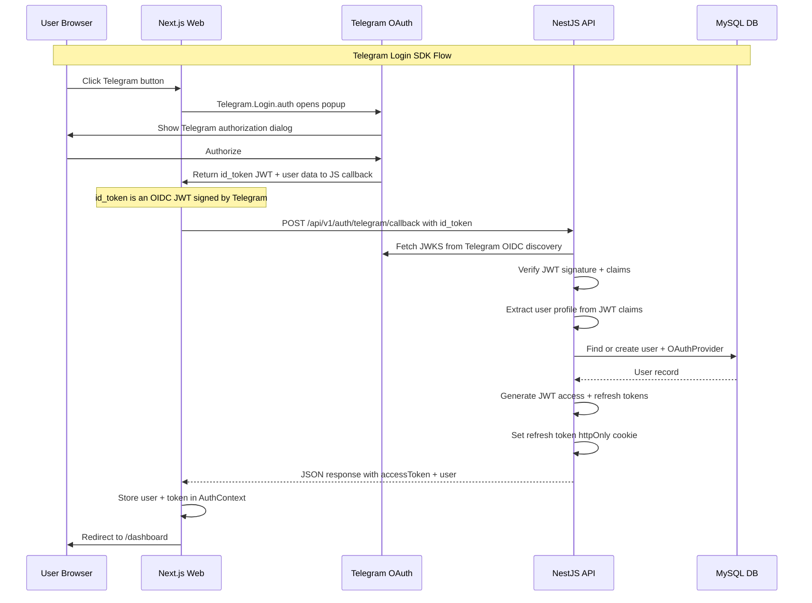
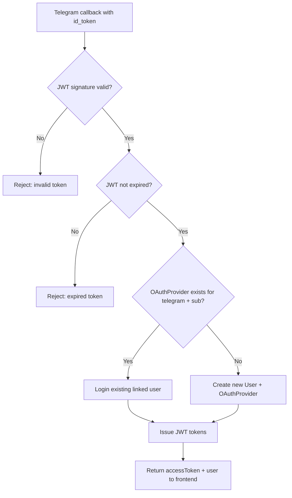
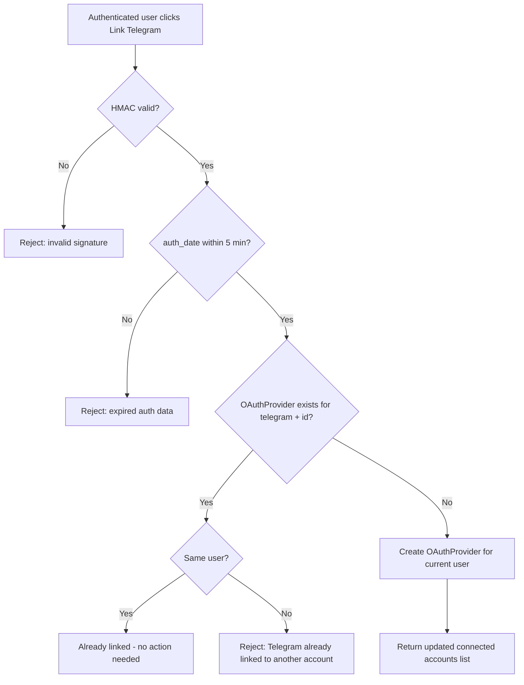

# Phase 3 — Telegram Authentication (Login SDK) — Design Document

> **Purpose**: This document specifies all implementation details for Phase 3: Telegram Authentication. It covers the Telegram Login SDK integration, backend OIDC JWT verification, frontend custom-button login, account linking strategy, connected accounts management, and CI/CD updates. Builds on the Phase 1 JWT auth system and Phase 2 OAuth infrastructure.
>
> **SDK Migration Note (Iteration 3.2):** The original design used the legacy Telegram Login Widget (`telegram.org/js/telegram-widget.js`). During iteration 3.2 implementation, the design was updated to use the **official Telegram Login SDK** (`oauth.telegram.org/js/telegram-login.js`) which supports custom-styled buttons and OIDC JWT verification. See [Section 4](#4-iteration-32-frontend--telegram-login-sdk--auth-context) for details.

---

## Table of Contents

1. [Overview](#1-overview)
2. [Prerequisites: BotFather Setup](#2-prerequisites-botfather-setup)
3. [Iteration 3.1: Backend — Telegram Auth Verification + Endpoint](#3-iteration-31-backend--telegram-auth-verification--endpoint)
4. [Iteration 3.2: Frontend — Telegram Login SDK + Auth Context](#4-iteration-32-frontend--telegram-login-sdk--auth-context)
5. [Iteration 3.3: Connected Accounts API + Link While Authenticated](#5-iteration-33-connected-accounts-api--link-while-authenticated)
6. [Iteration 3.4: Connected Accounts UI + Integration Tests](#6-iteration-34-connected-accounts-ui--integration-tests)
7. [Security Considerations](#7-security-considerations)
8. [Testing Strategy](#8-testing-strategy)
9. [CI/CD Updates](#9-cicd-updates)
10. [File Changes Summary](#10-file-changes-summary)

---

## 1. Overview

### Goals

Phase 3 adds Telegram as a third authentication provider using the **Telegram Login SDK**. Users can sign in with their Telegram account from the web app. The implementation reuses the Phase 1 JWT infrastructure and Phase 2 OAuthProvider model — after Telegram validates the user, the backend issues the same JWT access + refresh token pair.

### Key Principles

- **Reuse existing OAuthProvider model** — Telegram uses `provider: 'telegram'` in the same `oauth_providers` table (no schema migration needed)
- **OIDC JWT verification** — Backend verifies the `id_token` JWT from Telegram's Login SDK using Telegram's JWKS public keys
- **POST-based flow** — Frontend opens Telegram login popup via `Telegram.Login.auth()`, receives `id_token` via callback, then POSTs to backend
- **Custom-styled button** — Uses the app's own Button component for visual consistency; the Telegram Login SDK supports custom buttons via programmatic API
- **Same JWT tokens** — Telegram auth produces the same JWT access + httpOnly refresh cookie as email/password and Google auth
- **Account linking** — Telegram login auto-links to existing accounts when user has the same Telegram ID already linked, or creates a new account

### Telegram Login SDK Flow



### Account Linking Decision Flow — Unauthenticated



### Account Linking Decision Flow — Authenticated (Link to Existing Account)



### Key Difference from Google OAuth

| Aspect          | Google OAuth - Phase 2     | Telegram Login SDK - Phase 3            |
| --------------- | -------------------------- | --------------------------------------- |
| Flow type       | Server-side redirect       | Client-side SDK popup + POST            |
| Verification    | OAuth2 code exchange       | OIDC JWT via JWKS                       |
| Email available | Yes - Google email         | No - Telegram has no email              |
| Account linking | By email match             | By Telegram ID only                     |
| Button style    | App Button → redirect      | App Button → SDK popup                  |
| Session needed  | Yes - for OAuth state      | No - stateless JWT                      |
| New users       | Auto-get email from Google | No email - username only                |
| Script          | None - server redirect     | oauth.telegram.org/js/telegram-login.js |

---

## 2. Prerequisites: BotFather Setup

Before implementing, the Telegram bot must be created and configured:

### 2.1 Create Bot via BotFather

1. Open Telegram and message [@BotFather](https://t.me/BotFather)
2. Send `/newbot`
3. Choose a display name: `MyFinPro`
4. Choose a username: `MyFinProBot` (or similar available name)
5. Save the **bot token** — this is the `BOT_TOKEN` secret
6. Send `/setdomain` to BotFather, select the bot, then set the domain:
   - For staging: the staging domain (e.g., `stage-myfin.michnik.pro`)
   - For production: the production domain (e.g., `myfin.michnik.pro`)

**Note**: BotFather only allows ONE domain at a time for the login widget. During development, you can use `localhost` or your staging domain. For production, switch to the production domain. You can change the domain at any time via `/setdomain`.

### 2.2 Store Secrets

Add the following GitHub Secrets:

| Secret                        | Environment | Value                                     | Used by                       |
| ----------------------------- | ----------- | ----------------------------------------- | ----------------------------- |
| `TELEGRAM_BOT_TOKEN`          | Production  | Bot token from BotFather (production bot) | API (JWT audience validation) |
| `TELEGRAM_BOT_USERNAME`       | Production  | Bot username without @                    | Bot app, display purposes     |
| `TELEGRAM_BOT_TOKEN_STAGE`    | Staging     | Bot token from BotFather (staging bot)    | API (JWT audience validation) |
| `TELEGRAM_BOT_USERNAME_STAGE` | Staging     | Bot username without @                    | Bot app, display purposes     |

> **Note:** Two separate Telegram bots are needed — one for staging, one for production — because BotFather only allows one domain per bot. The numeric bot Client ID (`NEXT_PUBLIC_TELEGRAM_BOT_ID`) is derived from the bot token in CI/CD: `${TELEGRAM_BOT_TOKEN%%:*}`. No additional secret is needed.

---

## 3. Iteration 3.1: Backend — Telegram Auth Verification + Endpoint

### Objective

Configure the Telegram bot token in the API, add environment variables, create the Telegram verification utility, the `findOrCreateTelegramUser()` service method, and the `POST /auth/telegram/callback` endpoint.

### 3.1a. Environment Variables

Add to [`apps/api/.env.example`](../apps/api/.env.example):

```env
# ── Telegram Auth ──
TELEGRAM_BOT_TOKEN=your_telegram_bot_token
TELEGRAM_BOT_USERNAME=MyFinProBot
```

Add to [`apps/web/.env.example`](../apps/web/.env.example):

```env
# ── Telegram Auth ──
NEXT_PUBLIC_TELEGRAM_BOT_USERNAME=MyFinProBot
```

### 3.1b. Telegram Auth Verification Utility

The Telegram Login Widget sends signed data. The backend must verify it using HMAC-SHA256 per the [official documentation](https://core.telegram.org/widgets/login#checking-authorization).

Verification algorithm:

1. Sort all received fields (except `hash`) alphabetically
2. Create a data-check-string: `key=value\n` pairs
3. Compute SHA-256 of the bot token → this is the secret key
4. Compute HMAC-SHA256 of the data-check-string using the secret key
5. Compare with the received `hash`

```typescript
// apps/api/src/auth/utils/telegram-auth.util.ts
import { createHash, createHmac } from 'crypto';

export interface TelegramAuthData {
  id: number;
  first_name: string;
  last_name?: string;
  username?: string;
  photo_url?: string;
  auth_date: number;
  hash: string;
}

/**
 * Verify Telegram Login Widget callback data.
 * See: https://core.telegram.org/widgets/login#checking-authorization
 */
export function verifyTelegramAuth(data: TelegramAuthData, botToken: string): boolean {
  const { hash, ...rest } = data;

  // 1. Create data-check-string (sorted key=value pairs)
  const checkString = Object.keys(rest)
    .sort()
    .map((key) => `${key}=${rest[key as keyof typeof rest]}`)
    .join('\n');

  // 2. Secret key = SHA-256(bot_token)
  const secretKey = createHash('sha256').update(botToken).digest();

  // 3. HMAC-SHA256 of data-check-string
  const hmac = createHmac('sha256', secretKey).update(checkString).digest('hex');

  // 4. Compare
  return hmac === hash;
}

/**
 * Check that auth_date is recent (within maxAge seconds).
 * Default: 300 seconds (5 minutes).
 */
export function isTelegramAuthRecent(authDate: number, maxAgeSeconds: number = 300): boolean {
  const now = Math.floor(Date.now() / 1000);
  return now - authDate < maxAgeSeconds;
}
```

### 3.1c. Telegram Auth DTO

```typescript
// apps/api/src/auth/dto/telegram-auth.dto.ts
import { ApiProperty, ApiPropertyOptional } from '@nestjs/swagger';
import { IsNotEmpty, IsNumber, IsOptional, IsString } from 'class-validator';

export class TelegramAuthDto {
  @ApiProperty({ description: 'Telegram user ID' })
  @IsNumber()
  @IsNotEmpty()
  id: number;

  @ApiProperty({ description: 'User first name' })
  @IsString()
  @IsNotEmpty()
  first_name: string;

  @ApiPropertyOptional({ description: 'User last name' })
  @IsString()
  @IsOptional()
  last_name?: string;

  @ApiPropertyOptional({ description: 'Telegram username' })
  @IsString()
  @IsOptional()
  username?: string;

  @ApiPropertyOptional({ description: 'Profile photo URL' })
  @IsString()
  @IsOptional()
  photo_url?: string;

  @ApiProperty({ description: 'Unix timestamp of authorization' })
  @IsNumber()
  @IsNotEmpty()
  auth_date: number;

  @ApiProperty({ description: 'HMAC-SHA256 hash for verification' })
  @IsString()
  @IsNotEmpty()
  hash: string;
}
```

### Files Created/Modified

| File                                                 | Change                         |
| ---------------------------------------------------- | ------------------------------ |
| `apps/api/src/auth/utils/telegram-auth.util.ts`      | New: HMAC verification utility |
| `apps/api/src/auth/utils/telegram-auth.util.spec.ts` | New: Unit tests                |
| `apps/api/src/auth/dto/telegram-auth.dto.ts`         | New: Telegram auth DTO         |
| [`apps/api/.env.example`](../apps/api/.env.example)  | Add Telegram env vars          |
| [`apps/web/.env.example`](../apps/web/.env.example)  | Add Telegram bot username      |

### Acceptance Criteria

- [ ] `verifyTelegramAuth()` correctly validates HMAC-SHA256 signed data
- [ ] `isTelegramAuthRecent()` rejects auth data older than 5 minutes
- [ ] `TelegramAuthDto` validates all required fields
- [ ] `POST /api/v1/auth/telegram/callback` verifies HMAC and issues JWT
- [ ] Invalid hash returns 401
- [ ] Expired auth_date returns 401
- [ ] Missing bot token returns 401
- [ ] New Telegram users get created with placeholder email
- [ ] Returning Telegram users are logged in directly
- [ ] Inactive accounts are rejected
- [ ] Rate limited to 5 req/min
- [ ] Unit tests cover valid data, invalid hash, expired auth_date, missing fields

### Files Created/Modified (Iteration 3.1)

| File                                                                                          | Change                                               |
| --------------------------------------------------------------------------------------------- | ---------------------------------------------------- |
| `apps/api/src/auth/utils/telegram-auth.util.ts`                                               | New: HMAC verification utility                       |
| `apps/api/src/auth/utils/telegram-auth.util.spec.ts`                                          | New: Unit tests                                      |
| `apps/api/src/auth/dto/telegram-auth.dto.ts`                                                  | New: Telegram auth DTO                               |
| [`apps/api/src/auth/auth.service.ts`](../apps/api/src/auth/auth.service.ts)                   | Add `TelegramProfile` + `findOrCreateTelegramUser()` |
| [`apps/api/src/auth/auth.service.spec.ts`](../apps/api/src/auth/auth.service.spec.ts)         | Add unit tests                                       |
| [`apps/api/src/auth/auth.controller.ts`](../apps/api/src/auth/auth.controller.ts)             | Add `POST /auth/telegram/callback` endpoint          |
| [`apps/api/src/auth/auth.controller.spec.ts`](../apps/api/src/auth/auth.controller.spec.ts)   | Add controller tests                                 |
| [`apps/api/src/auth/constants/auth-errors.ts`](../apps/api/src/auth/constants/auth-errors.ts) | Add Telegram error codes                             |
| [`apps/api/.env.example`](../apps/api/.env.example)                                           | Add Telegram env vars                                |

---

## 4. Iteration 3.2: Frontend — Telegram Login SDK + Auth Context

### Objective

Enable Telegram authentication on login and register pages using the official **Telegram Login SDK** with the app's own custom-styled `Button` component for visual consistency with Google OAuth. Also update backend verification from HMAC-SHA256 to OIDC JWT.

> **Design change:** The original design used the legacy Telegram Login Widget which renders its own branded iframe button. The revised design uses the official [Telegram Login SDK](https://core.telegram.org/bots/telegram-login) (`oauth.telegram.org/js/telegram-login.js`) which supports:
>
> - **Programmatic API**: `Telegram.Login.auth(InitOptions, callback)` — triggers login popup from any click handler
> - **Custom buttons**: No widget-rendered button needed; use the app's own Button component
> - **OIDC JWT**: Callback returns `{id_token, user, error}` instead of hash-based data

### 4.2a. Backend Update — OIDC JWT Verification

The new Telegram Login SDK returns an `id_token` (OIDC JWT) instead of HMAC-signed fields. The backend must be updated:

**New dependency:** `jose` — for JWKS-based JWT verification

**Updated `telegram-auth.util.ts`:**

```typescript
// apps/api/src/auth/utils/telegram-auth.util.ts
import * as jose from 'jose';

const TELEGRAM_OIDC_ISSUER = 'https://oauth.telegram.org';
const TELEGRAM_JWKS_URL = 'https://oauth.telegram.org/.well-known/jwks.json';

let jwks: jose.JWTVerifyGetKey | null = null;

function getJwks(): jose.JWTVerifyGetKey {
  if (!jwks) {
    jwks = jose.createRemoteJWKSet(new URL(TELEGRAM_JWKS_URL));
  }
  return jwks;
}

export interface TelegramJwtPayload {
  sub: string; // Telegram user ID (string)
  first_name: string;
  last_name?: string;
  username?: string;
  photo_url?: string;
  iss: string; // https://oauth.telegram.org
  aud: number; // Bot Client ID
  iat: number;
  exp: number;
  nonce?: string;
}

/**
 * Verify Telegram Login SDK id_token JWT.
 * Uses Telegram's JWKS endpoint for public key verification.
 */
export async function verifyTelegramIdToken(
  idToken: string,
  expectedBotId: number,
): Promise<TelegramJwtPayload> {
  const { payload } = await jose.jwtVerify(idToken, getJwks(), {
    issuer: TELEGRAM_OIDC_ISSUER,
    audience: String(expectedBotId),
  });
  return payload as unknown as TelegramJwtPayload;
}
```

**Updated `telegram-auth.dto.ts`:**

```typescript
// apps/api/src/auth/dto/telegram-auth.dto.ts
import { ApiProperty } from '@nestjs/swagger';
import { IsNotEmpty, IsString } from 'class-validator';

export class TelegramAuthDto {
  @ApiProperty({ description: 'OIDC id_token JWT from Telegram Login SDK' })
  @IsString()
  @IsNotEmpty({ message: 'id_token is required' })
  id_token: string;
}
```

**Updated controller** extracts bot ID from token and calls `verifyTelegramIdToken()`:

```typescript
// In auth.controller.ts telegramCallback method:
const botToken = this.configService.get<string>('TELEGRAM_BOT_TOKEN');
const botId = parseInt(botToken.split(':')[0], 10);
const jwtPayload = await verifyTelegramIdToken(dto.id_token, botId);

const telegramProfile: TelegramProfile = {
  telegramId: jwtPayload.sub,
  firstName: jwtPayload.first_name,
  lastName: jwtPayload.last_name,
  username: jwtPayload.username,
  photoUrl: jwtPayload.photo_url,
};
```

### 4.2b. Frontend — `useTelegramLogin` Hook

Instead of a widget wrapper, create a hook that manages the Telegram Login SDK:

```typescript
// apps/web/src/components/auth/TelegramLoginButton.tsx
'use client';

import { useCallback, useEffect, useRef } from 'react';

export interface TelegramLoginResult {
  id_token: string;
  user?: {
    id: number;
    first_name: string;
    last_name?: string;
    username?: string;
    photo_url?: string;
  };
  error?: string;
}

declare global {
  interface Window {
    Telegram?: {
      Login: {
        init: (options: TelegramInitOptions, callback: TelegramAuthCallback) => void;
        open: (callback?: TelegramAuthCallback) => void;
        auth: (options: TelegramInitOptions, callback: TelegramAuthCallback) => void;
      };
    };
  }
}

interface TelegramInitOptions {
  client_id: number;
  request_access?: string[];
  lang?: string;
}

type TelegramAuthCallback = (result: TelegramLoginResult) => void;

interface UseTelegramLoginOptions {
  botId: number;
  lang?: string;
  onAuth: (result: TelegramLoginResult) => void;
}

/**
 * Hook that loads the Telegram Login SDK and provides a trigger function.
 * The SDK is loaded once; calling `triggerLogin()` opens the Telegram auth popup.
 */
export function useTelegramLogin({ botId, lang, onAuth }: UseTelegramLoginOptions) {
  const scriptLoaded = useRef(false);
  const onAuthRef = useRef(onAuth);
  onAuthRef.current = onAuth;

  // Load SDK script once
  useEffect(() => {
    if (scriptLoaded.current || typeof window === 'undefined') return;

    const existingScript = document.querySelector(
      'script[src*="oauth.telegram.org/js/telegram-login.js"]',
    );
    if (existingScript) {
      scriptLoaded.current = true;
      return;
    }

    const script = document.createElement('script');
    script.src = 'https://oauth.telegram.org/js/telegram-login.js?3';
    script.async = true;
    script.onload = () => {
      scriptLoaded.current = true;
    };
    document.head.appendChild(script);
  }, []);

  const triggerLogin = useCallback(() => {
    if (!window.Telegram?.Login) {
      console.error('Telegram Login SDK not loaded');
      return;
    }

    window.Telegram.Login.auth(
      {
        client_id: botId,
        request_access: ['write'],
        ...(lang ? { lang } : {}),
      },
      (result) => {
        onAuthRef.current(result);
      },
    );
  }, [botId, lang]);

  return { triggerLogin };
}
```

### 4.2c. Update LoginForm — Enable Telegram Button

Replace the disabled Telegram button in [`LoginForm.tsx`](../apps/web/src/components/auth/LoginForm.tsx) with the app's own `Button` component that triggers the Telegram Login SDK:

```typescript
import { useTelegramLogin, type TelegramLoginResult } from './TelegramLoginButton';

const TELEGRAM_BOT_ID = process.env.NEXT_PUBLIC_TELEGRAM_BOT_ID
  ? parseInt(process.env.NEXT_PUBLIC_TELEGRAM_BOT_ID, 10)
  : undefined;

// Inside LoginForm component:
const { triggerLogin } = useTelegramLogin({
  botId: TELEGRAM_BOT_ID!,
  onAuth: async (result: TelegramLoginResult) => {
    if (result.error || !result.id_token) {
      setError(t('telegramAuthFailed'));
      return;
    }
    setError('');
    setIsLoading(true);
    try {
      await loginWithTelegram({ id_token: result.id_token });
      addToast('success', t('telegramAuthSuccess'));
      router.push(searchParams.get('redirect') || '/dashboard');
    } catch (err) {
      setError(err instanceof Error ? err.message : t('telegramAuthFailed'));
    } finally {
      setIsLoading(false);
    }
  },
});

// In the OAuth buttons area — both buttons are styled identically:
<div className="grid grid-cols-2 gap-3">
  <Button type="button" variant="outline"
    onClick={() => { window.location.href = '/api/v1/auth/google'; }}>
    {t('google')}
  </Button>
  {TELEGRAM_BOT_ID ? (
    <Button type="button" variant="outline" onClick={triggerLogin}>
      {t('telegram')}
    </Button>
  ) : (
    <Button type="button" variant="outline" disabled className="opacity-50">
      {t('telegram')}
    </Button>
  )}
</div>
```

### 4.2d. Auth Context — loginWithTelegram Method

Add to [`auth-context.tsx`](../apps/web/src/lib/auth/auth-context.tsx):

```typescript
interface AuthContextType {
  // ... existing fields ...
  loginWithTelegram: (data: { id_token: string }) => Promise<void>;
}

// Inside AuthProvider:
const loginWithTelegram = useCallback(async (data: { id_token: string }) => {
  const res = await fetch(`${API_BASE}/auth/telegram/callback`, {
    method: 'POST',
    headers: { 'Content-Type': 'application/json' },
    credentials: 'include',
    body: JSON.stringify(data),
  });

  if (!res.ok) {
    const errorData = await res.json().catch(() => ({}));
    throw new Error(errorData.message || 'Telegram authentication failed');
  }

  const { user: userData, accessToken } = await res.json();
  setUser(userData);
  setAccessToken(accessToken);
}, []);
```

### 4.2e. i18n Updates

Add to [`apps/web/messages/en.json`](../apps/web/messages/en.json) under `auth`:

```json
"telegramAuthFailed": "Sign-in with Telegram failed. Please try again.",
"telegramAuthSuccess": "Signed in with Telegram!",
"telegramSignIn": "Sign in with Telegram"
```

Add to [`apps/web/messages/he.json`](../apps/web/messages/he.json) under `auth`:

```json
"telegramAuthFailed": "ההתחברות עם טלגרם נכשלה. נסה שוב.",
"telegramAuthSuccess": "התחברת עם טלגרם!",
"telegramSignIn": "התחבר עם טלגרם"
```

### 4.2f. CSP Header Update

Update Helmet configuration in [`apps/api/src/main.ts`](../apps/api/src/main.ts) for the new SDK origin:

```typescript
app.use(
  helmet({
    contentSecurityPolicy: {
      directives: {
        defaultSrc: ["'self'"],
        scriptSrc: ["'self'", 'https://oauth.telegram.org'],
        styleSrc: ["'self'", "'unsafe-inline'"],
        imgSrc: ["'self'", 'data:', 'https:', 'https://*.googleusercontent.com', 'https://t.me'],
        connectSrc: ["'self'", 'https://accounts.google.com', 'https://oauth.telegram.org'],
        frameSrc: ["'self'", 'https://oauth.telegram.org'],
        fontSrc: ["'self'"],
        objectSrc: ["'none'"],
        upgradeInsecureRequests: [],
      },
    },
    crossOriginEmbedderPolicy: false,
  }),
);
```

### 4.2g. Environment Variables

Frontend needs `NEXT_PUBLIC_TELEGRAM_BOT_ID` (derived from bot token in CI/CD):

```env
# apps/web/.env.example
NEXT_PUBLIC_TELEGRAM_BOT_ID=123456789
```

### Files Created/Modified

| File                                                                                                          | Change                             |
| ------------------------------------------------------------------------------------------------------------- | ---------------------------------- |
| `apps/api/src/auth/utils/telegram-auth.util.ts`                                                               | Rewrite: JWT verification via JWKS |
| `apps/api/src/auth/utils/telegram-auth.util.spec.ts`                                                          | Rewrite: JWT verification tests    |
| `apps/api/src/auth/dto/telegram-auth.dto.ts`                                                                  | Update: accept `{id_token}`        |
| `apps/api/src/auth/auth.controller.ts`                                                                        | Update: JWT decode + verification  |
| `apps/api/src/auth/auth.controller.spec.ts`                                                                   | Update: new verification tests     |
| `apps/web/src/components/auth/TelegramLoginButton.tsx`                                                        | New: `useTelegramLogin` hook       |
| `apps/web/src/components/auth/TelegramLoginButton.spec.tsx`                                                   | New: Hook + SDK tests              |
| [`apps/web/src/components/auth/LoginForm.tsx`](../apps/web/src/components/auth/LoginForm.tsx)                 | Enable Telegram with custom Button |
| [`apps/web/src/components/auth/LoginForm.spec.tsx`](../apps/web/src/components/auth/LoginForm.spec.tsx)       | Update tests for Telegram button   |
| [`apps/web/src/components/auth/RegisterForm.tsx`](../apps/web/src/components/auth/RegisterForm.tsx)           | Enable Telegram with custom Button |
| [`apps/web/src/components/auth/RegisterForm.spec.tsx`](../apps/web/src/components/auth/RegisterForm.spec.tsx) | Update tests for Telegram button   |
| [`apps/web/src/lib/auth/auth-context.tsx`](../apps/web/src/lib/auth/auth-context.tsx)                         | Add `loginWithTelegram` method     |
| [`apps/web/src/lib/auth/auth-context.spec.tsx`](../apps/web/src/lib/auth/auth-context.spec.tsx)               | Add `loginWithTelegram` tests      |
| [`apps/web/messages/en.json`](../apps/web/messages/en.json)                                                   | Add Telegram i18n keys             |
| [`apps/web/messages/he.json`](../apps/web/messages/he.json)                                                   | Add Telegram Hebrew translations   |
| [`apps/api/src/main.ts`](../apps/api/src/main.ts)                                                             | Update CSP for Telegram SDK        |
| `apps/api/package.json`                                                                                       | Add `jose` dependency              |

### Acceptance Criteria

- [ ] Telegram button on login page matches Google button styling
- [ ] Clicking Telegram button opens Telegram auth popup via SDK
- [ ] Button falls back to disabled state when `NEXT_PUBLIC_TELEGRAM_BOT_ID` not set
- [ ] Backend verifies `id_token` JWT via Telegram JWKS
- [ ] `loginWithTelegram` sends POST with `{id_token}` to backend
- [ ] User is redirected to dashboard after successful Telegram login
- [ ] Error toast shown on failure
- [ ] CSP allows `oauth.telegram.org` for script, frame, and connect sources

---

## 5. Iteration 3.3: Connected Accounts API + Link While Authenticated

### Objective

Add API endpoints for managing connected accounts (list providers, link new provider, unlink provider). Allow authenticated users to link their Telegram account to their existing account.

### 5.3a. Connected Accounts Endpoints

```typescript
// New endpoints in auth.controller.ts:

// GET /api/v1/auth/connected-accounts — List user's connected providers
@UseGuards(JwtAuthGuard)
@Get('connected-accounts')
@ApiBearerAuth()
@ApiOperation({ summary: 'List connected auth providers' })
async getConnectedAccounts(@CurrentUser() user: JwtPayload) {
  return this.authService.getConnectedAccounts(user.sub);
}

// POST /api/v1/auth/link/telegram — Link Telegram to authenticated user
@UseGuards(JwtAuthGuard)
@Post('link/telegram')
@ApiBearerAuth()
@ApiOperation({ summary: 'Link Telegram account to authenticated user' })
async linkTelegram(
  @CurrentUser() user: JwtPayload,
  @Body() telegramData: TelegramAuthDto,
) {
  // Verify HMAC + auth_date same as unauthenticated flow
  // Then link to current user instead of creating new account
  return this.authService.linkTelegramToUser(user.sub, telegramData);
}

// POST /api/v1/auth/link/google — Link Google to authenticated user (redirect flow)
@UseGuards(JwtAuthGuard)
@Get('link/google')
@ApiBearerAuth()
@ApiOperation({ summary: 'Initiate Google account linking' })
async linkGoogle(@CurrentUser() user: JwtPayload, @Req() request: Request) {
  // Store user.sub in session, then redirect to Google OAuth
  // On callback, link Google to the stored user instead of creating new
}

// DELETE /api/v1/auth/connected-accounts/:provider — Unlink a provider
@UseGuards(JwtAuthGuard)
@Delete('connected-accounts/:provider')
@ApiBearerAuth()
@ApiOperation({ summary: 'Unlink an auth provider' })
async unlinkProvider(
  @CurrentUser() user: JwtPayload,
  @Param('provider') provider: string,
) {
  return this.authService.unlinkProvider(user.sub, provider);
}
```

### 5.3b. AuthService — Connected Accounts Methods

```typescript
// In auth.service.ts:

async getConnectedAccounts(userId: string) {
  const user = await this.prisma.user.findUnique({
    where: { id: userId },
    select: {
      id: true,
      email: true,
      passwordHash: true, // Check if password is set (has email/password auth)
      oauthProviders: {
        select: {
          provider: true,
          name: true,
          email: true,
          avatarUrl: true,
          createdAt: true,
        },
      },
    },
  });

  if (!user) throw new UnauthorizedException({ ... });

  return {
    hasPassword: !!user.passwordHash,
    providers: user.oauthProviders.map(p => ({
      provider: p.provider,
      name: p.name,
      email: p.email,
      avatarUrl: p.avatarUrl,
      connectedAt: p.createdAt,
    })),
  };
}

async linkTelegramToUser(userId: string, telegramData: TelegramAuthDto) {
  // 1. Verify HMAC
  // 2. Verify auth_date
  // 3. Check if Telegram ID already linked to another user → conflict
  // 4. Check if already linked to this user → already linked
  // 5. Create OAuthProvider record
  // 6. Return updated connected accounts
}

async unlinkProvider(userId: string, provider: string) {
  // 1. Verify user has at least one other auth method (password or another provider)
  // 2. Delete the OAuthProvider record
  // 3. Audit log
  // 4. Return updated connected accounts
}
```

### 5.3c. Unlink Safety Rule

A user must always have at least one authentication method. Before unlinking:

- If user has a password → safe to unlink any provider
- If user has no password → must keep at least one provider
- If unlinking would leave user with no auth method → reject with error

### Files Created/Modified (Iteration 3.3)

| File                                                                                        | Change                                                             |
| ------------------------------------------------------------------------------------------- | ------------------------------------------------------------------ |
| [`apps/api/src/auth/auth.service.ts`](../apps/api/src/auth/auth.service.ts)                 | Add `getConnectedAccounts`, `linkTelegramToUser`, `unlinkProvider` |
| [`apps/api/src/auth/auth.service.spec.ts`](../apps/api/src/auth/auth.service.spec.ts)       | Add unit tests                                                     |
| [`apps/api/src/auth/auth.controller.ts`](../apps/api/src/auth/auth.controller.ts)           | Add connected accounts endpoints                                   |
| [`apps/api/src/auth/auth.controller.spec.ts`](../apps/api/src/auth/auth.controller.spec.ts) | Add controller tests                                               |

### Acceptance Criteria

- [ ] `GET /auth/connected-accounts` returns list of linked providers + hasPassword flag
- [ ] `POST /auth/link/telegram` links Telegram to authenticated user
- [ ] `DELETE /auth/connected-accounts/:provider` unlinks a provider
- [ ] Cannot unlink if it would leave user with no auth method
- [ ] Conflict error if Telegram ID already linked to another user
- [ ] All endpoints require JWT authentication
- [ ] Audit logs for link/unlink operations

---

## 6. Iteration 3.4: Connected Accounts UI + Integration Tests

### Objective

Create a Connected Accounts settings page where users can see and manage their linked authentication providers. Add integration tests for all account linking and unlinking scenarios.

### 6.4a. Connected Accounts Page

```typescript
// apps/web/src/app/[locale]/settings/connected-accounts/page.tsx
// Protected route showing:
// - Email/password status (has password or not)
// - Google: connected/not connected, with link/unlink button
// - Telegram: connected/not connected, with widget for linking or unlink button
```

### 6.4b. Page Layout

```
┌──────────────────────────────────────────────┐
│  Connected Accounts                          │
│                                              │
│  ┌────────────────────────────────────────┐  │
│  │ 📧 Email/Password                     │  │
│  │ user@example.com          ✅ Connected │  │
│  └────────────────────────────────────────┘  │
│                                              │
│  ┌────────────────────────────────────────┐  │
│  │ 🔵 Google                              │  │
│  │ user@gmail.com            [Disconnect] │  │
│  └────────────────────────────────────────┘  │
│                                              │
│  ┌────────────────────────────────────────┐  │
│  │ ✈️ Telegram                            │  │
│  │ Not connected       [Connect Telegram] │  │
│  └────────────────────────────────────────┘  │
└──────────────────────────────────────────────┘
```

### 6.4c. ConnectedAccounts Component

```typescript
// apps/web/src/components/auth/ConnectedAccounts.tsx
// Fetches GET /auth/connected-accounts
// Shows each provider with status
// Telegram: shows TelegramLoginButton for linking (onAuth calls POST /auth/link/telegram)
// Google: shows "Connect Google" button (redirects to GET /auth/link/google)
// Disconnect buttons call DELETE /auth/connected-accounts/:provider
// Shows warning when trying to disconnect last auth method
```

### 6.4d. Navigation Update

Add "Connected Accounts" link to the dashboard/settings navigation in the Header component.

### 6.4e. Account Linking Scenarios (Integration Tests)

| #   | Scenario                                            | Expected Behavior                         |
| --- | --------------------------------------------------- | ----------------------------------------- |
| 1   | Unauthenticated: New Telegram user                  | Create User with placeholder email        |
| 2   | Unauthenticated: Returning Telegram user            | Login via OAuthProvider lookup            |
| 3   | Authenticated: Link Telegram to email/password user | Create OAuthProvider, return updated list |
| 4   | Authenticated: Telegram already linked to this user | Return "already linked"                   |
| 5   | Authenticated: Telegram linked to different user    | Reject with conflict error                |
| 6   | Unlink Telegram when password exists                | Success, provider removed                 |
| 7   | Unlink Google when Telegram exists and no password  | Success, provider removed                 |
| 8   | Unlink last provider when no password               | Reject - would leave no auth method       |
| 9   | Invalid HMAC on link attempt                        | Reject with 401                           |
| 10  | Expired auth_date on link attempt                   | Reject with 401                           |

### 6.4f. Integration Tests

```typescript
// apps/api/test/integration/telegram-auth.integration.spec.ts
describe('Telegram Auth Integration', () => {
  describe('POST /auth/telegram/callback (unauthenticated)', () => {
    it('should create new user on first Telegram login');
    it('should login existing user with linked Telegram account');
    it('should reject invalid HMAC hash');
    it('should reject expired auth_date');
    it('should reject when bot token not configured');
    it('should reject when user account is inactive');
    it('should handle missing optional fields gracefully');
    it('should set refresh token cookie');
    it('should return valid JWT access token');
  });

  describe('POST /auth/link/telegram (authenticated)', () => {
    it('should link Telegram to existing user');
    it('should reject if Telegram already linked to another user');
    it('should return already linked if same user');
    it('should verify HMAC before linking');
  });

  describe('GET /auth/connected-accounts', () => {
    it('should return providers list for user');
    it('should include hasPassword flag');
    it('should require authentication');
  });

  describe('DELETE /auth/connected-accounts/:provider', () => {
    it('should unlink provider');
    it('should reject if last auth method');
    it('should require authentication');
  });
});
```

### Files Created/Modified (Iteration 3.4)

| File                                                                                        | Change                                      |
| ------------------------------------------------------------------------------------------- | ------------------------------------------- |
| `apps/web/src/app/[locale]/settings/connected-accounts/page.tsx`                            | New: Connected accounts page                |
| `apps/web/src/components/auth/ConnectedAccounts.tsx`                                        | New: Connected accounts component           |
| `apps/web/src/components/auth/ConnectedAccounts.spec.tsx`                                   | New: Component tests                        |
| `apps/api/test/integration/telegram-auth.integration.spec.ts`                               | New: Integration tests                      |
| [`apps/web/e2e/auth.spec.ts`](../apps/web/e2e/auth.spec.ts)                                 | Add connected accounts + Telegram E2E tests |
| [`apps/web/messages/en.json`](../apps/web/messages/en.json)                                 | Add connected accounts i18n                 |
| [`apps/web/messages/he.json`](../apps/web/messages/he.json)                                 | Add connected accounts Hebrew               |
| [`apps/web/src/components/layout/Header.tsx`](../apps/web/src/components/layout/Header.tsx) | Add settings navigation                     |

### Acceptance Criteria

- [ ] Connected Accounts page shows all providers with status
- [ ] Users can link Telegram via widget on the settings page
- [ ] Users can disconnect Google/Telegram
- [ ] Cannot disconnect last auth method (safety check)
- [ ] Navigation to settings page from dashboard
- [ ] All linking/unlinking scenarios covered by integration tests
- [ ] E2E tests for connected accounts page

---

## 7. Security Considerations

### Security Checklist for Phase 3

- [ ] OIDC JWT verification using Telegram JWKS public keys
- [ ] JWT expiration validation (exp claim)
- [ ] JWT audience validation (aud must match bot client_id)
- [ ] JWT issuer validation (iss must be `https://oauth.telegram.org`)
- [ ] Rate limiting on Telegram callback endpoint (5/min)
- [ ] Bot token stored only in GitHub Secrets, never in code
- [ ] CSP headers allow `oauth.telegram.org` for scripts, frames, and connect
- [ ] Audit log all Telegram auth events
- [ ] No sensitive data in placeholder email
- [ ] Input validation via class-validator DTO
- [ ] Unlink safety — cannot remove last auth method
- [ ] Connected accounts endpoints require JWT authentication

### Threat Model — Phase 3 Additions

| Threat                       | Mitigation                                                      |
| ---------------------------- | --------------------------------------------------------------- |
| Forged Telegram auth data    | JWT signature verification via Telegram JWKS                    |
| Replay attack                | JWT exp claim + optional nonce                                  |
| Bot token leak               | Stored in GitHub Secrets only, env var injection at deploy time |
| XSS via Telegram SDK         | CSP restricts script sources to `oauth.telegram.org`            |
| Brute force on callback      | Rate limit 5 req/min                                            |
| Account enumeration          | Generic error messages, no user existence leak                  |
| Account takeover via linking | Telegram ID uniqueness — cannot link to two accounts            |
| Orphaned account             | Unlink safety prevents removing last auth method                |

---

## 8. Testing Strategy

### Test Counts per Iteration

| Iteration | Unit Tests                                   | Integration Tests                | UI Tests |
| --------- | -------------------------------------------- | -------------------------------- | -------- |
| 3.1       | 18 - HMAC util, DTO, service, controller     | 0                                | 0        |
| 3.2       | 8 - Widget component, auth context           | 0                                | 4 - E2E  |
| 3.3       | 10 - Connected accounts service + controller | 0                                | 0        |
| 3.4       | 6 - Component tests                          | 14 - Linking/unlinking scenarios | 4 - E2E  |

**Total estimated: ~64 new tests**

### Key Test Scenarios

**Backend Unit Tests:**

- `verifyTelegramAuth()` with valid data returns true
- `verifyTelegramAuth()` with tampered data returns false
- `verifyTelegramAuth()` with different bot token returns false
- `isTelegramAuthRecent()` with recent auth_date returns true
- `isTelegramAuthRecent()` with old auth_date returns false
- `findOrCreateTelegramUser()` creates new user
- `findOrCreateTelegramUser()` returns existing linked user
- `findOrCreateTelegramUser()` rejects inactive user
- Controller verifies HMAC before processing
- Controller rejects expired auth data
- `getConnectedAccounts()` returns provider list with hasPassword
- `linkTelegramToUser()` links to authenticated user
- `linkTelegramToUser()` rejects if already linked to another user
- `unlinkProvider()` removes provider
- `unlinkProvider()` rejects if last auth method

**Integration Tests (with Testcontainers):**

- Full Telegram auth flow with mock signed data
- User creation with OAuthProvider record
- Duplicate prevention
- Token issuance and refresh after Telegram login
- Audit log verification
- Link Telegram to authenticated user
- Unlink provider with safety check
- Connected accounts listing

**Frontend Tests:**

- TelegramLoginButton renders widget container
- loginWithTelegram sends POST to correct endpoint
- Error handling for failed Telegram auth
- ConnectedAccounts component renders providers
- ConnectedAccounts link/unlink interactions
- E2E: Telegram button visible on login page
- E2E: Connected accounts page accessible

---

## 9. CI/CD Updates

### New GitHub Secrets

| Secret                        | Environment | Used by                     |
| ----------------------------- | ----------- | --------------------------- |
| `TELEGRAM_BOT_TOKEN`          | Production  | API JWT audience validation |
| `TELEGRAM_BOT_USERNAME`       | Production  | Bot app, display purposes   |
| `TELEGRAM_BOT_TOKEN_STAGE`    | Staging     | API JWT audience validation |
| `TELEGRAM_BOT_USERNAME_STAGE` | Staging     | Bot app, display purposes   |

### Deploy Workflow Updates

**Staging** ([`deploy-staging.yml`](../.github/workflows/deploy-staging.yml)):

```yaml
env:
  # ... existing vars ...
  # ── Telegram Auth ──
  TELEGRAM_BOT_TOKEN_STAGE: ${{ secrets.TELEGRAM_BOT_TOKEN_STAGE }}
  TELEGRAM_BOT_USERNAME_STAGE: ${{ secrets.TELEGRAM_BOT_USERNAME_STAGE }}
```

In the deploy script, map staging secrets to standard env var names and derive bot ID:

```bash
export TELEGRAM_BOT_TOKEN="$TELEGRAM_BOT_TOKEN_STAGE"
export TELEGRAM_BOT_USERNAME="$TELEGRAM_BOT_USERNAME_STAGE"
export NEXT_PUBLIC_TELEGRAM_BOT_ID="${TELEGRAM_BOT_TOKEN_STAGE%%:*}"
```

**Production** ([`deploy-production.yml`](../.github/workflows/deploy-production.yml)):

```yaml
env:
  # ... existing vars ...
  # ── Telegram Auth ──
  TELEGRAM_BOT_TOKEN: ${{ secrets.TELEGRAM_BOT_TOKEN }}
  TELEGRAM_BOT_USERNAME: ${{ secrets.TELEGRAM_BOT_USERNAME }}
```

```bash
export TELEGRAM_BOT_TOKEN
export TELEGRAM_BOT_USERNAME
export NEXT_PUBLIC_TELEGRAM_BOT_ID="${TELEGRAM_BOT_TOKEN%%:*}"
```

### Docker Compose Updates

Add to [`docker-compose.staging.app.yml`](../docker-compose.staging.app.yml) and [`docker-compose.production.app.yml`](../docker-compose.production.app.yml):

**API service:**

```yaml
environment:
  TELEGRAM_BOT_TOKEN: ${TELEGRAM_BOT_TOKEN}
```

**Web service** (note: `NEXT_PUBLIC_*` vars are baked at build time, but passed for reference):

```yaml
environment:
  NEXT_PUBLIC_TELEGRAM_BOT_ID: ${NEXT_PUBLIC_TELEGRAM_BOT_ID}
```

### Web Dockerfile Update

Add build arg for `NEXT_PUBLIC_TELEGRAM_BOT_ID` in the build stage of [`infrastructure/docker/web.Dockerfile`](../infrastructure/docker/web.Dockerfile):

```dockerfile
# ── Build Stage ──
FROM dependencies AS build
ARG NEXT_PUBLIC_TELEGRAM_BOT_ID
ENV NEXT_PUBLIC_TELEGRAM_BOT_ID=${NEXT_PUBLIC_TELEGRAM_BOT_ID}
COPY . .
RUN pnpm --filter shared run build && pnpm --filter web run build
```

And in CI/CD workflows, pass as build-arg:

```yaml
- name: Build and push Web image
  uses: docker/build-push-action@v7
  with:
    build-args: |
      NEXT_PUBLIC_TELEGRAM_BOT_ID=${{ ... derived bot ID ... }}
```

---

## 10. File Changes Summary

### New Files

| File                                                             | Purpose                      |
| ---------------------------------------------------------------- | ---------------------------- |
| `apps/api/src/auth/utils/telegram-auth.util.ts`                  | HMAC-SHA256 verification     |
| `apps/api/src/auth/utils/telegram-auth.util.spec.ts`             | Verification unit tests      |
| `apps/api/src/auth/dto/telegram-auth.dto.ts`                     | Telegram auth DTO            |
| `apps/web/src/components/auth/TelegramLoginButton.tsx`           | Telegram widget wrapper      |
| `apps/web/src/components/auth/TelegramLoginButton.spec.tsx`      | Widget component tests       |
| `apps/web/src/components/auth/ConnectedAccounts.tsx`             | Connected accounts component |
| `apps/web/src/components/auth/ConnectedAccounts.spec.tsx`        | Component tests              |
| `apps/web/src/app/[locale]/settings/connected-accounts/page.tsx` | Connected accounts page      |
| `apps/api/test/integration/telegram-auth.integration.spec.ts`    | Integration tests            |

### Modified Files

| File                                                                                                          | Change                                       |
| ------------------------------------------------------------------------------------------------------------- | -------------------------------------------- |
| [`apps/api/src/auth/auth.service.ts`](../apps/api/src/auth/auth.service.ts)                                   | Add Telegram + connected accounts methods    |
| [`apps/api/src/auth/auth.service.spec.ts`](../apps/api/src/auth/auth.service.spec.ts)                         | Add all unit tests                           |
| [`apps/api/src/auth/auth.controller.ts`](../apps/api/src/auth/auth.controller.ts)                             | Add Telegram + connected accounts endpoints  |
| [`apps/api/src/auth/auth.controller.spec.ts`](../apps/api/src/auth/auth.controller.spec.ts)                   | Add controller tests                         |
| [`apps/api/src/auth/constants/auth-errors.ts`](../apps/api/src/auth/constants/auth-errors.ts)                 | Add Telegram error codes                     |
| [`apps/api/src/main.ts`](../apps/api/src/main.ts)                                                             | Update CSP for Telegram widget               |
| [`apps/api/.env.example`](../apps/api/.env.example)                                                           | Add Telegram env vars                        |
| [`apps/web/.env.example`](../apps/web/.env.example)                                                           | Add `NEXT_PUBLIC_TELEGRAM_BOT_USERNAME`      |
| [`apps/web/src/components/auth/LoginForm.tsx`](../apps/web/src/components/auth/LoginForm.tsx)                 | Replace disabled Telegram button with widget |
| [`apps/web/src/components/auth/LoginForm.spec.tsx`](../apps/web/src/components/auth/LoginForm.spec.tsx)       | Update Telegram button tests                 |
| [`apps/web/src/components/auth/RegisterForm.tsx`](../apps/web/src/components/auth/RegisterForm.tsx)           | Add Telegram widget                          |
| [`apps/web/src/components/auth/RegisterForm.spec.tsx`](../apps/web/src/components/auth/RegisterForm.spec.tsx) | Update Telegram button tests                 |
| [`apps/web/src/lib/auth/auth-context.tsx`](../apps/web/src/lib/auth/auth-context.tsx)                         | Add `loginWithTelegram` method               |
| [`apps/web/src/lib/auth/auth-context.spec.tsx`](../apps/web/src/lib/auth/auth-context.spec.tsx)               | Add `loginWithTelegram` tests                |
| [`apps/web/src/components/layout/Header.tsx`](../apps/web/src/components/layout/Header.tsx)                   | Add settings navigation                      |
| [`apps/web/messages/en.json`](../apps/web/messages/en.json)                                                   | Add Telegram + connected accounts i18n       |
| [`apps/web/messages/he.json`](../apps/web/messages/he.json)                                                   | Add Hebrew translations                      |
| [`apps/web/e2e/auth.spec.ts`](../apps/web/e2e/auth.spec.ts)                                                   | Add Telegram + connected accounts E2E tests  |
| [`.github/workflows/deploy-staging.yml`](../.github/workflows/deploy-staging.yml)                             | Add Telegram env vars                        |
| [`.github/workflows/deploy-production.yml`](../.github/workflows/deploy-production.yml)                       | Add Telegram env vars                        |
| Docker Compose app files                                                                                      | Add Telegram env passthrough                 |

### No Database Migration Needed

Phase 3 reuses the `OAuthProvider` model from Phase 2 with `provider: 'telegram'`. No schema changes required.

---

## Appendix: Iteration Execution Order

```mermaid
gantt
    title Phase 3 Execution Order
    dateFormat X
    axisFormat %s

    section Backend
    3.1 Backend - HMAC util + endpoint + service :i1, 0, 1

    section Frontend
    3.2 Frontend - Telegram widget + auth context :i2, after i1, 1

    section Connected Accounts API
    3.3 Connected Accounts API - list, link, unlink :i3, after i2, 1

    section Connected Accounts UI
    3.4 Connected Accounts UI + integration tests :i4, after i3, 1
```



Each iteration deploys to staging and production via the existing CI/CD pipeline.

---

## Appendix B: Deployment Iteration Summary

### Iteration 3.1: Backend — Telegram Auth Verification + Endpoint

- Telegram HMAC verification utility with tests
- `TelegramAuthDto` with class-validator
- `findOrCreateTelegramUser()` in AuthService
- `POST /auth/telegram/callback` controller endpoint
- Auth error constants for Telegram
- Environment variable additions
- Unit tests for util, service, controller
- **Deploy → test → commit → push → verify**

### Iteration 3.2: Frontend — Telegram Login SDK + Auth Context + Backend JWT Update

- Backend: Migrate from HMAC-SHA256 to OIDC JWT verification (add `jose` dependency)
- Backend: Update `TelegramAuthDto` to accept `{id_token}`
- Backend: Update controller to verify JWT via Telegram JWKS
- `useTelegramLogin` hook — loads SDK, triggers popup programmatically
- Custom-styled Telegram button (app's own Button component) in LoginForm + RegisterForm
- `loginWithTelegram` in AuthContext sends `{id_token}` to backend
- CSP header updates for `oauth.telegram.org`
- i18n translations (en + he)
- CI/CD workflow updates for Telegram secrets + derived `NEXT_PUBLIC_TELEGRAM_BOT_ID`
- Web Dockerfile build-arg for `NEXT_PUBLIC_TELEGRAM_BOT_ID`
- Docker Compose env passthrough updates
- **Deploy → test → commit → push → verify**

### Iteration 3.3: Connected Accounts API + Link While Authenticated

- `GET /auth/connected-accounts` endpoint
- `POST /auth/link/telegram` endpoint
- `DELETE /auth/connected-accounts/:provider` endpoint
- Unlink safety checks
- Unit tests for all new service and controller methods
- **Deploy → test → commit → push → verify**

### Iteration 3.4: Connected Accounts UI + Integration Tests

- Connected Accounts settings page
- ConnectedAccounts React component
- Navigation update (Header)
- Integration tests for all linking/unlinking scenarios
- E2E tests for connected accounts page
- **Deploy → test → commit → push → verify → merge to main → production deploy**
