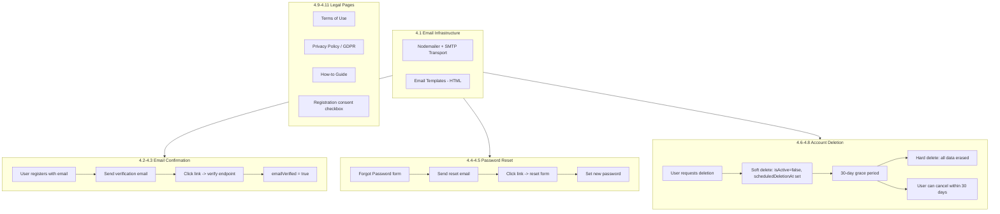
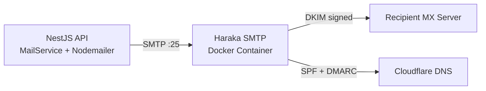

# Phase 4 — Auth Completion & Legal Pages — Design Document

> **Purpose**: This document specifies all implementation details for Phase 4: Auth Completion & Legal Pages. It covers email service infrastructure, email confirmation after registration, password reset flow, account deletion with GDPR-compliant 30-day grace period, and static legal/informational pages (Terms of Use, Privacy Policy, How-to Guide).
>
> **Prerequisites**: Phases 0–3 complete (Foundation, Basic Auth, Google Auth, Telegram Auth).

---

## Table of Contents

1. [Overview](#1-overview)
2. [Iteration 4.1: Email Service Infrastructure](#2-iteration-41-email-service-infrastructure)
3. [Iteration 4.2: Email Confirmation — Backend](#3-iteration-42-email-confirmation--backend)
4. [Iteration 4.3: Email Confirmation — Frontend](#4-iteration-43-email-confirmation--frontend)
5. [Iteration 4.4: Password Reset — Backend](#5-iteration-44-password-reset--backend)
6. [Iteration 4.5: Password Reset — Frontend](#6-iteration-45-password-reset--frontend)
7. [Iteration 4.6: Delete Account — Backend](#7-iteration-46-delete-account--backend)
8. [Iteration 4.7: Delete Account — Frontend](#8-iteration-47-delete-account--frontend)
9. [Iteration 4.8: Account Deletion Scheduler](#9-iteration-48-account-deletion-scheduler)
10. [Iteration 4.9: Terms of Use & Privacy Policy Pages](#10-iteration-49-terms-of-use--privacy-policy-pages)
11. [Iteration 4.10: How-to Guide Page](#11-iteration-410-how-to-guide-page)
12. [Iteration 4.11: Registration Consent & Footer Links](#12-iteration-411-registration-consent--footer-links)
13. [Iteration 4.12: Integration Tests & E2E Tests](#13-iteration-412-integration-tests--e2e-tests)
14. [Security Architecture](#14-security-architecture)
15. [Database Migration Strategy](#15-database-migration-strategy)
16. [Testing Strategy](#16-testing-strategy)
17. [File Changes Summary](#17-file-changes-summary)
18. [Documentation Updates](#18-documentation-updates)

---

## 1. Overview

### Goals

Phase 4 completes the authentication system with three critical missing features and adds legal/informational pages to make the application production-ready for real users.

**Feature work:**

1. **Email confirmation** — Users who register with email must verify their email address before gaining full access
2. **Password reset** — Users who sign in with email can reset their password via a tokenized email link
3. **Account deletion** — Users can request account deletion; 30-day soft-delete grace period before permanent hard delete

**Legal & informational pages:**

4. **Terms of Use** — Basic terms governing use of MyFinPro
5. **Privacy Policy / GDPR** — Data handling, user rights, retention policy
6. **How-to Guide** — Instructions for existing functionality: sign up, sign in, connect Google/Telegram, delete account

### Key Design Principles

- **Nodemailer with SMTP** — Scalable design using a generic SMTP transport; easily swappable to Gmail, Resend, SES, etc.
- **Cryptographic tokens** — Email confirmation and password reset use time-limited, single-use tokens stored hashed in DB
- **GDPR-compliant deletion** — 30-day grace period with anonymization of PII; hard delete scheduled via cron/BullMQ
- **No external dependencies for legal pages** — Static content rendered in Next.js, bilingual (en/he)
- **Progressive restrictions** — Unverified email users have limited access (cannot change email, but CAN use the app)

### Phase 4 Flow Diagram



---

## 2. Iteration 4.1: Email Service Infrastructure

### Nodemailer Setup

Create a NestJS `MailModule` that wraps Nodemailer with a generic SMTP transport.

```typescript
// apps/api/src/mail/mail.service.ts
@Injectable()
export class MailService {
  private transporter: Transporter;

  constructor(private configService: ConfigService) {
    this.transporter = createTransport({
      host: configService.get<string>('SMTP_HOST'),
      port: configService.get<number>('SMTP_PORT', 587),
      secure: configService.get<boolean>('SMTP_SECURE', false),
      auth: {
        user: configService.get<string>('SMTP_USER'),
        pass: configService.get<string>('SMTP_PASS'),
      },
    });
  }

  async sendMail(options: SendMailOptions): Promise<void>;
  async sendVerificationEmail(
    to: string,
    name: string,
    token: string,
    locale: string,
  ): Promise<void>;
  async sendPasswordResetEmail(
    to: string,
    name: string,
    token: string,
    locale: string,
  ): Promise<void>;
  async sendAccountDeletionConfirmation(
    to: string,
    name: string,
    deletionDate: Date,
    locale: string,
  ): Promise<void>;
  async sendAccountDeletionCancelled(to: string, name: string, locale: string): Promise<void>;
}
```

### Email Templates

Simple HTML templates with inline CSS (no external template engine dependency). Templates are bilingual (en/he) based on user locale.

**Templates to create:**

| Template                  | Purpose                                 | Variables                       |
| ------------------------- | --------------------------------------- | ------------------------------- |
| `verify-email.html`       | Email verification link                 | name, verificationUrl, appName  |
| `reset-password.html`     | Password reset link                     | name, resetUrl, appName, expiry |
| `account-deletion.html`   | Deletion confirmation with grace period | name, deletionDate, cancelUrl   |
| `deletion-cancelled.html` | Deletion cancelled confirmation         | name, appName                   |

### Environment Variables

Add to `.env.example`, `.env.staging.template`, `.env.production.template`:

```
SMTP_HOST=smtp.example.com
SMTP_PORT=587
SMTP_SECURE=false
SMTP_USER=noreply@example.com
SMTP_PASS=your-smtp-password
SMTP_FROM="MyFinPro <noreply@example.com>"
```

### Graceful Fallback

- If SMTP is not configured (development), log email content to console instead of sending
- Never crash the app if email sending fails — log error, continue operation
- Email sending should be fire-and-forget for non-critical emails (confirmation, deletion notice)
- Password reset email failure should propagate (user needs to know it failed)

### Files Created

| File                                                  | Purpose                        |
| ----------------------------------------------------- | ------------------------------ |
| `apps/api/src/mail/mail.module.ts`                    | Mail module                    |
| `apps/api/src/mail/mail.service.ts`                   | Mail service with Nodemailer   |
| `apps/api/src/mail/mail.service.spec.ts`              | Unit tests                     |
| `apps/api/src/mail/templates/verify-email.html`       | Verification email template    |
| `apps/api/src/mail/templates/reset-password.html`     | Password reset email template  |
| `apps/api/src/mail/templates/account-deletion.html`   | Deletion confirmation template |
| `apps/api/src/mail/templates/deletion-cancelled.html` | Cancellation confirmation      |

### Dependencies

Add to `apps/api/package.json`: `nodemailer`, `@types/nodemailer`

---

## 3. Iteration 4.2: Email Confirmation — Backend

### Schema Changes

Add to the existing `User` model in [`apps/api/prisma/schema.prisma`](../apps/api/prisma/schema.prisma):

```prisma
model EmailVerificationToken {
  id        String   @id @default(uuid()) @db.VarChar(36)
  tokenHash String   @unique @map("token_hash") @db.VarChar(255)
  userId    String   @map("user_id") @db.VarChar(36)
  user      User     @relation(fields: [userId], references: [id], onDelete: Cascade)
  expiresAt DateTime @map("expires_at")
  usedAt    DateTime? @map("used_at")
  createdAt DateTime @default(now()) @map("created_at")

  @@index([userId])
  @@index([expiresAt])
  @@map("email_verification_tokens")
}
```

Update `User` model to add the relation:

```prisma
model User {
  // ... existing fields ...
  emailVerificationTokens EmailVerificationToken[]
}
```

> Note: The `emailVerified` field already exists on the `User` model (default `false`).

### Endpoints

**POST /api/v1/auth/send-verification-email** (authenticated)

- Generates a random token (UUID), hashes with SHA-256, stores in `EmailVerificationToken` table
- Sends verification email with link: `{FRONTEND_URL}/{locale}/auth/verify-email?token={raw_token}`
- Token expires in 24 hours
- Rate limited: 3 requests per 10 minutes
- If email already verified, returns 200 with message (no email sent)
- If previous unexpired token exists, revoke it before creating new one

**GET /api/v1/auth/verify-email?token={token}** (public)

- Extracts token from query parameter
- Hashes with SHA-256, looks up in `EmailVerificationToken` table
- Validates: not expired, not used
- Marks token as used, sets `emailVerified = true` on User
- Returns 200 with success message
- Redirects to frontend success page (or returns JSON based on Accept header)

### Business Rules

- Email verification is NOT required to use the app (progressive restriction)
- Unverified users see a banner prompting verification
- Verification email is sent automatically after registration with email/password
- OAuth users (Google) are auto-verified; Telegram users have placeholder emails (not verifiable)
- Only email/password registered users with real emails can verify
- Resend verification: rate limited to 3 per 10 minutes per user

### Token Security

- Raw token: UUID v4 (122 bits of entropy)
- Stored as: SHA-256 hash (prevents DB leak → token extraction)
- Expiry: 24 hours
- Single-use: `usedAt` set on verification
- Old tokens invalidated when new one is generated (only one active token per user)

### Files Created/Modified

| File                                                            | Purpose                                  |
| --------------------------------------------------------------- | ---------------------------------------- |
| `apps/api/prisma/migrations/YYYYMMDD_phase4_*/`                 | New migration for email verification     |
| `apps/api/src/auth/services/email-verification.service.ts`      | Email verification token logic           |
| `apps/api/src/auth/services/email-verification.service.spec.ts` | Tests                                    |
| `apps/api/src/auth/auth.controller.ts`                          | Add send-verification + verify endpoints |
| `apps/api/src/auth/auth.service.ts`                             | Add verification methods                 |

---

## 4. Iteration 4.3: Email Confirmation — Frontend

### UI Components

**Verification banner** — Shown on all authenticated pages for unverified email users:

```
┌───────────────────────────────────────────────────────────┐
│ ⚠ Please verify your email address. Check your inbox or  │
│   [Resend verification email]                             │
└───────────────────────────────────────────────────────────┘
```

**Verification success page** — `/[locale]/auth/verify-email`:

```
┌─────────────────────────────────────┐
│          MyFinPro Header            │
├─────────────────────────────────────┤
│                                     │
│    ✅ Email verified successfully!  │
│                                     │
│    Your email has been confirmed.   │
│    You can now use all features.    │
│                                     │
│    [Go to Dashboard]                │
│                                     │
└─────────────────────────────────────┘
```

**Error states:**

- Token expired: "This link has expired. [Resend verification email]"
- Token already used: "Email already verified. [Go to Dashboard]"
- Invalid token: "Invalid verification link."

### Auth Context Changes

- Add `emailVerified` field to `User` type
- Add `resendVerificationEmail()` method to auth context

### i18n Keys

Add to `messages/en.json` and `messages/he.json`:

```json
{
  "auth": {
    "verifyEmail": "Verify your email",
    "verifyEmailSent": "Verification email sent! Check your inbox.",
    "verifyEmailSuccess": "Email verified successfully!",
    "verifyEmailExpired": "This verification link has expired.",
    "verifyEmailAlreadyVerified": "Your email is already verified.",
    "verifyEmailInvalid": "Invalid verification link.",
    "verifyEmailBanner": "Please verify your email address.",
    "resendVerification": "Resend verification email",
    "checkInbox": "Check your inbox for a verification link."
  }
}
```

### Files Created

| File                                                       | Purpose                  |
| ---------------------------------------------------------- | ------------------------ |
| `apps/web/src/app/[locale]/auth/verify-email/page.tsx`     | Verification result page |
| `apps/web/src/components/auth/VerificationBanner.tsx`      | Unverified email banner  |
| `apps/web/src/components/auth/VerificationBanner.spec.tsx` | Banner tests             |

---

## 5. Iteration 4.4: Password Reset — Backend

### Schema Changes

```prisma
model PasswordResetToken {
  id        String   @id @default(uuid()) @db.VarChar(36)
  tokenHash String   @unique @map("token_hash") @db.VarChar(255)
  userId    String   @map("user_id") @db.VarChar(36)
  user      User     @relation(fields: [userId], references: [id], onDelete: Cascade)
  expiresAt DateTime @map("expires_at")
  usedAt    DateTime? @map("used_at")
  createdAt DateTime @default(now()) @map("created_at")

  @@index([userId])
  @@index([expiresAt])
  @@map("password_reset_tokens")
}
```

Update `User` model to add the relation:

```prisma
model User {
  // ... existing fields ...
  passwordResetTokens PasswordResetToken[]
}
```

### Endpoints

**POST /api/v1/auth/forgot-password** (public)

- Accepts `{ email: string }`
- Rate limited: 3 requests per 10 minutes per IP
- If email exists AND user has a password (email auth user):
  - Generate token (UUID), hash with SHA-256, store in DB
  - Send password reset email with link: `{FRONTEND_URL}/{locale}/auth/reset-password?token={raw_token}`
  - Token expires in 1 hour
- If email does not exist or is OAuth-only: do nothing (prevent user enumeration)
- ALWAYS return 200 with generic message: "If an account with this email exists, a reset link has been sent."

**POST /api/v1/auth/reset-password** (public)

- Accepts `{ token: string, password: string }`
- Hash token with SHA-256, look up in `PasswordResetToken` table
- Validate: not expired, not used
- Validate new password against password policy (same rules as registration)
- Hash new password with Argon2id
- Update user's `passwordHash`
- Mark token as used
- Revoke ALL user's refresh tokens (force re-login everywhere)
- Return 200 with success message
- Rate limited: 5 requests per 10 minutes per IP

### Business Rules

- Generic response for forgot-password (prevent user enumeration)
- Only users with a `passwordHash` (email auth) can reset passwords
- OAuth-only users clicking "forgot password" get the same generic message (no leak)
- Token single-use + 1 hour expiry
- After password reset, all existing sessions are invalidated
- Only one active reset token per user (old ones invalidated when new one created)

### Files Created/Modified

| File                                                        | Purpose                               |
| ----------------------------------------------------------- | ------------------------------------- |
| `apps/api/src/auth/services/password-reset.service.ts`      | Password reset token logic            |
| `apps/api/src/auth/services/password-reset.service.spec.ts` | Tests                                 |
| `apps/api/src/auth/dto/forgot-password.dto.ts`              | Forgot password DTO                   |
| `apps/api/src/auth/dto/reset-password.dto.ts`               | Reset password DTO                    |
| `apps/api/src/auth/auth.controller.ts`                      | Add forgot-password + reset endpoints |
| `apps/api/src/auth/auth.service.ts`                         | Add password reset methods            |

---

## 6. Iteration 4.5: Password Reset — Frontend

### Pages

**Forgot Password page** — `/[locale]/auth/forgot-password`:

```
┌─────────────────────────────────────┐
│          MyFinPro Header            │
├─────────────────────────────────────┤
│                                     │
│       Reset your password           │
│                                     │
│  Enter your email address and       │
│  we will send you a reset link.     │
│                                     │
│  ┌─────────────────────────────┐    │
│  │  Email                      │    │
│  └─────────────────────────────┘    │
│                                     │
│  [    Send Reset Link        ]      │
│                                     │
│  Back to [Sign In]                  │
│                                     │
└─────────────────────────────────────┘
```

**After submission (success):**

```
┌─────────────────────────────────────┐
│                                     │
│  ✉ Check your email                │
│                                     │
│  If an account with this email      │
│  exists, we sent a password         │
│  reset link. Check your inbox.      │
│                                     │
│  [Back to Sign In]                  │
│                                     │
└─────────────────────────────────────┘
```

**Reset Password page** — `/[locale]/auth/reset-password?token=xxx`:

```
┌─────────────────────────────────────┐
│          MyFinPro Header            │
├─────────────────────────────────────┤
│                                     │
│       Set new password              │
│                                     │
│  ┌─────────────────────────────┐    │
│  │  New Password               │    │
│  └─────────────────────────────┘    │
│  Password strength: ████░░░░ Good   │
│  ┌─────────────────────────────┐    │
│  │  Confirm Password           │    │
│  └─────────────────────────────┘    │
│                                     │
│  [    Reset Password         ]      │
│                                     │
└─────────────────────────────────────┘
```

### Login Page Update

Add working "Forgot your password?" link to the login form (currently a placeholder).

### i18n Keys

```json
{
  "auth": {
    "forgotPasswordTitle": "Reset your password",
    "forgotPasswordDescription": "Enter your email address and we will send you a reset link.",
    "sendResetLink": "Send Reset Link",
    "resetLinkSent": "If an account with this email exists, we sent a password reset link.",
    "checkYourEmail": "Check your email",
    "resetPasswordTitle": "Set new password",
    "newPassword": "New Password",
    "resetPassword": "Reset Password",
    "resetPasswordSuccess": "Password reset successfully! You can now sign in with your new password.",
    "resetPasswordExpired": "This reset link has expired. Please request a new one.",
    "resetPasswordInvalid": "Invalid reset link.",
    "backToSignIn": "Back to Sign In"
  }
}
```

### Files Created

| File                                                       | Purpose              |
| ---------------------------------------------------------- | -------------------- |
| `apps/web/src/app/[locale]/auth/forgot-password/page.tsx`  | Forgot password page |
| `apps/web/src/app/[locale]/auth/reset-password/page.tsx`   | Reset password page  |
| `apps/web/src/components/auth/ForgotPasswordForm.tsx`      | Forgot password form |
| `apps/web/src/components/auth/ForgotPasswordForm.spec.tsx` | Tests                |
| `apps/web/src/components/auth/ResetPasswordForm.tsx`       | Reset password form  |
| `apps/web/src/components/auth/ResetPasswordForm.spec.tsx`  | Tests                |

---

## 7. Iteration 4.6: Delete Account — Backend

### Schema Changes

Add to the existing `User` model:

```prisma
model User {
  // ... existing fields ...
  deletedAt             DateTime? @map("deleted_at")
  scheduledDeletionAt   DateTime? @map("scheduled_deletion_at")
}
```

### Endpoints

**POST /api/v1/auth/delete-account** (authenticated)

- Accepts `{ confirmation: string }` — user must type their email to confirm
- Validates that `confirmation` matches the user's email
- Soft delete: sets `isActive = false`, `deletedAt = now()`, `scheduledDeletionAt = now() + 30 days`
- Revokes ALL user's refresh tokens
- Clears refresh token cookie
- Sends account deletion confirmation email with:
  - Scheduled permanent deletion date
  - Link to cancel deletion (reactivation link)
- Returns 200 with message and deletion date
- Logs audit event: `ACCOUNT_DELETION_REQUESTED`

**POST /api/v1/auth/cancel-deletion** (public, token-based)

- Accepts `{ token: string }` — reactivation token sent in deletion email
- Or: authenticated user who is soft-deleted can POST to this without token
- Validates token or JWT
- Reactivates account: `isActive = true`, `deletedAt = null`, `scheduledDeletionAt = null`
- Sends cancellation confirmation email
- Returns 200 with success message
- Logs audit event: `ACCOUNT_DELETION_CANCELLED`

**Alternative: Login-based reactivation**

- When a soft-deleted user successfully authenticates (email/password or OAuth):
  - If within 30-day grace period: automatically reactivate the account
  - Set `isActive = true`, clear `deletedAt` and `scheduledDeletionAt`
  - Show toast: "Your account has been reactivated!"
  - Log audit event: `ACCOUNT_REACTIVATED_VIA_LOGIN`

### What Soft Delete Does

When an account is soft-deleted:

1. `isActive` → `false` (blocks login via existing `validateUser()` check)
2. `deletedAt` → current timestamp
3. `scheduledDeletionAt` → current timestamp + 30 days
4. All refresh tokens revoked
5. Email notification sent with cancellation link

### What Hard Delete Does (Iteration 4.8)

After 30 days, the scheduler performs permanent deletion:

1. Delete all `RefreshToken` records for the user
2. Delete all `OAuthProvider` records for the user
3. Delete all `EmailVerificationToken` records for the user
4. Delete all `PasswordResetToken` records for the user
5. Delete all `AuditLog` records for the user (or anonymize: set userId to null)
6. Delete the `User` record itself
7. Log a system-level audit: `ACCOUNT_PERMANENTLY_DELETED` (with anonymized reference)

### Reactivation Token

- Embedded in the deletion confirmation email
- Same pattern as other tokens: UUID, hashed with SHA-256, stored in DB
- Expires when `scheduledDeletionAt` is reached (30 days)
- Single-use

### New Auth Error Codes

Add to [`apps/api/src/auth/constants/auth-errors.ts`](../apps/api/src/auth/constants/auth-errors.ts):

```typescript
export const AUTH_ERRORS = {
  // ... existing errors ...
  ACCOUNT_DELETION_CONFIRMATION_MISMATCH: 'AUTH_ACCOUNT_DELETION_CONFIRMATION_MISMATCH',
  ACCOUNT_ALREADY_DELETED: 'AUTH_ACCOUNT_ALREADY_DELETED',
  ACCOUNT_NOT_DELETED: 'AUTH_ACCOUNT_NOT_DELETED',
  DELETION_TOKEN_INVALID: 'AUTH_DELETION_TOKEN_INVALID',
  DELETION_TOKEN_EXPIRED: 'AUTH_DELETION_TOKEN_EXPIRED',
  EMAIL_NOT_CONFIGURED: 'AUTH_EMAIL_NOT_CONFIGURED',
  EMAIL_SEND_FAILED: 'AUTH_EMAIL_SEND_FAILED',
  EMAIL_ALREADY_VERIFIED: 'AUTH_EMAIL_ALREADY_VERIFIED',
  VERIFICATION_TOKEN_INVALID: 'AUTH_VERIFICATION_TOKEN_INVALID',
  VERIFICATION_TOKEN_EXPIRED: 'AUTH_VERIFICATION_TOKEN_EXPIRED',
  RESET_TOKEN_INVALID: 'AUTH_RESET_TOKEN_INVALID',
  RESET_TOKEN_EXPIRED: 'AUTH_RESET_TOKEN_EXPIRED',
} as const;
```

### Files Created/Modified

| File                                                          | Purpose                       |
| ------------------------------------------------------------- | ----------------------------- |
| `apps/api/src/auth/services/account-deletion.service.ts`      | Account deletion logic        |
| `apps/api/src/auth/services/account-deletion.service.spec.ts` | Tests                         |
| `apps/api/src/auth/dto/delete-account.dto.ts`                 | Delete account DTO            |
| `apps/api/src/auth/dto/cancel-deletion.dto.ts`                | Cancel deletion DTO           |
| `apps/api/src/auth/auth.controller.ts`                        | Add delete + cancel endpoints |
| `apps/api/src/auth/auth.service.ts`                           | Add deletion methods          |

---

## 8. Iteration 4.7: Delete Account — Frontend

### Settings Page: Account Danger Zone

Add account deletion section to settings or create a dedicated page at `/[locale]/settings/account`:

```
┌─────────────────────────────────────┐
│          MyFinPro Header            │
├─────────────────────────────────────┤
│                                     │
│  Account Settings                   │
│                                     │
│  ┌─────────────────────────────┐    │
│  │  🔴 Danger Zone             │    │
│  │                             │    │
│  │  Delete your account        │    │
│  │                             │    │
│  │  This will schedule your    │    │
│  │  account for permanent      │    │
│  │  deletion in 30 days.       │    │
│  │  You can cancel at any time │    │
│  │  within the grace period.   │    │
│  │                             │    │
│  │  [Delete Account]           │    │
│  └─────────────────────────────┘    │
│                                     │
└─────────────────────────────────────┘
```

**Deletion confirmation dialog:**

```
┌─────────────────────────────────────┐
│                                     │
│  ⚠ Delete Your Account?            │
│                                     │
│  Your account and all data will     │
│  be permanently deleted after 30    │
│  days. You can cancel anytime       │
│  before then by signing in again.   │
│                                     │
│  Type your email to confirm:        │
│  ┌─────────────────────────────┐    │
│  │                             │    │
│  └─────────────────────────────┘    │
│                                     │
│  [Cancel]        [Delete Account]   │
│                                     │
└─────────────────────────────────────┘
```

**After deletion (redirected to homepage):**

Toast notification: "Your account has been scheduled for deletion. Check your email for details."

### Pending Deletion Banner

If a soft-deleted user somehow lands on the app (e.g., via reactivation):

```
┌───────────────────────────────────────────────────────────┐
│ ⚠ Your account is scheduled for deletion on {date}.      │
│   [Cancel Deletion] to keep your account.                 │
└───────────────────────────────────────────────────────────┘
```

### i18n Keys

```json
{
  "settings": {
    "account": "Account Settings",
    "dangerZone": "Danger Zone",
    "deleteAccount": "Delete Account",
    "deleteAccountDescription": "This will schedule your account for permanent deletion in 30 days. You can cancel at any time within the grace period.",
    "deleteAccountConfirmTitle": "Delete Your Account?",
    "deleteAccountConfirmDescription": "Your account and all data will be permanently deleted after 30 days. You can cancel anytime before then by signing in again.",
    "typeEmailToConfirm": "Type your email to confirm",
    "deleteAccountSuccess": "Your account has been scheduled for deletion. Check your email for details.",
    "cancelDeletion": "Cancel Deletion",
    "cancelDeletionSuccess": "Account deletion cancelled. Welcome back!",
    "accountPendingDeletion": "Your account is scheduled for deletion on {date}.",
    "accountReactivated": "Your account has been reactivated!"
  }
}
```

### Files Created

| File                                                        | Purpose                      |
| ----------------------------------------------------------- | ---------------------------- |
| `apps/web/src/app/[locale]/settings/account/page.tsx`       | Account settings page        |
| `apps/web/src/components/auth/DeleteAccountDialog.tsx`      | Deletion confirmation dialog |
| `apps/web/src/components/auth/DeleteAccountDialog.spec.tsx` | Tests                        |
| `apps/web/src/components/auth/DeletionBanner.tsx`           | Pending deletion banner      |
| `apps/web/src/components/auth/DeletionBanner.spec.tsx`      | Tests                        |

---

## 9. Iteration 4.8: Account Deletion Scheduler

### Cron-Based Hard Delete

Implement a scheduled task that runs daily to permanently delete accounts past their grace period.

**Option A: NestJS @Cron (simpler, no BullMQ needed)**

```typescript
// apps/api/src/auth/services/deletion-scheduler.service.ts
@Injectable()
export class DeletionSchedulerService {
  private readonly logger = new Logger(DeletionSchedulerService.name);

  constructor(private readonly prisma: PrismaService) {}

  @Cron(CronExpression.EVERY_DAY_AT_MIDNIGHT)
  async processExpiredDeletions() {
    const usersToDelete = await this.prisma.user.findMany({
      where: {
        isActive: false,
        scheduledDeletionAt: { lte: new Date() },
      },
    });

    for (const user of usersToDelete) {
      await this.hardDeleteUser(user.id);
    }

    this.logger.log(`Processed ${usersToDelete.length} expired account deletions`);
  }

  async hardDeleteUser(userId: string): Promise<void> {
    await this.prisma.$transaction(async (tx) => {
      // Delete all related records
      await tx.refreshToken.deleteMany({ where: { userId } });
      await tx.oAuthProvider.deleteMany({ where: { userId } });
      await tx.emailVerificationToken.deleteMany({ where: { userId } });
      await tx.passwordResetToken.deleteMany({ where: { userId } });
      // Anonymize audit logs (keep for compliance, remove PII reference)
      await tx.auditLog.updateMany({
        where: { userId },
        data: { userId: null },
      });
      // Delete the user
      await tx.user.delete({ where: { id: userId } });
    });

    // System-level audit log (no userId, tracks the deletion itself)
    await this.prisma.auditLog.create({
      data: {
        action: 'ACCOUNT_PERMANENTLY_DELETED',
        entity: 'User',
        entityId: userId,
        details: { deletedAt: new Date().toISOString() },
      },
    });
  }
}
```

### Dependencies

Add to `apps/api/package.json`: `@nestjs/schedule`

### Files Created

| File                                                            | Purpose                         |
| --------------------------------------------------------------- | ------------------------------- |
| `apps/api/src/auth/services/deletion-scheduler.service.ts`      | Daily cron job for hard deletes |
| `apps/api/src/auth/services/deletion-scheduler.service.spec.ts` | Tests                           |

---

## 10. Iteration 4.9: Terms of Use & Privacy Policy Pages

### Terms of Use — `/[locale]/legal/terms`

Basic terms covering:

1. **Acceptance** — By using MyFinPro, you agree to these terms
2. **Service description** — Personal/family finance management tool
3. **Account responsibility** — Users are responsible for their account security
4. **Acceptable use** — No illegal activity, no abuse of the service
5. **Data accuracy** — Financial data is user-entered; MyFinPro is not a financial advisor
6. **Service availability** — Best-effort availability, no SLA guarantees
7. **Modifications** — Terms may be updated; users will be notified
8. **Termination** — Users can delete their account at any time
9. **Limitation of liability** — Standard limitation clause
10. **Governing law** — Applicable jurisdiction

### Privacy Policy — `/[locale]/legal/privacy`

GDPR-compliant privacy policy covering:

1. **Data controller** — Who operates MyFinPro
2. **Data collected** — Email, name, authentication data (Google/Telegram IDs), financial records
3. **Purpose of processing** — Account management, financial tracking, service improvement
4. **Legal basis** — Consent (registration), legitimate interest (service operation)
5. **Data retention** — Active data while account exists; 30-day grace period after deletion; audit logs retained 90 days after anonymization
6. **User rights (GDPR Article 13-22)**:
   - Right to access (view your data)
   - Right to rectification (edit profile)
   - Right to erasure (delete account)
   - Right to restrict processing
   - Right to data portability (future: data export)
   - Right to object
7. **Third-party services** — Google OAuth, Telegram Login (data shared during authentication only)
8. **Cookies** — httpOnly refresh token cookie (not tracking), session cookie for OAuth state
9. **Security measures** — Encryption in transit, Argon2id password hashing, token rotation
10. **Changes to policy** — Notification of updates
11. **Contact** — How to reach the data controller

### Implementation

Both pages are static Next.js pages with i18n content. Content is stored in the `messages/{locale}.json` files as structured keys, rendered with `next-intl`.

### Files Created

| File                                               | Purpose             |
| -------------------------------------------------- | ------------------- |
| `apps/web/src/app/[locale]/legal/terms/page.tsx`   | Terms of Use page   |
| `apps/web/src/app/[locale]/legal/privacy/page.tsx` | Privacy Policy page |

---

## 11. Iteration 4.10: How-to Guide Page

### How-to Guide — `/[locale]/help`

Instructions for existing functionality with visual step-by-step guides:

**Sections:**

1. **Getting Started**
   - Creating an account (email registration)
   - Signing in with email and password

2. **Social Sign-In**
   - Connecting with Google
   - Connecting with Telegram

3. **Managing Connected Accounts**
   - Viewing connected accounts
   - Linking additional providers
   - Unlinking a provider

4. **Account Security**
   - Changing your password (future — link to "coming soon")
   - Resetting a forgotten password
   - Email verification

5. **Account Management**
   - Deleting your account
   - Cancelling account deletion
   - Understanding the 30-day grace period
   - What data is deleted

### Files Created

| File                                      | Purpose           |
| ----------------------------------------- | ----------------- |
| `apps/web/src/app/[locale]/help/page.tsx` | How-to guide page |

---

## 12. Iteration 4.11: Registration Consent & Footer Links

### Registration Form Update

Add a mandatory consent checkbox to the registration form:

```
☐ I agree to the [Terms of Use] and [Privacy Policy]
```

- Checkbox must be checked to submit the form
- Links open in new tab
- Already i18n-compatible

### Footer Component

Create a global footer visible on all pages with links to:

- Terms of Use
- Privacy Policy
- Help / How-to Guide

```
┌─────────────────────────────────────────────┐
│  © 2026 MyFinPro                            │
│  Terms of Use · Privacy Policy · Help       │
└─────────────────────────────────────────────┘
```

### Navigation Update

Add "Help" link to Header for authenticated users and footer for all users.

### i18n Keys

```json
{
  "auth": {
    "agreeToTerms": "I agree to the",
    "termsOfUse": "Terms of Use",
    "and": "and",
    "privacyPolicy": "Privacy Policy",
    "mustAgreeToTerms": "You must agree to the Terms of Use and Privacy Policy"
  },
  "footer": {
    "copyright": "© 2026 MyFinPro",
    "terms": "Terms of Use",
    "privacy": "Privacy Policy",
    "help": "Help"
  }
}
```

### Files Created/Modified

| File                                             | Purpose                 |
| ------------------------------------------------ | ----------------------- |
| `apps/web/src/components/layout/Footer.tsx`      | Global footer component |
| `apps/web/src/components/layout/Footer.spec.tsx` | Footer tests            |
| `apps/web/src/components/auth/RegisterForm.tsx`  | Add consent checkbox    |

---

## 13. Iteration 4.12: Integration Tests & E2E Tests

### API Integration Tests (Testcontainers)

New test file: `apps/api/test/integration/auth-phase4.integration.spec.ts`

**Email verification tests:**

1. Register → verification email token created in DB
2. Verify with valid token → emailVerified = true
3. Verify with expired token → 401
4. Verify with already-used token → 400
5. Resend verification → new token created, old one invalidated
6. Resend verification for verified user → 200, no email sent

**Password reset tests:**

7. Forgot password with existing email → token created
8. Forgot password with non-existent email → 200 (no leak)
9. Reset password with valid token → password updated, all sessions revoked
10. Reset password with expired token → 401
11. Reset password with used token → 400

**Account deletion tests:**

12. Delete account with matching email → soft delete, scheduledDeletionAt set
13. Delete account with wrong email → 400
14. Cancel deletion within grace period → account reactivated
15. Login after soft delete → account reactivated
16. Hard delete after grace period (mock time) → all data removed

### Playwright E2E Tests

Add to `apps/web/e2e/auth.spec.ts`:

1. Forgot password page loads and form submits
2. Reset password page loads with token and resets successfully
3. Delete account dialog appears, requires email confirmation
4. Terms of Use page loads with content
5. Privacy Policy page loads with content
6. Help page loads with sections
7. Registration form requires terms consent checkbox
8. Footer links are visible and navigate correctly

### Files Created

| File                                                        | Purpose              |
| ----------------------------------------------------------- | -------------------- |
| `apps/api/test/integration/auth-phase4.integration.spec.ts` | Integration tests    |
| `apps/web/e2e/auth.spec.ts`                                 | Additional E2E tests |

---

## 14. Security Architecture

### Security Checklist for Phase 4

- [ ] Email verification tokens: 24h expiry, single-use, SHA-256 hashed storage
- [ ] Password reset tokens: 1h expiry, single-use, SHA-256 hashed storage
- [ ] Generic responses on forgot-password (prevent user enumeration)
- [ ] Rate limiting on all new endpoints (3-5 req/min)
- [ ] Email sending graceful fallback (never crash on SMTP failure)
- [ ] Account deletion requires email confirmation input
- [ ] All sessions revoked on password reset and account deletion
- [ ] Hard delete removes ALL user data after 30-day grace period
- [ ] Audit logs anonymized (userId set to null) on hard delete
- [ ] SMTP credentials stored securely in environment variables
- [ ] Terms of Use and Privacy Policy accessible without authentication

### Threat Model

| Threat                                | Mitigation                                                |
| ------------------------------------- | --------------------------------------------------------- |
| Email enumeration via forgot-password | Generic response regardless of email existence            |
| Brute-force token guessing            | UUID tokens (122 bits entropy), rate limiting             |
| Token replay                          | Single-use tokens, hashed storage                         |
| SMTP credential leak                  | Environment variables, never logged                       |
| Unauthorized account deletion         | Requires email confirmation input + valid JWT             |
| Deletion before user realizes         | 30-day grace period, reactivation via login or email link |
| Data retention after deletion         | Hard delete removes all PII, audit logs anonymized        |

---

## 15. Database Migration Strategy

### Migration: Phase 4 Email Verification & Password Reset

Single migration adding both token tables and the deletion fields:

```sql
-- Add deletion fields to users table
ALTER TABLE `users` ADD COLUMN `deleted_at` DATETIME NULL;
ALTER TABLE `users` ADD COLUMN `scheduled_deletion_at` DATETIME NULL;
ALTER TABLE `users` ADD INDEX `idx_users_scheduled_deletion` (`scheduled_deletion_at`);

-- Email verification tokens
CREATE TABLE `email_verification_tokens` (
  `id` VARCHAR(36) NOT NULL,
  `token_hash` VARCHAR(255) NOT NULL,
  `user_id` VARCHAR(36) NOT NULL,
  `expires_at` DATETIME NOT NULL,
  `used_at` DATETIME NULL,
  `created_at` DATETIME NOT NULL DEFAULT CURRENT_TIMESTAMP,
  PRIMARY KEY (`id`),
  UNIQUE KEY `uq_evt_token_hash` (`token_hash`),
  KEY `idx_evt_user_id` (`user_id`),
  KEY `idx_evt_expires_at` (`expires_at`),
  CONSTRAINT `fk_evt_user` FOREIGN KEY (`user_id`) REFERENCES `users`(`id`) ON DELETE CASCADE
) ENGINE=InnoDB DEFAULT CHARSET=utf8mb4;

-- Password reset tokens
CREATE TABLE `password_reset_tokens` (
  `id` VARCHAR(36) NOT NULL,
  `token_hash` VARCHAR(255) NOT NULL,
  `user_id` VARCHAR(36) NOT NULL,
  `expires_at` DATETIME NOT NULL,
  `used_at` DATETIME NULL,
  `created_at` DATETIME NOT NULL DEFAULT CURRENT_TIMESTAMP,
  PRIMARY KEY (`id`),
  UNIQUE KEY `uq_prt_token_hash` (`token_hash`),
  KEY `idx_prt_user_id` (`user_id`),
  KEY `idx_prt_expires_at` (`expires_at`),
  CONSTRAINT `fk_prt_user` FOREIGN KEY (`user_id`) REFERENCES `users`(`id`) ON DELETE CASCADE
) ENGINE=InnoDB DEFAULT CHARSET=utf8mb4;
```

This follows the **expand-only** pattern — no columns or tables are removed, only added.

---

## 16. Testing Strategy

### Test Counts per Iteration

| Iteration | Unit Tests                                  | Integration Tests                     | E2E Tests                  |
| --------- | ------------------------------------------- | ------------------------------------- | -------------------------- |
| 4.1       | 8 (mail service, template rendering)        | 0                                     | 0                          |
| 4.2       | 10 (verification token create/validate/use) | 6 (full verification flow)            | 0                          |
| 4.3       | 4 (banner, verify page)                     | 0                                     | 2 (verification page)      |
| 4.4       | 10 (reset token create/validate/use)        | 5 (full reset flow)                   | 0                          |
| 4.5       | 6 (forgot form, reset form)                 | 0                                     | 2 (forgot + reset pages)   |
| 4.6       | 10 (soft delete, cancel, reactivation)      | 5 (deletion + cancel flow)            | 0                          |
| 4.7       | 4 (dialog, banner)                          | 0                                     | 2 (delete flow)            |
| 4.8       | 6 (scheduler, hard delete)                  | 2 (cron execution)                    | 0                          |
| 4.9       | 2 (page render)                             | 0                                     | 2 (terms + privacy pages)  |
| 4.10      | 2 (page render)                             | 0                                     | 1 (help page)              |
| 4.11      | 4 (consent checkbox, footer)                | 0                                     | 2 (consent + footer links) |
| 4.12      | 0 (tests in this iteration)                 | 12+ (comprehensive integration suite) | 8+ (E2E suite)             |

**Estimated total new tests: ~85-100**

---

## 17. File Changes Summary

### New Files (by module)

**API — Mail Module:**

| File                                                  | Purpose                   |
| ----------------------------------------------------- | ------------------------- |
| `apps/api/src/mail/mail.module.ts`                    | Mail module               |
| `apps/api/src/mail/mail.service.ts`                   | Nodemailer SMTP service   |
| `apps/api/src/mail/mail.service.spec.ts`              | Tests                     |
| `apps/api/src/mail/templates/verify-email.html`       | Verification email        |
| `apps/api/src/mail/templates/reset-password.html`     | Password reset email      |
| `apps/api/src/mail/templates/account-deletion.html`   | Deletion confirmation     |
| `apps/api/src/mail/templates/deletion-cancelled.html` | Cancellation confirmation |

**API — Auth Module (new files):**

| File                                                            | Purpose                  |
| --------------------------------------------------------------- | ------------------------ |
| `apps/api/src/auth/services/email-verification.service.ts`      | Email verification logic |
| `apps/api/src/auth/services/email-verification.service.spec.ts` | Tests                    |
| `apps/api/src/auth/services/password-reset.service.ts`          | Password reset logic     |
| `apps/api/src/auth/services/password-reset.service.spec.ts`     | Tests                    |
| `apps/api/src/auth/services/account-deletion.service.ts`        | Account deletion logic   |
| `apps/api/src/auth/services/account-deletion.service.spec.ts`   | Tests                    |
| `apps/api/src/auth/services/deletion-scheduler.service.ts`      | Daily hard-delete cron   |
| `apps/api/src/auth/services/deletion-scheduler.service.spec.ts` | Tests                    |
| `apps/api/src/auth/dto/forgot-password.dto.ts`                  | Forgot password DTO      |
| `apps/api/src/auth/dto/reset-password.dto.ts`                   | Reset password DTO       |
| `apps/api/src/auth/dto/delete-account.dto.ts`                   | Delete account DTO       |
| `apps/api/src/auth/dto/cancel-deletion.dto.ts`                  | Cancel deletion DTO      |

**Web — New Pages:**

| File                                                      | Purpose                  |
| --------------------------------------------------------- | ------------------------ |
| `apps/web/src/app/[locale]/auth/verify-email/page.tsx`    | Verification result page |
| `apps/web/src/app/[locale]/auth/forgot-password/page.tsx` | Forgot password page     |
| `apps/web/src/app/[locale]/auth/reset-password/page.tsx`  | Reset password page      |
| `apps/web/src/app/[locale]/settings/account/page.tsx`     | Account settings page    |
| `apps/web/src/app/[locale]/legal/terms/page.tsx`          | Terms of Use             |
| `apps/web/src/app/[locale]/legal/privacy/page.tsx`        | Privacy Policy           |
| `apps/web/src/app/[locale]/help/page.tsx`                 | How-to Guide             |

**Web — New Components:**

| File                                                        | Purpose                 |
| ----------------------------------------------------------- | ----------------------- |
| `apps/web/src/components/auth/VerificationBanner.tsx`       | Unverified email banner |
| `apps/web/src/components/auth/VerificationBanner.spec.tsx`  | Tests                   |
| `apps/web/src/components/auth/ForgotPasswordForm.tsx`       | Forgot password form    |
| `apps/web/src/components/auth/ForgotPasswordForm.spec.tsx`  | Tests                   |
| `apps/web/src/components/auth/ResetPasswordForm.tsx`        | Reset password form     |
| `apps/web/src/components/auth/ResetPasswordForm.spec.tsx`   | Tests                   |
| `apps/web/src/components/auth/DeleteAccountDialog.tsx`      | Deletion confirmation   |
| `apps/web/src/components/auth/DeleteAccountDialog.spec.tsx` | Tests                   |
| `apps/web/src/components/auth/DeletionBanner.tsx`           | Pending deletion banner |
| `apps/web/src/components/auth/DeletionBanner.spec.tsx`      | Tests                   |
| `apps/web/src/components/layout/Footer.tsx`                 | Global footer           |
| `apps/web/src/components/layout/Footer.spec.tsx`            | Tests                   |

**Tests:**

| File                                                        | Purpose             |
| ----------------------------------------------------------- | ------------------- |
| `apps/api/test/integration/auth-phase4.integration.spec.ts` | Integration tests   |
| `apps/web/e2e/auth.spec.ts`                                 | New E2E tests added |

### Modified Files

| File                                                                                                | Change                                               |
| --------------------------------------------------------------------------------------------------- | ---------------------------------------------------- |
| [`apps/api/prisma/schema.prisma`](../apps/api/prisma/schema.prisma)                                 | Add token tables + deletion fields                   |
| [`apps/api/src/auth/auth.module.ts`](../apps/api/src/auth/auth.module.ts)                           | Import MailModule, ScheduleModule, new services      |
| [`apps/api/src/auth/auth.controller.ts`](../apps/api/src/auth/auth.controller.ts)                   | Add 6 new endpoints                                  |
| [`apps/api/src/auth/auth.service.ts`](../apps/api/src/auth/auth.service.ts)                         | Add verification, reset, deletion methods            |
| [`apps/api/src/auth/constants/auth-errors.ts`](../apps/api/src/auth/constants/auth-errors.ts)       | New error codes                                      |
| [`apps/api/src/app.module.ts`](../apps/api/src/app.module.ts)                                       | Import ScheduleModule                                |
| [`apps/api/package.json`](../apps/api/package.json)                                                 | Add nodemailer, @nestjs/schedule                     |
| [`apps/web/src/lib/auth/auth-context.tsx`](../apps/web/src/lib/auth/auth-context.tsx)               | Add emailVerified, resendVerification, deleteAccount |
| [`apps/web/src/lib/auth/types.ts`](../apps/web/src/lib/auth/types.ts)                               | Add emailVerified to User type                       |
| [`apps/web/src/components/auth/RegisterForm.tsx`](../apps/web/src/components/auth/RegisterForm.tsx) | Add consent checkbox                                 |
| [`apps/web/src/components/auth/LoginForm.tsx`](../apps/web/src/components/auth/LoginForm.tsx)       | Enable forgot password link                          |
| [`apps/web/src/components/layout/Header.tsx`](../apps/web/src/components/layout/Header.tsx)         | Add help link, settings link                         |
| [`apps/web/src/app/[locale]/layout.tsx`](../apps/web/src/app/[locale]/layout.tsx)                   | Add Footer component                                 |
| [`apps/web/messages/en.json`](../apps/web/messages/en.json)                                         | New i18n keys for all features                       |
| [`apps/web/messages/he.json`](../apps/web/messages/he.json)                                         | Hebrew translations                                  |
| [`.env.example`](../.env.example)                                                                   | Add SMTP config                                      |
| [`.env.staging.template`](../.env.staging.template)                                                 | Add SMTP config                                      |
| [`.env.production.template`](../.env.production.template)                                           | Add SMTP config                                      |

### New Dependencies

**API (`apps/api/package.json`):**

| Package             | Purpose                    |
| ------------------- | -------------------------- |
| `nodemailer`        | Email sending via SMTP     |
| `@types/nodemailer` | TypeScript types           |
| `@nestjs/schedule`  | Cron-based scheduled tasks |

---

## 18. Documentation Updates

As part of this phase, update the following documentation:

1. **`IMPLEMENTATION-PLAN.md`** — Insert Phase 4 (Auth Completion & Legal Pages) after Phase 3, renumber existing Phase 4 (Family/Group Management) → Phase 5, and all subsequent phases accordingly
2. **`docs/progress.md`** — Add Phase 4 entry to the progress table with all iterations listed
3. **`docs/phase-4-design.md`** — This document

### Renumbering Summary

| Old Number | New Number  | Phase Name                              |
| ---------- | ----------- | --------------------------------------- |
| Phase 0    | Phase 0     | Foundation (unchanged)                  |
| Phase 1    | Phase 1     | Basic Auth (unchanged)                  |
| Phase 2    | Phase 2     | Google Auth (unchanged)                 |
| Phase 3    | Phase 3     | Telegram Auth (unchanged)               |
| —          | **Phase 4** | **Auth Completion & Legal Pages (NEW)** |
| Phase 4    | Phase 5     | Family/Group Management                 |
| Phase 5    | Phase 6     | Income Management                       |
| Phase 6    | Phase 7     | Expense Management                      |
| Phase 7    | Phase 8     | Budgets & Spending Targets              |
| Phase 8    | Phase 9     | Receipt Processing                      |
| Phase 9    | Phase 10    | Purchase Analytics                      |
| Phase 10   | Phase 11    | Telegram Bot                            |
| Phase 11   | Phase 12    | Telegram Mini App                       |
| Phase 12   | Phase 13    | Bot Receipt Processing                  |
| Phase 13   | Phase 14    | Bot Analytics                           |
| Phase 14   | Phase 15    | LLM Assistant                           |

---

## Appendix: Iteration Execution Order

```mermaid
gantt
    title Phase 4 Execution Order
    dateFormat X
    axisFormat %s

    section Infrastructure
    4.1 Email Service Infrastructure :i1, 0, 1

    section Email Confirmation
    4.2 Email Confirmation Backend :i2, after i1, 1
    4.3 Email Confirmation Frontend :i3, after i2, 1

    section Password Reset
    4.4 Password Reset Backend :i4, after i1, 1
    4.5 Password Reset Frontend :i5, after i4, 1

    section Account Deletion
    4.6 Delete Account Backend :i6, after i1, 1
    4.7 Delete Account Frontend :i7, after i6, 1
    4.8 Deletion Scheduler :i8, after i6, 1

    section Legal Pages
    4.9 Terms + Privacy Pages :i9, 0, 1
    4.10 How-to Guide :i10, after i9, 1
    4.11 Consent + Footer :i11, after i9, 1

    section Testing
    4.12 Integration + E2E Tests :i12, after i8, 1

    section SMTP Infrastructure
    4.13 Haraka SMTP Server :i13, after i12, 1
```



**Note:** Iterations 4.2-4.3, 4.4-4.5, and 4.6-4.8 all depend on 4.1 (Email Infrastructure). Iterations 4.9-4.11 (Legal Pages) have no backend dependencies and can be developed in parallel with the other tracks. Iteration 4.13 (Haraka) is the final iteration that enables real email delivery.

Each iteration deploys to both staging and production via the existing CI/CD pipeline.

---

## 19. Iteration 4.13: Haraka SMTP Infrastructure

### Overview

Deploy a self-hosted Haraka SMTP server as a Docker container alongside the existing infrastructure. Haraka is a Node.js-based, high-performance SMTP server that handles outbound email delivery for all transactional emails (verification, password reset, deletion notices).

### Why Self-Hosted SMTP

- **No third-party dependency** — full control over email delivery
- **Cost-effective** — no per-email fees
- **Aligned with tech stack** — Haraka is Node.js-based
- **Privacy-first** — email content never leaves our infrastructure

### Architecture



### Docker Infrastructure

Add Haraka as a service in both staging and production infrastructure compose files:

```yaml
# docker-compose.{env}.infra.yml
haraka:
  image: haraka/haraka-docker:latest # or custom Dockerfile
  container_name: myfinpro-${ENV}-haraka
  restart: unless-stopped
  ports: [] # No external ports — internal only
  volumes:
    - ./infrastructure/haraka/config:/opt/haraka/config:ro
  networks:
    - myfinpro-${ENV}-net
  healthcheck:
    test: ['CMD', 'nc', '-z', 'localhost', '25']
    interval: 30s
    timeout: 5s
    retries: 3
```

### Haraka Configuration

| Config File                                   | Purpose                                      |
| --------------------------------------------- | -------------------------------------------- |
| `infrastructure/haraka/config/smtp.ini`       | SMTP bind address (0.0.0.0:25), TLS settings |
| `infrastructure/haraka/config/host_list`      | Allowed sender domains                       |
| `infrastructure/haraka/config/dkim_sign.ini`  | DKIM signing config                          |
| `infrastructure/haraka/config/dkim/{domain}/` | DKIM private key + selector                  |
| `infrastructure/haraka/config/plugins`        | Plugin list (dkim_sign, spf, etc.)           |

### DNS Records Required

| Record            | Type | Value                                    | Purpose           |
| ----------------- | ---- | ---------------------------------------- | ----------------- |
| `@` or subdomain  | MX   | Server IP                                | Mail exchange     |
| `@` or subdomain  | TXT  | `v=spf1 ip4:{SERVER_IP} -all`            | SPF authorization |
| `mail._domainkey` | TXT  | DKIM public key                          | DKIM verification |
| `_dmarc`          | TXT  | `v=DMARC1; p=quarantine; rua=mailto:...` | DMARC policy      |
| Server IP         | PTR  | mail.domain.com                          | Reverse DNS       |

### Environment Variables

Update `.env` templates:

```
SMTP_HOST=haraka          # Docker service name
SMTP_PORT=25
SMTP_SECURE=false         # Internal network, no TLS needed
SMTP_USER=                # No auth for internal SMTP
SMTP_PASS=
SMTP_FROM="MyFinPro <noreply@{domain}>"
```

### Files Created

| File                                         | Purpose                         |
| -------------------------------------------- | ------------------------------- |
| `infrastructure/haraka/config/smtp.ini`      | SMTP server configuration       |
| `infrastructure/haraka/config/host_list`     | Allowed sender domains          |
| `infrastructure/haraka/config/plugins`       | Enabled plugins                 |
| `infrastructure/haraka/config/dkim_sign.ini` | DKIM signing configuration      |
| `infrastructure/haraka/Dockerfile`           | Custom Haraka image (if needed) |

### Modified Files

| File                                      | Change                  |
| ----------------------------------------- | ----------------------- |
| `docker-compose.staging.infra.yml`        | Add haraka service      |
| `docker-compose.production.infra.yml`     | Add haraka service      |
| `docker-compose.staging.app.yml`          | Add SMTP\_\* env vars   |
| `docker-compose.production.app.yml`       | Add SMTP\_\* env vars   |
| `.github/workflows/deploy-staging.yml`    | Add SMTP env vars       |
| `.github/workflows/deploy-production.yml` | Add SMTP env vars       |
| `.env.staging.template`                   | Add SMTP config section |
| `.env.production.template`                | Add SMTP config section |
| `apps/api/.env.example`                   | Add SMTP config section |

### Acceptance Criteria

- Haraka container running and healthy in both staging and production
- API MailService connects to Haraka via internal Docker network
- Verification emails delivered to real inboxes
- DKIM signatures verified (check via mail-tester.com)
- SPF and DMARC records configured in Cloudflare DNS
- Console fallback still works when Haraka is not available

### Testing

- Send test email from staging and verify delivery
- Check DKIM signature via email headers
- Verify SPF pass via email headers
- Run mail-tester.com score check
