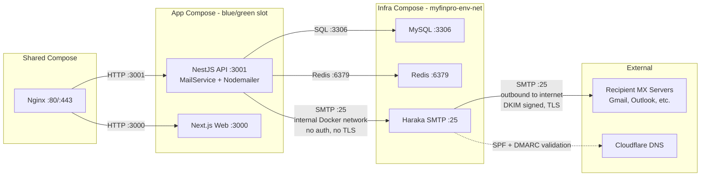
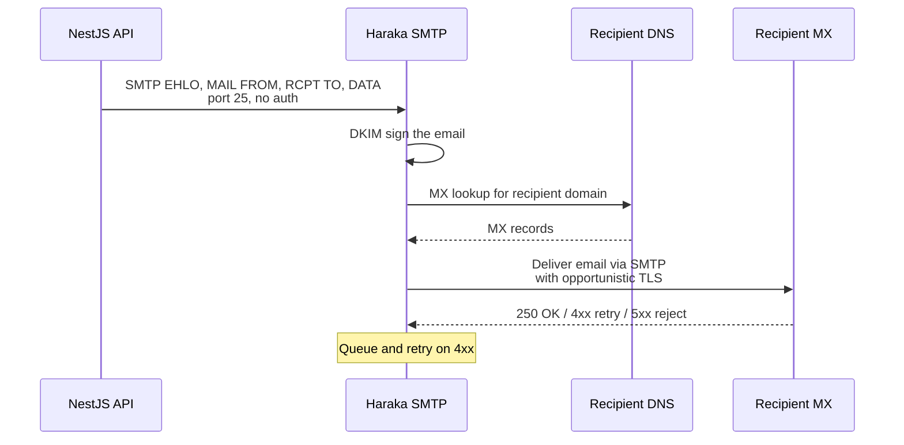

# Iteration 4.13: Haraka SMTP Infrastructure — Design Document

> **Purpose**: Detailed implementation plan for deploying a self-hosted Haraka SMTP server as a Docker container alongside the existing MyFinPro infrastructure. Haraka handles outbound email delivery for all transactional emails (verification, password reset, deletion notices) with DKIM signing, SPF/DMARC compliance.
>
> **Prerequisites**: Iterations 4.1–4.12 complete (Email service, all auth features, legal pages, tests).
>
> **Domain**: `<domain>`
> **Server IP**: `<ip>`
> **Staging**: `stage-myfin.<domain>`
> **Production**: `myfin.<domain>`

---

## Table of Contents

1. [Overview](#1-overview)
2. [Architecture Summary](#2-architecture-summary)
3. [Key Design Decisions](#3-key-design-decisions)
4. [Implementation Plan — Ordered Steps](#4-implementation-plan--ordered-steps)
5. [Haraka Configuration Files](#5-haraka-configuration-files)
6. [Docker Compose Changes](#6-docker-compose-changes)
7. [API Mail Service — No Code Changes Needed](#7-api-mail-service--no-code-changes-needed)
8. [Environment Variable Updates](#8-environment-variable-updates)
9. [DNS Records](#9-dns-records)
10. [Deploy Workflow Changes](#10-deploy-workflow-changes)
11. [Testing Strategy](#11-testing-strategy)
12. [Risk Assessment](#12-risk-assessment)
13. [File Changes Summary](#13-file-changes-summary)
14. [Acceptance Criteria](#14-acceptance-criteria)

---

## 1. Overview

### Why Self-Hosted SMTP

- **No third-party dependency** — full control over email delivery
- **Cost-effective** — no per-email fees (Resend, SendGrid, SES all charge per email)
- **Aligned with tech stack** — Haraka is Node.js-based, fits the project's philosophy
- **Privacy-first** — email content never leaves our infrastructure
- **DKIM signing** — Haraka signs all outbound emails, improving deliverability

### What Haraka Does

Haraka acts as a **local Mail Transfer Agent (MTA)**. The NestJS API submits emails to Haraka via plain SMTP on the internal Docker network. Haraka then:

1. Signs the email with DKIM
2. Looks up the recipient's MX records
3. Delivers the email directly to the recipient's mail server
4. Queues and retries if delivery temporarily fails

### Email Types Handled

| Email Type                    | Trigger                      | Template                           |
| ----------------------------- | ---------------------------- | ---------------------------------- |
| Email verification            | User registers with email    | `buildVerificationEmail()`         |
| Password reset                | User requests password reset | `buildPasswordResetEmail()`        |
| Account deletion confirmation | User deletes account         | `buildDeletionConfirmationEmail()` |
| Account deletion cancelled    | User cancels deletion        | `buildDeletionCancelledEmail()`    |

---

## 2. Architecture Summary

### How Haraka Fits Into the Existing Infrastructure

The project uses a **three-tier Docker Compose separation**:

| Tier           | Compose File                      | Contents                       | Network                        |
| -------------- | --------------------------------- | ------------------------------ | ------------------------------ |
| Infrastructure | `docker-compose.{env}.infra.yml`  | MySQL, Redis, **Haraka**       | `myfinpro-{env}-net` external  |
| Application    | `docker-compose.{env}.app.yml`    | API blue/green, Web blue/green | `myfinpro-{env}-net` external  |
| Shared         | `docker-compose.shared-nginx.yml` | Nginx reverse proxy            | Both staging + production nets |

**Haraka belongs in the Infrastructure tier** — it is a long-lived service, not part of blue/green deployment slots. Both blue and green API slots must reach the same Haraka instance.

### Network Topology



### Port Requirements

| Port           | Direction                   | Purpose                                                    | Exposed to Host?                                          |
| -------------- | --------------------------- | ---------------------------------------------------------- | --------------------------------------------------------- |
| 25 (container) | Internal: API → Haraka      | SMTP submission from Nodemailer                            | **No** — internal Docker network only                     |
| 25 (host)      | Outbound: Haraka → Internet | Delivering to recipient MX servers                         | **Yes** — already allowed by `ufw default allow outgoing` |
| 587            | N/A                         | Not used — internal SMTP submission does not need STARTTLS | No                                                        |

### Data Flow



---

## 3. Key Design Decisions

### Decision 1: Infrastructure Compose, Not App Compose

**Choice**: Place Haraka in `docker-compose.{env}.infra.yml`

**Rationale**:

- Haraka is a long-lived service like MySQL and Redis — it should NOT restart during blue/green API deployments
- Both blue and green API slots need to reach the same Haraka instance
- Infrastructure services are managed separately from application deploys
- The infra compose services are on the `myfinpro-{env}-net` external network, which app compose also uses, so API containers can resolve `haraka:25` by Docker DNS

### Decision 2: No TLS Between API and Haraka

**Choice**: Plain SMTP on internal Docker network, TLS only for outbound delivery

**Rationale**:

- API → Haraka communication is internal Docker network — no TLS or authentication needed
- No need to share Let's Encrypt/Cloudflare origin certs with Haraka
- Haraka → recipient MX uses opportunistic TLS (Haraka's outbound plugin enables this by default)
- This matches the existing pattern: MySQL and Redis also have no encryption on internal network

### Decision 3: DKIM — 2048-bit RSA, Selector `mail`

| Parameter           | Value                                         |
| ------------------- | --------------------------------------------- |
| Algorithm           | RSA                                           |
| Key size            | 2048-bit                                      |
| Selector            | `mail`                                        |
| DNS record          | `mail._domainkey.<domain>`                    |
| Private key storage | Volume-mounted from host, NOT in git          |
| Deployment method   | GitHub Secret → written to disk during deploy |

**Why 2048-bit**: Industry standard. 1024-bit is considered weak. 4096-bit causes TXT record issues with some DNS providers.

**Why selector `mail`**: Simple, descriptive. Can be rotated later by adding a new selector (e.g., `mail2`) without breaking the old one.

### Decision 4: Rate Limiting in Haraka

**Choice**: Conservative rate limits during warm-up phase

```ini
concurrency_max=5      ; Max concurrent outbound connections
max_unconfirmed=5      ; Max unconfirmed emails per connection
```

The API already has rate limiting on email endpoints:

- Verification: 3 per 10 minutes per user
- Password reset: 3 per 10 minutes per IP
- Account deletion: 1 per request (authenticated)

### Decision 5: Logging — Docker JSON File Driver

**Choice**: Use Docker's `json-file` logging driver, same as all other infrastructure services

```yaml
logging:
  driver: json-file
  options:
    max-size: '10m'
    max-file: '5'
```

Logs viewable via `docker logs myfinpro-{env}-haraka`. Haraka's `syslog` plugin writes to stdout in Docker.

### Decision 6: DKIM Private Key Deployment

**Choice**: Store as GitHub Secret, deploy to disk during CI/CD

**Rationale**: The project follows a "no secrets on disk" philosophy (see `docs/server-setup-guide.md` Part 10), but DKIM is an exception — Haraka reads the private key from a file at startup. The key is:

1. Generated once locally
2. Stored as GitHub Secret `DKIM_PRIVATE_KEY`
3. Written to disk on the server during deploy workflow
4. Volume-mounted into the Haraka container as read-only

---

## 4. Implementation Plan — Ordered Steps

### Step 1: Verify Port 25 Outbound Access ⚠️ BLOCKER

Before any implementation, verify the hosting provider does not block outbound port 25:

```bash
ssh -i ~/.ssh/<server> <connect>
nc -zv gmail-smtp-in.l.google.com 25 -w 5
```

**If blocked**: See Risk Assessment — pivot to relay approach or contact provider.

### Step 2: Request PTR Record from Hosting Provider

Contact the hosting provider to set reverse DNS for `<ip>` → `mail.<domain>`.

This can run in parallel with other steps but must be done before production email delivery.

### Step 3: Generate DKIM Keys

```bash
mkdir -p infrastructure/haraka/dkim-keys/<domain>
openssl genrsa -out infrastructure/haraka/dkim-keys/<domain>/private 2048
openssl rsa -in infrastructure/haraka/dkim-keys/<domain>/private \
  -pubout -out infrastructure/haraka/dkim-keys/<domain>/public
echo "mail" > infrastructure/haraka/dkim-keys/<domain>/selector
```

**Do NOT commit** the private key. Add to `.gitignore`:

```
infrastructure/haraka/dkim-keys/<domain>/private
```

Extract public key for DNS:

```bash
grep -v '^-' infrastructure/haraka/dkim-keys/<domain>/public | tr -d '\n'
```

Store the private key as GitHub Secret `DKIM_PRIVATE_KEY`.

### Step 4: Create Haraka Configuration Files

See Section 5 for all config file contents.

### Step 5: Create Haraka Dockerfile

See Section 5 for Dockerfile contents.

### Step 6: Modify Infrastructure Compose Files

See Section 6 for exact changes to `docker-compose.staging.infra.yml` and `docker-compose.production.infra.yml`.

### Step 7: Modify App Compose Files

See Section 6 for SMTP environment variable additions to `docker-compose.staging.app.yml` and `docker-compose.production.app.yml`.

### Step 8: Update Environment Templates

See Section 8 for changes to `.env.staging.template`, `.env.production.template`, and `apps/api/.env.example`.

### Step 9: Configure DNS Records in Cloudflare

See Section 9 for exact DNS TXT records.

### Step 10: Add GitHub Secrets

See Section 8 for the list of secrets to add.

### Step 11: Update Deploy Workflows

See Section 10 for changes to staging and production deploy workflows.

### Step 12: Deploy to Staging and Test

1. Deploy infrastructure compose with Haraka to staging
2. Verify Haraka container health: `docker logs myfinpro-staging-haraka`
3. From API container, test SMTP connectivity: `docker exec myfinpro-staging-api-blue sh -c "echo 'test' | nc haraka 25"`
4. Trigger a verification email from the app
5. Check recipient inbox for DKIM/SPF pass in email headers
6. Run mail-tester.com score check (target: 9/10+)

### Step 13: Deploy to Production

Repeat Step 12 validation for production after staging is confirmed working.

### Step 14: Update Documentation

Update `docs/server-setup-guide.md`, `docs/progress.md`, and env templates.

---

## 5. Haraka Configuration Files

### Directory Structure

```
infrastructure/haraka/
├── Dockerfile
├── .gitignore
├── config/
│   ├── smtp.ini
│   ├── host_list
│   ├── plugins
│   ├── dkim_sign.ini
│   ├── outbound.ini
│   ├── log.ini
│   └── me
└── dkim-keys/          # Volume-mounted at runtime, NOT in git
    └── <domain>/
        ├── private     # DKIM private key (from GitHub Secret)
        ├── public      # DKIM public key (for DNS record)
        └── selector    # Contains "mail"
```

### `infrastructure/haraka/Dockerfile`

```dockerfile
FROM node:24-alpine

# Install Haraka globally
RUN npm install -g Haraka@<latest version>

# Create Haraka instance directory
RUN haraka -i /opt/haraka

# Copy configuration files (overwrite defaults)
COPY config/ /opt/haraka/config/

WORKDIR /opt/haraka

EXPOSE 25

CMD ["haraka", "-c", "/opt/haraka"]
```

### `infrastructure/haraka/.gitignore`

```
# DKIM private keys — deployed via GitHub Secrets, never committed
dkim-keys/*/private
```

### `infrastructure/haraka/config/smtp.ini`

```ini
; Haraka SMTP server configuration
; Bind to all interfaces on port 25
listen=0.0.0.0:25

; Single process (sufficient for our volume)
nodes=1

; Run in foreground (required for Docker)
daemonize=false

; Hostname for SMTP EHLO/HELO
;   Overridden by 'me' file if present
```

### `infrastructure/haraka/config/me`

```
mail.<domain>
```

This sets the hostname Haraka uses in SMTP EHLO/HELO greetings. Must match the PTR record.

### `infrastructure/haraka/config/host_list`

```
<domain>
```

Domains that Haraka is authorized to send email for. Only our domain.

### `infrastructure/haraka/config/plugins`

```
# ── Logging ──
# syslog writes to stdout, captured by Docker
syslog

# ── DKIM Signing ──
# Sign all outbound emails with DKIM
dkim_sign

# ── Outbound Delivery ──
# Queue and deliver to recipient MX servers
queue/outbound
```

### `infrastructure/haraka/config/dkim_sign.ini`

```ini
; DKIM signing configuration
disabled=false
selector=mail
domain=<domain>

; Headers to include in DKIM signature
headers_to_sign=from:to:subject:date:message-id:content-type:mime-version:reply-to

; Key directory — DKIM keys are mounted at runtime
; Expected path: /opt/haraka/config/dkim/<domain>/private
```

### `infrastructure/haraka/config/outbound.ini`

```ini
; Outbound delivery configuration

; Maximum concurrent outbound SMTP connections
; Keep low during IP warm-up period
concurrency_max=5

; Enable opportunistic TLS when delivering to recipient MX
enable_tls=true

; Disable IPv6 delivery (most VPS providers only have IPv4)
ipv6_enabled=false

; Bounce handling — how long to retry delivery
; Default: 2 days (172800 seconds)
; After this, generate a bounce notification
maxTempFailures=13

; Connection timeout to recipient MX (seconds)
connect_timeout=30
```

### `infrastructure/haraka/config/log.ini`

```ini
; Logging configuration
; In Docker, logs go to stdout via syslog plugin
level=info
```

---

## 6. Docker Compose Changes

### `docker-compose.staging.infra.yml` — Add Haraka Service

Add after the Redis service:

```yaml
# ───── Haraka SMTP Server ─────
haraka:
  build:
    context: ./infrastructure/haraka
    dockerfile: Dockerfile
  container_name: myfinpro-staging-haraka
  restart: unless-stopped
  hostname: mail.<domain>
  volumes:
    - ./infrastructure/haraka/config:/opt/haraka/config:ro
    - ./infrastructure/haraka/dkim-keys:/opt/haraka/config/dkim:ro
    - myfinpro-staging-haraka-queue:/opt/haraka/queue
  networks:
    - myfinpro-staging-net
  healthcheck:
    test: ['CMD', 'nc', '-z', 'localhost', '25']
    interval: 30s
    timeout: 5s
    retries: 3
    start_period: 10s
```

Add to the `volumes:` section:

```yaml
myfinpro-staging-haraka-queue:
  name: myfinpro-staging-haraka-queue
  driver: local
```

### `docker-compose.production.infra.yml` — Add Haraka Service

Add after the Redis service:

```yaml
# ───── Haraka SMTP Server ─────
haraka:
  build:
    context: ./infrastructure/haraka
    dockerfile: Dockerfile
  container_name: myfinpro-prod-haraka
  restart: unless-stopped
  hostname: mail.<domain>
  volumes:
    - ./infrastructure/haraka/config:/opt/haraka/config:ro
    - ./infrastructure/haraka/dkim-keys:/opt/haraka/config/dkim:ro
    - myfinpro-production-haraka-queue:/opt/haraka/queue
  networks:
    - myfinpro-production-net
  healthcheck:
    test: ['CMD', 'nc', '-z', 'localhost', '25']
    interval: 30s
    timeout: 5s
    retries: 3
    start_period: 10s
  deploy:
    resources:
      limits:
        memory: 256M
        cpus: '0.5'
      reservations:
        memory: 128M
  logging:
    driver: json-file
    options:
      max-size: '10m'
      max-file: '5'
```

Add to the `volumes:` section:

```yaml
myfinpro-production-haraka-queue:
  name: myfinpro-production-haraka-queue
  driver: local
```

### `docker-compose.staging.app.yml` — Add SMTP Env Vars

Add to the `api` service `environment:` section:

```yaml
SMTP_HOST: ${SMTP_HOST:-haraka}
SMTP_PORT: ${SMTP_PORT:-25}
SMTP_SECURE: ${SMTP_SECURE:-false}
SMTP_USER: ${SMTP_USER:-}
SMTP_PASS: ${SMTP_PASS:-}
SMTP_FROM: ${SMTP_FROM:-MyFinPro <noreply@<domain>>}
```

### `docker-compose.production.app.yml` — Add SMTP Env Vars

Same additions as staging, to the `api` service `environment:` section:

```yaml
SMTP_HOST: ${SMTP_HOST:-haraka}
SMTP_PORT: ${SMTP_PORT:-25}
SMTP_SECURE: ${SMTP_SECURE:-false}
SMTP_USER: ${SMTP_USER:-}
SMTP_PASS: ${SMTP_PASS:-}
SMTP_FROM: ${SMTP_FROM:-MyFinPro <noreply@<domain>>}
```

### Standalone Compose Files (Non-Blue/Green)

Also update `docker-compose.staging.yml` and `docker-compose.production.yml` with the same Haraka service and SMTP env vars, for use in non-blue/green deployment mode.

---

## 7. API Mail Service — No Code Changes Needed

The existing `apps/api/src/mail/mail.service.ts` already handles Haraka integration correctly:

```typescript
// Lines 22-38 — Constructor reads SMTP_HOST from env
if (!smtpHost) {
  // Console fallback when SMTP not configured
  this.useConsole = true;
} else {
  this.transporter = nodemailer.createTransport({
    host: smtpHost, // → 'haraka' (Docker service name)
    port: SMTP_PORT, // → 25
    secure: SMTP_SECURE, // → false (no TLS on internal network)
    auth: {
      user: SMTP_USER, // → '' (no auth needed)
      pass: SMTP_PASS, // → '' (no auth needed)
    },
  });
}
```

When `SMTP_HOST=haraka` is set:

- Nodemailer connects to `haraka:25` via internal Docker DNS
- No authentication (empty user/pass)
- No TLS (`secure: false`)
- Error handling already catches failures and logs them (lines 57-62)
- Console fallback still works when Haraka is unavailable

**One consideration**: Nodemailer may log warnings about empty auth credentials. If this is noisy, a minor change to omit the `auth` block when both user and pass are empty would be beneficial:

```typescript
// Optional improvement (not required):
const transportConfig: any = {
  host: smtpHost,
  port: this.configService.get<number>('SMTP_PORT', 25),
  secure: this.configService.get<string>('SMTP_SECURE', 'false') === 'true',
};

const smtpUser = this.configService.get<string>('SMTP_USER', '');
const smtpPass = this.configService.get<string>('SMTP_PASS', '');
if (smtpUser && smtpPass) {
  transportConfig.auth = { user: smtpUser, pass: smtpPass };
}

this.transporter = nodemailer.createTransport(transportConfig);
```

---

## 8. Environment Variable Updates

### `apps/api/.env.example` — Update SMTP Section

```env
# ── SMTP / Email ──
# For production: Haraka self-hosted SMTP (Docker service name)
# For development: leave SMTP_HOST empty for console fallback
SMTP_HOST=
SMTP_PORT=25
SMTP_SECURE=false
SMTP_USER=
SMTP_PASS=
SMTP_FROM="MyFinPro <noreply@<domain>>"
```

### `.env.staging.template` — Update SMTP Section

```
# ── SMTP / Email (Haraka self-hosted) ──
# SMTP_HOST              — 'haraka' (internal Docker service name)
# SMTP_PORT              — 25 (internal SMTP, no STARTTLS)
# SMTP_SECURE            — false (internal network, no TLS needed)
# SMTP_USER              — Empty (no auth for internal relay)
# SMTP_PASS              — Empty
# SMTP_FROM              — "MyFinPro <noreply@<domain>>"
```

### `.env.production.template` — Update SMTP Section

Same as staging template.

### GitHub Secrets to Add

| Secret                 | Value                                                          | Notes               |
| ---------------------- | -------------------------------------------------------------- | ------------------- |
| `STAGING_SMTP_HOST`    | `haraka`                                                       | Docker service name |
| `STAGING_SMTP_PORT`    | `25`                                                           | Internal SMTP port  |
| `STAGING_SMTP_FROM`    | `MyFinPro <noreply@<domain>>`                                  | From address        |
| `PRODUCTION_SMTP_HOST` | `haraka`                                                       | Docker service name |
| `PRODUCTION_SMTP_PORT` | `25`                                                           | Internal SMTP port  |
| `PRODUCTION_SMTP_FROM` | `MyFinPro <noreply@<domain>>`                                  | From address        |
| `DKIM_PRIVATE_KEY`     | Contents of `infrastructure/haraka/dkim-keys/<domain>/private` | RSA private key PEM |

---

## 9. DNS Records

All records configured in **Cloudflare DNS** for the `<domain>` domain.

### 9.1 Mail Server A Record

| Type | Name   | Value  | Proxy                        | TTL  |
| ---- | ------ | ------ | ---------------------------- | ---- |
| A    | `mail` | `<ip>` | **DNS only** (gray cloud ☁️) | Auto |

Creates `mail.<domain>` → `<ip>` **without Cloudflare proxy**. SMTP traffic cannot be proxied through Cloudflare.

### 9.2 MX Record

| Type | Name | Value           | Priority | TTL  |
| ---- | ---- | --------------- | -------- | ---- |
| MX   | `@`  | `mail.<domain>` | 10       | Auto |

Not strictly required for send-only, but some receiving servers verify that the sending domain has an MX record.

### 9.3 SPF Record

| Type | Name | Value                  |
| ---- | ---- | ---------------------- |
| TXT  | `@`  | `v=spf1 ip4:<ip> -all` |

**Meaning**: Only the server at `<ip>` is authorized to send email for `<domain>`. All other sources should be rejected.

> ⚠️ **Important**: Check if an SPF record already exists for `<domain>`. Only ONE SPF record per domain is allowed. If one exists, merge `ip4:<ip>` into it.

### 9.4 DKIM Record

First, extract the public key:

```bash
grep -v '^-' infrastructure/haraka/dkim-keys/<domain>/public | tr -d '\n'
```

| Type | Name              | Value                                   |
| ---- | ----------------- | --------------------------------------- |
| TXT  | `mail._domainkey` | `v=DKIM1; k=rsa; p=<PUBLIC_KEY_BASE64>` |

**Example** (with placeholder for the actual key):

```
v=DKIM1; k=rsa; p=MIIBIjANBgkqhkiG9w0BAQEFAAOCAQ8AMIIBCgKCAQEA...IDAQAB
```

> **Note**: Cloudflare TXT records support up to 2048 characters per chunk. A 2048-bit RSA public key fits within this limit.

**Verification**:

```bash
dig TXT mail._domainkey.<domain> +short
```

### 9.5 DMARC Record

| Type | Name     | Value                                                                         |
| ---- | -------- | ----------------------------------------------------------------------------- |
| TXT  | `_dmarc` | `v=DMARC1; p=quarantine; rua=mailto:dmarc@<domain>; pct=100; adkim=s; aspf=s` |

**Breakdown**:

- `p=quarantine` — emails failing DMARC go to spam (start here; upgrade to `p=reject` after warm-up)
- `rua=mailto:dmarc@<domain>` — aggregate DMARC reports
- `pct=100` — apply to 100% of messages
- `adkim=s` — strict DKIM alignment (From domain must exactly match DKIM domain)
- `aspf=s` — strict SPF alignment (envelope sender must match From domain)

### 9.6 PTR Record (Reverse DNS)

| IP     | PTR Value       |
| ------ | --------------- |
| `<ip>` | `mail.<domain>` |

> ⚠️ **This is configured at the hosting provider level**, NOT in Cloudflare. Contact the VPS provider to set the reverse DNS PTR record.

### DNS Records Summary Table

```
; Cloudflare DNS Zone: <domain>
;
; A record — mail server (DNS only, no proxy)
mail              A       <ip>

; MX record — mail exchange
@                 MX  10  mail.<domain>.

; SPF record — authorized senders
@                 TXT     "v=spf1 ip4:<ip> -all"

; DKIM record — public key for signature verification
mail._domainkey   TXT     "v=DKIM1; k=rsa; p=<PUBLIC_KEY>"

; DMARC record — policy for failed authentication
_dmarc            TXT     "v=DMARC1; p=quarantine; rua=mailto:dmarc@<domain>; pct=100; adkim=s; aspf=s"
```

---

## 10. Deploy Workflow Changes

### Changes to `.github/workflows/deploy-staging.yml`

Add to the SSH deploy step:

1. **Export SMTP environment variables**:

```bash
export SMTP_HOST="${{ secrets.STAGING_SMTP_HOST }}"
export SMTP_PORT="${{ secrets.STAGING_SMTP_PORT }}"
export SMTP_FROM="${{ secrets.STAGING_SMTP_FROM }}"
```

2. **Deploy DKIM private key** (only if not already present):

```bash
mkdir -p /opt/myfinpro/staging/infrastructure/haraka/dkim-keys/<domain>
if [ ! -f /opt/myfinpro/staging/infrastructure/haraka/dkim-keys/<domain>/private ]; then
  echo "${{ secrets.DKIM_PRIVATE_KEY }}" > /opt/myfinpro/staging/infrastructure/haraka/dkim-keys/<domain>/private
  chmod 600 /opt/myfinpro/staging/infrastructure/haraka/dkim-keys/<domain>/private
fi
echo "mail" > /opt/myfinpro/staging/infrastructure/haraka/dkim-keys/<domain>/selector
```

3. **Copy Haraka config files** (add to SCP step):

```bash
scp -r infrastructure/haraka/ <server>:/opt/myfinpro/staging/infrastructure/
```

4. **Build Haraka container as part of infra compose**:

```bash
docker compose -p myfinpro-staging-infra -f docker-compose.staging.infra.yml build haraka
docker compose -p myfinpro-staging-infra -f docker-compose.staging.infra.yml up -d haraka
```

### Changes to `.github/workflows/deploy-production.yml`

Same pattern as staging, with `PRODUCTION_*` secret prefix and `/opt/myfinpro/production/` paths.

---

## 11. Testing Strategy

### Pre-Deployment Checks

| Check            | Command                                     | Expected Result               |
| ---------------- | ------------------------------------------- | ----------------------------- |
| Port 25 outbound | `nc -zv gmail-smtp-in.l.google.com 25 -w 5` | Connection succeeded          |
| DNS SPF record   | `dig TXT <domain> +short`                   | `v=spf1 ip4:<ip> -all`        |
| DNS DKIM record  | `dig TXT mail._domainkey.<domain> +short`   | `v=DKIM1; k=rsa; p=...`       |
| DNS DMARC record | `dig TXT _dmarc.<domain> +short`            | `v=DMARC1; p=quarantine; ...` |
| PTR record       | `dig -x <ip> +short`                        | `mail.<domain>.`              |

### Post-Deployment Checks

| Check                      | Command                                                                   | Expected Result           |
| -------------------------- | ------------------------------------------------------------------------- | ------------------------- |
| Haraka container health    | `docker ps \| grep haraka`                                                | Status: healthy           |
| Haraka logs                | `docker logs myfinpro-staging-haraka`                                     | No errors, SMTP listening |
| SMTP connectivity from API | `docker exec myfinpro-staging-api-blue sh -c "echo QUIT \| nc haraka 25"` | 220 mail.<domain> ESMTP   |
| Send test email            | Trigger verification email from app                                       | Email received            |
| DKIM header                | Check email source headers                                                | `dkim=pass`               |
| SPF header                 | Check email source headers                                                | `spf=pass`                |
| DMARC header               | Check email source headers                                                | `dmarc=pass`              |

### External Validation Tools

| Tool              | URL                            | Target Score     |
| ----------------- | ------------------------------ | ---------------- |
| Mail Tester       | `mail-tester.com`              | 9/10 or higher   |
| MX Toolbox        | `mxtoolbox.com/SuperTool.aspx` | All green checks |
| DKIM Validator    | `dkimvalidator.com`            | Valid signature  |
| Google Postmaster | `postmaster.google.com`        | No issues        |

### Staging Test Plan

1. Deploy Haraka to staging
2. Register a new test user with a real email address
3. Check inbox for verification email
4. Inspect email headers for SPF/DKIM/DMARC pass
5. Forward the email to `check@mail-tester.com` for scoring
6. Trigger password reset flow, check delivery
7. Trigger account deletion flow, check delivery
8. Test console fallback: stop Haraka, verify API logs emails to console

---

## 12. Risk Assessment

### Risk 1: Port 25 Blocked by Hosting Provider 🔴 HIGH PRIORITY

**Problem**: Many hosting providers block outbound port 25 to prevent spam.

**Detection**: `nc -zv gmail-smtp-in.l.google.com 25 -w 5` from the server.

**Mitigation Options**:

- **Option A**: Contact hosting provider to unblock port 25 (may require justification — "transactional email for a personal finance app, low volume")
- **Option B**: Configure Haraka to relay through a smarthost (e.g., Mailgun, SendGrid SMTP relay) — still get DKIM signing from Haraka
- **Option C**: Use alternate outbound port if provider supports it
- **Option D**: Skip Haraka entirely and use a third-party SMTP service directly from Nodemailer

**This must be verified BEFORE any implementation work begins.**

### Risk 2: IP Reputation — New Sender 🟡 MEDIUM

**Problem**: `<ip>` has no email sending history. Major providers may treat emails as suspicious.

**Mitigation**:

- Ensure SPF, DKIM, DMARC are all correctly configured before any emails are sent
- Start by sending to your own test addresses only
- Keep volume low initially (< 50 emails/day during warm-up)
- Check IP against blocklists: `mxtoolbox.com/blacklists.aspx`
- Register at `postmaster.google.com` for Gmail monitoring
- Include `List-Unsubscribe` header in future (not critical for transactional emails)

### Risk 3: Cloudflare Proxy vs. SMTP Traffic 🟡 MEDIUM

**Problem**: Cloudflare proxies HTTP/HTTPS only, NOT SMTP. MX records and SPF references must use the raw server IP.

**Mitigation**:

- The A record for `mail.<domain>` must be **DNS only** (gray cloud, not proxied)
- The A records for `stage-myfin.<domain>` and `myfin.<domain>` can remain proxied (they serve web traffic)
- SPF record directly references `ip4:<ip>` — no Cloudflare dependency

### Risk 4: Reverse DNS / PTR Record Missing 🟡 MEDIUM

**Problem**: Many receiving mail servers check that the sending IP has a PTR record matching the EHLO hostname. Without it, emails may be rejected or spam-foldered.

**Mitigation**: Request PTR for `<ip>` → `mail.<domain>` from hosting provider. This is typically free and configured in the VPS control panel.

### Risk 5: Haraka Container Down 🟢 LOW

**Problem**: If Haraka crashes, emails fail to send.

**Mitigation**:

- `restart: unless-stopped` ensures Docker restarts Haraka automatically
- Health check detects failures within 30 seconds
- The API's `MailService` catches all errors and logs them — the app does NOT crash
- All email operations are fire-and-forget except password reset (which shows a generic message anyway)
- Console fallback activates if `SMTP_HOST` is cleared

### Risk 6: Email Queue Persistence 🟢 LOW

**Problem**: If Haraka restarts while emails are queued for retry, the queue could be lost.

**Mitigation**: The Haraka queue is stored in a named Docker volume (`myfinpro-{env}-haraka-queue`), which persists across container restarts.

---

## 13. File Changes Summary

### New Files

| File                                                | Purpose                                        |
| --------------------------------------------------- | ---------------------------------------------- |
| `infrastructure/haraka/Dockerfile`                  | Custom Haraka Docker image                     |
| `infrastructure/haraka/.gitignore`                  | Ignore DKIM private keys                       |
| `infrastructure/haraka/config/smtp.ini`             | SMTP server config — bind 0.0.0.0:25           |
| `infrastructure/haraka/config/me`                   | Hostname for EHLO — mail.<domain>              |
| `infrastructure/haraka/config/host_list`            | Allowed sender domain: <domain>                |
| `infrastructure/haraka/config/plugins`              | Plugin list: syslog, dkim_sign, queue/outbound |
| `infrastructure/haraka/config/dkim_sign.ini`        | DKIM signing config — selector=mail            |
| `infrastructure/haraka/config/outbound.ini`         | Outbound delivery settings                     |
| `infrastructure/haraka/config/log.ini`              | Logging level config                           |
| `infrastructure/haraka/dkim-keys/<domain>/selector` | Contains "mail"                                |
| `infrastructure/haraka/dkim-keys/<domain>/private`  | ⚠️ NOT committed — deployed via GitHub Secret  |
| `infrastructure/haraka/dkim-keys/<domain>/public`   | Public key for DNS record                      |

### Modified Files

| File                                      | Change                                                    |
| ----------------------------------------- | --------------------------------------------------------- |
| `docker-compose.staging.infra.yml`        | Add `haraka` service + queue volume                       |
| `docker-compose.production.infra.yml`     | Add `haraka` service + queue volume + resource limits     |
| `docker-compose.staging.app.yml`          | Add SMTP\_\* env vars to API service                      |
| `docker-compose.production.app.yml`       | Add SMTP\_\* env vars to API service                      |
| `docker-compose.staging.yml`              | Add haraka service + SMTP env vars (non-blue/green)       |
| `docker-compose.production.yml`           | Add haraka service + SMTP env vars (non-blue/green)       |
| `.github/workflows/deploy-staging.yml`    | Export SMTP env vars, deploy DKIM key, copy Haraka config |
| `.github/workflows/deploy-production.yml` | Export SMTP env vars, deploy DKIM key, copy Haraka config |
| `.env.staging.template`                   | Update SMTP section for Haraka                            |
| `.env.production.template`                | Update SMTP section for Haraka                            |
| `apps/api/.env.example`                   | Update SMTP defaults for Haraka                           |
| `docs/server-setup-guide.md`              | Add PTR record instructions, Haraka section               |
| `docs/progress.md`                        | Mark iteration 4.13 as complete                           |

### Unchanged Files

| File                                | Reason                                                                   |
| ----------------------------------- | ------------------------------------------------------------------------ |
| `apps/api/src/mail/mail.service.ts` | Already handles SMTP_HOST env var, no-auth, and error fallback correctly |
| `infrastructure/nginx/*`            | Nginx does not proxy SMTP traffic                                        |

---

## 14. Acceptance Criteria

- [ ] Haraka container running and healthy in both staging and production
- [ ] API MailService connects to Haraka via internal Docker network (SMTP_HOST=haraka, port 25)
- [ ] Verification emails delivered to real inboxes
- [ ] Password reset emails delivered to real inboxes
- [ ] DKIM signatures verified — `dkim=pass` in email headers
- [ ] SPF passes — `spf=pass` in email headers
- [ ] DMARC passes — `dmarc=pass` in email headers
- [ ] SPF, DKIM, DMARC DNS records configured in Cloudflare
- [ ] PTR record set for `<ip>` → `mail.<domain>`
- [ ] Console fallback still works when Haraka is not available
- [ ] mail-tester.com score of 9/10 or higher
- [ ] Haraka queue persists across container restarts (Docker volume)
- [ ] DKIM private key not committed to git
- [ ] Deploy workflows updated to provision DKIM key and Haraka config
