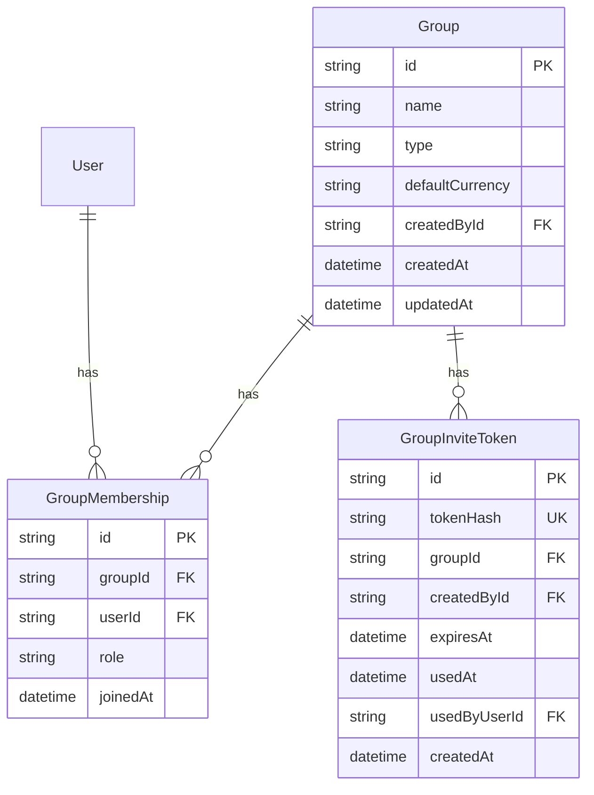

# Phase 5: Group Management & Password Change — Design Document

## Table of Contents

- [Overview](#overview)
- [Scope Changes from Original Plan](#scope-changes-from-original-plan)
- [Architecture](#architecture)
- [Database Schema](#database-schema)
- [API Endpoints](#api-endpoints)
- [Frontend Pages and Components](#frontend-pages-and-components)
- [Shared Package Extensions](#shared-package-extensions)
- [Iteration Plan](#iteration-plan)
- [Testing Strategy](#testing-strategy)
- [Extendability Notes](#extendability-notes)

---

## Overview

Phase 5 implements **Group Management** — the core multi-user collaboration feature of MyFinPro. Groups are the scalable entity that represents any collection of users sharing financial data. The initial type is `family`, but the architecture supports future types like `team`, `project`, `company`, etc.

Additionally, Phase 5 adds **Password Change** — the ability for authenticated users to change their password with current password validation.

**Dependencies**: Phase 4 (Auth Completion & Legal Pages) is fully complete.

---

## Scope Changes from Original Plan

The original `IMPLEMENTATION-PLAN.md` defined Phase 5 with two sub-sections:

- **5A**: Group Management (5.1–5.8)
- **5B**: User Profile Management (5.9–5.14)

After analysis, several 5B items are already implemented in Phase 4:

| Iteration | Original Description  | Status                                 | Decision                                                              |
| --------- | --------------------- | -------------------------------------- | --------------------------------------------------------------------- |
| 5.9       | Profile view          | Already done in Phase 4.7              | **Skip**                                                              |
| 5.10      | Profile edit          | Already done in Phase 4.7.2            | **Skip** — name editing will be added as a small enhancement          |
| 5.11      | Password change       | Not yet implemented                    | **Implement**                                                         |
| 5.12      | GDPR cascade deletion | Soft/hard delete done in Phase 4.6–4.8 | **Skip** — cascade for groups will be handled in group deletion logic |
| 5.13      | Data export           | No meaningful data to export yet       | **Defer** to post-Phase 6                                             |
| 5.14      | Export UI             | Depends on 5.13                        | **Defer** to post-Phase 6                                             |

**Effective Phase 5 scope**: 5A (5.1–5.8) + 5.11 = **9 iterations**

---

## Architecture

### Module Structure

A new `GroupModule` will be created alongside the existing `AuthModule`:

```
apps/api/src/
  group/
    group.module.ts
    group.controller.ts
    group.service.ts
    dto/
      create-group.dto.ts
      update-group.dto.ts
      invite-member.dto.ts
    guards/
      group-member.guard.ts
      group-admin.guard.ts
    constants/
      group-errors.ts
      group-roles.ts
```

### Frontend Structure

```
apps/web/src/
  app/[locale]/
    groups/
      page.tsx                      # Group list / create
      [groupId]/
        page.tsx                    # Group dashboard
        settings/
          page.tsx                  # Group settings (admin only)
        invite/
          page.tsx                  # Accept invite page
  components/
    group/
      CreateGroupDialog.tsx
      GroupCard.tsx
      MemberList.tsx
      InviteLink.tsx
  lib/
    group/
      group-context.tsx             # Group state management
      types.ts                      # Group-related types
```

### Key Design Principles

1. **Groups are scalable entities** — `type` field supports `family` now, extensible to `team`, `project`, `company`, or any other type later
2. **Explicit many-to-many** — `GroupMembership` join table with extra fields (role, joinedAt)
3. **Role-based access** — `admin` and `member` roles with guard-based enforcement
4. **Consistent settings pattern** — Group settings page mirrors user account settings page design
5. **Token-based invites** — Simple shareable link (UUID token, SHA-256 hashed in DB)
6. **Expand-only migrations** — Safe for blue-green deployment

---

## Database Schema

### New Models



### Prisma Schema Addition

```prisma
// -- Phase 5: Group Management --

model Group {
  id              String   @id @default(uuid()) @db.VarChar(36)
  name            String   @db.VarChar(100)
  type            String   @default("family") @db.VarChar(50)
  defaultCurrency String   @default("USD") @map("default_currency") @db.VarChar(3)
  createdById     String   @map("created_by_id") @db.VarChar(36)
  createdAt       DateTime @default(now()) @map("created_at")
  updatedAt       DateTime @updatedAt @map("updated_at")

  memberships  GroupMembership[]
  inviteTokens GroupInviteToken[]

  @@index([createdById])
  @@map("groups")
}

model GroupMembership {
  id       String   @id @default(uuid()) @db.VarChar(36)
  groupId  String   @map("group_id") @db.VarChar(36)
  group    Group    @relation(fields: [groupId], references: [id], onDelete: Cascade)
  userId   String   @map("user_id") @db.VarChar(36)
  user     User     @relation(fields: [userId], references: [id], onDelete: Cascade)
  role     String   @default("member") @db.VarChar(20)
  joinedAt DateTime @default(now()) @map("joined_at")

  @@unique([groupId, userId])
  @@index([userId])
  @@index([groupId])
  @@map("group_memberships")
}

model GroupInviteToken {
  id           String    @id @default(uuid()) @db.VarChar(36)
  tokenHash    String    @unique @map("token_hash") @db.VarChar(255)
  groupId      String    @map("group_id") @db.VarChar(36)
  group        Group     @relation(fields: [groupId], references: [id], onDelete: Cascade)
  createdById  String    @map("created_by_id") @db.VarChar(36)
  expiresAt    DateTime  @map("expires_at")
  usedAt       DateTime? @map("used_at")
  usedByUserId String?   @map("used_by_user_id") @db.VarChar(36)
  createdAt    DateTime  @default(now()) @map("created_at")

  @@index([groupId])
  @@index([expiresAt])
  @@map("group_invite_tokens")
}
```

### User Model Extension

Add relations to the `User` model:

```prisma
model User {
  // ... existing fields ...
  groupMemberships GroupMembership[]
}
```

### Design Decisions

- **No foreign key from Group.createdById to User** — Avoids circular relation complexity. The creator is tracked via GroupMembership with role=admin.
- **Cascade delete on GroupMembership** — When a group is deleted, all memberships are removed. When a user is deleted, their memberships are removed.
- **GroupInviteToken follows the same pattern as EmailVerificationToken** — UUID v4 plaintext token, SHA-256 hash stored in DB, single-use, time-limited (7 days).
- **role as String not Enum** — MySQL does not have native enums in Prisma; using a String with application-level validation (`admin` | `member`) is more flexible for future roles.

---

## API Endpoints

### Group CRUD

| Method   | Endpoint      | Auth         | Description                                  |
| -------- | ------------- | ------------ | -------------------------------------------- |
| `POST`   | `/groups`     | JWT          | Create a new group                           |
| `GET`    | `/groups`     | JWT          | List user groups                             |
| `GET`    | `/groups/:id` | JWT + Member | Get group details with members               |
| `PATCH`  | `/groups/:id` | JWT + Admin  | Update group settings (name, type, currency) |
| `DELETE` | `/groups/:id` | JWT + Admin  | Delete group                                 |

### Invite Management

| Method | Endpoint                       | Auth        | Description                              |
| ------ | ------------------------------ | ----------- | ---------------------------------------- |
| `POST` | `/groups/:id/invites`          | JWT + Admin | Generate invite link                     |
| `GET`  | `/groups/invite/:token`        | JWT         | Get invite details (group name, inviter) |
| `POST` | `/groups/invite/:token/accept` | JWT         | Accept invite and join group             |

### Member Management

| Method   | Endpoint                      | Auth         | Description                                        |
| -------- | ----------------------------- | ------------ | -------------------------------------------------- |
| `GET`    | `/groups/:id/members`         | JWT + Member | List group members                                 |
| `PATCH`  | `/groups/:id/members/:userId` | JWT + Admin  | Update member role                                 |
| `DELETE` | `/groups/:id/members/:userId` | JWT + Admin  | Remove member from group                           |
| `POST`   | `/groups/:id/leave`           | JWT + Member | Leave a group (non-admin or if other admins exist) |

### Password Change (5.11)

| Method | Endpoint                | Auth | Description                                      |
| ------ | ----------------------- | ---- | ------------------------------------------------ |
| `POST` | `/auth/change-password` | JWT  | Change password with current password validation |

### DTOs

**CreateGroupDto:**

```typescript
{
  name: string;          // @IsString() @IsNotEmpty() @MaxLength(100)
  type?: string;         // @IsOptional() @IsIn(['family']) — extensible later
  defaultCurrency?: string; // @IsOptional() @IsIn(CURRENCY_CODES)
}
```

**UpdateGroupDto:**

```typescript
{
  name?: string;         // @IsOptional() @IsString() @MaxLength(100)
  type?: string;         // @IsOptional() @IsIn(['family'])
  defaultCurrency?: string; // @IsOptional() @IsIn(CURRENCY_CODES)
}
```

**ChangePasswordDto:**

```typescript
{
  currentPassword: string; // @IsString() @IsNotEmpty()
  newPassword: string; // @IsString() @MinLength(8) @MaxLength(128)
}
```

---

## Frontend Pages and Components

### Pages

1. **`/groups`** — Group list page
   - Shows all groups the user belongs to as cards
   - Each card shows: group name, type badge, member count, currency
   - Create Group button opens a dialog
   - Click card navigates to group dashboard

2. **`/groups/[groupId]`** — Group dashboard
   - Group name, type, currency as header
   - Member list (avatars, names, roles)
   - Settings link (admin only)
   - Leave group button

3. **`/groups/[groupId]/settings`** — Group settings (admin only)
   - Edit group name, type, currency
   - Invite section: generate link, copy to clipboard
   - Member management: role dropdown, remove button
   - Delete group (danger zone, with confirmation)

4. **`/groups/invite/[token]`** — Accept invite page
   - Shows group name and inviter name
   - Accept button to join
   - Already a member? Show message

5. **Account Settings** — Add password change section
   - Current password + new password + confirm new password fields
   - Password strength indicator (reuse existing `PasswordStrength` component)
   - Save button with loading state

### Components

- `CreateGroupDialog` — Modal form for creating a group
- `GroupCard` — Card component for group list
- `MemberList` — Table/list of group members with role badges
- `InviteLink` — Copy-to-clipboard invite URL generation
- `ChangePasswordForm` — Form for password change with validation

### Navigation Update

Add Groups link to the Header navigation (between Dashboard and Settings):

```
Dashboard | Groups | Settings | [UserName] | Logout
```

---

## Shared Package Extensions

### Group Types (packages/shared)

```typescript
// types/group.types.ts
export const GROUP_TYPES = ['family'] as const;
export type GroupType = (typeof GROUP_TYPES)[number];

export const GROUP_ROLES = ['admin', 'member'] as const;
export type GroupRole = (typeof GROUP_ROLES)[number];

export const INVITE_TOKEN_EXPIRY_DAYS = 7;
```

### Error Codes

```typescript
// group-errors.ts
export const GROUP_ERRORS = {
  GROUP_NOT_FOUND: 'GROUP_NOT_FOUND',
  NOT_A_MEMBER: 'GROUP_NOT_A_MEMBER',
  NOT_AN_ADMIN: 'GROUP_NOT_AN_ADMIN',
  ALREADY_A_MEMBER: 'GROUP_ALREADY_A_MEMBER',
  INVITE_TOKEN_INVALID: 'GROUP_INVITE_TOKEN_INVALID',
  INVITE_TOKEN_EXPIRED: 'GROUP_INVITE_TOKEN_EXPIRED',
  INVITE_TOKEN_USED: 'GROUP_INVITE_TOKEN_USED',
  CANNOT_REMOVE_LAST_ADMIN: 'GROUP_CANNOT_REMOVE_LAST_ADMIN',
  CANNOT_LEAVE_AS_LAST_ADMIN: 'GROUP_CANNOT_LEAVE_AS_LAST_ADMIN',
} as const;
```

---

## Iteration Plan

### Iteration 5.1: Group Schema Migration

**Scope:** Database only — add Group, GroupMembership, GroupInviteToken tables

**Files:**

- `apps/api/prisma/schema.prisma` — Add 3 new models + User relation
- New migration SQL

**Testing:** Migration applies cleanly, Prisma client generates successfully

**Acceptance:** Schema applied to dev/staging databases

---

### Iteration 5.2: Group CRUD API + Shared Types

**Scope:** Backend group service with create/list/get/update/delete + shared package types

**Files:**

- `packages/shared/src/types/group.types.ts` — Group types, roles, constants
- `packages/shared/src/types/index.ts` — Export group types
- `apps/api/src/group/group.module.ts`
- `apps/api/src/group/group.controller.ts`
- `apps/api/src/group/group.service.ts`
- `apps/api/src/group/dto/create-group.dto.ts`
- `apps/api/src/group/dto/update-group.dto.ts`
- `apps/api/src/group/constants/group-errors.ts`
- `apps/api/src/group/guards/group-member.guard.ts`
- `apps/api/src/group/guards/group-admin.guard.ts`
- `apps/api/src/app.module.ts` — Register GroupModule
- Unit tests for group service

**Testing:** Unit tests for create, list, get, update, delete

**Acceptance:** Group CRUD operations work via Swagger

---

### Iteration 5.3: Group List and Create UI

**Scope:** Frontend group list page with create dialog

**Files:**

- `apps/web/src/lib/group/types.ts` — Frontend group types
- `apps/web/src/lib/group/group-context.tsx` — Group state/API
- `apps/web/src/app/[locale]/groups/page.tsx` — Group list page
- `apps/web/src/components/group/CreateGroupDialog.tsx`
- `apps/web/src/components/group/GroupCard.tsx`
- `apps/web/messages/en.json` — Group i18n keys
- `apps/web/messages/he.json` — Group i18n keys (Hebrew)
- `apps/web/src/components/layout/Header.tsx` — Add Groups nav link
- Unit tests for components

**Testing:** UI renders group list, create dialog works, i18n for both locales

**Acceptance:** Users can see their groups and create new ones

---

### Iteration 5.4: Invite Token API

**Scope:** Backend invite token generation and acceptance

**Files:**

- `apps/api/src/group/dto/invite-member.dto.ts`
- `apps/api/src/group/group.service.ts` — Add invite methods
- `apps/api/src/group/group.controller.ts` — Add invite endpoints
- Unit tests for invite flow

**Testing:** Token generation, validation, acceptance, expiry, already-member check

**Acceptance:** Invite tokens can be generated and used to join groups

---

### Iteration 5.5: Accept Invite UI + Join Flow

**Scope:** Frontend invite acceptance page

**Files:**

- `apps/web/src/app/[locale]/groups/invite/[token]/page.tsx`
- `apps/web/src/lib/group/group-context.tsx` — Add invite methods
- `apps/web/messages/en.json` — Invite i18n keys
- `apps/web/messages/he.json` — Invite i18n keys
- Integration test for full invite flow

**Testing:** E2E: generate invite -> copy link -> open link -> accept -> member appears

**Acceptance:** Complete invite flow works end-to-end

---

### Iteration 5.6: Group Dashboard View

**Scope:** Group detail page showing members and info

**Files:**

- `apps/web/src/app/[locale]/groups/[groupId]/page.tsx`
- `apps/web/src/components/group/MemberList.tsx`
- `apps/web/messages/en.json` — Dashboard i18n
- `apps/web/messages/he.json` — Dashboard i18n
- Unit tests

**Testing:** Dashboard displays group name, member list, type badge, currency

**Acceptance:** Group dashboard renders correctly with member list

---

### Iteration 5.7: Group Settings + Member Management UI

**Scope:** Admin settings page, member role editing, removal, invite link generation

**Files:**

- `apps/web/src/app/[locale]/groups/[groupId]/settings/page.tsx`
- `apps/web/src/components/group/InviteLink.tsx`
- `apps/web/messages/en.json` — Settings i18n
- `apps/web/messages/he.json` — Settings i18n
- E2E tests for member management

**Testing:** Admin can edit group, manage members, generate invites. Non-admin cannot access.

**Acceptance:** Full group settings management works with role-based access

---

### Iteration 5.8: Roles, Permissions, and Audit Logging

**Scope:** Guard enforcement, audit logging, leave group, transfer admin

**Files:**

- `apps/api/src/group/guards/group-member.guard.ts` — Refine
- `apps/api/src/group/guards/group-admin.guard.ts` — Refine
- `apps/api/src/group/group.service.ts` — Audit logging for all actions
- `apps/api/src/group/group.controller.ts` — Leave group, role update endpoints
- Permission unit tests

**Testing:** Admin-only operations blocked for members, audit logs created

**Acceptance:** All group actions are logged, role-based access is enforced

---

### Iteration 5.11: Password Change

**Scope:** Change password flow with current password validation

**Files:**

- `apps/api/src/auth/dto/change-password.dto.ts`
- `apps/api/src/auth/auth.service.ts` — Add changePassword method
- `apps/api/src/auth/auth.controller.ts` — Add POST /auth/change-password
- `apps/web/src/components/auth/ChangePasswordForm.tsx`
- `apps/web/src/app/[locale]/settings/account/page.tsx` — Add password change section
- `apps/web/src/lib/auth/auth-context.tsx` — Add changePassword method
- `apps/web/messages/en.json` — Password change i18n
- `apps/web/messages/he.json` — Password change i18n
- Unit + integration tests

**Testing:** Change with correct current password succeeds, wrong current fails, OAuth-only users get appropriate message

**Acceptance:** Users can change their password from account settings

---

## Testing Strategy

### Unit Tests

- `GroupService` — All CRUD operations, invite flow, member management, role checks
- `GroupController` — Endpoint routing, DTO validation, guard enforcement
- Frontend components — render tests for GroupCard, MemberList, InviteLink, CreateGroupDialog, ChangePasswordForm

### Integration Tests

- Full invite flow: create group -> generate invite -> accept invite
- Member management: add role change, remove member
- Password change: success, wrong current password, OAuth-only user

### E2E Tests (Playwright)

- Group CRUD: create, view, edit, delete
- Invite flow: generate link, accept as different user
- Settings page: admin access, member forbidden

### Staging Tests

- Group endpoints accessible
- Invite flow works in deployed environment

---

## Extendability Notes

### Future Group Types

The `type` field on Group supports adding new types without schema migration:

```typescript
// Future expansion — just update the constant array:
export const GROUP_TYPES = ['family', 'team', 'project', 'company'] as const;
```

Each type can have different default permissions or UI in the future. The current implementation treats all types identically.

### Future Currency Conversion

The architecture supports showing converted amounts:

- Group has its own `defaultCurrency`
- User has their own `defaultCurrency`
- When displaying amounts, the frontend can convert group currency to user currency using exchange rate APIs (Phase 6+)
- No conversion logic is needed in Phase 5 since no transaction data exists yet

### Future Data Export

Deferred iterations 5.13-5.14 will be implemented after Phase 6 when transactions exist:

- Export will include: user profile, groups/memberships, transactions, categories, settings
- Format: JSON and/or CSV
- Available from Account Settings page
