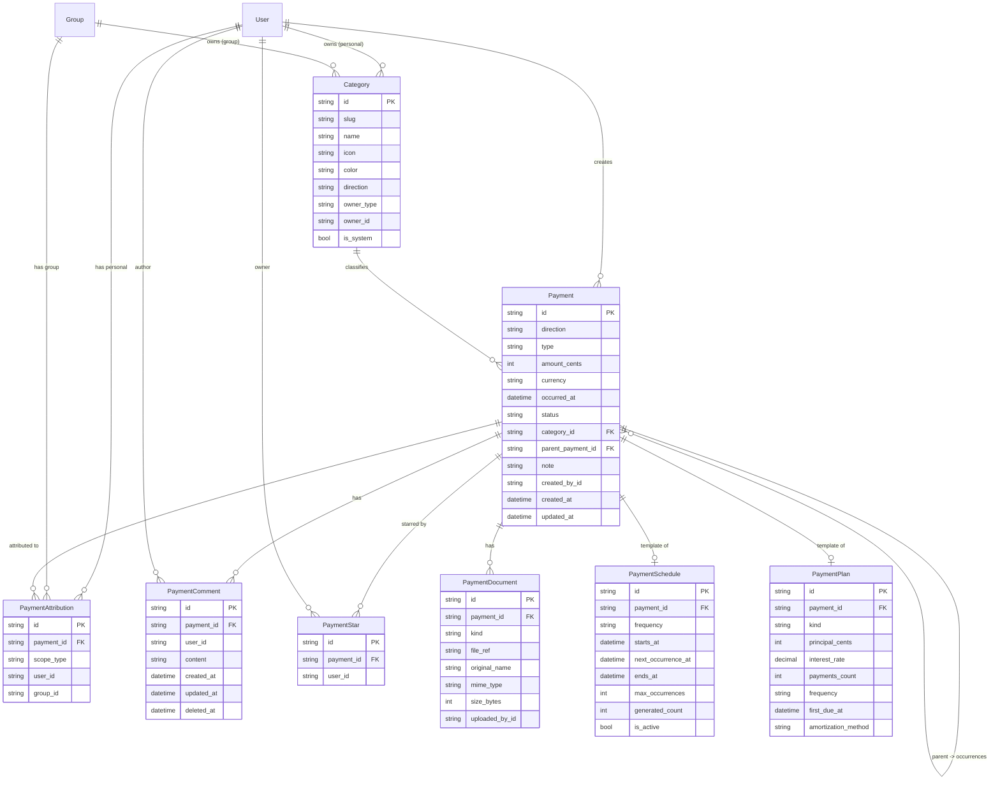

# Phase 6: Payment Management — Design Document

> **Status**: Approved 2026-04-25 · Replaces original Phase 6 (Income) + Phase 7 (Expense) · 21 iterations
>
> **Dependencies**: Phase 5 (Group Management) complete.

## Table of Contents

- [1. Overview](#1-overview)
- [2. Core Concepts](#2-core-concepts)
- [3. Architecture](#3-architecture)
- [4. Database Schema](#4-database-schema)
- [5. API Design](#5-api-design)
- [6. Frontend Design](#6-frontend-design)
- [7. DRY / Symmetry Rules](#7-dry--symmetry-rules)
- [8. Shared Package Extensions](#8-shared-package-extensions)
- [9. Iteration Plan (6.1 – 6.21)](#9-iteration-plan-61--621)
- [10. Testing Strategy](#10-testing-strategy)
- [11. Deployment, Migrations, Workers](#11-deployment-migrations-workers)
- [12. Extendability & Out-of-Scope](#12-extendability--out-of-scope)

---

## 1. Overview

Phase 6 unifies **incomes** and **expenses** into a single **Payment** entity whose `direction` field (`IN` / `OUT`) distinguishes the flow. All CRUD flows, categories, attributions, scheduling, stars, comments, and UI components are shared between the two directions — the only difference is the direction toggle and which default category set appears in the picker.

The phase delivers:

- A single **`/dashboard`** page with aggregated totals, recent activity, starred payments, and entry points to per-scope views.
- An **expanded view per scope** — personal payments at `/payments?scope=personal` and group payments embedded in the existing `/groups/[groupId]` page.
- A **single payment detail page** at `/payments/:id` showing the amount, note, documents (placeholder for Phase 9), comments thread, and star toggle.
- **Categories** — system defaults + user- and group-scoped custom categories.
- **Payment types**: `ONE_TIME`, `RECURRING`, `LIMITED_PERIOD`, `INSTALLMENT`, `LOAN`, `MORTGAGE`.
- **Recurring engine** (BullMQ cron worker) that auto-creates occurrences and recovers from missed runs.
- **Amortization service** for installments and loans.

### User stories covered (from [`SPECIFICATION-USER-STORIES.md`](../SPECIFICATION-USER-STORIES.md:1))

- Personal user: define income types (one-time, limited-period, regular), add expenses, assign categories.
- Personal / group user: attribute purchases to personal, group, or both; remember last choice.
- Web app user: table/grid view with add/edit/delete/filter/sort, notes, (placeholder) receipt attachment.
- Group member: see group expenses/incomes; view per-member contributions via the comments/audit trail.

### User stories **deferred** to later phases

| Story                                                                  | Phase  |
| ---------------------------------------------------------------------- | ------ |
| Receipt upload (photos, PDFs, URLs), OCR, LLM extraction               | 9 & 15 |
| Purchase places/stores/goods analytics, price history                  | 10     |
| Notifications (email, Telegram, push) about due payments / low balance | 8, 11  |
| Telegram bot + mini-app payment entry                                  | 11–13  |
| LLM-based Q&A on finances                                              | 15     |

---

## 2. Core Concepts

### 2.1 Direction

```ts
export type PaymentDirection = 'IN' | 'OUT';
```

- `IN` = income (positive to balance).
- `OUT` = expense (negative to balance).

No separate "income" or "expense" entity — one table, one code path.

### 2.2 Payment types

| Type             | Description                                                       | Backing data                                   |
| ---------------- | ----------------------------------------------------------------- | ---------------------------------------------- |
| `ONE_TIME`       | Single occurrence at a specific date.                             | `Payment` row only.                            |
| `RECURRING`      | Repeats indefinitely on a fixed frequency.                        | `Payment` row + `PaymentSchedule`.             |
| `LIMITED_PERIOD` | Repeats on a frequency but with a fixed end (date or count).      | `Payment` row + `PaymentSchedule` with bounds. |
| `INSTALLMENT`    | Fixed count of equal payments, optional interest (e.g. 0 % BNPL). | `Payment` row + `PaymentPlan` + N occurrences. |
| `LOAN`           | Amortised principal + interest over N payments.                   | `Payment` row + `PaymentPlan` + N occurrences. |
| `MORTGAGE`       | Same as loan; kept as a distinct label for UX clarity.            | Same as `LOAN`.                                |

The "parent" [`Payment`](../apps/api/prisma/schema.prisma:1) row acts as the **template** for schedules/plans. Every generated occurrence is itself a `Payment` row with `parentPaymentId` set to the template.

### 2.3 Attribution model

A single payment can be attributed to multiple **scopes**. A scope is either the user's own personal account or a group.

```
Payment (1) ─── has many ──▶ PaymentAttribution
                                  │
                                  ├─ scopeType: 'personal' | 'group'
                                  ├─ userId  (when scopeType = 'personal')
                                  └─ groupId (when scopeType = 'group')
```

A user **accesses** a payment if **any** of its attributions matches:

- `scopeType='personal' AND userId = currentUser`, or
- `scopeType='group' AND currentUser ∈ group.memberships`.

### 2.4 Delete semantics

Two delete operations:

1. **Delete from current scope** — default. Removes one `PaymentAttribution`. The payment row stays alive if any other attribution remains.
2. **Delete from all accessible scopes** — removes attributions **only in scopes the current user controls** (their personal + groups where they are a member). Other users' personal attributions and non-member-group attributions are left untouched.

When the last attribution is removed, the `Payment` row (and its comments, stars, schedule/plan, documents) are hard-deleted via cascade.

### 2.5 Star / favourite

A per-user toggle (`PaymentStar` unique `(paymentId, userId)`), not a shared flag. Each user has their own starred collection. Star is allowed for any payment the user can access.

### 2.6 Comments

Any user who can access a payment can comment on it. Comments support plain text initially; markdown/mentions/hashtags deferred to later phases. Only the author can edit or delete their own comment (soft-delete → `deletedAt`). Group admins **cannot** delete others' comments in this phase (kept simple; revisit if abused).

### 2.7 Documents (placeholder)

`PaymentDocument` schema is created now so later phases can attach files without migrations:

- `kind`: `image` | `pdf` | `url` | `other`.
- `fileRef`: local path or URL.
- `uploadedById`, `mimeType`, `size`, `originalName`.

No upload UI in this phase — only a placeholder section on the detail page stating "Receipts & attachments coming in Phase 9".

---

## 3. Architecture

### 3.1 API (NestJS) module layout

```
apps/api/src/
  payment/
    payment.module.ts
    payment.controller.ts             # /payments/*
    payment.service.ts                # CRUD + attribution logic
    payment-comment.controller.ts     # /payments/:id/comments
    payment-comment.service.ts
    payment-star.controller.ts        # /payments/:id/star (toggle)
    payment-schedule.service.ts       # RECURRING / LIMITED_PERIOD
    payment-plan.service.ts           # INSTALLMENT / LOAN / MORTGAGE
    payment-recurring.processor.ts    # BullMQ cron worker
    amortization.util.ts              # Pure amortization math
    guards/
      payment-access.guard.ts         # user can access payment (any scope match)
      payment-owner.guard.ts          # user is creator
    constants/
      payment-errors.ts
    dto/
      create-payment.dto.ts
      update-payment.dto.ts
      list-payments-query.dto.ts
      delete-payment.query.dto.ts
      create-payment-schedule.dto.ts
      create-payment-plan.dto.ts
      create-comment.dto.ts
      update-comment.dto.ts
  category/
    category.module.ts
    category.controller.ts
    category.service.ts
    dto/
      create-category.dto.ts
      update-category.dto.ts
    constants/
      default-categories.ts
```

Registered in [`AppModule`](../apps/api/src/app.module.ts:1) alongside existing modules.

### 3.2 Frontend (Next.js) layout

```
apps/web/src/
  app/[locale]/
    dashboard/page.tsx                   # Aggregated dashboard (updated)
    payments/
      page.tsx                           # Expanded payments list (/payments?scope=...)
      [paymentId]/page.tsx               # Single payment detail
      starred/page.tsx                   # Starred payments (optional; filter also available in list)
    groups/[groupId]/page.tsx            # Adds a "Payments" tab using <PaymentsList>
  components/
    payment/
      PaymentsList.tsx                   # Generic filter/sort/list component
      PaymentRow.tsx                     # Single row with star, controls
      PaymentFormDialog.tsx              # Add / edit (ONE_TIME, RECURRING, etc.)
      PaymentDetail.tsx                  # Used by detail page
      PaymentCommentList.tsx             # Comment thread
      PaymentCommentInput.tsx            # Comment composer
      PaymentScopeSelector.tsx           # Multi-select: personal + my groups
      PaymentCategoryPicker.tsx          # Hierarchical categories
      PaymentTypeSelector.tsx            # One-time / recurring / installment / loan
      PaymentAmountInput.tsx             # Amount + currency
      PaymentsFilters.tsx                # Date range, direction, category, starred, scope
      PaymentPlanTable.tsx               # Amortization table
      PaymentScheduleSummary.tsx         # Next occurrence, frequency display
    category/
      CategoryManager.tsx                # List/create/edit/delete (personal + group)
    dashboard/
      TotalsCard.tsx                     # Income / expense / net this period
      RecentActivity.tsx                 # Recent payments across all scopes
      StarredPayments.tsx                # Starred section
      ScopeEntryCards.tsx                # Personal + per-group links
  lib/
    payment/
      payment-context.tsx                # Payment state + API calls
      types.ts
      formatters.ts                      # formatAmount, formatDate, currency helpers
      remember.ts                        # localStorage helper for last-used scope
```

### 3.3 Worker / scheduler

A dedicated **BullMQ** queue + worker process handles recurring-payment generation:

- Queue name: `payment-recurring`.
- Scheduled job: cron `0 * * * *` (hourly) → checks all active `PaymentSchedule` rows whose `nextOccurrenceAt <= now`.
- For each due schedule: creates the occurrence `Payment` row (copies direction, amount, currency, category, note, attributions from the parent) inside a transaction, then advances `nextOccurrenceAt` using the frequency, and respects `endDate` / `occurrenceCount`.
- Catch-up: if the worker was down, it iterates `nextOccurrenceAt` forward generating every missed occurrence (capped at 100 per run per schedule to protect against runaway loops).
- For `INSTALLMENT` / `LOAN` / `MORTGAGE`, all occurrences are **pre-generated** at plan creation time — the worker only flips `status` from `PENDING` to `DUE` when `occurredAt <= now`. This keeps amortization deterministic and auditable.

### 3.4 Worker deployment

BullMQ worker runs in-process inside the existing API container. Cron triggers use `@nestjs/schedule` (already in [`app.module.ts`](../apps/api/src/app.module.ts:22)) with a BullMQ client connected to the existing Redis instance (already declared in Docker Compose for every environment).

---

## 4. Database Schema

### 4.1 Mermaid ER diagram



### 4.2 Prisma schema (additions)

Stored as one migration `20260425_phase6_payments` so blue-green deploy stays additive (expand-only).

```prisma
// ── Phase 6: Payment Management ──

enum PaymentDirection { IN  OUT }
// Prisma w/ MySQL: use String + @db.VarChar(N) + app-level validation to stay flexible.

model Payment {
  id               String    @id @default(uuid()) @db.VarChar(36)
  direction        String    @db.VarChar(3)   // 'IN' | 'OUT'
  type             String    @db.VarChar(20)  // 'ONE_TIME' | 'RECURRING' | ...
  amountCents      Int       @map("amount_cents")
  currency         String    @db.VarChar(3)
  occurredAt       DateTime  @map("occurred_at")
  status           String    @default("POSTED") @db.VarChar(20) // 'POSTED' | 'PENDING' | 'DUE' | 'CANCELLED'
  categoryId       String    @map("category_id") @db.VarChar(36)
  category         Category  @relation(fields: [categoryId], references: [id])
  parentPaymentId  String?   @map("parent_payment_id") @db.VarChar(36)
  parent           Payment?  @relation("PaymentOccurrences", fields: [parentPaymentId], references: [id], onDelete: Cascade)
  occurrences      Payment[] @relation("PaymentOccurrences")
  note             String?   @db.Text
  createdById      String    @map("created_by_id") @db.VarChar(36)
  createdAt        DateTime  @default(now()) @map("created_at")
  updatedAt        DateTime  @updatedAt @map("updated_at")

  attributions PaymentAttribution[]
  comments     PaymentComment[]
  stars        PaymentStar[]
  documents    PaymentDocument[]
  schedule     PaymentSchedule?
  plan         PaymentPlan?

  @@index([direction, occurredAt])
  @@index([categoryId])
  @@index([createdById, occurredAt])
  @@index([parentPaymentId])
  @@index([type, status])
  @@map("payments")
}

model PaymentAttribution {
  id        String   @id @default(uuid()) @db.VarChar(36)
  paymentId String   @map("payment_id") @db.VarChar(36)
  payment   Payment  @relation(fields: [paymentId], references: [id], onDelete: Cascade)
  scopeType String   @map("scope_type") @db.VarChar(10) // 'personal' | 'group'
  userId    String?  @map("user_id") @db.VarChar(36)
  groupId   String?  @map("group_id") @db.VarChar(36)
  createdAt DateTime @default(now()) @map("created_at")

  @@unique([paymentId, scopeType, userId, groupId], name: "payment_scope_unique")
  @@index([userId, scopeType])
  @@index([groupId, scopeType])
  @@index([paymentId])
  @@map("payment_attributions")
}

model Category {
  id          String   @id @default(uuid()) @db.VarChar(36)
  slug        String   @db.VarChar(64)      // stable i18n key, e.g. "groceries"
  name        String   @db.VarChar(100)     // display name (locale fallback: English)
  icon        String?  @db.VarChar(32)      // optional icon key
  color       String?  @db.VarChar(16)      // optional hex color
  direction   String   @db.VarChar(3)       // 'IN' | 'OUT' | 'BOTH'
  ownerType   String   @map("owner_type") @db.VarChar(10) // 'system' | 'user' | 'group'
  ownerId     String?  @map("owner_id") @db.VarChar(36)
  isSystem    Boolean  @default(false) @map("is_system")
  createdAt   DateTime @default(now()) @map("created_at")
  updatedAt   DateTime @updatedAt @map("updated_at")

  payments Payment[]

  @@unique([ownerType, ownerId, slug, direction], name: "category_owner_slug_unique")
  @@index([ownerType, ownerId])
  @@index([direction])
  @@map("categories")
}

model PaymentSchedule {
  id                String    @id @default(uuid()) @db.VarChar(36)
  paymentId         String    @unique @map("payment_id") @db.VarChar(36)
  payment           Payment   @relation(fields: [paymentId], references: [id], onDelete: Cascade)
  frequency         String    @db.VarChar(20) // 'DAILY' | 'WEEKLY' | 'BIWEEKLY' | 'MONTHLY' | 'QUARTERLY' | 'ANNUAL'
  interval          Int       @default(1)     // e.g. every 2 weeks
  startsAt          DateTime  @map("starts_at")
  nextOccurrenceAt  DateTime  @map("next_occurrence_at")
  endsAt            DateTime? @map("ends_at")
  maxOccurrences    Int?      @map("max_occurrences")
  generatedCount    Int       @default(0) @map("generated_count")
  isActive          Boolean   @default(true) @map("is_active")
  createdAt         DateTime  @default(now()) @map("created_at")
  updatedAt         DateTime  @updatedAt @map("updated_at")

  @@index([isActive, nextOccurrenceAt])
  @@map("payment_schedules")
}

model PaymentPlan {
  id                  String    @id @default(uuid()) @db.VarChar(36)
  paymentId           String    @unique @map("payment_id") @db.VarChar(36)
  payment             Payment   @relation(fields: [paymentId], references: [id], onDelete: Cascade)
  kind                String    @db.VarChar(20) // 'INSTALLMENT' | 'LOAN' | 'MORTGAGE'
  principalCents      Int       @map("principal_cents")
  interestRate        Decimal   @default(0) @map("interest_rate") @db.Decimal(8, 6) // annual APR
  paymentsCount       Int       @map("payments_count")
  frequency           String    @db.VarChar(20) // typically MONTHLY
  firstDueAt          DateTime  @map("first_due_at")
  amortizationMethod  String    @default("french") @map("amortization_method") @db.VarChar(16)
  createdAt           DateTime  @default(now()) @map("created_at")
  updatedAt           DateTime  @updatedAt @map("updated_at")

  @@map("payment_plans")
}

model PaymentDocument {
  id            String   @id @default(uuid()) @db.VarChar(36)
  paymentId     String   @map("payment_id") @db.VarChar(36)
  payment       Payment  @relation(fields: [paymentId], references: [id], onDelete: Cascade)
  kind          String   @db.VarChar(20) // 'image' | 'pdf' | 'url' | 'other'
  fileRef       String   @map("file_ref") @db.VarChar(500)
  originalName  String?  @map("original_name") @db.VarChar(255)
  mimeType      String?  @map("mime_type") @db.VarChar(100)
  sizeBytes     Int?     @map("size_bytes")
  uploadedById  String   @map("uploaded_by_id") @db.VarChar(36)
  createdAt     DateTime @default(now()) @map("created_at")

  @@index([paymentId])
  @@map("payment_documents")
}

model PaymentComment {
  id         String    @id @default(uuid()) @db.VarChar(36)
  paymentId  String    @map("payment_id") @db.VarChar(36)
  payment    Payment   @relation(fields: [paymentId], references: [id], onDelete: Cascade)
  userId     String    @map("user_id") @db.VarChar(36)
  content    String    @db.Text
  createdAt  DateTime  @default(now()) @map("created_at")
  updatedAt  DateTime  @updatedAt @map("updated_at")
  deletedAt  DateTime? @map("deleted_at")

  @@index([paymentId, createdAt])
  @@index([userId])
  @@map("payment_comments")
}

model PaymentStar {
  id        String   @id @default(uuid()) @db.VarChar(36)
  paymentId String   @map("payment_id") @db.VarChar(36)
  payment   Payment  @relation(fields: [paymentId], references: [id], onDelete: Cascade)
  userId    String   @map("user_id") @db.VarChar(36)
  createdAt DateTime @default(now()) @map("created_at")

  @@unique([paymentId, userId])
  @@index([userId, createdAt])
  @@map("payment_stars")
}
```

### 4.3 Indexing strategy

- **Read patterns**: most queries are "payments visible to user X, in scope S, over date range D, direction Dir, category C".
- **Primary index for personal listing**: `payment_attributions (user_id, scope_type)` → drives the initial scope filter; then joined to `payments` ordered by `occurred_at DESC`.
- **Group listing**: `payment_attributions (group_id, scope_type)` analogue.
- **Date range**: `payments (direction, occurred_at)` + `payments (created_by_id, occurred_at)`.
- **Category aggregation** (Phase 10): `payments (category_id, occurred_at)`.
- **Recurring worker**: `payment_schedules (is_active, next_occurrence_at)` partial-covers the hot path.

### 4.4 User & Group model updates

```prisma
model User {
  // existing fields ...
  paymentAttributions PaymentAttribution[] @relation(..., fields: [id], references: [userId])
  paymentComments     PaymentComment[]
  paymentStars        PaymentStar[]
  categoriesOwned     Category[]           // filtered on owner_type='user'
  paymentsCreated     Payment[]
  paymentDocuments    PaymentDocument[]
}

model Group {
  // existing fields ...
  paymentAttributions PaymentAttribution[]
  categoriesOwned     Category[]           // filtered on owner_type='group'
}
```

(Exact Prisma relation annotations are finalised in iteration 6.2. Relations on `User` to `PaymentAttribution.userId` use explicit `@relation` with `fields`/`references` matching the foreign-key columns.)

---

## 5. API Design

All endpoints are under `/api/v1`. All require `JwtAuthGuard` unless noted.

### 5.1 Categories

| Method | Endpoint          | Auth + Guard             | Description                                                                                                  |
| ------ | ----------------- | ------------------------ | ------------------------------------------------------------------------------------------------------------ | -------------------- | -------- | ----------- |
| GET    | `/categories`     | JWT                      | List categories visible to user: system + user + member groups. Query: `direction=IN                         | OUT`, `scope=system  | personal | group:<id>` |
| POST   | `/categories`     | JWT                      | Create a category. Body: `{ name, slug?, icon?, color?, direction, scope: 'personal'                         | 'group', groupId? }` |
| PATCH  | `/categories/:id` | JWT + CategoryOwnerGuard | Update (owner or group admin only). Cannot edit `is_system`.                                                 |
| DELETE | `/categories/:id` | JWT + CategoryOwnerGuard | Delete (owner or group admin). Reject if any payment uses it; require `force=true` to reassign to a default. |

Default slugs (seeded):

- `OUT`: `groceries`, `home`, `restaurants`, `transport`, `utilities`, `health`, `entertainment`, `clothing`, `travel`, `education`, `taxes`, `fees`, `insurance`, `gifts`, `other`.
- `IN`: `salary`, `bonus`, `freelance`, `investment`, `refund`, `gift`, `other`.

### 5.2 Payments

| Method | Endpoint                            | Guard                      | Description                                                                                  |
| ------ | ----------------------------------- | -------------------------- | -------------------------------------------------------------------------------------------- |
| POST   | `/payments`                         | JWT                        | Create payment + attributions + optional schedule/plan.                                      |
| GET    | `/payments`                         | JWT                        | List with cursor pagination & filters (see below).                                           |
| GET    | `/payments/:id`                     | JWT + `PaymentAccessGuard` | Get single payment + attributions + category + schedule/plan + counts (comments, stars).     |
| PATCH  | `/payments/:id`                     | JWT + `PaymentOwnerGuard`  | Update mutable fields (creator only).                                                        |
| DELETE | `/payments/:id`                     | JWT + `PaymentAccessGuard` | Delete attribution; `?scope=all` removes all accessible; when 0 attributions left, row gone. |
| POST   | `/payments/:id/star`                | JWT + `PaymentAccessGuard` | Toggle star for current user. Response: `{ starred: boolean }`.                              |
| GET    | `/payments/:id/comments`            | JWT + `PaymentAccessGuard` | List comments (cursor paginated).                                                            |
| POST   | `/payments/:id/comments`            | JWT + `PaymentAccessGuard` | Create comment.                                                                              |
| PATCH  | `/payments/:id/comments/:commentId` | JWT + comment-author       | Update own comment.                                                                          |
| DELETE | `/payments/:id/comments/:commentId` | JWT + comment-author       | Soft-delete own comment.                                                                     |

#### `POST /payments` body

```jsonc
{
  "direction": "OUT",
  "type": "ONE_TIME", // or RECURRING / LIMITED_PERIOD / INSTALLMENT / LOAN / MORTGAGE
  "amountCents": 1250,
  "currency": "USD",
  "occurredAt": "2026-04-25", // ISO date
  "categoryId": "uuid-of-category",
  "note": "Monthly milk", // optional
  "attributions": [{ "scope": "personal" }, { "scope": "group", "groupId": "uuid-of-group" }],
  "schedule": {
    // required when type=RECURRING|LIMITED_PERIOD
    "frequency": "MONTHLY",
    "interval": 1,
    "startsAt": "2026-04-25",
    "endsAt": null,
    "maxOccurrences": 12, // for LIMITED_PERIOD
  },
  "plan": {
    // required when type=INSTALLMENT|LOAN|MORTGAGE
    "kind": "INSTALLMENT",
    "principalCents": 120000,
    "interestRate": 0.0,
    "paymentsCount": 12,
    "frequency": "MONTHLY",
    "firstDueAt": "2026-05-25",
    "amortizationMethod": "equal", // 'equal' for zero-interest installments, 'french' for loans
  },
}
```

Validation rules (enforced in `PaymentService`):

- Attributions non-empty.
- Each attribution references either current user's personal or a group where current user is a member.
- Category must be visible to the user (system OR owned by user OR owned by a group the user is in).
- Category's `direction` must equal payment `direction` (or `BOTH`).
- `schedule` or `plan` presence matches the `type`.
- `amountCents > 0`.
- `occurredAt <= today` for `ONE_TIME` (allow future dates for scheduled/plan occurrences).

#### `GET /payments` query

```
?scope=personal                 # personal-only
?scope=group:<id>               # single group
?scope=all                      # default — all accessible
?direction=IN|OUT
?categoryId=<id>
?from=2026-01-01&to=2026-12-31
?starred=true
?type=ONE_TIME
?search=<text>                  # against note
?sort=date_desc|date_asc|amount_desc|amount_asc
?limit=20&cursor=<opaque>
```

Returns the shared pagination envelope:

```jsonc
{
  "data": [ PaymentSummaryDto ],
  "nextCursor": "...",
  "hasMore": true
}
```

`PaymentSummaryDto` is a flattened view with:

```jsonc
{
  "id", "direction", "type", "amountCents", "currency",
  "occurredAt", "status",
  "category": { "id", "slug", "name", "icon", "color" },
  "attributions": [ { "scope", "userId?", "groupId?", "groupName?" } ],
  "note",
  "commentCount", "starredByMe", "hasDocuments",
  "parentPaymentId", "schedule?", "plan?",
  "createdById", "createdAt", "updatedAt"
}
```

#### `DELETE /payments/:id` semantics

```
DELETE /payments/:id                 # remove attribution for current scope (see body/query below)
DELETE /payments/:id?scope=personal  # explicit: remove personal attribution
DELETE /payments/:id?scope=group:<groupId>   # remove specific group attribution
DELETE /payments/:id?scope=all       # remove every accessible attribution
```

Response: `{ deletedAttributions: 2, paymentDeleted: true|false }`.

### 5.3 Stars

| Method | Endpoint             |
| ------ | -------------------- |
| POST   | `/payments/:id/star` |

Toggles (create if missing, delete if present). Returns `{ starred }`.

### 5.4 Comments

Paginated under the parent payment; all bodies use a simple `{ content: string (1..2000) }`.

### 5.5 Schedules

| Method | Endpoint                 | Description                                                  |
| ------ | ------------------------ | ------------------------------------------------------------ |
| POST   | `/payments/:id/schedule` | Attach a schedule to an existing ONE_TIME payment (convert). |
| PATCH  | `/payments/:id/schedule` | Update frequency/interval/ends/max (creator only).           |
| DELETE | `/payments/:id/schedule` | Deactivate (`isActive=false`); keep row for audit.           |

`POST /payments` with `type=RECURRING|LIMITED_PERIOD` creates the schedule atomically — these endpoints are for post-hoc edits.

### 5.6 Plans

| Method | Endpoint             | Description                                                                          |
| ------ | -------------------- | ------------------------------------------------------------------------------------ |
| POST   | `/payments/:id/plan` | Attach a plan to an existing ONE_TIME (creates the amortization schedule).           |
| GET    | `/payments/:id/plan` | Return plan metadata + amortization table.                                           |
| PATCH  | `/payments/:id/plan` | Update plan (regenerates unpaid occurrences). Only allowed while no occurrence paid. |
| DELETE | `/payments/:id/plan` | Cancel plan; cascades to pending occurrences (CANCELLED status, never removed).      |

The initial flow creates plan via `POST /payments` — these endpoints exist for advanced edits.

### 5.7 Error codes

```ts
export const PAYMENT_ERRORS = {
  PAYMENT_NOT_FOUND: 'PAYMENT_NOT_FOUND',
  PAYMENT_ACCESS_DENIED: 'PAYMENT_ACCESS_DENIED',
  PAYMENT_NOT_OWNER: 'PAYMENT_NOT_OWNER',
  PAYMENT_INVALID_AMOUNT: 'PAYMENT_INVALID_AMOUNT',
  PAYMENT_INVALID_DATE: 'PAYMENT_INVALID_DATE',
  PAYMENT_INVALID_CATEGORY: 'PAYMENT_INVALID_CATEGORY',
  PAYMENT_CATEGORY_DIRECTION_MISMATCH: 'PAYMENT_CATEGORY_DIRECTION_MISMATCH',
  PAYMENT_NO_ATTRIBUTIONS: 'PAYMENT_NO_ATTRIBUTIONS',
  PAYMENT_INVALID_ATTRIBUTION: 'PAYMENT_INVALID_ATTRIBUTION',
  PAYMENT_ATTRIBUTION_OUT_OF_SCOPE: 'PAYMENT_ATTRIBUTION_OUT_OF_SCOPE',
  PAYMENT_SCHEDULE_REQUIRED: 'PAYMENT_SCHEDULE_REQUIRED',
  PAYMENT_PLAN_REQUIRED: 'PAYMENT_PLAN_REQUIRED',
  PAYMENT_CANNOT_EDIT_GENERATED_OCCURRENCE: 'PAYMENT_CANNOT_EDIT_GENERATED_OCCURRENCE',
  PAYMENT_COMMENT_NOT_FOUND: 'PAYMENT_COMMENT_NOT_FOUND',
  PAYMENT_COMMENT_NOT_AUTHOR: 'PAYMENT_COMMENT_NOT_AUTHOR',
  CATEGORY_NOT_FOUND: 'CATEGORY_NOT_FOUND',
  CATEGORY_NOT_OWNER: 'CATEGORY_NOT_OWNER',
  CATEGORY_IN_USE: 'CATEGORY_IN_USE',
} as const;
```

### 5.8 Rate limiting

| Action                       | Limit       |
| ---------------------------- | ----------- |
| Create/update/delete payment | `30 / min`  |
| Create comment               | `20 / min`  |
| Toggle star                  | `60 / min`  |
| List payments                | `120 / min` |
| Category CRUD                | `20 / min`  |

Applied via the existing `@CustomThrottle()` decorator.

---

## 6. Frontend Design

### 6.1 Routing

| Path                                      | Purpose                                                       |
| ----------------------------------------- | ------------------------------------------------------------- |
| `/dashboard`                              | Aggregated overview with totals, recent, starred, scope cards |
| `/payments`                               | Expanded list (default `scope=all`)                           |
| `/payments?scope=personal`                | Personal-only list                                            |
| `/payments?scope=group:<id>`              | Group-only list (also accessible as a tab on group page)      |
| `/payments/starred`                       | Starred-only list (shortcut for `?starred=true`)              |
| `/payments/:id`                           | Single payment detail (note, docs, comments, star)            |
| `/groups/[groupId]`                       | Group dashboard with embedded Payments tab                    |
| `/settings/account` → Categories section  | Personal category management                                  |
| `/groups/[groupId]/settings` → Categories | Group category management (admins)                            |

### 6.2 Dashboard layout (6.15)

```
┌───────────────────────────── /dashboard ─────────────────────────────┐
│ [ Totals card: this month • In / Out / Net ]                         │
│ [ Quick action: + Add payment (opens dialog with last-used scopes) ] │
├──────────────────────────────────────────────────────────────────────┤
│ [ Scope entry cards (grid) ]                                         │
│   ┌ Personal ┐  ┌ Family ┐  ┌ Work team ┐ ...                        │
│   └──────────┘  └────────┘  └───────────┘                            │
├──────────────────────────────────────────────────────────────────────┤
│ [ Recent activity: PaymentsList (limit=10, sort=date_desc) ]         │
├──────────────────────────────────────────────────────────────────────┤
│ [ Starred: PaymentsList (filter starred, limit=5) ]                  │
└──────────────────────────────────────────────────────────────────────┘
```

### 6.3 PaymentsList component (6.12)

Props:

```ts
interface PaymentsListProps {
  scope?: 'all' | 'personal' | { groupId: string };
  initialFilters?: Partial<PaymentsFilters>;
  showFilters?: boolean; // default true
  showControls?: boolean; // edit/delete; default true
  showStar?: boolean; // default true
  limit?: number; // 20 default
  emptyState?: React.ReactNode;
  onPaymentClick?: (id: string) => void;
}
```

Renders a filter/sort bar, responsive table (desktop) / card list (mobile) with columns: **Date · Direction · Amount · Category · Scope(s) · Note · ★ · Controls**. Infinite scroll / "Load more" via cursor.

### 6.4 PaymentFormDialog (6.13)

- Direction toggle (In / Out) — defaults to the value chosen last time (`remember.ts`).
- Amount + currency picker (defaults to user's default currency, or first selected scope's default).
- Date picker (defaults to today).
- Category picker grouped by `direction` and owner (system / personal / per-group).
- **Scope multi-select**: checkbox list: `☐ Personal  ☐ Family  ☐ Work team ...`. Defaults to last-used set.
- Note (textarea, optional).
- Type selector with a disclosure: _Default is one-time. Click to make recurring, installment, or loan._
- Type-specific sub-forms render when expanded (frequency, end date, principal + rate + count).
- "Save" calls `POST /payments` or `PATCH /payments/:id`; persists last-used scopes/direction to localStorage.

### 6.5 Payment detail page (6.14)

```
┌ /payments/:id ────────────────────────────────────────────────┐
│ [← Back]                                                     │
│ { direction badge }  { type badge }  { status pill }          │
│ Amount: $12.50  Currency: USD   Date: 2026-04-25              │
│ Category: Groceries                                           │
│ Attributions: Personal · Family (link)                        │
│ Note: "weekly shopping"                                       │
│ [ Star ★ ]  [ Edit ]  [ Delete ]                              │
├───────────────────────────────────────────────────────────────┤
│ Documents                                                     │
│   (Phase 9 placeholder)                                       │
├───────────────────────────────────────────────────────────────┤
│ Comments                                                      │
│   Alice — 2d ago — "Nice deal!"                               │
│   Bob  — 1d ago — "Next week I'll pay"                        │
│   [ textarea ]  [ Post ]                                      │
├───────────────────────────────────────────────────────────────┤
│ Schedule / Plan (if any)                                      │
│   "RECURRING · MONTHLY · next on …"  [ Pause ] [ Cancel ]     │
│                                                               │
│   or amortisation table for LOAN/INSTALLMENT                  │
└───────────────────────────────────────────────────────────────┘
```

### 6.6 Group dashboard Payments tab (6.16)

The existing [`/groups/[groupId]/page.tsx`](../apps/web/src/app/[locale]/groups/[groupId]/page.tsx:1) gets a new tab list:

```
[ Overview ] [ Payments ] [ Members ] [ (admin) Settings → ]
```

The **Payments** tab renders `<PaymentsList scope={{ groupId }} />`. The existing member list remains as a tab.

### 6.7 Categories management UI (6.16)

A simple manager shared by two surfaces:

- Personal: section on `/settings/account` (between Preferences and Delete Account).
- Group: section on `/groups/[groupId]/settings` (below "Group Information").

Both use the same `<CategoryManager ownerType="..." ownerId="..." />` component.

### 6.8 i18n

New translation namespaces:

- `payments.*` — list, controls, filters, dialogs, detail page.
- `categories.*` — category CRUD + default category display names.
- `dashboard.*` — totals, recent, starred, scope cards.

Both English (`en.json`) and Hebrew (`he.json`) receive the full set. RTL is inherited via existing locale layout — dialogs/tables already respect `dir="rtl"`.

Category display names are served from the API (`name` field), but **system** category slugs have bilingual labels in a client-side dictionary so i18n works without a round-trip:

```ts
const SYSTEM_CATEGORY_I18N: Record<string, { en: string; he: string }> = {
  groceries: { en: 'Groceries', he: 'מכולת' },
  // ...
};
```

If the locale-specific label is missing, fall back to `name` from the API.

---

## 7. DRY / Symmetry Rules

The whole point of merging Phases 6 and 7 is to avoid any "incomes" vs "expenses" duplication. Concrete rules applied throughout the design:

| Rule                                                                                        | Enforcement                                                                       |
| ------------------------------------------------------------------------------------------- | --------------------------------------------------------------------------------- | -------------------------- | --------------------------------------------------------------- |
| A **single** `Payment` table/model for both directions.                                     | [`payments`](../apps/api/prisma/schema.prisma:1) with `direction` column.         |
| A **single** CRUD service (`PaymentService`) handling both directions.                      | `payment.service.ts` — no direction-specific methods.                             |
| A **single** controller and set of endpoints `/payments/*`.                                 | `payment.controller.ts`.                                                          |
| A **single** list query with a `direction` filter.                                          | `GET /payments?direction=IN                                                       | OUT`.                      |
| A **single** React component for the list (`<PaymentsList>`).                               | Used on dashboard, personal page, group tab, starred page.                        |
| A **single** add/edit dialog (`<PaymentFormDialog>`) with a direction toggle.               | Used everywhere payments are added.                                               |
| Category schema is direction-aware (`direction IN                                           | OUT                                                                               | BOTH`) but uses one table. | `categories` with `direction` column; default seeds cover both. |
| Translations share the `payments.*` namespace — only labels differ by direction.            | `payments.in.*` and `payments.out.*` only for strings like "Income" vs "Expense". |
| Audit log `action` values follow `PAYMENT_CREATED` / `PAYMENT_UPDATED` / `PAYMENT_DELETED`. | No `INCOME_CREATED` / `EXPENSE_CREATED` split.                                    |
| Error codes prefixed `PAYMENT_*`.                                                           | `payment-errors.ts`.                                                              |
| `SERVER_NAME`-style secrets re-used; no new `PAYMENT_DOMAIN`-style vars introduced.         | Follows [`dna.md`](../.kilocode/rules/dna.md:1).                                  |

---

## 8. Shared Package Extensions

New module [`packages/shared/src/types/payment.types.ts`](../packages/shared/src/types/payment.types.ts:1):

```ts
export const PAYMENT_DIRECTIONS = ['IN', 'OUT'] as const;
export type PaymentDirection = (typeof PAYMENT_DIRECTIONS)[number];

export const PAYMENT_TYPES = [
  'ONE_TIME',
  'RECURRING',
  'LIMITED_PERIOD',
  'INSTALLMENT',
  'LOAN',
  'MORTGAGE',
] as const;
export type PaymentType = (typeof PAYMENT_TYPES)[number];

export const PAYMENT_STATUSES = ['POSTED', 'PENDING', 'DUE', 'CANCELLED'] as const;
export type PaymentStatus = (typeof PAYMENT_STATUSES)[number];

export const PAYMENT_FREQUENCIES = [
  'DAILY',
  'WEEKLY',
  'BIWEEKLY',
  'MONTHLY',
  'QUARTERLY',
  'ANNUAL',
] as const;
export type PaymentFrequency = (typeof PAYMENT_FREQUENCIES)[number];

export const CATEGORY_OWNER_TYPES = ['system', 'user', 'group'] as const;
export type CategoryOwnerType = (typeof CATEGORY_OWNER_TYPES)[number];

export const ATTRIBUTION_SCOPE_TYPES = ['personal', 'group'] as const;
export type AttributionScopeType = (typeof ATTRIBUTION_SCOPE_TYPES)[number];

export type AttributionScope = { scope: 'personal' } | { scope: 'group'; groupId: string };

export const PAYMENT_SORTS = ['date_desc', 'date_asc', 'amount_desc', 'amount_asc'] as const;
export type PaymentSort = (typeof PAYMENT_SORTS)[number];
```

And `packages/shared/src/dto/payment.dto.ts` with the serialisable DTO shapes (backend emits, frontend consumes).

Default category slugs live in a single module `packages/shared/src/constants/default-categories.ts` so the API seed and the frontend i18n dictionary stay in sync.

---

## 9. Iteration Plan (6.1 – 6.21)

Every iteration **must** include:

1. `pnpm run test` (all workspaces) — **all green**.
2. `npx prettier --write` on every changed file whose extension is covered by the project's prettier config.
3. Commit with a message in the format `feat(phase-6.X): ...` (or `fix`, `docs`, etc.).
4. Push to `develop` and watch the deploy workflow until exit.
5. Ask the user to verify the staging site is functional for what the iteration delivered.
6. Update [`docs/progress.md`](progress.md:1) with iteration details (files changed, tests added, screenshots/links where relevant) and commit that update separately with `docs(phase-6.X): update progress`.

The end of the phase (after 6.21) merges `develop` → `main` and watches the production deploy.

### Part A — Foundations

#### 6.1 Shared types & DTOs

- Add [`packages/shared/src/types/payment.types.ts`](../packages/shared/src/types/payment.types.ts:1), [`constants/default-categories.ts`](../packages/shared/src/constants/default-categories.ts:1).
- Extend barrel exports.
- Unit tests (vitest) assert the string-literal arrays are non-empty and roundtrip via `JSON.stringify`.
- No runtime code changes in `api`/`web` yet (types only).

**Acceptance**: `pnpm run test` green; types importable from `@myfinpro/shared`.

#### 6.2 DB schema + migration

- Prisma models from [§4.2](#42-prisma-schema-additions).
- New migration `20260425_phase6_payments/migration.sql` (expand-only).
- Manual SQL review: all FKs indexed, no destructive ops.
- Run `prisma generate`; confirm integration test setup still works via testcontainers.

**Acceptance**: migration applies cleanly on staging; `npx prisma migrate status` = up-to-date.

#### 6.3 Seed default categories

- `apps/api/prisma/seed.ts` — idempotent upsert of all default categories (system owner) using the slug list from shared.
- Slugs stable; names copy the English label (frontend adds locale display via dictionary).
- Extended to run on deploy (`deploy.sh` already runs `prisma db push`; adapt seed step, or invoke seed as one-off on first deploy only — decision finalised in this iteration).

**Acceptance**: fresh DB has ~22 system categories (15 OUT + 7 IN) with `is_system=true`.

#### 6.4 Categories API

- `CategoryModule`, `CategoryService`, `CategoryController`, DTOs, guard `CategoryOwnerGuard`.
- List combines system + user + member-group categories with the optional direction filter.
- Personal create/update/delete restricted to the user; group-owned restricted to group admins.
- Refusal when a category is in use by any payment (`CATEGORY_IN_USE`) unless a replacement category is provided.
- Tests: 15+ service + 10+ controller unit tests.

**Acceptance**: Category CRUD works via Swagger; listing returns expected visibility.

### Part B — One-time payment core API

#### 6.5 Create payment API

- `PaymentModule`, `PaymentService`, `PaymentController`.
- `POST /payments` for `type=ONE_TIME` only (schedule/plan branches in later iterations). Validates attributions, category, direction, amounts.
- Transaction: insert `Payment` + N `PaymentAttribution` rows.
- Audit log: `PAYMENT_CREATED`.
- Tests: unit + integration (Testcontainers). Permission tests for attribution scoping.

**Acceptance**: can create a personal payment, a group payment, and a mixed personal+group payment via Swagger.

#### 6.6 List payments API

- `GET /payments` with filters ([§5.2](#52-payments)).
- Visibility filter: join `payment_attributions` on either `user_id=currentUser` or `group_id IN (member-groups)`.
- Cursor pagination using composite cursor `(occurredAt, id)` reversed.
- Efficient query (no N+1; attribute eager-loading with `include: { attributions: true, category: true, _count: { comments, stars } }`).
- Tests: unit + integration with seeded data for each filter combination.

**Acceptance**: lists from seeded data respect every filter; pagination returns correct `nextCursor`.

#### 6.7 Edit + get-one

- `GET /payments/:id` with `PaymentAccessGuard` (existing access rules).
- `PATCH /payments/:id` with `PaymentOwnerGuard` (creator only); mutable fields: `amountCents`, `currency`, `occurredAt`, `categoryId`, `note`, `direction` (only while no occurrences exist).
- Attribution edits handled in iteration 6.8 (they share the delete-per-scope code path internally).
- Audit log: `PAYMENT_UPDATED`.
- Tests: unit + integration.

**Acceptance**: creator can edit; non-creator receives 403; access guard rejects non-members.

#### 6.8 Delete payment API

- `DELETE /payments/:id` with query `?scope=personal|group:<id>|all` (default = the scope the caller "owns" by default — personal if they have it, otherwise the single accessible group; explicit error if ambiguous).
- Removes only accessible attributions; hard-deletes row when zero attributions left.
- Audit log: `PAYMENT_ATTRIBUTION_REMOVED` and optionally `PAYMENT_DELETED` when the row is removed.
- Internally reused: attribution mutation when `PATCH /payments/:id` includes new attributions (iteration 6.7 calls through here).
- Tests: unit + integration — including the "other user's personal attribution is preserved" case.

**Acceptance**: delete semantics from [§2.4](#24-delete-semantics) all observable via integration tests.

### Part C — Social features API

#### 6.9 Star/unstar API

- `POST /payments/:id/star` toggles (create if missing, delete if present).
- Returns `{ starred, starCount }`.
- `GET /payments?starred=true` already implemented in 6.6 (flag added here).
- Audit log: `PAYMENT_STARRED` / `PAYMENT_UNSTARRED` (best-effort — failure does not fail the request).

**Acceptance**: star toggle works; list returns `starredByMe=true` for current user only.

#### 6.10 Comments API

- `GET/POST /payments/:id/comments`, `PATCH/DELETE /payments/:id/comments/:commentId`.
- Soft-delete on DELETE (sets `deletedAt`, content replaced with `""`, returns 204).
- List excludes soft-deleted rows by default; admin query `?includeDeleted=true` **not** exposed in this phase.
- Tests: unit + integration with second-user scenarios.

**Acceptance**: users can comment on any payment they can access; can only edit/delete their own.

### Part D — DRY frontend

#### 6.11 PaymentContext + types + helpers

- `apps/web/src/lib/payment/payment-context.tsx` with methods `fetchList`, `getPayment`, `create`, `update`, `remove`, `toggleStar`, `listComments`, `postComment`, `editComment`, `deleteComment`.
- `apps/web/src/lib/payment/types.ts` — frontend-facing types (import from shared).
- `apps/web/src/lib/payment/formatters.ts` — `formatAmount(moneyCents, currency, locale)`, `formatOccurredAt(date, locale)`.
- `apps/web/src/lib/payment/remember.ts` — `getLastUsedScopes() / setLastUsedScopes(scopes)`, same for direction and type.
- Provider added to [`[locale]/layout.tsx`](../apps/web/src/app/[locale]/layout.tsx:1) inside `<GroupProvider>`.
- Component-level unit tests covering the helpers.

**Acceptance**: context mounts, methods callable from a test component; formatters handle USD/ILS/EUR + `en-US`/`he-IL`.

#### 6.12 `<PaymentsList>` + `<PaymentRow>`

- Reusable table/list with filter bar (direction toggle, scope dropdown, date range, category select, starred checkbox, search).
- Controls: star icon, Edit (opens `<PaymentFormDialog>`), Delete (opens confirm with "Delete from current scope" + "Delete from all my accessible scopes" options).
- Responsive: table on ≥md, card list on <md.
- Tests: ~15 interaction tests (filter changes trigger fetch, star click flips UI, delete dialog options).

**Acceptance**: component renders in Storybook-style test harness and integrates with the context.

#### 6.13 `<PaymentFormDialog>`

- Controlled dialog; accepts `{ paymentId?, defaults?: Partial<PaymentInput>, onClose }`.
- Fields per [§6.4](#64-paymentformdialog-613).
- Scope multi-select draws from `useAuth()` + `useGroups()`; defaults populated from `remember.ts`.
- Type selector opens a second section where schedule/plan inputs appear (initially collapsed).
- Category picker filters by direction.
- Tests: validation messages, scope defaults, direction-switch resets category if incompatible.

**Acceptance**: add + edit flows produce correct API payloads; last-used scopes persisted.

#### 6.14 Payment detail page `/payments/:id`

- Server-side fetch via `getPayment`; 404 / 403 dedicated error cards.
- Layout from [§6.5](#65-payment-detail-page-614).
- Comments thread: `<PaymentCommentList>` (pagination) + `<PaymentCommentInput>`.
- Star button wired to context.
- Edit button opens `<PaymentFormDialog>`; Delete button opens the same confirm dialog as list.
- Documents section: static placeholder "Attachments coming in Phase 9" + link to feature tracker.
- Tests: rendering, comment flow, star flow, edit/delete navigation.

**Acceptance**: detail page deep-links from list/dashboard; comments & star are live.

#### 6.15 Aggregated dashboard

- Rebuild [`/dashboard`](../apps/web/src/app/[locale]/dashboard/page.tsx:1) (remove placeholder) with the four sections from [§6.2](#62-dashboard-layout-615).
- `<TotalsCard>` — this-month totals (in, out, net) via `GET /payments?from=…&to=…` (aggregated client-side for now; server aggregation in Phase 10).
- `<RecentActivity>` — latest 10 payments across all scopes.
- `<StarredPayments>` — starred section, top 5.
- `<ScopeEntryCards>` — personal card + one per group with quick totals.
- Tests: ensures correct props flow + skeleton states.

**Acceptance**: dashboard is the landing page for authenticated users; clicking a scope card takes the user to `/payments?scope=...`.

### Part E — Per-scope views + categories UI

#### 6.16 Personal page, group tab, categories UI

- New route `/payments/page.tsx` — thin page that reads `scope` query param and renders `<PaymentsList>`.
- Starred shortcut `/payments/starred/page.tsx` → `<PaymentsList initialFilters={{ starred: true }} />`.
- Group page: add a tabs component (Overview / Payments / Members) on [`/groups/[groupId]`](../apps/web/src/app/[locale]/groups/[groupId]/page.tsx:1); the Payments tab embeds `<PaymentsList scope={{ groupId }} />`.
- `<CategoryManager>` component mounted inside:
  - `/settings/account` (personal categories section).
  - `/groups/[groupId]/settings` (group categories section, admin only).
- i18n strings added.

**Acceptance**: per-scope lists visible; categories manageable from both settings pages.

### Part F — Recurring & limited-period

#### 6.17 Schedules API + BullMQ worker

- Extend `PaymentService` to accept `schedule` in `POST /payments` when `type=RECURRING|LIMITED_PERIOD`.
- `PaymentScheduleService` — `scheduleNext()`, `catchUp(scheduleId)`.
- BullMQ queue `payment-recurring`; hourly cron via `@nestjs/schedule` enqueues a single "tick" job that iterates due schedules.
- Missed-run detection via `nextOccurrenceAt <= now`; catch-up loop advances and inserts occurrences until caught up.
- Occurrence rows copy attribution from the parent.
- Audit log: `PAYMENT_OCCURRENCE_GENERATED`, `PAYMENT_SCHEDULE_CAUGHT_UP`.
- New config vars: `REDIS_URL` (already present), `PAYMENT_RECURRING_MAX_PER_RUN` (default 100).
- Tests: unit (pure scheduler math) + integration (ensure a manual tick generates correct occurrences for each frequency).

**Acceptance**: creating a recurring payment with `startsAt=2 days ago` generates the missed two occurrences on the first tick.

#### 6.18 Recurring UI

- "Make recurring" disclosure inside `<PaymentFormDialog>` with frequency, interval, end (date or count).
- New `/payments/schedules` page (list the user's active schedules) — not strictly required but useful for Day-2 ops; can ship as a small embedded panel on the detail page instead — decision finalised during this iteration.
- Pause/resume/cancel buttons on detail page.
- Tests: create → appears in list → cancel → disappears.

**Acceptance**: user can create/cancel recurring payments from the UI; occurrences show up automatically.

### Part G — Plans (installments, loans, mortgages)

#### 6.19 Plans API + amortization service

- Pure util `amortization.util.ts` — `calculateAmortization({ principalCents, interestRate, paymentsCount, method })` → array of `{ dueAt, principalCents, interestCents, totalCents, remainingCents }`.
- Supports `equal` (zero-interest installments) and `french` (equal monthly payment with interest).
- `PaymentPlanService.createPlan()` — validates inputs, pre-generates all N occurrence rows (status `PENDING`, with parent link).
- `POST /payments` with `type=INSTALLMENT|LOAN|MORTGAGE` delegates here.
- `GET /payments/:id/plan` returns the plan + amortization schedule.
- Tests: exhaustive amortization unit tests (hand-calculated fixtures) + integration.

**Acceptance**: 12-payment 0% installment of $1200 → 12 rows of $100; 60-month 5% loan of $10 000 → row values match spreadsheet reference.

#### 6.20 Plans UI

- `<PaymentFormDialog>` shows a "Make installment / loan" disclosure mutually exclusive with the recurring one; inputs: principal, rate, count, frequency, first due.
- Detail page renders `<PaymentPlanTable>` with per-row status.
- Cancellation button on the parent: flips remaining PENDING occurrences to CANCELLED (never deletes for audit).
- Tests: create → occurrences appear in list → cancel → remaining flip to CANCELLED.

**Acceptance**: user can create an installment/loan/mortgage and see the amortisation table.

### Part H — Polish

#### 6.21 Audit, tests, production merge

- Audit-log pass: every mutating endpoint produces a log row; unified table summarising `action` → `entity` mapping.
- Integration suite review: full coverage of permission matrix (creator vs member vs non-member; admin vs member; personal vs group scope).
- Playwright E2E: full happy path (create personal payment → appears on dashboard → edit → add group attribution → delete from all → vanishes) + recurring happy path + loan happy path.
- i18n review: no English strings in `he.json`; RTL layout check on detail page and form dialog.
- Dark-mode contrast pass for every new component.
- Merge `develop` → `main` via squash or no-ff (match Phase 5 style: `--no-ff`) and watch production deploy.

**Acceptance**: production green; user-verified; `docs/progress.md` reflects Phase 6 completion.

---

## 10. Testing Strategy

Following the existing test pyramid ([§3.5 of IMPLEMENTATION-PLAN.md](../IMPLEMENTATION-PLAN.md:148)):

| Layer             | Tooling                           | Target coverage                                |
| ----------------- | --------------------------------- | ---------------------------------------------- |
| Unit (backend)    | Jest                              | ≥ 80 % for `PaymentService`, amortization util |
| Unit (frontend)   | Vitest + Testing Library          | Components: render + interaction               |
| Integration (API) | Jest + supertest + Testcontainers | Every endpoint × permission matrix             |
| E2E (web)         | Playwright                        | Smoke happy path for one-time, recurring, loan |
| Staging E2E       | Playwright (staging config)       | A single payment round-trip against staging    |

Fixtures live in `apps/api/test/integration/payments/fixtures.ts` (reusable factory `createPaymentFixtures(prisma)`).

---

## 11. Deployment, Migrations, Workers

- Single expand-only migration in 6.2 — the old API slot during blue-green can read but not write new tables (no breakage because old code doesn't know about them).
- Seed step (6.3) runs idempotently on every deploy (upsert by `(slug, direction, owner_type='system')`). No data duplication on rerun.
- BullMQ worker runs inside the existing API container, so no new container/service is added to Docker Compose. The shared Redis instance is already provisioned in every env.
- The hourly cron is safe during blue-green: both slots will try to process; BullMQ's default queue locking ensures each job runs exactly once.

---

## 12. Extendability & Out-of-Scope

### Extendability

- **Future payment types** (e.g. `STANDING_ORDER`, `SUBSCRIPTION`) only require adding to the `PAYMENT_TYPES` array and wiring a branch in the form dialog.
- **Future attribution scopes** (e.g. `team`, `subaccount`) — the `scope_type` column is already a string; add a new value and handle it in the access logic.
- **Notifications** (Phase 8/11) can consume the BullMQ occurrence-generated event.
- **Budgets** (Phase 8) can query `payments` by `categoryId` + date range.
- **Analytics** (Phase 10) will add aggregation views over the same tables — no schema changes expected.

### Out-of-scope for Phase 6 (deferred by design)

- Receipt upload UI + OCR (Phase 9 adds upload to `PaymentDocument`).
- Member-on-whose-behalf field (lightweight addition in a later phase — add `on_behalf_of_user_id` column).
- LLM insights (Phase 15).
- Telegram bot entry points (Phases 11, 12, 13).
- Notification scheduling for due payments / low balance (Phase 8 uses the schedules table).
- Markdown / mentions / hashtags in comments (incremental upgrade later; current DB field already `TEXT`).

---

**End of Phase 6 design document.**
