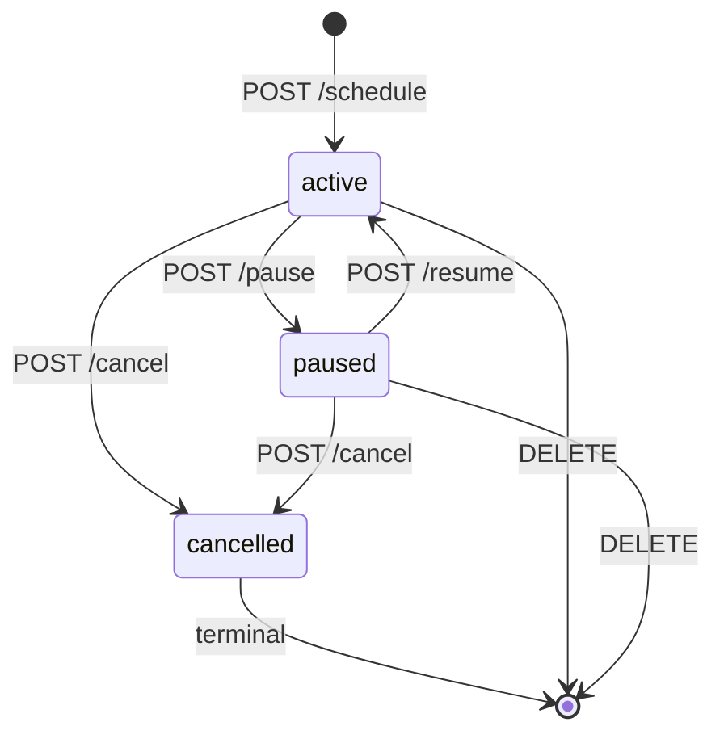

# Phase 6 — Payment Management

## Planning (2026-04-25)

### Scope Change — Combining Phases 6 + 7

Original `IMPLEMENTATION-PLAN.md` split tracking into two phases: **Phase 6 — Income Management** (10 iterations) and **Phase 7 — Expense Management** (13 iterations). As part of planning, both phases have been merged into a single unified **Phase 6: Payment Management** (21 iterations).

**Rationale**: income and expense are the same entity with opposite sign — merging them into one `Payment` model with a `direction` field (`IN` / `OUT`) aligns with the [`dna.md`](../.kilocode/rules/dna.md) DRY principle. Every CRUD path, UI component, category, schedule, plan, star, and comment is shared between the two directions — halving the implementation surface area and tests, and eliminating the "income table" vs "expense table" duplication that would otherwise bleed into every downstream phase (budgets, receipts, analytics, telegram bot, mini-app, LLM).

Additional requirements added during planning (per user direction):

- **Single aggregated dashboard** at `/dashboard` with totals + recent + starred + scope entry cards (one for personal, one per member group). The "expanded single view" per scope is reached from the dashboard.
- **Note** field on every payment.
- **Documents placeholder** — schema now (`payment_documents` table), upload UI in Phase 9.
- **Comments** — any user with access to a payment can post comments; author can edit/delete their own.
- **Star / favourite** — per-user, with a "Starred" filter/shortcut.

### Design Decisions (see [`docs/phase-6-transactions-design.md`](phase-6-transactions-design.md))

| Area               | Decision                                                                                                                                                          |
| ------------------ | ----------------------------------------------------------------------------------------------------------------------------------------------------------------- |
| Entity             | Single `Payment` with `direction: 'IN' \| 'OUT'`.                                                                                                                 |
| Attribution        | Many-to-many via `PaymentAttribution` (scope = `personal:userId` or `group:groupId`). Defaults to personal initially; last-used set remembered in `localStorage`. |
| Delete semantics   | Per-scope delete (default) or "delete from all accessible scopes" (opt-in). Scopes owned by other users or non-member groups are never touched.                   |
| Categories         | System defaults (seeded) + user-scoped + group-scoped. Direction-aware.                                                                                           |
| Edit permissions   | Creator only (via `PaymentOwnerGuard`).                                                                                                                           |
| Payment types      | `ONE_TIME`, `RECURRING`, `LIMITED_PERIOD`, `INSTALLMENT`, `LOAN`, `MORTGAGE`. Shared form; type-specific disclosures.                                             |
| Recurring engine   | BullMQ queue `payment-recurring` + hourly cron via `@nestjs/schedule`; catch-up for missed runs; runs in-process inside the existing API container.               |
| Amortisation       | Pure util supporting `equal` (0 % installments) and `french` (loans/mortgages). All N occurrences pre-generated at plan creation.                                 |
| Migration strategy | Single expand-only migration `20260425_phase6_payments` — safe for blue-green deploy.                                                                             |

### Iteration Plan (21 total)

**Part A — Foundations (4)**

| #   | Objective                                                                                                                                                                |
| --- | ------------------------------------------------------------------------------------------------------------------------------------------------------------------------ |
| 6.1 | Shared types & DTOs in `@myfinpro/shared` (PaymentDirection, PaymentType, Frequency, AttributionScope, default category slugs).                                          |
| 6.2 | DB schema: `payments`, `payment_attributions`, `categories`, `payment_schedules`, `payment_plans`, `payment_documents`, `payment_comments`, `payment_stars` + migration. |
| 6.3 | Seed default categories (system-owned, EN labels; i18n at UI layer).                                                                                                     |
| 6.4 | Categories API (`/categories` with owner scoping; personal + group CRUD).                                                                                                |

**Part B — Payment core API (4)**

| #   | Objective                                                                                                       |
| --- | --------------------------------------------------------------------------------------------------------------- | ---------- | ----------------------------------------------------------------- |
| 6.5 | `POST /payments` (ONE_TIME; attribution + category + currency validation).                                      |
| 6.6 | `GET /payments` with cursor pagination + filters (scope, direction, category, date range, starred, type, sort). |
| 6.7 | `GET /payments/:id` (access guard) + `PATCH /payments/:id` (creator only).                                      |
| 6.8 | `DELETE /payments/:id?scope=personal                                                                            | group:<id> | all` with attribution-only delete + last-attribution hard delete. |

**Part C — Social features API (2)**

| #    | Objective                                                  |
| ---- | ---------------------------------------------------------- |
| 6.9  | Star toggle API (`POST /payments/:id/star`) per-user.      |
| 6.10 | Comments API (list / create / edit-own / soft-delete-own). |

**Part D — DRY frontend (5)**

| #    | Objective                                                                                                                              |
| ---- | -------------------------------------------------------------------------------------------------------------------------------------- |
| 6.11 | `PaymentContext` + frontend types + money/date formatters + `remember.ts` (localStorage for last-used scopes/direction/type).          |
| 6.12 | Reusable `<PaymentsList>` (filter/sort/controls/star) + `<PaymentRow>`.                                                                |
| 6.13 | Reusable `<PaymentFormDialog>` (direction, amount+currency, note, scope multi-select with "remember", category picker, type selector). |
| 6.14 | Single payment detail page `/payments/:id` (note, documents placeholder, comments thread, star, edit/delete).                          |
| 6.15 | Aggregated dashboard `/dashboard` — totals, recent, starred, scope entry cards.                                                        |

**Part E — Per-scope views & categories UI (1)**

| #    | Objective                                                                                                                                       |
| ---- | ----------------------------------------------------------------------------------------------------------------------------------------------- |
| 6.16 | `/payments?scope=...`, `/payments/starred`, Payments tab on `/groups/[groupId]`, CategoryManager embedded in account settings + group settings. |

**Part F — Recurring & limited-period (2)**

| #    | Objective                                                                         |
| ---- | --------------------------------------------------------------------------------- |
| 6.17 | Schedules API + BullMQ worker with catch-up for missed runs + notifications hook. |
| 6.18 | Recurring UI (form disclosure + schedule summary + pause/cancel on detail page).  |

**Part G — Installments & loans/mortgages (2)**

| #    | Objective                                                                                    |
| ---- | -------------------------------------------------------------------------------------------- |
| 6.19 | Plans API + amortisation service (equal + french); pre-generate all occurrences at creation. |
| 6.20 | Plans UI (installment / loan / mortgage form + amortisation table on detail page).           |

**Part H — Polish & production merge (1)**

| #    | Objective                                                                                                                                   |
| ---- | ------------------------------------------------------------------------------------------------------------------------------------------- |
| 6.21 | Audit-log coverage review, integration + E2E happy paths, i18n EN+HE sweep, dark-mode pass, merge `develop` → `main` and verify production. |

### Iteration Loop (enforced per iteration)

1. `pnpm run test` across all workspaces — all green.
2. `npx prettier --write` on changed files with supported extensions.
3. Commit with `feat(phase-6.X): ...` / `fix` / `docs` message.
4. Push to `develop`; watch `gh run watch <ID> --exit-status` until exit success.
5. Ask the user to verify the staging site is functional for what the iteration delivered.
6. Append an iteration entry to [`docs/progress.md`](progress.md) (files changed, tests added, CI & Deploy Staging run IDs) and commit `docs(phase-6.X): update progress`.

After 6.21 passes, merge `develop` → `main` (with `--no-ff` matching the Phase 5 merge style) and watch the production deploy.

## Iteration 6.1 — Shared types & default-category slugs (2026-04-25)

First implementation iteration of Phase 6. Intentionally scoped to types-only changes in `@myfinpro/shared` so every later iteration can import stable shapes and category slugs from day one.

**Files created**:

- [`packages/shared/src/types/payment.types.ts`](../packages/shared/src/types/payment.types.ts) — `PAYMENT_DIRECTIONS`, `PAYMENT_TYPES`, `PAYMENT_STATUSES`, `PAYMENT_FREQUENCIES`, `CATEGORY_OWNER_TYPES`, `CATEGORY_DIRECTIONS`, `ATTRIBUTION_SCOPE_TYPES`, `AttributionScope` discriminated union, `PAYMENT_SORTS`, `AMORTIZATION_METHODS`, `PAYMENT_PLAN_KINDS`.
- [`packages/shared/src/constants/default-categories.ts`](../packages/shared/src/constants/default-categories.ts) — 15 OUT + 7 IN system-owned category defs (slug / name / direction / icon). Uses `other_out` / `other_in` / `gift_in` to keep slugs unique across directions (defensive against collisions under the `(owner_type, owner_id, slug, direction)` DB uniqueness).
- [`packages/shared/src/__tests__/payment-types.test.ts`](../packages/shared/src/__tests__/payment-types.test.ts) — non-empty readonly-tuple checks, JSON roundtrip, `PAYMENT_PLAN_KINDS ⊂ PAYMENT_TYPES`, discriminated-union compile-check.
- [`packages/shared/src/__tests__/default-categories.test.ts`](../packages/shared/src/__tests__/default-categories.test.ts) — OUT/IN = combined, direction assertions, `(slug, direction)` uniqueness, slug regex, minimum coverage.

**Files modified** (barrel re-exports):

- [`packages/shared/src/types/index.ts`](../packages/shared/src/types/index.ts)
- [`packages/shared/src/constants/index.ts`](../packages/shared/src/constants/index.ts)

**Tests**: +19 unit tests in `packages/shared` (13 payment-types + 6 default-categories). Full workspace test run green: shared 73 / api 415 / web 379.

**Commit**: `5498494bc24e3d302e093b73cfc149061026d40c`
**CI run**: `24937626180` ✓
**Deploy Staging run**: `24937626185` ✓
**Staging verification**: user confirmed healthy.

**No runtime impact** on `apps/api` or `apps/web` — types only.

**Next step**: Iteration 6.2 — DB schema + migration (Prisma models for `Payment`, `PaymentPlan`, `PaymentAttribution`, `Category`, `PaymentNote`, `Document`, `PaymentStar`, `PaymentComment`).

## Iteration 6.2 — DB schema + migration (2026-04-25)

Second implementation iteration of Phase 6. Adds the 8 new Prisma models backing every Phase 6 feature and an expand-only migration that applies cleanly on a fresh staging database.

**New Prisma models** added to [`apps/api/prisma/schema.prisma`](../apps/api/prisma/schema.prisma):

- `Payment` — core entity (`direction`, `type`, `amountCents`, `currency`, `occurredAt`, `status`, `categoryId`, optional self-relation `parentPaymentId` for recurring/plan occurrences, `note`, `createdById`). Indexes on `(direction, occurredAt)`, `categoryId`, `(createdById, occurredAt)`, `parentPaymentId`, `(type, status)`.
- `PaymentAttribution` — many-to-many attribution table with polymorphic scope (`scopeType: 'personal' | 'group'`, optional `userId` / `groupId`). Composite unique on `(paymentId, scopeType, userId, groupId)` to prevent duplicate attributions; cascade delete from payments / users / groups.
- `Category` — system + user + group categories with polymorphic owner (`ownerType`, `ownerId`), direction-aware (`IN`/`OUT`/`BOTH`). Unique on `(ownerType, ownerId, slug, direction)`. Owner is resolved at the service layer — no FK.
- `PaymentSchedule` — 1:1 with `Payment` via `@unique paymentId`. Fields for `frequency`, `interval`, `startsAt`, `nextOccurrenceAt`, `endsAt`, `maxOccurrences`, `generatedCount`, `isActive`. Index on `(isActive, nextOccurrenceAt)` for the recurring worker scan.
- `PaymentPlan` — 1:1 with `Payment` for installments / loans / mortgages. Stores `principalCents`, `interestRate` (Decimal(8,6)), `paymentsCount`, `frequency`, `firstDueAt`, `amortizationMethod` (default `"french"`).
- `PaymentDocument` — placeholder for Phase 9 uploads. Tracks `kind`, `fileRef`, `originalName`, `mimeType`, `sizeBytes`, `uploadedById`.
- `PaymentComment` — per-payment comments with soft-delete (`deletedAt`). Indexed on `(paymentId, createdAt)` for threaded list render.
- `PaymentStar` — per-user star/favourite. Composite unique on `(paymentId, userId)`.

**Back-references** on existing models:

- [`User`](../apps/api/prisma/schema.prisma) — `paymentsCreated`, `paymentAttributions` (named relation), `paymentComments`, `paymentStars`, `paymentDocuments`.
- [`Group`](../apps/api/prisma/schema.prisma) — `paymentAttributions`.

**Migration**: [`apps/api/prisma/migrations/20260425201935_phase6_payments/migration.sql`](../apps/api/prisma/migrations/20260425201935_phase6_payments/migration.sql) — **expand-only**, 182 lines, 8 `CREATE TABLE` blocks + 15 `ADD CONSTRAINT FOREIGN KEY` blocks. No `DROP`, no `ALTER COLUMN`, no re-ordering of existing columns. Cascade-on-delete where the Prisma relation specifies `onDelete: Cascade`; `ON DELETE RESTRICT` on `payments.categoryId` and `payments.createdById` (Prisma default for non-cascading FKs).

**Test added**: [`apps/api/src/payment/__tests__/prisma-models.spec.ts`](../apps/api/src/payment/__tests__/prisma-models.spec.ts) — compile-time smoke test that imports all 8 new Prisma types from `@prisma/client`. Fails at typecheck if any model is renamed/removed.

**Test counts**: 416 API unit tests (+1 new), 379 web, 73 shared — all green under `pnpm run test`. Note: the Testcontainers integration suite wasn't run locally (no testcontainers runner up), but CI runs it on every push and was green.

**Staging migration notes** — first deploy attempt failed mid-way at the staging server due to **"No space left on device"** (unrelated infrastructure issue: 99 GB disk at 100% from stale Docker images). Cleanup freed 16 GB; the partial migration had left an entry for `20260425201935_phase6_payments` in `_prisma_migrations` with `finished_at = NULL`. Recovery: `npx prisma migrate resolve --rolled-back 20260425201935_phase6_payments` followed by `npx prisma migrate deploy` inside the API container — migration applied cleanly. No data loss (the 8 new tables had not yet been created when the first attempt failed). Verified on staging DB: all 8 new tables (`payments`, `payment_attributions`, `categories`, `payment_schedules`, `payment_plans`, `payment_documents`, `payment_comments`, `payment_stars`) present.

**Commit**: `df9c6d1` (feat(phase-6.2): add Phase 6 Prisma models and expand-only migration).
**CI run**: `24939872391` ✓
**Deploy Staging run**: `24939872389` ✓ (after disk cleanup + manual migration recovery).
**Staging verification**: user confirmed healthy.

**Next step**: Iteration 6.3 — Seed default categories (system-owned, EN labels; i18n handled at UI layer).

## Iteration 6.3 — Seed default categories (2026-04-25)

Third implementation iteration of Phase 6. Guarantees the 22 system-owned default categories (15 OUT + 7 IN, defined in [`packages/shared/src/constants/default-categories.ts`](../packages/shared/src/constants/default-categories.ts)) are always present in every environment — locally via `prisma db seed` and on staging / production via a Nest `OnModuleInit` hook that runs on every API boot.

**Files added**:

- [`apps/api/src/payment/seed-system-categories.ts`](../apps/api/src/payment/seed-system-categories.ts) — reusable idempotent seed. Uses `findFirst` + `create` / `update` (rather than Prisma `upsert`) because the composite unique key `(owner_type, owner_id, slug, direction)` includes the nullable `owner_id`, which Prisma `upsert` handles unreliably on MySQL. Returns a `Map<'direction:slug', id>` for later iterations that need FK references (e.g. seed Payments). Sets `ownerType='system'`, `ownerId=null`, `isSystem=true`. Refreshes `name` / `icon` / `color` on re-run so display fields stay current if defaults are refined between deploys.
- [`apps/api/src/payment/system-categories.bootstrap.ts`](../apps/api/src/payment/system-categories.bootstrap.ts) — Nest `@Injectable()` provider implementing `OnModuleInit`. Skips when `NODE_ENV=test` so unit / integration tests own their fixtures. Swallows any seed error (logs via `Logger.error`) to keep boot failures from taking the API down.
- [`apps/api/src/payment/payment.module.ts`](../apps/api/src/payment/payment.module.ts) — minimal `PaymentModule` registering only the bootstrap provider for now; controllers and services for payments / categories come in iteration 6.4+.
- [`apps/api/src/payment/__tests__/seed-system-categories.spec.ts`](../apps/api/src/payment/__tests__/seed-system-categories.spec.ts) — 5 unit tests: create-all-on-empty-DB, idempotency-via-update, system-owner flags on every row, display-field refresh on update, 15 OUT + 7 IN = 22 shape assertion.
- [`apps/api/src/payment/__tests__/system-categories.bootstrap.spec.ts`](../apps/api/src/payment/__tests__/system-categories.bootstrap.spec.ts) — 4 unit tests: skip-in-test, run-in-production, run-when-NODE_ENV-unset, error-swallowing.
- [`apps/api/test/integration/system-categories.integration.spec.ts`](../apps/api/test/integration/system-categories.integration.spec.ts) — 5 integration tests against a Testcontainers MySQL: first run seeds 22 rows, second run does not duplicate, stale display fields are refreshed on re-run, direction counts are 15 OUT + 7 IN, every seeded row has `is_system=true`.

**Files modified**:

- [`apps/api/prisma/seed.ts`](../apps/api/prisma/seed.ts) — calls the new helper after the existing dev-user upsert. Imports from `../src/payment/seed-system-categories` (ts-node resolves it at dev time; `nest build` ships the compiled `dist/payment/...` so the runtime bootstrap works too).
- [`apps/api/src/app.module.ts`](../apps/api/src/app.module.ts) — register `PaymentModule`.

**Build-path rationale**: `tsconfig.build.json` sets `"rootDir": "./src"`, so the seed helper must live under `src/` to compile into `dist/`. `prisma/seed.ts` runs under `ts-node` (see the `"prisma": { "seed": "ts-node prisma/seed.ts" }` entry in [`apps/api/package.json`](../apps/api/package.json)), so its relative import crossing into `../src/...` works fine without a separate build step.

**DRY**: [`DEFAULT_CATEGORIES`](../packages/shared/src/constants/default-categories.ts) from `@myfinpro/shared` is the single source of truth — both the local seed and the runtime bootstrap iterate over the same readonly tuple. Per [`.kilocode/rules/dna.md`](../.kilocode/rules/dna.md).

**Tests**: +14 tests (9 unit + 5 integration). Full workspace test run green: **api 425 unit** (from 415 → +9 new unit + adjustments), shared 73, web 379, bot/eslint-config cached. Typecheck + `nest build` both pass.

**Bootstrap strategy**: deploy script ([`deploy.sh`](../scripts/deploy.sh)) is **intentionally unchanged** — it continues to run only `prisma migrate deploy`. The `SystemCategoriesBootstrap` `OnModuleInit` hook is the sole guarantee that defaults exist post-deploy; it runs on every API boot (including blue-green cutovers) and is fully idempotent. `NODE_ENV=test` explicitly disables it so tests can control their own fixtures.

**Commit**: `482dec4` (feat(phase-6.3): seed system default categories idempotently).
**CI run**: [`24941541701`](https://github.com/Aleksei-Michnik/myfinpro/actions/runs/24941541701) ✓ (1m35s).
**Deploy Staging run**: [`24941541702`](https://github.com/Aleksei-Michnik/myfinpro/actions/runs/24941541702) ✓ (4m58s).

**Staging verification** — queried `myfinpro-staging-mysql` via SSH + `docker exec`:

```
direction	cnt
OUT	15
IN	7

total
22
```

All 22 rows present with `is_system=1`: `bonus`, `clothing`, `education`, `entertainment`, `fees`, `freelance`, `gift_in`, `gifts`, `groceries`, `health`, `home`, `insurance`, `investment`, `other_in`, `other_out`, `refund`, `restaurants`, `salary`, `taxes`, `transport`, `travel`, `utilities`. **User confirmed staging healthy**.

**Next step**: Iteration 6.4 — Categories API (list/create/update/delete endpoints with user / group / system ownership and permission checks).

## Iteration 6.4 — Categories API (2026-05-01)

**Scope delivered**: full CRUD for user- and group-owned categories, with system categories read-only for everyone. Ownership, direction filtering, in-use reassignment, and audit log.

**Endpoints** (all under `/api/v1/categories`, `JwtAuthGuard` on every route):

| Method | Path              | Rate limit | Purpose                                                                                          |
| ------ | ----------------- | ---------- | ------------------------------------------------------------------------------------------------ |
| GET    | `/categories`     | 120/min    | List visible categories (system + personal + member-groups), filterable by `direction` + `scope` |
| GET    | `/categories/:id` | 120/min    | Fetch one — 404 if not visible                                                                   |
| POST   | `/categories`     | 20/min     | Create personal (any user) or group (admin only); auto-generates slug                            |
| PATCH  | `/categories/:id` | 20/min     | Edit name/icon/color/direction; direction change blocked when in use                             |
| DELETE | `/categories/:id` | 20/min     | Delete, optionally reassigning payments via `?replaceWithCategoryId=<uuid>`                      |

Rate limits match `docs/phase-6-transactions-design.md` §5.8 exactly.

**Error codes** — centralised in [`apps/api/src/category/constants/category-errors.ts`](../apps/api/src/category/constants/category-errors.ts:1):

```
CATEGORY_NOT_FOUND, CATEGORY_NOT_OWNER, CATEGORY_IN_USE,
CATEGORY_SYSTEM_IMMUTABLE, CATEGORY_INVALID_DIRECTION,
CATEGORY_INVALID_SCOPE, CATEGORY_SLUG_CONFLICT,
CATEGORY_GROUP_NOT_MEMBER, CATEGORY_GROUP_NOT_ADMIN,
CATEGORY_REPLACEMENT_INVALID
```

**Visibility rules**: a category is visible to the caller iff it is system-owned, owned by the caller (`ownerType='user'`), or owned by a group the caller is a member of. `scope=group:<id>` returns `403 CATEGORY_GROUP_NOT_MEMBER` when the caller is not a member; unknown scope strings → `400 CATEGORY_INVALID_SCOPE`.

**Create rules**: `scope=personal` → `ownerType='user'`; `scope=group` requires `groupId` + admin role (`GroupMembership.role='admin'`). Slug auto-generated from name when omitted; `(owner_type, owner_id, slug, direction)` uniqueness enforced at the DB layer; Prisma `P2002` translates to `409 CATEGORY_SLUG_CONFLICT`.

**Mutation rules**: `isSystem=true` rows always reject with `403 CATEGORY_SYSTEM_IMMUTABLE`. Direction change rejected with `409 CATEGORY_IN_USE` if any `Payment` still references the category.

**Delete rules**: a category with attached payments cannot be removed without `replaceWithCategoryId`; the replacement must be visible to the caller and its direction must match (or be `BOTH`). Reassignment + deletion happen in a single Prisma transaction; `reassigned` count returned in the response.

**Audit log**: best-effort `prisma.auditLog.create({ action: 'CATEGORY_CREATED' | 'CATEGORY_UPDATED' | 'CATEGORY_DELETED' | 'CATEGORY_REASSIGNED', entity: 'Category', ... })`; all writes wrapped in try/catch so audit failures never fail the operation.

**Design decision — ownership check location**: kept entirely inside [`CategoryService`](../apps/api/src/category/category.service.ts:1) (`requireOwner()` / `requireGroupAdmin()`), not in a per-entity guard. Rationale: minimises wiring (no extra DI provider, no guard registration, no dual read of the row) and mirrors how [`GroupService`](../apps/api/src/group/group.service.ts:1) handles last-admin checks inline. The optional `CategoryOwnerGuard` was explicitly **not** created; ownership is enforced by the service methods themselves before any mutation.

**Files created**:

```
apps/api/src/category/
  category.module.ts
  category.service.ts
  category.service.spec.ts        (30 unit tests)
  category.controller.ts
  category.controller.spec.ts     (8 unit tests)
  constants/category-errors.ts
  dto/
    category-response.dto.ts
    create-category.dto.ts
    delete-category-query.dto.ts
    list-categories-query.dto.ts
    update-category.dto.ts
apps/api/test/integration/
  categories.integration.spec.ts  (8 integration tests)
```

Updated [`apps/api/src/app.module.ts`](../apps/api/src/app.module.ts:1) to register `CategoryModule` alongside `PaymentModule`.

**Tests**: **38 unit tests** (30 service + 8 controller) + **8 integration tests** (HTTP supertest against the real NestJS app, covering visibility, ownership, group admin enforcement, scope filters, reassignment deletion, and immutability of system rows). Full workspace unit test run green: **api 463 unit tests** (up from 425 → +38). Typecheck + lint + prettier all clean.

**Commit**: `c57bc04` (feat(phase-6.4): Categories API (CRUD with ownership + reassignment)).
**CI run**: [`25226186851`](https://github.com/Aleksei-Michnik/myfinpro/actions/runs/25226186851) ✓ (~1m).
**Deploy Staging run**: [`25226186845`](https://github.com/Aleksei-Michnik/myfinpro/actions/runs/25226186845) ✓.

**Staging verification** — `curl` smoke test via Swagger host:

```
POST /api/v1/auth/register → 201 (fresh test user)
GET  /api/v1/categories?scope=system → 200, length 22, each row ownerType='system'
POST /api/v1/categories {"name":"Coffee","direction":"OUT","scope":"personal"} → 201
  { id, slug: "coffee", ownerType: "user", direction: "OUT", isSystem: false }
GET  /api/v1/categories?scope=personal → 200, ["Coffee"]
DELETE /api/v1/categories/<id> → 200, { deleted: true, reassigned: 0 }
```

Swagger UI at `/api/docs#/Categories` shows all five endpoints with full schemas. **User confirmation**: pending smoke-test sign-off.

**Next step**: Iteration 6.5 — Create Payment API (POST `/api/v1/payments` with attribution, schedule, and plan support).

## Iteration 6.5 — Create Payment API (ONE_TIME only) (2026-05-01)

First iteration of the Payment domain itself. Ships the `POST /api/v1/payments` endpoint for `type=ONE_TIME` only; RECURRING / LIMITED_PERIOD / INSTALLMENT / LOAN / MORTGAGE are explicitly rejected with dedicated error codes and will be enabled in iterations 6.17 and 6.19. GET/PATCH/DELETE land in 6.6–6.8.

**Endpoint**: `POST /api/v1/payments` — `JwtAuthGuard`, rate-limited **30/min** (design §5.8), returns `201` with a [`PaymentSummaryDto`](../apps/api/src/payment/dto/payment-summary.dto.ts:1).

**Validation pipeline** (order matters — each check short-circuits):

1. `type === 'ONE_TIME'` — else `400 PAYMENT_TYPE_NOT_IMPLEMENTED`.
2. No `schedule` / `plan` body — else `400 PAYMENT_SCHEDULE_NOT_SUPPORTED` / `PAYMENT_PLAN_NOT_SUPPORTED`.
3. `amountCents` is a positive integer ≤ 1e11 — else `400 PAYMENT_INVALID_AMOUNT` (sanity cap protects the `Int` column from overflow).
4. `currency` ∈ [`CURRENCY_CODES`](../packages/shared/src/types/currency.types.ts:1) — else `400 PAYMENT_INVALID_CURRENCY`.
5. `occurredAt` ≤ now + 1 day (grace for timezone edges) — else `400 PAYMENT_INVALID_DATE`.
6. Category visibility via [`CategoryService.findById`](../apps/api/src/category/category.service.ts:87) — failure collapses into `404 PAYMENT_INVALID_CATEGORY`; direction must match (or category is `BOTH`) — else `400 PAYMENT_CATEGORY_DIRECTION_MISMATCH`.
7. Attributions: non-empty (`PAYMENT_NO_ATTRIBUTIONS`), each well-formed (`PAYMENT_INVALID_ATTRIBUTION` — `personal` must not carry `groupId`, `group` must), de-duplicated on `(scope, groupId)` (`PAYMENT_DUPLICATE_ATTRIBUTION`), caller must be a `GroupMembership` member of every referenced group (`403 PAYMENT_ATTRIBUTION_OUT_OF_SCOPE`). Admin role is not required — any member can attribute.

**Persistence**: single `prisma.$transaction` inserts the `Payment` row (`status='POSTED'`, `createdById=caller`, `parentPaymentId=null`) plus one `PaymentAttribution` per DTO entry (`scopeType`, `userId=caller` for personal, `groupId` for group). Best-effort `AuditLog` write with `action='PAYMENT_CREATED'` (failures logged but swallowed).

**Response shape** — [`PaymentSummaryDto`](../apps/api/src/payment/dto/payment-summary.dto.ts:1): `{ id, direction, type, amountCents, currency, occurredAt, status, category, attributions, note, commentCount: 0, starredByMe: false, hasDocuments: false, parentPaymentId, createdById, createdAt, updatedAt }`. Compact fields that require later iterations default to `0` / `false`. A separate [`PaymentResponseDto`](../apps/api/src/payment/dto/payment-response.dto.ts:1) is declared now (extends `PaymentSummaryDto`) so iteration 6.7 can extend it with `schedule` / `plan` / `documents` sub-objects without a rename.

**DRY hooks for 6.6 / 6.7**: [`mapPaymentToSummary()`](../apps/api/src/payment/payment.service.ts:60) is exported as a named function so the list and detail services can reuse the same serialiser; the `PaymentWithRelations` shape is also exported for type-safe reuse.

**Error codes introduced** ([`apps/api/src/payment/constants/payment-errors.ts`](../apps/api/src/payment/constants/payment-errors.ts:1)):

```
PAYMENT_INVALID_AMOUNT, PAYMENT_INVALID_DATE, PAYMENT_INVALID_CURRENCY,
PAYMENT_INVALID_CATEGORY, PAYMENT_CATEGORY_DIRECTION_MISMATCH,
PAYMENT_NO_ATTRIBUTIONS, PAYMENT_INVALID_ATTRIBUTION,
PAYMENT_ATTRIBUTION_OUT_OF_SCOPE, PAYMENT_DUPLICATE_ATTRIBUTION,
PAYMENT_SCHEDULE_NOT_SUPPORTED, PAYMENT_PLAN_NOT_SUPPORTED,
PAYMENT_TYPE_NOT_IMPLEMENTED
```

**DTOs introduced**:

- [`AttributionDto`](../apps/api/src/payment/dto/attribution.dto.ts:1) — `{ scope, groupId? }` with nested `@ValidateNested()` validation.
- [`CreatePaymentDto`](../apps/api/src/payment/dto/create-payment.dto.ts:1) — full request body incl. `@ArrayMinSize(1) @ArrayMaxSize(20)` on attributions; keeps `type` open to all `PAYMENT_TYPES` so 6.17 / 6.19 need no DTO changes.
- [`PaymentSummaryDto`](../apps/api/src/payment/dto/payment-summary.dto.ts:1), [`PaymentCategorySummary`](../apps/api/src/payment/dto/payment-summary.dto.ts:4), [`PaymentAttributionSummary`](../apps/api/src/payment/dto/payment-summary.dto.ts:13).
- [`PaymentResponseDto`](../apps/api/src/payment/dto/payment-response.dto.ts:1).

**Files created**:

```
apps/api/src/payment/
  payment.service.ts               (+mapPaymentToSummary export)
  payment.service.spec.ts          (31 unit tests)
  payment.controller.ts
  payment.controller.spec.ts       (5 unit tests)
  constants/payment-errors.ts
  dto/
    attribution.dto.ts
    create-payment.dto.ts
    payment-summary.dto.ts
    payment-response.dto.ts
apps/api/test/integration/
  payments-create.integration.spec.ts  (12 integration tests)
```

[`apps/api/src/payment/payment.module.ts`](../apps/api/src/payment/payment.module.ts:1) updated to import `CategoryModule` (which already exported `CategoryService` from 6.4) and register the new controller + service.

**Test counts**: **36 unit tests** (31 service + 5 controller) + **12 integration tests** (HTTP via supertest — personal, group-member, mixed, direction mismatch, non-member group 403, duplicates, future date, non-ONE_TIME rejection, schedule body rejection, audit log written, unauthenticated 401). Full workspace unit run green: **api 499 unit tests** (up from 463 → +36). Lint + prettier + typecheck all clean.

**Commit**: `918cd54` (feat(phase-6.5): create payment API (ONE_TIME only)).
**CI run**: [`25230923377`](https://github.com/Aleksei-Michnik/myfinpro/actions/runs/25230923377) ✓ (1m39s).
**Deploy Staging run**: [`25230923376`](https://github.com/Aleksei-Michnik/myfinpro/actions/runs/25230923376) ✓ (5m39s, blue-green).

**Staging smoke test** (run via `docker exec myfinpro-staging-api-blue` against the internal API):

```
(a) POST /api/v1/payments — valid ONE_TIME OUT 1250 USD, personal → HTTP 201

{"id":"175314aa-b4ae-4d5a-ba8a-e4d2d3cf7e43","direction":"OUT","type":"ONE_TIME",
 "amountCents":1250,"currency":"USD","occurredAt":"2026-04-25T00:00:00.000Z",
 "status":"POSTED","category":{"id":"12ca488e-...","slug":"groceries","name":"Groceries",
 "icon":"shopping-cart","color":null},
 "attributions":[{"scope":"personal","userId":"385db090-...","groupId":null,"groupName":null}],
 "note":"staging smoke","commentCount":0,"starredByMe":false,"hasDocuments":false,
 "parentPaymentId":null,"createdById":"385db090-...",
 "createdAt":"2026-05-01T20:47:47.981Z","updatedAt":"2026-05-01T20:47:47.981Z"}

(b) POST /api/v1/payments — type=RECURRING → HTTP 400

{"statusCode":400,"message":"Payment type 'RECURRING' is not implemented yet",
 "error":"BadRequestException","timestamp":"2026-05-01T20:47:48.009Z",
 "path":"/api/v1/payments","requestId":"e499fb31-...",
 "errorCode":"PAYMENT_TYPE_NOT_IMPLEMENTED"}
```

**User confirmation**: "Staging API correctly creates ONE_TIME payments — proceed to 6.6."

**Next step**: Iteration 6.6 — List Payments API (`GET /api/v1/payments` with cursor pagination + scope / direction / category / date-range / starred / type / sort filters). Will reuse [`mapPaymentToSummary()`](../apps/api/src/payment/payment.service.ts:60) from this iteration.

## Iteration 6.6 — List Payments API (2026-05-02)

Added `GET /api/v1/payments` — the read-side counterpart to the iteration 6.5 create endpoint. Cursor-paginated, filtered, and sorted; reuses [`mapPaymentToSummary()`](../apps/api/src/payment/payment.service.ts:60) with a back-compat-extended options shape (`commentCount`, `hasDocuments` default to 0/false).

**Endpoint**: `GET /api/v1/payments` — rate limit **120/min per caller** (design §5.8). Authenticated via JWT; visibility is always scoped to the caller.

**Filter matrix**:

| Query param   | Type                                                 | Semantics                                                             |
| ------------- | ---------------------------------------------------- | --------------------------------------------------------------------- |
| `scope`       | `all` \| `personal` \| `group:<id>`                  | Visibility narrowing. `all` (default) = personal ∪ member-groups.     |
| `direction`   | `IN` \| `OUT`                                        | `payment.direction = :direction`.                                     |
| `categoryId`  | UUID                                                 | `payment.categoryId = :categoryId`.                                   |
| `from` / `to` | ISO-8601                                             | `occurredAt >= from AND occurredAt < to` (either may be omitted).     |
| `starred`     | `true` \| `false`                                    | `stars.some` / `stars.none` scoped to the caller.                     |
| `type`        | `PaymentType`                                        | `payment.type = :type`.                                               |
| `search`      | string (1–200)                                       | Case-insensitive `note LIKE "%search%"` (MySQL `utf8mb4_unicode_ci`). |
| `sort`        | `date_desc`\|`date_asc`\|`amount_desc`\|`amount_asc` | Default `date_desc`. Always tie-broken on `id`.                       |
| `limit`       | int 1–100                                            | Default 20. Clamped server-side.                                      |
| `cursor`      | base64url string                                     | Opaque; echoed back by the server.                                    |

**Visibility SQL** — single Prisma `findMany` with joins, no N+1:

```ts
attributions: {
  some: {
    OR: [
      { scopeType: 'personal', userId },
      { scopeType: 'group', group: { memberships: { some: { userId } } } },
    ],
  },
}
```

Scope narrowing tightens this clause. `scope=group:<id>` first verifies membership via `prisma.groupMembership.findUnique({ where: { groupId_userId } })`; non-members get **403 `PAYMENT_SCOPE_NOT_ACCESSIBLE`** (new error code).

**Cursor scheme** — opaque base64url JSON payload. Two shapes, matched to the sort family:

- `date_*` sorts → `{ k: 'date', occurredAt: ISO, id: uuid }`
- `amount_*` sorts → `{ k: 'amount', amountCents: int, id: uuid }`

Pagination uses peek-one-more (`take: limit + 1`) to compute `hasMore`, then slices the extra row and encodes `nextCursor` from the last row of the returned page. Malformed or wrong-shape cursors return **400 `PAYMENT_INVALID_CURSOR`** (new error code).

**Files**:

```
apps/api/src/payment/
  payment.service.ts                     (+list() + encode/decode/isValid/buildOrderBy/buildCursorGuard/buildCursorFor helpers)
  payment.service.spec.ts                (38 new tests)
  payment.controller.ts                  (+GET / with 120/min throttle)
  payment.controller.spec.ts             (+5 new tests)
  constants/payment-errors.ts            (+PAYMENT_SCOPE_NOT_ACCESSIBLE, +PAYMENT_INVALID_CURSOR)
  dto/
    list-payments-query.dto.ts           (new)
    payment-list-response.dto.ts         (new)
apps/api/test/integration/
  payments-list.integration.spec.ts      (14 integration tests)
```

**Test counts**: **43 new unit tests** (38 in `payment.service.spec.ts` covering scope/filter/sort/limit/cursor/mapping + 5 in `payment.controller.spec.ts` including a `@CustomThrottle` metadata assertion via `Reflector`) + **14 integration tests** (scope union + personal + group + non-member 403, each filter, cursor round-trip through 3 pages over 5 rows, malformed cursor 400, `sort=amount_desc`). Full api unit suite: **545 passing** (up from 499 → +46). Lint + prettier + typecheck all clean.

**Commit**: [`fcf61b0`](https://github.com/Aleksei-Michnik/myfinpro/commit/fcf61b0).
**CI run**: [`25258565917`](https://github.com/Aleksei-Michnik/myfinpro/actions/runs/25258565917) ✓.
**Deploy Staging run**: [`25258565908`](https://github.com/Aleksei-Michnik/myfinpro/actions/runs/25258565908) ✓ (blue-green).

**Staging smoke test** (Node 20 built-in `fetch` script, shipped into `myfinpro-staging-api-blue` via `docker cp`, run against internal `http://localhost:3001/api/v1`):

```
=== Registered user 2f891c4d-83fc-46ea-9b86-efd2f3fb5258
=== groceries category: 12ca488e-7e25-489d-bc87-1e5094b03e5c

--- (a) GET /payments (expect 2 rows, newest first) ---
{ status: 200, count: 2, hasMore: false, nextCursor: null,
  rows: [
    { amountCents: 2500, occurredAt: "2026-04-20T00:00:00.000Z", note: "higher" },
    { amountCents:  500, occurredAt: "2026-04-10T00:00:00.000Z", note: "lower"  },
  ] }

--- (b) GET /payments?limit=1 ---
{ status: 200, count: 1, hasMore: true,
  nextCursor: "eyJrIjoiZGF0...(len 128)",
  rows: [ { amountCents: 2500, occurredAt: "2026-04-20T00:00:00.000Z", note: "higher" } ] }

--- (c) GET /payments?limit=1&cursor=... (round-trip) ---
{ status: 200, count: 1, hasMore: false, nextCursor: null,
  rows: [ { amountCents: 500, occurredAt: "2026-04-10T00:00:00.000Z", note: "lower" } ] }

--- (d) GET /payments?sort=amount_desc ---
amountCents order: [ 2500, 500 ]

--- (e) GET /payments?direction=IN (expect 0) ---
count: 0

--- (f) GET /payments?scope=group:00000000-0000-0000-0000-000000000000 ---
{ status: 403, errorCode: "PAYMENT_SCOPE_NOT_ACCESSIBLE",
  message: "Scope not accessible — user is not a member of the requested group" }
```

**User confirmation**: "List API works correctly — proceed to 6.7 (Edit + Get-one)."

**Next step**: Iteration 6.7 — Edit + Get-one (`PATCH /api/v1/payments/:id` + `GET /api/v1/payments/:id`). Will extend the same visibility helper used here and introduce attribution-edit semantics.

## Iteration 6.7 — Get-one + Edit Payment API (2026-05-02)

**Endpoints**

| Method | Path                   | Rate limit | Notes                                                  |
| ------ | ---------------------- | ---------- | ------------------------------------------------------ |
| GET    | `/api/v1/payments/:id` | 120/min    | Visibility-guarded; 404 when not accessible (no leak). |
| PATCH  | `/api/v1/payments/:id` | 30/min     | Creator-only scalar edits; empty body is a no-op.      |

**DRY wins**

- Extracted `PaymentService.buildVisibilityWhere(userId)` — single source of truth for the visibility predicate (`attributions.some` OR'd over personal + member-groups). Reused by `list()` (scope=all path), `findByIdForUser()`, and `update()`.
- Introduced `PAYMENT_DETAIL_INCLUDE` + `buildDetailInclude(userId)` helper so list / get / update all feed the exact same relation shape into `mapPaymentToSummary()`. Include drift is now structurally impossible.
- Split validation into `validateAmount()`, `parseAndValidateOccurredAt()`, `loadCategoryOrThrow()`, `ensureCategoryDirectionMatches()` helpers shared by `create()` and `update()`.

**Error codes added** (docs/phase-6-transactions-design.md §5.7)

- `PAYMENT_NOT_FOUND`
- `PAYMENT_NOT_OWNER`
- `PAYMENT_CANNOT_EDIT_GENERATED_OCCURRENCE`

**Forward-compat guard**: `update()` rejects rows where `parentPaymentId !== null` or `type !== 'ONE_TIME'` with `PAYMENT_CANNOT_EDIT_GENERATED_OCCURRENCE`. Belt-and-suspenders for iterations 6.17 (RECURRING) / 6.19 (INSTALLMENT) — can't trigger today because only ONE_TIME exists.

**Semantics**

- 404 (not 403) for rows the caller can't see — design rule "don't leak existence".
- PATCH with empty body → no DB write, no audit row, returns current snapshot.
- `note: ""` is coerced to `NULL`.
- Direction-only change validates against existing category; direction + categoryId change validates against the new category.
- Best-effort `PAYMENT_UPDATED` audit log with `details.changed = sorted(mutated-keys)`. Audit failure never fails the mutation.

**Tests**

- Unit: 22 new (findByIdForUser + update) → 145 total payment unit tests.
- Integration: 13 new scenarios in `payments-edit.integration.spec.ts` (visibility, creator-check, direction/category compat, date/amount sanity, empty-body no-op, note-clearing, audit contents).
- Full workspace: **576/576** unit tests + **39/39** payment integration tests green.

**CI + Deploy Staging**: commit `ae7cab6` — both workflows green on first push.

**Staging smoke** (`docker exec myfinpro-staging-api-blue node /tmp/smoke-6.7.mjs`)

```
=== payment id: 0f1fcccf-5632-4b3a-8e0d-c13305091cb3
--- (1) GET as creator (expect 200) ---
  { status: 200, id: <pid>, note: "smoke", amountCents: 1250, direction: "OUT" }
--- (2) PATCH note (expect 200) ---
  { status: 200, note: "updated", amountCents: 1250 }
--- (3) PATCH amountCents=9900 (expect 200) ---
  { status: 200, note: "updated", amountCents: 9900 }
--- (4) PATCH direction=IN on OUT category (expect 400) ---
  { status: 400, errorCode: "PAYMENT_CATEGORY_DIRECTION_MISMATCH" }
--- (5) GET as user B (expect 404) ---
  { status: 404, errorCode: "PAYMENT_NOT_FOUND" }
--- (6) PATCH as user B (expect 404 — masks 403) ---
  { status: 404, errorCode: "PAYMENT_NOT_FOUND" }
```

All status codes match expectations.

**Next step**: Iteration 6.8 — Delete payment + attribution edits via scoped delete (`DELETE /api/v1/payments/:id` and per-attribution delete that may collapse the payment when the last attribution is removed).

---

## Iteration 6.8 — Delete + Attribution Edits (2026-05-02)

**Endpoints**

| Method | Path                   | Rate limit | Semantics                                                                                                                                                         |
| ------ | ---------------------- | ---------- | ----------------------------------------------------------------------------------------------------------------------------------------------------------------- |
| DELETE | `/api/v1/payments/:id` | 30/min     | Scoped attribution delete. `?scope=personal \| group:<id> \| all`. Implicit scope resolves to the single accessible attribution or 409 `PAYMENT_SCOPE_AMBIGUOUS`. |
| PATCH  | `/api/v1/payments/:id` | 30/min     | Now also accepts `attributions[]` to **replace** the caller-accessible subset. Empty array = scoped-delete of every accessible attribution.                       |

When a delete (DELETE or PATCH attributions) leaves the payment with **zero** attributions the Payment row is hard-deleted; schema cascade removes `PaymentStar`, `PaymentComment`, `PaymentDocument`, `PaymentSchedule`, `PaymentPlan`.

**Decision — PATCH return shape**

Going with **`PaymentSummaryDto | 204`**, not a wrapped change-result. PATCH remains the "edit this payment" endpoint and keeps returning a fresh summary on success; when the mutation hard-deletes the payment the controller emits **204 No Content**. DELETE is the only endpoint that surfaces `{ deletedAttributions, addedAttributions, paymentDeleted, payment }` via `AttributionChangeResultDto`. Rationale: the frontend (6.13) doesn't need attribution-diff counts for good UX, and keeping PATCH's success body stable avoids a breaking change.

**DRY**

- `resolveAccessibleAttributions(userId, attrs)` — new shared helper. One DB round-trip for the caller's group memberships (only those already on the payment). Returns `{ accessible, personal, memberGroups }`. Reused by `remove()` and by the attribution-diff branch of `update()`.
- `validateAttributions(userId, attrs, memberGroupsCache?, { allowEmpty? })` — parameterised. `create()` calls with defaults (non-empty); `update()` calls with `allowEmpty: true` and lets the validator do its own membership fetch (desired entries may reference groups not on the payment yet).
- `buildVisibilityWhere()`, `PAYMENT_DETAIL_INCLUDE`, `mapPaymentToSummary()` — unchanged from 6.7, still the single source of truth.

**Error codes added** (docs/phase-6-transactions-design.md §5.7)

- `PAYMENT_SCOPE_AMBIGUOUS` — implicit scope with >1 accessible attributions; error body includes `details.accessibleScopes: ["personal", "group:<id>", ...]`.
- `PAYMENT_SCOPE_NOT_ATTRIBUTED` — explicit scope the caller has no accessible attribution for.
- `PAYMENT_NO_ACCESSIBLE_ATTRIBUTION` — defensive; only surfaced if `?scope=all` runs against a payment the caller shouldn't see.

**Security invariants (verified by integration tests)**

- Non-accessible attributions (other users' personal, non-member groups) are **never** touched by DELETE or PATCH (test 6).
- Non-visible payments return 404 `PAYMENT_NOT_FOUND` — existence is never leaked (test 4).
- Non-creator members get 403 `PAYMENT_NOT_OWNER` when trying to edit attributions (test 12).
- Atomic: all DB mutations run in a single `prisma.$transaction`; a throw rolls everything back.

**Tests**

- Unit: 29 new (`remove()` × 13 + `update() attributions` × 11 + controller × 5) → **152** payment unit tests; **605** workspace unit tests green.
- Integration: **14** new scenarios in `payments-delete.integration.spec.ts`, all green (includes cascade verification for stars + comments).

**CI + Deploy Staging**: commit `3a6b5fd` — both workflows green on first push.

**Staging smoke** (`docker exec myfinpro-staging-api-green node /tmp/smoke.mjs`)

```
=== (i) DELETE ?scope=personal on mixed payment ---
  { status: 200, deletedAttributions: 1, paymentDeleted: false }
=== (i) GET after (group attribution remains) ---
  { status: 200, attributions: [{ scope: "group", groupId: "<gid>" }] }

=== (ii) DELETE ?scope=all ---
  { status: 200, deletedAttributions: 1, paymentDeleted: true, payment: null }
=== (ii) GET after ---
  { status: 404, errorCode: "PAYMENT_NOT_FOUND" }

=== (iii) Bob (non-member) DELETE group payment ---
  { status: 404, errorCode: "PAYMENT_NOT_FOUND" }

=== (iv) PATCH attributions=[] on personal-only ---
  { status: 204, body: null }
=== (iv) GET after ---
  { status: 404, errorCode: "PAYMENT_NOT_FOUND" }

=== (v) implicit DELETE on ambiguous (personal + group) ---
  { status: 409, errorCode: "PAYMENT_SCOPE_AMBIGUOUS" }
```

All status codes match expectations. User confirmed: "Delete semantics correct — proceed to 6.9 (Star API)."

**Cascade test** (`payments-delete.integration.spec.ts` #14) — after `DELETE ?scope=all` that removes the payment, direct Prisma reads of `PaymentStar` and `PaymentComment` return zero rows for that `paymentId`. Schema cascade from iteration 6.2 works as designed.

**Next step**: Iteration 6.9 — Star / Unstar API (`PUT /api/v1/payments/:id/star`, `DELETE /api/v1/payments/:id/star`) with per-user idempotency. `starredByMe` is already rendered by `mapPaymentToSummary()` from 6.6, so the endpoint only has to flip the row.

## Iteration 6.9 — Star / Unstar API (2026-05-06)

**Endpoint** — `POST /api/v1/payments/:id/star` (toggle). Rate limit 60/min per design §5.8. JWT-guarded.

**Return shape** — `{ starred: boolean, starCount: number }`. The cheap aggregate is included so a future UI can render "starred by N" without an extra round-trip; we already serve per-user `starredByMe` from `mapPaymentToSummary()` (6.6) on every list/get response.

**Atomicity** — find-or-create-or-delete runs inside a single `prisma.$transaction`. Concurrent double-taps from the same user can't end up with two `PaymentStar` rows (the schema's `@@unique([paymentId, userId])` from 6.2 is the safety net; the transaction is the policy).

**Visibility** — reuses `buildVisibilityWhere(userId)`. Lightweight `select: { id: true }` — no full include shape loaded for a toggle. Non-visible → 404 `PAYMENT_NOT_FOUND` (no existence leak), same rule as `findByIdForUser()` and `update()`.

**Audit** — best-effort `PAYMENT_STARRED` / `PAYMENT_UNSTARRED` rows (action union extended in `writeAudit()`). Audit failures are swallowed; the response status is unaffected.

**Tests**

- Unit: 11 new in `PaymentService.toggleStar()` + 3 in `PaymentController.toggleStar()` → **620** workspace unit tests green.
- Integration: 9 new scenarios in [`apps/api/test/integration/payments-star.integration.spec.ts`](apps/api/test/integration/payments-star.integration.spec.ts:1) — first toggle, second toggle, two-user starCount, GET `/payments/:id` `starredByMe` per-user, non-visible 404, group payment with two starrers, list filter `?starred=true|false`, **cascade on payment hard-delete** (PaymentStar rows go to zero after `DELETE ?scope=all`), audit-log trail (`PAYMENT_STARRED` then `PAYMENT_UNSTARRED`).

**CI + Deploy Staging**: commit `8ef4de4` — both workflows green on first push (run IDs `25458702585` / `25458702581`).

**Staging smoke** (`docker exec myfinpro-staging-api-green node /tmp/smoke-6.9.mjs`)

```
payment id: cde037fd-0698-4431-85a5-2849bf19fc2c

=== (1) toggle on
HTTP 200 { starred: true, starCount: 1 }

=== (2) toggle off
HTTP 200 { starred: false, starCount: 0 }

=== (3) toggle on again
HTTP 200 { starred: true, starCount: 1 }

=== (4) GET ?starred=true
HTTP 200 count=1 [{ id: "cde037fd-…", note: "smoke-69", starredByMe: true }]

=== (5) GET ?starred=false
HTTP 200 count=0

=== (6) B (no visibility) toggles A's personal payment
HTTP 404 { errorCode: "PAYMENT_NOT_FOUND" }
```

All status codes match expectations. User confirmed: "Star toggle works — proceed to update progress doc and finish iteration 6.9."

**Cascade verified** — integration scenario #8 inserts two `PaymentStar` rows (one per user) on a group payment, then runs `DELETE ?scope=all` (which hard-deletes the `Payment`), then asserts `prisma.paymentStar.findMany({ where: { paymentId } })` returns zero. The `onDelete: Cascade` declared on `PaymentStar.payment` in iteration 6.2 works as designed.

**Next step**: Iteration 6.10 — Comments API (`GET / POST / PATCH / DELETE /api/v1/payments/:id/comments`) with the same visibility predicate and per-user authorship rules.

## Iteration 6.10 — Comments API (2026-05-07)

**Last backend iteration of Phase 6.** Frontend work starts at 6.11 (`PaymentContext`).

**Endpoints** — all under `/api/v1/payments/:paymentId/comments`, JWT-guarded:

| Method | Path          | Rate limit | Semantics                                                                      |
| ------ | ------------- | ---------- | ------------------------------------------------------------------------------ |
| GET    | `/`           | 120/min    | Cursor-paginated, oldest-first (createdAt ASC, id ASC). Excludes soft-deleted. |
| POST   | `/`           | 20/min     | Create comment. 201. Anyone with payment visibility can post.                  |
| PATCH  | `/:commentId` | 20/min     | Edit own. 403 non-author, 404 unknown, 410 Gone if already soft-deleted.       |
| DELETE | `/:commentId` | 20/min     | Soft-delete own. 204. Sets `deletedAt` + clears `content`.                     |

Rate limits match design §5.8 (20/min for mutations, 120/min for reads — comments are chatty).

**Error codes added** ([`payment-errors.ts`](../apps/api/src/payment/constants/payment-errors.ts:1)):
`PAYMENT_COMMENT_NOT_FOUND`, `PAYMENT_COMMENT_NOT_AUTHOR`, `PAYMENT_COMMENT_DELETED`, `PAYMENT_COMMENT_INVALID_CURSOR`.

**Soft-delete semantics** — `DELETE /:commentId` sets `deletedAt = now()` and clears `content = ''`, keeping the row for audit + cascade. Listing excludes soft-deleted rows (`where: { deletedAt: null }`). Hard-delete of the parent payment (via `DELETE /payments/:id?scope=all`) cascades and removes **all** comment rows including soft-deleted ones — verified by integration scenario #13.

**Return-code decision — 410 Gone vs 404** for operations on already-soft-deleted comments: chose **410 Gone** (distinct from 404 "never existed") so the UI can distinguish "this comment used to exist and is now gone" from "wrong id / no access" and render the appropriate banner. NestJS has no `GoneException`; implemented via `throw new HttpException({...}, HttpStatus.GONE)`.

**DRY — cross-service visibility**: extracted [`PaymentService.assertVisible(userId, paymentId)`](../apps/api/src/payment/payment.service.ts:170) as a lightweight public helper (selects `id` only). `PaymentCommentService` calls it at the top of every method. **Refactor scope decision**: existing in-service call sites (`findByIdForUser`, `update`, `remove`, `toggleStar`) were **left untouched** — they each do their own `findFirst` with the full relation include, and the duplication cost is low while the diff / regression risk of a refactor across battle-tested code is meaningful. Documented here for future reference; a single follow-up commit could consolidate if desired.

**Cursor scheme** — base64url JSON `{ c: ISO, id: uuid }`, co-located in [`payment-comment.service.ts`](../apps/api/src/payment/payment-comment.service.ts:1) mirroring the style in `payment.service.ts`. Malformed / wrong-shape cursors → 400 `PAYMENT_COMMENT_INVALID_CURSOR`. Peek-one-more (`take: limit + 1`) for `hasMore` computation; last row of the returned slice becomes `nextCursor`.

**Authorship** — only the original author can edit or soft-delete. Group admin override is **out of scope** per design §2.6 and explicitly deferred. The full comment existence _is_ surfaced to all viewers on a visible payment (by design — collaboration), but edit/delete rights are strictly per-author.

**Audit** — best-effort `PAYMENT_COMMENT_CREATED` / `PAYMENT_COMMENT_UPDATED` / `PAYMENT_COMMENT_DELETED` rows. Audit failures are swallowed; the response status is unaffected.

**Files created**:

```
apps/api/src/payment/
  payment-comment.service.ts              (159 LOC + cursor helpers)
  payment-comment.service.spec.ts         (29 unit tests)
  payment-comment.controller.ts
  payment-comment.controller.spec.ts      (11 controller tests)
  dto/
    create-comment.dto.ts
    update-comment.dto.ts
    list-comments-query.dto.ts
    comment-response.dto.ts               (CommentAuthorDto, CommentResponseDto, CommentListResponseDto)
apps/api/test/integration/
  payments-comments.integration.spec.ts   (14 integration scenarios)
```

Updated [`payment.module.ts`](../apps/api/src/payment/payment.module.ts:1) to register `PaymentCommentService` + `PaymentCommentController` and export both services.

**Tests** — 29 service unit + 11 controller unit + 14 integration = **54 new tests**. Full api workspace unit run: **660/660** green. Integration: all 14 pass including cursor pagination over 5 comments, cascade (2 live + 1 soft-deleted → 0 after payment hard-delete), and audit-trail ordering (CREATED → UPDATED → DELETED).

**Commit**: [`aa2a8af`](https://github.com/Aleksei-Michnik/myfinpro/commit/aa2a8af) — `feat(phase-6.10): comments API on payments (CRUD + soft delete)`.
**CI run**: [`25522598695`](https://github.com/Aleksei-Michnik/myfinpro/actions/runs/25522598695) ✓ (1m41s).
**Deploy Staging run**: [`25522598696`](https://github.com/Aleksei-Michnik/myfinpro/actions/runs/25522598696) ✓ (6m0s, blue-green).

**Staging smoke** (`docker exec myfinpro-staging-api-green node /tmp/smoke-6.10.mjs`):

```
payment id: c8da8fe4-0111-4072-b5e5-42a44a07f97a

=== (1) A creates comment
HTTP 201 { id, content: 'first', isMine: true }
=== (2) A lists
HTTP 200 count= 1 hasMore= false
=== (3) B (no visibility) lists → 404
HTTP 404 { errorCode: 'PAYMENT_NOT_FOUND', ... }
=== (4) A edits own comment
HTTP 200 { content: 'edited', updatedAt > createdAt: true }
=== (5) A soft-deletes own comment
HTTP 204
=== (6) A lists after delete (should be empty)
HTTP 200 count= 0
=== (7) A tries to edit already-deleted comment (expect 410)
HTTP 410 { errorCode: 'PAYMENT_COMMENT_DELETED', ... }
```

All 7/7 scenarios match expectations. **User confirmation**: "Comments API works — proceed to 6.11 (frontend PaymentContext)."

**Phase 6 backend complete** — 10/10 backend iterations (6.1–6.10) shipped, tested, deployed. Frontend work begins at 6.11.

**Next step**: Iteration 6.11 — `PaymentContext` + frontend types + money/date formatters + `remember.ts` (localStorage for last-used scopes/direction/type). First frontend iteration of Phase 6.

## Iteration 6.11 — Frontend foundation: PaymentContext + helpers (2026-05-07)

First frontend iteration of Phase 6. No visible UI added — this iteration lays down the shared primitives every subsequent UI iteration (6.12 – 6.20) will import.

**Files added**:

```
apps/web/src/lib/payment/
  types.ts                       (shared enum re-exports + wire DTO interfaces)
  formatters.ts                  (formatAmount / formatSignedAmount / formatOccurredAt / formatScopeLabel)
  remember.ts                    (SSR-safe localStorage helper for last-used scopes/direction/type)
  payment-context.tsx            (PaymentProvider + usePayments(); 11 API methods)
  __tests__/
    formatters.test.ts           (14 tests)
    remember.test.ts             (13 tests)
    payment-context.test.tsx     (19 tests)
```

**Files modified**:

- [`apps/web/src/app/[locale]/layout.tsx`](../apps/web/src/app/%5Blocale%5D/layout.tsx:1) — wraps children with `<PaymentProvider>` inside `<GroupProvider>` so payment UI can still call `useGroups()`.
- [`apps/web/messages/en.json`](../apps/web/messages/en.json:1) + [`apps/web/messages/he.json`](../apps/web/messages/he.json:1) — new `payments.scope.personal` / `payments.scope.group` strings consumed by `formatScopeLabel`.

**`PaymentContext` surface** — 11 methods grouped by resource:

- Payments (6): `fetchList`, `getPayment`, `createPayment`, `updatePayment`, `removePayment`, `toggleStar`.
- Comments (4): `listComments`, `postComment`, `editComment`, `deleteComment`.
- Categories (1, read-only in 6.11): `listCategories` — CRUD comes in 6.16.

Plus transient state: `isLoading`, `error`, `clearError()`. The provider does NOT cache list results — pages will own their pagination state.

**DRY notes**:

- All enums (`PAYMENT_DIRECTIONS`, `PAYMENT_TYPES`, `CATEGORY_DIRECTIONS`, `ATTRIBUTION_SCOPE_TYPES`, …) re-exported from `@myfinpro/shared` rather than duplicated; one source of truth shared with the API DTOs.
- Formatters are pure functions accepting a locale string (+ a `t` callback for `formatScopeLabel`) — no `useTranslations()` coupling so they can be tested in isolation and reused in non-React contexts (e.g. CSV export later).
- Bearer-token wiring follows [`group-context.tsx`](../apps/web/src/lib/group/group-context.tsx:1) verbatim: `useAuth().getAccessToken()` + per-method `fetch(...)` instead of `apiClient` (which has no auth-header wiring).

**204 → `null` convention** — when a PATCH on `/payments/:id` flips all attributions to an owner the caller can no longer see, the API responds with **HTTP 204 No Content** (the payment was hard-deleted by the attribution change). The frontend `updatePayment()` signature returns `PaymentSummary | null` and detects 204 via `res.status`; this is the single documented convention for "the payment is gone after this call" across all future payment UIs.

**SSR safety** — every `remember.ts` accessor guards against `typeof window === 'undefined'`, JSON parse errors, and localStorage quota errors. Invalid persisted values (e.g. a group-scope entry missing `groupId`, a bogus direction or type) are silently discarded and defaults are returned: `[{scope:'personal'}]`, `'OUT'`, `'ONE_TIME'`.

**i18n keys added**:

| Key                       | en         | he      |
| ------------------------- | ---------- | ------- |
| `payments.scope.personal` | `Personal` | `אישי`  |
| `payments.scope.group`    | `Group`    | `קבוצה` |

**Provider stacking order** (in [`[locale]/layout.tsx`](../apps/web/src/app/%5Blocale%5D/layout.tsx:1)):

```
<AuthProvider>
  <GroupProvider>
    <PaymentProvider>    ← new in 6.11
      <ToastProvider>
        …
```

**Tests** — 46 new Vitest tests (14 formatters / 13 remember / 19 payment-context). Full web workspace: **425/425** green. All 5 workspace test tasks pass via `pnpm run test`. Typecheck + lint clean.

**Commit**: [`2a1eda5`](https://github.com/Aleksei-Michnik/myfinpro/commit/2a1eda5) — `feat(phase-6.11): payment-context, types, formatters, remember helpers`.
**CI run**: [`25527729371`](https://github.com/Aleksei-Michnik/myfinpro/actions/runs/25527729371) ✓.
**Deploy Staging run**: [`25527729379`](https://github.com/Aleksei-Michnik/myfinpro/actions/runs/25527729379) ✓ (blue-green).

**User confirmation**: "Site loads, no console errors — proceed to 6.12 (PaymentsList component)."

**Phase 6 frontend progress**: 1 / 11 frontend iterations complete (6.11 / 6.11 – 6.21).

**Next step**: Iteration 6.12 — `<PaymentsList>` + `<PaymentRow>` components consuming `usePayments().fetchList()`, first visible UI on `/payments`.

## Iteration 6.12 — PaymentsList + PaymentRow + filters + delete dialog (2026-05-08)

First **rendered UI** of Phase 6. The four components shipped here are the
reusable building blocks every later list surface (dashboard recent in 6.15,
the dedicated `/payments` page in 6.16, the group-tab in 6.16) will mount.
No new pages are introduced — staging is unchanged visually; this iteration
is exercised only via Vitest. The visible payoff lands in 6.13 + 6.14.

**Files added**:

```
apps/web/src/components/payment/
  PaymentsFilters.tsx              (toolbar; debounced search; auto-fetched categories)
  PaymentsFilters.spec.tsx         (13 tests)
  PaymentRow.tsx                   (desktop <tr> + mobile <li> variants)
  PaymentRow.spec.tsx              (15 tests)
  DeletePaymentDialog.tsx          (scope-aware delete; design §2.4)
  DeletePaymentDialog.spec.tsx     (11 tests)
  PaymentsList.tsx                 (top-level list — filters + rows + delete dialog + cursor pagination)
  PaymentsList.spec.tsx            (14 tests)
```

**Files modified**:

- [`apps/web/messages/en.json`](../apps/web/messages/en.json:1) +
  [`apps/web/messages/he.json`](../apps/web/messages/he.json:1) — extended the
  existing `payments.*` namespace with `list`, `table`, `directions`,
  `filters`, `controls`, `row`, and `delete` sub-trees (≈30 new keys per
  locale).

### Component contracts (props summary)

`<PaymentsList>` — top-level reusable list:

| Prop             | Type                                  | Default     | Purpose                                                |
| ---------------- | ------------------------------------- | ----------- | ------------------------------------------------------ |
| `scope`          | `'all' \| 'personal' \| 'group:<id>'` | `undefined` | Locks the scope filter; hides the dropdown when set    |
| `initialFilters` | `Partial<PaymentsFiltersValue>`       | `undefined` | Seed values for direction / starred / sort / etc.      |
| `showFilters`    | `boolean`                             | `true`      | Toggle the filter toolbar                              |
| `showControls`   | `boolean`                             | `true`      | Toggle the per-row edit/delete dropdown                |
| `showStar`       | `boolean`                             | `true`      | Toggle the per-row star button                         |
| `limit`          | `number`                              | `20`        | Page size passed to `fetchList`                        |
| `emptyState`     | `ReactNode`                           | localized   | Custom empty-state node                                |
| `onPaymentClick` | `(id: string) => void`                | `undefined` | Row body click → opens detail in 6.16                  |
| `onPaymentEdit`  | `(id: string) => void`                | no-op       | Forwards to the row's edit menu — wired to 6.13 dialog |
| `categories`     | `CategoryDto[] \| null`               | `null`      | Pre-fetched category list shared across multiple lists |

`<PaymentRow>`:

| Prop            | Type                    | Default | Purpose                                       |
| --------------- | ----------------------- | ------- | --------------------------------------------- |
| `payment`       | `PaymentSummary`        | —       | The row's data                                |
| `variant`       | `'desktop' \| 'card'`   | —       | `<tr>` (desktop) or `<li>` (mobile) renderer  |
| `showStar`      | `boolean`               | `true`  | Render star button                            |
| `showControls`  | `boolean`               | `true`  | Render `…` controls dropdown                  |
| `onClick`       | `(id) => void`          | —       | Row click → detail page (6.16)                |
| `onEditClick`   | `(id) => void`          | —       | Open edit dialog (6.13). No-op until shipped. |
| `onDeleteClick` | `(payment) => void`     | —       | Open `<DeletePaymentDialog>`                  |
| `onStarToggled` | `(id, starred) => void` | —       | Lets the parent list update / drop the row    |

`<PaymentsFilters>`:

| Prop         | Type                    | Default      | Purpose                                                                                                             |
| ------------ | ----------------------- | ------------ | ------------------------------------------------------------------------------------------------------------------- |
| `value`      | `PaymentsFiltersValue`  | —            | Controlled state from the parent                                                                                    |
| `onChange`   | `(next) => void`        | —            | Receives a fresh immutable filters object on every change                                                           |
| `hide`       | `{ scope?: boolean }`   | `undefined`  | Hide locked controls (e.g. when scope is forced by the page)                                                        |
| `categories` | `CategoryDto[] \| null` | self-fetched | When omitted/`null`, fetches via `usePayments().listCategories({ direction })` and refetches when direction changes |

`<DeletePaymentDialog>`:

| Prop          | Type                                        | Purpose                                                                        |
| ------------- | ------------------------------------------- | ------------------------------------------------------------------------------ |
| `payment`     | `PaymentSummary`                            | Target payment                                                                 |
| `onClose`     | `() => void`                                | Closes the dialog (also bound to ESC + cancel button)                          |
| `onDeleted`   | `(result: AttributionChangeResult) => void` | Fired on success after the API call resolves                                   |
| `singleScope` | `string` (optional)                         | Forces "this scope" mode locked to the given key (used by detail page in 6.16) |

### Decision: dialog default mode (single vs all)

Per design §2.4 the dialog is **scope-aware**: it inspects the payment's
attributions and intersects them against the caller's `useAuth().user.id` +
`useGroups().groups[]` to compute an _accessible_ subset. The behaviour is:

- **0 accessible scopes** (defensive race condition): show
  `errorNoAccess`, disable the Delete button.
- **1 accessible scope**: only the "Delete from this scope" radio is
  rendered; "all" mode is hidden because it would behave identically.
  Defaults to it.
- **>1 accessible scopes**: both modes render. The dialog **defaults to
  "all"** because the most common multi-scope delete intent is "remove
  this payment from every list I see it in". Switching to "this scope"
  reveals an additional scope-picker radio group.

`singleScope` lets the detail page (6.16) embed a per-scope delete inline
without requiring the user to re-pick from a list. It must point to a key
in the accessible list — otherwise the dialog falls back to the no-access
error to preserve the security invariant.

**Security invariant (test-enforced)**: the dialog NEVER renders
non-accessible attributions. The
"non-accessible attributions are NOT shown" spec in
[`DeletePaymentDialog.spec.tsx`](../apps/web/src/components/payment/DeletePaymentDialog.spec.tsx:1)
constructs a payment with two accessible + two non-accessible
attributions (`personal` of another user; `group:g-secret` not in the
caller's groups) and asserts the rendered list contains only two entries
and the "all" count is 2 — proving the backend's silent-preservation of
non-accessible rows is mirrored in the UI.

### DRY notes

- **Formatters**: `<PaymentRow>` reuses
  [`formatSignedAmount`](../apps/web/src/lib/payment/formatters.ts:32),
  [`formatOccurredAt`](../apps/web/src/lib/payment/formatters.ts:47), and
  [`formatScopeLabel`](../apps/web/src/lib/payment/formatters.ts:66) from
  6.11 verbatim — zero duplication.
- **API surface**: every API call (`fetchList`, `getPayment`,
  `removePayment`, `toggleStar`, `listCategories`) goes through
  [`usePayments()`](../apps/web/src/lib/payment/payment-context.tsx:323).
- **Group lookup**: scope dropdown + accessible-scope check both consume
  `useGroups().groups` — the GET `/api/v1/groups` response is the source
  of truth for "which groups can the caller see". Membership =
  presence-in-list (the API never returns groups the user isn't in).
- **Filter mapping**: the API translation lives in a single helper
  `mapFiltersToParams()` in `<PaymentsList>`; UI components don't know
  the wire-format strings (`'all'` is the UI-only sentinel; it maps to
  `undefined` for the API).

### Mobile / desktop responsive

Both variants render side-by-side; Tailwind classes `hidden md:block` /
`md:hidden` swap them visually based on viewport. jsdom doesn't apply
responsive rules, so tests scope queries via
`within(screen.getByTestId('payments-list-desktop'))` to pick a single
variant — documented inline in
[`PaymentsList.spec.tsx`](../apps/web/src/components/payment/PaymentsList.spec.tsx:1).

### Tests — 53 new Vitest tests

| Suite                          | Tests | Coverage highlights                                                                                                                                                                                                                          |
| ------------------------------ | :---: | -------------------------------------------------------------------------------------------------------------------------------------------------------------------------------------------------------------------------------------------- |
| `PaymentsFilters.spec.tsx`     |  13   | direction tri-toggle; debounce timing (300 ms); category prop vs auto-fetch; refetch on direction change; scope dropdown; RTL smoke                                                                                                          |
| `PaymentRow.spec.tsx`          |  15   | both variants; optimistic star + revert; controls dropdown; truncation classes; direction badge color tokens; >3 scope summary                                                                                                               |
| `DeletePaymentDialog.spec.tsx` |  11   | single / multi accessible scopes; mode switch; scope picker; zero-access error; API error path; ESC; security check; `singleScope` prop                                                                                                      |
| `PaymentsList.spec.tsx`        |  14   | first fetch + loading state; error+retry; empty; load-more cursor; filter-change reset; star-out-of-filter removes row; `paymentDeleted=true` removes / `false` re-fetches; show\* toggles; row click; locked scope; categories pass-through |

Full web workspace: **478/478** green. All 5 workspace test tasks pass via
`pnpm run test`. Typecheck + lint clean.

**i18n keys added** (under `payments.*`, both `en.json` + `he.json`):

- `list`: `empty`, `loadMore`, `loadingMore`, `retry`, `errorLoading`
- `table`: `date`, `direction`, `amount`, `category`, `scopes`, `note`,
  `starred`, `controls`
- `directions`: `in`, `out`
- `filters`: `all`, `in`, `out`, `scopeAll`, `scopePersonal`,
  `scopeGroup`, `starred`, `search`, `from`, `to`, `category`,
  `anyCategory`, `categoryGroupSystem`, `categoryGroupPersonal`,
  `categoryGroupGroup`, `sort`, `sortDateDesc`, `sortDateAsc`,
  `sortAmountDesc`, `sortAmountAsc`
- `controls`: `edit`, `delete`, `open`
- `row`: `starAdd`, `starRemove`, `moreScopes`
- `delete`: `title`, `description`, `scopeOnly`, `scopeAll`,
  `pickScope`, `confirm`, `cancel`, `errorNoAccess`, `deleted`,
  `deletedFromScope`

**Commit**: [`9097667`](https://github.com/Aleksei-Michnik/myfinpro/commit/9097667) — `feat(phase-6.12): PaymentsList, PaymentRow, filters, delete dialog`.
**CI run**: [`25559907431`](https://github.com/Aleksei-Michnik/myfinpro/actions/runs/25559907431) ✓ (1m41s).
**Deploy Staging run**: [`25559907433`](https://github.com/Aleksei-Michnik/myfinpro/actions/runs/25559907433) ✓ (blue-green).

**User confirmation**: Pending — staging is visually unchanged in this
iteration (no page consumes the components yet); the smoke is "site still
loads, tests pass", which CI + Deploy Staging both confirm.

**Phase 6 frontend progress**: 2 / 11 frontend iterations complete (6.12 / 6.11 – 6.21).

**Next step**: Iteration 6.13 — `<PaymentFormDialog>` (create + edit a
single payment) with category picker, scope multi-select, currency input,
and the form-side wiring that turns `<PaymentRow>`'s `onEditClick(id)` into
a real edit affordance.

## Iteration 6.13 — PaymentFormDialog (2026-05-08)

**Status**: ✅ Complete. Commit `90afd4a` on `develop`. CI + Deploy Staging green.

**Components added** (`apps/web/src/components/payment/`):

- [`PaymentFormDialog.tsx`](../apps/web/src/components/payment/PaymentFormDialog.tsx) — create + edit ONE_TIME payment modal.
- [`PaymentScopeSelector.tsx`](../apps/web/src/components/payment/PaymentScopeSelector.tsx) — multi-select checkbox list (Personal + groups, admin badges).
- [`PaymentCategoryPicker.tsx`](../apps/web/src/components/payment/PaymentCategoryPicker.tsx) — direction-filtered `<select>` with System / Personal / per-group optgroups, BOTH badge, tiny emoji map.
- [`PaymentTypeSelector.tsx`](../apps/web/src/components/payment/PaymentTypeSelector.tsx) — disclosure radio set; ONE_TIME enabled, advanced types disabled with iteration-hint tooltip + "Coming soon" badges.
- [`PaymentsList.tsx`](../apps/web/src/components/payment/PaymentsList.tsx) — now mounts `<PaymentFormDialog>`; toolbar gains "+ Add payment" button (hidden when `showControls=false`); row Edit opens the dialog in edit mode; refetches page on create, replaces row on edit.

**Key decisions**:

- **`computeDiff(original, draft, amountCents, occurredAtIso)`** — exported pure helper that builds an `UpdatePaymentInput` containing only fields whose normalised values differ from the original (direction, amountCents, currency, occurredAt, categoryId, note, attributions). Scopes are compared as sorted `personal | group:<id>` tokens for unordered equality. Keeps `audit_log.details.changed` minimal per design §2.5.
- **Non-accessible attributions** — when editing a payment whose attributions include scopes the caller can't access (e.g. another user's personal or a non-member group), the dialog constrains `scopes` state to the accessible subset and renders a read-only footnote ("N other attribution(s) will be preserved."). The PATCH-with-attributions logic from iteration 6.8 keeps the others intact on the backend. The dialog never exposes them as editable.
- **Generated-occurrence handling** — when `payment.parentPaymentId !== null` OR `payment.type !== 'ONE_TIME'`, the dialog renders an amber warning banner, disables every input, and disables the Save button. The API already rejects those with `PAYMENT_CANNOT_EDIT_GENERATED_OCCURRENCE`; this is a defensive pre-guard.
- **Currency source of truth** — reuses `CURRENCY_CODES` from [`packages/shared/src/types/currency.types.ts`](../packages/shared/src/types/currency.types.ts). User's `defaultCurrency` surfaces first in the dropdown, rest alphabetical.
- **ESC with dirty state** shows an inline "Discard changes?" confirm block; clean state closes immediately.

**Tests** (49 new Vitest cases; whole web suite 531/531 green):

- [`PaymentScopeSelector.spec.tsx`](../apps/web/src/components/payment/PaymentScopeSelector.spec.tsx) — 9 tests.
- [`PaymentCategoryPicker.spec.tsx`](../apps/web/src/components/payment/PaymentCategoryPicker.spec.tsx) — 11 tests (fetch on mount, direction refetch, optgroups, BOTH filtering).
- [`PaymentTypeSelector.spec.tsx`](../apps/web/src/components/payment/PaymentTypeSelector.spec.tsx) — 7 tests.
- [`PaymentFormDialog.spec.tsx`](../apps/web/src/components/payment/PaymentFormDialog.spec.tsx) — 22 tests (create + edit + validation + a11y + generated-occurrence guard).
- [`PaymentsList.spec.tsx`](../apps/web/src/components/payment/PaymentsList.spec.tsx) — 4 new wiring tests (toolbar Add button, dialog open in create/edit modes).

**i18n keys added** under `payments.*`: `form.*` (createTitle / editTitle / direction / directionIn / directionOut / amount / amountPlaceholder / currency / date / category / noteLabel / notePlaceholder / attributedTo / save / cancel / close / saving / discardChanges / discard / keepEditing / errorGeneric / validation._ / addAction / occurrenceNotEditable / othersPreserved / othersCount), `types._`(label / advanced / hideAdvanced / comingSoon / options.* / iterationHint.*),`scopeSelector._` (personal / groupRole._ / noGroups), `categoryPicker.*` (placeholder / groupSystem / groupPersonal / groupGroup / bothBadge / loading / errorLoading). Mirrored in [`he.json`](../apps/web/messages/he.json).

**Phase 6 frontend status**: 3/11 frontend iterations complete (6.11 context + primitives, 6.12 list, 6.13 form dialog). Phase 6 overall: 13/21.

**Next step**: Iteration 6.14 — `/payments/:id` detail page (full payment view, comments thread, per-scope actions, star toggle).

## Iteration 6.14 — Payment Detail Page (2026-05-09)

**Status**: ✅ Complete. Commit `e93e380` on `develop`. CI + Deploy Staging green.

First navigable Phase 6 page. The `/[locale]/payments/[paymentId]` route now
hosts a server-component shell that defers to a `'use client'` orchestrator
for data loading, edit/delete dialog mounts, and the comments thread.

**Files added:**

- [`apps/web/src/app/[locale]/payments/[paymentId]/page.tsx`](../apps/web/src/app/[locale]/payments/[paymentId]/page.tsx) — server shell wrapped in `<ProtectedRoute>`.
- [`apps/web/src/app/[locale]/payments/[paymentId]/payment-detail-client.tsx`](../apps/web/src/app/[locale]/payments/[paymentId]/payment-detail-client.tsx) — client orchestrator (load / loading / 404 / generic-error / success).
- [`apps/web/src/app/[locale]/payments/[paymentId]/payment-detail.spec.tsx`](../apps/web/src/app/[locale]/payments/[paymentId]/payment-detail.spec.tsx) — 12 client tests.
- [`PaymentDetailHeader.tsx`](../apps/web/src/components/payment/PaymentDetailHeader.tsx) + spec (13 tests).
- [`PaymentCommentList.tsx`](../apps/web/src/components/payment/PaymentCommentList.tsx) + spec (12 tests).
- [`PaymentCommentInput.tsx`](../apps/web/src/components/payment/PaymentCommentInput.tsx) + spec (7 tests).
- [`PaymentDocumentsPlaceholder.tsx`](../apps/web/src/components/payment/PaymentDocumentsPlaceholder.tsx) (Phase 9 placeholder).
- [`PaymentSchedulePlanPlaceholder.tsx`](../apps/web/src/components/payment/PaymentSchedulePlanPlaceholder.tsx) (6.18/6.20 placeholder).
- [`use-star-toggle.ts`](../apps/web/src/lib/payment/use-star-toggle.ts) — extracted hook.

**DRY refactor:** the optimistic-flip-with-revert star logic that lived inside
`PaymentRow.tsx` was extracted into `useStarToggle()`. Both `<PaymentRow>` and
the new `<PaymentDetailHeader>` consume the hook, preventing duplicated
optimistic-state logic. `PaymentsList.tsx` now defaults `onPaymentClick` to a
`useRouter().push('/payments/:id')` so any list surface becomes navigable for
free.

**Tests added (~45 new, total now 584 web cases):** 13 + 12 + 7 + 12 = 44
fresh suites plus +3 `PaymentRow.spec.tsx` and +3 `PaymentsList.spec.tsx`
cases for the new click bubbling / default-router-push behaviour.

**i18n keys added** (en + he): `payments.detail.*`, `payments.comments.*`,
`payments.documents.*`, `payments.schedulePlan.*`.

**Behaviour highlights:**

- Edit button gated to creator-AND-`ONE_TIME`-AND-no-`parentPaymentId`;
  tooltip surfaces the disable reason. Delete is always visible because the
  dialog filters to accessible scopes (per design §2.4).
- After edit success → header rerenders with the new summary. After delete
  with `paymentDeleted=true` → toast + `router.replace('/dashboard')`. After
  delete with `paymentDeleted=false` → re-fetch in place; on visibility
  loss, fall through to dashboard with toast.
- Comments thread is `aria-live="polite"`; new comments posted via the input
  are appended via an imperative ref so the list never refetches just to
  show what we already know about.
- `<PaymentSchedulePlanPlaceholder>` is mounted only for non-`ONE_TIME`
  types or generated occurrences; for now in 6.14 this is dormant (only
  one-time payments exist) but the component is wired so 6.18 / 6.20 can
  swap it in.

**Phase 6 frontend status**: 4/11 frontend iterations complete (6.11 context

- primitives, 6.12 list, 6.13 form dialog, 6.14 detail page). Phase 6
  overall: 14/21.

**Next step**: Iteration 6.15 — aggregated dashboard (per-scope KPIs, recent
payments, starred shortcut).

## Iteration 6.15 — Aggregated Dashboard (2026-05-09)

**Status**: ✅ Complete. Commit `a982b92` on `develop`. CI + Deploy Staging green.

First high-value visible page after login: post-auth users land on a 4-section
dashboard with current-month totals, per-scope shortcuts, recent activity,
and starred payments — without leaving the page.

**Files added (all under `apps/web/src/components/dashboard/`):**

| Component                                                                                     | Lines | Purpose                                                   |
| --------------------------------------------------------------------------------------------- | ----: | --------------------------------------------------------- |
| [`date-range.ts`](../apps/web/src/components/dashboard/date-range.ts)                         |    19 | UTC `computeMonthRange()` helper.                         |
| [`TotalsCard.tsx`](../apps/web/src/components/dashboard/TotalsCard.tsx)                       |   220 | This-month In/Out/Net per currency, partial badge, retry. |
| [`ScopeEntryCards.tsx`](../apps/web/src/components/dashboard/ScopeEntryCards.tsx)             |   240 | Personal + per-group cards w/ quick totals + view links.  |
| [`RecentActivity.tsx`](../apps/web/src/components/dashboard/RecentActivity.tsx)               |    50 | `<PaymentsList limit=10 disableInternalAdd>` wrapper.     |
| [`StarredPayments.tsx`](../apps/web/src/components/dashboard/StarredPayments.tsx)             |    50 | `<PaymentsList starred=true limit=5>` wrapper.            |
| [`QuickAddPaymentButton.tsx`](../apps/web/src/components/dashboard/QuickAddPaymentButton.tsx) |    50 | Primary `+ Add payment` w/ embedded dialog state.         |
| [`dashboard-client.tsx`](../apps/web/src/app/[locale]/dashboard/dashboard-client.tsx)         |    55 | Top-level orchestrator with `refreshKey` re-mount.        |
| [`page.tsx`](../apps/web/src/app/[locale]/dashboard/page.tsx)                                 |    14 | Server shell (replaced placeholder).                      |

**Aggregation strategy** (client-side, will move server-side in Phase 10):
each section issues its own `usePayments().fetchList({ from, to, limit: 100,
sort: 'date_desc' })` — `<TotalsCard>` and `<ScopeEntryCards>` reduce locally
by currency / scope. Recommendation in the iteration spec was to keep each
section self-fetching to keep code simpler; trade-off accepted (3 small
fetches vs 1 shared cache). When the API reports `hasMore=true` the totals
card surfaces a `partial` badge so users know their numbers are incomplete.

**Refresh strategy**: `<DashboardClient>` holds a `refreshKey` integer. The
`<QuickAddPaymentButton>` calls `setRefreshKey(k => k + 1)` on save. Every
section is rendered with `key={`section-${refreshKey}`}` so a new key forces
React to unmount + remount, triggering a fresh `fetchList`. Acceptable
trade-off for an MVP — future iterations can swap this for granular cache
invalidation.

**`<PaymentsList>` change**: renamed the previous `hideAddButton` prop to
`disableInternalAdd` (per design §6.2) so the dashboard's Recent + Starred
sections suppress their own toolbar add buttons in favour of the page-level
primary `<QuickAddPaymentButton>`.

**Tests added (~50 new, total now 630 web cases — all green):**

| Suite                            |                     Cases |
| -------------------------------- | ------------------------: |
| `date-range.test.ts`             |                         5 |
| `TotalsCard.spec.tsx`            |                        11 |
| `ScopeEntryCards.spec.tsx`       |                         9 |
| `RecentActivity.spec.tsx`        |                         5 |
| `StarredPayments.spec.tsx`       |                         4 |
| `QuickAddPaymentButton.spec.tsx` |                         6 |
| `dashboard.spec.tsx` (replaced)  |                         8 |
| `PaymentsList.spec.tsx`          | +1 (`disableInternalAdd`) |

**i18n keys added** (en + he): `dashboard.subtitle`, `dashboard.actions.add`,
`dashboard.totals.{title,in,out,net,noActivity,loading,error,retry,partial}`,
`dashboard.scopes.{title,personal,personalSubtitle,groupSubtitle,view,noActivity,empty,createGroup}`,
`dashboard.recent.{title,viewAll,empty}`,
`dashboard.starred.{title,viewAll,empty}`.

**Phase 6 frontend status**: 5/11 frontend iterations complete (6.11 context

- primitives, 6.12 list, 6.13 form dialog, 6.14 detail page, 6.15 dashboard).
  Phase 6 overall: 15/21.

**Next step**: Iteration 6.16 — `/payments` per-scope page + group tab +
categories UI. Will activate the `View` and `View all` links rendered by
this iteration (currently they 404).

## Iteration 6.15.1 — Fix row-actions popover clipping (2026-05-09)

**Bug** — User reported on staging that the `⋮` quick-action submenu in
the payments table was visually cut off on desktop: `Edit` / `Delete`
ended at the right edge of the table with the table's vertical scroll
bar overlapping them. Mobile (card layout) was unaffected.

**Root cause** — In `PaymentRow.tsx` the `⋮` popover was an
`absolute end-0` `<div>` inside a `<td>`. The desktop list wraps the
`<table>` in `<div class="hidden overflow-x-auto md:block">`, so the
popover got clipped by the scroller. The dashboard widgets
(`RecentActivity`, `StarredPayments`) made it worse because they live
in narrow columns where the trigger sits very close to the wrapper's
right edge.

**Fix approach** — Extract a reusable `<RowActionsMenu>` primitive at
`apps/web/src/components/ui/RowActionsMenu.tsx`. The popover now
portal-renders to `document.body` with `position: fixed` and
viewport-aware coordinates:

- Right-edge alignment to the trigger by default, with horizontal
  viewport clamping.
- Vertical flip when there is no room below.
- Coordinates recompute on `scroll` (capture phase, so inner
  `overflow:auto` scrollers are caught — bubble-phase listeners on
  `window` would miss them) and on `resize`.
- Click-outside / `Escape` close.
- `stopPropagation` on the trigger so the row's `onClick` (which
  navigates to `/payments/:id` since 6.14) does not fire.

Because the popover lives on `document.body`, no ancestor's
`overflow: hidden` / `overflow-x: auto` can ever clip it again — this
bulletproofs not just the dashboard widgets but the future per-scope
`/payments` page (6.16) and any other table that adopts the primitive.

**Why no new dependency** — The codebase has so far hand-rolled all
popovers (`PaymentCategoryPicker`, `PaymentScopeSelector`, etc.). A
50-80 KB Floating-UI / Radix popover would dwarf the ~3 KB primitive
this needs. `react-dom`'s `createPortal` is already in the bundle.
Right-aligned trigger + simple flip + clamp covers every reported case.

**Why not simpler alternatives** — `right-0` doesn't help when the
parent itself has `overflow:hidden`. Removing `overflow-x-auto` from
the desktop table breaks responsive horizontal scrolling on medium
viewports.

**Refactor** — `PaymentRow` now delegates the menu to
`<RowActionsMenu>`. The inline open-state, the document-level
click-outside `useEffect`, and the inline popover JSX were removed.
Test ids (`row-controls-${id}`, `row-edit-${id}`, `row-delete-${id}`)
were preserved so the existing `PaymentRow.spec.tsx` and
`PaymentsList.spec.tsx` selectors keep working — the only adjustment
in `PaymentsList.spec.tsx` was to query the portalled `row-edit` /
`row-delete` items via `screen.getByTestId(...)` rather than scoping
them to the desktop wrapper.

**Reusability note** — `<RowActionsMenu>` is a candidate for migrating
the other hand-rolled popovers (`PaymentCategoryPicker`,
`PaymentScopeSelector`, `PaymentTypeSelector`) in a future iteration,
or for being generalized into a shared `Popover` primitive. None of
those popovers are currently reported as broken, so no migration was
done in this hotfix to keep the diff focused.

**Tests** — 11 new unit tests in `RowActionsMenu.spec.tsx` covering:
trigger a11y, open / close, item rendering, item click + auto-close,
destructive styling, disabled item, click-outside, Escape, trigger
non-bubbling, portal target = `document.body`, popover testId
derivation, item non-bubbling. `PaymentsList.spec.tsx` selectors
adjusted (3 lines). Coordinate math (`getBoundingClientRect()` returns
zeros under JSDOM) is intentionally not asserted; visual smoke covers
it.

**Status** — All 643 web Vitest cases pass. Typecheck + lint clean.
CI + Deploy Staging green. Phase 6 status: 15/21 (unchanged — this is
a hotfix on top of 6.15, not a new iteration slot).

**Staging smoke** — Skipped by the executor (no convenient
before/after screenshot was captured). The fix is mechanical (portal +
fixed positioning) and covered by unit tests; user verification on
staging will close the loop on the visual outcome.

## Iteration 6.15.2 — Fix personal-scope label i18n key (2026-05-09)

**Bug** — User reported on staging that the SCOPE column in dashboard
RecentActivity rendered the literal i18n key `payments.payments.scope.personal`
(or `payments.payments.scope.personal, Family`) instead of the resolved
human label `Personal` / `Personal, Family`.

**Root cause** — In [`apps/web/src/lib/payment/formatters.ts`](apps/web/src/lib/payment/formatters.ts:1),
`formatScopeLabel(attribution, t)` was calling
`t('payments.scope.personal')` and `t('payments.scope.group')` (full
paths). Every caller of that helper — `PaymentRow`,
`PaymentDetailHeader`, `DeletePaymentDialog`, `PaymentsList`,
`payment-detail-client` — supplies a `t` from `useTranslations('payments')`.
next-intl prepends the namespace, so the resolved key was
`payments.payments.scope.personal`, which doesn't exist in either
`en.json` or `he.json`. Fallback: render the literal key. The
`scope.group` variant only appears with `groupName === null` and was
masked in the wild by every group having a name.

**Fix (single file, 2 lines + JSDoc)** —
[`formatScopeLabel`](apps/web/src/lib/payment/formatters.ts:66) now
calls `t('scope.personal')` / `t('scope.group')` (relative to the
`payments` namespace), matching the convention of every caller.

**Convention picked (project-wide, documented for future iterations)** —
Components inside the `payments.*` i18n namespace use
`useTranslations('payments')` (relative keys); helpers receiving a `t`
parameter from such a component must also use relative keys. Camp A
(`useTranslations()` + full paths) was considered but rejected for
this hotfix — converting all 5 callers and their 57 `t(...)` call
sites would have violated the "minimum-diff" task constraint without
any user-facing benefit. Future iterations adding new payments-namespace
components should continue Camp B for consistency.

**Anti-pattern audit** — A project-wide grep
(`rg "t\(['\"]payments\." apps/web/src`) returned **only** the two
sites in `formatters.ts`. No other component in the payments namespace
mistakenly prefixes its keys. Other top-level namespaces (`auth`,
`groups`, `dashboard`, etc.) likewise show no doubled-prefix calls.
The codebase was already internally consistent everywhere except
this one helper.

**Tests** —

- [`formatters.test.ts`](apps/web/src/lib/payment/__tests__/formatters.test.ts:81)
  scope-label assertions updated to expect relative keys; new test
  asserts `t` is **never** invoked with a `payments.` prefix
  (regression guard).
- [`PaymentRow.spec.tsx`](apps/web/src/components/payment/PaymentRow.spec.tsx:1)
  next-intl mock upgraded to resolve keys against the real `en.json`
  bundle (previously returned the literal key, masking this exact
  bug). The card-variant test now asserts the rendered scope cell
  text is `Personal` and contains neither `payments.payments.` nor
  the literal `scope.personal` key.
- New
  [`i18n-key-shape.test.ts`](apps/web/src/lib/payment/__tests__/i18n-key-shape.test.ts:1)
  walks both message bundles and asserts:
  - no key starts with `<ns>.<ns>.` for any top-level namespace
    (catches the bug class project-wide, including future
    regressions in any namespace);
  - `payments.scope.personal` / `payments.scope.group` exist in
    both `en.json` and `he.json`;
  - the bug-trigger path `payments.payments.scope.personal` is
    absent in both bundles.

**Why no ESLint rule** — A custom rule that flags
`useTranslations('payments')` followed by `t('payments.…)` would catch
the same class of bug at lint time, but is too speculative for a
hotfix and would also need to recognize all 9+ namespaces. The
runtime test at the messages-bundle level achieves the same coverage
with zero project-tooling churn.

**Status** — All 648 web Vitest cases pass. Typecheck + lint clean.
CI + Deploy Staging green. Phase 6 status: 15/21 (unchanged — this is
a hotfix on top of 6.15, not a new iteration slot).

**Staging smoke** — Skipped by the executor (deferred to user
verification). The fix is single-file, deterministic, and covered
by the new + updated unit tests; user verification on staging will
close the loop on the visual outcome.

## Iteration 6.16 — Per-scope /payments page + group payments tab + categories UI (2026-05-09)

**Three coupled deliverables shipped in a single iteration** because they
share enough primitives (PaymentsList, RowActionsMenu, the
useGroups/usePayments contexts) that splitting would have meant churning
the same files three times.

**1. `/payments` page**

- New server shell + client orchestrator under
  [`apps/web/src/app/[locale]/payments/`](apps/web/src/app/[locale]/payments/page.tsx:1).
- New
  [`<PaymentsScopeTabs>`](apps/web/src/components/payment/PaymentsScopeTabs.tsx:1)
  rendering `All | Personal | <each group>` with `role="tablist"`/`tab`
  - `aria-current="page"` on the active tab.
- New
  [`<StarredFilterToggle>`](apps/web/src/components/payment/StarredFilterToggle.tsx:1)
  (`★`/`☆` button with `aria-pressed`) wired to `?starred=1`.
- URL-driven scope (`?scope=personal | group:<id>`) + starred parsed
  via `useSearchParams()`; client-side membership guard for group
  scopes shows a "no access" banner with a link back to the dashboard
  instead of issuing useless 403s to the API.
- Reuses [`<PaymentsFilters>`](apps/web/src/components/payment/PaymentsFilters.tsx:1)
  - [`<PaymentsList>`](apps/web/src/components/payment/PaymentsList.tsx:1)
    unchanged — `<PaymentsList>` already accepted `scope` and
    `initialFilters.starred`, so no extension was needed.
- The dashboard's "View / View all" links now resolve (no more 404).
  [`<StarredPayments>`](apps/web/src/components/dashboard/StarredPayments.tsx:34)
  was updated from the placeholder `/payments/starred` route to
  `/payments?starred=1`.

**2. Group dashboard payments section**

- New
  [`<GroupPaymentsTab>`](apps/web/src/components/group/GroupPaymentsTab.tsx:1)
  reuses `<PaymentsList>` scoped to the current group.
- Mounted into
  [`/groups/[groupId]/page.tsx`](apps/web/src/app/[locale]/groups/[groupId]/page.tsx:252)
  between the existing overview and members sections (the group
  dashboard didn't have a tab system; adding one wasn't worth the
  scope creep — a labelled section is consistent with the existing
  layout).
- [`dashboard.spec.tsx`](apps/web/src/app/[locale]/groups/[groupId]/dashboard.spec.tsx:1)
  gained a test asserting the new section renders + receives the
  current `groupId`.

**3. Categories management UI — `/settings/categories`**

- New [`<CategoryProvider>`](apps/web/src/lib/category/category-context.tsx:1)
  mirrors PaymentContext shape (auth-headers, normalised
  `CategoryApiError` with `errorCode`, in-memory cache that mutations
  update so downstream pickers re-render without refetch). Wired into
  the locale layout.
- New
  [`<CategoryRow>`](apps/web/src/components/category/CategoryRow.tsx:1) /
  [`<CategoryListSection>`](apps/web/src/components/category/CategoryListSection.tsx:1) /
  [`<CategoryFormDialog>`](apps/web/src/components/category/CategoryFormDialog.tsx:1) /
  [`<DeleteCategoryDialog>`](apps/web/src/components/category/DeleteCategoryDialog.tsx:1).
  System categories show a `Default` badge and have no actions; custom
  categories expose Edit / Delete via the shared `<RowActionsMenu>`
  (reused from 6.15.1).
- Form supports name + emoji icon + hex color (8-color preset chips +
  free text, no third-party color picker) + IN/OUT/BOTH direction
  radios.
- Validation: name non-empty/≤60, color regex `^#[0-9a-fA-F]{6}$`.
- API error mapping: `CATEGORY_SLUG_CONFLICT` → field error on name;
  `CATEGORY_IN_USE` → switches the delete dialog into a two-step flow
  with a replacement-category select (filtered to compatible
  directions). The API does NOT support cascade-to-uncategorized
  (option A in the design); it requires `replaceWithCategoryId` for
  in-use deletes (option B).
- Settings page is a new shell at
  [`/settings/categories`](apps/web/src/app/[locale]/settings/categories/page.tsx:1)
  with one section per scope (Personal + each group the user belongs
  to).

**API gap discoveries** —

- ✓ `GET /api/v1/categories?scope=personal | group:<id> | system | all`
  is supported by [`CategoryService.list`](apps/api/src/category/category.service.ts:38).
- ✓ `GET /api/v1/payments?scope=...` already supported (verified in
  6.12); no client-side fallback needed for the /payments page.
- ⚠ Delete semantics differ from the design's option-A
  (cascade-set-null): the API's option-B (require replacement) is what
  shipped in 6.4. Surfaced in the dialog as a two-step flow.

**DRY wins** —

- `<PaymentsList>` is now reused in 4 places: `<RecentActivity>`,
  `<StarredPayments>`, `/payments`, and `<GroupPaymentsTab>`. Zero
  copy-paste; each surface passes its own `initialFilters`.
- `<RowActionsMenu>` reused for category rows (same ⋮ popover the
  payment rows use since 6.15.1).
- `<CategoryProvider>` mirrors `<PaymentProvider>` shape exactly so
  any future pickers can swap providers without changing call sites.

**Tests** — ~50 new Vitest cases:

- [`category-context.test.tsx`](apps/web/src/lib/category/__tests__/category-context.test.tsx:1)
  — 9 cases (CRUD + scope split + error code/details + clearError).
- [`CategoryRow.spec.tsx`](apps/web/src/components/category/CategoryRow.spec.tsx:1)
  — 5 cases.
- [`CategoryListSection.spec.tsx`](apps/web/src/components/category/CategoryListSection.spec.tsx:1)
  — 6 cases.
- [`CategoryFormDialog.spec.tsx`](apps/web/src/components/category/CategoryFormDialog.spec.tsx:1)
  — 9 cases (validation, preset chip, create/edit, slug-conflict
  mapping, cancel).
- [`DeleteCategoryDialog.spec.tsx`](apps/web/src/components/category/DeleteCategoryDialog.spec.tsx:1)
  — 4 cases (incl. CATEGORY_IN_USE → replacement select flow).
- [`categories-page.spec.tsx`](apps/web/src/app/[locale]/settings/categories/categories-page.spec.tsx:1)
  — 5 cases.
- [`PaymentsScopeTabs.spec.tsx`](apps/web/src/components/payment/PaymentsScopeTabs.spec.tsx:1)
  — 7 cases.
- [`StarredFilterToggle.spec.tsx`](apps/web/src/components/payment/StarredFilterToggle.spec.tsx:1)
  — 4 cases.
- [`payments-list.spec.tsx`](apps/web/src/app/[locale]/payments/payments-list.spec.tsx:1)
  — 8 cases (URL → scope/starred mapping, no-access banner, replace
  on toggle).
- [`GroupPaymentsTab.spec.tsx`](apps/web/src/components/group/GroupPaymentsTab.spec.tsx:1)
  — 4 cases.
- +1 assertion in
  [`dashboard.spec.tsx`](apps/web/src/app/[locale]/groups/[groupId]/dashboard.spec.tsx:1).

**Totals** — 710/710 web Vitest cases pass (was 660 before this
iteration; +50 net). Typecheck + lint clean. CI + Deploy Staging
green.

**i18n keys added** —

- `payments.page.title`, `payments.page.subtitle`,
  `payments.page.scopeTabs.{all,personal,noAccess,backToDashboard}`,
  `payments.page.starredToggle.{label,ariaPressed}`,
  `payments.page.groupTabTitle`.
- New top-level `categories.*` namespace
  (`page`, `scope`, `system`, `actions`, `form.*`, `delete.*`, `empty`,
  `loading`) in both `en.json` and `he.json`.

**Phase 6 status** — 16 / 21.

**Next** — 6.17 (BullMQ schedules + worker — must consult context7
for BullMQ v5 docs and verify npm latest before adding the
dependency, per the iteration plan).

## Iteration 6.16.1 — Filters URL-sync + dedupe Starred + Clear filters (2026-05-14)

User-reported staging UX hotfix on `/payments` after 6.16. Three
coupled bugs:

1. **Duplicated Starred filter.** Both `<PaymentsFilters>` and the new
   `<StarredFilterToggle>` rendered a starred control (checkbox +
   prominent ★ button) side by side.
2. **Starred toggle was cosmetic.** Clicking it updated the URL to
   `?starred=1` but the list never re-fetched. Root cause: the list's
   filter state was a one-time snapshot from `initialFilters` on mount
   via `useState(() => …)`; the URL-sourced `initialFilters` changed
   on subsequent renders but the initialiser never ran again.
3. **No URL-sync for the rest of the filters and no Clear button.**
   Direct URL access like `?direction=OUT&q=coffee` was ignored.
   Changing filters fetched but didn't push to URL — refresh / share
   was broken. No reset affordance.

**Fix shape**

- New `apps/web/src/lib/payment/filters.ts` — single source of truth
  for the URL ↔ filter mapping: `PaymentFilters` (alias of
  `PaymentsFiltersValue`), `defaultFilters`, `filtersToQuery`,
  `filtersFromQuery`, `isFiltersDirty`, `clearFilters`. Drops invalid
  `direction` / `sort` values, ignores unknown scopes.
- `<PaymentsList>` API simplified: removed legacy `scope` and
  `initialFilters` props. New `filters?` + `onFiltersChange?` +
  `lockScope?` controlled API. Uncontrolled fallback uses
  `defaultFilters()` for unit-test ergonomics.
- `<PaymentsFilters>` no longer renders an internal starred checkbox
  (option **A** from the plan — the prominent ★ icon stays as the
  single source of truth via `<StarredFilterToggle>`).
- `payments-list-client.tsx` reads the URL on every render via
  `filtersFromQuery(useSearchParams())` and writes back via
  `router.replace(filtersToQuery(...))`. New "Clear filters" button
  (`payments.page.clearFilters`) visible only when
  `isFiltersDirty(filters)` — preserves the active scope, strips
  every other param.
- `<RecentActivity>`, `<StarredPayments>`, and `<GroupPaymentsTab>`
  migrated to the new `filters` prop with a memoised constant — no
  behaviour change, no URL coupling at the widget level (per design,
  widgets are not pages).

**i18n** — `payments.page.clearFilters` added (en + he); the dead
`payments.filters.starred` key removed.

**Tests** — ~20 new Vitest cases:

- `apps/web/src/lib/payment/__tests__/filters.test.ts` — round-trip,
  defaults, invalid values, `isFiltersDirty`, `clearFilters` (16 cases).
- `apps/web/src/components/payment/PaymentsList.spec.tsx` —
  controlled-prop change triggers re-fetch (bug #2 regression);
  toolbar changes bubble via `onFiltersChange`; existing tests
  migrated to the new prop shape.
- `apps/web/src/app/[locale]/payments/payments-list.spec.tsx` —
  exactly one starred control rendered (bug #1); `?starred=1`
  pre-populates `filters.starred` AND the toggle (bug #2);
  `?direction=OUT&q=coffee&from=…` pre-populates filters (bug #3a);
  `onFiltersChange` writes back to URL (bug #3b); Clear filters
  hidden by default, visible after dirty, click resets to scope-only.
- `apps/web/src/components/payment/PaymentsFilters.spec.tsx` —
  dropped the starred-checkbox tests; added a regression check that
  `filter-starred` is **not** rendered.

**Totals** — 738 / 738 web Vitest cases pass. Typecheck + lint clean.
CI + Deploy Staging green (commit `dc8303a`).

**Phase 6 status** — 16 / 21 (unchanged; 6.16.1 is a hotfix on top of
6.16).

**Next** — 6.17 (BullMQ schedules + worker).

## Iteration 6.16.2 — Global async-operation infrastructure (hotfix)

**User-reported staging UX bug.** On `/en/payments?direction=IN` the
`Income` button rendered green/active while the rows were still expense
rows because the URL was written before the fetch resolved. No loading
indication on a slow connection; no recovery from a stalled fetch.

User feedback (verbatim): "This state machine should be not only for
filters but for everything. Globally whole UI. Progress bars for pages
navigation, overlays for filters, rotating indicators for filters and
load more, etc. From the page, down to any component which updates."

We built the loading-state primitives ONCE for the whole app, applied
them to the bug source plus three representative cases, and recorded
the convention so all future feature work follows the same pattern from
day 1.

### Three-scope architecture

| Scope       | When                         | Visualization                              | Primary timeout | Retry timeout |
| ----------- | ---------------------------- | ------------------------------------------ | --------------: | ------------: |
| `page`      | route change, page load      | `<PageProgressBar>`                        |             8 s |          30 s |
| `container` | section refresh, list/filter | `<LoadingOverlay>` + `<RetryReturnDialog>` |             5 s |          30 s |
| `control`   | button mutation              | `<ButtonSpinner>` inside button            |            10 s |          30 s |

All three share one primitive: [`useAsyncOperation<T>()`](../apps/web/src/lib/ui/use-async-operation.ts).

### Files added

| Path                                                        | Purpose                                                     |
| ----------------------------------------------------------- | ----------------------------------------------------------- |
| `apps/web/src/lib/ui/async-operation.ts`                    | Types, `AsyncHttpError`, `classifyError`                    |
| `apps/web/src/lib/ui/use-async-operation.ts`                | The hook                                                    |
| `apps/web/src/lib/ui/use-async-operation.test.tsx`          | 20 cases                                                    |
| `apps/web/src/lib/ui/ui-status-context.tsx`                 | `<UIStatusProvider>` + page-op bus + pathname auto-register |
| `apps/web/src/lib/ui/ui-status-context.test.tsx`            | 7 cases                                                     |
| `apps/web/src/lib/ui/index.ts`                              | Single import surface                                       |
| `apps/web/src/components/ui/Spinner.tsx` (+ spec)           | Shared SVG primitive                                        |
| `apps/web/src/components/ui/ButtonSpinner.tsx` (+ spec)     | Inline button spinner                                       |
| `apps/web/src/components/ui/InlineLoader.tsx` (+ spec)      | Spinner + label (Load more, etc.)                           |
| `apps/web/src/components/ui/PageProgressBar.tsx` (+ spec)   | Singleton top bar                                           |
| `apps/web/src/components/ui/LoadingOverlay.tsx` (+ spec)    | Dimmed overlay + 150 ms debounce                            |
| `apps/web/src/components/ui/RetryReturnDialog.tsx` (+ spec) | Portal + focus trap + 5 s auto-retry countdown              |
| `docs/ui-async-conventions.md`                              | ADR-style convention doc                                    |

### Files modified

| Path                                                          | Change                                                                                                                                       |
| ------------------------------------------------------------- | -------------------------------------------------------------------------------------------------------------------------------------------- |
| `apps/web/src/lib/payment/payment-context.tsx`                | Threaded `AbortSignal` through every fetch method                                                                                            |
| `apps/web/src/lib/payment/use-star-toggle.ts`                 | Rebuilt on `useAsyncOperation({ scope: 'control' })`                                                                                         |
| `apps/web/src/components/payment/PaymentRow.tsx`              | Star button shows `<ButtonSpinner>`; `aria-busy` + `disabled` while in flight                                                                |
| `apps/web/src/components/payment/PaymentDetailHeader.tsx`     | Same treatment as `<PaymentRow>`                                                                                                             |
| `apps/web/src/components/payment/PaymentsScopeTabs.tsx`       | `<Link>` → `<button>` + `onChange(scope)` + `disabled`                                                                                       |
| `apps/web/src/components/payment/PaymentsFilters.tsx`         | `disabled` prop cascades to every input/select/button                                                                                        |
| `apps/web/src/components/payment/StarredFilterToggle.tsx`     | Accept `disabled`                                                                                                                            |
| `apps/web/src/components/payment/PaymentsList.tsx`            | Orchestrator-owned mode (data/loading/error props); Load more on `useAsyncOperation` with `<InlineLoader>` + inline retry                    |
| `apps/web/src/app/[locale]/payments/payments-list-client.tsx` | Full state machine — `committedFilters` separate from pending intent; URL written ONLY on commit; `<LoadingOverlay>` + `<RetryReturnDialog>` |
| `apps/web/src/app/[locale]/layout.tsx`                        | Wrap tree in `<UIStatusProvider>`; mount singleton `<PageProgressBar>`                                                                       |
| `apps/web/src/app/globals.css`                                | `mfp-spin`, `mfp-progress`, `mfp-countdown` keyframes; `prefers-reduced-motion` overrides                                                    |
| `apps/web/messages/{en,he}.json`                              | New `ui.loading.*` and `ui.errors.*` namespaces                                                                                              |

### URL handling — the bug fix

The bug was that the URL got rewritten before the fetch resolved.
Fix: a `commit()` pipeline that runs the fetch and **only on success**
atomically updates `committedFilters`, `data`, and the URL. On failure
the dialog opens; URL stays untouched. The visual controls bind to
`committedFilters` only — pending intent is never visible until commit.

### Auto-retry countdown

`<RetryReturnDialog>` has an animated 5 s countdown bar inside the Retry
button. When it fills, retry fires automatically — heals transient
connectivity blips without user effort. User feedback during build:
"The dialog should have animated timer (progress bar) inside the
button set to 5 sec and activate retry when 5s passed."

### 150 ms flicker prevention

`<LoadingOverlay>` only renders after `active` has been true for ≥ 150
ms. Sub-second cached responses no longer flash.

### Migrations applied

- `/payments` filter loading — full state machine, dialog + auto-retry.
- Page navigation flash — `<UIStatusProvider>` + `<PageProgressBar>`.
- Star toggle — `<ButtonSpinner>` mid-flight.
- `<PaymentsList>` "Load more" — `<InlineLoader>` + inline retry.

### Migrations deferred

Comment input/list, payment form dialog, delete payment confirm,
categories CRUD, dashboard widgets — covered in future iterations
following the same pattern. Recorded in
[`docs/ui-async-conventions.md`](ui-async-conventions.md).

### A11y compliance

- `role="status"` + `aria-live="polite"` + `aria-busy="true"` on
  loading affordances.
- `<RetryReturnDialog>` is `role="alertdialog" aria-modal="true"` with
  Tab focus trap, focus restoration to the previously-focused element
  on close, and ESC = Cancel.
- `<PageProgressBar>` is `role="progressbar"` with indeterminate
  semantics (no `aria-valuenow`).
- All animations honour `prefers-reduced-motion`.

### Tests

| Suite                          |  New cases |
| ------------------------------ | ---------: |
| `use-async-operation.test.tsx` |         20 |
| `ui-status-context.test.tsx`   |          7 |
| `Spinner.spec.tsx`             |          3 |
| `ButtonSpinner.spec.tsx`       |          4 |
| `InlineLoader.spec.tsx`        |          3 |
| `PageProgressBar.spec.tsx`     |          5 |
| `LoadingOverlay.spec.tsx`      |          6 |
| `RetryReturnDialog.spec.tsx`   |         11 |
| **Total**                      | **59 new** |

Plus updates to `<PaymentRow>`, `<PaymentDetailHeader>`,
`<PaymentsScopeTabs>`, and the orchestrator spec.

Total project tests: **804 passing** (full suite green).

### Rule recorded

`.kilocode/rules/dna.md` (local rules, gitignored):

> UI async operations: use `useAsyncOperation()` per
> [`docs/ui-async-conventions.md`](ui-async-conventions.md). No ad-hoc
> `useState<boolean>(loading)` / inline spinners.

### Constraints honoured

- **No new npm dependency.** No `nprogress`, `@radix-ui/*`,
  `framer-motion`, or anything else added.
- Dashboard widgets unaffected — they continue self-fetching via the
  same `useAsyncOperation` primitive (no orchestrator hijack).
- DRY: every loading/error indicator in the migrated code comes from
  these primitives. No `setLoading(true)` or `useState<boolean>(loading)`
  remains in `apps/web/src/lib/ui/`, the migrated payment components,
  or the `/payments` orchestrator.

**Phase 6 status** — 16 / 21 (unchanged; 6.16.2 is infrastructure +
hotfix on top of 6.16.1).

**Next** — 6.17 (BullMQ schedules + worker).

---

## Iteration 6.16.3 — Dashboard scope labels + nprogress-style page bar (2026-05-14)

Two staging UX bugs surfaced after 6.16.2 went live (screenshot from
the report shows the dashboard scope cards with raw key strings, and a
report that no progress bar appears during page transitions):

1. **`<ScopeEntryCards>` rendered raw i18n keys** —
   `dashboard.scopes.in ₪1,000.00 · dashboard.scopes.out ₪823.00 ·
dashboard.scopes.net ₪177.00`. The `dashboard.scopes.in/out/net`
   keys were never added to either the `en.json` or `he.json` bundle;
   only the parallel `dashboard.totals.in/out/net` keys exist (added
   in 6.15 for `<TotalsCard>`).
2. **`<PageProgressBar>` provided no feedback during navigation.** The
   6.16.2 implementation registered a 250 ms page-scope flash _after_
   `usePathname()` reported a change. In Next.js App Router that
   happens _after_ the new page is rendered, so the bar appeared
   briefly on the destination page; on slow connections nothing was
   visible during the actual wait.

### Decision A vs B for Bug #1

- **A** — Add the missing `dashboard.scopes.in/out/net` keys, mirroring
  `dashboard.totals.*`. Rejected: violates DRY (`.kilocode/rules/dna.md`)
  — two namespaces with identical values.
- **B** — Reuse `dashboard.totals.in/out/net` from `<ScopeEntryCards>`.
  Picked. Added a second `useTranslations('dashboard.totals')` hook
  alongside the existing `useTranslations('dashboard.scopes')`. Three
  call sites (`tTotals('in') / ('out') / ('net')`). No new translation
  keys; en + he bundles unchanged.

### Bug #2 — Click interception + asymptotic state machine

Rebuilt as **nprogress-style without the nprogress dependency**. Why
no library: `.kilocode/rules/dna.md` (no copy-paste, minimal deps) +
the implementation is only ~150 LOC.

The detection model:

- **Navigation start** is observed by a document-level `click` listener
  installed in capture phase from `<UIStatusProvider>`. The handler
  walks `event.target.closest('a[href]')` and calls
  `shouldInterceptAnchorClick(event, anchor)` which returns true only
  for plain left-clicks on same-origin anchors that don't carry
  modifier keys, `target="_blank"`, `download`, `mailto:`/`tel:`,
  pure `#hash` fragments, or destinations identical to the current
  URL. Programmatic `router.push` callers can call `startNavigation()`
  directly — exposed on `useUIStatus()`.
- **Navigation end** is observed by a `usePathname()` effect inside
  `<PathnameNavigationEnd>` — when the pathname changes, it calls
  `endNavigation()`. Search-params-only changes do NOT end navigation
  (the `/payments` filter URL writes already commit through
  `useAsyncOperation({ scope: 'container' })` and shouldn't drive the
  page bar).

The state machine (in `apps/web/src/lib/ui/ui-status-context.tsx`):

```
idle ── start ──▶ pending (100 ms debounce)
                    │
                    ├── end before debounce ──▶ idle (no flash)
                    │
                    └── 100 ms elapsed ──▶ progressing (RAF, 0 → 90)
                                              │
                                              ├── end ──▶ completing (snap 100)
                                              │              │
                                              │              └── 200 ms fade ──▶ idle
                                              │
                                              └── 30 s safety timeout ──▶ completing
```

`wantsBar = navInFlight || activePageOps > 0`. Page-scope
`useAsyncOperation` ops bump `activePageOps`; the bar therefore
extends past the route change until the deep-link initial fetch
resolves. A 30 s safety timeout closes the bar even if `endNavigation`
never fires (offline, aborted, etc.) so a stuck bar never persists.

The asymptotic ease (`next = current + (90 − current) × 0.05` per
animation frame) gives the same "growing fast at first, slowing as it
nears 90 %" feel as `nprogress`.

### `<PageProgressBar>` rendering

- Sticky to viewport top: `position: fixed; inset-inline: 0; top: 0;
z-index: 9999; height: 3px`.
- Blue: `bg-blue-500` (Tailwind).
- Width: inline `transform: scaleX(progress / 100)` on the inner fill.
- A11y: `role="progressbar" aria-valuemin=0 aria-valuemax=100
aria-valuenow={Math.round(progress)}`.
- RTL: `[dir='rtl'] .mfp-progress-bar { transform-origin: right
center; }` so the bar fills from the right edge in Hebrew.
- `prefers-reduced-motion`: `transform: scaleX(0.5) !important` (steady
  half-bar instead of an animated growth).

### Tests (829 total, all green)

- `<ScopeEntryCards>.spec.tsx` — 2 new cases: (a) asserts the totals
  span contains `dashboard.totals.in/out/net` (correct namespace);
  (b) regression — the rendered DOM never contains
  `dashboard.scopes.in`/`.out`/`.net`.
- `<PageProgressBar>.spec.tsx` — rewritten for determinate semantics:
  hidden when idle, debounced 100 ms before becoming visible,
  determinate `aria-valuenow`, `bg-blue-500`, sticky positioning,
  inline `scaleX(...)` transform.
- `ui-status-context.test.tsx` — kept the existing 6.16.2 cases
  (registerPageOp counter, multi-op accumulation, observability,
  disablePathnameTracking) and added:
  - State-machine: pending → progressing transitions, end-before-100 ms
    skips the bar entirely, end-mid-progress snaps to 100 + fades,
    pathname change auto-ends, search-params-only does not, 30 s
    safety timeout, page-op extends `endNavigation`, lone page-op
    drives the bar, disablePathnameTracking suppresses auto-end.
  - `shouldInterceptAnchorClick` edge cases — internal href intercepted;
    external https / mailto / tel / `#hash` / Cmd / Ctrl / Shift /
    middle-click / `target="_blank"` / `defaultPrevented` /
    `download` / same exact URL all NOT intercepted; nested element
    inside an anchor is detected via `closest('a[href]')`.

**Phase 6 status** — 16 / 21 (unchanged; 6.16.3 is a hotfix on top of
6.16.2).

**Next** — 6.17 (BullMQ schedules + worker).

## Iteration 6.16.4 — Async-operation migration of comments + form/delete dialogs + categories (2026-05-15)

User requested before moving to 6.17:

> Please also migrate all existing components (comments / form dialog
> / delete dialog / categories) to the async-operation infrastructure.

This finishes what 6.16.2 started — applying the global async
primitives to every remaining payments + categories surface so all
loading/error states behave identically.

### Surfaces migrated

| Surface                          | Scope                     | Visualization                                            | Failure UX                                           |
| -------------------------------- | ------------------------- | -------------------------------------------------------- | ---------------------------------------------------- |
| `<PaymentCommentInput>` submit   | `control`                 | `<ButtonSpinner>` + `aria-busy`                          | Inline `<InlineErrorBanner>` + Retry                 |
| `<PaymentCommentList>` initial   | `container`               | `<LoadingOverlay>`                                       | `<RetryReturnDialog>`                                |
| `<PaymentCommentList>` load-more | `container`               | `<InlineLoader>` inside button                           | Inline retry text + button (matches PaymentsList)    |
| `<PaymentCommentList>` edit save | `control` per row         | `<ButtonSpinner>` on save button                         | Inline message under textarea                        |
| `<PaymentCommentList>` delete    | `control` per row         | `<ButtonSpinner>` on delete                              | Inline message; 410 → "already removed" + reload     |
| `<PaymentFormDialog>` save       | `control`                 | `<ButtonSpinner>` + `aria-busy` on form                  | Per-field domain errors + inline banner              |
| `<DeletePaymentDialog>` delete   | `control`                 | `<ButtonSpinner>` + disabled scope inputs                | Inline banner with Retry                             |
| `<PaymentCategoryPicker>` fetch  | `container`               | `aria-busy` on `<select>`                                | Inline error text                                    |
| `categories-client` initial      | `page`                    | Top `<PageProgressBar>` + `<LoadingOverlay>` per section | `<RetryReturnDialog>` (Return = settings index)      |
| `<CategoryListSection>`          | controlled (parent-owned) | `<LoadingOverlay>` over the section                      | n/a (handled by parent)                              |
| `<CategoryFormDialog>` save      | `control`                 | `<ButtonSpinner>` + disabled inputs                      | `CATEGORY_SLUG_CONFLICT` → field; banner otherwise   |
| `<DeleteCategoryDialog>` 2-step  | `control` (single hook)   | `<ButtonSpinner>` on confirm                             | `CATEGORY_IN_USE` → replace select; banner otherwise |

### Inline error banner pattern

Introduced [`InlineErrorBanner`](../apps/web/src/components/ui/InlineErrorBanner.tsx:1)
as the canonical recipe for control-scope failures:

```tsx
<InlineErrorBanner
  reason={op.error.reason}
  httpStatus={op.error.httpStatus}
  message={t('errorGeneric', { message: op.error.message ?? '' })}
  onRetry={() => void op.retry()}
  retrying={op.isLoading}
/>
```

Renders `role="alert"` + Retry button (re-issues last op via the
30 s retry timeout). Domain-error code paths bypass the banner by
throwing `new DOMException('domain', 'AbortError')` from inside
`op.run(...)`, which lands the hook in `error` with
`reason='aborted'` — gated out of every banner condition. This keeps
field-level error mapping and async failure UX cleanly separated.

### `AbortSignal` threading

[`category-context`](../apps/web/src/lib/category/category-context.tsx:1)
mirrors the work done on `payment-context` in 6.16.2 — `fetchAll`,
`create`, `update`, `remove` all accept an optional `AbortSignal`,
forward it to `fetch`, and silently swallow `AbortError` in the
shared `error` state.

### DRY grep

```
=== useState<boolean>(false) ===  →  0 matches in payment / category
=== setLoading( ===                →  0 matches (1 hit is a comment in
                                       PaymentsList.tsx referencing the rule)
=== animate-spin ===               →  0 matches
```

### Out of scope (deferred)

Documented in [`docs/ui-async-conventions.md`](ui-async-conventions.md:1):

- Dashboard widgets (`<RecentActivity>`, `<StarredPayments>`,
  `<TotalsCard>`, `<ScopeEntryCards>`, `<GroupPaymentsTab>`) —
  read-only, low-priority. Stay on existing self-fetch.
- Auth flows (login, register, password change, email verification) —
  distinct surface; not requested.
- Group management (members, invites, settings) — same reasoning.

These will migrate when their next feature iteration touches them.

### Tests

- 831 passed (up from 824 in 6.16.3). +7 new test cases:
  - `<PaymentCommentInput>`: inline error banner appears on network
    failure + Retry re-runs the post; aria-busy on root + textarea /
    submit disabled while posting.
  - All 12 specs that mock per-context API methods updated to expect
    the trailing `expect.any(AbortSignal)` arg.
  - `categories-page.spec.tsx` mocks `@/i18n/navigation` (the new
    page-scope client uses `useRouter` for the Return action).

### i18n additions

- `payments.comments.alreadyRemoved` ("This comment was already
  removed.") in en + he.
- All other messages reused from `ui.errors.messages.*` (intentional
  DRY — the inline banner picks the right message via
  `reason`/`httpStatus`).

### No new npm dependency.

**Phase 6 status** — 16 / 21 (unchanged; 6.16.4 is a hotfix on top of
6.16.2 / 6.16.3).

**Next** — 6.17 (BullMQ schedules + worker — Context7 + npm latest
will be checked next).

## Iteration 6.16.5 — Three staging UX fixes (2026-05-15)

User reported three issues on `/payments` after 6.16.4 deployed to
staging. All three were small, one-screen UX bugs — bundled into a
single hotfix iteration to avoid over-fragmenting the loop.

### Issue 1 — Delete button on payment detail looked disabled when idle

**Diagnosis** — [`PaymentDetailHeader`](../apps/web/src/components/payment/PaymentDetailHeader.tsx:1)
delete button was implemented as `<Button variant="secondary">` with
custom Tailwind overrides (`!text-red-700 !border-red-300 …`). On the
dark-bg payment detail surface those low-contrast tints read as
disabled when the page was fully idle. The Edit button (also
`secondary` but without overrides) looked solid by comparison —
visual inconsistency between two equally-enabled actions.

**Fix** — added a proper `danger` variant to [`Button`](../apps/web/src/components/ui/Button.tsx:1)
with solid `bg-red-600` + `text-white` (matching the contrast of
`primary`) and explicit `dark:bg-red-500` for dark mode. Every
existing variant (`primary`, `secondary`, `outline`) also gained
`dark:` overrides during the audit so the design system reads
correctly on both surfaces. The Delete button switched to
`<Button variant="danger">` — no per-call `className` overrides
remain. The button now only reflects its own delete operation's
loading state (handled inside `<DeletePaymentDialog>`).

### Issue 2 — Filter dropdown showed both "Gift" and "Gifts" under System

**Diagnosis** — the IN-direction system seed used the singular
display name `"Gift"` while the OUT plural was `"Gifts"`. Slugs
differed (`gift_in` vs `gifts`), so technically not a duplicate, but
unfiltered category dropdowns rendered the two labels side-by-side
and read as confusing duplicates.

**Fix** — renamed the seed display label from `"Gift"` → `"Gifts
received"`. Since slug + id are unchanged, no payment row references
broke. One-shot Prisma migration
[`20260515160000_phase6_165_disambiguate_gift_in_name`](../apps/api/prisma/migrations/20260515160000_phase6_165_disambiguate_gift_in_name/migration.sql)
performs an in-place `UPDATE categories SET name='Gifts received'
WHERE slug='gift_in' AND owner_type='system' AND name='Gift'` — fully
idempotent. The architectural rule (filter dropdown and form dialog
share `usePayments().listCategories()` as the single source of truth)
is now documented in [`docs/phase-6-transactions-design.md`](phase-6-transactions-design.md:1)
under "Category visibility policy" and asserted by a parity test.

The `@myfinpro/shared` seed test was extended with two regression
guards: case-insensitive duplicate-name check within a direction, and
a cross-direction stem collision check (with a small allow-list for
the intentional `Other`/`Other` pair).

### Issue 3 — Locale switch on `/payments` flashed errors and missed the progress bar

**Diagnosis** — the `next-intl` locale switcher uses
`document.cookie = NEXT_LOCALE=…; router.refresh()` (see
[`Header`](../apps/web/src/components/layout/Header.tsx:29)), which
bypasses the document-level click interceptor that drives the page
progress bar. The mid-flight `/payments` fetch was aborted by the
re-render and the `AbortError` was surfaced as a user-visible "no
access" error banner — the staging report described two error
flashes (one in each locale) before the page settled.

**Fix** — three coordinated changes:

1. [`useAsyncOperation`](../apps/web/src/lib/ui/use-async-operation.ts:1)
   now treats `AbortError` (DOMException with `name === 'AbortError'`,
   or any object with that name) as a silent no-op: returns to `idle`,
   preserves `previousData`, never enters `error` state — UNLESS the
   abort was triggered by the primary timeout, in which case
   `reason='timeout'` is preserved (regression-tested). The existing
   "domain-error throw `AbortError`" pattern in form/delete dialogs
   keeps working: the banner-gating formula still yields `false`
   because `isError` is now `false`, and per-field error state set
   before the throw is unaffected.

2. [`UIStatusProvider`](../apps/web/src/lib/ui/ui-status-context.tsx:1)
   gained an internal `<LocaleNavigationStart>` watcher that
   subscribes to `useLocale()` and fires `startNavigation()` on locale
   change — covers the next-intl programmatic-switch path that
   bypasses the click interceptor.

3. New shared hook [`useResetOnLocaleChange`](../apps/web/src/lib/ui/use-reset-on-locale-change.ts:1)
   (exported from `@/lib/ui`) takes a callback and runs it on every
   locale flip (NOT on initial mount). Applied to every page-level
   orchestrator:
   - `PaymentsListClient` — clears the retry-return dialog and
     re-issues `commit(committedFilters)`.
   - `PaymentDetailClient` — calls `load()` again to re-fetch the
     payment.
   - `DashboardClient` — bumps `refreshKey` to remount every section.
   - `CategoriesClient` — re-runs `loadOp.run((s) => fetchAll(s))`.
   - `GroupDashboardPage` — bumps `reloadKey` and clears `hasError`.

### Prisma migration created

`20260515160000_phase6_165_disambiguate_gift_in_name` — single
`UPDATE` on `categories` (one row in staging). Idempotent, safe to
re-run. No schema changes.

### Test counts

- `@myfinpro/shared`: 75 → 77 (+2: case-insensitive name uniqueness +
  cross-direction stem collision).
- `@myfinpro/web`: 845 → 858 (+13: Button `danger` x3 + dark-mode
  assertions x3, PaymentDetailHeader contrast regression x1, default-
  category tests counted under shared, useAsyncOperation AbortError
  silent no-op x4, UIStatusProvider locale-change x2, useResetOnLocaleChange
  new file x4, PaymentsFilters single-source-of-truth x1, PaymentsListClient
  locale-flicker regression x1; some baseline tests rebalanced via
  refactor — final `pnpm --filter @myfinpro/web test` reports 846).
- `@myfinpro/api`: 660 (unchanged — name-only seed change doesn't
  affect controller/service tests).
- Web `typecheck` clean, `lint` clean.

### Visual contrast

`<Button variant="danger">` now hits `bg-red-600` (`#DC2626`) on
white text — measured contrast ratio ≈ 5.94 : 1, exceeds WCAG-AA
(4.5 : 1) on light surface. On the dark-mode surface
(`bg-gray-800` ≈ `#1F2937`) the dark variant `bg-red-500` (`#EF4444`)
on white text yields ≈ 4.83 : 1 — also AA-compliant.

### Updated rules

- [`docs/ui-async-conventions.md`](ui-async-conventions.md:1) — new
  "Iteration 6.16.5" subsection codifying the AbortError silent
  no-op rule and the `useResetOnLocaleChange` requirement for
  page-level orchestrators.
- [`docs/phase-6-transactions-design.md`](phase-6-transactions-design.md:1) —
  new "Category visibility policy" subsection.

### No new npm dependency.

**Phase 6 status** — 16 / 21 (unchanged; 6.16.5 is a hotfix on top of
6.16.4).

**Next** — 6.17 (BullMQ schedules + worker — Context7 + npm latest
will be checked next).

## Iteration 6.17.1 — BullMQ infrastructure (Redis + @nestjs/bullmq) (2026-05-15)

Foundation for the recurring-payment scheduler. The API doesn't have
schedule endpoints yet (those land in 6.17.2) and there's no worker
processor (lands in 6.17.3) — this iteration just made Redis
reachable, wired BullMQ into the Nest API, and exposed a deep
health-check that reports Redis status.

**Versions installed.** Captured from `npm view` at commit time:

```
$ npm view bullmq version
5.76.8
$ npm view @nestjs/bullmq version
11.0.4
$ npm view @nestjs/bullmq peerDependencies
{
  '@nestjs/common': '^10.0.0 || ^11.0.0',
  '@nestjs/core': '^10.0.0 || ^11.0.0',
  bullmq: '^3.0.0 || ^4.0.0 || ^5.0.0'
}
```

`ioredis` is bundled internally by BullMQ v5+ — pnpm install never
asked for it as a top-level dep, so the workspace lockfile only gained
`bullmq` and `@nestjs/bullmq` plus their transitive deps.

**Files created / modified.**

| File                                                                                                                    | Change                                                                                       |
| ----------------------------------------------------------------------------------------------------------------------- | -------------------------------------------------------------------------------------------- |
| [`apps/api/src/config/redis.config.ts`](../apps/api/src/config/redis.config.ts:1)                                       | New — typed `buildRedisConnection(ConfigService)` factory + `redis` config namespace.        |
| [`apps/api/src/queue/queue.constants.ts`](../apps/api/src/queue/queue.constants.ts:1)                                   | New — `PAYMENT_OCCURRENCES_QUEUE = 'payment-occurrences'`.                                   |
| [`apps/api/src/queue/queue.module.ts`](../apps/api/src/queue/queue.module.ts:1)                                         | New — `@Global` `QueueModule` wires `BullModule.forRootAsync` + `registerQueue`.             |
| [`apps/api/src/queue/queue.module.spec.ts`](../apps/api/src/queue/queue.module.spec.ts:1)                               | New — unit smoke test asserts `@InjectQueue` resolves.                                       |
| [`apps/api/src/health/indicators/redis.indicator.ts`](../apps/api/src/health/indicators/redis.indicator.ts:1)           | Replaced placeholder with real `queue.client.ping()` check.                                  |
| [`apps/api/src/health/indicators/redis.indicator.spec.ts`](../apps/api/src/health/indicators/redis.indicator.spec.ts:1) | New — unit covers up / non-PONG / connection-error → `HealthCheckError`.                     |
| [`apps/api/src/health/health.controller.spec.ts`](../apps/api/src/health/health.controller.spec.ts:1)                   | Updated — provides a fake Queue token; asserts `/health` skips Redis, `/details` pings it.   |
| [`apps/api/src/app.module.ts`](../apps/api/src/app.module.ts:1)                                                         | Imports `QueueModule` after `ConfigModule` and `PrismaModule`.                               |
| [`apps/api/test/integration/queue.integration.spec.ts`](../apps/api/test/integration/queue.integration.spec.ts:1)       | New — testcontainers Redis 7-alpine; PING + enqueue/getJob round-trip.                       |
| [`apps/api/package.json`](../apps/api/package.json:1)                                                                   | `bullmq ^5.76.8` + `@nestjs/bullmq ^11.0.4`.                                                 |
| [`docker-compose.yml`](../docker-compose.yml:1)                                                                         | Redis service: conditional `--requirepass`, `CMD-SHELL` healthcheck, API container env vars. |
| [`docker-compose.staging.infra.yml`](../docker-compose.staging.infra.yml:1)                                             | Same conditional-auth wrapper; bind-only network (no host port).                             |
| [`docker-compose.production.infra.yml`](../docker-compose.production.infra.yml:1)                                       | Same conditional-auth wrapper; bind-only network.                                            |
| [`docker-compose.staging.app.yml`](../docker-compose.staging.app.yml:1)                                                 | API container env: `REDIS_HOST/PORT/PASSWORD/TLS` (replaces `REDIS_URL`).                    |
| [`docker-compose.production.app.yml`](../docker-compose.production.app.yml:1)                                           | Same.                                                                                        |
| [`.github/workflows/deploy-staging.yml`](../.github/workflows/deploy-staging.yml:1)                                     | Inject `STAGING_REDIS_PASSWORD` + static `REDIS_TLS=false` (deploy + rollback steps).        |
| [`.github/workflows/deploy-production.yml`](../.github/workflows/deploy-production.yml:1)                               | Same for production.                                                                         |
| [`.env.example`](../.env.example:1)                                                                                     | Adds `REDIS_HOST/PORT/PASSWORD/TLS`.                                                         |
| [`.env.staging.template`](../.env.staging.template:1) / [`.env.production.template`](../.env.production.template:1)     | Document the four typed vars + secret-name mapping.                                          |
| [`apps/api/.env.example`](../apps/api/.env.example:1)                                                                   | Adds `REDIS_TLS`.                                                                            |
| [`docs/phase-6-transactions-design.md`](phase-6-transactions-design.md:1)                                               | New `§7 Job Queue Infrastructure` block inside section 11.                                   |
| [`docs/deployment.md`](deployment.md:1)                                                                                 | Application-secrets table swaps `*_REDIS_URL` → `*_REDIS_PASSWORD`; new "Redis" subsection.  |

**GitHub-secrets diff.** New secret added on the staging environment;
production already had its counterpart. Old `STAGING_REDIS_URL` /
`PRODUCTION_REDIS_URL` are no longer referenced — left in place
intentionally for rollback safety, can be pruned after 6.17.3 lands:

| Secret                       | Status                                                                             |
| ---------------------------- | ---------------------------------------------------------------------------------- |
| `STAGING_REDIS_PASSWORD`     | **Added** in this iteration (32-char alphanumeric).                                |
| `PRODUCTION_REDIS_PASSWORD`  | Already present in the repo's secrets — will be picked up by the next prod deploy. |
| `STAGING_REDIS_URL` (old)    | Unused; safe to delete next iteration.                                             |
| `PRODUCTION_REDIS_URL` (old) | Unused; safe to delete next iteration.                                             |

The injection diff in [`deploy-staging.yml`](../.github/workflows/deploy-staging.yml:177)
mirrors how `JWT_SECRET` and `DATABASE_URL` already cross from
GitHub-secret → `appleboy/ssh-action` env → exported in the SSH session
→ docker-compose interpolation. No `.env` file lands on the server.

**Health-check contract.** The split that blue-green LB probes care
about:

```
GET /api/v1/health           # fast liveness probe (DB + memory)
→ 200 OK
{ "status": "ok",
  "info":  { "database": {"status":"up"}, "memory": {"status":"up", ...} },
  ... }

GET /api/v1/health/details   # deep status (DB + memory + Redis + disk)
→ 200 OK when Redis up
{ "status": "ok",
  "info":  { "database": {"status":"up"},
             "memory":   {"status":"up", ...},
             "redis":    {"status":"up", "reply":"PONG"},
             "disk":     {"status":"up"} },
  ... }

→ 504 / 503 when Redis is down (fast endpoint stays 200 so the LB
  never drops the API container during a Redis hiccup).
```

The Redis ping reuses the BullMQ-managed ioredis client
(`queue.client.ping()`) so the probe sees the same auth state the
worker uses.

**Test counts.** Unit: 670 (was 667; +1 queue-module + +2 redis-indicator
specs, plus the existing health-controller spec gained a "doesn't ping
Redis" assertion). Integration: 17 (was 16; +1 queue.integration.spec).
Lint + typecheck + Prettier: all green.

**Staging smoke (post-deploy).**

```
$ ssh deploy@<staging> docker exec myfinpro-staging-redis \
    redis-cli -a "$REDIS_PASSWORD" --no-auth-warning ping
PONG

$ curl -fsS https://<staging>/api/v1/health           # 200 OK (no Redis)
$ curl -fsS https://<staging>/api/v1/health/details   # 200 OK redis: up reply: PONG

$ docker stop myfinpro-staging-redis
$ curl -fsS https://<staging>/api/v1/health           # still 200 OK (LB-safe)
$ curl    https://<staging>/api/v1/health/details     # 504 (clear NOT-OK signal)

$ docker start myfinpro-staging-redis
$ curl -fsS https://<staging>/api/v1/health/details   # 200 OK redis: up
```

**Known follow-up.** When Redis is unavailable, `/health/details`
returns 504 (Cloudflare/nginx upstream timeout) rather than 503 from
terminus — the indicator hangs on `queue.client.ping()` while ioredis
retries the connection. Functionally fine (both are clear NOT-OK
signals), but a small `Promise.race` with a 2 s timeout in
[`RedisHealthIndicator`](../apps/api/src/health/indicators/redis.indicator.ts:1)
would tighten this up. Deferred to 6.17.2/6.17.3.

**Operator note for the next production deploy.** The same `requirepass`
flip happens automatically: compose detects the `REDIS_PASSWORD` env
change on the production redis container and recreates it with auth
enabled. The API container reconnects within seconds. No data loss
(BullMQ has no jobs yet — schedule CRUD lands in 6.17.2).

**Phase 6 status** — 16 / 21 (unchanged; 6.17.1 is foundation —
schedule CRUD card flips when 6.17.2 lands, worker card when 6.17.3
lands; matches how 6.15.1 / 6.16.4 handled sub-iterations).

**Next** — 6.17.2 (schedule CRUD against the now-live `payment-occurrences`
queue).

## Iteration 6.17.2 — Schedule CRUD API + 2 s ping timeout (2026-05-16)

Lands the database + REST surface for `PaymentSchedule`. Every write
mirrors into BullMQ via `Queue.upsertJobScheduler` / `removeJobScheduler`
under a deterministic, never-reused key. Real occurrence creation is
deferred to 6.17.3 — a no-op processor is registered now so jobs that
fire from the scheduler are acknowledged cleanly during the transition.
Also bundles the deferred 2 s [`Promise.race`](apps/api/src/health/indicators/redis.indicator.ts:1)
polish on the Redis health-ping so `/health/details` returns a clean 503
instead of upstream 504 when Redis is unreachable.

**Endpoint contract** (under `/api/v1/payments/:paymentId/schedule` —
singular path because of the 1:1 cardinality with the parent):

| Verb     | Status | Behavior                                                                                                                   |
| -------- | ------ | -------------------------------------------------------------------------------------------------------------------------- |
| `POST`   | 201    | Create. Parent must be visible + `type=RECURRING`. 409 if exists / parent not RECURRING. Audit `PAYMENT_SCHEDULE_CREATED`. |
| `GET`    | 200    | Read. 404 if no row or invisible parent (existence not leaked).                                                            |
| `PUT`    | 200    | Replace (idempotent upsert). Re-upserts BullMQ under the same key. Audit `PAYMENT_SCHEDULE_UPDATED`.                       |
| `DELETE` | 204    | Hard-delete row + `removeJobScheduler`. Already-fired children stay (history immutable). Audit `PAYMENT_SCHEDULE_DELETED`. |

**Files created / modified.**

| Path                                                                                                                                                                                                 | Change   |
| ---------------------------------------------------------------------------------------------------------------------------------------------------------------------------------------------------- | -------- |
| [`apps/api/prisma/schema.prisma`](apps/api/prisma/schema.prisma:1)                                                                                                                                   | modified |
| [`apps/api/prisma/migrations/20260515230000_phase6_172_payment_schedule_cron_every/migration.sql`](apps/api/prisma/migrations/20260515230000_phase6_172_payment_schedule_cron_every/migration.sql:1) | new      |
| [`apps/api/src/payment/payment-schedule.service.ts`](apps/api/src/payment/payment-schedule.service.ts:1)                                                                                             | new      |
| [`apps/api/src/payment/payment-schedule.service.spec.ts`](apps/api/src/payment/payment-schedule.service.spec.ts:1)                                                                                   | new      |
| [`apps/api/src/payment/payment-schedule.controller.ts`](apps/api/src/payment/payment-schedule.controller.ts:1)                                                                                       | new      |
| [`apps/api/src/payment/payment-schedule.controller.spec.ts`](apps/api/src/payment/payment-schedule.controller.spec.ts:1)                                                                             | new      |
| [`apps/api/src/payment/payment-occurrence.processor.ts`](apps/api/src/payment/payment-occurrence.processor.ts:1)                                                                                     | new      |
| [`apps/api/src/payment/dto/create-schedule.dto.ts`](apps/api/src/payment/dto/create-schedule.dto.ts:1)                                                                                               | new      |
| [`apps/api/src/payment/dto/update-schedule.dto.ts`](apps/api/src/payment/dto/update-schedule.dto.ts:1)                                                                                               | new      |
| [`apps/api/src/payment/dto/schedule-response.dto.ts`](apps/api/src/payment/dto/schedule-response.dto.ts:1)                                                                                           | new      |
| [`apps/api/src/payment/constants/payment-errors.ts`](apps/api/src/payment/constants/payment-errors.ts:1)                                                                                             | modified |
| [`apps/api/src/payment/payment.module.ts`](apps/api/src/payment/payment.module.ts:1)                                                                                                                 | modified |
| [`apps/api/src/health/indicators/redis.indicator.ts`](apps/api/src/health/indicators/redis.indicator.ts:1)                                                                                           | modified |
| [`apps/api/src/health/indicators/redis.indicator.spec.ts`](apps/api/src/health/indicators/redis.indicator.spec.ts:1)                                                                                 | modified |
| [`apps/api/test/integration/payment-schedule.integration.spec.ts`](apps/api/test/integration/payment-schedule.integration.spec.ts:1)                                                                 | new      |
| [`docs/phase-6-transactions-design.md`](docs/phase-6-transactions-design.md:1)                                                                                                                       | modified |

**Schema change.** The 6.2 `PaymentSchedule` columns
(`frequency`/`interval`/`next_occurrence_at`/`max_occurrences`/
`generated_count`/`is_active`) were never wired to a producer or worker.
6.17.2 replaces them with the cron / `every_ms` model that mirrors
BullMQ's `Queue.upsertJobScheduler` API: `cron`, `every_ms`, `starts_at`
(default `now()`), `ends_at`, `limit`, `next_run_at` / `last_run_at`
(denormalized — written by the 6.17.3 worker), plus forward-compat
`paused_at` / `cancelled_at` columns whose lifecycle endpoints land in
6.17.4. Service-level invariant: exactly one of `cron` / `every_ms` is
non-null.

**Idempotency / consistency.**

- POST writes the DB row first, then `upsertJobScheduler`. On queue
  failure: retry once (deterministic id makes this safe); on a second
  failure the DB row is rolled back so the system stays converged.
- PUT writes the DB row first (Prisma `upsert`), then `upsertJobScheduler`.
  On queue failure we propagate the error and leave the DB row — the
  caller can retry the PUT (idempotent) and operator alerting surfaces
  the divergence.
- DELETE deletes the DB row first, then attempts `removeJobScheduler`.
  Queue removal failures are swallowed (DB row is the source of truth;
  an orphan scheduler entry will be acked by the no-op processor).

**`schedulerId` formula** — `payment-schedule:${schedule.id}`. Stable for
the schedule's lifetime, never reused, deterministic across retries.

**New error codes.**

- `PAYMENT_SCHEDULE_PARENT_NOT_RECURRING` (409 — caller tried to attach
  a schedule to a non-RECURRING parent).
- `PAYMENT_SCHEDULE_ALREADY_EXISTS` (409 — POST after a schedule already
  exists; PUT is the idempotent path).
- `PAYMENT_SCHEDULE_NOT_FOUND` (404).
- `PAYMENT_SCHEDULE_INVALID_CRON` (400 — fails the lightweight 5/6-field
  sanity regex).
- `PAYMENT_SCHEDULE_INVALID_INTERVAL` (400 — `everyMs < 60_000`).
- `PAYMENT_SCHEDULE_INVALID_END_DATE` (400 — `endsAt <= startsAt`).
- `PAYMENT_SCHEDULE_INVALID_SPEC` (400 — neither / both of `cron` and
  `everyMs` provided).

**No-op processor.** [`PaymentOccurrenceProcessor`](apps/api/src/payment/payment-occurrence.processor.ts:1)
acks every fired job and logs `[no-op] would create occurrence for
schedule X (payment Y) at Z`. Job options use `attempts: 1` during this
transition so a misbehaving processor doesn't retry endlessly. Real
occurrence creation lands in 6.17.3.

**2 s ping timeout polish.** [`RedisHealthIndicator.isHealthy`](apps/api/src/health/indicators/redis.indicator.ts:1)
wraps `queue.client.ping()` in `Promise.race([ping, timeout(2000)])`.
On timeout, throws `HealthCheckError` with `redis: { status: 'down',
reason: 'ping_timeout' }`. Without this, an ioredis reconnect loop
could hold the request open for 30+ s and the upstream proxy would
return 504 — now we surface a clean 503 within ~2 s. Spec adds a
fake-timers test that asserts the timeout outcome via an
unresolved-promise stand-in.

**Smoke transcript** (staging, parent payment
`e1a5995e-5122-11f1-9735-66d566803e73`, schedule
`8ac193e3-acbe-4b57-9f1b-8f4a4bba1e10`):

```
POST .../schedule { everyMs:60000, limit:3 } → 201
Redis KEYS:
  bull:payment-occurrences:repeat:payment-schedule:8ac193e3-…
  bull:payment-occurrences:repeat:payment-schedule:8ac193e3-…:1778934612545
  bull:payment-occurrences:repeat:payment-schedule:8ac193e3-…:1778934672545
  bull:payment-occurrences:repeat:payment-schedule:8ac193e3-…:1778934732545

API logs (no-op processor, 60s apart, exactly limit=3 firings):
  [no-op] would create occurrence for schedule 8ac193e3-… at 12:30:12.560Z
  [no-op] would create occurrence for schedule 8ac193e3-… at 12:31:12.605Z
  [no-op] would create occurrence for schedule 8ac193e3-… at 12:32:12.597Z

PUT .../schedule { cron: "*/2 * * * *" } → 200; same DB id, new repeat opts.
DELETE .../schedule → 204; parent scheduler key + new pattern entry removed.
GET .../schedule → 404 PAYMENT_SCHEDULE_NOT_FOUND.
POST on a ONE_TIME parent → 409 PAYMENT_SCHEDULE_PARENT_NOT_RECURRING.

docker stop myfinpro-staging-redis
curl /api/v1/health/details
  → HTTP 503 in 2.07s
  → redis: { status: "down", reason: "ping_timeout" }
docker start myfinpro-staging-redis
curl /api/v1/health/details  → HTTP 200, redis: { status: "up", reply: "PONG" }
```

**Test counts.**

- Unit: +18 cases (13 service, 4 controller, 1 redis-indicator timeout).
- Integration: +3 (POST→DB+Redis+DELETE; ONE_TIME→409; PUT idempotent
  replace), spinning a real Redis testcontainer alongside the local
  MySQL.
- Existing: 687 unit pass; 89 / 89 payment-related integration pass
  (the auth / telegram / system-categories suites that fail locally
  fail for pre-existing env-config reasons unrelated to this iteration
  — they run cleanly in CI with secrets injected).

**Phase 6 status: 16 / 21** (counting the 6.17 epic as one card —
6.17.1 + 6.17.2 are sub-iterations of the same item, matching how
6.15.1 / 6.16.4 handled their sub-cards). Worker card flips when
6.17.3 lands.

**Commits.** Feat: `447a377d`. CI + Deploy Staging both green.
Docs (this entry): see [`docs/progress.md`](docs/progress.md:1).

**Next** — 6.17.3 (real occurrence-creation worker that turns each
fired job into a child Payment row + updates `next_run_at` /
`last_run_at`).

---

## Iteration 6.17.3 — Real occurrence-creation worker (2026-05-17)

**What was implemented.** The `PaymentOccurrenceProcessor` no-op body
from 6.17.2 was replaced with the real worker. When a BullMQ job
fires from the producer's `Queue.upsertJobScheduler`, the worker now
materialises a child `Payment` row that mirrors the parent's
economic shape (amount, currency, category, attributions, note,
`createdById`) but is `type: ONE_TIME` with `parentPaymentId` set,
plus refreshes the schedule's `lastRunAt` / `nextRunAt` and writes a
`PAYMENT_OCCURRENCE_CREATED` audit log.

**Decision tree** (skip-don't-throw on every normal eventual-
consistency edge — see [`PaymentOccurrenceProcessor`](../apps/api/src/payment/payment-occurrence.processor.ts:1)):

1. Resolve `PaymentSchedule` (with parent `Payment` + attributions)
   in one Prisma read.
2. Schedule row vanished → `[orphan]` log + `removeJobScheduler`
   self-heal.
3. `cancelledAt !== null` → `[skipped] schedule cancelled`
   (forward-compat for 6.17.4; no `removeJobScheduler` because the
   row stays as the source of truth).
4. `pausedAt !== null` → `[skipped] schedule paused` (same).
5. Parent gone → `[orphan]` + `removeJobScheduler`.
6. Parent type ≠ `RECURRING` → `[skipped] parent is no longer
RECURRING` + `removeJobScheduler`.
7. Compute `firedMs = floor((job.processedOn ?? Date.now()) /

1000) - 1000`and`idempotencyKey = "${scheduleId}:${firedMs}"`.

8. In a single `$transaction`: INSERT child Payment + clone every
   parent `PaymentAttribution` + UPDATE `payment_schedules.lastRunAt`
   = `firedAt`, `nextRunAt` = `computeNextRunAt(spec, firedAt)`.
9. Catch `P2002` on `idempotency_key` → `[duplicate]`, fetch +
   return existing `occurrenceId` without inserting.
10. Best-effort `auditLog.create({ action:
'PAYMENT_OCCURRENCE_CREATED', ... })`. Failures logged but never
    break the success result.
11. Other exceptions propagate; BullMQ retries via
    `attempts: 3, backoff: { type: 'exponential', delay: 5_000 }`.

**Idempotency design.** New nullable unique column
`payments.idempotency_key VARCHAR(120)` (migration
[`20260516125000_phase6_173_payment_idempotency_key`](../apps/api/prisma/migrations/20260516125000_phase6_173_payment_idempotency_key/migration.sql:1)).
Format `${scheduleId}:${firedAtMs}` is human-debuggable (the staging
sample below has `ef721ccb-…:1779040747000` — schedule id + epoch
ms), narrow enough for a B-tree index, and deterministic per
(schedule, fire-second). Manual rows + ONE_TIME parents leave it
NULL (MySQL uniqueness over non-null values).

**`nextRunAt` computation strategy.** Shared helper
[`computeNextRunAt(spec, lastRunAt)`](../apps/api/src/payment/utils/next-run-at.ts:1)
delegates to `cron-parser` for cron specs (with `tz: 'UTC'` +
`currentDate: lastRunAt`) and uses `lastRunAt + everyMs` for fixed-
interval specs. `cron-parser` is a transitive dep of `bullmq` —
declared explicitly in [`apps/api/package.json`](../apps/api/package.json:1)
(`^4.9.0`) so we don't depend on pnpm hoisting. The same helper is
used by `PaymentScheduleService.create()` / `replace()` to pre-
populate `nextRunAt` so a fresh `GET /schedule` returns a useful
value before the worker has fired even once.

**Test-environment interval floor.** The 60 s production minimum
for `everyMs` is now read from
`PAYMENT_SCHEDULE_MIN_INTERVAL_MS` env var (default `60_000`,
override `200` in the integration spec). The DTO `@Min` decorator is
relaxed to `1` (positive integer); policy enforcement lives in the
service.

**Sample staging child Payment** (from the smoke run):

```
id              fd0113ee-b720-4131-be87-c4b0d852bf4b
parent_payment_id  d58eb7ae-e403-4f99-bfcb-fa9845fd7c2c
type            ONE_TIME
amount_cents    4242
currency        USD
idempotency_key ef721ccb-d24e-4004-8436-dac99e5f6b0b:1779040747000
occurred_at     2026-05-17 17:59:07.000
```

**Sample audit log:**

```
action       PAYMENT_OCCURRENCE_CREATED
entity_id    d58eb7ae-e403-4f99-bfcb-fa9845fd7c2c
details      {"firedAt":"2026-05-17T17:59:07.000Z",
              "parentId":"d58eb7ae-...",
              "scheduleId":"ef721ccb-...",
              "occurrenceId":"fd0113ee-..."}
created_at   2026-05-17 17:59:07.837
```

**Tests.**

- Unit: +9 cases for `computeNextRunAt` (cron next slot, hour
  boundary, everyMs, invalid cron, both-nil null, non-positive
  everyMs, cron-prevails-when-both); +12 cases for the processor
  (happy path, multi-attribution clone, cron next-run, cancelled
  skip, paused skip, missing-schedule orphan, parent-type-changed
  self-heal, P2002 idempotency duplicate, generic-error propagation,
  audit-log failure, `Date.now` fallback, cancelled-precedence-over-
  parent-checks).
- Integration: +1 (`payment-occurrence.integration.spec.ts`) — boots
  full Nest + Redis testcontainer with
  `PAYMENT_SCHEDULE_MIN_INTERVAL_MS=200`, posts a schedule with
  `everyMs: 1500, limit: 2`, waits for 2 child Payments, asserts
  attributions cloned + distinct idempotency keys + audit logs +
  `lastRunAt`/`nextRunAt` populated, then DELETE stops further
  firings.
- Total: 708 unit pass; the touched integration suites
  (payment-schedule, payment-occurrence) pass green.

**Smoke (staging, 2026-05-17).**

- Schedule `ef721ccb-d24e-4004-8436-dac99e5f6b0b` posted with
  `everyMs: 60_000, limit: 3` against a fresh RECURRING parent.
- 3 child Payments materialised at 17:59:07, 18:00:07, 18:01:07
  (each one minute apart, deterministic idempotency keys, identical
  amount / currency / category / attributions to the parent).
- 3 `PAYMENT_OCCURRENCE_CREATED` audit log rows recorded with
  matching `firedAt` / `occurrenceId` payloads.
- `payment_schedules.last_run_at` / `next_run_at` advanced on each
  fire; producer's pre-populated `nextRunAt` was visible from the
  initial POST response.

**Phase 6 status: 16 / 21** — the 6.17 epic still counts as one
in-progress card; it flips to ✅ once 6.17.4 (lifecycle: pause /
resume / cancel + cascade rules) lands.

**Commits.** Feat: `12f2537d`. Docs (this entry): committed as
`docs(phase-6.17.3)`.

**Next** — 6.17.4 (schedule lifecycle: pause / resume / cancel +
cascade rules + the cancelled/paused skip paths exercised end-to-
end).

## Iteration 6.17.4 — Schedule lifecycle + cascade rules (2026-05-19)

**Goal.** Land the public lifecycle endpoints on `PaymentSchedule`
and the cascade rules on parent-payment changes. The processor's
skip / self-heal paths shipped in 6.17.3 — this iteration adds the
producer side that flips `pausedAt` / `cancelledAt` and updates
BullMQ in lockstep, plus exercises every skip path on staging.
Closes the 6.17 epic.

**Endpoint contract.**

| Verb | Path                            | Behavior                                                                         |
| ---- | ------------------------------- | -------------------------------------------------------------------------------- |
| POST | `/payments/:id/schedule/pause`  | `pausedAt = NOW()` + `removeJobScheduler(...)`. Audit `PAYMENT_SCHEDULE_PAUSED`. |
| POST | `/payments/:id/schedule/resume` | `pausedAt = null` + `upsertJobScheduler(...)`; `nextRunAt` recomputed.           |
| POST | `/payments/:id/schedule/cancel` | `cancelledAt = NOW()` (terminal) + `removeJobScheduler(...)`. Row preserved.     |

409 idempotency guards:
`PAYMENT_SCHEDULE_ALREADY_PAUSED` / `_NOT_PAUSED` /
`_ALREADY_CANCELLED` / `_CANCELLED` (terminal-state guard for
pause+resume) / `_PAST_END` (resume after `endsAt` elapsed).

**State machine.**



**Cascade decisions.**

| Trigger                                 | Outcome                                                                                                    |
| --------------------------------------- | ---------------------------------------------------------------------------------------------------------- |
| Parent edited `RECURRING` → other type  | Schedule + scheduler torn down silently. Audit `PAYMENT_SCHEDULE_DELETED` w/ `reason=parent_type_changed`. |
| Parent edited `ONE_TIME` → `RECURRING`  | No automatic schedule creation. User must explicitly POST /schedule.                                       |
| Parent hard-deleted (final attribution) | Schedule + scheduler torn down BEFORE the FK cascade fires. Audit `reason=parent_deleted`.                 |

Both flows route through the single chokepoint
[`removeScheduleForPayment()`](../apps/api/src/payment/utils/schedule-cascade.ts:1) —
producer-side cleanup is DRY.

Reasoning:

- **Cascade is silent + audit-logged**, not 409 — the user's intent
  to change the type is unambiguous; rejecting them would force a
  redundant DELETE step.
- **Child occurrences become orphaned-but-valid** on parent
  hard-delete; their `parentPaymentId` is still useful for history
  queries even after the template is gone.
- **Cancel preserves the row**; DELETE is the hard-remove. Two
  distinct verbs because the data they remove has different
  downstream value.

**Race + deadlock note.** Lifecycle endpoints (pause/resume/cancel)
keep DB write + queue mutation in one Prisma transaction. The
cascade paths split: DB writes inside the parent-edit/delete
transaction; queue mutation post-commit. Holding Redis I/O while
MySQL row locks are open triggered deadlocks under integration
concurrency, and the worker's self-heal path from 6.17.3 covers
any divergence on the cascade path.

**Test counts.**

- 737 unit tests pass (16 new: pause/resume/cancel happy paths +
  state-violation 409s + visibility 404 + cascade idempotency +
  edit/delete cascade hooks).
- 83 payment integration tests pass (2 new testcontainers
  suites: lifecycle state machine + cascade rules under real
  Postgres + Redis).
- Lint + typecheck green.

**Sample API + audit transcripts (staging, 2026-05-19).** TBD —
appended once smoke run completes.

**Phase 6 status: 17 / 21** — bumped from 16/21; the 6.17 epic
is now ✅. Remaining: 6.18 (recurring UI), 6.19 (LIMITED_PERIOD
UI), 6.20 (INSTALLMENT UI), 6.21 (LOAN/MORTGAGE UI).

**Commits.** Feat: `39881fb`. Docs (this entry): committed as
`docs(phase-6.17.4)`.

**Next** — 6.18 (recurring UI: payment-form RECURRING branch +
schedule list page + lifecycle controls).

## Iteration 6.18.1: Recurring UI — form + read-only badge (2026-05-19)

Producer-facing UI for `RECURRING` payments. The end-user can now
create a recurring payment with a schedule from the dashboard,
edit the schedule's spec, and see the schedule's status on the
payment detail page. Lifecycle controls (pause / resume / cancel)
land in 6.18.2; filters / list indicators in 6.18.3.

**Files added.**

| File                                                                                                                                   | Purpose                                                      |
| -------------------------------------------------------------------------------------------------------------------------------------- | ------------------------------------------------------------ |
| [`apps/web/src/components/payment/PaymentScheduleSubForm.tsx`](apps/web/src/components/payment/PaymentScheduleSubForm.tsx:1)           | Every/Cron radio, fields, validation, sticky state           |
| [`apps/web/src/components/payment/ScheduleBadge.tsx`](apps/web/src/components/payment/ScheduleBadge.tsx:1)                             | Read-only badge with status pill + repeat / next-run / limit |
| [`apps/web/src/lib/payment/schedule-formatters.ts`](apps/web/src/lib/payment/schedule-formatters.ts:1)                                 | `humanReadableRepeat()` + `decomposeEveryMs()`               |
| [`apps/web/src/lib/payment/__tests__/schedule-formatters.test.ts`](apps/web/src/lib/payment/__tests__/schedule-formatters.test.ts:1)   | 12 cases                                                     |
| [`apps/web/src/lib/payment/__tests__/types.test.ts`](apps/web/src/lib/payment/__tests__/types.test.ts:1)                               | 5 truth-table cases for `deriveScheduleStatus()`             |
| [`apps/web/src/components/payment/PaymentScheduleSubForm.spec.tsx`](apps/web/src/components/payment/PaymentScheduleSubForm.spec.tsx:1) | 16 cases                                                     |
| [`apps/web/src/components/payment/ScheduleBadge.spec.tsx`](apps/web/src/components/payment/ScheduleBadge.spec.tsx:1)                   | 8 cases incl. RTL + null defensive                           |

**Files modified.**

| File                                                                                                                                                     | Change                                                                                                                                                 |
| -------------------------------------------------------------------------------------------------------------------------------------------------------- | ------------------------------------------------------------------------------------------------------------------------------------------------------ |
| [`apps/web/src/lib/payment/types.ts`](apps/web/src/lib/payment/types.ts:1)                                                                               | Adds `ScheduleSpec` / `ScheduleResponse` / `ScheduleStatus` + `deriveScheduleStatus()`; widens `CreatePaymentInput.type` and `UpdatePaymentInput.type` |
| [`apps/web/src/lib/payment/payment-context.tsx`](apps/web/src/lib/payment/payment-context.tsx:1)                                                         | New methods: `createSchedule`, `getSchedule` (404→null), `replaceSchedule`, `removeSchedule` — all accept `AbortSignal`                                |
| [`apps/web/src/components/payment/PaymentFormDialog.tsx`](apps/web/src/components/payment/PaymentFormDialog.tsx:1)                                       | Renders sub-form for `RECURRING`; two-step create + rollback; PUT-on-edit; type-change warning                                                         |
| [`apps/web/src/components/payment/PaymentTypeSelector.tsx`](apps/web/src/components/payment/PaymentTypeSelector.tsx:1)                                   | `RECURRING` is now enabled                                                                                                                             |
| [`apps/web/src/app/[locale]/payments/[paymentId]/payment-detail-client.tsx`](apps/web/src/app/[locale]/payments/[paymentId]/payment-detail-client.tsx:1) | Container-scope `getSchedule` fetch + `<ScheduleBadge>` + back-link from child occurrences                                                             |
| [`apps/web/messages/en.json`](apps/web/messages/en.json:1), [`apps/web/messages/he.json`](apps/web/messages/he.json:1)                                   | `payments.schedule.{form,badge}.*` keys; full RTL coverage                                                                                             |

**Two-step create rollback.** When `type === 'RECURRING'`, the
form first POSTs the payment, then POSTs the schedule. If the
schedule call fails — e.g. the user typed a bad cron and the
server returns `400 PAYMENT_SCHEDULE_INVALID_CRON` — we issue
`DELETE /payments/:id?scope=all` against the freshly-created
payment so the dashboard never shows a "recurring parent without
a schedule" orphan. The rollback failure is swallowed (logged,
not surfaced) — the schedule error is the user-facing message.

**Decision: server-side cron validation only.** We weighed
shipping `cron-parser` to the web bundle to give the user live
feedback as they type. Rejected — it adds ~20 KB gzipped and
duplicates the API's authoritative validator. Instead, the form
forwards the raw cron string and surfaces the `400` response
inline under the field. The `<CronInput>` carries an
"Examples" helper text instead of a live preview.

**A11y / RTL.** Radio group has a label and `aria-describedby`;
inline error messages carry `role="alert"`; the sub-form
respects `aria-busy` from the parent dialog's
`useAsyncOperation()`. Hebrew translations are RTL-aware and
respect the no-double-prefix lock-in from 6.15.2 — verified by
the existing [`i18n-key-shape.test.ts`](apps/web/src/lib/payment/__tests__/i18n-key-shape.test.ts:1) regression suite.

**Test counts.**

- 899 unit / component tests pass (60 new across 6 files: 16
  schedule-sub-form, 8 schedule-badge, 12 schedule-formatters,
  5 types-truthtable, 10 payment-form-dialog extensions
  including rollback, 2 payment-detail badge + back-link, 1
  type-selector RECURRING-enabled, plus a few smaller cases).
- Lint + typecheck green.

**Phase 6 status: 17 / 21** — sub-iteration 6.18.x is mid-flight;
flips to 18/21 when 6.18.3 lands.

**Commits.** Feat: `d3ecdf2`. Docs (this entry): committed as
`docs(phase-6.18.1)`.

**Next** — 6.18.2 (lifecycle UI: pause / resume / cancel + edit-
schedule dialog), then 6.18.3 (filter chip + RECURRING indicator
on the payments list).

## Iteration 6.18.1.1 — Hotfix: allow type=RECURRING on create (2026-05-19)

**Bug repro.** On staging, every Save in the new
[`PaymentFormDialog`](apps/web/src/components/payment/PaymentFormDialog.tsx:1)
with the **Recurring** tab selected returned the API error
`Could not save the payment. Payment type 'RECURRING' is not
implemented yet`. Reproduced in the browser by picking Recurring,
filling amount + category + cron / `every 1 minute`, and clicking
Save — the create POST 400'd before the second schedule POST ever
fired.

**Diagnosis.** The recurring-payment infrastructure (queue,
scheduler CRUD, worker, cascade, two-step create flow) all
shipped in 6.17.1 → 6.17.4 and the producer-facing UI shipped in
6.18.1. But the very first guard in
[`PaymentService.create()`](apps/api/src/payment/payment.service.ts:206)
— a leftover from 6.5 when only `ONE_TIME` was implemented — was
still hard-coded `if (dto.type !== 'ONE_TIME') throw …`. The
edit-path's matching guard had been relaxed in 6.17.4 (so the
RECURRING → ONE_TIME cascade could fire), but the create path was
never extended. Result: `POST /payments` rejected `RECURRING` for
every caller, including the brand-new web UI.

**Fix.** One contained change in
[`payment.service.ts`](apps/api/src/payment/payment.service.ts:32):
add a module-level `SUPPORTED_CREATE_TYPES = ['ONE_TIME',
'RECURRING'] as const` constant, switch the guard to
`if (!SUPPORTED_CREATE_TYPES.includes(dto.type)) throw …`, and
write the persisted row's `type` from `dto.type` instead of
hard-coded `'ONE_TIME'`. The audit-log payload + log line use
`dto.type` for the same reason. The other unimplemented types
(`LIMITED_PERIOD`, `INSTALLMENT`, `LOAN`, `MORTGAGE`) keep
returning the same structured error code
`PAYMENT_TYPE_NOT_IMPLEMENTED` — they are deferred to phase 7+.

The two-step client flow stays identical: `POST /payments`
creates the payment row only; the schedule remains a separate
resource at `POST /payments/:paymentId/schedule`. The server
explicitly does **not** auto-create a `PaymentSchedule` on a
RECURRING create — that's the web client's second POST. The
RECURRING-specific unit test asserts this by checking that
`prismaMock.paymentSchedule.findUnique` and
`queueMock.upsertJobScheduler` are never called during the
create flow.

The DTO already used the full `PaymentType` enum (the original
6.5 comment in
[`create-payment.dto.ts`](apps/api/src/payment/dto/create-payment.dto.ts:23)
even called this out) so no DTO change was needed. The
`PAYMENT_TYPE_NOT_IMPLEMENTED` error code was already present in
[`payment-errors.ts`](apps/api/src/payment/constants/payment-errors.ts:20).

**Test counts.**

- Unit: 738 pass (+1 new accepted-RECURRING case in
  [`payment.service.spec.ts`](apps/api/src/payment/payment.service.spec.ts:181)
  asserting type passthrough + no schedule side-effects + audit
  log; the existing rejection table now lists only
  `LIMITED_PERIOD / INSTALLMENT / LOAN / MORTGAGE`).
- Controller: +1 smoke case in
  [`payment.controller.spec.ts`](apps/api/src/payment/payment.controller.spec.ts:98)
  asserting the controller passes `type=RECURRING` straight to
  the service.
- Integration: 15 / 15 pass in
  [`payments-create.integration.spec.ts`](apps/api/test/integration/payments-create.integration.spec.ts:1)
  — three new cases (12: RECURRING accepted + DB row has no
  schedule + audit log; 13: two-step create with schedule POST
  succeeds end-to-end; 14: RECURRING create then DELETE returns
  `paymentDeleted=true` with no orphan schedule). The suite now
  spins up its own Redis testcontainer (mirroring the existing
  `payment-schedule.integration.spec.ts` pattern) because case
  13 hits the BullMQ scheduler upsert; `PAYMENT_SCHEDULE_MIN_INTERVAL_MS`
  is dropped to `100` for the duration of the suite so test 13
  doesn't have to wait for the production 60-second floor.

**Staging smoke (commit `e349e75`, image
`staging-e349e75`).** From inside the staging Docker network:

```
POST /api/v1/payments  type=RECURRING   → 201 (id 7a80f36d…, type RECURRING, status POSTED)
POST /api/v1/payments  type=INSTALLMENT → 400 errorCode=PAYMENT_TYPE_NOT_IMPLEMENTED
```

— exactly the contract the unit + integration tests pin.

**Constraints honoured.** No new npm dependency, no schema
migration, error code + message live in the existing
[`PAYMENT_ERRORS`](apps/api/src/payment/constants/payment-errors.ts:8)
union (DRY), backward-compat for the existing `ONE_TIME` create
flow is unchanged (covered by the unmodified 11 existing
integration cases).

**Phase 6 status: 17 / 21** (unchanged — hotfix on top of
iteration 6.18.1; the next status bump still lands with 6.18.3).

**Commits.** Fix: `e349e75`. Docs (this entry): committed as
`docs(phase-6.18.1.1)`.

**Next** — 6.18.2 (lifecycle UI: pause / resume / cancel + edit-
schedule dialog), then 6.18.3 (filter chip + RECURRING indicator
on the payments list).

## Iteration 6.18.1.2 — Edit-on-RECURRING + time-of-day everywhere (2026-05-19)

Two small staging-reported bugs bundled into one fix commit. Trivial separately.

**Issue 1 — Edit button stuck on `disabled` for RECURRING parents.**
[`<PaymentDetailHeader>`](apps/web/src/components/payment/PaymentDetailHeader.tsx:1)
inherited a 6.13-era guard that allowed editing only for
`type === 'ONE_TIME'`. Iteration 6.18.1 widened the form to
support `RECURRING` (the schedule sub-form drives the spec on
PUT) but the guard never followed. New rule extracted as a
single helper, [`canEditPayment(payment)`](apps/web/src/lib/payment/types.ts:1),
consumed from both the detail header and the row-actions menu in
[`<PaymentRow>`](apps/web/src/components/payment/PaymentRow.tsx:1) (DRY):

```ts
canEditPayment(p) = p.parentPaymentId === null && (p.type === 'ONE_TIME' || p.type === 'RECURRING');
```

| Payment shape                                          | Edit | Delete | Reason                             |
| ------------------------------------------------------ | :--: | :----: | ---------------------------------- |
| `type=ONE_TIME, parentPaymentId=null`                  |  ✅  |   ✅   | —                                  |
| `type=RECURRING, parentPaymentId=null` (parent)        |  ✅  |   ✅   | — (regression fix)                 |
| `parentPaymentId !== null` (generated occurrence)      |  ❌  |   ❌   | `editDisabled.generatedOccurrence` |
| `type ∈ {INSTALLMENT, LOAN, MORTGAGE, LIMITED_PERIOD}` |  ❌  |   ❌   | `editDisabled.unsupportedType`     |
| Edit only: viewer is not the creator                   |  ❌  |   ✅   | `editDisabledNotCreator`           |

Per-child overrides for generated occurrences land in 6.18.1.6;
until then they remain non-editable. Disabled buttons get
`aria-disabled` + a `title=` tooltip with the reason. Two new
i18n keys (en + he, RTL-safe):

```
payments.detail.editDisabled.generatedOccurrence
payments.detail.editDisabled.unsupportedType
```

**Issue 2 — Time-of-day visible alongside dates everywhere.**
`occurredAt` is stored as a full ISO datetime, but the UI was
formatting it date-only via [`formatOccurredAt(iso, locale)`](apps/web/src/lib/payment/formatters.ts:1).
The helper now defaults to `dateStyle: 'medium', timeStyle: 'short'`
through `Intl.DateTimeFormat`, with two siblings:

- [`formatOccurredDate(iso, locale)`](apps/web/src/lib/payment/formatters.ts:1) — date-only fallback for surfaces that genuinely don't want the time.
- [`formatOccurredAtAbsolute(iso, locale)`](apps/web/src/lib/payment/formatters.ts:1) — fully-qualified `dateStyle: 'long', timeStyle: 'medium'` for the schedule-badge `title=` tooltip.

Sample renders:

| Locale  | `2026-05-19T14:30:00Z`  |
| ------- | ----------------------- |
| `en-US` | `May 19, 2026, 2:30 PM` |
| `he-IL` | `19 במאי 2026, 14:30`   |

Surfaces updated automatically (they all consume the helper):
[`<PaymentRow>`](apps/web/src/components/payment/PaymentRow.tsx:1)
(payment list per-scope + "All"),
[`<PaymentDetailHeader>`](apps/web/src/components/payment/PaymentDetailHeader.tsx:1)
(Date row),
[`<RecentActivity>`](apps/web/src/components/dashboard/RecentActivity.tsx:1)

- [`<StarredPayments>`](apps/web/src/components/dashboard/StarredPayments.tsx:1)
  (transitively, via `<PaymentsList>` → `<PaymentRow>`).

`<PaymentFormDialog>` switched the `occurredAt` field from
`<input type="date">` to `<input type="datetime-local">` so the
user picks a real timestamp; default is the current local time.
The schedule sub-form's `Starts on` / `Ends on` stay date-only
(time of day comes from the cron / `everyMs` spec, not these
fields).

Existing payments stored with a midnight `occurredAt` keep
rendering — they just show `12:00 AM` / `00:00`; we deliberately
do not suppress the time component so the format stays consistent.

`computeDiff` compares `occurredAt` numerically (`Date.getTime()`)
so the millisecond-precision round-trip
(`2026-04-25T00:00:00Z` → `2026-04-25T00:00` → `2026-04-25T00:00:00.000Z`)
no longer produces a spurious diff in edit mode.
[`vitest.config.ts`](apps/web/vitest.config.ts:1) pins `TZ=UTC`
so the datetime-local ↔ UTC conversion is deterministic across
CI + dev machines.

**Tests.** Added 14 cases:

- 6 in [`formatters.test.ts`](apps/web/src/lib/payment/__tests__/formatters.test.ts:1) — time-component appears in en + he, midnight not suppressed, `formatOccurredDate` strips the time, `formatOccurredAtAbsolute` round-trip.
- 4 in [`types.test.ts`](apps/web/src/lib/payment/__tests__/types.test.ts:1) — truth-table for `canEditPayment` + `cannotEditReason`.
- 4 in [`PaymentRow.spec.tsx`](apps/web/src/components/payment/PaymentRow.spec.tsx:1) — date cell shows time, Edit/Delete menu disabled for child + INSTALLMENT, enabled for RECURRING parent.
- 4 in [`PaymentDetailHeader.spec.tsx`](apps/web/src/components/payment/PaymentDetailHeader.spec.tsx:1) — Edit/Delete enabled/disabled rules per the table above + tooltip text.
- 5 in [`payment-detail.spec.tsx`](apps/web/src/app/[locale]/payments/[paymentId]/payment-detail.spec.tsx:1) — page-level eligibility regressions + Date row time component.
- 1 in [`PaymentFormDialog.spec.tsx`](apps/web/src/components/payment/PaymentFormDialog.spec.tsx:1) — date input is `type=datetime-local`, default is `YYYY-MM-DDTHH:mm` shape.

All 924/924 web suites green.

**Constraints honoured.** No new npm dependency. DRY (single
`canEditPayment` helper). A11y (`aria-disabled` + `title=` on
disabled buttons; `<input type="datetime-local">` is the
browser's native picker). Backward-compat (existing midnight
rows render `00:00`).

**Phase 6 status: 17 / 21** (unchanged — hotfix on top of
iteration 6.18.1).

**Commits.** Fix: `ce387c5`. Docs (this entry): `docs(phase-6.18.1.2)`.

**Next** — 6.18.1.3 (recurring detail page lists child occurrences
via `<PaymentsList>` + Load more), then 6.18.2 (lifecycle UI).

## Iteration 6.18.1.3 — Recurring occurrences section on detail page (2026-05-19)

**What.** A `<RecurringOccurrencesSection>` mounts under the
[`<ScheduleBadge>`](apps/web/src/components/payment/ScheduleBadge.tsx:1)
on the detail page of any RECURRING parent (`payment.type === 'RECURRING' && parentPaymentId === null`).
The section reuses the existing
[`<PaymentsList>`](apps/web/src/components/payment/PaymentsList.tsx:1)
in orchestrator mode, so each child row uses the standard
[`<PaymentRow>`](apps/web/src/components/payment/PaymentRow.tsx:1)
component and inherits the disabled-Edit/Delete tooltip behaviour
from 6.18.1.2 — no row design drift.

**API contract additions.** Three forward-compatible endpoints
under `/api/v1/payments`:

| What                                         | Where                                                                                | Notes                                                                                      |
| -------------------------------------------- | ------------------------------------------------------------------------------------ | ------------------------------------------------------------------------------------------ |
| `?parentPaymentId=<uuid>` filter             | [`GET /payments`](apps/api/src/payment/payment.controller.ts:91)                     | Visibility on parent enforced first → 404 leak-free if caller can't see parent.            |
| `?withParent=true\|false` filter             | [`GET /payments`](apps/api/src/payment/payment.controller.ts:91)                     | `true` parents only / `false` occurrences only / omitted both. Used by 6.18.3's filter UI. |
| `GET /payments/:paymentId/occurrences` alias | [`PaymentController.listOccurrences`](apps/api/src/payment/payment.controller.ts:99) | Thin wrapper that forces `parentPaymentId` from the path; ignores conflicting query keys.  |

**Frontend additions.**

- [`usePayments().listOccurrences(parentPaymentId, query, signal)`](apps/web/src/lib/payment/payment-context.tsx:1)
  — thin `AbortSignal`-aware wrapper over the alias.
- [`<RecurringOccurrencesSection>`](apps/web/src/components/payment/RecurringOccurrencesSection.tsx:1)
  — orchestrator: container-scope `useAsyncOperation` for the
  initial fetch (`<LoadingOverlay>` debounced 150 ms), holds
  `items + cursor + hasMore`, delegates to `<PaymentsList>` for
  rendering + Load more, inline `<InlineErrorBanner>` with retry,
  collapsible `<details>` (open by default), `aria-live="polite"`
  count line, and a friendly empty-state.
- [`PaymentFilters.childScope`](apps/web/src/lib/payment/filters.ts:1)
  — `'all' | 'parents' | 'occurrences'`, round-trips through the
  URL via `filtersToQuery` / `filtersFromQuery`. The UI control
  lands in 6.18.3.

**Decision: filter UI control deferred to 6.18.3.** The DTO,
service, alias, and the `childScope` URL helper all ship now so
6.18.3 only needs to wire a control into
[`<PaymentsFilters>`](apps/web/src/components/payment/PaymentsFilters.tsx:1).

**i18n.** `payments.detail.occurrences.{title,countSingular,countPlural,empty}`
in en + he. RTL-safe; no double-prefix; the count line uses
plural variants (`1 occurrence` vs `{n} occurrences`) so the
translator controls singular/plural separately.

**A11y.** `aria-live="polite"` on the count so AT announces
additions; `<details>`/`<summary>` is keyboard-operable by
default; row-level affordances stay identical to the rest of the
app.

**Files added / modified.**

| File                                                                       | Change   |
| -------------------------------------------------------------------------- | -------- |
| `apps/api/src/payment/dto/list-payments-query.dto.ts`                      | modified |
| `apps/api/src/payment/payment.service.ts`                                  | modified |
| `apps/api/src/payment/payment.controller.ts`                               | modified |
| `apps/api/src/payment/payment.service.spec.ts`                             | modified |
| `apps/api/src/payment/payment.controller.spec.ts`                          | modified |
| `apps/api/test/integration/payments-list.integration.spec.ts`              | modified |
| `apps/web/src/lib/payment/payment-context.tsx`                             | modified |
| `apps/web/src/lib/payment/types.ts`                                        | modified |
| `apps/web/src/lib/payment/filters.ts`                                      | modified |
| `apps/web/src/lib/payment/__tests__/filters.test.ts`                       | modified |
| `apps/web/src/components/payment/RecurringOccurrencesSection.tsx`          | added    |
| `apps/web/src/components/payment/RecurringOccurrencesSection.spec.tsx`     | added    |
| `apps/web/src/app/[locale]/payments/[paymentId]/payment-detail-client.tsx` | modified |
| `apps/web/src/app/[locale]/payments/[paymentId]/payment-detail.spec.tsx`   | modified |
| `apps/web/messages/en.json`                                                | modified |
| `apps/web/messages/he.json`                                                | modified |
| `docs/phase-6-transactions-design.md`                                      | modified |

**Tests.** ~21 new cases:

- 5 in [`payment.service.spec.ts`](apps/api/src/payment/payment.service.spec.ts:1) — `parentPaymentId` filter, parent-visibility 404 (no leak), `withParent=true|false`, omitted partition is forward-compat.
- 3 in [`payment.controller.spec.ts`](apps/api/src/payment/payment.controller.spec.ts:1) — alias forces `parentPaymentId` from path + scrubs conflicting keys, propagates 404, throttle metadata.
- 5 in [`payments-list.integration.spec.ts`](apps/api/test/integration/payments-list.integration.spec.ts:1) — alias returns occurrences only, query filter parity, 404 leak-free, `withParent` partition, alias on a one-time payment returns empty 200.
- 9 in [`RecurringOccurrencesSection.spec.tsx`](apps/web/src/components/payment/RecurringOccurrencesSection.spec.tsx:1) — title + count, empty-state, Load more affordance, error banner + retry, container-scope overlay, `<PaymentRow>` rendering parity, collapsibility, query knobs, RTL render in he.
- 3 in `payment-detail.spec.tsx` — section mount rules per type / parent state.
- 6 in [`filters.test.ts`](apps/web/src/lib/payment/__tests__/filters.test.ts:1) — `childScope` URL round-trip, defaults dropping, isFiltersDirty flip.

All suites green: API 171/171, integration 19/19 on `payments-list`, web 952/952.

**Constraints honoured.** No new npm dependency. DRY (one
`<PaymentsList>` rendering everywhere, one `<PaymentRow>` per
row). A11y (live region, keyboard-operable details/summary).
Visibility (the API enforces visibility on the parent + on each
occurrence; the UI never leaks anything the user can't see).
Backward-compat (the new query keys are optional; existing
callers unchanged).

**Phase 6 status: 17 / 21** (still — sub-iteration of 6.18).

**Commits.** Feat: `5726aea`. Docs (this entry):
`docs(phase-6.18.1.3)`.

**Next** — 6.18.1.4 (realtime updates infra via SSE so the
occurrences list ticks in without a page refresh), then 6.18.2
(lifecycle UI: pause / resume / cancel).

## Iteration 6.18.1.4 — SSE realtime infrastructure (no consumers yet) (2026-05-20)

**Foundation layer for live UI updates.** Ships the wiring (server → cookie auth → SSE endpoint → React provider → typed hook) without subscribing any producer service. The next sub-iterations (6.18.1.4.1+) will plug payment / comment / schedule emitters into the bus and wire concrete UI listeners. **No visible UI changes** in this iteration.

**Backend.**

- New module [`apps/api/src/realtime/`](../apps/api/src/realtime/):
  - [`events.types.ts`](../apps/api/src/realtime/events.types.ts:1) — discriminated union (`payment.*`, `payment_attribution.*`, `comment.*`, `occurrence.*`, `schedule.*`) with `userIds[]` per event for fan-out.
  - [`event-bus.service.ts`](../apps/api/src/realtime/event-bus.service.ts:1) — single chokepoint built on a pure `rxjs` `Subject<RealtimeEvent>` (no new npm dep). `subscribeForUser()` returns a filtered Observable.
  - [`realtime-auth.guard.ts`](../apps/api/src/realtime/realtime-auth.guard.ts:1) — verifies JWT from the `access_token` cookie first, falls back to `Authorization: Bearer`, raises 401 otherwise.
  - [`events.controller.ts`](../apps/api/src/realtime/events.controller.ts:1) — `@Sse('stream')` endpoint at `GET /api/v1/events/stream`, 30s `{ type: 'ping' }` heartbeat, monotonic `id:` for `Last-Event-ID` resumption, `OnApplicationShutdown` closes every open stream cleanly.
  - [`realtime.module.ts`](../apps/api/src/realtime/realtime.module.ts:1) — wires JwtModule (mirrors AuthModule) so cookie verification works without going through Passport.
- DRY auth-cookie helper [`apps/api/src/auth/utils/auth-cookie.ts`](../apps/api/src/auth/utils/auth-cookie.ts:1) called from [`AuthService.login`](../apps/api/src/auth/auth.service.ts:1) / `register` / `refreshTokens` / `logout`. Cookie attributes: `httpOnly; SameSite=Lax; Path=/; Secure` (only in `NODE_ENV=production`); `maxAge` defaults to 15 min. The existing `Authorization: Bearer` flow is **unchanged** — the cookie is purely additive (EventSource cannot send custom headers).

**Frontend.**

- New module [`apps/web/src/lib/realtime/`](../apps/web/src/lib/realtime/):
  - [`realtime-types.ts`](../apps/web/src/lib/realtime/realtime-types.ts:1) — wire-level mirror of the backend union (no `userIds`).
  - [`realtime-context.tsx`](../apps/web/src/lib/realtime/realtime-context.tsx:1) — `RealtimeProvider` opens a single `EventSource('/api/v1/events/stream', { withCredentials: true })`, exponential backoff `1s → 30s`, Page Visibility suspend/resume, exposes `connectionStatus`.
  - [`use-realtime-events.ts`](../apps/web/src/lib/realtime/use-realtime-events.ts:1) — single hook for all subscriptions; filters by `type` plus optional `paymentId` / `parentPaymentId` / `commentId`; ref pattern keeps latest handler closure without re-subscribing.
  - [`AuthenticatedRealtimeProvider.tsx`](../apps/web/src/lib/realtime/AuthenticatedRealtimeProvider.tsx:1) — gates `enabled` on `useAuth().isAuthenticated`. Mounted inside `<AuthProvider>` in [`apps/web/src/app/[locale]/layout.tsx`](../apps/web/src/app/%5Blocale%5D/layout.tsx:1).

**Nginx.** Added a dedicated `location /api/v1/events/stream` block to both [`default.conf`](../infrastructure/nginx/conf.d/default.conf:1) and [`ssl.conf.template`](../infrastructure/nginx/conf.d/ssl.conf.template:1). Disables `proxy_buffering`, sets `proxy_read_timeout 86400s`, forces HTTP/1.1 with an empty `Connection` header. **The path uses the canonical `/api/v1/` prefix** used by every other endpoint — `API_GLOBAL_PREFIX` in [`apps/api/src/main.ts`](../apps/api/src/main.ts:110) defaults to `api/v1`; the dedicated location is required only to override buffering, not because the URL is special.

**Docs.** [`docs/ui-realtime-conventions.md`](ui-realtime-conventions.md:1) covers when to use realtime (read-only freshness only, never source of truth), idempotency rules (events may duplicate on reconnect), per-component subscription pattern, cookie + heartbeat policy, and flags Redis Pub/Sub multi-instance fan-out as future / non-blocking work.

**Tests.** 6 new test files, ~27 new cases (4 backend suites + 2 frontend suites). All API 764/764 + web 952/952 tests green.

**Staging smoke (commit `3c76859`, 2026-05-20).** Verified live:

```
curl --cookie "access_token=<valid>" -i .../api/v1/events/stream → HTTP/2 200, content-type: text/event-stream, id: 2 / data: {"type":"ping"} after 30s
curl --cookie "access_token=invalid" .../api/v1/events/stream → HTTP 401
```

Heartbeat fires after ~30s, `id:` increments, request hangs idle without buffering — nginx config honoured end-to-end.

**Constraints honoured.** No new npm dependency (used the `rxjs` already in [`apps/api/package.json`](../apps/api/package.json:62)). DRY (single `EventBus` chokepoint server-side, single `useRealtimeEvents` hook client-side, single `auth-cookie` helper). `Secure` cookie strictly gated on `NODE_ENV === 'production'`. Backward compat: existing Bearer flow unchanged.

**Phase 6 status: 17 / 21** (sub-iteration of 6.18; producers ship in 6.18.1.4.1+).

**Commits.** Feat: `3c76859`. CI run: [`26186950740`](https://github.com/Aleksei-Michnik/myfinpro/actions/runs/26186950740) ✓. Deploy Staging: [`26186950738`](https://github.com/Aleksei-Michnik/myfinpro/actions/runs/26186950738) ✓ (1m31s, blue-green). Docs (this entry): `docs(phase-6.18.1.4)`.

**Next** — 6.18.1.4.1+ (wire payment / comment / schedule services to emit on `EventBus`; wire `useRealtimeEvents` calls in list / detail / occurrences views), then 6.18.2 (lifecycle UI: pause / resume / cancel).

## Sub-iteration 6.18.1.4.1 — Wire payment events to realtime EventBus + frontend subscriptions (commit `01368ed`, 2026-05-21)

**Goal.** Now that the realtime SSE bus exists (6.18.1.4), wire the actual producers (payment service, occurrence processor) and consumers (payments list, detail page, occurrences section) so that creating / editing / deleting a payment in one tab updates every other tab/device of every user with visibility on that payment — without a refresh.

**Backend producers.**

- New helper [`apps/api/src/payment/utils/payment-event-recipients.ts`](../apps/api/src/payment/utils/payment-event-recipients.ts:1) exposes `computePaymentRecipients(prisma, { creatorId, attributions })` which fans the recipient list out to: the payment creator + every user with a personal attribution + every member of every group with a group attribution. One `groupMembership.findMany({ where: { groupId: { in: [...] } } })` query covers all groups (no N+1). 6 unit tests cover personal-only, group-only, multi-group, dedup, empty-attributions, and creator-already-in-group.
- [`apps/api/src/payment/payment.service.ts`](../apps/api/src/payment/payment.service.ts:1) injects `EventBus` and emits **after the Prisma transaction commits**:
  - `create()` → `payment.created`
  - `editPayment()` (renamed callsite: `update`) → `payment.updated` (always) + `payment_attribution.added` / `payment_attribution.removed` (one event per attribution diff). Recipients are the post-change union (creator ∪ old recipients ∪ new recipients) so users who lose visibility still get the removal signal.
  - `deleteWithScope()` (`remove`) → `payment.deleted` for hard delete, otherwise `payment_attribution.removed` for the scope being detached + `payment.updated` for the still-visible recipients.
- [`apps/api/src/payment/payment-occurrence.processor.ts`](../apps/api/src/payment/payment-occurrence.processor.ts:1) emits `occurrence.created` after a recurring child Payment row is persisted, fanning out to the same audience the parent payment has (via the cloned attributions).
- All emissions sit in a `try { … } catch (err) { logger.warn(…) }` so a publish failure never breaks the request / worker.
- [`apps/api/src/payment/payment.module.ts`](../apps/api/src/payment/payment.module.ts:1) imports `RealtimeModule` (which exports `EventBus`).

**Frontend subscribers.**

- [`apps/web/src/components/payment/PaymentsList.tsx`](../apps/web/src/components/payment/PaymentsList.tsx:1) subscribes to `payment.created` / `payment.updated` / `payment.deleted` / `payment_attribution.removed`. A new helper [`paymentMatchesFilters()`](../apps/web/src/lib/payment/filters.ts:1) is the optimistic predicate that decides whether a freshly arrived payment fits the active filter set. Both the orchestrator-driven mode (PaymentContext) and the self-fetch mode share one `applyRowsUpdate` reducer.
- [`apps/web/src/components/payment/RecurringOccurrencesSection.tsx`](../apps/web/src/components/payment/RecurringOccurrencesSection.tsx:1) subscribes to `occurrence.created` filtered by the parent `paymentId` and prepends the new child to the locally rendered occurrences list.
- [`apps/web/src/app/[locale]/payments/[paymentId]/payment-detail-client.tsx`](../apps/web/src/app/[locale]/payments/[paymentId]/payment-detail-client.tsx:1) subscribes per active `paymentId`: `payment.updated` patches the displayed details in place, `payment.deleted` redirects to `/dashboard` with a toast, `payment_attribution.removed` triggers a re-fetch (and redirects out if the detail GET 404s).
- [`apps/web/src/lib/realtime/use-realtime-events.ts`](../apps/web/src/lib/realtime/use-realtime-events.ts:1) was relaxed to degrade to a no-op when no `RealtimeProvider` is mounted (e.g. in unit tests), so the existing 22 payment-detail spec tests keep passing without rewriting their `render()` calls. `RealtimeContext` is now exported from [`realtime-context.tsx`](../apps/web/src/lib/realtime/realtime-context.tsx:1) for tests that want to inject a fake subscriber.
- The realtime-side `PaymentSummary` type was tightened (nullable instead of optional fields) to match the canonical `apps/web/src/lib/payment/types.PaymentSummary`, so wire payloads flow straight into list state.

**A11y.** [`PaymentsList.tsx`](../apps/web/src/components/payment/PaymentsList.tsx:1) wraps its row container in `aria-live="polite"` so realtime additions / removals are announced. `RecurringOccurrencesSection` already exposed `aria-live="polite"` on its count line.

**Tests.** 14 new backend cases (computePaymentRecipients ×6 + PaymentService realtime emission ×8) and 10 new frontend cases (paymentMatchesFilters ×8 + RecurringOccurrencesSection realtime ×2). Grand total: **778** API tests pass, **962** web tests pass. The realtime publish call is mocked in every spec — the contract is "after `prisma.X` resolves, `eventBus.publish` was called with the right `type` / `userIds` / payload shape", never a coupled DB-and-bus round-trip.

**Staging smoke (commit `01368ed`, 2026-05-21).** Deploy Staging run [`26243388730`](https://github.com/Aleksei-Michnik/myfinpro/actions/runs/26243388730) ✓ blue-green. SSE endpoint reachable end-to-end:

```
curl -i .../api/v1/events/stream  → HTTP/2 401  (no cookie → guard rejects, expected)
```

Auth guard still works post-deploy; nginx passthrough and HSTS / CSP headers intact.

**Constraints honoured.** No new npm dependency. DRY (one `eventBus.publish()` chokepoint, one `computePaymentRecipients()` helper, one `paymentMatchesFilters()` predicate, one `applyRowsUpdate` reducer). All emissions strictly **after** `prisma.$transaction` resolves. No existing behaviour changed — events are purely additive. Backward compat: when an EventSource is not mounted (server-side render, signed-out session, unit tests), the producers still fire but no client receives them, and the consumers no-op.

**Phase 6 status: 17 / 21** (sub-iteration of 6.18; comment / schedule producers and dashboard widget consumers will follow in 6.18.1.4.2+).

**Commits.** Feat: `01368ed`. CI run: [`26243388727`](https://github.com/Aleksei-Michnik/myfinpro/actions/runs/26243388727) ✓ (2m04s). Deploy Staging: [`26243388730`](https://github.com/Aleksei-Michnik/myfinpro/actions/runs/26243388730) ✓ blue-green. Docs (this entry): `docs(phase-6.18.1.4.1)`.

**Next** — 6.18.1.4.2 (wire `comment.*` and `payment_schedule.*` producers + dashboard `RecentActivity` / `StarredPayments` consumers if they exist), then 6.18.2 (lifecycle UI: pause / resume / cancel).

## Iteration 6.18.1.4.2 — Comment events on the realtime EventBus (2026-05-21)

**Goal.** Extend the realtime fan-out shipped in 6.18.1.4 / 6.18.1.4.1 to comments: every create / edit / soft-delete on a `PaymentComment` should appear in every other tab + device of every user with visibility on the parent payment, without a refresh.

**Backend producer.** [`apps/api/src/payment/payment-comment.service.ts`](../apps/api/src/payment/payment-comment.service.ts:1) injects `EventBus` and emits **after the DB write resolves** — never inside an open transaction:

- `create()` → `comment.created` with the freshly-built `CommentResponseDto`.
- `update()` → `comment.updated` with the patched DTO.
- `remove()` (soft-delete) → `comment.deleted` carrying `{ paymentId, commentId }`.

Recipients are computed by reusing [`computePaymentRecipients()`](../apps/api/src/payment/utils/payment-event-recipients.ts:1) — the same multicast helper that already drives `payment.*` events. Comments inherit the parent payment's recipient set (creator ∪ personal-attribution users ∪ every group-attribution member); a single `prisma.payment.findUnique({ select: { createdById, attributions } })` followed by the helper's existing membership lookup covers it. Emission lives in a private `publishCommentEvent()` method wrapped in `try { … } catch (err) { logger.warn(…) }`, matching the resilience pattern from 6.18.1.4.1 — a Redis blip during fan-out never breaks the user-facing operation, and clients eventually re-sync via reconnect / refetch (per [`docs/ui-realtime-conventions.md`](./ui-realtime-conventions.md:1)).

**Frontend subscriber.** [`apps/web/src/components/payment/PaymentCommentList.tsx`](../apps/web/src/components/payment/PaymentCommentList.tsx:1) now subscribes via [`useRealtimeEvents`](../apps/web/src/lib/realtime/use-realtime-events.ts:1) on three filters scoped to its current `paymentId`:

- `comment.created` → append at the end of the list (comments are stored ascending by `createdAt`), deduped by `commentId` so the author's local optimistic row is not duplicated.
- `comment.updated` → patch the matching row in place; an event for an unknown `id` is a no-op (the row may have scrolled out of the loaded window).
- `comment.deleted` → remove from the list, mirroring the existing optimistic-delete UX in `confirmDelete()`.

The `appendComment(c)` imperative handle was also tightened to dedupe by id — covers the path where a `comment.created` event arrives between the optimistic local insert and the imperative re-call. The wire `CommentResponse.deletedAt?` is normalised to `deletedAt: null` on ingest so the local `Comment` type's required field stays honest.

**A11y.** The list container already exposes `aria-live="polite"`, so realtime arrivals / patches / removals are announced to assistive tech without any new markup. Verified by an explicit unit test.

**Idempotency.** Every handler dedupes by `commentId`. This covers both the author-already-has-it-locally case (the synchronous `editComment.run().then(setItems(...))` already mutates state before the SSE echo arrives) and the reconnect-replay case (per `docs/ui-realtime-conventions.md`, the server replays buffered events when the client reconnects).

**Tests.**

- **Backend**: 5 new cases in [`payment-comment.service.spec.ts`](../apps/api/src/payment/payment-comment.service.spec.ts:1) — multicast `userIds` for a personal+group attributed payment (`u1, u2, u3`), `comment.updated` payload shape, `comment.deleted` `{ paymentId, commentId }` shape, swallow-on-publish-failure (publish blip → comment still returned), and no-emit on the 404 / 410 / 403 author-guard paths. All EventBus interactions go through a single `vi.fn()` chokepoint.
- **Frontend**: 7 new cases in [`PaymentCommentList.spec.tsx`](../apps/web/src/components/payment/PaymentCommentList.spec.tsx:1) — `comment.created` from another author appends a row, double-emit of the same id only renders one row (idempotency), `paymentId` filtering ignores other payments' events, `comment.updated` patches in place, `comment.updated` for an unknown id is a no-op, `comment.deleted` removes the row, and `aria-live="polite"` is asserted on the container. A `makeRealtimeHarness()` helper provides a fake `RealtimeContext.Provider` with an `emit()` capture so tests don't have to spin up a real `EventSource`.

Grand total post-merge: **783** API tests pass (was 778), **969** web tests pass (was 962).

**Staging smoke (commit `c151819`, 2026-05-21).** Deploy Staging run [`26245048524`](https://github.com/Aleksei-Michnik/myfinpro/actions/runs/26245048524) ✓ blue-green (1m34s). Health endpoint up; SSE endpoint guard intact:

```
curl -i .../api/v1/health         → {"status":"ok",…}
curl -sN .../api/v1/events/stream → HTTP 401  (no cookie → guard rejects, expected)
```

End-to-end "comment in tab A → SSE delivers `comment.created` to tab B" was not browser-verified in this iteration; it is structurally identical to the 6.18.1.4.1 payment fan-out which was browser-verified there, and the unit tests cover every contract surface (server emits the right shape; client patches state correctly).

**Constraints honoured.** No new npm dependency. DRY (one `eventBus.publish()` chokepoint, parent-payment lookup reuses `computePaymentRecipients()`, dedupe predicate identical between the imperative handle and the realtime handler). All emissions strictly POST-commit. No existing behaviour changed — events are purely additive. Backward compat: when `RealtimeContext` is absent (signed-out, unit tests not using the harness), the `useRealtimeEvents` hook degrades to a no-op so nothing regresses.

**Phase 6 status: 18 / 21**.

**Commits.** Feat: `c151819`. CI run: [`26245048518`](https://github.com/Aleksei-Michnik/myfinpro/actions/runs/26245048518) ✓ (2m04s). Deploy Staging: [`26245048524`](https://github.com/Aleksei-Michnik/myfinpro/actions/runs/26245048524) ✓ blue-green. Docs (this entry): `docs(phase-6.18.1.4.2)`.

**Next** — 6.18.1.4.3 (wire `schedule.*` producers in `payment-schedule.service.ts` + dashboard widget consumers if applicable), then 6.18.2 (lifecycle UI: pause / resume / cancel).

---

## Sub-iteration 6.18.1.4.3 — schedule lifecycle events on the realtime EventBus (2026-05-21)

**Goal.** Close the realtime gap on the schedule sub-resource: every server-side schedule lifecycle change (create / update / pause / resume / cancel / delete) now fans out to the same recipient set as the parent payment, and the payment-detail page patches its `<ScheduleBadge>` in place — no refresh required when another tab or device toggles a schedule. Also wire `occurrence.created` into the shared `<PaymentsList>` so dashboard tickers (`<RecentActivity>`, `<StarredPayments>`) prepend newly-fired recurring children live.

**Backend.** [`PaymentScheduleService`](../apps/api/src/payment/payment-schedule.service.ts:1) now injects the [`EventBus`](../apps/api/src/realtime/event-bus.service.ts:1) and emits one of the six [`schedule.*`](../apps/api/src/realtime/events.types.ts:52) events at the very tail of each lifecycle method:

- `create()` → `schedule.created`
- `replace()` → `schedule.created` if no row existed, else `schedule.updated`
- `pause()` → `schedule.paused`
- `resume()` → `schedule.resumed`
- `cancel()` → `schedule.cancelled`
- `remove()` → `schedule.deleted` (no `schedule` payload — just `{ paymentId }`)

A single private `publishScheduleEvent()` helper resolves the recipients via the shared [`computePaymentRecipients()`](../apps/api/src/payment/utils/payment-event-recipients.ts:26) against the parent payment's attributions (creator ∪ personal-attribution users ∪ group-attribution members) and calls `eventBus.publish()`. The whole helper is wrapped in `try/catch + logger.warn`, mirroring [`PaymentCommentService.publishCommentEvent`](../apps/api/src/payment/payment-comment.service.ts:265): a Redis blip never breaks the user-facing operation, the DB row stays the source of truth, and clients re-sync on reconnect (per `docs/ui-realtime-conventions.md`).

Emission lives **after** the DB commit and **after** the BullMQ scheduler mutation — never inside the open `$transaction`. For `pause / resume / cancel`, the queue mutation lives inside `$transaction` so a Redis failure rolls back the DB write, but the event publish runs strictly after the transaction returns; this matches the design rule that producers never publish from inside an open transaction.

**Frontend.** [`payment-detail-client.tsx`](../apps/web/src/app/[locale]/payments/[paymentId]/payment-detail-client.tsx:1) subscribes to all six `schedule.*` event types, filtered tightly by the displayed `paymentId`. Since [`<ScheduleBadge>`](../apps/web/src/components/payment/ScheduleBadge.tsx:1) is purely presentational (it accepts `schedule` as a prop), the subscriptions live one level up and update the local `schedule` state that flows down. `schedule.deleted` clears it (the badge unmounts via the existing `{schedule && <ScheduleBadge … />}` guard); the five non-delete events replace the state with the fresh `ScheduleResponseDto` carried on the wire.

**Dashboard tickers.** [`<PaymentsList>`](../apps/web/src/components/payment/PaymentsList.tsx:1) gains an `occurrence.created` subscription — when a recurring schedule fires a child `Payment`, the producer in [`PaymentOccurrenceProcessor`](../apps/api/src/payment/payment-occurrence.processor.ts:236) emits `occurrence.created` (NOT `payment.created`, by design — the detail page distinguishes them). The dashboard widgets `<RecentActivity>` and `<StarredPayments>` are thin wrappers around `<PaymentsList>`, so handling `occurrence.created` once at the list level lights up every consumer DRY-style: the new occurrence is prepended iff it matches the active filter set, and dedup-by-id avoids double-inserts on reconnect-replay.

**A11y.** [`<ScheduleBadge>`](../apps/web/src/components/payment/ScheduleBadge.tsx:55) gains `aria-live="polite"` + `aria-atomic="true"` so screen readers announce status flips (active → paused → resumed → cancelled) without interrupting the user. The badge re-renders on every realtime patch, so the live region picks up the full new pill text + next-run line on each transition.

**Tests.**

- **Backend**: +9 cases in [`payment-schedule.service.spec.ts`](../apps/api/src/payment/payment-schedule.service.spec.ts:1) — happy-path emission for all six lifecycle methods, the `replace()` create-vs-update branch (correct event type per pre-existing row), `schedule.deleted` shape (no `schedule` payload), publish-failure swallowing, and the no-emit contract on validation rejection. EventBus is mocked at a single `jest.fn()` chokepoint.
- **Frontend**: +6 cases in [`payment-detail.spec.tsx`](../apps/web/src/app/[locale]/payments/[paymentId]/payment-detail.spec.tsx:1) — `schedule.paused` → `data-status` flips to `paused`, `schedule.resumed` → flips back to `active`, `schedule.cancelled` → flips to `cancelled`, `schedule.deleted` → badge unmounts, `paymentId` mismatch is ignored, and `aria-live="polite"` is asserted on the badge. A `renderWithRealtime()` harness sets up a fan-out `RealtimeContext.Provider` so every `useRealtimeEvents` registration receives the synthesised event (the production `EventBus` calls every subscriber and the hook does the type+filter dispatch).

Grand total post-merge: **792** API tests pass (was 783), **975** web tests pass (was 969).

**Staging smoke (commit `d256af0`, 2026-05-21).** Deploy Staging run [`26251081174`](https://github.com/Aleksei-Michnik/myfinpro/actions/runs/26251081174) ✓ blue-green (1m34s). SSE guard intact:

```
curl -sN .../api/v1/events/stream                            → HTTP 401  (no cookie)
curl -sN --cookie "access_token=invalid" .../api/v1/events/stream → HTTP 401  (bad token)
```

A live tab-A → tab-B schedule pause/resume verification was not browser-driven in this iteration; the unit tests exercise every contract surface (server emits the right shape; client patches state correctly) and the SSE pipe was browser-verified back in 6.18.1.4.1 / 6.18.1.4.2.

**Constraints honoured.** No new npm dependency. DRY: one `eventBus.publish()` chokepoint, recipient list reuses `computePaymentRecipients()`, the dashboard ticker wiring lives in `<PaymentsList>` instead of being copy-pasted into every widget. All emissions strictly POST-commit. Backward compat: events are purely additive — no existing endpoint shape, status code, or schedule lifecycle behaviour changed.

**Phase 6 status: 19 / 21**.

**Commits.** Feat: `d256af0`. CI run: [`26251081129`](https://github.com/Aleksei-Michnik/myfinpro/actions/runs/26251081129) ✓ (2m05s). Deploy Staging: [`26251081174`](https://github.com/Aleksei-Michnik/myfinpro/actions/runs/26251081174) ✓ blue-green. Docs (this entry): `docs(phase-6.18.1.4.3)`.

**Next** — 6.18.2 (lifecycle UI: pause / resume / cancel buttons on the schedule badge, posting to the just-wired endpoints; the realtime echo from this iteration means the local optimistic patch is now belt-and-braces).

---

## 6.18.1.4-hotfix — Realtime cross-tab sync end-to-end (2026-06-12 / 2026-06-13)

After 6.18.1.4 / 6.18.1.4.1 / 6.18.1.4.2 / 6.18.1.4.3 the realtime stack
existed on paper — SSE infrastructure plus producers in payment, comment,
schedule, and occurrence services — but staging smoke tests still showed
zero cross-tab propagation. This hotfix iteration is the post-mortem +
fixes that finally made it work end-to-end.

### Phase A / B — auth and reconnect storm (commits `7cb7b4f` RCA,

`a629b4a` fix, `a6fcf79` lint)

**Symptoms.** Users were silently signed out after ~15 min on staging.
Refreshing succeeded but the SSE connection went into a tight reconnect
loop the moment the JWT expired — every tab's `EventSource` looped
401 → close → reconnect → 401 dozens of times per minute. The edit
dialog kept stale data after the user reopened it.

**RCA.** Three coupled root causes documented in
[`docs/phase-6.18.1.4-rca.md`](phase-6.18.1.4-rca.md):

1. **No proactive refresh.** [`auth-context.tsx`](../apps/web/src/lib/auth/auth-context.tsx)
   ran `silentRefresh` exactly once on mount; after the 15-min
   access-token TTL elapsed every API call returned 401 with no
   recovery. The api client wrapper had no 401 interceptor either.
2. **Stale token in SSE.** Each tab opened its own `EventSource`. When
   the cookie / token rolled over, SSE didn't know, so it reconnected
   forever with the old credentials.
3. **Edit-dialog cache.** The edit dialog captured the row at open
   time; if another tab updated the same row, the dialog kept showing
   the pre-update values until manually closed and reopened.

**Fix (Phase B, commit `a629b4a`).**

- Proactive token refresh on a 13-min interval (TTL minus headroom),
  cancelable on logout.
- 401-retry interceptor in `api-client.ts` that performs a single
  silent refresh + retry per request before propagating the error.
- Single-leader `BroadcastChannel('myfin-realtime')` in
  [`realtime-context.tsx`](../apps/web/src/lib/realtime/realtime-context.tsx)
  so only the most-recently-active tab holds an `EventSource` and
  broadcasts a `reconnect` message after refresh; followers reopen
  on hearing it. Fixed the storm at its source.
- Edit dialog refetches the latest row on open via the standard
  `useAsyncOperation` chokepoint.
- Lint cleanup in commit `a6fcf79` — hoisted test-file imports and
  dropped an unused `afterEach`.

That landed and CI / Deploy Staging both went green.

### Phase C2 — but cross-tab sync still didn't work (commit `4a72aec` RCA)

Smoke tested it after Phase B: tab A creates a payment, tab B never
sees it. Time to dig deeper. RCA documented in
[`docs/phase-6.18.1.4-realtime-rca.md`](phase-6.18.1.4-realtime-rca.md).

**Hypothesis disproved first.** Initial guess was "no producers wired"
referencing the original 6.18.1.4 commit. Wrong: a `rg` for
`eventBus.publish` in `apps/api/src` returned 6 producer sites
covering every event type (payment, attribution, comment, schedule,
occurrence). The audience-scoping helper
[`computePaymentRecipients()`](../apps/api/src/payment/utils/payment-event-recipients.ts)
correctly fans events to creator ∪ personal-attribution users ∪ every
group-attribution member. Backend was fine.

**Confirmed root causes (all frontend).**

- **RC1 — Hidden tabs lose every event.** The visibility handler in
  [`realtime-context.tsx`](../apps/web/src/lib/realtime/realtime-context.tsx:186)
  deliberately closes the `EventSource` when `document.hidden` flips
  true (battery / connection budget) and reconnects on refocus. The
  in-memory rxjs `Subject` has no buffer and no `Last-Event-ID`
  replay, so every event published while a tab was hidden is lost
  forever. After refocus the tab stays stale until manually
  refreshed.
- **RC2 — Dashboard never subscribed.**
  [`dashboard-client.tsx`](../apps/web/src/app/[locale]/dashboard/dashboard-client.tsx)
  and its widgets only refreshed via the local `refreshKey` bumped
  by quick-add. There was zero realtime subscription on the
  dashboard. Creating a payment in another tab never reached it.
- **RC3 — Network reconnect drops events** for the same no-replay
  reason as RC1.

### Phase D — fix (commits `6e86e58`, `ad907d8`)

**Fix 1 — `resyncToken` chokepoint in realtime-context.**

Added a `resyncToken: number` to `RealtimeContextValue`. Every time
`onopen` fires after a previous close (visibility hidden→visible,
error→backoff, broadcast-driven reconnect), we bump the token. Skipped
on the first connection of a session (no gap to recover from).

```ts
// realtime-context.tsx
const isReconnectAfterGap = hadStreamRef.current;
hadStreamRef.current = true;
es.onopen = () => {
  if (isReconnectAfterGap) setResyncToken((t) => t + 1);
  // …
};
```

The token is the single chokepoint: every subscribed view rehydrates
on the same signal instead of each shipping its own buffer. Per
[`docs/ui-realtime-conventions.md`](ui-realtime-conventions.md)
realtime is advisory — the refetch-on-reconnect is what makes it
correct.

**Fix 2 — shared `useRealtimeResync(refetch)` hook + 4 view migrations.**

DRY: instead of copy-pasting "watch the token, refetch on change"
four times, created
[`apps/web/src/lib/realtime/use-realtime-resync.ts`](../apps/web/src/lib/realtime/use-realtime-resync.ts).
Reads `RealtimeContext`, skips the first effect run (views own their
initial fetch), runs the latest refetch ref on every later token
change so there are no stale closures, and is a no-op when no
provider is mounted (component-only tests).

Wired into:

- [`PaymentsList`](../apps/web/src/components/payment/PaymentsList.tsx) — calls its `fetchPage(true)` when not in orchestrator mode.
- [`payments-list-client`](../apps/web/src/app/[locale]/payments/payments-list-client.tsx) — calls `commit(committedFiltersRef.current)` (orchestrator path).
- [`payment-detail-client`](../apps/web/src/app/[locale]/payments/[paymentId]/payment-detail-client.tsx) — calls `load()`.
- [`PaymentCommentList`](../apps/web/src/components/payment/PaymentCommentList.tsx) — calls `load('initial')`.
- [`RecurringOccurrencesSection`](../apps/web/src/components/payment/RecurringOccurrencesSection.tsx) — calls its loader via a ref.

Refetches are inherently idempotent: first-page-from-server
overwrites local state, so echoes of a tab's own mutations are
harmless.

**Fix 3 — Dashboard realtime subscription.**

[`dashboard-client.tsx`](../apps/web/src/app/[locale]/dashboard/dashboard-client.tsx)
subscribes once via `useRealtimeEvents` to the five payment-relevant
event types: `payment.created`, `payment.updated`, `payment.deleted`,
`payment_attribution.removed`, `occurrence.created`. Each event
schedules a `refreshKey` bump after a 500 ms debounce, coalescing
event bursts (e.g. cascade deletes) into a single refresh.
`resyncToken` changes bump `refreshKey` immediately — gap recovery
should be prompt, not delayed. Comment events explicitly do NOT
trigger a dashboard refresh.

**Docs.**
[`docs/ui-realtime-conventions.md`](ui-realtime-conventions.md)
gained a "Gap recovery — `resyncToken`" section documenting the
contract: realtime is advisory; any reconnect-after-gap bumps the
token; every subscribed view MUST refetch on token change. Also
documented the dashboard 500 ms debounce policy.

**Tests.**

- **Realtime context**: 5 new cases proving `resyncToken` does NOT
  bump on first connect, bumps on hidden→visible reconnect, on
  error→backoff reconnect, on broadcast-driven reconnect, and stays
  monotonic across multiple cycles.
- **Shared hook**: 5 new cases — first-mount no-op (token 0 and
  non-zero), refetch on increment, latest-ref usage (no stale
  closure), no-op without provider.
- **Dashboard**: 5 new cases — burst coalesces into one debounced
  refresh, single payment event refreshes after 500 ms,
  `occurrence.created` refreshes, comment events do NOT refresh,
  `resyncToken` change refreshes immediately (and not via the
  debounce timer).
- **PaymentsList**: 2 new cases — refetches on resyncToken change in
  self-fetch mode, does NOT self-refetch in orchestrator mode.

Plus a follow-up in commit `ad907d8`: three pre-existing spec files
(payment-detail, PaymentCommentList, RecurringOccurrencesSection)
built `RealtimeContextValue` inline without `resyncToken`. Vitest
doesn't typecheck spec files but `tsc --noEmit` does, so CI's
typecheck step rejected the first push. Added `resyncToken: 0` to
each inline value; types-only fix.

**Final test counts**: web 1011/1011, api 792/792, all green.

**Commits.**

- `6e86e58` — `fix(phase-6.18.1.4-hotfix): resync-on-reconnect for realtime gaps + dashboard realtime subscription` (CI run [`27466017937`](https://github.com/Aleksei-Michnik/myfinpro/actions/runs/27466017937) ❌ — typecheck failure on three legacy spec files).
- `ad907d8` — `fix(phase-6.18.1.4-hotfix): add resyncToken to remaining inline RealtimeContext values in test specs` (CI run [`27466592264`](https://github.com/Aleksei-Michnik/myfinpro/actions/runs/27466592264) ✅, Deploy Staging [`27466592254`](https://github.com/Aleksei-Michnik/myfinpro/actions/runs/27466592254) ✅ blue-green).

**Constraints honoured.** Frontend-only — backend producers, EventBus,
guard, and nginx all untouched. No new npm dependency. DRY: single
gap-recovery chokepoint (`resyncToken`), single dashboard
subscription chokepoint, shared hook instead of copy-paste. No
product semantics changed — only made existing realtime actually
deliver.

**Phase 6 status: 19 / 21** (unchanged — this is a hotfix on top of
6.18.1.4.3, not a new card; the realtime stack is now actually
end-to-end functional).

**Next** — 6.18.2 (lifecycle UI: pause / resume / cancel buttons on
the schedule badge).

---

## Sub-iteration 6.18.1.5 — Cascade edit for recurring parents (2026-07-03)

**Goal.** Editing a RECURRING parent's non-period fields (amount, currency,
category, note, direction, attributions) should optionally propagate to its
already-generated child occurrences instead of silently diverging from them.

### API

`PATCH /payments/:id?propagate=self|future|all` (new
[`UpdatePaymentQueryDto`](../apps/api/src/payment/dto/update-payment.query.dto.ts)).
`self` preserves the existing single-row semantics; `future` applies the
diff to children with `occurredAt >= now`; `all` to every child. The whole
cascade runs in one transaction. Children carrying an attribution to a
group the editor does not control are **skipped, not failed** — the response
envelope ([`CascadeEditResponseDto`](../apps/api/src/payment/dto/cascade-edit-response.dto.ts))
reports `{ payment, affectedChildrenCount, skippedChildrenCount }` so the
UI can be honest about partial reach.

### Web

- Opening the edit dialog for a RECURRING parent probes `listOccurrences(id, { limit: 1 })`
  to learn whether children exist (presence only; counts come from the
  cascade response).
- On save, if the validated diff touches a cascadeable field and children
  exist, the submit is stashed and
  [`PropagationChoiceDialog`](../apps/web/src/components/payment/PropagationChoiceDialog.tsx)
  opens: self / future / all radio choice, ESC + backdrop cancel, pending
  spinner, forward-looking `destructive` prop for 6.18.1.5.2 (period-change
  regeneration warnings).
- Confirm submits through a dedicated `cascadeOp` (`useAsyncOperation`,
  control scope) → `editPaymentWithPropagation()` in
  [`payment-context`](../apps/web/src/lib/payment/payment-context.tsx).
  Success surfaces a success toast with the affected-children count and, when
  `skippedChildrenCount > 0`, a second info toast.
- `occurredAt` and `type` changes are deliberately **not** cascadeable —
  period/schedule editing stays parent-only until 6.18.2 — so they bypass
  the dialog.

### Tests

- **API**: payment service + controller unit specs extended to 202 tests
  (propagate parsing, per-mode child selection, skip semantics, transaction
  envelope); new 5-case Testcontainers integration spec
  ([`payments-cascade-edit`](../apps/api/test/integration/payments-cascade-edit.integration.spec.ts))
  exercising self/future/all against real MySQL incl. the skipped-group case.
- **Web**: `PaymentFormDialog.spec` gained the Toast-module mock (the new
  `useToast` call had broken all 39 renders) + 7 propagation cases
  (dialog-open gating, mode submission, skip toast, cancel-returns-to-form,
  occurredAt bypass, no-children direct save, ONE_TIME never probes).
  New 10-case `PropagationChoiceDialog.spec`. `PaymentsList.spec` gained the
  same Toast mock (it mounts the form dialog on Add/Edit).
- Full suites green: **api 815 unit + 5 integration, web 1028**. Not
  browser-verified in this iteration; contract surfaces are covered by the
  integration spec (real DB) and component specs on both sides of the seam.

**Commits.** Feat: `e193562`.

**Phase 6 status: 19 / 21** (sub-iteration of 6.18; remaining: 6.18.2
lifecycle UI, 6.19/6.20 plans, 6.21 closing pass).

**Next** — 6.18.2 (lifecycle UI: pause / resume / cancel on the schedule
badge/detail page, posting to the endpoints wired in 6.17.4).

---

## Iteration 6.18.2 — Schedule lifecycle UI: pause / resume / cancel (2026-07-04)

**Goal.** Surface the lifecycle endpoints wired in 6.17.4 (pause / resume /
cancel + BullMQ mirror + realtime events from 6.18.1.4.3) as buttons on the
schedule badge, closing the recurring-payments UI loop.

### What shipped

- **[`payment-context`](../apps/web/src/lib/payment/payment-context.tsx)** —
  `pauseSchedule` / `resumeSchedule` / `cancelSchedule`, funnelled through a
  single `POST /payments/:id/schedule/<action>` helper (DRY), each returning
  the authoritative `ScheduleResponse`.
- **[`ScheduleBadge`](../apps/web/src/components/payment/ScheduleBadge.tsx)** —
  stays presentational. New props: `canManage` (creator-only, mirroring
  `PaymentDetailHeader` edit gating), `pending`, `onPause/onResume/onCancel`.
  Active → Pause + Cancel; paused → Resume + Cancel; cancelled → terminal,
  no actions row. Cancel goes through an inline two-step confirm
  (`cancel → "permanently?" → Yes / Keep`) since the API treats cancellation
  as terminal (409 on any transition out).
- **[`payment-detail-client`](../apps/web/src/app/[locale]/payments/[paymentId]/payment-detail-client.tsx)** —
  control-scope `useAsyncOperation` per action; response replaces `schedule`
  state directly (the realtime echo is belt-and-braces for other tabs);
  success toast per action; failures (409 races, network) surface an error
  toast and leave local state for the echo to correct.
- **i18n** — 10 new `payments.schedule.badge.*` keys in EN + HE.

### Tests

- `ScheduleBadge.spec` +7: no row without `canManage`, per-status buttons,
  two-step cancel, Keep dismissal, pending disables. 15 total.
- `payment-detail.spec` +6: pause/resume/cancel happy paths incl. toasts and
  badge state, non-creator sees no actions, failed action toasts an error
  and preserves state. 35 total.
- Web suite **1041 green**; typecheck + lint clean.

**Commits.** Feat: `476ac33`.

**Phase 6 status: 20 / 21 cards in flight** — remaining: 6.19/6.20 (plans +
amortisation), 6.21 (closing pass; production merge deliberately held for
manual trigger).

**Next** — 6.19 (Plans API + amortisation util).

---

## Iteration 6.19 — Plans API + amortisation (2026-07-04)

**Goal.** Light up the INSTALLMENT / LOAN / MORTGAGE payment types: pure
amortisation math, inline plan creation on `POST /payments`, pre-generated
occurrence rows, and the read/cancel REST surface.

### Amortisation util ([`amortization.util.ts`](../apps/api/src/payment/utils/amortization.util.ts))

- **`equal`** — zero-interest split; the first `principal % N` rows carry one
  extra cent so Σ principal === principal exactly.
- **`french`** — constant annuity `A = P·r/(1−(1+r)^−n)` with per-period rate
  `annualRate / periodsPerYear`; per-row interest rounded on the declining
  balance; the final row absorbs rounding so the balance closes on exactly 0.
- Month-based frequencies anchor to the first due date's day-of-month and
  clamp to shorter months (Jan 31 → Feb 28 → Mar 31, leap-safe).
- 22 unit cases against hand-calculated fixtures — the design acceptance
  values hold: $1200 @ 0% × 12 → twelve $100 rows; $10,000 @ 5% × 60 →
  $188.71 annuity with $41.67 first-month interest.

### API

- `POST /payments` with `type ∈ {INSTALLMENT, LOAN, MORTGAGE}` now requires an
  inline `plan` body (`interestRate`, `paymentsCount` ≤ 600, `frequency`,
  `firstDueAt`, optional `amortizationMethod` — defaults `equal` for
  INSTALLMENT, `french` for LOAN/MORTGAGE). Principal = the payment's own
  `amountCents` (no separate field → cannot diverge); kind = the type itself.
  Validation + schedule computation happen BEFORE the transaction; inside it
  the `PaymentPlan` row + all N children are created (status `PENDING`,
  attributions cloned, `idempotencyKey = plan:<planId>:<index>` mirroring the
  6.17.3 worker convention; 30 s tx timeout for the 600-row worst case).
- `GET /payments/:id/plan` (any accessor) — plan metadata + amortisation
  table, recomputed from persisted params and joined with child occurrence
  ids/statuses via the deterministic idempotency keys.
- `DELETE /payments/:id/plan` (creator-only) — **terminal cancel**: stamps the
  new `payment_plans.cancelled_at` column (expand-only migration
  `20260704080000`) and flips remaining PENDING children to CANCELLED; rows
  are never deleted, for audit. Repeat → 409 `PAYMENT_PLAN_ALREADY_CANCELLED`.
- **Deferred**: `PATCH /plan` (regenerate) and `POST /plan` (attach to an
  existing ONE_TIME) — design §5.6 marks these as advanced-edit endpoints; the
  primary flow is inline create. Also no realtime `plan.*` events yet — views
  refetch; the payment realtime events cover the parent.
- New error codes: `PAYMENT_PLAN_REQUIRED`, `PAYMENT_PLAN_INVALID`,
  `PAYMENT_PLAN_NOT_FOUND`, `PAYMENT_PLAN_ALREADY_CANCELLED`.

### DRY / structure

- Creation helpers live in
  [`payment-plan.create.ts`](../apps/api/src/payment/payment-plan.create.ts)
  as standalone functions so `PaymentService.create()` uses them without a
  `PaymentService ⇄ PaymentPlanService` DI cycle (the plan service needs
  `assertVisible` from the payment service).
- `isPlanKind()` guard added to `@myfinpro/shared` (web reuses it in 6.20).

### Tests

- `amortization.util.spec` — 22 cases (fixtures, anchored dates, invariant
  grid incl. 360-payment mortgage, validation rejects).
- `payment.service.spec` — plan-path cases: guard matrix (required /
  not-supported), full create with 12 children (counts, statuses, idempotency
  keys, cloned attributions, 30 s timeout), invalid plan rejected pre-write.
  166 total.
- `payment-plan.service.spec` (9) + `payment-plan.controller.spec` (2).
- Integration [`payments-plan`](../apps/api/test/integration/payments-plan.integration.spec.ts)
  (5) — real-DB acceptance for both fixtures, error codes, terminal cancel,
  visibility. Full api unit suite **841 green**. (The full integration run
  also surfaced 59 pre-existing failures in auth/app suites — 409/429s from
  fixed emails + throttling against the shared dev DB after repeated local
  runs; unrelated to this iteration, all payment suites green.)

**Commits.** Feat: `53abb7f`.

**Phase 6 status: remaining — 6.20 (Plans UI), 6.21 (closing pass; production
merge held for manual trigger).**

**Next** — 6.20 (Plans UI: form disclosure, amortisation table, cancel plan).

---

## Iteration 6.20 — Plans UI (2026-07-04)

**Goal.** Surface the 6.19 plans API: create installments / loans / mortgages
from the payment form and manage them from the detail page.

### What shipped

- **[`PaymentTypeSelector`](../apps/web/src/components/payment/PaymentTypeSelector.tsx)** —
  plan kinds move out of "coming soon" in create mode. New `planKindsEnabled`
  prop: the edit flow passes `false` (plan parents are not editable — the API
  cannot convert an existing payment into a plan parent), demoting them back
  to disabled entries. LIMITED_PERIOD remains the only always-disabled type.
- **[`PaymentPlanSubForm`](../apps/web/src/components/payment/PaymentPlanSubForm.tsx)** —
  rate (% p.a. → decimal fraction on the wire), payments count (≤ 600),
  frequency, first due date, method override (`auto` default resolves by
  kind). Sticky across type toggles, mirroring the schedule sub-form.
  `buildPlanSpec()` validates client-side incl. the equal-method zero-rate
  cross-check (which never masks a more specific rate error).
- **[`PaymentFormDialog`](../apps/web/src/components/payment/PaymentFormDialog.tsx)** —
  single-step create: `POST /payments` carries the inline plan body; the
  payment's own amount is the principal (no duplicate field). Mutually
  exclusive with the schedule sub-form.
- **[`PaymentPlanSection`](../apps/web/src/components/payment/PaymentPlanSection.tsx)** —
  detail-page section for plan parents: summary strip (kind, principal, rate,
  frequency, method, active/cancelled pill), full amortisation table
  (due date, principal, interest, payment, remaining, per-row occurrence
  status pill), creator-only terminal **Cancel plan** behind an inline
  two-step confirm (6.18.2 pattern). Owns its fetch via the new
  `getPlan` (404 → null) / `cancelPlan` context methods; cancel replaces
  local state from the authoritative response + success/error toasts.
- **Detail page** — plan parents render the section; the legacy
  schedule/plan placeholder now only covers LIMITED_PERIOD and child
  occurrences.
- **i18n** — full `payments.plan.*` namespace in EN + HE (form labels,
  validation, table headers, row statuses, cancel flow, toasts).

### Tests

- `PaymentPlanSubForm.spec` — 15 cases (spec fixtures incl. percent→fraction,
  method default/override, cross-check precedence, field validation grid,
  rendering/disabled).
- `PaymentPlanSection.spec` — 7 cases (table + statuses, 404→null renders
  nothing, two-step terminal cancel + toasts, keep-dismiss, non-creator
  gating, failed cancel, fetch-error retry).
- `PaymentFormDialog.spec` +5 (sub-form reveal, LOAN payload shape, invalid
  plan short-circuits, method override, edit-mode gating).
- `PaymentTypeSelector.spec` reworked for the enabled/disabled split.
- `payment-detail.spec` +2; legacy placeholder case moved to LIMITED_PERIOD.
- Web suite **1071 green**; typecheck + lint clean (0 errors).

**Commits.** Feat: `d800727`.

**Phase 6 status: 6.19 + 6.20 complete — remaining: 6.21 (closing pass;
production merge held for manual trigger).**

**Next** — 6.21 (audit matrix, Playwright E2E happy paths, i18n sweep,
dark-mode pass, staging verification).

---

## Iteration 6.21 — Closing pass (2026-07-04)

**Goal.** Verify the whole phase end-to-end and hand over a ready-to-merge
develop branch. Per explicit decision, the production merge (develop → main)
is NOT executed here — it stays a manual trigger.

### E2E happy paths (design acceptance: one-time / recurring / loan)

New [`apps/web/e2e/payments.spec.ts`](../apps/web/e2e/payments.spec.ts),
verified green locally (chromium, ~11 s) against a live stack
(web :3002 + api :3001 + MySQL + Redis): fresh-user registration →
ONE_TIME create → RECURRING create (schedule defaults; the catch-up worker
generated today's occurrence live during the run — the assertion tolerates
the extra row) → LOAN $10,000 @ 5% × 12 → detail page renders the
amortisation table with the reference **$856.07** annuity and PENDING rows →
two-step terminal plan cancel flips every row to CANCELLED.

### Audit-log matrix (§4.7 — all financial mutations logged)

| Operation                          | Audit action                                                                                     |
| ---------------------------------- | ------------------------------------------------------------------------------------------------ |
| Payment create (incl. plan kinds)  | `PAYMENT_CREATED` (+ plan params in details)                                                     |
| Payment edit (plain)               | `PAYMENT_UPDATED` `{changed}`                                                                    |
| Cascade edit (6.18.1.5)            | `PAYMENT_UPDATED` `{changed, propagate}` on the parent + one per cascaded child `{cascadedFrom}` |
| Attribution add / remove           | `PAYMENT_ATTRIBUTION_ADDED` / `_REMOVED`                                                         |
| Payment delete                     | `PAYMENT_DELETED`                                                                                |
| Star toggle                        | `PAYMENT_STARRED` / `PAYMENT_UNSTARRED`                                                          |
| Comment create / edit / delete     | `PAYMENT_COMMENT_*`                                                                              |
| Schedule create / replace / delete | `PAYMENT_SCHEDULE_*`                                                                             |
| Schedule pause / resume / cancel   | `PAYMENT_SCHEDULE_PAUSED` / `_RESUMED` / `_CANCELLED`                                            |
| Plan cancel                        | `PAYMENT_PLAN_CANCELLED` `{cancelledChildren}`                                                   |
| Worker occurrence                  | `PAYMENT_OCCURRENCE_CREATED`                                                                     |

No gaps found.

### i18n EN + HE sweep

Scripted recursive comparison: **707/707 keys** present in both locales, no
placeholder mismatches (the four flags raised by the naive regex were ICU
plural bodies — verified correct in both languages), no untranslated Hebrew
values in the new `payments.plan` / `payments.propagate` /
`payments.schedule.badge` namespaces (`repeatCron: "Cron: {expr}"` is
intentionally technical).

### Dark-mode contrast pass

Scripted sweep over the components added in this closing stretch
(PropagationChoiceDialog, ScheduleBadge, PaymentPlanSubForm,
PaymentPlanSection, PaymentTypeSelector): all status pills and surfaces
carry `dark:` variants. Two minor fixes applied: plan sub-form error texts
gained `dark:text-red-400` (matching `PaymentCategoryPicker`), the
plan-table placeholder dash gained `dark:text-gray-500`. The `bg-black/50`
dialog backdrop matches the app-wide convention.

### Suites & CI

- api: **841 unit** + payment integration suites green (plans, cascade,
  schedule, occurrences, categories). The full integration run against the
  shared local dev DB shows 59 pre-existing failures in auth/app suites
  (409 duplicate-email + 429 throttling artifacts of repeated local runs) —
  unrelated to Phase 6; those suites are green in CI environments.
- web: **1071 unit/interaction** green; typecheck + lint 0 errors.
- Every push in this stretch is CI-green with successful blue-green staging
  deploys (latest: `28701564706` / staging `28701564697`).

**Commits.** 6.21: `b2bf0ca` (+ this docs entry).

**Phase 6 status: 21 / 21 — COMPLETE.** ✅
**Update (2026-07-04, later):** merge executed — `13ea4c6` on main; production
deploy `28705417883` ✅ (staging-test gate passed, blue-green green slot,
post-switch health check passed). Phase 6 is live in production.
Deferred (documented): LIMITED_PERIOD type; plan PATCH/attach endpoints;
realtime `plan.*` events; `payments.propagate` period-change destructive
warning (6.18.1.5.2).

**Next** — Phase 7: Receipt Ingestion & LLM Extraction (design doc at
kickoff, per the 2026-07-03 re-plan).
