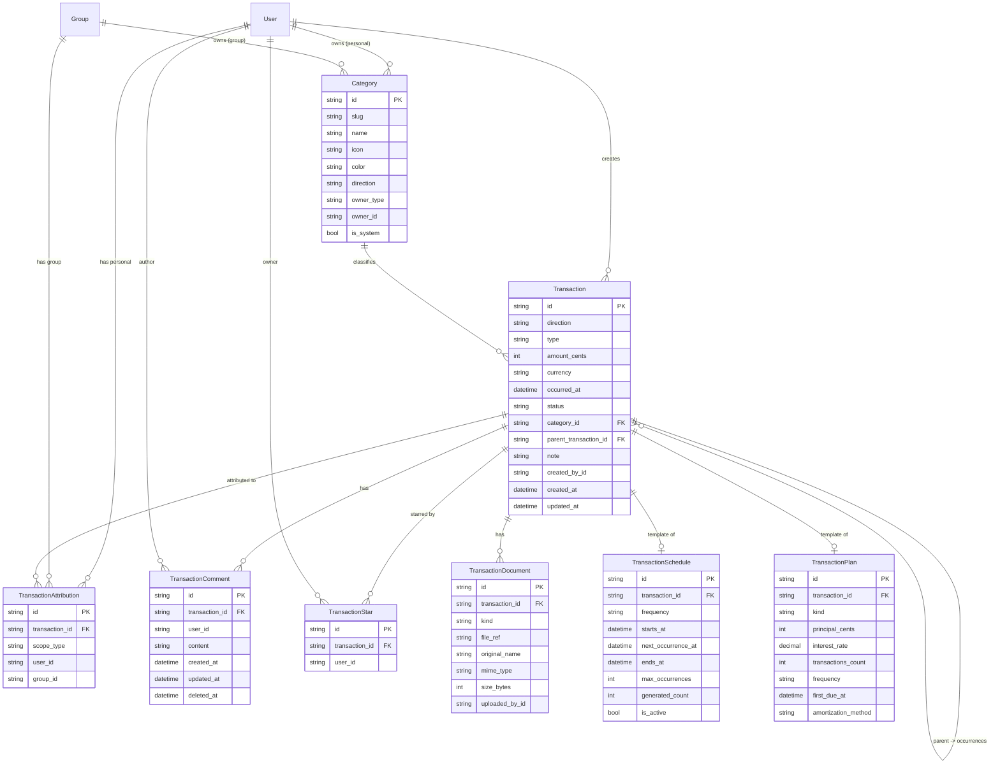
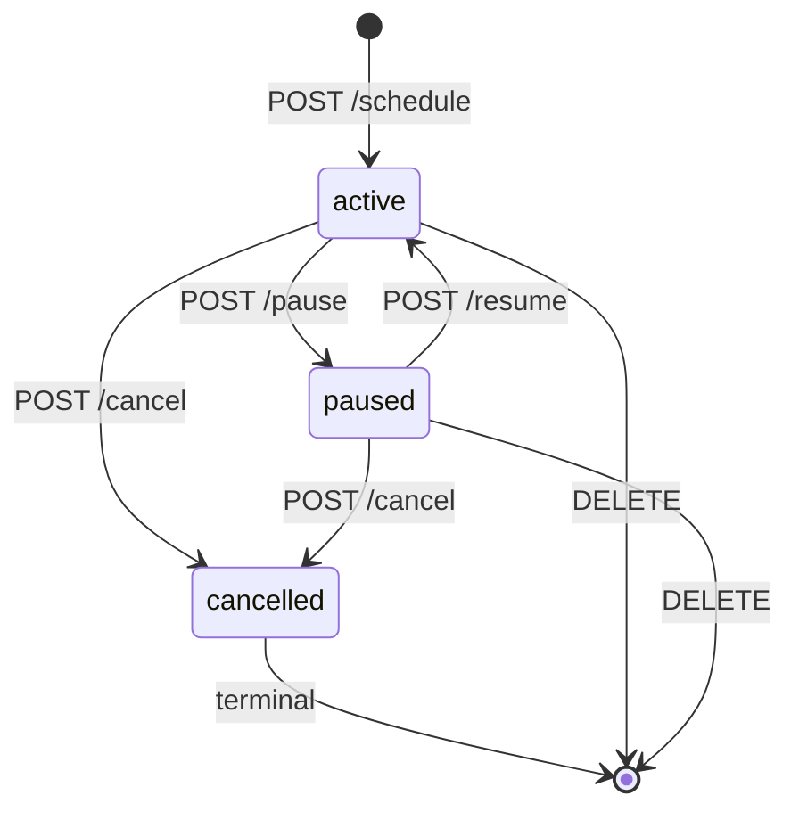

# Phase 6: Transaction Management — Design Document

> **Status**: Approved 2026-04-25 · Replaces original Phase 6 (Income) + Phase 7 (Expense) · 21 iterations
>
> **Dependencies**: Phase 5 (Group Management) complete.

## Table of Contents

- [1. Overview](#1-overview)
- [2. Core Concepts](#2-core-concepts)
- [3. Architecture](#3-architecture)
- [4. Database Schema](#4-database-schema)
- [5. API Design](#5-api-design)
- [6. Frontend Design](#6-frontend-design)
- [7. DRY / Symmetry Rules](#7-dry--symmetry-rules)
- [8. Shared Package Extensions](#8-shared-package-extensions)
- [9. Iteration Plan (6.1 – 6.21)](#9-iteration-plan-61--621)
- [10. Testing Strategy](#10-testing-strategy)
- [11. Deployment, Migrations, Workers](#11-deployment-migrations-workers)
- [12. Extendability & Out-of-Scope](#12-extendability--out-of-scope)

---

## 1. Overview

Phase 6 unifies **incomes** and **expenses** into a single **Transaction** entity whose `direction` field (`IN` / `OUT`) distinguishes the flow. All CRUD flows, categories, attributions, scheduling, stars, comments, and UI components are shared between the two directions — the only difference is the direction toggle and which default category set appears in the picker.

The phase delivers:

- A single **`/dashboard`** page with aggregated totals, recent activity, starred transactions, and entry points to per-scope views.
- An **expanded view per scope** — personal transactions at `/transactions?scope=personal` and group transactions embedded in the existing `/groups/[groupId]` page.
- A **single transaction detail page** at `/transactions/:id` showing the amount, note, documents (placeholder for Phase 9), comments thread, and star toggle.
- **Categories** — system defaults + user- and group-scoped custom categories.
- **Transaction types**: `ONE_TIME`, `RECURRING`, `LIMITED_PERIOD`, `INSTALLMENT`, `LOAN`, `MORTGAGE`.
- **Recurring engine** (BullMQ cron worker) that auto-creates occurrences and recovers from missed runs.
- **Amortization service** for installments and loans.

### User stories covered (from [`SPECIFICATION-USER-STORIES.md`](../SPECIFICATION-USER-STORIES.md:1))

- Personal user: define income types (one-time, limited-period, regular), add expenses, assign categories.
- Personal / group user: attribute purchases to personal, group, or both; remember last choice.
- Web app user: table/grid view with add/edit/delete/filter/sort, notes, (placeholder) receipt attachment.
- Group member: see group expenses/incomes; view per-member contributions via the comments/audit trail.

### User stories **deferred** to later phases

| Story                                                                      | Phase  |
| -------------------------------------------------------------------------- | ------ |
| Receipt upload (photos, PDFs, URLs), OCR, LLM extraction                   | 9 & 15 |
| Purchase places/stores/goods analytics, price history                      | 10     |
| Notifications (email, Telegram, push) about due transactions / low balance | 8, 11  |
| Telegram bot + mini-app transaction entry                                  | 11–13  |
| LLM-based Q&A on finances                                                  | 15     |

---

## 2. Core Concepts

### 2.1 Direction

```ts
export type TransactionDirection = 'IN' | 'OUT';
```

- `IN` = income (positive to balance).
- `OUT` = expense (negative to balance).

No separate "income" or "expense" entity — one table, one code path.

### 2.2 Transaction types

| Type             | Description                                                           | Backing data                                           |
| ---------------- | --------------------------------------------------------------------- | ------------------------------------------------------ |
| `ONE_TIME`       | Single occurrence at a specific date.                                 | `Transaction` row only.                                |
| `RECURRING`      | Repeats indefinitely on a fixed frequency.                            | `Transaction` row + `TransactionSchedule`.             |
| `LIMITED_PERIOD` | Repeats on a frequency but with a fixed end (date or count).          | `Transaction` row + `TransactionSchedule` with bounds. |
| `INSTALLMENT`    | Fixed count of equal transactions, optional interest (e.g. 0 % BNPL). | `Transaction` row + `TransactionPlan` + N occurrences. |
| `LOAN`           | Amortised principal + interest over N transactions.                   | `Transaction` row + `TransactionPlan` + N occurrences. |
| `MORTGAGE`       | Same as loan; kept as a distinct label for UX clarity.                | Same as `LOAN`.                                        |

The "parent" [`Transaction`](../apps/api/prisma/schema.prisma:1) row acts as the **template** for schedules/plans. Every generated occurrence is itself a `Transaction` row with `parentTransactionId` set to the template.

### 2.3 Attribution model

A single transaction can be attributed to multiple **scopes**. A scope is either the user's own personal account or a group.

```
Transaction (1) ─── has many ──▶ TransactionAttribution
                                  │
                                  ├─ scopeType: 'personal' | 'group'
                                  ├─ userId  (when scopeType = 'personal')
                                  └─ groupId (when scopeType = 'group')
```

A user **accesses** a transaction if **any** of its attributions matches:

- `scopeType='personal' AND userId = currentUser`, or
- `scopeType='group' AND currentUser ∈ group.memberships`.

### 2.4 Delete semantics

Two delete operations:

1. **Delete from current scope** — default. Removes one `TransactionAttribution`. The transaction row stays alive if any other attribution remains.
2. **Delete from all accessible scopes** — removes attributions **only in scopes the current user controls** (their personal + groups where they are a member). Other users' personal attributions and non-member-group attributions are left untouched.

When the last attribution is removed, the `Transaction` row (and its comments, stars, schedule/plan, documents) are hard-deleted via cascade.

### 2.5 Star / favourite

A per-user toggle (`TransactionStar` unique `(transactionId, userId)`), not a shared flag. Each user has their own starred collection. Star is allowed for any transaction the user can access.

### 2.6 Comments

Any user who can access a transaction can comment on it. Comments support plain text initially; markdown/mentions/hashtags deferred to later phases. Only the author can edit or delete their own comment (soft-delete → `deletedAt`). Group admins **cannot** delete others' comments in this phase (kept simple; revisit if abused).

### 2.7 Documents (placeholder)

`TransactionDocument` schema is created now so later phases can attach files without migrations:

- `kind`: `image` | `pdf` | `url` | `other`.
- `fileRef`: local path or URL.
- `uploadedById`, `mimeType`, `size`, `originalName`.

No upload UI in this phase — only a placeholder section on the detail page stating "Receipts & attachments coming in Phase 9".

---

## 3. Architecture

### 3.1 API (NestJS) module layout

```
apps/api/src/
  transaction/
    transaction.module.ts
    transaction.controller.ts             # /transactions/*
    transaction.service.ts                # CRUD + attribution logic
    transaction-comment.controller.ts     # /transactions/:id/comments
    transaction-comment.service.ts
    transaction-star.controller.ts        # /transactions/:id/star (toggle)
    transaction-schedule.service.ts       # RECURRING / LIMITED_PERIOD
    transaction-plan.service.ts           # INSTALLMENT / LOAN / MORTGAGE
    transaction-recurring.processor.ts    # BullMQ cron worker
    amortization.util.ts              # Pure amortization math
    guards/
      transaction-access.guard.ts         # user can access transaction (any scope match)
      transaction-owner.guard.ts          # user is creator
    constants/
      transaction-errors.ts
    dto/
      create-transaction.dto.ts
      update-transaction.dto.ts
      list-transactions-query.dto.ts
      delete-transaction.query.dto.ts
      create-transaction-schedule.dto.ts
      create-transaction-plan.dto.ts
      create-comment.dto.ts
      update-comment.dto.ts
  category/
    category.module.ts
    category.controller.ts
    category.service.ts
    dto/
      create-category.dto.ts
      update-category.dto.ts
    constants/
      default-categories.ts
```

Registered in [`AppModule`](../apps/api/src/app.module.ts:1) alongside existing modules.

### 3.2 Frontend (Next.js) layout

```
apps/web/src/
  app/[locale]/
    dashboard/page.tsx                   # Aggregated dashboard (updated)
    transactions/
      page.tsx                           # Expanded transactions list (/transactions?scope=...)
      [transactionId]/page.tsx               # Single transaction detail
      starred/page.tsx                   # Starred transactions (optional; filter also available in list)
    groups/[groupId]/page.tsx            # Adds a "Transactions" tab using <TransactionsList>
  components/
    transaction/
      TransactionsList.tsx                   # Generic filter/sort/list component
      TransactionRow.tsx                     # Single row with star, controls
      TransactionFormDialog.tsx              # Add / edit (ONE_TIME, RECURRING, etc.)
      TransactionDetail.tsx                  # Used by detail page
      TransactionCommentList.tsx             # Comment thread
      TransactionCommentInput.tsx            # Comment composer
      TransactionScopeSelector.tsx           # Multi-select: personal + my groups
      TransactionCategoryPicker.tsx          # Hierarchical categories
      TransactionTypeSelector.tsx            # One-time / recurring / installment / loan
      TransactionAmountInput.tsx             # Amount + currency
      TransactionsFilters.tsx                # Date range, direction, category, starred, scope
      TransactionPlanTable.tsx               # Amortization table
      TransactionScheduleSummary.tsx         # Next occurrence, frequency display
    category/
      CategoryManager.tsx                # List/create/edit/delete (personal + group)
    dashboard/
      TotalsCard.tsx                     # Income / expense / net this period
      RecentActivity.tsx                 # Recent transactions across all scopes
      StarredTransactions.tsx                # Starred section
      ScopeEntryCards.tsx                # Personal + per-group links
  lib/
    transaction/
      transaction-context.tsx                # Transaction state + API calls
      types.ts
      formatters.ts                      # formatAmount, formatDate, currency helpers
      remember.ts                        # localStorage helper for last-used scope
```

### 3.3 Worker / scheduler

A dedicated **BullMQ** queue + worker process handles recurring-transaction generation:

- Queue name: `transaction-recurring`.
- Scheduled job: cron `0 * * * *` (hourly) → checks all active `TransactionSchedule` rows whose `nextOccurrenceAt <= now`.
- For each due schedule: creates the occurrence `Transaction` row (copies direction, amount, currency, category, note, attributions from the parent) inside a transaction, then advances `nextOccurrenceAt` using the frequency, and respects `endDate` / `occurrenceCount`.
- Catch-up: if the worker was down, it iterates `nextOccurrenceAt` forward generating every missed occurrence (capped at 100 per run per schedule to protect against runaway loops).
- For `INSTALLMENT` / `LOAN` / `MORTGAGE`, all occurrences are **pre-generated** at plan creation time — the worker only flips `status` from `PENDING` to `DUE` when `occurredAt <= now`. This keeps amortization deterministic and auditable.

### 3.4 Worker deployment

BullMQ worker runs in-process inside the existing API container. Cron triggers use `@nestjs/schedule` (already in [`app.module.ts`](../apps/api/src/app.module.ts:22)) with a BullMQ client connected to the existing Redis instance (already declared in Docker Compose for every environment).

---

## 4. Database Schema

### 4.1 Mermaid ER diagram



### 4.2 Prisma schema (additions)

Stored as one migration `20260425_phase6_transactions` so blue-green deploy stays additive (expand-only).

```prisma
// ── Phase 6: Transaction Management ──

enum TransactionDirection { IN  OUT }
// Prisma w/ MySQL: use String + @db.VarChar(N) + app-level validation to stay flexible.

model Transaction {
  id               String    @id @default(uuid()) @db.VarChar(36)
  direction        String    @db.VarChar(3)   // 'IN' | 'OUT'
  type             String    @db.VarChar(20)  // 'ONE_TIME' | 'RECURRING' | ...
  amountCents      Int       @map("amount_cents")
  currency         String    @db.VarChar(3)
  occurredAt       DateTime  @map("occurred_at")
  status           String    @default("POSTED") @db.VarChar(20) // 'POSTED' | 'PENDING' | 'DUE' | 'CANCELLED'
  categoryId       String    @map("category_id") @db.VarChar(36)
  category         Category  @relation(fields: [categoryId], references: [id])
  parentTransactionId  String?   @map("parent_transaction_id") @db.VarChar(36)
  parent           Transaction?  @relation("TransactionOccurrences", fields: [parentTransactionId], references: [id], onDelete: Cascade)
  occurrences      Transaction[] @relation("TransactionOccurrences")
  note             String?   @db.Text
  createdById      String    @map("created_by_id") @db.VarChar(36)
  createdAt        DateTime  @default(now()) @map("created_at")
  updatedAt        DateTime  @updatedAt @map("updated_at")

  attributions TransactionAttribution[]
  comments     TransactionComment[]
  stars        TransactionStar[]
  documents    TransactionDocument[]
  schedule     TransactionSchedule?
  plan         TransactionPlan?

  @@index([direction, occurredAt])
  @@index([categoryId])
  @@index([createdById, occurredAt])
  @@index([parentTransactionId])
  @@index([type, status])
  @@map("transactions")
}

model TransactionAttribution {
  id        String   @id @default(uuid()) @db.VarChar(36)
  transactionId String   @map("transaction_id") @db.VarChar(36)
  transaction   Transaction  @relation(fields: [transactionId], references: [id], onDelete: Cascade)
  scopeType String   @map("scope_type") @db.VarChar(10) // 'personal' | 'group'
  userId    String?  @map("user_id") @db.VarChar(36)
  groupId   String?  @map("group_id") @db.VarChar(36)
  createdAt DateTime @default(now()) @map("created_at")

  @@unique([transactionId, scopeType, userId, groupId], name: "transaction_scope_unique")
  @@index([userId, scopeType])
  @@index([groupId, scopeType])
  @@index([transactionId])
  @@map("transaction_attributions")
}

model Category {
  id          String   @id @default(uuid()) @db.VarChar(36)
  slug        String   @db.VarChar(64)      // stable i18n key, e.g. "groceries"
  name        String   @db.VarChar(100)     // display name (locale fallback: English)
  icon        String?  @db.VarChar(32)      // optional icon key
  color       String?  @db.VarChar(16)      // optional hex color
  direction   String   @db.VarChar(3)       // 'IN' | 'OUT' | 'BOTH'
  ownerType   String   @map("owner_type") @db.VarChar(10) // 'system' | 'user' | 'group'
  ownerId     String?  @map("owner_id") @db.VarChar(36)
  isSystem    Boolean  @default(false) @map("is_system")
  createdAt   DateTime @default(now()) @map("created_at")
  updatedAt   DateTime @updatedAt @map("updated_at")

  transactions Transaction[]

  @@unique([ownerType, ownerId, slug, direction], name: "category_owner_slug_unique")
  @@index([ownerType, ownerId])
  @@index([direction])
  @@map("categories")
}

model TransactionSchedule {
  id                String    @id @default(uuid()) @db.VarChar(36)
  transactionId         String    @unique @map("transaction_id") @db.VarChar(36)
  transaction           Transaction   @relation(fields: [transactionId], references: [id], onDelete: Cascade)
  frequency         String    @db.VarChar(20) // 'DAILY' | 'WEEKLY' | 'BIWEEKLY' | 'MONTHLY' | 'QUARTERLY' | 'ANNUAL'
  interval          Int       @default(1)     // e.g. every 2 weeks
  startsAt          DateTime  @map("starts_at")
  nextOccurrenceAt  DateTime  @map("next_occurrence_at")
  endsAt            DateTime? @map("ends_at")
  maxOccurrences    Int?      @map("max_occurrences")
  generatedCount    Int       @default(0) @map("generated_count")
  isActive          Boolean   @default(true) @map("is_active")
  createdAt         DateTime  @default(now()) @map("created_at")
  updatedAt         DateTime  @updatedAt @map("updated_at")

  @@index([isActive, nextOccurrenceAt])
  @@map("transaction_schedules")
}

model TransactionPlan {
  id                  String    @id @default(uuid()) @db.VarChar(36)
  transactionId           String    @unique @map("transaction_id") @db.VarChar(36)
  transaction             Transaction   @relation(fields: [transactionId], references: [id], onDelete: Cascade)
  kind                String    @db.VarChar(20) // 'INSTALLMENT' | 'LOAN' | 'MORTGAGE'
  principalCents      Int       @map("principal_cents")
  interestRate        Decimal   @default(0) @map("interest_rate") @db.Decimal(8, 6) // annual APR
  transactionsCount       Int       @map("transactions_count")
  frequency           String    @db.VarChar(20) // typically MONTHLY
  firstDueAt          DateTime  @map("first_due_at")
  amortizationMethod  String    @default("french") @map("amortization_method") @db.VarChar(16)
  createdAt           DateTime  @default(now()) @map("created_at")
  updatedAt           DateTime  @updatedAt @map("updated_at")

  @@map("transaction_plans")
}

model TransactionDocument {
  id            String   @id @default(uuid()) @db.VarChar(36)
  transactionId     String   @map("transaction_id") @db.VarChar(36)
  transaction       Transaction  @relation(fields: [transactionId], references: [id], onDelete: Cascade)
  kind          String   @db.VarChar(20) // 'image' | 'pdf' | 'url' | 'other'
  fileRef       String   @map("file_ref") @db.VarChar(500)
  originalName  String?  @map("original_name") @db.VarChar(255)
  mimeType      String?  @map("mime_type") @db.VarChar(100)
  sizeBytes     Int?     @map("size_bytes")
  uploadedById  String   @map("uploaded_by_id") @db.VarChar(36)
  createdAt     DateTime @default(now()) @map("created_at")

  @@index([transactionId])
  @@map("transaction_documents")
}

model TransactionComment {
  id         String    @id @default(uuid()) @db.VarChar(36)
  transactionId  String    @map("transaction_id") @db.VarChar(36)
  transaction    Transaction   @relation(fields: [transactionId], references: [id], onDelete: Cascade)
  userId     String    @map("user_id") @db.VarChar(36)
  content    String    @db.Text
  createdAt  DateTime  @default(now()) @map("created_at")
  updatedAt  DateTime  @updatedAt @map("updated_at")
  deletedAt  DateTime? @map("deleted_at")

  @@index([transactionId, createdAt])
  @@index([userId])
  @@map("transaction_comments")
}

model TransactionStar {
  id        String   @id @default(uuid()) @db.VarChar(36)
  transactionId String   @map("transaction_id") @db.VarChar(36)
  transaction   Transaction  @relation(fields: [transactionId], references: [id], onDelete: Cascade)
  userId    String   @map("user_id") @db.VarChar(36)
  createdAt DateTime @default(now()) @map("created_at")

  @@unique([transactionId, userId])
  @@index([userId, createdAt])
  @@map("transaction_stars")
}
```

### 4.3 Indexing strategy

- **Read patterns**: most queries are "transactions visible to user X, in scope S, over date range D, direction Dir, category C".
- **Primary index for personal listing**: `transaction_attributions (user_id, scope_type)` → drives the initial scope filter; then joined to `transactions` ordered by `occurred_at DESC`.
- **Group listing**: `transaction_attributions (group_id, scope_type)` analogue.
- **Date range**: `transactions (direction, occurred_at)` + `transactions (created_by_id, occurred_at)`.
- **Category aggregation** (Phase 10): `transactions (category_id, occurred_at)`.
- **Recurring worker**: `transaction_schedules (is_active, next_occurrence_at)` partial-covers the hot path.

### 4.4 User & Group model updates

```prisma
model User {
  // existing fields ...
  transactionAttributions TransactionAttribution[] @relation(..., fields: [id], references: [userId])
  transactionComments     TransactionComment[]
  transactionStars        TransactionStar[]
  categoriesOwned     Category[]           // filtered on owner_type='user'
  transactionsCreated     Transaction[]
  transactionDocuments    TransactionDocument[]
}

model Group {
  // existing fields ...
  transactionAttributions TransactionAttribution[]
  categoriesOwned     Category[]           // filtered on owner_type='group'
}
```

(Exact Prisma relation annotations are finalised in iteration 6.2. Relations on `User` to `TransactionAttribution.userId` use explicit `@relation` with `fields`/`references` matching the foreign-key columns.)

---

## 5. API Design

All endpoints are under `/api/v1`. All require `JwtAuthGuard` unless noted.

### 5.1 Categories

| Method | Endpoint          | Auth + Guard             | Description                                                                                                      |
| ------ | ----------------- | ------------------------ | ---------------------------------------------------------------------------------------------------------------- | -------------------- | -------- | ----------- |
| GET    | `/categories`     | JWT                      | List categories visible to user: system + user + member groups. Query: `direction=IN                             | OUT`, `scope=system  | personal | group:<id>` |
| POST   | `/categories`     | JWT                      | Create a category. Body: `{ name, slug?, icon?, color?, direction, scope: 'personal'                             | 'group', groupId? }` |
| PATCH  | `/categories/:id` | JWT + CategoryOwnerGuard | Update (owner or group admin only). Cannot edit `is_system`.                                                     |
| DELETE | `/categories/:id` | JWT + CategoryOwnerGuard | Delete (owner or group admin). Reject if any transaction uses it; require `force=true` to reassign to a default. |

Default slugs (seeded):

- `OUT`: `groceries`, `home`, `restaurants`, `transport`, `utilities`, `health`, `entertainment`, `clothing`, `travel`, `education`, `taxes`, `fees`, `insurance`, `gifts`, `other`.
- `IN`: `salary`, `bonus`, `freelance`, `investment`, `refund`, `gift`, `other`.

### 5.2 Transactions

| Method | Endpoint                                | Guard                          | Description                                                                                  |
| ------ | --------------------------------------- | ------------------------------ | -------------------------------------------------------------------------------------------- |
| POST   | `/transactions`                         | JWT                            | Create transaction + attributions + optional schedule/plan.                                  |
| GET    | `/transactions`                         | JWT                            | List with cursor pagination & filters (see below).                                           |
| GET    | `/transactions/:id`                     | JWT + `TransactionAccessGuard` | Get single transaction + attributions + category + schedule/plan + counts (comments, stars). |
| PATCH  | `/transactions/:id`                     | JWT + `TransactionOwnerGuard`  | Update mutable fields (creator only).                                                        |
| DELETE | `/transactions/:id`                     | JWT + `TransactionAccessGuard` | Delete attribution; `?scope=all` removes all accessible; when 0 attributions left, row gone. |
| POST   | `/transactions/:id/star`                | JWT + `TransactionAccessGuard` | Toggle star for current user. Response: `{ starred: boolean }`.                              |
| GET    | `/transactions/:id/comments`            | JWT + `TransactionAccessGuard` | List comments (cursor paginated).                                                            |
| POST   | `/transactions/:id/comments`            | JWT + `TransactionAccessGuard` | Create comment.                                                                              |
| PATCH  | `/transactions/:id/comments/:commentId` | JWT + comment-author           | Update own comment.                                                                          |
| DELETE | `/transactions/:id/comments/:commentId` | JWT + comment-author           | Soft-delete own comment.                                                                     |

#### `POST /transactions` body

```jsonc
{
  "direction": "OUT",
  "type": "ONE_TIME", // or RECURRING / LIMITED_PERIOD / INSTALLMENT / LOAN / MORTGAGE
  "amountCents": 1250,
  "currency": "USD",
  "occurredAt": "2026-04-25", // ISO date
  "categoryId": "uuid-of-category",
  "note": "Monthly milk", // optional
  "attributions": [{ "scope": "personal" }, { "scope": "group", "groupId": "uuid-of-group" }],
  "schedule": {
    // required when type=RECURRING|LIMITED_PERIOD
    "frequency": "MONTHLY",
    "interval": 1,
    "startsAt": "2026-04-25",
    "endsAt": null,
    "maxOccurrences": 12, // for LIMITED_PERIOD
  },
  "plan": {
    // required when type=INSTALLMENT|LOAN|MORTGAGE
    "kind": "INSTALLMENT",
    "principalCents": 120000,
    "interestRate": 0.0,
    "transactionsCount": 12,
    "frequency": "MONTHLY",
    "firstDueAt": "2026-05-25",
    "amortizationMethod": "equal", // 'equal' for zero-interest installments, 'french' for loans
  },
}
```

Validation rules (enforced in `TransactionService`):

- Attributions non-empty.
- Each attribution references either current user's personal or a group where current user is a member.
- Category must be visible to the user (system OR owned by user OR owned by a group the user is in).
- Category's `direction` must equal transaction `direction` (or `BOTH`).
- `schedule` or `plan` presence matches the `type`.
- `amountCents > 0`.
- `occurredAt <= today` for `ONE_TIME` (allow future dates for scheduled/plan occurrences).

#### `GET /transactions` query

```
?scope=personal                 # personal-only
?scope=group:<id>               # single group
?scope=all                      # default — all accessible
?direction=IN|OUT
?categoryId=<id>
?from=2026-01-01&to=2026-12-31
?starred=true
?type=ONE_TIME
?search=<text>                  # against note
?sort=date_desc|date_asc|amount_desc|amount_asc
?limit=20&cursor=<opaque>
```

Returns the shared pagination envelope:

```jsonc
{
  "data": [ TransactionSummaryDto ],
  "nextCursor": "...",
  "hasMore": true
}
```

`TransactionSummaryDto` is a flattened view with:

```jsonc
{
  "id", "direction", "type", "amountCents", "currency",
  "occurredAt", "status",
  "category": { "id", "slug", "name", "icon", "color" },
  "attributions": [ { "scope", "userId?", "groupId?", "groupName?" } ],
  "note",
  "commentCount", "starredByMe", "hasDocuments",
  "parentTransactionId", "schedule?", "plan?",
  "createdById", "createdAt", "updatedAt"
}
```

#### `DELETE /transactions/:id` semantics

```
DELETE /transactions/:id                 # remove attribution for current scope (see body/query below)
DELETE /transactions/:id?scope=personal  # explicit: remove personal attribution
DELETE /transactions/:id?scope=group:<groupId>   # remove specific group attribution
DELETE /transactions/:id?scope=all       # remove every accessible attribution
```

Response: `{ deletedAttributions: 2, transactionDeleted: true|false }`.

### 5.3 Stars

| Method | Endpoint                 |
| ------ | ------------------------ |
| POST   | `/transactions/:id/star` |

Toggles (create if missing, delete if present). Returns `{ starred }`.

### 5.4 Comments

Paginated under the parent transaction; all bodies use a simple `{ content: string (1..2000) }`.

### 5.5 Schedules

| Method | Endpoint                     | Description                                                      |
| ------ | ---------------------------- | ---------------------------------------------------------------- |
| POST   | `/transactions/:id/schedule` | Attach a schedule to an existing ONE_TIME transaction (convert). |
| PATCH  | `/transactions/:id/schedule` | Update frequency/interval/ends/max (creator only).               |
| DELETE | `/transactions/:id/schedule` | Deactivate (`isActive=false`); keep row for audit.               |

`POST /transactions` with `type=RECURRING|LIMITED_PERIOD` creates the schedule atomically — these endpoints are for post-hoc edits.

#### Recurring occurrences listing (iteration 6.18.1.3)

Two ways to enumerate the occurrences generated from a recurring parent:

1. **Query filter on `/transactions`** — `?parentTransactionId=<uuid>` narrows the
   listing to occurrences whose `parentTransactionId === <uuid>`. Visibility on
   the parent is enforced (404 leak-free) so a non-member cannot probe child
   ids by guessing a parent uuid.
2. **Ergonomic alias** — `GET /transactions/:transactionId/occurrences` is a thin
   wrapper that forces the parent filter from the path param. Same
   visibility rules; same cursor pagination + sort knobs as the main list
   endpoint.

The filter UI control for "occurrences only / parents only / both" lands in
iteration 6.18.3. The wire shape of the partition is already public:

| Param        | Values           | Effect                                                                                                                               |
| ------------ | ---------------- | ------------------------------------------------------------------------------------------------------------------------------------ |
| `withParent` | `true` / `false` | `true` → only parents (`parentTransactionId === null`); `false` → only occurrences (`parentTransactionId !== null`); omitted → both. |

Combined with `parentTransactionId` it is a no-op (the identity filter wins).
URL state on `/transactions` carries a `childScope=parents|occurrences` key
(default `all`, omitted from the URL) which the frontend translates into
the API's `withParent` partition.

### 5.6 Plans

| Method | Endpoint                 | Description                                                                          |
| ------ | ------------------------ | ------------------------------------------------------------------------------------ |
| POST   | `/transactions/:id/plan` | Attach a plan to an existing ONE_TIME (creates the amortization schedule).           |
| GET    | `/transactions/:id/plan` | Return plan metadata + amortization table.                                           |
| PATCH  | `/transactions/:id/plan` | Update plan (regenerates unpaid occurrences). Only allowed while no occurrence paid. |
| DELETE | `/transactions/:id/plan` | Cancel plan; cascades to pending occurrences (CANCELLED status, never removed).      |

The initial flow creates plan via `POST /transactions` — these endpoints exist for advanced edits.

### 5.7 Error codes

```ts
export const TRANSACTION_ERRORS = {
  TRANSACTION_NOT_FOUND: 'TRANSACTION_NOT_FOUND',
  TRANSACTION_ACCESS_DENIED: 'TRANSACTION_ACCESS_DENIED',
  TRANSACTION_NOT_OWNER: 'TRANSACTION_NOT_OWNER',
  TRANSACTION_INVALID_AMOUNT: 'TRANSACTION_INVALID_AMOUNT',
  TRANSACTION_INVALID_DATE: 'TRANSACTION_INVALID_DATE',
  TRANSACTION_INVALID_CATEGORY: 'TRANSACTION_INVALID_CATEGORY',
  TRANSACTION_CATEGORY_DIRECTION_MISMATCH: 'TRANSACTION_CATEGORY_DIRECTION_MISMATCH',
  TRANSACTION_NO_ATTRIBUTIONS: 'TRANSACTION_NO_ATTRIBUTIONS',
  TRANSACTION_INVALID_ATTRIBUTION: 'TRANSACTION_INVALID_ATTRIBUTION',
  TRANSACTION_ATTRIBUTION_OUT_OF_SCOPE: 'TRANSACTION_ATTRIBUTION_OUT_OF_SCOPE',
  TRANSACTION_SCHEDULE_REQUIRED: 'TRANSACTION_SCHEDULE_REQUIRED',
  TRANSACTION_PLAN_REQUIRED: 'TRANSACTION_PLAN_REQUIRED',
  TRANSACTION_CANNOT_EDIT_GENERATED_OCCURRENCE: 'TRANSACTION_CANNOT_EDIT_GENERATED_OCCURRENCE',
  TRANSACTION_COMMENT_NOT_FOUND: 'TRANSACTION_COMMENT_NOT_FOUND',
  TRANSACTION_COMMENT_NOT_AUTHOR: 'TRANSACTION_COMMENT_NOT_AUTHOR',
  CATEGORY_NOT_FOUND: 'CATEGORY_NOT_FOUND',
  CATEGORY_NOT_OWNER: 'CATEGORY_NOT_OWNER',
  CATEGORY_IN_USE: 'CATEGORY_IN_USE',
} as const;
```

### 5.8 Rate limiting

| Action                           | Limit       |
| -------------------------------- | ----------- |
| Create/update/delete transaction | `30 / min`  |
| Create comment                   | `20 / min`  |
| Toggle star                      | `60 / min`  |
| List transactions                | `120 / min` |
| Category CRUD                    | `20 / min`  |

Applied via the existing `@CustomThrottle()` decorator.

---

## 6. Frontend Design

### 6.1 Routing

| Path                                      | Purpose                                                       |
| ----------------------------------------- | ------------------------------------------------------------- |
| `/dashboard`                              | Aggregated overview with totals, recent, starred, scope cards |
| `/transactions`                           | Expanded list (default `scope=all`)                           |
| `/transactions?scope=personal`            | Personal-only list                                            |
| `/transactions?scope=group:<id>`          | Group-only list (also accessible as a tab on group page)      |
| `/transactions/starred`                   | Starred-only list (shortcut for `?starred=true`)              |
| `/transactions/:id`                       | Single transaction detail (note, docs, comments, star)        |
| `/groups/[groupId]`                       | Group dashboard with embedded Transactions tab                |
| `/settings/account` → Categories section  | Personal category management                                  |
| `/groups/[groupId]/settings` → Categories | Group category management (admins)                            |

### 6.2 Dashboard layout (6.15)

```
┌───────────────────────────── /dashboard ─────────────────────────────┐
│ [ Totals card: this month • In / Out / Net ]                         │
│ [ Quick action: + Add transaction (opens dialog with last-used scopes) ] │
├──────────────────────────────────────────────────────────────────────┤
│ [ Scope entry cards (grid) ]                                         │
│   ┌ Personal ┐  ┌ Family ┐  ┌ Work team ┐ ...                        │
│   └──────────┘  └────────┘  └───────────┘                            │
├──────────────────────────────────────────────────────────────────────┤
│ [ Recent activity: TransactionsList (limit=10, sort=date_desc) ]         │
├──────────────────────────────────────────────────────────────────────┤
│ [ Starred: TransactionsList (filter starred, limit=5) ]                  │
└──────────────────────────────────────────────────────────────────────┘
```

### 6.3 TransactionsList component (6.12)

Props:

```ts
interface TransactionsListProps {
  scope?: 'all' | 'personal' | { groupId: string };
  initialFilters?: Partial<TransactionsFilters>;
  showFilters?: boolean; // default true
  showControls?: boolean; // edit/delete; default true
  showStar?: boolean; // default true
  limit?: number; // 20 default
  emptyState?: React.ReactNode;
  onTransactionClick?: (id: string) => void;
}
```

Renders a filter/sort bar, responsive table (desktop) / card list (mobile) with columns: **Date · Direction · Amount · Category · Scope(s) · Note · ★ · Controls**. Infinite scroll / "Load more" via cursor.

### 6.4 TransactionFormDialog (6.13)

- Direction toggle (In / Out) — defaults to the value chosen last time (`remember.ts`).
- Amount + currency picker (defaults to user's default currency, or first selected scope's default).
- Date picker (defaults to today).
- Category picker grouped by `direction` and owner (system / personal / per-group).
- **Scope multi-select**: checkbox list: `☐ Personal  ☐ Family  ☐ Work team ...`. Defaults to last-used set.
- Note (textarea, optional).
- Type selector with a disclosure: _Default is one-time. Click to make recurring, installment, or loan._
- Type-specific sub-forms render when expanded (frequency, end date, principal + rate + count).
- "Save" calls `POST /transactions` or `PATCH /transactions/:id`; persists last-used scopes/direction to localStorage.

### 6.5 Transaction detail page (6.14)

```
┌ /transactions/:id ────────────────────────────────────────────────┐
│ [← Back]                                                     │
│ { direction badge }  { type badge }  { status pill }          │
│ Amount: $12.50  Currency: USD   Date: 2026-04-25              │
│ Category: Groceries                                           │
│ Attributions: Personal · Family (link)                        │
│ Note: "weekly shopping"                                       │
│ [ Star ★ ]  [ Edit ]  [ Delete ]                              │
├───────────────────────────────────────────────────────────────┤
│ Documents                                                     │
│   (Phase 9 placeholder)                                       │
├───────────────────────────────────────────────────────────────┤
│ Comments                                                      │
│   Alice — 2d ago — "Nice deal!"                               │
│   Bob  — 1d ago — "Next week I'll pay"                        │
│   [ textarea ]  [ Post ]                                      │
├───────────────────────────────────────────────────────────────┤
│ Schedule / Plan (if any)                                      │
│   "RECURRING · MONTHLY · next on …"  [ Pause ] [ Cancel ]     │
│                                                               │
│   or amortisation table for LOAN/INSTALLMENT                  │
└───────────────────────────────────────────────────────────────┘
```

### 6.6 Group dashboard Transactions tab (6.16)

The existing [`/groups/[groupId]/page.tsx`](../apps/web/src/app/[locale]/groups/[groupId]/page.tsx:1) gets a new tab list:

```
[ Overview ] [ Transactions ] [ Members ] [ (admin) Settings → ]
```

The **Transactions** tab renders `<TransactionsList scope={{ groupId }} />`. The existing member list remains as a tab.

### 6.7 Categories management UI (6.16)

A simple manager shared by two surfaces:

- Personal: section on `/settings/account` (between Preferences and Delete Account).
- Group: section on `/groups/[groupId]/settings` (below "Group Information").

Both use the same `<CategoryManager ownerType="..." ownerId="..." />` component.

### 6.8 i18n

New translation namespaces:

- `transactions.*` — list, controls, filters, dialogs, detail page.
- `categories.*` — category CRUD + default category display names.
- `dashboard.*` — totals, recent, starred, scope cards.

Both English (`en.json`) and Hebrew (`he.json`) receive the full set. RTL is inherited via existing locale layout — dialogs/tables already respect `dir="rtl"`.

Category display names are served from the API (`name` field), but **system** category slugs have bilingual labels in a client-side dictionary so i18n works without a round-trip:

```ts
const SYSTEM_CATEGORY_I18N: Record<string, { en: string; he: string }> = {
  groceries: { en: 'Groceries', he: 'מכולת' },
  // ...
};
```

If the locale-specific label is missing, fall back to `name` from the API.

---

## 7. DRY / Symmetry Rules

The whole point of merging Phases 6 and 7 is to avoid any "incomes" vs "expenses" duplication. Concrete rules applied throughout the design:

| Rule                                                                                                    | Enforcement                                                                               |
| ------------------------------------------------------------------------------------------------------- | ----------------------------------------------------------------------------------------- | -------------------------- | --------------------------------------------------------------- |
| A **single** `Transaction` table/model for both directions.                                             | [`transactions`](../apps/api/prisma/schema.prisma:1) with `direction` column.             |
| A **single** CRUD service (`TransactionService`) handling both directions.                              | `transaction.service.ts` — no direction-specific methods.                                 |
| A **single** controller and set of endpoints `/transactions/*`.                                         | `transaction.controller.ts`.                                                              |
| A **single** list query with a `direction` filter.                                                      | `GET /transactions?direction=IN                                                           | OUT`.                      |
| A **single** React component for the list (`<TransactionsList>`).                                       | Used on dashboard, personal page, group tab, starred page.                                |
| A **single** add/edit dialog (`<TransactionFormDialog>`) with a direction toggle.                       | Used everywhere transactions are added.                                                   |
| Category schema is direction-aware (`direction IN                                                       | OUT                                                                                       | BOTH`) but uses one table. | `categories` with `direction` column; default seeds cover both. |
| Translations share the `transactions.*` namespace — only labels differ by direction.                    | `transactions.in.*` and `transactions.out.*` only for strings like "Income" vs "Expense". |
| Audit log `action` values follow `TRANSACTION_CREATED` / `TRANSACTION_UPDATED` / `TRANSACTION_DELETED`. | No `INCOME_CREATED` / `EXPENSE_CREATED` split.                                            |
| Error codes prefixed `TRANSACTION_*`.                                                                   | `transaction-errors.ts`.                                                                  |
| `SERVER_NAME`-style secrets re-used; no new `TRANSACTION_DOMAIN`-style vars introduced.                 | Follows [`dna.md`](../.kilocode/rules/dna.md:1).                                          |

---

## 8. Shared Package Extensions

New module [`packages/shared/src/types/transaction.types.ts`](../packages/shared/src/types/transaction.types.ts:1):

```ts
export const TRANSACTION_DIRECTIONS = ['IN', 'OUT'] as const;
export type TransactionDirection = (typeof TRANSACTION_DIRECTIONS)[number];

export const TRANSACTION_TYPES = [
  'ONE_TIME',
  'RECURRING',
  'LIMITED_PERIOD',
  'INSTALLMENT',
  'LOAN',
  'MORTGAGE',
] as const;
export type TransactionType = (typeof TRANSACTION_TYPES)[number];

export const TRANSACTION_STATUSES = ['POSTED', 'PENDING', 'DUE', 'CANCELLED'] as const;
export type TransactionStatus = (typeof TRANSACTION_STATUSES)[number];

export const TRANSACTION_FREQUENCIES = [
  'DAILY',
  'WEEKLY',
  'BIWEEKLY',
  'MONTHLY',
  'QUARTERLY',
  'ANNUAL',
] as const;
export type TransactionFrequency = (typeof TRANSACTION_FREQUENCIES)[number];

export const CATEGORY_OWNER_TYPES = ['system', 'user', 'group'] as const;
export type CategoryOwnerType = (typeof CATEGORY_OWNER_TYPES)[number];

export const ATTRIBUTION_SCOPE_TYPES = ['personal', 'group'] as const;
export type AttributionScopeType = (typeof ATTRIBUTION_SCOPE_TYPES)[number];

export type AttributionScope = { scope: 'personal' } | { scope: 'group'; groupId: string };

export const TRANSACTION_SORTS = ['date_desc', 'date_asc', 'amount_desc', 'amount_asc'] as const;
export type TransactionSort = (typeof TRANSACTION_SORTS)[number];
```

And `packages/shared/src/dto/transaction.dto.ts` with the serialisable DTO shapes (backend emits, frontend consumes).

Default category slugs live in a single module `packages/shared/src/constants/default-categories.ts` so the API seed and the frontend i18n dictionary stay in sync.

---

## 9. Iteration Plan (6.1 – 6.21)

Every iteration **must** include:

1. `pnpm run test` (all workspaces) — **all green**.
2. `npx prettier --write` on every changed file whose extension is covered by the project's prettier config.
3. Commit with a message in the format `feat(phase-6.X): ...` (or `fix`, `docs`, etc.).
4. Push to `develop` and watch the deploy workflow until exit.
5. Ask the user to verify the staging site is functional for what the iteration delivered.
6. Update [`docs/progress.md`](progress.md:1) with iteration details (files changed, tests added, screenshots/links where relevant) and commit that update separately with `docs(phase-6.X): update progress`.

The end of the phase (after 6.21) merges `develop` → `main` and watches the production deploy.

### Part A — Foundations

#### 6.1 Shared types & DTOs

- Add [`packages/shared/src/types/transaction.types.ts`](../packages/shared/src/types/transaction.types.ts:1), [`constants/default-categories.ts`](../packages/shared/src/constants/default-categories.ts:1).
- Extend barrel exports.
- Unit tests (vitest) assert the string-literal arrays are non-empty and roundtrip via `JSON.stringify`.
- No runtime code changes in `api`/`web` yet (types only).

**Acceptance**: `pnpm run test` green; types importable from `@myfinpro/shared`.

#### 6.2 DB schema + migration

- Prisma models from [§4.2](#42-prisma-schema-additions).
- New migration `20260425_phase6_transactions/migration.sql` (expand-only).
- Manual SQL review: all FKs indexed, no destructive ops.
- Run `prisma generate`; confirm integration test setup still works via testcontainers.

**Acceptance**: migration applies cleanly on staging; `npx prisma migrate status` = up-to-date.

#### 6.3 Seed default categories

- `apps/api/prisma/seed.ts` — idempotent upsert of all default categories (system owner) using the slug list from shared.
- Slugs stable; names copy the English label (frontend adds locale display via dictionary).
- Extended to run on deploy (`deploy.sh` already runs `prisma db push`; adapt seed step, or invoke seed as one-off on first deploy only — decision finalised in this iteration).

**Acceptance**: fresh DB has ~22 system categories (15 OUT + 7 IN) with `is_system=true`.

#### 6.4 Categories API

- `CategoryModule`, `CategoryService`, `CategoryController`, DTOs, guard `CategoryOwnerGuard`.
- List combines system + user + member-group categories with the optional direction filter.
- Personal create/update/delete restricted to the user; group-owned restricted to group admins.
- Refusal when a category is in use by any transaction (`CATEGORY_IN_USE`) unless a replacement category is provided.
- Tests: 15+ service + 10+ controller unit tests.

**Acceptance**: Category CRUD works via Swagger; listing returns expected visibility.

### Part B — One-time transaction core API

#### 6.5 Create transaction API

- `TransactionModule`, `TransactionService`, `TransactionController`.
- `POST /transactions` for `type=ONE_TIME` only (schedule/plan branches in later iterations). Validates attributions, category, direction, amounts.
- Transaction: insert `Transaction` + N `TransactionAttribution` rows.
- Audit log: `TRANSACTION_CREATED`.
- Tests: unit + integration (Testcontainers). Permission tests for attribution scoping.

**Acceptance**: can create a personal transaction, a group transaction, and a mixed personal+group transaction via Swagger.

#### 6.6 List transactions API

- `GET /transactions` with filters ([§5.2](#52-transactions)).
- Visibility filter: join `transaction_attributions` on either `user_id=currentUser` or `group_id IN (member-groups)`.
- Cursor pagination using composite cursor `(occurredAt, id)` reversed.
- Efficient query (no N+1; attribute eager-loading with `include: { attributions: true, category: true, _count: { comments, stars } }`).
- Tests: unit + integration with seeded data for each filter combination.

**Acceptance**: lists from seeded data respect every filter; pagination returns correct `nextCursor`.

#### 6.7 Edit + get-one

- `GET /transactions/:id` with `TransactionAccessGuard` (existing access rules).
- `PATCH /transactions/:id` with `TransactionOwnerGuard` (creator only); mutable fields: `amountCents`, `currency`, `occurredAt`, `categoryId`, `note`, `direction` (only while no occurrences exist).
- Attribution edits handled in iteration 6.8 (they share the delete-per-scope code path internally).
- Audit log: `TRANSACTION_UPDATED`.
- Tests: unit + integration.

**Acceptance**: creator can edit; non-creator receives 403; access guard rejects non-members.

#### 6.8 Delete transaction API

- `DELETE /transactions/:id` with query `?scope=personal|group:<id>|all` (default = the scope the caller "owns" by default — personal if they have it, otherwise the single accessible group; explicit error if ambiguous).
- Removes only accessible attributions; hard-deletes row when zero attributions left.
- Audit log: `TRANSACTION_ATTRIBUTION_REMOVED` and optionally `TRANSACTION_DELETED` when the row is removed.
- Internally reused: attribution mutation when `PATCH /transactions/:id` includes new attributions (iteration 6.7 calls through here).
- Tests: unit + integration — including the "other user's personal attribution is preserved" case.

**Acceptance**: delete semantics from [§2.4](#24-delete-semantics) all observable via integration tests.

### Part C — Social features API

#### 6.9 Star/unstar API

- `POST /transactions/:id/star` toggles (create if missing, delete if present).
- Returns `{ starred, starCount }`.
- `GET /transactions?starred=true` already implemented in 6.6 (flag added here).
- Audit log: `TRANSACTION_STARRED` / `TRANSACTION_UNSTARRED` (best-effort — failure does not fail the request).

**Acceptance**: star toggle works; list returns `starredByMe=true` for current user only.

#### 6.10 Comments API

- `GET/POST /transactions/:id/comments`, `PATCH/DELETE /transactions/:id/comments/:commentId`.
- Soft-delete on DELETE (sets `deletedAt`, content replaced with `""`, returns 204).
- List excludes soft-deleted rows by default; admin query `?includeDeleted=true` **not** exposed in this phase.
- Tests: unit + integration with second-user scenarios.

**Acceptance**: users can comment on any transaction they can access; can only edit/delete their own.

### Part D — DRY frontend

#### 6.11 TransactionContext + types + helpers

- `apps/web/src/lib/transaction/transaction-context.tsx` with methods `fetchList`, `getTransaction`, `create`, `update`, `remove`, `toggleStar`, `listComments`, `postComment`, `editComment`, `deleteComment`.
- `apps/web/src/lib/transaction/types.ts` — frontend-facing types (import from shared).
- `apps/web/src/lib/transaction/formatters.ts` — `formatAmount(moneyCents, currency, locale)`, `formatOccurredAt(date, locale)`.
- `apps/web/src/lib/transaction/remember.ts` — `getLastUsedScopes() / setLastUsedScopes(scopes)`, same for direction and type.
- Provider added to [`[locale]/layout.tsx`](../apps/web/src/app/[locale]/layout.tsx:1) inside `<GroupProvider>`.
- Component-level unit tests covering the helpers.

**Acceptance**: context mounts, methods callable from a test component; formatters handle USD/ILS/EUR + `en-US`/`he-IL`.

#### 6.12 `<TransactionsList>` + `<TransactionRow>`

- Reusable table/list with filter bar (direction toggle, scope dropdown, date range, category select, starred checkbox, search).
- Controls: star icon, Edit (opens `<TransactionFormDialog>`), Delete (opens confirm with "Delete from current scope" + "Delete from all my accessible scopes" options).
- Responsive: table on ≥md, card list on <md.
- Tests: ~15 interaction tests (filter changes trigger fetch, star click flips UI, delete dialog options).

**Acceptance**: component renders in Storybook-style test harness and integrates with the context.

#### 6.13 `<TransactionFormDialog>`

- Controlled dialog; accepts `{ transactionId?, defaults?: Partial<TransactionInput>, onClose }`.
- Fields per [§6.4](#64-transactionformdialog-613).
- Scope multi-select draws from `useAuth()` + `useGroups()`; defaults populated from `remember.ts`.
- Type selector opens a second section where schedule/plan inputs appear (initially collapsed).
- Category picker filters by direction.
- Tests: validation messages, scope defaults, direction-switch resets category if incompatible.

**Acceptance**: add + edit flows produce correct API payloads; last-used scopes persisted.

#### 6.14 Transaction detail page `/transactions/:id`

- Server-side fetch via `getTransaction`; 404 / 403 dedicated error cards.
- Layout from [§6.5](#65-transaction-detail-page-614).
- Comments thread: `<TransactionCommentList>` (pagination) + `<TransactionCommentInput>`.
- Star button wired to context.
- Edit button opens `<TransactionFormDialog>`; Delete button opens the same confirm dialog as list.
- Documents section: static placeholder "Attachments coming in Phase 9" + link to feature tracker.
- Tests: rendering, comment flow, star flow, edit/delete navigation.

**Acceptance**: detail page deep-links from list/dashboard; comments & star are live.

#### 6.15 Aggregated dashboard

- Rebuild [`/dashboard`](../apps/web/src/app/[locale]/dashboard/page.tsx:1) (remove placeholder) with the four sections from [§6.2](#62-dashboard-layout-615).
- `<TotalsCard>` — this-month totals (in, out, net) via `GET /transactions?from=…&to=…` (aggregated client-side for now; server aggregation in Phase 10).
- `<RecentActivity>` — latest 10 transactions across all scopes.
- `<StarredTransactions>` — starred section, top 5.
- `<ScopeEntryCards>` — personal card + one per group with quick totals.
- Tests: ensures correct props flow + skeleton states.

**Acceptance**: dashboard is the landing page for authenticated users; clicking a scope card takes the user to `/transactions?scope=...`.

### Part E — Per-scope views + categories UI

#### 6.16 Personal page, group tab, categories UI

- New route `/transactions/page.tsx` — thin page that reads `scope` query param and renders `<TransactionsList>`.
- Starred shortcut `/transactions/starred/page.tsx` → `<TransactionsList initialFilters={{ starred: true }} />`.
- Group page: add a tabs component (Overview / Transactions / Members) on [`/groups/[groupId]`](../apps/web/src/app/[locale]/groups/[groupId]/page.tsx:1); the Transactions tab embeds `<TransactionsList scope={{ groupId }} />`.
- `<CategoryManager>` component mounted inside:
  - `/settings/account` (personal categories section).
  - `/groups/[groupId]/settings` (group categories section, admin only).
- i18n strings added.

**Acceptance**: per-scope lists visible; categories manageable from both settings pages.

### Part F — Recurring & limited-period

#### 6.17 Schedules API + BullMQ worker

- Extend `TransactionService` to accept `schedule` in `POST /transactions` when `type=RECURRING|LIMITED_PERIOD`.
- `TransactionScheduleService` — `scheduleNext()`, `catchUp(scheduleId)`.
- BullMQ queue `transaction-recurring`; hourly cron via `@nestjs/schedule` enqueues a single "tick" job that iterates due schedules.
- Missed-run detection via `nextOccurrenceAt <= now`; catch-up loop advances and inserts occurrences until caught up.
- Occurrence rows copy attribution from the parent.
- Audit log: `TRANSACTION_OCCURRENCE_GENERATED`, `TRANSACTION_SCHEDULE_CAUGHT_UP`.
- New config vars: `REDIS_URL` (already present), `TRANSACTION_RECURRING_MAX_PER_RUN` (default 100).
- Tests: unit (pure scheduler math) + integration (ensure a manual tick generates correct occurrences for each frequency).

**Acceptance**: creating a recurring transaction with `startsAt=2 days ago` generates the missed two occurrences on the first tick.

#### 6.18 Recurring UI

- "Make recurring" disclosure inside `<TransactionFormDialog>` with frequency, interval, end (date or count).
- New `/transactions/schedules` page (list the user's active schedules) — not strictly required but useful for Day-2 ops; can ship as a small embedded panel on the detail page instead — decision finalised during this iteration.
- Pause/resume/cancel buttons on detail page.
- Tests: create → appears in list → cancel → disappears.

**Acceptance**: user can create/cancel recurring transactions from the UI; occurrences show up automatically.

### Part G — Plans (installments, loans, mortgages)

#### 6.19 Plans API + amortization service

- Pure util `amortization.util.ts` — `calculateAmortization({ principalCents, interestRate, transactionsCount, method })` → array of `{ dueAt, principalCents, interestCents, totalCents, remainingCents }`.
- Supports `equal` (zero-interest installments) and `french` (equal monthly transaction with interest).
- `TransactionPlanService.createPlan()` — validates inputs, pre-generates all N occurrence rows (status `PENDING`, with parent link).
- `POST /transactions` with `type=INSTALLMENT|LOAN|MORTGAGE` delegates here.
- `GET /transactions/:id/plan` returns the plan + amortization schedule.
- Tests: exhaustive amortization unit tests (hand-calculated fixtures) + integration.

**Acceptance**: 12-transaction 0% installment of $1200 → 12 rows of $100; 60-month 5% loan of $10 000 → row values match spreadsheet reference.

#### 6.20 Plans UI

- `<TransactionFormDialog>` shows a "Make installment / loan" disclosure mutually exclusive with the recurring one; inputs: principal, rate, count, frequency, first due.
- Detail page renders `<TransactionPlanTable>` with per-row status.
- Cancellation button on the parent: flips remaining PENDING occurrences to CANCELLED (never deletes for audit).
- Tests: create → occurrences appear in list → cancel → remaining flip to CANCELLED.

**Acceptance**: user can create an installment/loan/mortgage and see the amortisation table.

### Part H — Polish

#### 6.21 Audit, tests, production merge

- Audit-log pass: every mutating endpoint produces a log row; unified table summarising `action` → `entity` mapping.
- Integration suite review: full coverage of permission matrix (creator vs member vs non-member; admin vs member; personal vs group scope).
- Playwright E2E: full happy path (create personal transaction → appears on dashboard → edit → add group attribution → delete from all → vanishes) + recurring happy path + loan happy path.
- i18n review: no English strings in `he.json`; RTL layout check on detail page and form dialog.
- Dark-mode contrast pass for every new component.
- Merge `develop` → `main` via squash or no-ff (match Phase 5 style: `--no-ff`) and watch production deploy.

**Acceptance**: production green; user-verified; `docs/progress.md` reflects Phase 6 completion.

---

## 10. Testing Strategy

Following the existing test pyramid ([§3.5 of IMPLEMENTATION-PLAN.md](../IMPLEMENTATION-PLAN.md:148)):

| Layer             | Tooling                           | Target coverage                                    |
| ----------------- | --------------------------------- | -------------------------------------------------- |
| Unit (backend)    | Jest                              | ≥ 80 % for `TransactionService`, amortization util |
| Unit (frontend)   | Vitest + Testing Library          | Components: render + interaction                   |
| Integration (API) | Jest + supertest + Testcontainers | Every endpoint × permission matrix                 |
| E2E (web)         | Playwright                        | Smoke happy path for one-time, recurring, loan     |
| Staging E2E       | Playwright (staging config)       | A single transaction round-trip against staging    |

Fixtures live in `apps/api/test/integration/transactions/fixtures.ts` (reusable factory `createTransactionFixtures(prisma)`).

---

## 11. Deployment, Migrations, Workers

- Single expand-only migration in 6.2 — the old API slot during blue-green can read but not write new tables (no breakage because old code doesn't know about them).
- Seed step (6.3) runs idempotently on every deploy (upsert by `(slug, direction, owner_type='system')`). No data duplication on rerun.
- BullMQ worker runs inside the existing API container, so no new container/service is added to Docker Compose. The shared Redis instance is already provisioned in every env.
- The hourly cron is safe during blue-green: both slots will try to process; BullMQ's default queue locking ensures each job runs exactly once.

### §7 Job Queue Infrastructure (landed in iteration 6.17.1)

The recurring-transaction scheduler (Phase 6.17) runs on top of [BullMQ](https://docs.bullmq.io/) v5+. The foundation landed in iteration 6.17.1 — schedule CRUD lands in 6.17.2 and the processor in 6.17.3.

**Redis service.** A `redis:8-alpine` container ships in every environment's infra compose:

- Dev: [`docker-compose.yml`](../docker-compose.yml:1) — port `6379` mapped to host for tooling.
- Staging: [`docker-compose.staging.infra.yml`](../docker-compose.staging.infra.yml:1) — internal network only, container `myfinpro-staging-redis`, volume `myfinpro-staging-redis`.
- Production: [`docker-compose.production.infra.yml`](../docker-compose.production.infra.yml:1) — internal network only, container `myfinpro-prod-redis`, volume `myfinpro-production-redis`.

Each container runs `redis-server --appendonly yes --maxmemory <N>mb --maxmemory-policy allkeys-lru` and conditionally appends `--requirepass "$REDIS_PASSWORD"` when the env var is non-empty. The healthcheck shells out to `redis-cli -a "$REDIS_PASSWORD" --no-auth-warning ping` (or unauthenticated `redis-cli ping` when the password is empty).

**BullModule wiring.** A single `@Global()` module — [`QueueModule`](../apps/api/src/queue/queue.module.ts:1) — calls `BullModule.forRootAsync` with the typed connection produced by [`buildRedisConnection`](../apps/api/src/config/redis.config.ts:1) and `BullModule.registerQueue` for every queue. Today there is exactly one queue, `transaction-occurrences`, registered via the [`TRANSACTION_OCCURRENCES_QUEUE`](../apps/api/src/queue/queue.constants.ts:1) constant (no string literals at call sites). Adding a new queue is two lines: a new constant and a new `registerQueue` entry.

**Env-var contract.** The API consumes four typed vars; everything else is derived:

| Var              | Dev default | Staging / Production source                                          |
| ---------------- | ----------- | -------------------------------------------------------------------- |
| `REDIS_HOST`     | `localhost` | Static `redis` (Docker service alias on the env's network)           |
| `REDIS_PORT`     | `6379`      | Static `6379`                                                        |
| `REDIS_PASSWORD` | _empty_     | GitHub secret `STAGING_REDIS_PASSWORD` / `PRODUCTION_REDIS_PASSWORD` |
| `REDIS_TLS`      | `false`     | Static `false` (internal Docker network — no TLS)                    |

The deploy workflows ([`deploy-staging.yml`](../.github/workflows/deploy-staging.yml:1) and [`deploy-production.yml`](../.github/workflows/deploy-production.yml:1)) inject the password into the SSH session's environment exactly the same way `JWT_SECRET` and `DATABASE_URL` are injected — no `.env` file is ever written to either server.

**Health checks.**

- `GET /api/v1/health` — fast liveness probe. Checks DB + memory only. **Does not** touch Redis, so transient Redis hiccups never take the API container out of the LB rotation.
- `GET /api/v1/health/details` — deep status probe. Checks DB + memory + Redis (`queue.client.ping()`) + disk. Returns 503 with the offending indicator's status `down` if any check fails. Used by deploy verification, not by the per-second LB probe.

The Redis ping reuses the BullMQ-managed ioredis connection rather than opening a separate client — this guarantees the probe and the worker share authentication state, so a credentials-rotation regression surfaces in `/health/details` immediately.

**Graceful shutdown.** `@nestjs/bullmq` registers `OnApplicationShutdown` hooks on every queue/worker provider it creates. With shutdown hooks enabled in [`main.ts`](../apps/api/src/main.ts:1) (already the case for Prisma's `$disconnect`), `app.close()` — fired automatically on `SIGTERM` from Docker — closes the underlying ioredis client cleanly. No bespoke lifecycle hook is needed at the Queue or QueueModule level.

### §8 TransactionSchedule CRUD (landed in iteration 6.17.2)

The recurring-transaction surface is a 1:1 sub-resource of a parent `RECURRING` transaction. Every write to the DB is mirrored into BullMQ via [`Queue.upsertJobScheduler`](https://docs.bullmq.io/) under a deterministic, never-reused key.

**Schema.** [`TransactionSchedule`](../apps/api/prisma/schema.prisma:1) (post-6.17.2 migration `20260515230000_phase6_172_transaction_schedule_cron_every`):

| Column           | Type                  | Notes                                                                 |
| ---------------- | --------------------- | --------------------------------------------------------------------- |
| `id`             | `varchar(36)` PK      | UUID.                                                                 |
| `transaction_id` | `varchar(36)` FK uniq | `→ transactions.id ON DELETE CASCADE`. 1:1 with the parent.           |
| `cron`           | `varchar(120)` null   | Standard 5- or 6-field cron. **Service invariant:** exactly one of    |
| `every_ms`       | `int` null            | `cron` / `every_ms` is non-null. MySQL CHECK omitted (Prisma limit).  |
| `starts_at`      | `datetime(3)`         | Defaults to `CURRENT_TIMESTAMP(3)`.                                   |
| `ends_at`        | `datetime(3)` null    | Translates to BullMQ `endDate`. Service rejects `<= starts_at` (400). |
| `limit`          | `int` null            | Translates to BullMQ `limit`.                                         |
| `next_run_at`    | `datetime(3)` null    | Denormalized — written by the worker (lands in 6.17.3).               |
| `last_run_at`    | `datetime(3)` null    | Denormalized — written by the worker (lands in 6.17.3).               |
| `paused_at`      | `datetime(3)` null    | Forward-compat — lifecycle endpoints land in 6.17.4.                  |
| `cancelled_at`   | `datetime(3)` null    | Forward-compat — lifecycle endpoints land in 6.17.4.                  |
| `created_at`     | `datetime(3)`         | `CURRENT_TIMESTAMP(3)`.                                               |
| `updated_at`     | `datetime(3)`         | Prisma `@updatedAt`.                                                  |

Index: `transaction_schedules_next_run_at_idx (next_run_at)` — unused in 6.17.2, supports the 6.17.3 catch-up scan.

**Scheduler id.** [`buildSchedulerId(scheduleId)`](../apps/api/src/transaction/transaction-schedule.service.ts:1) returns `` `transaction-schedule:${schedule.id}` ``. This id is stable for the schedule's lifetime and is never reused — re-upserting under the same id replaces the existing repeat entry atomically (BullMQ idempotency contract).

**REST contract** (under `/api/v1/transactions/:transactionId/schedule` — singular path because of the 1:1 cardinality):

| Verb     | Status | Behavior                                                                                                                                                   |
| -------- | ------ | ---------------------------------------------------------------------------------------------------------------------------------------------------------- |
| `POST`   | 201    | Create. Parent must be visible + `type=RECURRING`. `409 TRANSACTION_SCHEDULE_ALREADY_EXISTS` if one exists. Audit `TRANSACTION_SCHEDULE_CREATED`.          |
| `GET`    | 200    | Read. `404 TRANSACTION_SCHEDULE_NOT_FOUND` if no row. Existence is not leaked — invisible parent → also 404.                                               |
| `PUT`    | 200    | Replace (idempotent upsert). Re-upserts BullMQ under the same key. Audit `TRANSACTION_SCHEDULE_UPDATED`.                                                   |
| `DELETE` | 204    | Hard-delete the row + `removeJobScheduler`. Already-fired children stay (history immutable). `404` when no schedule. Audit `TRANSACTION_SCHEDULE_DELETED`. |

**Idempotency / consistency.**

- POST writes the DB row first, then `upsertJobScheduler`. On queue failure: retry once (deterministic id makes this safe); if still failing, the DB row is rolled back.
- PUT writes the DB row first (Prisma `upsert`), then `upsertJobScheduler`. On queue failure we propagate the error and leave the DB row — the caller can retry the PUT (idempotent) and operator alerting surfaces the divergence.
- DELETE deletes the DB row first, then attempts `removeJobScheduler`. Queue removal failures are swallowed (DB row is the source of truth; an orphan scheduler entry will be acked by the no-op processor).

**Worker.** [`TransactionOccurrenceProcessor`](../apps/api/src/transaction/transaction-occurrence.processor.ts:1) is registered in 6.17.2 as a **no-op** that logs `[no-op] would create occurrence for schedule X (transaction Y) at Z` and returns `{ acknowledged: true }`. Real occurrence creation lands in 6.17.3. Job options use `attempts: 1` during this transition iteration to avoid retry loops.

**Error codes.** Added in 6.17.2 — `TRANSACTION_SCHEDULE_PARENT_NOT_RECURRING` (409), `TRANSACTION_SCHEDULE_ALREADY_EXISTS` (409), `TRANSACTION_SCHEDULE_NOT_FOUND` (404), `TRANSACTION_SCHEDULE_INVALID_CRON` (400), `TRANSACTION_SCHEDULE_INVALID_INTERVAL` (400, when `everyMs < 60_000`), `TRANSACTION_SCHEDULE_INVALID_END_DATE` (400, when `endsAt ≤ startsAt`), `TRANSACTION_SCHEDULE_INVALID_SPEC` (400, when neither/both of `cron`/`everyMs` are present).

**Health-ping polish.** [`RedisHealthIndicator`](../apps/api/src/health/indicators/redis.indicator.ts:1) now wraps `client.ping()` in `Promise.race([ping(), timeout(2000)])`. A hung Redis surfaces as `503` + `redis: { status: 'down', reason: 'ping_timeout' }` within ~2 s, instead of the upstream proxy's 504 after 30+ s.

### §8 Real occurrence-creation worker (landed in iteration 6.17.3)

**Producer side (unchanged).** `Queue.upsertJobScheduler` continues to fire the `create-occurrence` job per the schedule's `cron` / `everyMs`. Job options bumped to `attempts: 3` with `backoff: { type: 'exponential', delay: 5_000 }` now that the worker performs real DB writes — transient Prisma / Redis blips retry; the unique `idempotencyKey` column guards against double-creation across retries.

**Worker decision tree** (`TransactionOccurrenceProcessor.process`, skip-don't-throw on normal eventual-consistency edges):

1. Read `TransactionSchedule` + parent `Transaction` (with attributions) by `scheduleId` in one query.
2. Schedule row missing → `[orphan]` log + `Queue.removeJobScheduler` + return success.
3. `cancelledAt !== null` → `[skipped] schedule cancelled` + return success (no `removeJobScheduler` — the row is the source of truth; lifecycle behaviour lands in 6.17.4).
4. `pausedAt !== null` → `[skipped] schedule paused` + return success.
5. Parent missing → `[orphan]` log + `removeJobScheduler` + return success.
6. Parent type ≠ `RECURRING` → `[skipped] parent is no longer RECURRING` + `removeJobScheduler` + return success.
7. Compute `firedMs = floor((job.processedOn ?? Date.now()) / 1000) * 1000` (rounded to second so a re-fired clone with slightly different `processedOn` hits the same idempotency key).
8. `idempotencyKey = ${scheduleId}:${firedMs}`.
9. In a single `$transaction`: INSERT child Transaction (`type: ONE_TIME`, `parentTransactionId`, parent's `direction/amountCents/currency/categoryId/note/createdById`, `occurredAt = firedAt`, `status: POSTED`, `idempotencyKey`) + clone every parent attribution (`scopeType/userId/groupId`) + UPDATE schedule `lastRunAt = firedAt`, `nextRunAt = computeNextRunAt(spec, firedAt)`.
10. Catch Prisma `P2002` on `idempotency_key` → `[duplicate]` log, fetch + return existing `occurrenceId` without inserting.
11. Best-effort `auditLog.create({ action: 'TRANSACTION_OCCURRENCE_CREATED', entity: 'Transaction', entityId: parentId, userId: parent.createdById, details: { scheduleId, parentId, occurrenceId, firedAt } })` — failures logged but never break the success result.
12. Unrecoverable errors propagate; BullMQ retries per the `attempts: 3` opt.

**Idempotency design.** `transactions.idempotency_key` is a nullable VARCHAR(120) UNIQUE column added in migration [`20260516125000_phase6_173_transaction_idempotency_key`](../apps/api/prisma/migrations/20260516125000_phase6_173_transaction_idempotency_key/migration.sql:1). Format `${scheduleId}:${firedAtMs}` is human-debuggable, narrow enough for a B-tree index, and deterministic per (schedule, fire-second). Manual rows + ONE_TIME parents leave the column NULL (uniqueness is over non-null values per MySQL semantics).

**`nextRunAt` computation strategy.** Computed locally by [`computeNextRunAt(spec, lastRunAt)`](../apps/api/src/transaction/utils/next-run-at.ts:1) using the `cron-parser` package (transitive dep of `bullmq`, declared explicitly in [`apps/api/package.json`](../apps/api/package.json:1) so we don't depend on hoisting) for cron specs and `lastRunAt + everyMs` for fixed-interval specs. Returns `null` for invalid specs — the caller leaves the field untouched. Same helper is used by `TransactionScheduleService` to pre-populate `nextRunAt` on `POST` / `PUT` so a fresh `GET /schedule` returns a useful value before the first firing.

**Test-environment interval floor.** `TransactionScheduleService` resolves the `everyMs` floor from `process.env.TRANSACTION_SCHEDULE_MIN_INTERVAL_MS` (fallback `60_000`). Production keeps the 60 s minimum; integration tests set it to `200` so they can observe ≥ 2 firings within Jest's per-suite budget. The DTO-level `@Min` decorator is relaxed to `1` (positive integer) — policy enforcement lives in the service, decorators only enforce wire-shape.

**Audit code.** `TRANSACTION_OCCURRENCE_CREATED` lives in [`transaction-errors.ts`](../apps/api/src/transaction/constants/transaction-errors.ts:1) for symmetry with the existing `TRANSACTION_SCHEDULE_*` audit actions written by the producer.

---

## 12. Extendability & Out-of-Scope

### Extendability

- **Future transaction types** (e.g. `STANDING_ORDER`, `SUBSCRIPTION`) only require adding to the `TRANSACTION_TYPES` array and wiring a branch in the form dialog.
- **Future attribution scopes** (e.g. `team`, `subaccount`) — the `scope_type` column is already a string; add a new value and handle it in the access logic.
- **Notifications** (Phase 8/11) can consume the BullMQ occurrence-generated event.
- **Budgets** (Phase 8) can query `transactions` by `categoryId` + date range.
- **Analytics** (Phase 10) will add aggregation views over the same tables — no schema changes expected.

### Category visibility policy (added in iteration 6.16.5)

Both the `<TransactionsFilters>` category dropdown (on `/transactions`) and the
`<TransactionCategoryPicker>` inside `<TransactionFormDialog>` consume
`useTransactions().listCategories()` as their **single source of truth**. There
is no client-side filtering, sorting, or hard-coded list anywhere — the API
result is rendered as-is, grouped only by `ownerType` (System / Personal /
per-Group).

**Per-direction filtering.** When a direction filter is active (`IN` or
`OUT`), both consumers pass `{ direction }` to `listCategories()` and the
API restricts results to categories whose `direction === requested ||
direction === 'BOTH'`. When direction is undefined (the All filter on
`/transactions`), categories from both directions appear together — the
defaults seed avoids visually-similar pairs across directions
(e.g., `gifts` (OUT, "Gifts") vs `gift_in` (IN, "Gifts received")) so the
combined list never reads as duplicate.

**Per-scope visibility.** The All scope tab on `/transactions` shows every
category the user can author against (System + Personal + every member
group). On a specific scope tab (Personal or `/transactions?scope=group:<id>`)
the API restricts to that scope, and the dialog inside the same page sees
the same restriction. Both surfaces stay in sync because both call
`listCategories()` with the same arguments.

**Slug uniqueness.** Display names within a single direction are unique
case-insensitively; cross-direction stem collisions (after stripping a
trailing `s`) are forbidden except for `other` (allow-listed). This is
enforced by [`packages/shared/src/__tests__/default-categories.test.ts`](../packages/shared/src/__tests__/default-categories.test.ts).

### Out-of-scope for Phase 6 (deferred by design)

- Receipt upload UI + OCR (Phase 9 adds upload to `TransactionDocument`).
- Member-on-whose-behalf field (lightweight addition in a later phase — add `on_behalf_of_user_id` column).
- LLM insights (Phase 15).
- Telegram bot entry points (Phases 11, 12, 13).
- Notification scheduling for due transactions / low balance (Phase 8 uses the schedules table).
- Markdown / mentions / hashtags in comments (incremental upgrade later; current DB field already `TEXT`).

---

## Schedule lifecycle (iteration 6.17.4)

The `TransactionSchedule` row carries two timestamp columns to model the full
state machine without leaking implementation details into the wire DTO:

| Column        | Meaning                                                                |
| ------------- | ---------------------------------------------------------------------- |
| `pausedAt`    | Non-null = scheduler removed from BullMQ; reversible via POST /resume. |
| `cancelledAt` | Non-null = terminal soft-cancel; row preserved for child provenance.   |

### State machine



### Endpoint contract

All under `/api/v1/transactions/:transactionId/schedule/*`.

| Verb | Path      | Behavior                                                                                              | Idempotency 409                                                                     |
| ---- | --------- | ----------------------------------------------------------------------------------------------------- | ----------------------------------------------------------------------------------- |
| POST | `/pause`  | `pausedAt = NOW()`, `Queue.removeJobScheduler(...)`. Audit `TRANSACTION_SCHEDULE_PAUSED`.             | `TRANSACTION_SCHEDULE_ALREADY_PAUSED`, `TRANSACTION_SCHEDULE_CANCELLED`             |
| POST | `/resume` | `pausedAt = null`, `Queue.upsertJobScheduler(...)`. `nextRunAt` recomputed via `computeNextRunAt`.    | `TRANSACTION_SCHEDULE_NOT_PAUSED`, `TRANSACTION_SCHEDULE_CANCELLED`, `..._PAST_END` |
| POST | `/cancel` | `cancelledAt = NOW()`, `Queue.removeJobScheduler(...)`. Terminal — preserves row. Audit `_CANCELLED`. | `TRANSACTION_SCHEDULE_ALREADY_CANCELLED`                                            |
| DEL  | `/`       | Hard-delete row + scheduler key (existing 6.17.2 endpoint).                                           | n/a                                                                                 |

The schedule-response DTO exposes `pausedAt` + `cancelledAt` (lit up in
6.17.4) so clients can reconstruct the state without a separate call.

### Cascade rules (parent-transaction changes)

The producer side mirrors the worker's self-heal paths from 6.17.3. Every
cascade routes through the single chokepoint
[`removeScheduleForTransaction()`](../apps/api/src/transaction/utils/schedule-cascade.ts:1):

| Trigger                                      | Behavior                                                                                                                          | Audit                                                                        |
| -------------------------------------------- | --------------------------------------------------------------------------------------------------------------------------------- | ---------------------------------------------------------------------------- |
| Parent edited `RECURRING` → other type       | Schedule row + scheduler torn down silently. The edit succeeds (no 409). The DB write happens inside the parent-edit transaction. | `TRANSACTION_SCHEDULE_DELETED` with `details.reason = 'parent_type_changed'` |
| Parent edited `ONE_TIME` → `RECURRING`       | No automatic schedule creation. User must explicitly POST /schedule afterwards.                                                   | n/a (just `TRANSACTION_UPDATED`)                                             |
| Parent hard-deleted (final attribution gone) | Schedule row + scheduler torn down BEFORE the parent FK cascade fires. Already-fired child occurrences become orphaned-but-valid. | `TRANSACTION_SCHEDULE_DELETED` with `details.reason = 'parent_deleted'`      |

### Decisions

- **Cascade on type-change is silent** + audit-logged (not 409). The user's
  intent to change the type is unambiguous; rejecting the edit with "you
  still have a schedule" would force a redundant DELETE step.
- **Child occurrences become orphaned-but-valid** on parent hard-delete.
  `parentTransactionId` is still useful for history queries even after the
  template is gone.
- **Cancel preserves the row** (carries `parentScheduleId` provenance);
  DELETE is the hard-remove. Two distinct verbs because the data they
  remove has different downstream value.
- **Queue I/O happens after the DB transaction commits** for the
  cascade paths. Holding Redis I/O while MySQL row locks are open
  triggered deadlocks under integration concurrency. The cascade is
  best-effort on the queue side; the worker's self-heal path
  (iteration 6.17.3) covers any divergence.
- **Lifecycle endpoints (pause/resume/cancel) keep the queue write inside
  the transaction** — they only touch a single row and the strict
  consistency outweighs the small deadlock risk of those low-traffic paths.

**End of Phase 6 design document.**
