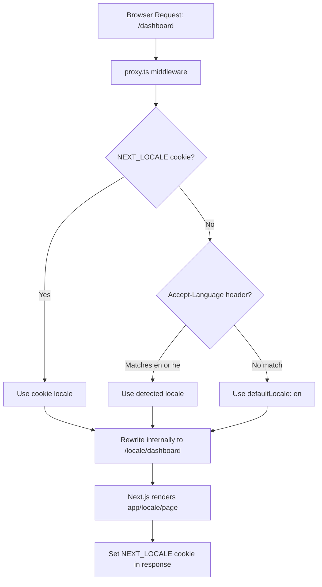
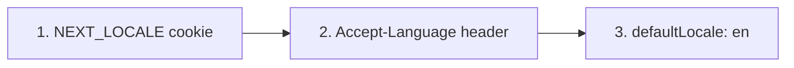
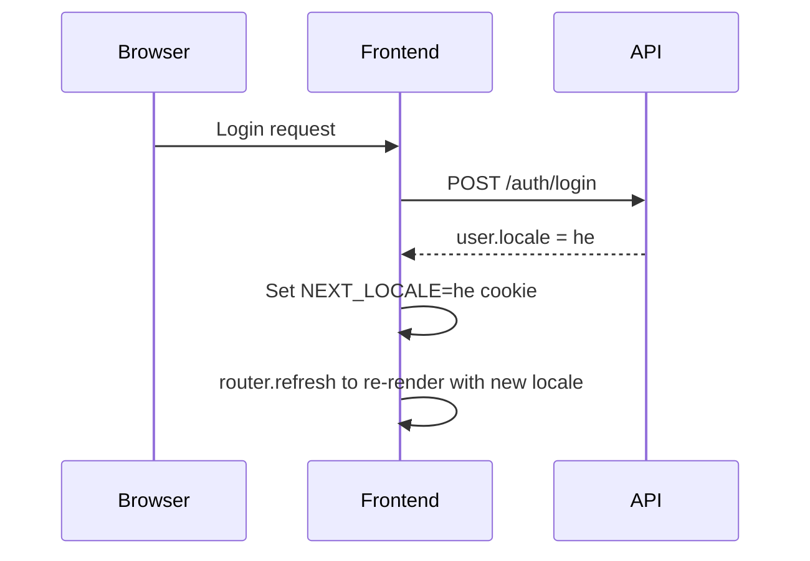

# Post-Phase 4 Design: URL Translation Redesign + NPM Fix + Backup Fix

> **Date:** 2026-04-16
> **Status:** Planned
> **Prerequisite:** Phase 4 complete
> **Blocks:** Phase 5 (Groups + Profile — iterations 5.9-5.14 depend on clean locale/profile infrastructure)

---

## Overview

Three independent infrastructure improvements to execute before Phase 5:

1. **URL Redesign** — Remove `/[locale]/` prefix from all URLs, switch to cookie-based locale
2. **NPM Fix** — Clean up `.npmrc` for pnpm 10 compatibility
3. **Backup Fix** — Fix `backup-verify.yml` workflow issues

These tasks complete the i18n infrastructure referenced in the IMPLEMENTATION-PLAN as "Phase 4B: Add locale field to user profile schema" — the schema field exists since Phase 1, but the URL-to-cookie locale switching and profile sync are still pending.

---

## Part 1: URL Translation Redesign

### Architecture Summary



### Key Design Decision — Keep the app/locale/ Folder

Per **next-intl v4 documentation** (verified via context7 MCP):

> Even with `localePrefix: 'never'`, all pages **must** still be placed inside a `[locale]` folder for routes to receive the `locale` parameter. Requests for all locales will be rewritten internally to have the locale prefixed.

This means we do **NOT** move files out of `app/[locale]/`. The `[locale]` folder stays — it is an internal routing mechanism. The difference is purely that **URLs visible to users** will no longer contain `/en/` or `/he/`.

### Locale Priority Chain



On login, an extra step syncs the user profile locale to the cookie:



### Step-by-Step Implementation

#### 1.1. Update routing.ts — Add localePrefix: never + cookie config

**File**: [`apps/web/src/i18n/routing.ts`](../apps/web/src/i18n/routing.ts)

```typescript
import { defineRouting } from 'next-intl/routing';

export const routing = defineRouting({
  locales: ['en', 'he'],
  defaultLocale: 'en',
  localePrefix: 'never',
  localeCookie: {
    name: 'NEXT_LOCALE',
    maxAge: 60 * 60 * 24 * 365, // 1 year
  },
});
```

**Why**: `localePrefix: 'never'` tells next-intl middleware to never add locale segments to URLs. The `localeCookie` with 1-year `maxAge` persists the user's choice across sessions (default is session-only which would reset on browser close).

#### 1.2. Update proxy.ts — New middleware matcher for prefix-free URLs

**File**: [`apps/web/src/proxy.ts`](../apps/web/src/proxy.ts)

```typescript
import createMiddleware from 'next-intl/middleware';
import { routing } from './i18n/routing';

export default createMiddleware(routing);

export const config = {
  // Match all pathnames except:
  // - /api (API proxy routes)
  // - /_next (Next.js internals)
  // - /_vercel (Vercel internals)
  // - Files with dots (e.g. favicon.ico, manifest.json)
  matcher: '/((?!api|_next|_vercel|.*\\..*).*)',
};
```

**Why**: The old matcher `['/', '/(en|he)/:path*']` only matched locale-prefixed URLs. With `localePrefix: 'never'`, all pathnames are unprefixed, so we need the broader catch-all matcher that excludes static files and API routes.

#### 1.3. Delete root app/page.tsx

**File**: [`apps/web/src/app/page.tsx`](../apps/web/src/app/page.tsx)

This file can be **deleted entirely**. With `localePrefix: 'never'`, the middleware handles `/` by internally rewriting to `/[locale]/` based on the cookie or Accept-Language header. The root-level `page.tsx` fallback redirect is no longer needed.

#### 1.4. Root app/layout.tsx — No change needed

The root layout at [`apps/web/src/app/layout.tsx`](../apps/web/src/app/layout.tsx) remains a pass-through wrapper.

#### 1.5. The app/locale/ directory — NO file moves needed

All files stay exactly where they are:

| File                                         | Purpose                                  |
| -------------------------------------------- | ---------------------------------------- |
| `app/[locale]/layout.tsx`                    | Provides `<html lang>`, `dir`, providers |
| `app/[locale]/page.tsx`                      | Home page                                |
| `app/[locale]/auth/login/page.tsx`           | Login                                    |
| `app/[locale]/auth/register/page.tsx`        | Register                                 |
| `app/[locale]/auth/callback/page.tsx`        | OAuth callback                           |
| `app/[locale]/auth/forgot-password/page.tsx` | Forgot password                          |
| `app/[locale]/auth/reset-password/page.tsx`  | Reset password                           |
| `app/[locale]/auth/verify-email/page.tsx`    | Email verification                       |
| `app/[locale]/dashboard/page.tsx`            | Dashboard                                |
| `app/[locale]/settings/account/page.tsx`     | Account settings                         |
| `app/[locale]/help/page.tsx`                 | Help guide                               |
| `app/[locale]/legal/terms/page.tsx`          | Terms of Use                             |
| `app/[locale]/legal/privacy/page.tsx`        | Privacy Policy                           |
| `app/[locale]/not-found.tsx`                 | 404 page                                 |

The `[locale]` segment is invisible in the browser URL due to `localePrefix: 'never'` — next-intl middleware rewrites requests internally.

#### 1.6. navigation.ts — No change needed

[`apps/web/src/i18n/navigation.ts`](../apps/web/src/i18n/navigation.ts) — `createNavigation(routing)` reads from `routing`, which now has `localePrefix: 'never'`. The exported `Link`, `redirect`, `usePathname`, `useRouter`, `getPathname` will automatically generate prefix-free URLs.

#### 1.7. request.ts — No change needed

[`apps/web/src/i18n/request.ts`](../apps/web/src/i18n/request.ts) — The `requestLocale` is resolved by next-intl from the internally-rewritten URL. No changes required.

#### 1.8. Update Header.tsx locale switcher — Cookie-based switching

**File**: [`apps/web/src/components/layout/Header.tsx`](../apps/web/src/components/layout/Header.tsx)

Currently the locale switcher uses `<Link href="/" locale={locale}>`. With `localePrefix: 'never'`, this no longer changes the URL. Instead, we need to:

1. Set the `NEXT_LOCALE` cookie to the target locale
2. If authenticated, also save to user profile via `updateProfile`
3. Call `router.refresh()` to re-render with the new locale

Replace the locale switcher section with `<button>` elements:

```tsx
const handleLocaleSwitch = async (targetLocale: string) => {
  // 1. Set cookie (read by next-intl middleware on next request)
  document.cookie = `NEXT_LOCALE=${targetLocale};path=/;max-age=${60 * 60 * 24 * 365};samesite=lax`;

  // 2. If authenticated, persist to user profile (reuse existing updateProfile)
  if (isAuthenticated) {
    try {
      await updateProfile({ locale: targetLocale });
    } catch {
      // Silent fail — cookie is already set as fallback
    }
  }

  // 3. Refresh to apply new locale
  router.refresh();
};
```

The locale switcher buttons become `<button>` elements instead of `<Link>`:

```tsx
{routing.locales.map((locale) => (
  <button
    key={locale}
    onClick={() => handleLocaleSwitch(locale)}
    className={...same styling...}
  >
    {locale.toUpperCase()}
  </button>
))}
```

#### 1.9. Add locale field to UpdateProfileDto — Backend

**File**: [`apps/api/src/auth/dto/update-profile.dto.ts`](../apps/api/src/auth/dto/update-profile.dto.ts)

Add `locale` field with validation. Also fix hardcoded currency list to use `CURRENCY_CODES` from `@myfinpro/shared` (DRY principle from project DNA):

```typescript
import { ApiPropertyOptional } from '@nestjs/swagger';
import { IsOptional, IsString, IsIn } from 'class-validator';
import { CURRENCY_CODES, LOCALES } from '@myfinpro/shared';

export class UpdateProfileDto {
  @ApiPropertyOptional({ description: 'Default currency (ISO 4217)', example: 'USD' })
  @IsOptional()
  @IsString()
  @IsIn([...CURRENCY_CODES])
  defaultCurrency?: string;

  @ApiPropertyOptional({ description: 'User timezone (IANA)', example: 'Asia/Jerusalem' })
  @IsOptional()
  @IsString()
  timezone?: string;

  @ApiPropertyOptional({ description: 'Preferred locale', example: 'he' })
  @IsOptional()
  @IsString()
  @IsIn([...LOCALES])
  locale?: string;
}
```

#### 1.10. Update AuthService.updateProfile — Handle locale field

**File**: [`apps/api/src/auth/auth.service.ts`](../apps/api/src/auth/auth.service.ts) — in [`updateProfile()`](../apps/api/src/auth/auth.service.ts:523) method

Add `locale` to the fields that can be updated:

```typescript
if (dto.locale) data.locale = dto.locale;
```

#### 1.11. Sync locale cookie on login/refresh — Frontend

**File**: [`apps/web/src/lib/auth/auth-context.tsx`](../apps/web/src/lib/auth/auth-context.tsx)

In `login`, `loginWithTelegram`, and `silentRefresh` callbacks, after receiving `result.user`, sync the locale cookie:

```typescript
// After: setUser(result.user); setAccessToken(result.accessToken);
if (typeof document !== 'undefined' && result.user.locale) {
  document.cookie = `NEXT_LOCALE=${result.user.locale};path=/;max-age=${60 * 60 * 24 * 365};samesite=lax`;
}
```

This ensures that when a user logs in, their saved locale preference overrides whatever cookie was previously set.

#### 1.12. Add Language dropdown to Account Settings page

**File**: [`apps/web/src/app/[locale]/settings/account/page.tsx`](../apps/web/src/app/[locale]/settings/account/page.tsx)

Add a Language dropdown to the Preferences section alongside Currency and Timezone:

```tsx
<div>
  <label htmlFor="language-select">{t('language')}</label>
  <select
    id="language-select"
    data-testid="language-select"
    value={selectedLocale}
    onChange={(e) => setSelectedLocale(e.target.value)}
  >
    <option value="en">English</option>
    <option value="he">עברית</option>
  </select>
</div>
```

Update `handleSavePreferences` to include locale and set the cookie + `router.refresh()` when locale changes.

Add i18n keys: `settings.account.language` → en: `"Language"`, he: `"שפה"`

#### 1.13. Initial timezone detection on first visit

Create a `TimezoneDetector.tsx` component:

```typescript
'use client';
import { useEffect } from 'react';
import { useAuth } from '@/lib/auth/auth-context';

export function TimezoneDetector() {
  const { user, isAuthenticated, updateProfile } = useAuth();

  useEffect(() => {
    if (!isAuthenticated || !user) return;
    if (user.timezone !== 'UTC') return; // Already customized

    const browserTz = Intl.DateTimeFormat().resolvedOptions().timeZone;
    if (browserTz && browserTz !== 'UTC' && browserTz !== user.timezone) {
      updateProfile({ timezone: browserTz }).catch(() => {});
    }
  }, [isAuthenticated, user, updateProfile]);

  return null;
}
```

Render inside `AuthProvider` in [`app/[locale]/layout.tsx`](../apps/web/src/app/[locale]/layout.tsx).

#### 1.14. Update Google OAuth callback redirect — Backend

**File**: [`apps/api/src/auth/auth.controller.ts`](../apps/api/src/auth/auth.controller.ts:344)

Current code at line 344:

```typescript
const locale = user.locale || 'en';
const redirectUrl = `${frontendUrl}/${locale}/auth/callback?token=${accessToken}`;
```

Change to:

```typescript
const redirectUrl = `${frontendUrl}/auth/callback?token=${accessToken}`;
```

The locale segment is no longer needed in URLs.

#### 1.15. RTL handling — No changes needed

RTL is handled in [`app/[locale]/layout.tsx`](../apps/web/src/app/[locale]/layout.tsx:40):

```tsx
const dir = RTL_LOCALES.includes(locale) ? 'rtl' : 'ltr';
<html lang={locale} dir={dir}>
```

Since `[locale]` still exists and receives the locale parameter (internally rewritten by middleware), `dir` is set correctly on `<html>`.

#### 1.16. Components using next-intl hooks — No changes needed

All components using `useTranslations()`, `useLocale()`, `Link`, `useRouter()`, `usePathname()`, `redirect()` from `@/i18n/navigation` work unchanged — they read from the NextIntlClientProvider context.

#### 1.17. URL redirects for old /en/ and /he/ URLs

**File**: [`apps/web/next.config.ts`](../apps/web/next.config.ts)

Add permanent redirects for old bookmarked/indexed URLs:

```typescript
async redirects() {
  return [
    { source: '/en/:path*', destination: '/:path*', permanent: true },
    { source: '/he/:path*', destination: '/:path*', permanent: true },
  ];
},
```

#### 1.18. Update E2E tests — Remove /en/ and /he/ prefixes

All E2E tests currently use `/en/` prefixed URLs:

| File                                                                               | Change                                                         |
| ---------------------------------------------------------------------------------- | -------------------------------------------------------------- |
| [`e2e/auth.spec.ts`](../apps/web/e2e/auth.spec.ts)                                 | `/en/auth/login` → `/auth/login`, URL assertions remove `/en/` |
| [`e2e/smoke.spec.ts`](../apps/web/e2e/smoke.spec.ts)                               | Already uses `/` — may need no change                          |
| [`e2e/footer.spec.ts`](../apps/web/e2e/footer.spec.ts)                             | `/en/legal/terms` → `/legal/terms`                             |
| [`e2e/legal-pages.spec.ts`](../apps/web/e2e/legal-pages.spec.ts)                   | `/en/legal/terms` → `/legal/terms`                             |
| [`e2e/help-page.spec.ts`](../apps/web/e2e/help-page.spec.ts)                       | `/en/help` → `/help`                                           |
| [`e2e/registration-consent.spec.ts`](../apps/web/e2e/registration-consent.spec.ts) | `/en/auth/register` → `/auth/register`                         |
| All staging tests in `e2e/staging/`                                                | Same pattern — remove `/en/` prefix                            |

For Hebrew/RTL tests, set `NEXT_LOCALE` cookie before navigating:

```typescript
test('Hebrew RTL layout', async ({ page, context }) => {
  await context.addCookies([
    {
      name: 'NEXT_LOCALE',
      value: 'he',
      domain: 'localhost',
      path: '/',
    },
  ]);
  await page.goto('/help');
  await expect(page.locator('html')).toHaveAttribute('dir', 'rtl');
});
```

#### 1.19. Update unit tests — Minimal changes

- Tests rendering components with next-intl mock providers — no changes
- Tests asserting navigation paths — update expected paths to remove `/en/` prefix

---

## Part 2: NPM Fix

### Problem

[`.npmrc`](../.npmrc) contains pnpm-specific settings that cause warnings when npm encounters them.

### Analysis for pnpm 10

| Setting                    | pnpm 10 default | Current value | Action                       |
| -------------------------- | --------------- | ------------- | ---------------------------- |
| `shamefully-hoist`         | `false`         | `false`       | **Remove** — matches default |
| `strict-peer-dependencies` | `false`         | `false`       | **Remove** — matches default |
| `lockfile`                 | `true`          | `true`        | **Remove** — matches default |
| `auto-install-peers`       | `true`          | `true`        | **Remove** — matches default |

### Solution

**Delete `.npmrc` entirely** — all four settings match pnpm 10 defaults.

---

## Part 3: Backup Verification Fix

### Issues Identified in backup-verify.yml

| #   | Issue                                                    | Severity | Fix                                  |
| --- | -------------------------------------------------------- | -------- | ------------------------------------ |
| 1   | `actions/checkout@v6` may not exist                      | High     | Use `actions/checkout@v4`            |
| 2   | `mysql:8.4` instead of MariaDB                           | Medium   | Switch to `mariadb:11.4`             |
| 3   | Dummy test tables don't match Prisma schema              | Medium   | Use `prisma db push` for real schema |
| 4   | `--set-gtid-purged=OFF` is MySQL-specific                | Medium   | Remove MySQL-specific flags          |
| 5   | Record counts reference `accounts`/`transactions` tables | Low      | Reference actual Prisma table names  |

### Detailed Fixes

#### Fix 1: actions/checkout@v6 → v4

```yaml
- name: Checkout code
  uses: actions/checkout@v4
```

#### Fix 2: MySQL → MariaDB container

```yaml
services:
  mariadb:
    image: mariadb:11.4
    env:
      MARIADB_ROOT_PASSWORD: ${{ env.MYSQL_ROOT_PASSWORD }}
      MARIADB_USER: ${{ env.MYSQL_USER }}
      MARIADB_PASSWORD: ${{ env.MYSQL_PASSWORD }}
      MARIADB_DATABASE: ${{ env.MYSQL_DATABASE }}
    ports:
      - 3306:3306
    options: >-
      --health-cmd="healthcheck.sh --connect --innodb_initialized"
      --health-interval=10s
      --health-timeout=5s
      --health-retries=5
```

#### Fix 3: Real Prisma schema instead of dummy tables

Add Node.js + pnpm setup, then use `prisma db push`:

```yaml
- name: Setup Node.js
  uses: actions/setup-node@v4
  with:
    node-version-file: '.nvmrc'

- name: Install pnpm
  uses: pnpm/action-setup@v4

- name: Install dependencies
  run: pnpm install --frozen-lockfile

- name: Apply Prisma schema to test database
  run: pnpm --filter @myfinpro/api exec prisma db push --skip-generate
  env:
    DATABASE_URL: mysql://root:${{ env.MYSQL_ROOT_PASSWORD }}@127.0.0.1:3306/${{ env.MYSQL_DATABASE }}
```

Seed with data matching actual `users` table columns:

```sql
INSERT INTO users (id, email, password_hash, name, default_currency, locale, timezone,
                   is_active, email_verified, created_at, updated_at)
VALUES
  (UUID(), 'alice@example.com', '$argon2id$mock', 'Alice Johnson', 'USD', 'en', 'UTC', 1, 1, NOW(), NOW()),
  (UUID(), 'bob@example.com', '$argon2id$mock', 'Bob Smith', 'EUR', 'he', 'Asia/Jerusalem', 1, 0, NOW(), NOW());
```

#### Fix 4 & 5: Remove MySQL-specific flags + update verification

Audit `scripts/backup.sh` — use MariaDB-compatible flags only. Update record count verification to reference real table names (`users`, `refresh_tokens`, etc.).

---

## Implementation Order

The three parts are **independent** and can be committed separately.

### Suggested commit order:

1. **NPM Fix** — smallest change, independent, single commit
2. **Backup Fix** — infrastructure concern, independent, single commit
3. **URL Redesign** — largest change, split into sub-commits:
   - 3a. Backend: Add `locale` to `UpdateProfileDto` + fix DRY currency validation
   - 3b. Frontend i18n config: `routing.ts`, `proxy.ts`, delete root `page.tsx`
   - 3c. Frontend locale switcher: `Header.tsx` cookie-based switching
   - 3d. Frontend login sync: auth-context locale cookie sync on login
   - 3e. Account settings: Add Language dropdown
   - 3f. Timezone detector: Auto-detect on first authenticated visit
   - 3g. Old URL redirects: `next.config.ts` redirects for `/en/` and `/he/`
   - 3h. Backend: Remove locale from Google OAuth redirect URL
   - 3i. Test updates: E2E tests remove `/en/` prefix, add cookie-based Hebrew tests
   - 3j. Unit test updates: Fix any path assertions

---

## Files Changed Summary

### New Files

| File                                           | Purpose                         |
| ---------------------------------------------- | ------------------------------- |
| `apps/web/src/components/TimezoneDetector.tsx` | Browser timezone auto-detection |

### Deleted Files

| File                        | Reason                              |
| --------------------------- | ----------------------------------- |
| `apps/web/src/app/page.tsx` | Root redirect no longer needed      |
| `.npmrc`                    | All settings match pnpm 10 defaults |

### Modified Files — URL Redesign

| File                                                  | Change                                                  |
| ----------------------------------------------------- | ------------------------------------------------------- |
| `apps/web/src/i18n/routing.ts`                        | Add `localePrefix: 'never'`, `localeCookie` config      |
| `apps/web/src/proxy.ts`                               | Update matcher for prefix-free pathnames                |
| `apps/web/src/components/layout/Header.tsx`           | Cookie-based locale switcher with `router.refresh()`    |
| `apps/web/src/lib/auth/auth-context.tsx`              | Sync `NEXT_LOCALE` cookie on login/refresh              |
| `apps/web/src/app/[locale]/settings/account/page.tsx` | Add Language dropdown to Preferences section            |
| `apps/web/src/app/[locale]/layout.tsx`                | Add `TimezoneDetector` component                        |
| `apps/web/next.config.ts`                             | Add redirects for old `/en/`, `/he/` prefixed URLs      |
| `apps/api/src/auth/dto/update-profile.dto.ts`         | Add `locale` field; use `CURRENCY_CODES` from shared    |
| `apps/api/src/auth/auth.service.ts`                   | Handle `locale` in `updateProfile()`                    |
| `apps/api/src/auth/auth.controller.ts`                | Remove locale from Google OAuth redirect URL            |
| `apps/web/messages/en.json`                           | Add `settings.account.language` key                     |
| `apps/web/messages/he.json`                           | Add `settings.account.language` key                     |
| `apps/web/e2e/auth.spec.ts`                           | Remove `/en/` from all goto/URL assertions              |
| `apps/web/e2e/footer.spec.ts`                         | Remove `/en/` from goto URLs                            |
| `apps/web/e2e/legal-pages.spec.ts`                    | Remove `/en/` from goto URLs                            |
| `apps/web/e2e/help-page.spec.ts`                      | Remove `/en/` from goto URLs                            |
| `apps/web/e2e/registration-consent.spec.ts`           | Remove `/en/` from goto URLs                            |
| `apps/web/e2e/staging/*.spec.ts`                      | Remove `/en/` from goto URLs, cookie-based Hebrew tests |
| Unit tests across `app/[locale]/`                     | Update path assertions where needed                     |

### Modified Files — Backup Fix

| File                                  | Change                                                |
| ------------------------------------- | ----------------------------------------------------- |
| `.github/workflows/backup-verify.yml` | MariaDB, Prisma schema, v4 checkout, real table names |

---

## Risk Assessment

| Risk                                    | Mitigation                                                             |
| --------------------------------------- | ---------------------------------------------------------------------- |
| Old bookmarked URLs break               | Next.js `redirects` in `next.config.ts` handle `/en/*` → `/*` with 301 |
| SEO impact from URL change              | 301 permanent redirects preserve SEO equity                            |
| next-intl cookie name conflict          | Using explicit `NEXT_LOCALE` (next-intl v4 default cookie name)        |
| Hebrew RTL broken without URL indicator | RTL driven by `[locale]` param in layout, still works internally       |
| Login flow locale mismatch              | Cookie sync on login ensures immediate locale switch                   |
| E2E test breakage during transition     | Tests updated in same commit as URL changes                            |
