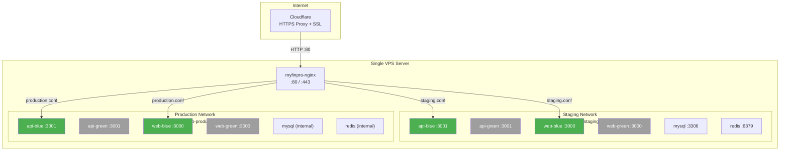
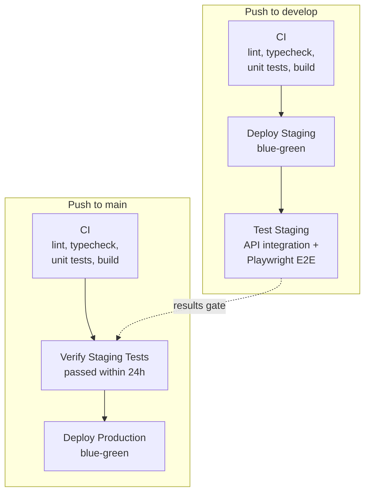

# MyFinPro — Project Progress

> **Last updated:** 2026-05-02
> **Current Phase:** Phase 6 — Payment Management (unified incomes + expenses) — in progress, 6/21 iterations complete
> **Previous Phase:** Phase 5 — Family/Group Management & Password Change ✅ Complete
>
> **Design doc**: [`docs/phase-6-payments-design.md`](phase-6-payments-design.md)
>
> **Scope change (2026-04-25)**: Original Phase 6 (Income, 10 iterations) and Phase 7 (Expense, 13 iterations) are merged into a single **Phase 6: Payment Management** (21 iterations). Incomes and expenses now share a single `Payment` entity with a `direction` field (`IN` / `OUT`) — dramatically reducing duplication. Phase 6 also introduces payment notes, a documents placeholder for Phase 9 receipts, per-user stars, and comments. Phase 7 is now empty / subsumed.

---

## 1. Project Overview

**MyFinPro** is a personal/family finance management application spanning a web app, Telegram bot, and Telegram mini app. It supports multi-provider authentication, group management, income/expense tracking (including loans, mortgages, and installment plans), budgets, receipt ingestion, analytics, and LLM-assisted insights.

### Tech Stack

| Layer          | Technology                               |
| -------------- | ---------------------------------------- |
| Frontend (Web) | Next.js 15 + TypeScript                  |
| Frontend i18n  | next-intl                                |
| Backend API    | NestJS + TypeScript                      |
| Database       | MySQL + Prisma                           |
| Cache / Queue  | Redis + BullMQ                           |
| Telegram Bot   | grammy.js                                |
| API Docs       | @nestjs/swagger                          |
| Testing        | Jest, Vitest, Playwright, Testcontainers |
| CI/CD          | GitHub Actions                           |
| Infrastructure | Docker Compose + Nginx                   |
| Rate Limiting  | @nestjs/throttler                        |

### Architecture

- **Monorepo** managed with pnpm workspaces
- **Apps:** `api` (NestJS), `web` (Next.js), `bot` (grammy.js)
- **Packages:** `shared` (DTOs, types, constants), `eslint-config`, `tsconfig`

---

## 2. Implementation Progress

| Phase | Name                                            | Iterations | Status                 | Completion Date |
| ----- | ----------------------------------------------- | ---------- | ---------------------- | --------------- |
| 0     | Foundation                                      | 8/8        | ✅ Complete            | 2026-02-13      |
| 1     | Basic Authentication                            | 13/13      | ✅ Complete            | 2026-03-14      |
| 2     | Google Authentication                           | 4/4        | ✅ Complete            | 2026-03-25      |
| 3     | Telegram Authentication                         | 4/4        | ✅ Complete            | 2026-04-03      |
| 4     | Auth Completion & Legal Pages                   | 23/23      | ✅ Complete            | —               |
| 5     | Family/Group Management                         | 9/9        | ✅ Complete            | 2026-04-24      |
| 6     | Payment Management (unified incomes + expenses) | 6/21       | 🔄 In progress         | —               |
| 7     | _(subsumed by Phase 6)_                         | —          | ➖ Merged into Phase 6 | 2026-04-25      |
| 8     | Budgets & Spending Targets                      | 0/10       | ⬜ Not Started         | —               |
| 9     | Receipt Processing                              | 0/8        | ⬜ Not Started         | —               |
| 10    | Purchase Analytics                              | 0/8        | ⬜ Not Started         | —               |
| 11    | Telegram Bot                                    | 0/16       | ⬜ Not Started         | —               |
| 12    | Telegram Mini App                               | 0/10       | ⬜ Not Started         | —               |
| 13    | Bot Receipt Processing                          | 0/8        | ⬜ Not Started         | —               |
| 14    | Bot Analytics                                   | 0/4        | ⬜ Not Started         | —               |
| 15    | LLM Assistant                                   | 0/8        | ⬜ Not Started         | —               |

**Total iterations:** 140 | **Completed:** 56 | **Remaining:** 84

---

## 3. Phase 0 — Detailed Breakdown

### Iteration 0.1 + 0.2: Local Dev Readiness & Project Scaffolding

**What was implemented:**

- Docker Compose configuration for MySQL, Redis, and all services
- Environment templates (`.env.example`, `.env.staging.example`, `.env.production.example`)
- Monorepo structure with pnpm workspaces
- NestJS API scaffolding with API versioning (`/api/v1/`)
- @nestjs/swagger setup with OpenAPI docs
- Next.js web app with next-intl (English + Hebrew locales)
- Telegram bot scaffolding with grammy.js and @grammyjs/fluent
- Playwright E2E configuration
- Testcontainers integration test setup
- Prisma ORM with MySQL schema and seed script

**Key files created:**

- [`docker-compose.yml`](../docker-compose.yml) — Local dev services
- [`pnpm-workspace.yaml`](../pnpm-workspace.yaml) — Workspace configuration
- [`apps/api/src/main.ts`](../apps/api/src/main.ts) — API entry point
- [`apps/api/prisma/schema.prisma`](../apps/api/prisma/schema.prisma) — Database schema
- [`apps/api/src/config/swagger.config.ts`](../apps/api/src/config/swagger.config.ts) — Swagger/OpenAPI setup
- [`apps/web/src/app/[locale]/layout.tsx`](../apps/web/src/app/[locale]/layout.tsx) — i18n layout
- [`apps/web/src/i18n/routing.ts`](../apps/web/src/i18n/routing.ts) — Locale routing
- [`apps/bot/src/main.ts`](../apps/bot/src/main.ts) — Bot entry point
- [`apps/web/playwright.config.ts`](../apps/web/playwright.config.ts) — E2E config
- [`apps/api/test/helpers/testcontainers.ts`](../apps/api/test/helpers/testcontainers.ts) — Integration test container setup
- [`infrastructure/docker/api.Dockerfile`](../infrastructure/docker/api.Dockerfile) — API Docker image
- [`infrastructure/docker/web.Dockerfile`](../infrastructure/docker/web.Dockerfile) — Web Docker image
- [`infrastructure/docker/bot.Dockerfile`](../infrastructure/docker/bot.Dockerfile) — Bot Docker image
- [`infrastructure/nginx/nginx.conf`](../infrastructure/nginx/nginx.conf) — Nginx reverse proxy
- [`infrastructure/mysql/init/01-create-databases.sql`](../infrastructure/mysql/init/01-create-databases.sql) — DB initialization

**Tests added:**

- [`apps/api/src/app.controller.spec.ts`](../apps/api/src/app.controller.spec.ts) — Controller unit tests
- [`apps/api/test/integration/app.integration.spec.ts`](../apps/api/test/integration/app.integration.spec.ts) — Integration smoke tests
- [`apps/web/e2e/smoke.spec.ts`](../apps/web/e2e/smoke.spec.ts) — E2E smoke test

**Acceptance criteria met:**

- ✅ Dev stack runs with `docker compose up`
- ✅ Repo builds end-to-end
- ✅ OpenAPI docs accessible at `/api/docs`
- ✅ Playwright configured with sample test
- ✅ Testcontainers configured for isolated MySQL

---

### Iteration 0.3: Shared DTOs

**What was implemented:**

- Pagination DTOs with cursor-based pagination support
- Error response DTOs with standardized error codes
- Currency types with ISO 4217 support
- Common types (timestamps, IDs, etc.)
- Shared constants

**Key files created:**

- [`packages/shared/src/dto/pagination.dto.ts`](../packages/shared/src/dto/pagination.dto.ts) — Pagination request/response DTOs
- [`packages/shared/src/dto/api-response.dto.ts`](../packages/shared/src/dto/api-response.dto.ts) — Standard API response envelope
- [`packages/shared/src/dto/error-response.dto.ts`](../packages/shared/src/dto/error-response.dto.ts) — Error response DTO
- [`packages/shared/src/types/currency.types.ts`](../packages/shared/src/types/currency.types.ts) — Currency types
- [`packages/shared/src/types/common.types.ts`](../packages/shared/src/types/common.types.ts) — Common types
- [`packages/shared/src/index.ts`](../packages/shared/src/index.ts) — Package exports

**Tests added:**

- [`packages/shared/src/__tests__/common.test.ts`](../packages/shared/src/__tests__/common.test.ts) — Common type tests
- [`packages/shared/src/__tests__/currency.test.ts`](../packages/shared/src/__tests__/currency.test.ts) — Currency type tests
- [`packages/shared/src/__tests__/pagination.test.ts`](../packages/shared/src/__tests__/pagination.test.ts) — Pagination DTO tests

**Acceptance criteria met:**

- ✅ Shared types importable across packages
- ✅ All DTOs have unit tests

---

### Iteration 0.4: Baseline CI

**What was implemented:**

- GitHub Actions CI pipeline with lint, typecheck, unit test, and build jobs
- PR check workflow blocking merges on CI failure
- Dependabot configuration for automated dependency updates
- Pull request template
- Branch protection documentation

**Key files created:**

- [`.github/workflows/ci.yml`](../.github/workflows/ci.yml) — Main CI pipeline
- [`.github/workflows/pr-check.yml`](../.github/workflows/pr-check.yml) — PR check workflow
- [`.github/dependabot.yml`](../.github/dependabot.yml) — Dependabot config
- [`.github/PULL_REQUEST_TEMPLATE.md`](../.github/PULL_REQUEST_TEMPLATE.md) — PR template
- [`.github/BRANCH_PROTECTION.md`](../.github/BRANCH_PROTECTION.md) — Branch protection guide

**Acceptance criteria met:**

- ✅ PRs blocked on CI failure
- ✅ Lint, typecheck, and test checks run automatically

---

### Iteration 0.5: Basic CD

**What was implemented:**

- Staging deployment workflow (deploy on push to `main`)
- Production deployment workflow (manual trigger with approval)
- Docker Compose configurations for staging and production
- Deploy script with zero-downtime deployment
- Rollback script

**Key files created:**

- [`.github/workflows/deploy-staging.yml`](../.github/workflows/deploy-staging.yml) — Staging deploy pipeline
- [`.github/workflows/deploy-production.yml`](../.github/workflows/deploy-production.yml) — Production deploy pipeline
- [`docker-compose.staging.yml`](../docker-compose.staging.yml) — Staging Docker Compose
- [`docker-compose.production.yml`](../docker-compose.production.yml) — Production Docker Compose
- [`scripts/deploy.sh`](../scripts/deploy.sh) — Deployment script
- [`scripts/rollback.sh`](../scripts/rollback.sh) — Rollback script
- [`.env.staging.example`](../.env.staging.example) — Staging env template
- [`.env.production.example`](../.env.production.example) — Production env template

**Acceptance criteria met:**

- ✅ Staging environment reachable after deploy
- ✅ Production deploy with manual approval gate
- ✅ Zero-downtime deployment strategy

**Security improvement (post-Phase 0):**

- Migrated to ephemeral secret injection pattern — GitHub Secrets as single source of truth
- Deploy workflow: write temp `.env` → `docker compose up` → `shred .env`
- Docker Compose uses `env_file:` directive (not `environment:`) to prevent `docker inspect` exposure
- Replaced `.env.*.example` with `.env.*.template` (schema-only, no sample values)
- Updated all deployment documentation and server setup guides

---

### Iteration 0.6: Backup Strategy

**What was implemented:**

- Automated MySQL backup script with compression
- Restore script with verification
- Backup age alerting (alert if > 26 hours old)
- CI verification job for backup integrity
- Cron configuration for scheduled backups
- Backup documentation

**Key files created:**

- [`scripts/backup.sh`](../scripts/backup.sh) — Backup script
- [`scripts/restore.sh`](../scripts/restore.sh) — Restore script
- [`scripts/check-backup-age.sh`](../scripts/check-backup-age.sh) — Backup age monitor
- [`infrastructure/backup/crontab`](../infrastructure/backup/crontab) — Cron schedule
- [`infrastructure/backup/backup.env.example`](../infrastructure/backup/backup.env.example) — Backup env template
- [`.github/workflows/backup-verify.yml`](../.github/workflows/backup-verify.yml) — Backup verification CI job
- [`docs/backup.md`](backup.md) — Backup documentation

**Acceptance criteria met:**

- ✅ Backups verified and restorable
- ✅ Alert if backup older than 26 hours
- ✅ CI verification job configured

---

### Iteration 0.7: Observability Baseline

**What was implemented:**

- Structured JSON logging with request context (correlation IDs)
- Health check endpoints (`/health`) with database, Redis, and memory indicators
- Prometheus-compatible metrics collection
- Metrics interceptor for request duration and count tracking
- Request context middleware for tracing

**Key files created:**

- [`apps/api/src/common/logger/logger.service.ts`](../apps/api/src/common/logger/logger.service.ts) — Structured logger
- [`apps/api/src/common/logger/logger.module.ts`](../apps/api/src/common/logger/logger.module.ts) — Logger module
- [`apps/api/src/health/health.controller.ts`](../apps/api/src/health/health.controller.ts) — Health check endpoint
- [`apps/api/src/health/health.module.ts`](../apps/api/src/health/health.module.ts) — Health module
- [`apps/api/src/health/indicators/database.indicator.ts`](../apps/api/src/health/indicators/database.indicator.ts) — DB health indicator
- [`apps/api/src/health/indicators/redis.indicator.ts`](../apps/api/src/health/indicators/redis.indicator.ts) — Redis health indicator
- [`apps/api/src/health/indicators/memory.indicator.ts`](../apps/api/src/health/indicators/memory.indicator.ts) — Memory health indicator
- [`apps/api/src/common/metrics/metrics.service.ts`](../apps/api/src/common/metrics/metrics.service.ts) — Metrics service
- [`apps/api/src/common/metrics/metrics.controller.ts`](../apps/api/src/common/metrics/metrics.controller.ts) — Metrics endpoint
- [`apps/api/src/common/metrics/metrics.interceptor.ts`](../apps/api/src/common/metrics/metrics.interceptor.ts) — Request metrics interceptor
- [`apps/api/src/common/context/request-context.middleware.ts`](../apps/api/src/common/context/request-context.middleware.ts) — Request context
- [`apps/api/src/common/filters/all-exceptions.filter.ts`](../apps/api/src/common/filters/all-exceptions.filter.ts) — Global exception filter
- [`apps/api/src/common/filters/http-exception.filter.ts`](../apps/api/src/common/filters/http-exception.filter.ts) — HTTP exception filter
- [`apps/api/src/common/interceptors/transform.interceptor.ts`](../apps/api/src/common/interceptors/transform.interceptor.ts) — Response transform

**Tests added:**

- [`apps/api/src/health/health.controller.spec.ts`](../apps/api/src/health/health.controller.spec.ts) — Health endpoint tests
- [`apps/api/src/common/logger/logger.service.spec.ts`](../apps/api/src/common/logger/logger.service.spec.ts) — Logger tests
- [`apps/api/src/common/metrics/metrics.service.spec.ts`](../apps/api/src/common/metrics/metrics.service.spec.ts) — Metrics tests

**Acceptance criteria met:**

- ✅ Health endpoint returns component status
- ✅ Structured JSON logs with correlation IDs
- ✅ Metrics collection active

---

### Iteration 0.8: Rate Limiting

**What was implemented:**

- @nestjs/throttler global rate limiting
- Proxy-aware rate limiting guard (trust X-Forwarded-For)
- Custom `@Throttle()` decorator for per-endpoint overrides
- Throttler configuration module with environment-based settings

**Key files created:**

- [`apps/api/src/common/throttler/throttler.module.ts`](../apps/api/src/common/throttler/throttler.module.ts) — Throttler module
- [`apps/api/src/common/throttler/throttler.guard.ts`](../apps/api/src/common/throttler/throttler.guard.ts) — Custom throttler guard
- [`apps/api/src/common/throttler/throttler-behind-proxy.guard.ts`](../apps/api/src/common/throttler/throttler-behind-proxy.guard.ts) — Proxy-aware guard
- [`apps/api/src/common/decorators/throttle.decorator.ts`](../apps/api/src/common/decorators/throttle.decorator.ts) — Throttle decorator
- [`apps/api/src/config/throttler.config.ts`](../apps/api/src/config/throttler.config.ts) — Throttler config

**Tests added:**

- [`apps/api/src/common/throttler/throttler.guard.spec.ts`](../apps/api/src/common/throttler/throttler.guard.spec.ts) — Guard tests
- [`apps/api/src/common/decorators/throttle.decorator.spec.ts`](../apps/api/src/common/decorators/throttle.decorator.spec.ts) — Decorator tests

**Acceptance criteria met:**

- ✅ Rate limiting active on all endpoints
- ✅ Proxy-aware IP extraction
- ✅ Per-endpoint override capability

---

## 3b. Blue-Green Deployment — Post-Phase 0 Infrastructure Upgrade (2026-03-07)

### Overview

Upgraded the deployment system from monolithic Docker Compose to a **blue-green deployment** architecture with a shared Nginx reverse proxy, enabling zero-downtime deployments for both staging and production on a single VPS.

### What was implemented:

**Blue-Green Deployment System:**

- [`scripts/deploy.sh`](../scripts/deploy.sh) — Blue-green deploy script with slot alternation, health checks, nginx config generation, and smart cleanup
- [`scripts/rollback.sh`](../scripts/rollback.sh) — Rollback script that reverts to previous slot
- [`scripts/cleanup-images.sh`](../scripts/cleanup-images.sh) — Smart Docker image cleanup per environment
- [`docker-compose.staging.app.yml`](../docker-compose.staging.app.yml) — Staging app services (blue/green slots)
- [`docker-compose.staging.infra.yml`](../docker-compose.staging.infra.yml) — Staging infrastructure (MySQL, Redis)
- [`docker-compose.production.app.yml`](../docker-compose.production.app.yml) — Production app services
- [`docker-compose.production.infra.yml`](../docker-compose.production.infra.yml) — Production infrastructure
- [`docker-compose.shared-nginx.yml`](../docker-compose.shared-nginx.yml) — Shared Nginx reverse proxy

**Shared Nginx Architecture:**

- Single Nginx container (`myfinpro-nginx`) serves both staging and production
- Connected to both `myfinpro-staging-net` and `myfinpro-production-net` Docker networks
- Per-environment configs generated at deploy time via `envsubst` from [`infrastructure/nginx/conf.d/ssl.conf.template`](../infrastructure/nginx/conf.d/ssl.conf.template)
- [`infrastructure/nginx/conf.d/_default.conf`](../infrastructure/nginx/conf.d/_default.conf) — Default server with `/health` endpoint
- [`infrastructure/nginx/conf.d/cloudflare-ips.conf`](../infrastructure/nginx/conf.d/cloudflare-ips.conf) — Cloudflare IP trust for real IP detection

**CI/CD Workflows:**

- [`.github/workflows/deploy-staging.yml`](../.github/workflows/deploy-staging.yml) — Staging deploy (auto on push to `develop`)
- [`.github/workflows/deploy-production.yml`](../.github/workflows/deploy-production.yml) — Production deploy (auto on push to `main`, manual with confirmation)
- [`.github/workflows/infra-maintenance.yml`](../.github/workflows/infra-maintenance.yml) — Infrastructure maintenance (cleanup + Cloudflare DNS setup)

**Cloudflare Integration:**

- DNS records managed via Cloudflare API in infra-maintenance workflow
- SSL mode: Flexible (Cloudflare handles HTTPS, origin serves HTTP)
- Staging: staging domain (single-level subdomain for Universal SSL compatibility)
- Production: production domain

**Documentation:**

- [`docs/blue-green-deployment.md`](blue-green-deployment.md) — Blue-green deployment architecture and procedures

### Issues encountered and resolved:

1. **Port 80 conflict** — Old per-environment nginx containers held port 80. Fixed by stopping old containers before starting shared nginx.
2. **Invalid Cloudflare IP in trust proxy** — `104.16.0/12` is not valid CIDR. Fixed to `104.16.0.0/13` + `104.24.0.0/14`.
3. **Missing database tables** — Prisma migrations not run on first deploy. Added `prisma db push` to deploy script.
4. **Multi-level subdomain SSL** — `<old staging domain>` not covered by Cloudflare Universal SSL wildcard. Changed to staging domain.
5. **Missing Cloudflare secrets** — `CLOUDFLARE_API_TOKEN` and `CLOUDFLARE_ZONE_ID` needed for DNS automation.

### Deployment verification (2026-03-07):

| URL                           | Expected       | Result                     |
| ----------------------------- | -------------- | -------------------------- |
| `https://<staging domain>`    | HTTPS response | ✅ `HTTP/2 307` → `/en`    |
| `http://<staging domain>`     | 301 → HTTPS    | ✅ `301 Moved Permanently` |
| `https://<production domain>` | HTTPS response | ✅ `HTTP/2 307` → `/en`    |
| `http://<production domain>`  | 301 → HTTPS    | ✅ `301 Moved Permanently` |

### Server architecture:



> Green-highlighted containers are the active (blue) slot. Grey containers are the inactive (green) slot, started during the next deployment.

---

## 3c. Testing & Deployment Pipeline — Post-Phase 0 Enhancement (2026-03-07)

### Overview

Implemented a comprehensive testing and deployment pipeline that covers unit tests, staging integration tests, and a test-gated production deployment workflow. This ensures every production deploy is validated against the staging environment.

### Pipeline Architecture



### What was implemented:

**Unit Tests — API (Jest, 13 suites, ~90 tests):**

- [`apps/api/src/app.controller.spec.ts`](../apps/api/src/app.controller.spec.ts) — App controller tests
- [`apps/api/src/app.service.spec.ts`](../apps/api/src/app.service.spec.ts) — App service tests
- [`apps/api/src/health/health.controller.spec.ts`](../apps/api/src/health/health.controller.spec.ts) — Health endpoint tests
- [`apps/api/src/common/logger/logger.service.spec.ts`](../apps/api/src/common/logger/logger.service.spec.ts) — Logger tests
- [`apps/api/src/common/metrics/metrics.service.spec.ts`](../apps/api/src/common/metrics/metrics.service.spec.ts) — Metrics tests
- [`apps/api/src/common/throttler/throttler.guard.spec.ts`](../apps/api/src/common/throttler/throttler.guard.spec.ts) — Throttler guard tests
- [`apps/api/src/common/decorators/throttle.decorator.spec.ts`](../apps/api/src/common/decorators/throttle.decorator.spec.ts) — Throttle decorator tests
- [`apps/api/src/prisma/prisma.service.spec.ts`](../apps/api/src/prisma/prisma.service.spec.ts) — Prisma service tests
- [`apps/api/src/common/filters/all-exceptions.filter.spec.ts`](../apps/api/src/common/filters/all-exceptions.filter.spec.ts) — Exception filter tests
- [`apps/api/src/common/interceptors/transform.interceptor.spec.ts`](../apps/api/src/common/interceptors/transform.interceptor.spec.ts) — Transform interceptor tests
- [`apps/api/src/common/pipes/validation.pipe.spec.ts`](../apps/api/src/common/pipes/validation.pipe.spec.ts) — Validation pipe tests
- [`apps/api/src/common/context/request-context.middleware.spec.ts`](../apps/api/src/common/context/request-context.middleware.spec.ts) — Request context middleware tests
- [`apps/api/src/common/context/request-context.spec.ts`](../apps/api/src/common/context/request-context.spec.ts) — Request context tests

**Unit Tests — Web (Vitest, 3 suites, 35 tests):**

- [`apps/web/src/components/ui/Button.spec.tsx`](../apps/web/src/components/ui/Button.spec.tsx) — Button component tests
- [`apps/web/src/components/layout/Header.spec.tsx`](../apps/web/src/components/layout/Header.spec.tsx) — Header component tests
- [`apps/web/src/lib/api-client.spec.ts`](../apps/web/src/lib/api-client.spec.ts) — API client tests

**Unit Tests — Shared (Vitest, 3 suites, 46 tests):**

- [`packages/shared/src/__tests__/common.test.ts`](../packages/shared/src/__tests__/common.test.ts) — Common type tests
- [`packages/shared/src/__tests__/currency.test.ts`](../packages/shared/src/__tests__/currency.test.ts) — Currency type tests
- [`packages/shared/src/__tests__/pagination.test.ts`](../packages/shared/src/__tests__/pagination.test.ts) — Pagination DTO tests

**Staging Integration Tests — API (Jest HTTP-based, 4 suites, 16 tests):**

- [`apps/api/test/staging/health.staging.spec.ts`](../apps/api/test/staging/health.staging.spec.ts) — Health endpoint against live staging
- [`apps/api/test/staging/api-root.staging.spec.ts`](../apps/api/test/staging/api-root.staging.spec.ts) — API root endpoint tests
- [`apps/api/test/staging/swagger.staging.spec.ts`](../apps/api/test/staging/swagger.staging.spec.ts) — Swagger docs accessibility
- [`apps/api/test/staging/rate-limiting.staging.spec.ts`](../apps/api/test/staging/rate-limiting.staging.spec.ts) — Rate limiting verification
- [`apps/api/test/staging/helpers.ts`](../apps/api/test/staging/helpers.ts) — Staging test helpers
- [`apps/api/test/staging/setup.ts`](../apps/api/test/staging/setup.ts) — Staging test setup
- [`apps/api/jest.staging.config.ts`](../apps/api/jest.staging.config.ts) — Staging Jest config

**Staging E2E Tests — Playwright (4 suites, 14 tests):**

- [`apps/web/e2e/staging/homepage.staging.spec.ts`](../apps/web/e2e/staging/homepage.staging.spec.ts) — Homepage loads, key elements present
- [`apps/web/e2e/staging/api-proxy.staging.spec.ts`](../apps/web/e2e/staging/api-proxy.staging.spec.ts) — Frontend API proxy forwarding
- [`apps/web/e2e/staging/i18n.staging.spec.ts`](../apps/web/e2e/staging/i18n.staging.spec.ts) — i18n locale switching
- [`apps/web/e2e/staging/responsive.staging.spec.ts`](../apps/web/e2e/staging/responsive.staging.spec.ts) — Responsive layout
- [`apps/web/playwright.staging.config.ts`](../apps/web/playwright.staging.config.ts) — Staging Playwright config

**Workflow files created/modified:**

- [`.github/workflows/ci.yml`](../.github/workflows/ci.yml) — CI pipeline (lint, typecheck, unit tests, build)
- [`.github/workflows/deploy-staging.yml`](../.github/workflows/deploy-staging.yml) — Staging deployment (blue-green)
- [`.github/workflows/test-staging.yml`](../.github/workflows/test-staging.yml) — **New**: Staging tests (API + Playwright E2E)
- [`.github/workflows/deploy-production.yml`](../.github/workflows/deploy-production.yml) — **Updated**: Production deployment with staging test gate

**Production Deployment Gating:**

- Production deploy verifies latest `test-staging.yml` run was successful and < 24 hours old
- Blocks deployment with clear error message if staging tests are stale or failed
- Ensures every production deploy is validated against the staging environment

### Quality metrics after this enhancement:

| Metric              | Count | Breakdown                                                                         |
| ------------------- | ----- | --------------------------------------------------------------------------------- |
| **Unit Tests**      | ~171  | API: 13 suites / ~90 tests, Web: 3 suites / 35 tests, Shared: 3 suites / 46 tests |
| **Staging Tests**   | 30    | API integration: 4 suites / 16 tests, Playwright E2E: 4 suites / 14 tests         |
| **Total Tests**     | ~201  | All automated, running in CI/CD pipeline                                          |
| **Test Frameworks** | 3     | Jest (API), Vitest (Web + Shared), Playwright (E2E)                               |

---

## 4. Phase 1 — Basic Authentication

### Overview

Phase 1 implements a complete authentication system with email/password registration and login, JWT-based session management with refresh token rotation, protected routes, and a basic dashboard. Security is the top priority as this phase begins collecting user data.

### Architecture Decisions

- **Password Hashing**: Argon2id (64MB memory, 3 iterations, 4 parallelism) — winner of Password Hashing Competition
- **JWT Access Tokens**: 15-minute expiry, HS256, stored in React state (memory only — never localStorage)
- **Refresh Tokens**: 7-day expiry, random UUID, SHA-256 hashed before storage, httpOnly Secure SameSite=Strict cookie
- **Token Rotation**: Every refresh issues new tokens; old refresh token immediately revoked
- **Reuse Detection**: If a revoked refresh token is reused, all user tokens are revoked (compromised session detected)
- **Rate Limiting**: 5 req/min on register + login endpoints (brute force protection)
- **Error Codes**: Structured `errorCode` field in all auth error responses for frontend i18n mapping

### Iteration 1.0: Infrastructure Prerequisites (commit ea6629b)

**What was implemented:**

- Added cookie-parser middleware for httpOnly refresh token cookies
- Added Helmet security headers middleware
- Changed backup crontab from daily to hourly (security — user data collection starts)
- Changed deploy script to use `prisma migrate deploy` (production-safe migrations)
- Added JWT_SECRET and JWT_EXPIRATION to env templates

---

### Iteration 1.1: User Schema (commit f19c1cf)

**What was implemented:**

- Created User model (UUID id, email unique, passwordHash, name, defaultCurrency, locale, timezone, isActive, emailVerified, lastLoginAt)
- Created RefreshToken model (tokenHash, userId FK, expiresAt, revokedAt, replacedBy) with cascade delete
- Created AuditLog model (action, entityType, entityId, userId, metadata JSON, ipAddress, userAgent)
- Created HealthCheck model (status, responseTime, details JSON)

**Key files created:**

- [`apps/api/prisma/migrations/20260314123440_phase1_auth_schema/migration.sql`](../apps/api/prisma/migrations/20260314123440_phase1_auth_schema/migration.sql) — Database migration
- [`apps/api/prisma/schema.prisma`](../apps/api/prisma/schema.prisma) — Updated with User, RefreshToken, AuditLog, HealthCheck models

---

### Iteration 1.2+1.3: Registration API + Password Hashing (commit 5dbe79f)

**What was implemented:**

- Implemented PasswordService with Argon2id (64MB memory, 3 iterations, 4 parallelism)
- Implemented RegisterDto with class-validator (email, password 8-128 chars + complexity, name, currency, locale)
- POST /api/v1/auth/register — creates user, hashes password, returns user + access token + sets refresh cookie

**Tests added:**

- 28 unit tests + 5 integration tests (using Testcontainers)

---

### Iteration 1.4: Login API (commit 367c59d)

**What was implemented:**

- Implemented Passport LocalStrategy for email/password validation
- Created LocalAuthGuard
- POST /api/v1/auth/login — validates credentials, returns user + tokens
- Account disabled check (isActive flag)
- Updates lastLoginAt on successful login

**Key files created:**

- [`apps/api/src/auth/strategies/local.strategy.ts`](../apps/api/src/auth/strategies/local.strategy.ts) — Passport local strategy
- [`apps/api/src/auth/guards/local-auth.guard.ts`](../apps/api/src/auth/guards/local-auth.guard.ts) — Local auth guard

---

### Iteration 1.5: JWT Issuance (commit 11119ee)

**What was implemented:**

- Implemented TokenService for JWT generation (HS256, 15min expiry)
- JWT payload: { sub: userId, email, name }
- Refresh token: crypto.randomUUID(), SHA-256 hashed before DB storage
- Cookie options: httpOnly, Secure (production), SameSite=Strict, path=/api/v1/auth, maxAge=7d
- JwtStrategy for extracting user from Bearer token

**Key files created:**

- [`apps/api/src/auth/services/token.service.ts`](../apps/api/src/auth/services/token.service.ts) — JWT + refresh token generation
- [`apps/api/src/auth/strategies/jwt.strategy.ts`](../apps/api/src/auth/strategies/jwt.strategy.ts) — JWT extraction strategy
- [`apps/api/src/auth/guards/jwt-auth.guard.ts`](../apps/api/src/auth/guards/jwt-auth.guard.ts) — JWT auth guard
- [`apps/api/src/auth/interfaces/jwt-payload.interface.ts`](../apps/api/src/auth/interfaces/jwt-payload.interface.ts) — JWT payload type

---

### Iteration 1.6: Token Refresh + Rotation + Logout (commit 36f8494)

**What was implemented:**

- POST /api/v1/auth/refresh — validates refresh cookie, issues new token pair, revokes old
- Token rotation: old refresh token revoked, replaced by new one (replacedBy chain)
- Reuse detection: if revoked token reused, all user's refresh tokens revoked
- POST /api/v1/auth/logout — revokes current refresh token, clears cookie
- RefreshTokenService with create, validate, rotate, revokeAll methods

**Key files created:**

- [`apps/api/src/auth/services/refresh-token.service.ts`](../apps/api/src/auth/services/refresh-token.service.ts) — Refresh token lifecycle management
- [`apps/api/src/auth/auth.controller.ts`](../apps/api/src/auth/auth.controller.ts) — Auth controller (register, login, refresh, logout, me)

---

### Iteration 1.7: Login UI (commit de518bd)

**What was implemented:**

- Created reusable Input component (label, error, accessibility, RTL support)
- Created LoginForm component (email + password fields, loading state, error display)
- Created /[locale]/auth/login page
- Added auth i18n translations (en + he) for all form elements
- Added Sign In / Sign Up links to Header navigation
- Migrated middleware.ts → proxy.ts (Next.js 16 convention)

**Key files created:**

- [`apps/web/src/components/ui/Input.tsx`](../apps/web/src/components/ui/Input.tsx) — Reusable form input
- [`apps/web/src/components/auth/LoginForm.tsx`](../apps/web/src/components/auth/LoginForm.tsx) — Login form
- [`apps/web/src/app/[locale]/auth/login/page.tsx`](../apps/web/src/app/[locale]/auth/login/page.tsx) — Login page

**Tests added:**

- [`apps/web/src/components/ui/Input.spec.tsx`](../apps/web/src/components/ui/Input.spec.tsx) — Input component tests (16 tests)
- [`apps/web/src/components/auth/LoginForm.spec.tsx`](../apps/web/src/components/auth/LoginForm.spec.tsx) — LoginForm tests (11 tests)
- 64 web tests passing

---

### Iteration 1.8: Registration UI (commit 18fa7c7)

**What was implemented:**

- Created RegisterForm component (name, email, password, confirm password, currency selector)
- Created PasswordStrength indicator (visual bar + text, 5 levels: very-weak to very-strong)
- Password validation: 8+ chars, uppercase, lowercase, number, special character
- Created /[locale]/auth/register page

**Key files created:**

- [`apps/web/src/components/auth/RegisterForm.tsx`](../apps/web/src/components/auth/RegisterForm.tsx) — Registration form
- [`apps/web/src/components/auth/PasswordStrength.tsx`](../apps/web/src/components/auth/PasswordStrength.tsx) — Password strength indicator
- [`apps/web/src/app/[locale]/auth/register/page.tsx`](../apps/web/src/app/[locale]/auth/register/page.tsx) — Register page

**Tests added:**

- [`apps/web/src/components/auth/RegisterForm.spec.tsx`](../apps/web/src/components/auth/RegisterForm.spec.tsx) — RegisterForm tests
- [`apps/web/src/components/auth/PasswordStrength.spec.tsx`](../apps/web/src/components/auth/PasswordStrength.spec.tsx) — PasswordStrength tests
- 89 web tests passing

---

### Iteration 1.9: Frontend Auth Integration (commit f8e8c6a)

**What was implemented:**

- Created AuthProvider React context (user state, accessToken in memory, login/register/logout functions)
- Silent refresh on page load (POST /auth/refresh with credentials: include)
- Connected LoginForm and RegisterForm to real API via auth context
- Header shows user name + Dashboard + Logout when authenticated; Sign In/Up when not

**Key files created:**

- [`apps/web/src/lib/auth/auth-context.tsx`](../apps/web/src/lib/auth/auth-context.tsx) — Auth context provider
- [`apps/web/src/lib/auth/types.ts`](../apps/web/src/lib/auth/types.ts) — Auth type definitions

**Tests added:**

- [`apps/web/src/lib/auth/auth-context.spec.tsx`](../apps/web/src/lib/auth/auth-context.spec.tsx) — Auth context tests
- 111 web tests passing

---

### Iteration 1.10: Protected Routes + E2E Tests (commit f9c88e7)

**What was implemented:**

- Created CurrentUser decorator for extracting JWT payload
- Added GET /api/v1/auth/me — returns authenticated user's profile (no passwordHash)
- Created ProtectedRoute component (redirects to login if unauthenticated, shows spinner while loading)
- Created /[locale]/dashboard placeholder page (wrapped in ProtectedRoute)
- Login redirect support: preserves `?redirect=` URL after login
- Playwright E2E tests: 9 tests across login/register pages, navigation, button states, dashboard redirect

**Key files created:**

- [`apps/web/src/components/auth/ProtectedRoute.tsx`](../apps/web/src/components/auth/ProtectedRoute.tsx) — Protected route component
- [`apps/web/src/app/[locale]/dashboard/page.tsx`](../apps/web/src/app/[locale]/dashboard/page.tsx) — Dashboard page
- [`apps/web/e2e/auth.spec.ts`](../apps/web/e2e/auth.spec.ts) — Playwright auth E2E tests

**Tests added:**

- [`apps/web/src/components/auth/ProtectedRoute.spec.tsx`](../apps/web/src/components/auth/ProtectedRoute.spec.tsx) — ProtectedRoute tests
- [`apps/web/src/app/[locale]/dashboard/dashboard.spec.tsx`](../apps/web/src/app/[locale]/dashboard/dashboard.spec.tsx) — Dashboard tests
- 171 API tests, 118 web unit tests, 9 E2E tests

---

### Iteration 1.11: Error Handling (commit 94d0516)

**What was implemented:**

- Created AUTH_ERRORS constants (9 structured error codes)
- Updated all auth service throws to include errorCode field
- Updated AllExceptionsFilter + HttpExceptionFilter to pass errorCode in response
- Created Toast notification system (success/error/warning/info, auto-dismiss, stack, accessible)
- Created ErrorBoundary class component (fallback UI, reset, custom fallback prop)
- Integrated toasts into login/register forms (success messages on auth)

**Key files created:**

- [`apps/web/src/components/ui/Toast.tsx`](../apps/web/src/components/ui/Toast.tsx) — Toast notification system
- [`apps/web/src/components/ui/ErrorBoundary.tsx`](../apps/web/src/components/ui/ErrorBoundary.tsx) — React error boundary

**Tests added:**

- [`apps/web/src/components/ui/Toast.spec.tsx`](../apps/web/src/components/ui/Toast.spec.tsx) — Toast component tests
- [`apps/web/src/components/ui/ErrorBoundary.spec.tsx`](../apps/web/src/components/ui/ErrorBoundary.spec.tsx) — ErrorBoundary tests
- 171 API tests, 138 web unit tests, 45 E2E tests (5 browsers)

---

### Iteration 1.12: Auth Rate Limiting (commit 0ce0c89)

**What was implemented:**

- Applied @CustomThrottle({ limit: 5, ttl: 60000 }) to register + login (5 req/min)
- Applied @CustomThrottle({ limit: 10, ttl: 60000 }) to refresh + logout (10 req/min)
- GET /auth/me uses global default (60 req/min)
- Frontend handles 429 responses with "Too many attempts" message
- Added Swagger @ApiTooManyRequestsResponse annotations

**Tests added:**

- 176 API tests, 138 web unit tests, 45 E2E tests

**Acceptance criteria met:**

- ✅ Email/password registration and login working end-to-end
- ✅ JWT access tokens (15min) + refresh tokens (7d) with rotation
- ✅ Reuse detection revokes all tokens on compromised refresh token
- ✅ Protected routes redirect unauthenticated users to login
- ✅ Dashboard accessible only when authenticated
- ✅ Toast notifications for auth success/error states
- ✅ Error boundary catches unexpected React errors
- ✅ Rate limiting on auth endpoints (5/min register + login)
- ✅ All tests passing (176 API + 138 web + 45 E2E)

### Deployment Fixes & Infrastructure Improvements

After the 13 feature iterations were complete, several critical deployment issues were discovered and fixed during the staging/production deployment process:

#### Fix: deploy.sh Variable Collision (commit 0721753)

- **Problem**: `source .deploy-metadata` in [`scripts/deploy.sh`](scripts/deploy.sh:95) overwrote the `IMAGE_TAG` variable (set from CLI argument) with the previous deployment's tag, causing every deploy to pull stale Docker images
- **Impact**: All Phase 1 deploys were silently deploying Phase 0 images — production showed no auth UI
- **Fix**: Save `IMAGE_TAG` before sourcing metadata file, restore after
- **Also fixed**: Similar collision in [`scripts/rollback.sh`](scripts/rollback.sh:116)

#### Fix: Unbound GIT_SHA + JWT_SECRET Standardization (commit e2c6a16)

- **Problem 1**: `_DEPLOY_GIT_SHA="$GIT_SHA"` crashed with `set -u` because `GIT_SHA` was never set before the metadata source
- **Fix**: Changed to `"${GIT_SHA:-}"` safe parameter expansion
- **Problem 2**: API code read `JWT_ACCESS_SECRET` but Docker compose and GitHub Actions passed `JWT_SECRET` — JWT signing silently fell back to hardcoded dev secret in production
- **Fix**: Standardized on `JWT_SECRET` everywhere with strict validation (throws in staging/production if unset)

#### Fix: ESLint Plugin Compatibility (commit 4222c8d)

- **Problem**: `eslint-plugin-import` incompatible with ESLint 10 (`sourceCode.getTokenOrCommentBefore` removed)
- **Fix**: Replaced with `eslint-plugin-import-x` (maintained ESLint 10 fork), eliminated 41 lint warnings

#### Fix: Prisma Migration Baseline (commit 4473768)

- **Problem**: Staging/production databases had Phase 0 tables created manually (no `_prisma_migrations` tracking table), so `prisma migrate deploy` failed with "schema is not empty"
- **Fix**: Added auto-detection in [`scripts/deploy.sh`](scripts/deploy.sh:195) that drops pre-existing tables via raw SQL when baseline case is detected, then re-runs `prisma migrate deploy`
- **Safety**: Only triggers when `_prisma_migrations` table doesn't exist (one-time setup)

#### Fix: DNS Collision Between Staging and Production (commit 4473768)

- **Problem**: Both staging and production containers registered the same Docker DNS aliases (`api-green`, `web-green`) on their respective networks. Since shared Nginx was on both networks, Docker DNS returned production container IPs for staging requests
- **Fix**: Prefixed aliases with environment name: `staging-api-green`, `production-api-green`, etc. in [`docker-compose.staging.app.yml`](docker-compose.staging.app.yml), [`docker-compose.production.app.yml`](docker-compose.production.app.yml), and [`infrastructure/nginx/conf.d/ssl.conf.template`](infrastructure/nginx/conf.d/ssl.conf.template)

#### Fix: Memory Health Check False Positives (commit 4473768)

- **Problem**: V8's GC keeps heap at 90-95% between cycles, causing the 95% heap threshold to alternate between pass/fail
- **Fix**: Switched from heap%-based to RSS-based memory check (512MB threshold) in [`apps/api/src/health/indicators/memory.indicator.ts`](apps/api/src/health/indicators/memory.indicator.ts)

#### Fix: Silent Refresh — Missing User + Cookie Path (commits cb959dd, 1bb12c5)

- **Problem 1**: `refreshTokens()` returned `{ accessToken }` without `user` object. Frontend expected `{ user, accessToken }` — after refresh, `isAuthenticated` evaluated to false (page refresh signed user out)
- **Problem 2**: Refresh token cookie set with `path: '/api/v1/auth'` but nginx proxies to `/api/`, so browser didn't send cookie on proxied path
- **Problem 3**: Legacy cookie with old path coexisted with new cookie — per RFC 6265, more-specific old path sent first, server saw revoked token, triggered reuse detection revoking all sessions
- **Fix**: Added `user` to refresh response, changed cookie path to `/api`, added legacy cookie cleanup on every set/clear

#### Fix: Nginx Force-Recreate Breaking DNS (commit 4473768)

- **Problem**: `docker compose up -d --force-recreate` on shared Nginx destroyed its DNS cache
- **Fix**: Removed `--force-recreate` from Nginx startup in both staging and production deploy workflows

#### Other Improvements

- Removed duplicate security headers from [`infrastructure/nginx/nginx.conf`](infrastructure/nginx/nginx.conf) (rely on NestJS Helmet)
- Added explicit `app.disable('x-powered-by')` in [`apps/api/src/main.ts`](apps/api/src/main.ts)
- Added health check wait-for-healthy step with retries in staging test workflow
- Added `.tsbuildinfo` and `.kilocode/` to [`.gitignore`](.gitignore)
- Added `JWT_EXPIRATION` and `COOKIE_SECRET` to env templates
- Added Playwright E2E test for silent refresh persistence

### Test Summary

| Category        | Count    | Framework                |
| --------------- | -------- | ------------------------ |
| API Unit Tests  | 177      | Jest                     |
| API Integration | ~15      | Jest + Testcontainers    |
| Web Unit Tests  | 138      | Vitest + Testing Library |
| Playwright E2E  | 50       | Playwright (5 browsers)  |
| Shared Package  | 15       | Vitest                   |
| **Total**       | **~395** |                          |

### Security Measures

1. Argon2id password hashing (memory-hard, side-channel resistant)
2. JWT access tokens in memory only (XSS-safe — no localStorage)
3. Refresh tokens in httpOnly Secure SameSite=Strict cookies (CSRF-safe)
4. Token rotation on every refresh (limits window of compromised tokens)
5. Reuse detection (revokes all tokens if compromised token reused)
6. Rate limiting on auth endpoints (5/min register + login)
7. Helmet security headers (CSP, HSTS, X-Frame-Options, etc.)
8. CORS configured for specific origins only
9. Structured error codes (no sensitive info leakage in error messages)
10. Hourly database backups (data persistence since user data collection begins)

### Files Created/Modified (Phase 1)

**API — Auth Module:**

- [`apps/api/src/auth/auth.module.ts`](../apps/api/src/auth/auth.module.ts) — Auth module
- [`apps/api/src/auth/auth.controller.ts`](../apps/api/src/auth/auth.controller.ts) — Auth controller (register, login, refresh, logout, me)
- [`apps/api/src/auth/auth.service.ts`](../apps/api/src/auth/auth.service.ts) — Auth service
- [`apps/api/src/auth/dto/`](../apps/api/src/auth/dto/) — Register and Login DTOs
- [`apps/api/src/auth/guards/`](../apps/api/src/auth/guards/) — JWT and Local auth guards
- [`apps/api/src/auth/strategies/`](../apps/api/src/auth/strategies/) — Passport JWT and Local strategies
- [`apps/api/src/auth/services/`](../apps/api/src/auth/services/) — Token, Password, and RefreshToken services
- [`apps/api/src/auth/interfaces/`](../apps/api/src/auth/interfaces/) — JWT payload interface
- [`apps/api/prisma/migrations/20260314123440_phase1_auth_schema/`](../apps/api/prisma/migrations/20260314123440_phase1_auth_schema/) — Database migration

**Web — Auth Components:**

- [`apps/web/src/lib/auth/auth-context.tsx`](../apps/web/src/lib/auth/auth-context.tsx) — Auth context provider
- [`apps/web/src/lib/auth/types.ts`](../apps/web/src/lib/auth/types.ts) — Auth type definitions
- [`apps/web/src/components/auth/LoginForm.tsx`](../apps/web/src/components/auth/LoginForm.tsx) — Login form
- [`apps/web/src/components/auth/RegisterForm.tsx`](../apps/web/src/components/auth/RegisterForm.tsx) — Registration form
- [`apps/web/src/components/auth/PasswordStrength.tsx`](../apps/web/src/components/auth/PasswordStrength.tsx) — Password strength indicator
- [`apps/web/src/components/auth/ProtectedRoute.tsx`](../apps/web/src/components/auth/ProtectedRoute.tsx) — Protected route component
- [`apps/web/src/components/ui/Input.tsx`](../apps/web/src/components/ui/Input.tsx) — Reusable form input
- [`apps/web/src/components/ui/Toast.tsx`](../apps/web/src/components/ui/Toast.tsx) — Toast notification system
- [`apps/web/src/components/ui/ErrorBoundary.tsx`](../apps/web/src/components/ui/ErrorBoundary.tsx) — React error boundary

**Web — Pages:**

- [`apps/web/src/app/[locale]/auth/login/page.tsx`](../apps/web/src/app/[locale]/auth/login/page.tsx) — Login page
- [`apps/web/src/app/[locale]/auth/register/page.tsx`](../apps/web/src/app/[locale]/auth/register/page.tsx) — Register page
- [`apps/web/src/app/[locale]/dashboard/page.tsx`](../apps/web/src/app/[locale]/dashboard/page.tsx) — Protected dashboard page

**E2E Tests:**

- [`apps/web/e2e/auth.spec.ts`](../apps/web/e2e/auth.spec.ts) — Playwright auth E2E tests

**Documentation:**

- [`docs/phase-1-design.md`](phase-1-design.md) — Phase 1 design document

### Status: ✅ COMPLETE — User Verified

- All 13 feature iterations + 8 deployment fixes implemented
- All tests passing (177 API + 138 web + 50 E2E)
- Build clean, typecheck clean
- Deployed to staging (stage-myfin.michnik.pro) and production (myfin.michnik.pro)
- User-verified: registration, login, session persistence across page refreshes, logout

---

## 5. Phase 2 — Google Authentication

### Overview

Phase 2 adds Google OAuth authentication as a second auth provider. Users can sign in or register with their Google account, and existing email/password accounts are automatically linked when the Google email matches. This phase introduces Passport Google Strategy, OAuth flow with state parameter protection, a frontend callback page, and account linking logic.

### Architecture Decisions

- **Passport Google Strategy**: Uses `passport-google-oauth20` with Passport's standard OAuth2 flow
- **State Parameter**: Session-based CSRF protection via `express-session` (memory store dev / Redis store prod)
- **Account Linking**: If a Google sign-in email matches an existing user, the `oauthProvider` and `oauthId` fields are linked silently
- **New User Creation**: Google users without a matching email get a new account with `passwordHash = null` (no password — OAuth only)
- **Token Flow**: After Google callback, API generates JWT access token + refresh cookie, then redirects to frontend `/[locale]/auth/callback?token=xxx`
- **Frontend Token Handling**: Callback page extracts token from URL, calls `/auth/me` to fetch user profile, sets auth state

### Iteration 2.1+2.2: Backend — Google OAuth Strategy + Endpoints + Account Linking

**What was implemented:**

- Added `OAuthProvider` enum and `oauthProvider`/`oauthId` fields to User model (Prisma migration)
- Created Google Passport strategy (`passport-google-oauth20`) with profile → GoogleProfile mapping
- Created GoogleAuthGuard with session-based state parameter support
- Added `express-session` middleware for OAuth state CSRF protection
- Created OAuthService with `findOrCreateGoogleUser()` account linking logic
- Added `GET /auth/google` (redirect to Google consent) and `GET /auth/google/callback` (callback handler)
- Callback handler generates tokens via existing login flow, then redirects to frontend with access token in URL
- Docker Compose env passthrough for `GOOGLE_CLIENT_ID`, `GOOGLE_CLIENT_SECRET`, `SESSION_SECRET`
- CI/CD configuration updates for Google OAuth secrets
- Graceful fallback when Google credentials not configured (dummy values to prevent app crash)

**Key files created/modified:**

- [`apps/api/prisma/migrations/20260321223147_phase2_oauth_provider/migration.sql`](../apps/api/prisma/migrations/20260321223147_phase2_oauth_provider/migration.sql) — OAuth fields migration
- [`apps/api/src/auth/strategies/google.strategy.ts`](../apps/api/src/auth/strategies/google.strategy.ts) — Google Passport strategy
- [`apps/api/src/auth/guards/google-auth.guard.ts`](../apps/api/src/auth/guards/google-auth.guard.ts) — Google auth guard with session state
- [`apps/api/src/auth/services/oauth.service.ts`](../apps/api/src/auth/services/oauth.service.ts) — OAuth account find/create/link service
- [`apps/api/src/auth/auth.controller.ts`](../apps/api/src/auth/auth.controller.ts) — Added `googleAuth()` + `googleCallback()` endpoints
- [`apps/api/src/auth/auth.service.ts`](../apps/api/src/auth/auth.service.ts) — Added `findOrCreateGoogleUser()` method
- [`apps/api/src/auth/auth.module.ts`](../apps/api/src/auth/auth.module.ts) — Added PassportModule, Google strategy, OAuthService

**Tests added:**

- [`apps/api/src/auth/strategies/google.strategy.spec.ts`](../apps/api/src/auth/strategies/google.strategy.spec.ts) — Google strategy tests
- [`apps/api/src/auth/services/oauth.service.spec.ts`](../apps/api/src/auth/services/oauth.service.spec.ts) — OAuth service tests (find, create, link)
- Updated [`apps/api/src/auth/auth.controller.spec.ts`](../apps/api/src/auth/auth.controller.spec.ts) — Google endpoint tests
- Updated [`apps/api/src/auth/auth.service.spec.ts`](../apps/api/src/auth/auth.service.spec.ts) — findOrCreateGoogleUser tests
- 198 API unit tests passing

**Issues encountered:**

1. **Docker Compose env passthrough** — `GOOGLE_CLIENT_ID` and `GOOGLE_CLIENT_SECRET` needed to be explicitly passed in docker-compose files
2. **Session middleware for state parameter** — Google OAuth requires `state` param in session to prevent CSRF; added `express-session` to `main.ts` with conditional Redis/memory store
3. **Graceful fallback** — App must not crash if Google OAuth secrets are missing (dev environments without Google setup)

---

### Iteration 2.3+2.4: Frontend — Google Button + Callback Page + Account Linking

**What was implemented:**

- Created OAuth callback page (`/[locale]/auth/callback`) — extracts token from URL, calls `loginWithToken()`, redirects on success/failure
- Added `loginWithToken(token)` method to AuthContext — sets token, fetches user profile via `GET /auth/me` with Bearer token
- Enabled Google button in LoginForm — navigates to `/api/v1/auth/google` on click (full page redirect to API)
- Added Google button to RegisterForm with "Or sign up with" divider
- Added i18n translations (en + he) for OAuth flow: `googleSignInProgress`, `oauthError`, `oauthSuccess`, `orSignUpWith`, `signInWithGoogle`
- Updated all auth mock contexts across test files to include `loginWithToken`

**Key files created/modified:**

- [`apps/web/src/app/[locale]/auth/callback/page.tsx`](../apps/web/src/app/[locale]/auth/callback/page.tsx) — OAuth callback page
- [`apps/web/src/lib/auth/auth-context.tsx`](../apps/web/src/lib/auth/auth-context.tsx) — Added `loginWithToken` method
- [`apps/web/src/components/auth/LoginForm.tsx`](../apps/web/src/components/auth/LoginForm.tsx) — Enabled Google button
- [`apps/web/src/components/auth/RegisterForm.tsx`](../apps/web/src/components/auth/RegisterForm.tsx) — Added Google sign-up button
- [`apps/web/messages/en.json`](../apps/web/messages/en.json) — Added OAuth i18n strings
- [`apps/web/messages/he.json`](../apps/web/messages/he.json) — Added Hebrew OAuth translations

**Tests added/modified:**

- [`apps/web/src/app/[locale]/auth/callback/callback.spec.tsx`](../apps/web/src/app/[locale]/auth/callback/callback.spec.tsx) — 6 tests: token extraction, loading state, success redirect, missing token, failed login, network error
- [`apps/web/src/lib/auth/auth-context.spec.tsx`](../apps/web/src/lib/auth/auth-context.spec.tsx) — 3 new tests: loginWithToken success, API failure, network error
- [`apps/web/src/components/auth/LoginForm.spec.tsx`](../apps/web/src/components/auth/LoginForm.spec.tsx) — Updated: Google button enabled + navigates to OAuth endpoint
- [`apps/web/src/components/auth/RegisterForm.spec.tsx`](../apps/web/src/components/auth/RegisterForm.spec.tsx) — 2 new tests: Google button + divider
- [`apps/web/e2e/auth.spec.ts`](../apps/web/e2e/auth.spec.ts) — 3 new E2E tests: Google button navigation, callback with token, callback without token
- All existing tests updated with `loginWithToken` in mocks

### Phase 2 Test Summary

| Category       | Count    | Notes                                                              |
| -------------- | -------- | ------------------------------------------------------------------ |
| API Unit Tests | 198      | +21 from Phase 1 (Google strategy, OAuth, controller, service)     |
| Web Unit Tests | ~155     | +17 from Phase 1 (callback, auth-context, LoginForm, RegisterForm) |
| Playwright E2E | ~65      | +15 from Phase 1 (Google button, callback) across 5 browsers       |
| Shared Package | 46       | Unchanged                                                          |
| **Total**      | **~464** | +69 tests from Phase 1                                             |

### OAuth Flow Diagram

```
User clicks "Google" → window.location.href = /api/v1/auth/google
  → API redirects to Google consent screen (with state param in session)
  → Google authenticates → redirects to /api/v1/auth/google/callback
  → API validates profile → findOrCreateGoogleUser (links or creates)
  → API generates JWT + refresh cookie
  → API redirects to /en/auth/callback?token=xxx
  → Frontend callback page extracts token
  → Calls GET /auth/me with Bearer token
  → Sets user in auth context → redirects to /dashboard
```

### Status: ✅ COMPLETE

- All 4 iterations (2.1–2.4) implemented
- Backend Google OAuth strategy + account linking + endpoints
- Frontend callback page + Google buttons + loginWithToken
- All tests passing (198 API + ~155 web + ~65 E2E)
- Build clean, typecheck clean

---

## 6. Phase 3 — Telegram Authentication

### Overview

Phase 3 adds Telegram as a third authentication provider. Users can sign in or register with their Telegram account via the official Telegram Login SDK popup. The implementation uses HMAC-SHA256 verification of the classic hash-based auth data.

**Key architecture decisions:**

- **Telegram Login SDK v3** (`oauth.telegram.org`) — popup-based flow with `response_type=post_message`, using `window.open` + `postMessage` listener
- **HMAC-SHA256 verification** — backend verifies hash using bot token as key (classic Telegram Login Widget approach)
- **POST-based flow** — frontend sends `{id, first_name, auth_date, hash, ...}` to `POST /api/v1/auth/telegram/callback`
- **No email from Telegram** — placeholder email `telegram_{id}@telegram.user` used
- **Two separate bots** — staging and production each have their own Telegram bot (BotFather domain restriction)
- **`NEXT_PUBLIC_TELEGRAM_BOT_ID`** — numeric bot ID derived from bot token at build time in CI/CD
- **Connected Accounts API** — `GET /connected-accounts`, `POST /link/telegram`, `DELETE /connected-accounts/:provider`
- **Safety check** — cannot unlink last auth method

**Architectural journey:** Initially planned as OIDC JWT verification (via Telegram's JWKS endpoint + `jose` library), but pivoted back to HMAC-SHA256 after discovering that the Telegram Login SDK v3 popup returns classic hash-based data (`{id, first_name, auth_date, hash}`), not an `id_token`. The SDK's `response_type=post_message` flow communicates via `postMessage` from the popup to the opener window.

### Iteration 3.1: Backend — Telegram Auth Endpoint (Initial)

**What was implemented (then updated in 3.2):**

- `POST /api/v1/auth/telegram/callback` endpoint
- `TelegramAuthDto` — initially accepted HMAC fields, updated to `{id_token}` in 3.2
- `verifyTelegramAuth()` utility — initially HMAC-SHA256, replaced with `verifyTelegramIdToken()` in 3.2
- `findOrCreateTelegramUser()` in AuthService — creates user with placeholder email
- Prisma schema already had `telegramId` field from Phase 2 migration
- Rate limiting: 5 requests/minute on telegram callback

### Iteration 3.2: Frontend + Backend JWT Migration + CI/CD

**What was implemented:**

**Backend (JWT migration):**

- Added `jose` dependency for OIDC JWT verification
- Rewrote `telegram-auth.util.ts` — `verifyTelegramIdToken()` using `createRemoteJWKSet` + `jwtVerify` against Telegram's JWKS
- Updated `TelegramAuthDto` to accept `{id_token: string}` instead of HMAC fields
- Updated `auth.controller.ts` — extracts bot ID from token, verifies JWT, builds `TelegramProfile` from claims
- CSP headers updated for `oauth.telegram.org` (scriptSrc, frameSrc, connectSrc)

**Frontend:**

- `useTelegramLogin` hook — loads Telegram Login SDK, provides `triggerLogin()` function
- Custom-styled Telegram button in LoginForm and RegisterForm (app's own `Button` component)
- `loginWithTelegram` method in AuthContext — sends `{id_token}` to backend
- Graceful fallback: disabled button when `NEXT_PUBLIC_TELEGRAM_BOT_ID` is not set
- i18n translations added (en + he): `telegramAuthFailed`, `telegramAuthSuccess`, `telegramSignIn`

**Infrastructure:**

- CI/CD workflows updated with Telegram secrets and bot ID derivation
- `web.Dockerfile` — `ARG NEXT_PUBLIC_TELEGRAM_BOT_ID` in build stage
- Docker Compose files — `TELEGRAM_BOT_TOKEN` for API service
- `.env` templates updated

**Key files created/modified:**

- [`apps/api/src/auth/utils/telegram-auth.util.ts`](../apps/api/src/auth/utils/telegram-auth.util.ts) — JWT verification via JWKS
- [`apps/api/src/auth/dto/telegram-auth.dto.ts`](../apps/api/src/auth/dto/telegram-auth.dto.ts) — `{id_token}` DTO
- [`apps/api/src/auth/auth.controller.ts`](../apps/api/src/auth/auth.controller.ts) — Telegram callback endpoint
- [`apps/web/src/components/auth/TelegramLoginButton.tsx`](../apps/web/src/components/auth/TelegramLoginButton.tsx) — `useTelegramLogin` hook
- [`apps/web/src/components/auth/LoginForm.tsx`](../apps/web/src/components/auth/LoginForm.tsx) — Telegram button integration
- [`apps/web/src/components/auth/RegisterForm.tsx`](../apps/web/src/components/auth/RegisterForm.tsx) — Telegram button integration
- [`apps/web/src/lib/auth/auth-context.tsx`](../apps/web/src/lib/auth/auth-context.tsx) — `loginWithTelegram` method

**Tests added/updated:**

- `telegram-auth.util.spec.ts` — 7 tests for JWT verification (mocked `jose`)
- `auth.controller.spec.ts` — 6 tests for telegram callback (valid token, invalid, expired, not configured, bot ID extraction)
- `TelegramLoginButton.spec.tsx` — 10 tests for `useTelegramLogin` hook
- Updated all AuthContext mock consumers to include `loginWithTelegram`

### Iteration 3.3: Backend — Connected Accounts API + HMAC-SHA256 Rewrite

**What was implemented:**

**Backend (HMAC-SHA256 rewrite):**

- Reverted from OIDC JWT (`jose` + JWKS) back to HMAC-SHA256 verification after discovering the Telegram Login SDK v3 popup returns classic hash-based data, not `id_token`
- Rewrote `telegram-auth.util.ts` — `verifyTelegramAuth()` using `createHash('sha256')` + `createHmac('sha256')` with bot token as key
- Updated `TelegramAuthDto` to accept classic HMAC fields: `{id, first_name, last_name?, username?, photo_url?, auth_date, hash}`
- Auth date freshness check (max 24h)

**Connected Accounts API:**

- `GET /auth/connected-accounts` — returns `{hasPassword, providers[]}` for authenticated user
- `POST /auth/link/telegram` — links Telegram to existing user (with conflict detection)
- `DELETE /auth/connected-accounts/:provider` — unlinks provider with safety check (cannot unlink last auth method)
- Full unit tests for all three endpoints in `auth.controller.spec.ts` and `auth.service.spec.ts`

**Frontend (popup rewrite):**

- Rewrote `useTelegramLogin` hook — removed SDK dependency, builds popup URL directly with `response_type=post_message`
- Uses `window.open` + `postMessage` listener for auth result
- Popup close detection via timer
- `buildResult()` parser for the postMessage data

**Bug fixes during staging testing:**

- `client_id` vs `bot_id` — SDK v3 `auth()` requires `client_id`, not `bot_id`, which caused a synchronous throw
- `origin` parameter — SDK popup showed "origin required" because the auth URL was missing the `origin` query param
- `post_message` flow — SDK returns auth data via `postMessage` from popup to opener, not via callback function

### Iteration 3.4: Connected Accounts UI + Integration Tests + Progress Update

**What was implemented:**

**Frontend — Connected Accounts page:**

- `ConnectedAccountsPage` at `/settings/connected-accounts` — protected route wrapping `ConnectedAccounts` component
- `ConnectedAccounts` component — fetches and displays connected auth providers:
  - Email/Password card with "Connected"/"Not set" badge
  - Google card with Connect/Disconnect actions
  - Telegram card with Connect (via popup)/Disconnect actions
- Confirmation dialog before disconnect
- Error handling: "Cannot disconnect last auth method", conflict detection, network errors
- Toast notifications for success/error
- Loading states for fetch, link, and disconnect operations

**Navigation update:**

- Header now shows "Connected Accounts" link for authenticated users (desktop)

**i18n translations:**

- Added `settings.*` namespace with 16 keys in English (`en.json`)
- Added Hebrew translations (`he.json`) for all settings keys
- Added `nav.connectedAccounts` key to both locale files

**Integration tests (`telegram-auth.integration.spec.ts`):**

- `POST /auth/telegram/callback` — 7 tests (new user, existing user, invalid hash, expired, missing fields, cookie, JWT)
- `GET /auth/connected-accounts` — 3 tests (providers list, hasPassword flag, 401 without token)
- `POST /auth/link/telegram` — 4 tests (link to user, already linked to other, same user idempotent, 401)
- `DELETE /auth/connected-accounts/:provider` — 4 tests (unlink with password, last method rejection, 401, 404)

**Component tests (`ConnectedAccounts.spec.tsx`):**

- 12 tests including: renders providers, shows Connected/Not connected, Disconnect button, confirmation dialog, API calls, last auth method error, cancel confirmation

**E2E tests (added to `auth.spec.ts`):**

- Connected accounts page redirects to login when not authenticated
- Shows page with heading when authenticated
- Shows provider cards for each auth method

**Header tests updated:**

- Added test for "Connected Accounts" link when authenticated

**Key files created:**

- [`apps/web/src/components/auth/ConnectedAccounts.tsx`](../apps/web/src/components/auth/ConnectedAccounts.tsx) — Connected accounts management component
- [`apps/web/src/components/auth/ConnectedAccounts.spec.tsx`](../apps/web/src/components/auth/ConnectedAccounts.spec.tsx) — Component tests
- [`apps/web/src/app/[locale]/settings/connected-accounts/page.tsx`](../apps/web/src/app/[locale]/settings/connected-accounts/page.tsx) — Settings page
- [`apps/api/test/integration/telegram-auth.integration.spec.ts`](../apps/api/test/integration/telegram-auth.integration.spec.ts) — Integration tests

---

## 7. Current Project Structure

```
myfinpro/
├── apps/
│   ├── api/                    # NestJS backend API
│   │   ├── prisma/             # Database schema & migrations
│   │   ├── src/
│   │   │   ├── auth/           # Authentication module (Phase 1)
│   │   │   │   ├── dto/        # Register, Login DTOs
│   │   │   │   ├── guards/     # JWT and Local auth guards
│   │   │   │   ├── interfaces/ # JWT payload interface
│   │   │   │   ├── services/   # Token, Password, RefreshToken services
│   │   │   │   └── strategies/ # Passport JWT and Local strategies
│   │   │   ├── common/         # Shared middleware, filters, guards, decorators
│   │   │   ├── config/         # App, database, swagger, throttler config
│   │   │   ├── health/         # Health check endpoints & indicators
│   │   │   └── prisma/         # Prisma service module
│   │   └── test/               # Test setup, helpers, integration tests, staging tests
│   ├── web/                    # Next.js frontend
│   │   ├── e2e/                # Playwright E2E tests (smoke, auth, staging)
│   │   ├── messages/           # i18n translation files (en, he)
│   │   ├── src/
│   │   │   ├── app/            # App router pages & layouts
│   │   │   │   └── [locale]/
│   │   │   │       ├── auth/   # Login, register, OAuth callback pages
│   │   │   │       └── dashboard/ # Protected dashboard page
│   │   │   ├── components/     # UI + auth + layout components
│   │   │   │   ├── auth/       # LoginForm, RegisterForm, PasswordStrength, ProtectedRoute
│   │   │   │   ├── layout/     # Header
│   │   │   │   └── ui/         # Button, Input, Toast, ErrorBoundary
│   │   │   ├── i18n/           # Internationalization config
│   │   │   ├── hooks/          # Custom React hooks
│   │   │   └── lib/            # Utility libraries (API client, auth context)
│   │   │       └── auth/       # Auth context, types
│   │   └── public/             # Static assets
│   └── bot/                    # Telegram bot (grammy.js)
│       └── src/
│           └── locales/        # Bot i18n fluent files (en, he)
├── packages/
│   ├── shared/                 # Shared DTOs, types, constants
│   │   └── src/
│   │       ├── dto/            # Pagination, API response, error DTOs
│   │       ├── types/          # Currency, common types
│   │       ├── constants/      # Shared constants
│   │       └── __tests__/      # Unit tests
│   ├── eslint-config/          # Shared ESLint configurations
│   └── tsconfig/               # Shared TypeScript configurations
├── infrastructure/
│   ├── docker/                 # Dockerfiles (api, web, bot)
│   ├── nginx/                  # Nginx reverse proxy config
│   ├── mysql/                  # Database initialization scripts
│   └── backup/                 # Backup configuration
├── scripts/                    # DevOps scripts (deploy, backup, restore, rollback)
├── docs/                       # Project documentation
└── .github/                    # CI/CD workflows, PR template, dependabot
```

---

## 7. Quality Metrics

| Metric                  | Result                                                                |
| ----------------------- | --------------------------------------------------------------------- |
| **Lint**                | 0 errors, 0 warnings                                                  |
| **Typecheck**           | 0 errors                                                              |
| **API Unit Tests**      | 219 passing (Jest)                                                    |
| **API Integration**     | ~15 passing (Jest + Testcontainers)                                   |
| **Web Unit Tests**      | ~155 passing (Vitest + Testing Library)                               |
| **Shared Unit Tests**   | 46 passing (Vitest)                                                   |
| **Playwright E2E**      | ~65 passing (chromium, firefox, webkit, mobile-chrome, mobile-safari) |
| **Staging Integration** | 16 passing (4 suites: health, api-root, swagger, rate-limiting)       |
| **Staging E2E**         | 14 passing (4 suites: homepage, api-proxy, i18n, responsive)          |
| **Total Tests**         | ~464 across all test types                                            |
| **Build**               | All packages successful                                               |
| **Production Gate**     | Staging tests must pass within 24h before production deploy           |

---

## 8. Git History

**Phase 0:**

```
58293a9 feat(phase-0.1+0.2): local dev readiness & project scaffolding
8198c58 feat(phase-0.3): shared DTOs — pagination, error responses, currency types
cdc8707 feat(phase-0.4): baseline CI — lint, typecheck, test, build pipelines
956dc70 feat(phase-0.5): basic CD — staging and production deploy pipelines
92c0144 feat(phase-0.6): backup strategy — automated MySQL backup, restore, alerting
68dda84 feat(phase-0.7): observability — structured logging, health checks, metrics
4bfec1a feat(phase-0.8): rate limiting — @nestjs/throttler with proxy support
ccdb29f docs: add server setup guide for staging and production environments
```

**Phase 1:**

```
ea6629b feat(phase-1.0): infrastructure prerequisites — cookie-parser, helmet, hourly backup, prisma migrate deploy
f19c1cf feat(phase-1.1): user schema — User, RefreshToken, AuditLog Prisma models + migration
5dbe79f feat(phase-1.2+1.3): registration API + Argon2id password hashing
367c59d feat(phase-1.4): login API — Passport local strategy
11119ee feat(phase-1.5): JWT issuance — access tokens + refresh tokens
36f8494 feat(phase-1.6): token refresh with rotation + reuse detection + logout
de518bd feat(phase-1.7): login UI page with Input component + i18n
18fa7c7 feat(phase-1.8): registration UI with password strength indicator
f8e8c6a feat(phase-1.9): frontend auth integration — auth context, JWT in memory, auto-refresh
f9c88e7 feat(phase-1.10): protected routes — dashboard, /auth/me endpoint, Playwright E2E tests
94d0516 feat(phase-1.11): error handling — structured error codes, toast notifications, error boundary
0ce0c89 feat(phase-1.12): auth rate limiting — 5/min on register + login
```

**Phase 2:**

```
<pending>  feat(phase-2.1+2.2): backend Google OAuth — strategy, endpoints, account linking, session middleware
<pending>  feat(phase-2.3+2.4): frontend Google OAuth — callback page, Google button, account linking, progress update
```

---

## 9. Documentation Index

| Document                                                                  | Description                                             |
| ------------------------------------------------------------------------- | ------------------------------------------------------- |
| [`docs/phase-0-design.md`](phase-0-design.md)                             | Phase 0 architecture design decisions                   |
| [`docs/phase-1-design.md`](phase-1-design.md)                             | Phase 1 authentication architecture and design          |
| [`docs/phase-2-design.md`](phase-2-design.md)                             | Phase 2 Google OAuth architecture and design            |
| [`docs/phase-3-design.md`](phase-3-design.md)                             | Phase 3 Telegram authentication architecture and design |
| [`docs/phase-4-design.md`](phase-4-design.md)                             | Phase 4 Auth Completion & Legal Pages design            |
| [`docs/post-phase-4-design.md`](post-phase-4-design.md)                   | Post-Phase 4: URL redesign, NPM fix, backup fix         |
| [`docs/deployment.md`](deployment.md)                                     | Deployment guide — full pipeline, test gating, rollback |
| [`docs/blue-green-deployment.md`](blue-green-deployment.md)               | Blue-green deployment architecture and procedures       |
| [`docs/backup.md`](backup.md)                                             | Backup strategy, schedules, and restore procedures      |
| [`docs/server-setup-guide.md`](server-setup-guide.md)                     | Server provisioning guide for Ubuntu + Docker           |
| [`docs/progress.md`](progress.md)                                         | This document — project progress tracking               |
| [`IMPLEMENTATION-PLAN.md`](../IMPLEMENTATION-PLAN.md)                     | Full implementation roadmap (16 phases, 140 iterations) |
| [`SPECIFICATION-USER-STORIES.md`](../SPECIFICATION-USER-STORIES.md)       | User stories and requirements                           |
| [`.github/BRANCH_PROTECTION.md`](../.github/BRANCH_PROTECTION.md)         | Branch protection rules                                 |
| [`.github/PULL_REQUEST_TEMPLATE.md`](../.github/PULL_REQUEST_TEMPLATE.md) | Pull request template                                   |

---

## 10. Infrastructure Status

| Component                | Status        | Notes                                                                                |
| ------------------------ | ------------- | ------------------------------------------------------------------------------------ |
| Local development        | ✅ Ready      | Docker Compose with MySQL, Redis, all services                                       |
| CI pipeline              | ✅ Configured | GitHub Actions: lint, typecheck, test, build                                         |
| CD pipeline — Staging    | ✅ Live       | Blue-green deploy on push to `develop`                                               |
| CD pipeline — Production | ✅ Live       | Blue-green deploy on push to `main` + manual trigger                                 |
| PR checks                | ✅ Configured | Block merge on CI failure                                                            |
| Dependabot               | ✅ Configured | Automated dependency updates                                                         |
| Backup scripts           | ✅ Configured | Automated MySQL backup + restore + alerting                                          |
| Backup verification      | ✅ Configured | CI job validates backup integrity                                                    |
| Health checks            | ✅ Configured | `/health` endpoint with DB, Redis, memory indicators                                 |
| Metrics                  | ✅ Configured | Prometheus-compatible metrics endpoint                                               |
| Structured logging       | ✅ Configured | JSON logs with correlation IDs                                                       |
| Rate limiting            | ✅ Configured | Global + per-endpoint throttling                                                     |
| Blue-green deployment    | ✅ Live       | Shared nginx, blue/green slots, Cloudflare DNS                                       |
| Staging tests            | ✅ Configured | API integration (16 tests) + Playwright E2E (14 tests) auto-run after staging deploy |
| Production test gate     | ✅ Configured | Production deploy blocked unless staging tests passed within 24h                     |
| Cloudflare DNS           | ✅ Configured | Automated via infra-maintenance workflow                                             |
| Server provisioning      | ✅ Complete   | VPS running (IP stored in GitHub Secrets)                                            |

---

## 11. Next Steps

### Phase 3: Telegram Authentication ✅ Complete (4/4 iterations)

| Iteration | Objective                                                           | Status      |
| --------- | ------------------------------------------------------------------- | ----------- |
| 3.1       | Backend — Telegram auth endpoint (initial HMAC, updated in 3.2/3.3) | ✅ Complete |
| 3.2       | Frontend — Telegram Login SDK + Auth Context + CI/CD                | ✅ Complete |
| 3.3       | Backend — Connected Accounts API + HMAC-SHA256 rewrite + bug fixes  | ✅ Complete |
| 3.4       | Connected Accounts UI + integration tests + progress update         | ✅ Complete |

### Phase 4: Auth Completion & Legal Pages (In Progress)

| Iteration | Objective                                    | Status         |
| --------- | -------------------------------------------- | -------------- |
| 4.1       | Email service infrastructure                 | ✅ Complete    |
| 4.2       | Email confirmation — backend                 | ✅ Complete    |
| 4.3       | Email confirmation — frontend                | ✅ Complete    |
| 4.4       | Password reset — backend                     | ✅ Complete    |
| 4.5       | Password reset — frontend                    | ✅ Complete    |
| 4.6       | Delete account — backend                     | ✅ Complete    |
| 4.7       | Delete account — frontend                    | ✅ Complete    |
| 4.7.1     | Consolidate connected accounts into settings | ✅ Complete    |
| 4.7.2     | Currency & timezone settings                 | ✅ Complete    |
| 4.8       | Account deletion scheduler                   | ✅ Complete    |
| 4.9       | Terms of Use + Privacy Policy                | ✅ Complete    |
| 4.10      | How-to Guide                                 | ✅ Complete    |
| 4.11      | Consent + footer                             | ✅ Complete    |
| 4.12      | Integration + E2E tests                      | ✅ Complete    |
| 4.13      | Haraka SMTP infrastructure                   | 🔄 In Progress |

### Iteration 4.7: Delete Account — Frontend (2026-04-08)

**What was implemented:**

- Updated `User` type with `deletedAt` and `scheduledDeletionAt` nullable string fields
- Added `deleteAccount(email)` and `cancelDeletion()` methods to auth context
  - `deleteAccount` calls `POST /auth/delete-account` then logs out
  - `cancelDeletion` calls `POST /auth/cancel-deletion` then refreshes user
- Created Account Settings page at `/settings/account` (protected route)
  - Shows user info (email, name, sign-in method)
  - "Delete Account" button opens deletion confirmation dialog
  - Shows DeletionBanner when account has `scheduledDeletionAt` set
- Created `DeleteAccountDialog` component
  - Modal overlay with warning text about 30-day grace period
  - Email confirmation input — user must type their email to enable deletion
  - Loading state and error display during API call
- Created `DeletionBanner` component
  - Red warning banner shown when `scheduledDeletionAt` is set
  - Shows formatted deletion date with "Cancel Deletion" button
  - Loading state during cancellation API call
- Updated Dashboard page to show `DeletionBanner` at top when deletion is scheduled
- Added "Settings" navigation link to Header (visible when authenticated)
- Added i18n translations for `settings.account.*` namespace (13 keys in en + he)

**Key files created:**

- [`apps/web/src/components/auth/DeleteAccountDialog.tsx`](../apps/web/src/components/auth/DeleteAccountDialog.tsx) — Delete account confirmation dialog
- [`apps/web/src/components/auth/DeletionBanner.tsx`](../apps/web/src/components/auth/DeletionBanner.tsx) — Scheduled deletion warning banner
- [`apps/web/src/app/[locale]/settings/account/page.tsx`](../apps/web/src/app/[locale]/settings/account/page.tsx) — Account settings page

**Tests added:**

- [`apps/web/src/components/auth/DeleteAccountDialog.spec.tsx`](../apps/web/src/components/auth/DeleteAccountDialog.spec.tsx) — 9 tests (rendering, email validation, submit, error handling, loading state)
- [`apps/web/src/components/auth/DeletionBanner.spec.tsx`](../apps/web/src/components/auth/DeletionBanner.spec.tsx) — 7 tests (rendering, date display, cancel flow, loading)
- [`apps/web/src/app/[locale]/settings/account/account-settings.spec.tsx`](../apps/web/src/app/[locale]/settings/account/account-settings.spec.tsx) — 7 tests (page rendering, user info, delete button, banner display)
- Updated [`apps/web/src/lib/auth/auth-context.spec.tsx`](../apps/web/src/lib/auth/auth-context.spec.tsx) — 4 new tests for `deleteAccount` and `cancelDeletion`
- Updated [`apps/web/src/components/layout/Header.spec.tsx`](../apps/web/src/components/layout/Header.spec.tsx) — 1 new test for Settings link

**Test counts:**

| Category       | Count   | Framework                |
| -------------- | ------- | ------------------------ |
| API Unit Tests | 314     | Jest                     |
| Web Unit Tests | 235     | Vitest + Testing Library |
| Shared Package | 46      | Vitest                   |
| **Total**      | **595** |                          |

**Deployment:** ✅ CI passed, staging deployed successfully (2026-04-08)

> **Detailed design**: See [`docs/phase-4-design.md`](phase-4-design.md) for the full Phase 4 design document.

### Iteration 4.7.1: Consolidate Connected Accounts into Account Settings (2026-04-08)

**What was implemented:**

- Moved `ConnectedAccounts` component from its separate page (`/settings/connected-accounts`) into the Account Settings page (`/settings/account`)
- Connected Accounts now renders as a section between "Account Information" and "Delete Account" with consistent card styling
- Removed the separate `/settings/connected-accounts` page
- Removed "Connected Accounts" nav link from the Header — only "Settings" link remains
- Updated Header tests to verify the connected accounts link is no longer present
- Added test for ConnectedAccounts section rendering on the account settings page

**Key files changed:**

- [`apps/web/src/app/[locale]/settings/account/page.tsx`](../apps/web/src/app/[locale]/settings/account/page.tsx) — Added ConnectedAccounts section
- [`apps/web/src/components/layout/Header.tsx`](../apps/web/src/components/layout/Header.tsx) — Removed Connected Accounts nav link
- Deleted `apps/web/src/app/[locale]/settings/connected-accounts/page.tsx`

**Tests updated:**

- [`apps/web/src/components/layout/Header.spec.tsx`](../apps/web/src/components/layout/Header.spec.tsx) — Updated test: verifies no separate connected accounts link (19 tests)
- [`apps/web/src/app/[locale]/settings/account/account-settings.spec.tsx`](../apps/web/src/app/[locale]/settings/account/account-settings.spec.tsx) — Added test for connected accounts section (8 tests)

**Test counts:**

| Category       | Count   | Framework                |
| -------------- | ------- | ------------------------ |
| API Unit Tests | 314     | Jest                     |
| Web Unit Tests | 236     | Vitest + Testing Library |
| Shared Package | 46      | Vitest                   |
| **Total**      | **596** |                          |

**Deployment:** ✅ CI passed, staging deployed successfully (2026-04-08)

### Iteration 4.7.2: Currency & Timezone Settings (2026-04-08)

**What was implemented:**

**Backend:**

- Created [`UpdateProfileDto`](../apps/api/src/auth/dto/update-profile.dto.ts) with validation for currency (from `CURRENCY_CODES`) and timezone (string)
- Added `PATCH /auth/profile` endpoint to [`auth.controller.ts`](../apps/api/src/auth/auth.controller.ts:173) — updates user preferences (currency, timezone)
- Added [`updateProfile()`](../apps/api/src/auth/auth.service.ts:520) method to AuthService — conditionally updates fields, returns fresh user data via `getUser()`
- Added `timezone` field to login, register, and refresh token response objects across all three methods in AuthService

**Frontend:**

- Added `timezone` field to [`User`](../apps/web/src/lib/auth/types.ts:7) type
- Added [`updateProfile()`](../apps/web/src/lib/auth/auth-context.tsx:232) method to auth context — calls `PATCH /auth/profile` and updates user state
- Added Preferences section to [`AccountSettingsPage`](../apps/web/src/app/[locale]/settings/account/page.tsx:85) with:
  - Currency dropdown populated from `@myfinpro/shared` `CURRENCIES` registry (10 currencies)
  - Timezone dropdown populated from `Intl.supportedValuesOf('timeZone')` with UTC fallback
  - Save button with loading state
  - Success/error toast notifications
- Added i18n translations (6 keys each in [`en.json`](../apps/web/messages/en.json:144) and [`he.json`](../apps/web/messages/he.json:144))

**Tests added:**

- [`auth.service.spec.ts`](../apps/api/src/auth/auth.service.spec.ts) — 4 new tests for `updateProfile()` (currency, timezone, both, empty DTO) + updated login/refresh response assertions to include `timezone`
- [`auth.controller.spec.ts`](../apps/api/src/auth/auth.controller.spec.ts) — 3 new tests for `PATCH /auth/profile` endpoint (update, empty body, rate limiting metadata)
- [`auth-context.spec.tsx`](../apps/web/src/lib/auth/auth-context.spec.tsx) — 2 new tests for `updateProfile()` (success + API error)
- [`account-settings.spec.tsx`](../apps/web/src/app/[locale]/settings/account/account-settings.spec.tsx) — 3 new tests (preferences section rendering, save button, success/error toasts)

**Test counts:**

| Category       | Count   | Framework                |
| -------------- | ------- | ------------------------ |
| API Unit Tests | 321     | Jest                     |
| Web Unit Tests | 243     | Vitest + Testing Library |
| Shared Package | 46      | Vitest                   |
| **Total**      | **610** |                          |

**Deployment:** ✅ CI passed, staging deployed successfully (2026-04-08)

### Iteration 4.8: Account Deletion Scheduler (2026-04-08)

**What was implemented:**

- Installed [`@nestjs/schedule@6.1.1`](../apps/api/package.json) (latest) for cron job support
- Upgraded `@nestjs/common` and `@nestjs/core` to `11.1.18` (latest)
- Registered [`ScheduleModule.forRoot()`](../apps/api/src/app.module.ts:22) in AppModule
- Created [`AccountCleanupService`](../apps/api/src/auth/services/account-cleanup.service.ts) with:
  - Daily cron job at 3:00 AM (`@Cron(CronExpression.EVERY_DAY_AT_3AM)`)
  - Finds users where `deletedAt` is older than 30 days (grace period expired)
  - Transaction-based hard deletion of all related records: `OAuthProvider`, `RefreshToken`, `EmailVerificationToken`, `PasswordResetToken`, then `User`
  - Graceful error handling — catches and logs errors without crashing
  - Structured logging with account IDs for audit trail
- Registered `AccountCleanupService` in [`AuthModule`](../apps/api/src/auth/auth.module.ts:49) as a provider

**Key files created/modified:**

- [`apps/api/src/auth/services/account-cleanup.service.ts`](../apps/api/src/auth/services/account-cleanup.service.ts) — New scheduled cleanup service
- [`apps/api/src/auth/services/account-cleanup.service.spec.ts`](../apps/api/src/auth/services/account-cleanup.service.spec.ts) — 11 comprehensive tests
- [`apps/api/src/app.module.ts`](../apps/api/src/app.module.ts) — Added `ScheduleModule.forRoot()`
- [`apps/api/src/auth/auth.module.ts`](../apps/api/src/auth/auth.module.ts) — Registered `AccountCleanupService`
- [`apps/api/package.json`](../apps/api/package.json) — Added `@nestjs/schedule`, upgraded NestJS packages

**Tests added:**

- [`apps/api/src/auth/services/account-cleanup.service.spec.ts`](../apps/api/src/auth/services/account-cleanup.service.spec.ts) — 11 tests:
  - Skip cleanup when no expired accounts found
  - Find and delete accounts older than 30 days
  - Delete related records in correct order within transaction
  - Pass correct user IDs to delete operations
  - NOT delete recently soft-deleted accounts (within 30-day window)
  - Handle database errors gracefully without crashing
  - Handle transaction errors gracefully without crashing
  - Use correct cutoff date (30 days ago)
  - Handle single expired account correctly
  - Handle non-Error objects in catch block

**Test counts:**

| Category       | Count   | Framework                |
| -------------- | ------- | ------------------------ |
| API Unit Tests | 332     | Jest                     |
| Web Unit Tests | 243     | Vitest + Testing Library |
| Shared Package | 46      | Vitest                   |
| **Total**      | **621** |                          |

**CI Run:** `24150900153` ✅ | **Deploy Staging Run:** `24150900162` ✅

**Deployment:** ✅ CI passed, staging deployed successfully (2026-04-08)

### Iteration 4.9: Terms of Use + Privacy Policy Pages (2026-04-08)

**What was implemented:**

- Created `/legal/terms` route — server component page with structured Terms of Use content
- Created `/legal/privacy` route — server component page with structured Privacy Policy content
- Both pages use `getTranslations` from `next-intl/server` (async server components)
- Created [`LegalLayout`](../apps/web/src/app/[locale]/legal/layout.tsx) wrapper with consistent padding and max-width
- Content styled with manual Tailwind classes (no `@tailwindcss/typography` — Tailwind v4)
- Cross-links between Terms and Privacy pages using `next-intl` rich text with `Link` component
- "Back to Home" link on both pages
- Full bilingual content (English + Hebrew) covering all required legal sections
- RTL support inherited from locale layout

**Terms of Use sections:** Acceptance of Terms, Description of Service, Account Registration & Security, User Responsibilities, Data & Content Ownership, Limitation of Liability, Modifications to Terms, Contact Information

**Privacy Policy sections:** Information We Collect, How We Use Your Information, Data Storage & Security, Third-Party Services (Google OAuth, Telegram Login), Cookies & Local Storage (JWT handling), Data Retention & Deletion (30-day grace period), Your Rights, Children's Privacy, Changes to Privacy Policy, Contact Information

**Key files created:**

- [`apps/web/src/app/[locale]/legal/layout.tsx`](../apps/web/src/app/[locale]/legal/layout.tsx) — Legal pages layout wrapper
- [`apps/web/src/app/[locale]/legal/terms/page.tsx`](../apps/web/src/app/[locale]/legal/terms/page.tsx) — Terms of Use page (server component)
- [`apps/web/src/app/[locale]/legal/privacy/page.tsx`](../apps/web/src/app/[locale]/legal/privacy/page.tsx) — Privacy Policy page (server component)
- [`apps/web/src/app/[locale]/legal/terms/terms.spec.tsx`](../apps/web/src/app/[locale]/legal/terms/terms.spec.tsx) — Terms page tests
- [`apps/web/src/app/[locale]/legal/privacy/privacy.spec.tsx`](../apps/web/src/app/[locale]/legal/privacy/privacy.spec.tsx) — Privacy page tests

**Files modified:**

- [`apps/web/messages/en.json`](../apps/web/messages/en.json) — Added `legal` namespace with terms + privacy sections
- [`apps/web/messages/he.json`](../apps/web/messages/he.json) — Added Hebrew `legal` translations

**Tests added:**

- [`terms.spec.tsx`](../apps/web/src/app/[locale]/legal/terms/terms.spec.tsx) — 5 tests (title, last updated, all 8 section headings, privacy link, back to home link)
- [`privacy.spec.tsx`](../apps/web/src/app/[locale]/legal/privacy/privacy.spec.tsx) — 5 tests (title, last updated, all 10 section headings, terms link, back to home link)
- Uses `vi.hoisted()` pattern for mock availability in hoisted `vi.mock()` calls

**Test counts:**

| Category       | Count   | Framework                |
| -------------- | ------- | ------------------------ |
| API Unit Tests | 332     | Jest                     |
| Web Unit Tests | 253     | Vitest + Testing Library |
| Shared Package | 46      | Vitest                   |
| **Total**      | **631** |                          |

**CI Run:** `24158484682` ✅ | **Deploy Staging Run:** `24158484680` ✅

**Deployment:** ✅ CI passed, staging deployed successfully (2026-04-08)

**Routes accessible:**

- `/en/legal/terms` — English Terms of Use
- `/en/legal/privacy` — English Privacy Policy
- `/he/legal/terms` — Hebrew Terms of Use (RTL)
- `/he/legal/privacy` — Hebrew Privacy Policy (RTL)

### Iteration 4.9 Hotfix: Legal Pages Crash Fix + Dark Theme (2026-04-09)

**What was fixed:**

- Fixed legal pages crash caused by using `{variable}` ICU syntax inside `t.rich()` in server components — function references can't be serialized across the RSC→Client Component boundary
- Switched to `<tag>content</tag>` syntax for rich text in translations
- Added dark theme support (`dark:` Tailwind classes) to all legal page components

**CI Run:** `24187121578` ✅

### Iteration 4.10: How-to Guide Help Page (2026-04-09)

**What was implemented:**

- Created `/help` route — server component page with comprehensive getting-started guide
- 6 main sections: Getting Started, Managing Your Account, Using the Dashboard, Settings & Preferences, Security Tips, Getting Help
- 14 subsections covering account creation, email verification, login, account settings, social accounts, account deletion, dashboard overview, currency, timezone, language, passwords, security, forgot password, and contact/support
- Added Help link to Header navigation (visible to all users, both authenticated and unauthenticated)
- Server component using `getTranslations` from `next-intl/server`
- Rich text link for forgot-password using `<tag>content</tag>` syntax (safe for RSC)
- Dark theme support with `dark:` Tailwind classes throughout
- Responsive design with card-style subsection layout (bordered cards with rounded corners)
- Full bilingual content (English + Hebrew) with RTL support

**Key files created:**

- [`apps/web/src/app/[locale]/help/layout.tsx`](../apps/web/src/app/[locale]/help/layout.tsx) — Help pages layout wrapper
- [`apps/web/src/app/[locale]/help/page.tsx`](../apps/web/src/app/[locale]/help/page.tsx) — How-to Guide page (server component)
- [`apps/web/src/app/[locale]/help/help.spec.tsx`](../apps/web/src/app/[locale]/help/help.spec.tsx) — Help page tests (7 tests)

**Files modified:**

- [`apps/web/messages/en.json`](../apps/web/messages/en.json) — Added `help` namespace + `nav.help` key
- [`apps/web/messages/he.json`](../apps/web/messages/he.json) — Added Hebrew `help` namespace + `nav.help` key
- [`apps/web/src/components/layout/Header.tsx`](../apps/web/src/components/layout/Header.tsx) — Added Help navigation link
- [`apps/web/src/components/layout/Header.spec.tsx`](../apps/web/src/components/layout/Header.spec.tsx) — Added test for Help link

**Tests added:**

- [`help.spec.tsx`](../apps/web/src/app/[locale]/help/help.spec.tsx) — 7 tests (main title, subtitle, 6 section headings, 14 subsection headings, forgot password link, back to home link, renders without crashing)
- [`Header.spec.tsx`](../apps/web/src/components/layout/Header.spec.tsx) — 1 new test (help link present with correct href)

**Test counts:**

| Category       | Count   | Framework                |
| -------------- | ------- | ------------------------ |
| API Unit Tests | 332     | Jest                     |
| Web Unit Tests | 261     | Vitest + Testing Library |
| Shared Package | 46      | Vitest                   |
| **Total**      | **639** |                          |

**CI Run:** `24191198081` ✅ | **Deploy Staging Run:** `24191198100` ✅

**Deployment:** ✅ CI passed, staging deployed successfully (2026-04-09)

**Routes accessible:**

- `/en/help` — English How-to Guide
- `/he/help` — Hebrew How-to Guide (RTL)

### Iteration 4.11: Registration Consent Checkbox + Global Footer (2026-04-09)

**What was implemented:**

**Part 1 — Registration Consent Checkbox:**

- Added consent checkbox to [`RegisterForm.tsx`](../apps/web/src/components/auth/RegisterForm.tsx) below password fields, above submit button
- Checkbox label uses `t.rich()` with `<terms>` and `<privacy>` tags linking to `/legal/terms` and `/legal/privacy`
- Submit button is disabled until consent checkbox is checked (in addition to existing empty-fields check)
- Form validation: consent must be checked to submit — shows error message if attempting to submit without consent
- Links use Next.js `Link` component from `next-intl` navigation (same-tab navigation)
- Dark theme support with `dark:` Tailwind classes on checkbox and label

**Part 2 — Global Footer:**

- Created [`Footer.tsx`](../apps/web/src/components/layout/Footer.tsx) client component using `useTranslations('footer')`
- Horizontal navigation links: Terms of Use, Privacy Policy, Help (separated by `|` dividers on desktop)
- Dynamic copyright text with `{year}` placeholder (`t('copyright', { year })`)
- Responsive layout — links wrap on mobile, flex-wrap with gap
- Subtle styling: smaller text, muted gray colors, border-top separator
- Dark theme support throughout
- Added Footer to [`locale layout`](../apps/web/src/app/[locale]/layout.tsx) below ErrorBoundary children (appears on every page)

**Translation keys added:**

- `auth.consentLabel` — Rich text with `<terms>` and `<privacy>` tag placeholders (en + he)
- `auth.consentRequired` — Validation error message (en + he)
- `footer.terms`, `footer.privacy`, `footer.help`, `footer.copyright` — Footer navigation and copyright (en + he)

**Key files created:**

- [`apps/web/src/components/layout/Footer.tsx`](../apps/web/src/components/layout/Footer.tsx) — Global footer component
- [`apps/web/src/components/layout/Footer.spec.tsx`](../apps/web/src/components/layout/Footer.spec.tsx) — Footer tests (6 tests)

**Key files modified:**

- [`apps/web/src/components/auth/RegisterForm.tsx`](../apps/web/src/components/auth/RegisterForm.tsx) — Added consent checkbox with rich text labels
- [`apps/web/src/components/auth/RegisterForm.spec.tsx`](../apps/web/src/components/auth/RegisterForm.spec.tsx) — Added 5 consent tests + updated existing tests for consent flow
- [`apps/web/src/app/[locale]/layout.tsx`](../apps/web/src/app/[locale]/layout.tsx) — Added Footer import and rendering
- [`apps/web/messages/en.json`](../apps/web/messages/en.json) — Added auth consent + footer translations
- [`apps/web/messages/he.json`](../apps/web/messages/he.json) — Added Hebrew auth consent + footer translations

**Tests added/updated:**

- [`Footer.spec.tsx`](../apps/web/src/components/layout/Footer.spec.tsx) — 6 tests (footer element, copyright text, terms/privacy/help links with correct hrefs, navigation element)
- [`RegisterForm.spec.tsx`](../apps/web/src/components/auth/RegisterForm.spec.tsx) — 5 new consent tests (checkbox rendered, disabled without consent, enabled with consent, submit with consent, consent link hrefs) + updated 3 existing tests to include consent checkbox click

**Test counts:**

| Category       | Count   | Framework                |
| -------------- | ------- | ------------------------ |
| API Unit Tests | 332     | Jest                     |
| Web Unit Tests | 272     | Vitest + Testing Library |
| Shared Package | 46      | Vitest                   |
| **Total**      | **650** |                          |

**CI Run:** `24192569435` ✅

**Deployment:** ✅ CI passed, staging deployed successfully (2026-04-09)

### Iteration 4.12: Integration + E2E Tests for Phase 4 (2026-04-09)

**What was implemented:**

Comprehensive integration tests (API) and E2E Playwright tests (web) covering all Phase 4 features, split into logically grouped files for clear naming and organization.

**API Integration Tests (4 spec files + shared helpers):**

- [`helpers.ts`](../apps/api/test/integration/helpers.ts) — Shared `bootstrapTestApp()`, `registerUser()`, `loginUser()`, `hashToken()` helpers
- [`email-verification.integration.spec.ts`](../apps/api/test/integration/email-verification.integration.spec.ts) — 7 tests: token creation on register, verify with valid/invalid/empty token, resend verification, already verified user, no auth
- [`password-reset.integration.spec.ts`](../apps/api/test/integration/password-reset.integration.spec.ts) — 9 tests: forgot-password generic message, token creation in DB, reset with valid/invalid/expired/used tokens, old password fails after reset, invalid email format
- [`account-deletion.integration.spec.ts`](../apps/api/test/integration/account-deletion.integration.spec.ts) — 7 tests: soft-delete, wrong confirmation, cancel deletion, cancel for active account, login-based reactivation, expired grace period
- [`profile-update.integration.spec.ts`](../apps/api/test/integration/profile-update.integration.spec.ts) — 8 tests: currency, timezone, both, invalid currency, empty body, no auth, persistence in login/me responses

**Playwright E2E Tests (3 spec files):**

- [`legal-pages.spec.ts`](../apps/web/e2e/legal-pages.spec.ts) — 8 tests: terms/privacy rendering, cross-links, Hebrew/RTL, non-empty content
- [`help-page.spec.ts`](../apps/web/e2e/help-page.spec.ts) — 5 tests: guide title, section headings, Hebrew/RTL, non-empty content
- [`registration-consent.spec.ts`](../apps/web/e2e/registration-consent.spec.ts) — 5 tests: checkbox presence, disabled without consent, terms/privacy links, link navigation

**Staging E2E Tests (4 spec files):**

- [`legal-pages.staging.spec.ts`](../apps/web/e2e/staging/legal-pages.staging.spec.ts) — 4 tests: terms/privacy accessibility and cross-links
- [`help-page.staging.spec.ts`](../apps/web/e2e/staging/help-page.staging.spec.ts) — 2 tests: guide rendering and section headings
- [`footer.staging.spec.ts`](../apps/web/e2e/staging/footer.staging.spec.ts) — 3 tests: presence, links, copyright
- [`registration-consent.staging.spec.ts`](../apps/web/e2e/staging/registration-consent.staging.spec.ts) — 2 tests: checkbox and consent links

**Test counts:**

| Category              | Count   | Framework                |
| --------------------- | ------- | ------------------------ |
| API Unit Tests        | 332     | Jest                     |
| API Integration Tests | 31      | Jest + Supertest         |
| Web Unit Tests        | 272     | Vitest + Testing Library |
| Web E2E Tests         | 18      | Playwright               |
| Web Staging E2E Tests | 11      | Playwright               |
| Shared Package        | 46      | Vitest                   |
| **Total**             | **710** |                          |

**CI Run:** `24194477791` ✅

**Deployment:** ✅ CI passed (2026-04-09). Playwright E2E tests run in CI only.

### Iteration 4.13: Haraka SMTP Infrastructure (2026-04-10)

#### Env Var Deduplication (2026-04-10)

**What was implemented:**

Refactored all Haraka SMTP environment variables to derive from existing secrets (DRY principle), eliminating the need for redundant GitHub Secrets like `STAGING_HARAKA_MAIL_DOMAIN`, `PRODUCTION_HARAKA_MAIL_HOSTNAME`, `STAGING_SMTP_FROM`, etc.

**Derivation rules (from `SERVER_NAME`, which comes from `CLOUDFLARE_*_SUBDOMAIN`):**

- `HARAKA_MAIL_DOMAIN` = `${SERVER_NAME}` (same value)
- `HARAKA_MAIL_HOSTNAME` = derived by [`entrypoint.sh`](../infrastructure/haraka/entrypoint.sh:8) as `mail.${HARAKA_MAIL_DOMAIN}`
- `SMTP_FROM` = `MyFinPro <noreply@${SERVER_NAME}>` (derived in Docker Compose)
- `SMTP_HOST` = `haraka` (static: Docker service name)
- `SMTP_PORT` = `25` (static: internal SMTP)
- `SMTP_SECURE` = `false` (static: internal network)

**Removed redundant vars:** `SMTP_USER`, `SMTP_PASS` (not needed for internal Haraka relay), `HARAKA_MAIL_HOSTNAME` env var (auto-derived by entrypoint).

**Files changed (8 files):**

- [`docker-compose.staging.infra.yml`](../docker-compose.staging.infra.yml) — Haraka: `HARAKA_MAIL_DOMAIN: ${SERVER_NAME}`
- [`docker-compose.production.infra.yml`](../docker-compose.production.infra.yml) — Same
- [`docker-compose.staging.app.yml`](../docker-compose.staging.app.yml) — API: static SMTP + derived `SMTP_FROM`
- [`docker-compose.production.app.yml`](../docker-compose.production.app.yml) — Same
- [`docker-compose.staging.yml`](../docker-compose.staging.yml) — Standalone: both Haraka + API changes
- [`docker-compose.production.yml`](../docker-compose.production.yml) — Same
- [`.env.staging.template`](../.env.staging.template) — Documentation updated
- [`.env.production.template`](../.env.production.template) — Documentation updated

**CI/CD workflows:** No changes needed — `SERVER_NAME` already exported by both staging and production deploy workflows.

**Only genuinely new secret needed:** `DKIM_PRIVATE_KEY` (actual cryptographic key, can't be derived).

**Tests:** All existing tests pass (332 API unit + 272 web unit). No test changes needed — this is infrastructure-only.

### Phase 4 Production Merge

- **Date**: April 9, 2026
- **Merged**: develop → main
- **Merge Commit**: `ad84f6e`
- **CI Run**: `24195385169` (Deploy Production)
- **Status**: ✅ Deployed to production
- **Features**:
  - Email verification (backend + frontend)
  - Password reset (backend + frontend)
  - Account deletion with 30-day grace period (backend + frontend + scheduler)
  - Account settings page (connected accounts, currency, timezone preferences)
  - Terms of Use and Privacy Policy pages (bilingual EN/HE)
  - How-to Guide help page
  - Registration consent checkbox
  - Global footer with legal/help links
  - Comprehensive integration and E2E tests
- **Iterations**: 4.1–4.12 (15 iterations including 4.7.1, 4.7.2)
- **Total tests**: 710 (332 API unit + 31 integration + 272 web unit + 18 E2E + 11 staging E2E + 46 shared)

### Haraka SMTP Email Delivery Fix (2026-04-11)

**Problem:** Emails sent via Haraka on staging never arrived. Multiple layered issues discovered and fixed.

**Root causes & fixes (5 commits):**

1. **Missing relay plugin** (`e0ea13b`) — Haraka rejected all outbound mail with `550 I cannot deliver mail` because `connection.relaying` was never set. Added `relay` plugin to [`infrastructure/haraka/config/plugins`](../infrastructure/haraka/config/plugins) and created [`relay_acl_allow`](../infrastructure/haraka/config/relay_acl_allow) with Docker network CIDRs.

2. **Nodemailer auth with empty credentials** (`e0ea13b`) — Nodemailer always included `auth: { user: '', pass: '' }` even for internal Haraka relay. Fixed [`mail.service.ts`](../apps/api/src/mail/mail.service.ts:28) to only include auth when `SMTP_USER` is set.

3. **Node.js 24 incompatibility** (`d5870b8`) — Downgraded Haraka Dockerfile from `node:24-alpine` to `node:22-alpine` for stability.

4. **DKIM pipe crash** (`c29e3f1`) — Both `haraka-plugin-dkim` and built-in `dkim_sign` caused `Error: Cannot pipe while currently piping` in `haraka-message-stream`. DKIM temporarily disabled.

5. **Wrong sender domain** (`2b23b10`) — `SMTP_FROM` used `${SERVER_NAME}` which on staging was `stage-myfin.michnik.pro` (no SPF record). Gmail rejected with `550 5.7.26 unauthenticated sender`. Introduced `MAIL_DOMAIN` env var (always production domain) for `SMTP_FROM` and `HARAKA_MAIL_DOMAIN` in all compose files and deploy workflows.

**Verification:** Test email successfully delivered to Gmail via TLS 1.3 with `response="OK"` from `gmail-smtp-in.l.google.com`. Email lands in spam (expected without DKIM).

**Files changed (across 5 commits):**

- [`infrastructure/haraka/config/plugins`](../infrastructure/haraka/config/plugins) — Added relay, disabled dkim_sign
- [`infrastructure/haraka/config/relay_acl_allow`](../infrastructure/haraka/config/relay_acl_allow) — New: Docker network CIDRs
- [`infrastructure/haraka/Dockerfile`](../infrastructure/haraka/Dockerfile) — Node 22, removed haraka-plugin-dkim
- [`infrastructure/haraka/entrypoint.sh`](../infrastructure/haraka/entrypoint.sh) — dkim_sign.ini config
- [`apps/api/src/mail/mail.service.ts`](../apps/api/src/mail/mail.service.ts) — Conditional auth
- [`apps/api/src/mail/mail.service.spec.ts`](../apps/api/src/mail/mail.service.spec.ts) — Test for no-auth
- All 6 Docker Compose files — `MAIL_DOMAIN` instead of `SERVER_NAME` for mail
- Both deploy workflows — Added `MAIL_DOMAIN` env var
- Both `.env.*.template` files — Updated documentation

### DKIM Signing via Nodemailer (2026-04-11)

**Problem:** Haraka's DKIM plugins (`haraka-plugin-dkim` and built-in `dkim_sign`) both crash with `Error: Cannot pipe while currently piping` in `haraka-message-stream`. This is a known upstream issue.

**Solution:** Move DKIM signing from Haraka to Nodemailer. Nodemailer has built-in DKIM support that signs messages before handing them to the SMTP transport.

**Implementation:**

- Add DKIM configuration to [`mail.service.ts`](../apps/api/src/mail/mail.service.ts) when `DKIM_PRIVATE_KEY` env var is set
- Extract domain from `SMTP_FROM` for DKIM `domainName` (reuses existing env var, DRY)
- Selector `mail` matches the DNS TXT record (`mail._domainkey`)
- 2048-bit RSA key pair (private key in `DKIM_PRIVATE_KEY` secret, public key in DNS)
- Pass `DKIM_PRIVATE_KEY` to API containers in Docker Compose files
- Export `DKIM_PRIVATE_KEY` in deploy workflows for docker-compose
- Remove DKIM plugins from Haraka (now relay-only)
- SPF, DKIM, DMARC DNS records all configured and passing

**Verification:** Email delivered to Gmail with `dkim=pass`, `spf=pass`, `dmarc=pass` — lands in inbox (not spam).

**Files changed:**

- [`apps/api/src/mail/mail.service.ts`](../apps/api/src/mail/mail.service.ts) — DKIM config from env vars
- [`apps/api/src/mail/mail.service.spec.ts`](../apps/api/src/mail/mail.service.spec.ts) — DKIM configuration tests
- [`apps/api/.env.example`](../apps/api/.env.example) — Added `DKIM_PRIVATE_KEY`
- [`infrastructure/haraka/config/plugins`](../infrastructure/haraka/config/plugins) — Removed DKIM plugins
- [`docker-compose.staging.app.yml`](../docker-compose.staging.app.yml) — `DKIM_PRIVATE_KEY` to API
- [`docker-compose.production.app.yml`](../docker-compose.production.app.yml) — Same
- [`docker-compose.staging.yml`](../docker-compose.staging.yml) — Same
- [`docker-compose.production.yml`](../docker-compose.production.yml) — Same
- Both deploy workflows — Export `DKIM_PRIVATE_KEY`

### Email Verification Race Condition Fix (2026-04-11)

**Problem:** The verify-email page's `useEffect` had `refreshUser` in its dependency array. When `AuthProvider`'s silent refresh updated `accessToken`, `refreshUser` got a new identity (function reference), causing the `useEffect` to fire twice. The first API call succeeded (200), consuming the token, then the second API call failed (400 — token already used), overwriting the success state with "invalid".

**Fixes:**

1. **useRef guard** — Added a `hasVerified` ref to prevent duplicate verification API calls
2. **Dependency cleanup** — Removed `refreshUser` from useEffect dependency array (only `token` needed)
3. **Error code mismatch** — Fixed error code strings to match backend `AUTH_ERRORS` constants:
   - `EMAIL_VERIFICATION_EXPIRED` → `AUTH_VERIFICATION_TOKEN_EXPIRED`
   - `EMAIL_ALREADY_VERIFIED` → `AUTH_EMAIL_ALREADY_VERIFIED`
4. **Token-used handling** — Handle `AUTH_VERIFICATION_TOKEN_USED` as already-verified state (show success, not error)

**Files changed:**

- [`apps/web/src/app/[locale]/auth/verify-email/page.tsx`](../apps/web/src/app/[locale]/auth/verify-email/page.tsx) — useRef guard, dependency fix, error codes
- [`apps/web/src/app/[locale]/auth/verify-email/verify-email.spec.tsx`](../apps/web/src/app/[locale]/auth/verify-email/verify-email.spec.tsx) — Tests for token-used and already-verified error codes

### Phase 4 Final Production Merge (2026-04-11)

- **Date**: April 11, 2026
- **Merged**: develop → main
- **Includes**: Iteration 4.13 (Haraka SMTP with DKIM via Nodemailer) + email verification race condition fix
- **Phase 4 fully complete**: all 15 iterations (4.1–4.13, including 4.7.1, 4.7.2)
- **Features delivered in Phase 4**:
  - Email verification (backend + frontend)
  - Password reset (backend + frontend)
  - Account deletion with 30-day grace period (backend + frontend + scheduler)
  - Account settings page (connected accounts, currency, timezone preferences)
  - Terms of Use and Privacy Policy pages (bilingual EN/HE)
  - How-to Guide help page
  - Registration consent checkbox
  - Global footer with legal/help links
  - Self-hosted Haraka SMTP server (relay-only mode in Docker)
  - DKIM signing via Nodemailer (2048-bit RSA, selector `mail`)
  - SPF, DKIM, DMARC DNS records configured and passing
  - All env vars derived from existing secrets (DRY)
  - Email verification race condition fix (useRef guard)
  - Comprehensive integration and E2E tests

### Post-Phase 4 Fix: Consolidate FRONTEND_URL to SERVER_NAME (2026-04-12)

- **Date**: April 12, 2026
- **Commit**: `c072f85` (develop), merged to main
- **Production deploy**: CI run `24311815361` — success

**Problem**: Email links (verify, reset, cancel-deletion) and Google OAuth callback redirect used a separate `FRONTEND_URL` env var. Both `FRONTEND_URL` and `SERVER_NAME` were derived from the same `CLOUDFLARE_*_SUBDOMAIN` GitHub Secret in deploy workflows.

**Fix**: Consolidated to a single variable. The API now derives the frontend base URL as `https://${SERVER_NAME}` at runtime, with `http://localhost:3000` fallback for local dev. Removed `FRONTEND_URL` from all deploy workflows, Docker Compose files, and env templates.

**Files changed (11):**

- [`apps/api/src/mail/mail.service.ts`](../apps/api/src/mail/mail.service.ts) — Read `SERVER_NAME` instead of `FRONTEND_URL`
- [`apps/api/src/auth/auth.controller.ts`](../apps/api/src/auth/auth.controller.ts) — Read `SERVER_NAME` for Google OAuth redirect
- [`apps/api/src/mail/mail.service.spec.ts`](../apps/api/src/mail/mail.service.spec.ts) — Updated test config
- [`apps/api/src/auth/auth.controller.spec.ts`](../apps/api/src/auth/auth.controller.spec.ts) — Updated test config and expectations
- [`docker-compose.production.app.yml`](../docker-compose.production.app.yml) — Pass `SERVER_NAME` to API (was `FRONTEND_URL`)
- [`docker-compose.staging.app.yml`](../docker-compose.staging.app.yml) — Pass `SERVER_NAME` to API (was `FRONTEND_URL`)
- [`.github/workflows/deploy-production.yml`](../.github/workflows/deploy-production.yml) — Removed `FRONTEND_URL` from env/envs/exports
- [`.github/workflows/deploy-staging.yml`](../.github/workflows/deploy-staging.yml) — Removed `FRONTEND_URL` from env/envs/exports
- [`apps/api/.env.example`](../apps/api/.env.example) — Updated documentation
- [`.env.production.template`](../.env.production.template) — Updated documentation
- [`.env.staging.template`](../.env.staging.template) — Updated documentation

### Post-Phase 4: Infrastructure Improvements (Before Phase 5)

Three infrastructure tasks to complete before starting Phase 5. See [`docs/post-phase-4-design.md`](post-phase-4-design.md) for the full design document.

| Iteration | Objective                                                              | Status      |
| --------- | ---------------------------------------------------------------------- | ----------- |
| 4.14      | NPM fix — delete `.npmrc` (all settings match pnpm 10 defaults)        | ✅ Complete |
| 4.15      | Backup fix — MariaDB container, Prisma schema, checkout v4             | ✅ Complete |
| 4.16      | URL redesign — backend: add `locale` to UpdateProfileDto + DRY fix     | ✅ Complete |
| 4.17      | URL redesign — i18n config: `localePrefix: 'never'`, proxy matcher     | ✅ Complete |
| 4.18      | URL redesign — locale switcher: cookie-based + login sync              | ✅ Complete |
| 4.19      | URL redesign — settings: Language dropdown + timezone auto-detect      | ✅ Complete |
| 4.20      | URL redesign — redirects: old `/en/`, `/he/` URLs + OAuth callback fix | ✅ Complete |
| 4.21      | URL redesign — tests: E2E + unit test updates for prefix-free URLs     | ✅ Complete |

---

## Phase 5: Group Management

### Iteration 5.1: Group Schema Migration (2026-04-19)

- **Date**: April 19, 2026
- **Commit**: `d2d5725` (develop)
- **CI run**: `24614249699` — success
- **Deploy Staging run**: `24614249696` — success

**Changes**: Added 3 new database models for group management.

**New models:**

- **Group** — `groups` table: id, name, type (default: "family"), defaultCurrency, createdById, timestamps
- **GroupMembership** — `group_memberships` table: explicit many-to-many between Group and User with role field (default: "member"), unique constraint on [groupId, userId], cascade delete
- **GroupInviteToken** — `group_invite_tokens` table: SHA-256 hashed invite tokens with expiry, used tracking, cascade delete on group

**Design decisions:**

- No foreign key from `Group.createdById` to `User` — avoids circular relation complexity
- Expand-only migration (new tables only) — safe for blue-green deployment
- `groupMemberships` relation added to existing `User` model
- Indexes on all foreign keys and commonly queried fields (createdById, userId, groupId, expiresAt)

**Files changed:**

- [`apps/api/prisma/schema.prisma`](../apps/api/prisma/schema.prisma) — Added Group, GroupMembership, GroupInviteToken models + User relation
- [`apps/api/prisma/migrations/20260418212111_phase5_group_management/migration.sql`](../apps/api/prisma/migrations/20260418212111_phase5_group_management/migration.sql) — Migration SQL

### Iteration 5.2: Group CRUD API + Shared Types (2026-04-23)

- **Date**: April 23, 2026
- **Commit**: `774e3a7` (develop)
- **CI run**: `24852376331` — success
- **Deploy Staging run**: `24852376296` — success

**Changes**: Implemented the Group module backend — REST CRUD API with role-based access guards and shared type constants.

**Shared package** ([`packages/shared`](../packages/shared)):

- Added [`group.types.ts`](../packages/shared/src/types/group.types.ts) with `GROUP_TYPES` (`['family']`), `GROUP_ROLES` (`['admin', 'member']`), `INVITE_TOKEN_EXPIRY_DAYS = 7`, plus `GroupType` / `GroupRole` type aliases
- Barrel export in [`types/index.ts`](../packages/shared/src/types/index.ts)
- Unit tests in [`__tests__/group.test.ts`](../packages/shared/src/__tests__/group.test.ts)

**API Group module** ([`apps/api/src/group`](../apps/api/src/group)):

- [`GroupService`](../apps/api/src/group/group.service.ts) — `createGroup` (transaction: creates Group + adds creator as `admin` GroupMembership), `getUserGroups` (returns all groups the user belongs to with member count and user's role), `getGroup` (returns group detail with full member list), `updateGroup`, `deleteGroup`. All mutations write to `auditLog`.
- [`GroupController`](../apps/api/src/group/group.controller.ts) — REST endpoints: `POST /groups`, `GET /groups`, `GET /groups/:id`, `PATCH /groups/:id`, `DELETE /groups/:id`. Uses `JwtAuthGuard` globally + `GroupMemberGuard` for read and `GroupAdminGuard` for mutate/delete. Full Swagger documentation with `@ApiTags('Groups')`, `@ApiBearerAuth()`, `@ApiOperation`, `@ApiResponse`. Rate limited with `@CustomThrottle({ limit: 10, ttl: 60000 })`.
- [`CreateGroupDto`](../apps/api/src/group/dto/create-group.dto.ts) / [`UpdateGroupDto`](../apps/api/src/group/dto/update-group.dto.ts) — `class-validator` DTOs with `@IsIn([...GROUP_TYPES])` and `@IsIn([...CURRENCY_CODES])` from shared constants.
- [`GroupMemberGuard`](../apps/api/src/group/guards/group-member.guard.ts) / [`GroupAdminGuard`](../apps/api/src/group/guards/group-admin.guard.ts) — Verify membership via `prisma.groupMembership.findUnique({ where: { groupId_userId } })`. Admin guard additionally checks `membership.role === 'admin'`. Both attach `request.groupMembership` for downstream handlers.
- [`GROUP_ERRORS`](../apps/api/src/group/constants/group-errors.ts) — error code constants (`GROUP_NOT_FOUND`, `GROUP_NOT_A_MEMBER`, `GROUP_NOT_AN_ADMIN`, `GROUP_ALREADY_A_MEMBER`, `GROUP_INVITE_TOKEN_*`, `GROUP_CANNOT_REMOVE_LAST_ADMIN`, `GROUP_CANNOT_LEAVE_AS_LAST_ADMIN`).
- [`GroupModule`](../apps/api/src/group/group.module.ts) — imports `PrismaModule`, provides `GroupService` + both guards, exports `GroupService`. Registered in [`AppModule`](../apps/api/src/app.module.ts).

**Tests added:**

- [`group.service.spec.ts`](../apps/api/src/group/group.service.spec.ts) — 15 tests: create (creator becomes admin via transaction), list (empty + populated), get (with members + not found), update (name/type/currency), delete (audit log written).
- [`group.controller.spec.ts`](../apps/api/src/group/group.controller.spec.ts) — 14 tests: each endpoint returns correct status, DTO validation (missing name, invalid type, invalid currency), guard overrides pattern.

**Files changed:**

- [`packages/shared/src/types/group.types.ts`](../packages/shared/src/types/group.types.ts)
- [`packages/shared/src/types/index.ts`](../packages/shared/src/types/index.ts)
- [`packages/shared/src/__tests__/group.test.ts`](../packages/shared/src/__tests__/group.test.ts)
- [`apps/api/src/group/constants/group-errors.ts`](../apps/api/src/group/constants/group-errors.ts)
- [`apps/api/src/group/dto/create-group.dto.ts`](../apps/api/src/group/dto/create-group.dto.ts)
- [`apps/api/src/group/dto/update-group.dto.ts`](../apps/api/src/group/dto/update-group.dto.ts)
- [`apps/api/src/group/guards/group-member.guard.ts`](../apps/api/src/group/guards/group-member.guard.ts)
- [`apps/api/src/group/guards/group-admin.guard.ts`](../apps/api/src/group/guards/group-admin.guard.ts)
- [`apps/api/src/group/group.service.ts`](../apps/api/src/group/group.service.ts)
- [`apps/api/src/group/group.controller.ts`](../apps/api/src/group/group.controller.ts)
- [`apps/api/src/group/group.module.ts`](../apps/api/src/group/group.module.ts)
- [`apps/api/src/group/group.service.spec.ts`](../apps/api/src/group/group.service.spec.ts)
- [`apps/api/src/group/group.controller.spec.ts`](../apps/api/src/group/group.controller.spec.ts)
- [`apps/api/src/app.module.ts`](../apps/api/src/app.module.ts) — Registered `GroupModule`

### Iteration 5.3: Group List and Create UI (2026-04-23)

- **Date**: April 23, 2026
- **Commit**: `ce007ed` (develop)
- **CI run**: `24854372223` — success
- **Deploy Staging run**: `24854372255` — success

**Changes**: Implemented the frontend group list page with a create-group dialog, a new `GroupProvider` React context for state management, and a GroupCard component. Added a "Groups" link to the authenticated header navigation and full i18n translations for English and Hebrew.

**Frontend group module** ([`apps/web/src/lib/group`](../apps/web/src/lib/group)):

- [`types.ts`](../apps/web/src/lib/group/types.ts) — `GroupSummary`, `GroupMember`, `GroupDetail`, `CreateGroupData`, `UpdateGroupData` interfaces mirroring the API response shape.
- [`group-context.tsx`](../apps/web/src/lib/group/group-context.tsx) — `GroupProvider` + `useGroups()` hook. Uses `useAuth().getAccessToken()` for bearer-token auth and the same `API_BASE = process.env.NEXT_PUBLIC_API_URL || '/api/v1'` pattern as auth-context. Exposes `groups`, `isLoading`, `fetchGroups`, `createGroup`, `updateGroup`, `deleteGroup`. Auto-fetches groups when the user becomes authenticated and clears state on logout.

**Group UI components** ([`apps/web/src/components/group`](../apps/web/src/components/group)):

- [`GroupCard.tsx`](../apps/web/src/components/group/GroupCard.tsx) — Clickable card linking to `/groups/{id}` with group name heading, type badge (translated via `GROUP_TYPES` from shared), currency code, pluralised member count (`{count, plural, ...}`), and admin/member role badge. Graceful fallback to raw type/role when unknown. Follows the same `rounded-lg border border-gray-200 bg-white p-6 dark:border-gray-700 dark:bg-gray-800` styling as the account settings sections.
- [`CreateGroupDialog.tsx`](../apps/web/src/components/group/CreateGroupDialog.tsx) — Modal dialog styled like `DeleteAccountDialog`. Form fields: name (required), type dropdown (populated from `GROUP_TYPES`, default "family"), currency dropdown (populated from `CURRENCY_CODES`, default "USD"). Create button is disabled until a non-whitespace name is entered. Shows loading state (`Creating...`) while submitting, success / error toasts via `useToast()`, and closes on success; errors keep the dialog open.

**Groups list page** ([`apps/web/src/app/[locale]/groups`](../apps/web/src/app/[locale]/groups)):

- [`page.tsx`](../apps/web/src/app/[locale]/groups/page.tsx) — Wrapped in `ProtectedRoute`. Shows page title, a "Create Group" button in the header (when there are groups), a responsive `grid-cols-1 md:grid-cols-2 gap-4` grid of `GroupCard`s, a skeleton loader while fetching the first time, and a prominent empty state ("You don't have any groups yet" + "Create your first group to get started.") with a large CTA when the user has no groups.

**Header navigation** ([`apps/web/src/components/layout/Header.tsx`](../apps/web/src/components/layout/Header.tsx)):

- Added a "Groups" link (`t('nav.groups')`) to the authenticated nav between Dashboard and Settings, following the same styling as the existing links.

**Locale layout** ([`apps/web/src/app/[locale]/layout.tsx`](../apps/web/src/app/[locale]/layout.tsx)):

- Added `<GroupProvider>` wrapping `<ToastProvider>` inside the existing `<AuthProvider>` so the group context can read the current access token.

**i18n translations**:

- [`apps/web/messages/en.json`](../apps/web/messages/en.json) — Added `nav.groups: "Groups"` and a full `groups.*` section: `title`, `createGroup`, `noGroups`, `createFirst`, pluralised `memberCount`, `role.admin`/`role.member`, `type.family`, and the `create.*` dialog strings.
- [`apps/web/messages/he.json`](../apps/web/messages/he.json) — Same keys with Hebrew translations ("הקבוצות שלי", "צור קבוצה", etc.) — verified to work with the existing RTL layout.

**Tests added**:

- [`GroupCard.spec.tsx`](../apps/web/src/components/group/GroupCard.spec.tsx) — 10 tests: renders name, translated type badge, pluralised member count (singular + plural), currency, admin/member role badges, absence of role badge when undefined, correct link href, fallback to raw type for unknown values.
- [`CreateGroupDialog.spec.tsx`](../apps/web/src/components/group/CreateGroupDialog.spec.tsx) — 10 tests: does not render when closed, renders all form fields when open, create button disabled until a non-whitespace name is entered, calls `createGroup` with trimmed name / selected type / currency, shows the `Creating...` loading state, displays error toast on failure, cancel button invokes `onClose` without calling the API.
- [`groups.spec.tsx`](../apps/web/src/app/[locale]/groups/groups.spec.tsx) — 8 tests: renders title, empty state with CTA when no groups, skeleton while loading, grid of cards when groups exist, both header and empty-state CTAs open the create dialog, cancel closes the dialog.
- [`Header.spec.tsx`](../apps/web/src/components/layout/Header.spec.tsx) — Added a test verifying the `Groups` link renders with `href="/groups"` when authenticated.

**Results**:

- All 303 web unit tests pass (up from 274 before this iteration, +29 new tests).
- Full monorepo `pnpm run test` passes: 303 web + 365 api + shared/eslint-config suites.
- CI (`24854372223`) and Deploy Staging (`24854372255`) on `develop` both green.

**Files changed:**

- [`apps/web/src/lib/group/types.ts`](../apps/web/src/lib/group/types.ts)
- [`apps/web/src/lib/group/group-context.tsx`](../apps/web/src/lib/group/group-context.tsx)
- [`apps/web/src/components/group/GroupCard.tsx`](../apps/web/src/components/group/GroupCard.tsx)
- [`apps/web/src/components/group/GroupCard.spec.tsx`](../apps/web/src/components/group/GroupCard.spec.tsx)
- [`apps/web/src/components/group/CreateGroupDialog.tsx`](../apps/web/src/components/group/CreateGroupDialog.tsx)
- [`apps/web/src/components/group/CreateGroupDialog.spec.tsx`](../apps/web/src/components/group/CreateGroupDialog.spec.tsx)
- [`apps/web/src/app/[locale]/groups/page.tsx`](../apps/web/src/app/%5Blocale%5D/groups/page.tsx)
- [`apps/web/src/app/[locale]/groups/groups.spec.tsx`](../apps/web/src/app/%5Blocale%5D/groups/groups.spec.tsx)
- [`apps/web/src/app/[locale]/layout.tsx`](../apps/web/src/app/%5Blocale%5D/layout.tsx) — Wrap children in `<GroupProvider>`
- [`apps/web/src/components/layout/Header.tsx`](../apps/web/src/components/layout/Header.tsx) — Added Groups link
- [`apps/web/src/components/layout/Header.spec.tsx`](../apps/web/src/components/layout/Header.spec.tsx) — Added Groups link test
- [`apps/web/messages/en.json`](../apps/web/messages/en.json)
- [`apps/web/messages/he.json`](../apps/web/messages/he.json)

### Iteration 5.4: Invite Token API (2026-04-23)

- **Date**: April 23, 2026
- **Commit**: `e508f3d` (develop)
- **CI run**: `24858515179` — success
- **Deploy Staging run**: `24858515183` — success

**Changes**: Added group invite token generation and acceptance endpoints to the API following the existing UUID v4 → SHA-256 token pattern used in [`EmailVerificationService`](../apps/api/src/auth/services/email-verification.service.ts). The raw UUID is returned to the inviter once; only the SHA-256 hash is persisted.

**GroupService new methods** ([`apps/api/src/group/group.service.ts`](../apps/api/src/group/group.service.ts)):

- `createInvite(groupId, userId)` — Generates `crypto.randomUUID()` raw token, hashes with SHA-256, stores in `GroupInviteToken` with `expiresAt = now + INVITE_TOKEN_EXPIRY_DAYS` (7 days) from `@myfinpro/shared`, writes `GROUP_INVITE_CREATED` audit log, returns `{ token, expiresAt }`.
- `getInviteInfo(rawToken)` — Hashes the incoming raw token, looks up by `tokenHash` including the related group, validates the token is not expired and not used, then fetches the inviter's name. Returns `{ groupId, groupName, groupType, inviterName }`. Falls back to `"Unknown"` when the inviter has been deleted.
- `acceptInvite(rawToken, userId)` — Validates the token, checks the user isn't already a member via the `groupId_userId` unique index, then in a single transaction marks the token as used (sets `usedAt` + `usedByUserId`) and creates a `GroupMembership` with role `'member'`. Writes a `GROUP_MEMBER_JOINED` audit log and returns the group summary with updated `memberCount`.
- Shared `ensureInviteUsable()` private helper centralises the three validation checks (invalid / used / expired) with the correct error codes from [`GROUP_ERRORS`](../apps/api/src/group/constants/group-errors.ts).
- Shared `hashToken()` private helper mirrors the `EmailVerificationService` pattern (SHA-256 hex).

**GroupController new endpoints** ([`apps/api/src/group/group.controller.ts`](../apps/api/src/group/group.controller.ts)):

- `POST /groups/:id/invites` — Admin-only. Guards: `JwtAuthGuard` + `GroupAdminGuard`. Rate-limited `10 req/min`. Returns `{ token, expiresAt }`.
- `GET /groups/invite/:token` — Any authenticated user. Guard: `JwtAuthGuard`. Rate-limited `30 req/min`. Returns `{ groupId, groupName, groupType, inviterName }` so the accept page can render "Alice invited you to join Family X".
- `POST /groups/invite/:token/accept` — Any authenticated user. Guard: `JwtAuthGuard`. Rate-limited `5 req/min`. Returns the group summary.
- **Route ordering**: The two `invite/:token*` routes are declared **before** the `:id` routes so NestJS does not match the literal `invite` segment as a group ID. The admin `POST /groups/:id/invites` endpoint is declared **after** `:id` because its path starts with the `:id` parameter.

**New error codes used** (already defined in [`group-errors.ts`](../apps/api/src/group/constants/group-errors.ts)):

- `GROUP_INVITE_TOKEN_INVALID` — Unknown token hash (`404 NotFoundException`)
- `GROUP_INVITE_TOKEN_EXPIRED` — Token past `expiresAt` (`400 BadRequestException`)
- `GROUP_INVITE_TOKEN_USED` — Token already accepted (`400 BadRequestException`)
- `GROUP_ALREADY_A_MEMBER` — User is already a member of the group (`409 ConflictException`)

**Tests added**:

- [`group.service.spec.ts`](../apps/api/src/group/group.service.spec.ts) — 14 new invite tests: `createInvite` generates a UUID v4 token + 64-char SHA-256 hash, stores `groupId` / `createdById`, sets expiry ~7 days ahead, writes audit log; `getInviteInfo` returns the expected shape for a valid token, throws `INVITE_TOKEN_INVALID` / `INVITE_TOKEN_EXPIRED` / `INVITE_TOKEN_USED` with the correct error codes, falls back to `"Unknown"` when the inviter is missing; `acceptInvite` creates the membership, marks the token used within a transaction, writes the audit log, throws `ALREADY_A_MEMBER` + skips the transaction when the user is already a member, and bubbles the same invalid/expired/used errors.
- [`group.controller.spec.ts`](../apps/api/src/group/group.controller.spec.ts) — 3 new endpoint tests covering the `createInvite`, `getInviteInfo`, and `acceptInvite` handlers each delegating correctly to the service.

**Results**:

- All 43 group tests pass (14 controller + 29 service).
- Full monorepo `pnpm run test` passes: 379 api + 303 web + shared/eslint-config suites (all green).
- CI (`24858515179`) and Deploy Staging (`24858515183`) on `develop` both green.

**Files changed:**

- [`apps/api/src/group/group.service.ts`](../apps/api/src/group/group.service.ts) — Added `createInvite`, `getInviteInfo`, `acceptInvite`, `ensureInviteUsable`, `hashToken`
- [`apps/api/src/group/group.controller.ts`](../apps/api/src/group/group.controller.ts) — Added 3 invite endpoints with correct route ordering
- [`apps/api/src/group/group.service.spec.ts`](../apps/api/src/group/group.service.spec.ts) — Added invite unit tests
- [`apps/api/src/group/group.controller.spec.ts`](../apps/api/src/group/group.controller.spec.ts) — Added invite endpoint tests

### Iteration 5.5: Accept Invite UI + Join Flow (2026-04-24)

- **Date**: April 24, 2026
- **Commit**: `d7af50d` (develop)
- **CI run**: `24878841627` — success
- **Deploy Staging run**: `24878841574` — success

**Changes**: Implemented the frontend UI for accepting group invites. The page lives at `/groups/invite/[token]`, is wrapped in `ProtectedRoute`, loads invite details from the iteration 5.4 API, and lets the user accept or decline the invitation.

**Frontend types** ([`apps/web/src/lib/group/types.ts`](../apps/web/src/lib/group/types.ts)):

- Added `InviteInfo` interface (`groupId`, `groupName`, `groupType`, `inviterName`) mirroring the `GET /groups/invite/:token` response.

**GroupContext extensions** ([`apps/web/src/lib/group/group-context.tsx`](../apps/web/src/lib/group/group-context.tsx)):

- Added `getInviteInfo(token)` — `GET /groups/invite/:token` with bearer auth, returns `InviteInfo`.
- Added `acceptInvite(token)` — `POST /groups/invite/:token/accept`, refreshes the local group list on success, returns the joined `GroupSummary`.
- Introduced a shared `throwApiError()` helper that parses the API's `{ message, errorCode }` envelope and rethrows an `Error` with an attached `.errorCode` property, so the UI can distinguish `GROUP_INVITE_TOKEN_INVALID` / `_EXPIRED` / `_USED` / `GROUP_ALREADY_A_MEMBER`.

**Invite page** ([`apps/web/src/app/[locale]/groups/invite/[token]/page.tsx`](../apps/web/src/app/%5Blocale%5D/groups/invite/%5Btoken%5D/page.tsx)):

- `'use client'` page extracting `token` via `useParams()` from `next/navigation`, using the `@/i18n/navigation` router for locale-aware navigation.
- Loading state: skeleton card while fetching invite details.
- Error state: dedicated error card with a localised title per error kind (`invalid`, `expired`, `used`, `generic`) and a "Go to Groups" button.
- Success state: card with group name (large, bold), translated type badge, "Invited by {name}" line, and two buttons — "Decline" (secondary → navigates to `/groups`) and "Accept & Join" (primary).
- Accept flow: disables the button, shows "Joining..." state, navigates to `/groups/{groupId}` on success with a success toast, shows "You're already a member" info toast and navigates after 1.5s on `GROUP_ALREADY_A_MEMBER`, shows a localised error toast and re-enables the button for other errors.

**i18n translations** (added under existing `groups.*` namespace):

- [`apps/web/messages/en.json`](../apps/web/messages/en.json) — `groups.invite.*`: `title`, `joinMessage`, `invitedBy`, `accept`, `accepting`, `decline`, `acceptSuccess`, `alreadyMember`, `goToGroups`, `loading`, `error.{invalid,expired,used,generic}`.
- [`apps/web/messages/he.json`](../apps/web/messages/he.json) — Same keys with Hebrew translations.

**Tests added**:

- [`invite.spec.tsx`](../apps/web/src/app/%5Blocale%5D/groups/invite/%5Btoken%5D/invite.spec.tsx) — 11 tests: loading skeleton, successful render (group name, type, inviter), error cards for invalid / expired / used / generic tokens, "Go to Groups" navigation on error, Accept flow success + toast + navigation, `GROUP_ALREADY_A_MEMBER` handling with fake timers advancing the 1.5s delay, non-member error toast with button re-enabled, Decline navigation.

**Results**:

- All 11 new invite tests pass. Full web suite: 314 web unit tests passing.
- Full monorepo `pnpm run test` passes: 379 api + 314 web + 54 shared.
- CI (`24878841627`) and Deploy Staging (`24878841574`) on `develop` both green.

**Note on login redirect**: The existing `ProtectedRoute` already preserves the return URL via `?redirect=...`, so after logging in the user is returned to the invite page without any extra work.

**Files changed:**

- [`apps/web/src/lib/group/types.ts`](../apps/web/src/lib/group/types.ts) — Added `InviteInfo`
- [`apps/web/src/lib/group/group-context.tsx`](../apps/web/src/lib/group/group-context.tsx) — Added `getInviteInfo`, `acceptInvite`, `throwApiError`
- [`apps/web/src/app/[locale]/groups/invite/[token]/page.tsx`](../apps/web/src/app/%5Blocale%5D/groups/invite/%5Btoken%5D/page.tsx) — New invite page
- [`apps/web/src/app/[locale]/groups/invite/[token]/invite.spec.tsx`](../apps/web/src/app/%5Blocale%5D/groups/invite/%5Btoken%5D/invite.spec.tsx) — New tests
- [`apps/web/messages/en.json`](../apps/web/messages/en.json) — `groups.invite.*`
- [`apps/web/messages/he.json`](../apps/web/messages/he.json) — Hebrew translations

### Iteration 5.6: Group Dashboard View (2026-04-24)

- **Date**: April 24, 2026
- **Commit**: `efc7cd0` (develop)
- **CI run**: `24882200339` — success
- **Deploy Staging run**: `24882200336` — success

**Changes**: Implemented the single-group dashboard page that closes the navigation loop after an invite is accepted. The page lives at `/groups/[groupId]`, is wrapped in `ProtectedRoute`, loads the group via the existing iteration 5.2 `GET /groups/:id` endpoint (which already returns full member details via Prisma `include`), and renders the group header, a placeholder overview section, and a sortable member list.

**GroupContext extension** ([`apps/web/src/lib/group/group-context.tsx`](../apps/web/src/lib/group/group-context.tsx)):

- Added `getGroup(groupId)` that calls `GET /groups/:id` with bearer auth, reuses the shared `throwApiError()` helper introduced in iteration 5.5, and returns the existing `GroupDetail` type.

**Dashboard page** ([`apps/web/src/app/[locale]/groups/[groupId]/page.tsx`](../apps/web/src/app/%5Blocale%5D/groups/%5BgroupId%5D/page.tsx)):

- `'use client'` page extracting `groupId` via `useParams()` from `next/navigation`, locale-aware navigation via `@/i18n/navigation`.
- **Loading state**: skeleton card with animated placeholder bars for header and member rows.
- **Error state**: dedicated error card with localised title ("Group not found or you don't have access") and a "Back to Groups" button — covers both 404 (group missing) and 403 (not a member) without leaking distinguishing detail.
- **Header**: large group name, type badge (translated via `groups.type.*`), currency badge (monospace font), and a "Settings" button linked to the future `/groups/{groupId}/settings` page. The settings button is rendered only when the current user's membership role is `admin`.
- **Overview**: placeholder card with icon and localised "More features coming soon — budgets, expenses, and shared goals." message.
- **Members**: heading "Members (N members)" with ICU pluralisation; list of rows with a 10×10 avatar displaying the first letter of the member's name, name (with "(You)" suffix for the current user), email, admin badge (rendered only for admins), and a "Joined {date}" line using `toLocaleDateString(locale)` with short-month formatting. Rows are sorted admins-first, then by `joinedAt` ascending.

**i18n translations** (added under existing `groups.*` namespace, keeping DRY by sharing `groups.role.*` / `groups.type.*` with the list and card):

- [`apps/web/messages/en.json`](../apps/web/messages/en.json) — `groups.dashboard.*`: `loading`, `notFound`, `backToGroups`, `settingsButton`, `overviewTitle`, `overviewPlaceholder`, `membersTitle`, `memberCount` (plural form), `joinedOn`, `you`.
- [`apps/web/messages/he.json`](../apps/web/messages/he.json) — Same keys with Hebrew translations.

**GroupCard**: already clickable via a `Link` from `@/i18n/navigation` pointing at `/groups/{group.id}` (introduced in iteration 5.3). No changes required, existing test `renders link to the group detail page` already covers navigation.

**Tests added**:

- [`dashboard.spec.tsx`](../apps/web/src/app/%5Blocale%5D/groups/%5BgroupId%5D/dashboard.spec.tsx) — 14 tests: loading skeleton render; header rendering with name, type badge, currency badge; member count pluralisation for both plural and singular; member row rendering with name and email; `(You)` marker on the current user only; admin badge shown only for admin members; sort order (admins first then by `joinedAt` ascending); Settings button rendered for admins with correct `href`; Settings button hidden for non-admin members; error card render on a rejected `getGroup`; "Back to Groups" navigation from the error card; overview placeholder render; joined date line present with "Joined " prefix.

**Results**:

- All 14 new dashboard tests pass. Full web suite: 328 web unit tests passing.
- Full monorepo `pnpm run test` passes: 379 api + 328 web + 54 shared.
- CI (`24882200339`) and Deploy Staging (`24882200336`) on `develop` both green.

**Backend**: no changes required — the iteration 5.2 `GroupService.getGroup()` already includes `memberships.include.user` and maps to the full `GroupDetail` shape (`id`, `name`, `email`, `role`, `joinedAt` per member), and the controller already wires the `GroupMemberGuard` so the endpoint returns 403 for non-members and 404 for missing groups.

**Files changed:**

- [`apps/web/src/lib/group/group-context.tsx`](../apps/web/src/lib/group/group-context.tsx) — Added `getGroup(groupId)` and exposed it on the context
- [`apps/web/src/app/[locale]/groups/[groupId]/page.tsx`](../apps/web/src/app/%5Blocale%5D/groups/%5BgroupId%5D/page.tsx) — New dashboard page
- [`apps/web/src/app/[locale]/groups/[groupId]/dashboard.spec.tsx`](../apps/web/src/app/%5Blocale%5D/groups/%5BgroupId%5D/dashboard.spec.tsx) — New tests
- [`apps/web/messages/en.json`](../apps/web/messages/en.json) — `groups.dashboard.*`
- [`apps/web/messages/he.json`](../apps/web/messages/he.json) — Hebrew translations

### Iteration 5.7: Group Settings + Member Management UI (2026-04-24)

- **Date**: April 24, 2026
- **Commit**: `9b85f75` (develop)
- **CI run**: `24889057760` — success (1m33s)
- **Deploy Staging run**: `24889057828` — success (5m24s)

**Changes**: Closed the group-management loop by implementing the admin-only group settings page. The page lives at `/groups/[groupId]/settings`, is wrapped in `ProtectedRoute`, and bundles group info editing, invite-link generation, member-role management, member removal, and a typed-name delete flow. Two new REST endpoints were added to back the member-management UI.

**Backend** — `apps/api/src/group`:

- `GROUP_ERRORS.CANNOT_REMOVE_SELF: 'GROUP_CANNOT_REMOVE_SELF'` added to the error catalogue ([`constants/group-errors.ts`](../apps/api/src/group/constants/group-errors.ts)).
- New [`UpdateMemberRoleDto`](../apps/api/src/group/dto/update-member-role.dto.ts) with `role` validated via `@IsIn([...GROUP_ROLES])`.
- `GroupService.updateMemberRole(groupId, targetUserId, actorUserId, newRole)`:
  - 404 `GROUP_NOT_A_MEMBER` if the target user is not a member.
  - Returns early without writes when role is unchanged.
  - When demoting the last admin, counts remaining admins via `groupMembership.count({ role: 'admin', NOT: { userId: targetUserId } })` and throws 409 `GROUP_CANNOT_REMOVE_LAST_ADMIN` if none remain.
  - Persists the update and writes an audit log with `action: 'group.member.role_changed'`, `details: { targetUserId, oldRole, newRole }`.
- `GroupService.removeMember(groupId, targetUserId, actorUserId)`:
  - 400 `GROUP_CANNOT_REMOVE_SELF` if the actor attempts to remove themselves (directs them to the leave flow).
  - 404 `GROUP_NOT_A_MEMBER` if the target is not a member.
  - Last-admin protection: identical admin-count check; throws 409 `GROUP_CANNOT_REMOVE_LAST_ADMIN` when removing the sole admin.
  - Deletes the membership and writes audit log `action: 'group.member.removed'`, `details: { targetUserId }`.
- [`GroupController`](../apps/api/src/group/group.controller.ts) exposes:
  - `PATCH /groups/:id/members/:userId` with `JwtAuthGuard + GroupAdminGuard`, 200 returning the updated membership.
  - `DELETE /groups/:id/members/:userId` with `JwtAuthGuard + GroupAdminGuard`, 204 No Content.
- Tests: 13 new cases across [`group.service.spec.ts`](../apps/api/src/group/group.service.spec.ts) and [`group.controller.spec.ts`](../apps/api/src/group/group.controller.spec.ts) covering success, `NOT_A_MEMBER`, last-admin protection, unchanged-role no-op, self-removal blocked, DTO validation, and controller delegation.

**Frontend — GroupContext extension** ([`group-context.tsx`](../apps/web/src/lib/group/group-context.tsx)):

- `createInvite(groupId)` — `POST /groups/:id/invites`, returns `{ token, expiresAt, inviteUrl }`. Backend returns a path-only `inviteUrl` (e.g. `/groups/invite/:token`); the context prepends `window.location.origin` client-side so consumers always receive an absolute URL.
- `updateMemberRole(groupId, userId, role)` — `PATCH /groups/:id/members/:userId` with `{ role }` body.
- `removeMember(groupId, userId)` — `DELETE /groups/:id/members/:userId`.
- `refreshGroup(groupId)` — simple wrapper around `getGroup()` used by callers after mutations.
- `updateGroup` and `deleteGroup` were migrated from a legacy inline error parser to the shared `throwApiError()` helper so all group-context calls consistently attach `.errorCode` to thrown errors (required by the new settings page for localising error toasts).

**InviteLink component** ([`InviteLink.tsx`](../apps/web/src/components/group/InviteLink.tsx)):

- Props: `groupId`.
- Renders a "Generate Invite Link" button; on click calls `createInvite(groupId)` and shows a loading state.
- On success: read-only input with the full URL, a Copy button (uses `navigator.clipboard.writeText` when available, falls back to `input.select()` + `document.execCommand('copy')` for SSR/older browsers), an "Expires on {date}" line using `toLocaleString(locale)`, and a "Generate new link" button.
- Toast notifications for copy success and API failure; all strings via `useTranslations('groups.settings.invite')`.

**MemberManagement component** ([`MemberManagement.tsx`](../apps/web/src/components/group/MemberManagement.tsx)):

- Props: `group: GroupDetail`, `currentUserId: string`.
- Renders the member list sorted admins-first then by `joinedAt`, each row showing avatar, name (with "(You)" marker), email, joined date, a native `<select>` role dropdown, and a Remove button.
- Current-user row: role dropdown and remove button both disabled — the user must use the leave flow (iteration 5.8) to self-demote/transfer admin.
- Role change dispatches `updateMemberRole` with an `onUpdated` callback; removal opens a simple div-based confirmation dialog (mirrors the `DeleteAccountDialog` pattern) before calling `removeMember`.
- Error codes from the context (`GROUP_CANNOT_REMOVE_LAST_ADMIN`, `GROUP_NOT_A_MEMBER`, `GROUP_CANNOT_REMOVE_SELF`) are mapped to localised toast messages.

**Settings page** ([`/groups/[groupId]/settings/page.tsx`](../apps/web/src/app/%5Blocale%5D/groups/%5BgroupId%5D/settings/page.tsx)):

- `'use client'` wrapped in `ProtectedRoute`, extracts `groupId` via `useParams()` from `next/navigation`.
- On mount calls `getGroup(groupId)`; shows a loading skeleton while pending.
- Non-admin detection: renders a dedicated "no permission" card with a "Back to Group" link.
- Load failure (404/403): error card with a "Back to Groups" button.
- **Group Info** card — inputs for name (text), type (dropdown sourced from `GROUP_TYPES`), default currency (dropdown sourced from `CURRENCIES`); Save button wired to `updateGroup()` with loading state and localised success/error toasts; refreshes the group on success.
- **Invite Members** card — renders `<InviteLink groupId={groupId} />`.
- **Members** card — renders `<MemberManagement group={group} currentUserId={user.id} />` with an `onUpdated` refresh handler.
- **Danger Zone** card (red border) — "Delete Group" button opens a confirmation dialog that requires the user to type the group name (mirrors the [`DeleteAccountDialog`](../apps/web/src/components/auth/DeleteAccountDialog.tsx) pattern — confirm button disabled until the input matches `group.name` exactly, with a mismatch error when partial). On confirm calls `deleteGroup(groupId)`, navigates to `/groups`, and shows the success toast.

**Dashboard wiring**: the Settings button in the group dashboard (iteration 5.6) already pointed at `/groups/{groupId}/settings`; no changes required — the link now resolves to a real page.

**i18n translations** — new `groups.settings.*` namespace added to both [`en.json`](../apps/web/messages/en.json) and [`he.json`](../apps/web/messages/he.json):

- Top-level: `title`, `loading`, `noPermission`, `backToGroup`, `backToGroups`.
- `info.*` — `title`, `nameLabel`, `typeLabel`, `currencyLabel`, `saveButton`, `saving`, `saveSuccess`, `saveError`.
- `invite.*` — `title`, `description`, `generateButton`, `generating`, `copyButton`, `copied`, `linkLabel`, `expiresOn` (with `{date}` ICU arg), `regenerateButton`, `error`.
- `members.*` — `title` (with `{count}` ICU arg), `roleLabel`, `admin`, `member`, `removeButton`, `removeConfirmTitle`, `removeConfirmMessage` (with `{name}`), `removeConfirmButton`, `cancelButton`, `roleChangeSuccess`, `removeSuccess`, and a nested `errors.*` block (`cannotRemoveLastAdmin`, `cannotRemoveSelf`, `notAMember`, `generic`).
- `dangerZone.*` — `title`, `deleteHeading`, `deleteDescription`, `deleteButton`, `dialogTitle` (with `{name}`), `dialogMessage`, `dialogInputPlaceholder`, `dialogConfirmButton`, `dialogCancelButton`, `mismatchError`, `deleteSuccess`, `deleteError`.

**Tests added**:

- [`InviteLink.spec.tsx`](../apps/web/src/components/group/InviteLink.spec.tsx) — 6 tests: generate button render, successful link generation, clipboard copy with toast, API error toast, clipboard-unavailable fallback to `select()`, regenerate flow replacing the previous link.
- [`MemberManagement.spec.tsx`](../apps/web/src/components/group/MemberManagement.spec.tsx) — 12 tests: member list render, sort order (admins first then by `joinedAt`), disabled controls on current-user row, role change success with refresh callback, role change API failure toast, remove opens confirmation dialog, cancel closes it, confirm calls `removeMember` + toast + refresh, error code mapping (`CANNOT_REMOVE_LAST_ADMIN`, `CANNOT_REMOVE_SELF`, `NOT_A_MEMBER`, generic).
- [`settings.spec.tsx`](../apps/web/src/app/%5Blocale%5D/groups/%5BgroupId%5D/settings/settings.spec.tsx) — 10 tests: loading skeleton, non-admin permission card with correct back-link, load-error card with navigation, all four cards render for admins, info form prefill, save flow with success toast and payload assertion, delete dialog mismatch/match state, delete-confirmation flow calling `deleteGroup` and navigating to `/groups`, invite and member sections render inside the page.

**Results**:

- Full `pnpm run test` on develop: **api 394/394 • web 356/356 • shared 54/54** — all passing.
- Prettier applied to all 15 changed files; no lint regressions (the pre-existing import-order annotation on `invite/[token]/page.tsx` is unrelated and unchanged by this iteration).
- CI (`24889057760`, 1m33s) and Deploy Staging (`24889057828`, 5m24s) on `develop` both green.

**Files changed:**

- [`apps/api/src/group/constants/group-errors.ts`](../apps/api/src/group/constants/group-errors.ts) — `CANNOT_REMOVE_SELF` code.
- [`apps/api/src/group/dto/update-member-role.dto.ts`](../apps/api/src/group/dto/update-member-role.dto.ts) — new DTO.
- [`apps/api/src/group/group.service.ts`](../apps/api/src/group/group.service.ts) — `updateMemberRole()`, `removeMember()`.
- [`apps/api/src/group/group.controller.ts`](../apps/api/src/group/group.controller.ts) — PATCH/DELETE endpoints.
- [`apps/api/src/group/group.service.spec.ts`](../apps/api/src/group/group.service.spec.ts) — new tests.
- [`apps/api/src/group/group.controller.spec.ts`](../apps/api/src/group/group.controller.spec.ts) — new tests.
- [`apps/web/src/lib/group/group-context.tsx`](../apps/web/src/lib/group/group-context.tsx) — `createInvite`, `updateMemberRole`, `removeMember`, `refreshGroup`, `InviteCreatedResult`; `updateGroup`/`deleteGroup` migrated to `throwApiError`.
- [`apps/web/src/components/group/InviteLink.tsx`](../apps/web/src/components/group/InviteLink.tsx) + [`InviteLink.spec.tsx`](../apps/web/src/components/group/InviteLink.spec.tsx).
- [`apps/web/src/components/group/MemberManagement.tsx`](../apps/web/src/components/group/MemberManagement.tsx) + [`MemberManagement.spec.tsx`](../apps/web/src/components/group/MemberManagement.spec.tsx).
- [`apps/web/src/app/[locale]/groups/[groupId]/settings/page.tsx`](../apps/web/src/app/%5Blocale%5D/groups/%5BgroupId%5D/settings/page.tsx) + [`settings.spec.tsx`](../apps/web/src/app/%5Blocale%5D/groups/%5BgroupId%5D/settings/settings.spec.tsx).
- [`apps/web/messages/en.json`](../apps/web/messages/en.json) — `groups.settings.*`.
- [`apps/web/messages/he.json`](../apps/web/messages/he.json) — Hebrew translations.

### Iteration 5.8: Leave Group + Audit Logging Review (2026-04-24)

- **Date**: April 24, 2026
- **Commit**: `fcf9c39` (develop)
- **CI run**: `24899736063` — success
- **Deploy Staging run**: `24899736079` — success (1m46s)

**Changes**: Completed Phase 5 group-management by adding a self-service "Leave Group" flow and reviewing/hardening audit logging across all group operations. Users can now leave groups from the dashboard; when the last admin is also the last member, the group is deleted as a convenience ("last one out, turn off the lights").

**Backend** — [`apps/api/src/group`](../apps/api/src/group):

- `GroupService.leaveGroup(groupId, userId)` in [`group.service.ts`](../apps/api/src/group/group.service.ts):
  - Looks up the caller's membership (guard already enforces member access; this is a defence-in-depth check → 404 `GROUP_NOT_A_MEMBER`).
  - Counts total members, and admins if the caller is an admin.
  - **Last admin + other members** → throws 409 `GROUP_CANNOT_LEAVE_AS_LAST_ADMIN` with a message telling the user to promote another member first.
  - **Last admin + only member** → deletes the whole group (cascade removes memberships/invites) and writes two audit logs: `group.member.left` (with `wasLastAdmin: true`) and `group.deleted_on_leave`.
  - **Normal case** → deletes the caller's `GroupMembership` and writes `group.member.left` (with `wasLastAdmin: false`).
  - All audit log writes are wrapped in `try/catch` and logged via `this.logger.warn(...)` so an audit failure never breaks the main operation.
- [`group.controller.ts`](../apps/api/src/group/group.controller.ts) exposes `POST /groups/:id/leave` with `JwtAuthGuard + GroupMemberGuard`, 204 No Content, throttled at 10 requests per minute.
- Swagger responses: 401, 403 (non-member), 404, 409 (last admin).
- 6 new unit tests in [`group.service.spec.ts`](../apps/api/src/group/group.service.spec.ts): normal leave, admin leaves with co-admin, last-admin-blocked, last-member-deletes-group, not-a-member (404), and audit-log-failure-is-swallowed. 2 new controller tests in [`group.controller.spec.ts`](../apps/api/src/group/group.controller.spec.ts): delegation + error propagation.

**Audit logging review** — Verified audit logs already exist (or were added in this iteration) for every group operation:

| Service method             | Action                            | Status      |
| -------------------------- | --------------------------------- | ----------- |
| `createGroup`              | `GROUP_CREATED`                   | ✓ 5.2       |
| `updateGroup`              | `GROUP_UPDATED` (details.changes) | ✓ 5.2       |
| `deleteGroup`              | `GROUP_DELETED`                   | ✓ 5.2       |
| `createInvite`             | `GROUP_INVITE_CREATED`            | ✓ 5.4       |
| `acceptInvite`             | `GROUP_MEMBER_JOINED`             | ✓ 5.5       |
| `updateMemberRole`         | `group.member.role_changed`       | ✓ 5.7       |
| `removeMember`             | `group.member.removed`            | ✓ 5.7       |
| `leaveGroup`               | `group.member.left`               | ✓ 5.8 (new) |
| `leaveGroup` (last member) | `group.deleted_on_leave`          | ✓ 5.8 (new) |

Action-name style is historically mixed (`UPPER_SNAKE_CASE` in older iterations, `dot.notation` in newer ones); left as-is to preserve historical audit continuity. Noted for a possible future clean-up.

**Permission hardening review** — Verified guard coverage across [`group.controller.ts`](../apps/api/src/group/group.controller.ts):

- Admin-only: `PATCH /:id`, `DELETE /:id`, `POST /:id/invites`, `PATCH /:id/members/:userId`, `DELETE /:id/members/:userId` all use `JwtAuthGuard + GroupAdminGuard`.
- Member-only: `GET /:id`, `POST /:id/leave` use `JwtAuthGuard + GroupMemberGuard`.
- `GET /groups` uses only `JwtAuthGuard` (filters by `userId` server-side).
- `GET /groups/invite/:token` and `POST /groups/invite/:token/accept` use only `JwtAuthGuard` (no membership yet).

No permission gaps found; no code changes needed.

**Frontend** — [`group-context.tsx`](../apps/web/src/lib/group/group-context.tsx):

- New `leaveGroup(groupId)` method — `POST /groups/:id/leave`, uses the shared `throwApiError()` helper so the thrown `Error` carries an `.errorCode` (e.g. `GROUP_CANNOT_LEAVE_AS_LAST_ADMIN`). On success, removes the group from the local `groups[]` state.

**Group dashboard page** — [`/groups/[groupId]/page.tsx`](../apps/web/src/app/%5Blocale%5D/groups/%5BgroupId%5D/page.tsx):

- Added a "Leave Group" button in the header action area next to the (admin-only) Settings button. Visible to **all members** including admins.
- Style: white background with a red border/text, deliberately less prominent than the full-red "Delete Group" button in Settings.
- Click opens an inline confirmation dialog ("Leave {name}?" + Cancel/Leave) — no typed-name gate, since leaving is reversible (re-invite) whereas deleting is not.
- On success: `addToast('success', "You've left {name}")` and `router.push('/groups')`.
- On `GROUP_CANNOT_LEAVE_AS_LAST_ADMIN`: localised error toast. All other errors: generic fallback toast.

**i18n** ([`en.json`](../apps/web/messages/en.json), [`he.json`](../apps/web/messages/he.json)): added `groups.dashboard.leaveButton`, `leaveConfirmTitle`, `leaveConfirmMessage`, `leaveConfirmButton`, `leaveCancelButton`, `leaveSuccess`, and `leaveErrors.lastAdmin` / `leaveErrors.generic`.

**Tests** — [`dashboard.spec.tsx`](../apps/web/src/app/%5Blocale%5D/groups/%5BgroupId%5D/dashboard.spec.tsx): 6 new tests — button visible for admins and for non-admin members, dialog opens on click, Cancel closes without calling the API, success path calls `leaveGroup` + navigates + success toast, last-admin error toast, generic error toast.

**Test totals**: 402 backend + 363 frontend tests pass (`pnpm run test`).

**Files touched**:

- [`apps/api/src/group/group.service.ts`](../apps/api/src/group/group.service.ts) — `leaveGroup()`.
- [`apps/api/src/group/group.controller.ts`](../apps/api/src/group/group.controller.ts) — `POST :id/leave`.
- [`apps/api/src/group/group.service.spec.ts`](../apps/api/src/group/group.service.spec.ts) + [`group.controller.spec.ts`](../apps/api/src/group/group.controller.spec.ts).
- [`apps/web/src/lib/group/group-context.tsx`](../apps/web/src/lib/group/group-context.tsx) — `leaveGroup` method.
- [`apps/web/src/app/[locale]/groups/[groupId]/page.tsx`](../apps/web/src/app/%5Blocale%5D/groups/%5BgroupId%5D/page.tsx) + [`dashboard.spec.tsx`](../apps/web/src/app/%5Blocale%5D/groups/%5BgroupId%5D/dashboard.spec.tsx).
- [`apps/web/messages/en.json`](../apps/web/messages/en.json), [`he.json`](../apps/web/messages/he.json).

### Iteration 5.11: Password Change (2026-04-24)

- **Date**: April 24, 2026
- **Commit**: `2f85f6a` (develop)
- **CI run**: `24902520185` — success (1m28s)
- **Deploy Staging run**: `24902520204` — success

**Changes**: Final functional iteration of Phase 5. Authenticated users can now change their password from the Account Settings page. OAuth-only users (no `passwordHash`) see a friendly info card directing them to the password-reset flow instead of the form.

**Backend** — [`apps/api/src/auth`](../apps/api/src/auth):

- [`ChangePasswordDto`](../apps/api/src/auth/dto/change-password.dto.ts) — `currentPassword` (required string) + `newPassword` (8–128 chars, must contain upper/lower/digit via `@Matches`).
- [`AUTH_ERRORS`](../apps/api/src/auth/constants/auth-errors.ts) — three new codes: `PASSWORD_NOT_SET: 'AUTH_PASSWORD_NOT_SET'`, `INVALID_CURRENT_PASSWORD: 'AUTH_INVALID_CURRENT_PASSWORD'`, `PASSWORD_SAME_AS_CURRENT: 'AUTH_PASSWORD_SAME_AS_CURRENT'`.
- [`AuthService.changePassword(userId, dto)`](../apps/api/src/auth/auth.service.ts):
  - Loads the user (selects `passwordHash`).
  - Throws 400 `PASSWORD_NOT_SET` when `passwordHash === null` (OAuth-only users).
  - Verifies `currentPassword` via the existing `PasswordService` (argon2id — matches the rest of the codebase); throws 400 `INVALID_CURRENT_PASSWORD` on mismatch.
  - Throws 400 `PASSWORD_SAME_AS_CURRENT` when the new password equals the current one (checked via `passwordService.verify` against the existing hash, not string comparison, to stay consistent with hashed storage).
  - Hashes the new password and updates the user.
  - Invalidates all refresh tokens via `refreshTokenService.revokeAllUserTokens(userId)` (reuses the existing helper used by the password-reset flow).
  - Writes an audit log with `action: 'auth.password_changed'`, `entity: 'User'`, `entityId: userId`.
- [`AuthController`](../apps/api/src/auth/auth.controller.ts) exposes `POST /auth/change-password` with `JwtAuthGuard`, rate-limited via `@CustomThrottle({ limit: 5, ttl: 60000 })`, returns 204 No Content. Full Swagger annotations.
- [`ValidatedUser`](../apps/api/src/auth/interfaces/validated-user.interface.ts) grew a new `hasPassword: boolean` field. Every AuthService method that returns a user (register, login, Google/Telegram find-or-create, refresh, `getUser`, `updateProfile`) now sets `hasPassword: user.passwordHash !== null`. `getUser()` selects `passwordHash` on the Prisma query and strips it from the returned object after deriving the flag.

**Backend tests**:

- [`auth.service.spec.ts`](../apps/api/src/auth/auth.service.spec.ts) — 7 new cases for `changePassword`: success path (updates hash, revokes tokens, writes audit log), wrong current password, OAuth-only user, same-as-current password, and explicit assertions for refresh-token revocation and audit-log payload. Existing `mockUser` fixtures throughout the file were updated to include `passwordHash` + `hasPassword: true`.
- [`auth.controller.spec.ts`](../apps/api/src/auth/auth.controller.spec.ts) — 5 tests covering happy path, delegation to the service, and validation-error propagation.
- [`password-change.integration.spec.ts`](../apps/api/test/integration/password-change.integration.spec.ts) — 7 integration tests: register → change password → login with new password succeeds → login with old password fails; plus 401/400 coverage, audit log creation check, and refresh-token revocation check against the real DB.

**Frontend** — [`apps/web/src](../apps/web/src):

- [`User`](../apps/web/src/lib/auth/types.ts) type grew `hasPassword: boolean`.
- [`AuthContext`](../apps/web/src/lib/auth/auth-context.tsx) — new `changePassword(currentPassword, newPassword)` method POSTing to `/auth/change-password` with bearer auth. Introduced an `ApiError` class (extends `Error`, adds `errorCode`) and `throwApiError()` helper mirroring the group-context pattern so consumers can switch on `.errorCode`.
- [`ChangePasswordForm`](../apps/web/src/components/auth/ChangePasswordForm.tsx) component:
  - Three password inputs (current, new, confirm) each with the show/hide eye toggle reused from the existing reset/login flows.
  - Reuses the shared [`PasswordStrength`](../apps/web/src/components/auth/PasswordStrength.tsx) component for the new password field.
  - Client-side validation: all required, new ≥ 8 chars, matches confirm, and must differ from current before hitting the API.
  - On success: clears the form + success toast. Error codes are mapped to localised toasts (`AUTH_PASSWORD_NOT_SET`, `AUTH_INVALID_CURRENT_PASSWORD`, `AUTH_PASSWORD_SAME_AS_CURRENT`, generic fallback).
- [`Account Settings page`](../apps/web/src/app/%5Blocale%5D/settings/account/page.tsx) — a new "Password" section between Preferences and Delete Account:
  - Renders `<ChangePasswordForm />` when `user.hasPassword === true`.
  - Renders an info card with a link to `/auth/forgot-password` when the user has no password set (OAuth-only).

**i18n** — new `settings.account.password.*` namespace in [`en.json`](../apps/web/messages/en.json) and [`he.json`](../apps/web/messages/he.json): labels (`title`, `changeHeading`, `currentPasswordLabel`, `newPasswordLabel`, `confirmPasswordLabel`), show/hide toggle text, submit/submitting strings, success message, OAuth-only copy, and a nested `errors.*` block (`currentRequired`, `newRequired`, `confirmRequired`, `newTooShort`, `passwordMismatch`, `sameAsCurrent`, `invalidCurrent`, `passwordNotSet`, `generic`). Hebrew translations follow the existing style and RTL conventions used elsewhere in the settings namespace.

**Frontend tests**:

- [`ChangePasswordForm.spec.tsx`](../apps/web/src/components/auth/ChangePasswordForm.spec.tsx) — 11 tests: renders fields, show/hide toggle, required-field validation, min-length check, mismatch check, same-as-current pre-check, loading state, success path (toast + form cleared), and error-code → localised toast mapping for all three server error codes.
- [`account-settings.spec.tsx`](../apps/web/src/app/%5Blocale%5D/settings/account/account-settings.spec.tsx) — 3 new tests verifying the Password section renders the form when `hasPassword: true` and the OAuth-only notice (with link to `/auth/forgot-password`) when `hasPassword: false`. The existing mock user was updated with the `hasPassword` field and `changePassword: vi.fn()`.
- [`auth-context.spec.tsx`](../apps/web/src/lib/auth/auth-context.spec.tsx) — 2 new tests for the `changePassword` method: success path (204 → no throw) and error-code propagation (4xx → rethrows with `.errorCode`).

**Results**:

- Backend: `pnpm test` → **415/415** passing (29 suites).
- Frontend: `pnpm test` → **379/379** passing (35 suites).
- Prettier applied to all 17 changed files; typecheck clean on both `apps/api` and `apps/web`.
- CI (`24902520185`, 1m28s) and Deploy Staging (`24902520204`) on `develop` both green.

**Security notes**:

- Old password is verified via argon2 — never compared as plaintext.
- `PASSWORD_SAME_AS_CURRENT` is checked against the stored hash, not against `currentPassword` in-memory, so even if the frontend validation is bypassed the server still rejects unchanged passwords.
- All refresh tokens are revoked immediately after a password change, so any attacker holding a stolen refresh token loses access at the next token-refresh cycle. The current access token remains valid until its 15-minute expiry by design (classic trade-off — avoiding forced re-login while still bounding the compromise window).

**Files touched**:

- [`apps/api/src/auth/dto/change-password.dto.ts`](../apps/api/src/auth/dto/change-password.dto.ts) — new DTO.
- [`apps/api/src/auth/constants/auth-errors.ts`](../apps/api/src/auth/constants/auth-errors.ts) — new error codes.
- [`apps/api/src/auth/interfaces/validated-user.interface.ts`](../apps/api/src/auth/interfaces/validated-user.interface.ts) — `hasPassword`.
- [`apps/api/src/auth/auth.service.ts`](../apps/api/src/auth/auth.service.ts) — `changePassword()`, `hasPassword` on every return site.
- [`apps/api/src/auth/auth.controller.ts`](../apps/api/src/auth/auth.controller.ts) — `POST /auth/change-password`.
- [`apps/api/src/auth/auth.service.spec.ts`](../apps/api/src/auth/auth.service.spec.ts) + [`auth.controller.spec.ts`](../apps/api/src/auth/auth.controller.spec.ts) — new tests + fixture updates.
- [`apps/api/test/integration/password-change.integration.spec.ts`](../apps/api/test/integration/password-change.integration.spec.ts) — new integration suite.
- [`apps/web/src/lib/auth/types.ts`](../apps/web/src/lib/auth/types.ts) — `hasPassword` on User.
- [`apps/web/src/lib/auth/auth-context.tsx`](../apps/web/src/lib/auth/auth-context.tsx) — `changePassword`, `ApiError`, `throwApiError`.
- [`apps/web/src/lib/auth/auth-context.spec.tsx`](../apps/web/src/lib/auth/auth-context.spec.tsx) — new tests.
- [`apps/web/src/components/auth/ChangePasswordForm.tsx`](../apps/web/src/components/auth/ChangePasswordForm.tsx) + [`ChangePasswordForm.spec.tsx`](../apps/web/src/components/auth/ChangePasswordForm.spec.tsx).
- [`apps/web/src/app/[locale]/settings/account/page.tsx`](../apps/web/src/app/%5Blocale%5D/settings/account/page.tsx) + [`account-settings.spec.tsx`](../apps/web/src/app/%5Blocale%5D/settings/account/account-settings.spec.tsx).
- [`apps/web/messages/en.json`](../apps/web/messages/en.json), [`apps/web/messages/he.json`](../apps/web/messages/he.json).

### Post-5.11 Polish: Dark-mode Contrast Fixes for Phase 5 Form Labels

User reported that form labels in several Phase 5 screens (Group Information form on
`/groups/[groupId]/settings`, Change Password form on `/settings/account`) were barely
legible in dark mode. Root cause: the shared [`Input`](../apps/web/src/components/ui/Input.tsx:1)
component's `<label>` used `text-gray-700` with no `dark:` variant, and the `<input>` itself
had no dark styles, so all labels rendered by `<Input />` (Group Name, Current/New/Confirm
Password, etc.) had insufficient contrast on a dark background.

Fix: added `dark:text-gray-300` to the label, dark background/text/placeholder classes to the
input, and `dark:text-red-400` to the error message inside [`Input`](../apps/web/src/components/ui/Input.tsx:1).
All other Phase 5 `<label>` elements and muted helper texts already had matching
`dark:text-gray-300` / `dark:text-gray-400` variants, so the one-file change propagates to
every form using `<Input />`. Tests: 379/379 frontend tests still pass.

### Phase 5 Complete — Production Deployment Verified

Phase 5 (Group Management & Password Change) merged from `develop` to `main` and deployed
to the production environment.

- **Plan update commit** (develop): `57d1545` — docs: update IMPLEMENTATION-PLAN.md with
  Phase 5 scope changes.
- **Merge commit** (main): `7bae5dd` — Merge Phase 5 with `--no-ff`, detailed commit body
  documenting 5.1–5.8 (Group Management), 5.11 (Password Change), polish, skipped items
  (5.9, 5.10, 5.12 — already covered by Phase 4) and deferred items (5.13, 5.14 — data
  export, post-Phase 6).
- **Production deploy run ID**: `24904752930` — completed successfully on 2026-04-24.
  Jobs: Validate Deployment ✓, Wait for CI ✓, Verify Staging Tests ✓, Build & Push Images
  ✓ (2m33s), Deploy to Production ✓ (1m49s, blue-green).
- **Test summary**: 415 API tests + 379 web tests + 54 shared tests, all passing; CI and
  staging tests green on the merged commit.

All iterations are now live in the production environment.

### Upcoming Phases

- **Phase 6** — Payment Management — _unified incomes + expenses_ (21 iterations, see below)
- **Phase 7** — _subsumed by Phase 6 as of 2026-04-25_
- **Phase 8** — Budgets & Spending Targets (10 iterations, unchanged)

---

## Phase 6: Payment Management — Planning (2026-04-25)

### Scope Change — Combining Phases 6 + 7

Original `IMPLEMENTATION-PLAN.md` split tracking into two phases: **Phase 6 — Income Management** (10 iterations) and **Phase 7 — Expense Management** (13 iterations). As part of planning, both phases have been merged into a single unified **Phase 6: Payment Management** (21 iterations).

**Rationale**: income and expense are the same entity with opposite sign — merging them into one `Payment` model with a `direction` field (`IN` / `OUT`) aligns with the [`dna.md`](../.kilocode/rules/dna.md) DRY principle. Every CRUD path, UI component, category, schedule, plan, star, and comment is shared between the two directions — halving the implementation surface area and tests, and eliminating the "income table" vs "expense table" duplication that would otherwise bleed into every downstream phase (budgets, receipts, analytics, telegram bot, mini-app, LLM).

Additional requirements added during planning (per user direction):

- **Single aggregated dashboard** at `/dashboard` with totals + recent + starred + scope entry cards (one for personal, one per member group). The "expanded single view" per scope is reached from the dashboard.
- **Note** field on every payment.
- **Documents placeholder** — schema now (`payment_documents` table), upload UI in Phase 9.
- **Comments** — any user with access to a payment can post comments; author can edit/delete their own.
- **Star / favourite** — per-user, with a "Starred" filter/shortcut.

### Design Decisions (see [`docs/phase-6-payments-design.md`](phase-6-payments-design.md))

| Area               | Decision                                                                                                                                                          |
| ------------------ | ----------------------------------------------------------------------------------------------------------------------------------------------------------------- |
| Entity             | Single `Payment` with `direction: 'IN' \| 'OUT'`.                                                                                                                 |
| Attribution        | Many-to-many via `PaymentAttribution` (scope = `personal:userId` or `group:groupId`). Defaults to personal initially; last-used set remembered in `localStorage`. |
| Delete semantics   | Per-scope delete (default) or "delete from all accessible scopes" (opt-in). Scopes owned by other users or non-member groups are never touched.                   |
| Categories         | System defaults (seeded) + user-scoped + group-scoped. Direction-aware.                                                                                           |
| Edit permissions   | Creator only (via `PaymentOwnerGuard`).                                                                                                                           |
| Payment types      | `ONE_TIME`, `RECURRING`, `LIMITED_PERIOD`, `INSTALLMENT`, `LOAN`, `MORTGAGE`. Shared form; type-specific disclosures.                                             |
| Recurring engine   | BullMQ queue `payment-recurring` + hourly cron via `@nestjs/schedule`; catch-up for missed runs; runs in-process inside the existing API container.               |
| Amortisation       | Pure util supporting `equal` (0 % installments) and `french` (loans/mortgages). All N occurrences pre-generated at plan creation.                                 |
| Migration strategy | Single expand-only migration `20260425_phase6_payments` — safe for blue-green deploy.                                                                             |

### Iteration Plan (21 total)

**Part A — Foundations (4)**

| #   | Objective                                                                                                                                                                |
| --- | ------------------------------------------------------------------------------------------------------------------------------------------------------------------------ |
| 6.1 | Shared types & DTOs in `@myfinpro/shared` (PaymentDirection, PaymentType, Frequency, AttributionScope, default category slugs).                                          |
| 6.2 | DB schema: `payments`, `payment_attributions`, `categories`, `payment_schedules`, `payment_plans`, `payment_documents`, `payment_comments`, `payment_stars` + migration. |
| 6.3 | Seed default categories (system-owned, EN labels; i18n at UI layer).                                                                                                     |
| 6.4 | Categories API (`/categories` with owner scoping; personal + group CRUD).                                                                                                |

**Part B — Payment core API (4)**

| #   | Objective                                                                                                       |
| --- | --------------------------------------------------------------------------------------------------------------- | ---------- | ----------------------------------------------------------------- |
| 6.5 | `POST /payments` (ONE_TIME; attribution + category + currency validation).                                      |
| 6.6 | `GET /payments` with cursor pagination + filters (scope, direction, category, date range, starred, type, sort). |
| 6.7 | `GET /payments/:id` (access guard) + `PATCH /payments/:id` (creator only).                                      |
| 6.8 | `DELETE /payments/:id?scope=personal                                                                            | group:<id> | all` with attribution-only delete + last-attribution hard delete. |

**Part C — Social features API (2)**

| #    | Objective                                                  |
| ---- | ---------------------------------------------------------- |
| 6.9  | Star toggle API (`POST /payments/:id/star`) per-user.      |
| 6.10 | Comments API (list / create / edit-own / soft-delete-own). |

**Part D — DRY frontend (5)**

| #    | Objective                                                                                                                              |
| ---- | -------------------------------------------------------------------------------------------------------------------------------------- |
| 6.11 | `PaymentContext` + frontend types + money/date formatters + `remember.ts` (localStorage for last-used scopes/direction/type).          |
| 6.12 | Reusable `<PaymentsList>` (filter/sort/controls/star) + `<PaymentRow>`.                                                                |
| 6.13 | Reusable `<PaymentFormDialog>` (direction, amount+currency, note, scope multi-select with "remember", category picker, type selector). |
| 6.14 | Single payment detail page `/payments/:id` (note, documents placeholder, comments thread, star, edit/delete).                          |
| 6.15 | Aggregated dashboard `/dashboard` — totals, recent, starred, scope entry cards.                                                        |

**Part E — Per-scope views & categories UI (1)**

| #    | Objective                                                                                                                                       |
| ---- | ----------------------------------------------------------------------------------------------------------------------------------------------- |
| 6.16 | `/payments?scope=...`, `/payments/starred`, Payments tab on `/groups/[groupId]`, CategoryManager embedded in account settings + group settings. |

**Part F — Recurring & limited-period (2)**

| #    | Objective                                                                         |
| ---- | --------------------------------------------------------------------------------- |
| 6.17 | Schedules API + BullMQ worker with catch-up for missed runs + notifications hook. |
| 6.18 | Recurring UI (form disclosure + schedule summary + pause/cancel on detail page).  |

**Part G — Installments & loans/mortgages (2)**

| #    | Objective                                                                                    |
| ---- | -------------------------------------------------------------------------------------------- |
| 6.19 | Plans API + amortisation service (equal + french); pre-generate all occurrences at creation. |
| 6.20 | Plans UI (installment / loan / mortgage form + amortisation table on detail page).           |

**Part H — Polish & production merge (1)**

| #    | Objective                                                                                                                                   |
| ---- | ------------------------------------------------------------------------------------------------------------------------------------------- |
| 6.21 | Audit-log coverage review, integration + E2E happy paths, i18n EN+HE sweep, dark-mode pass, merge `develop` → `main` and verify production. |

### Iteration Loop (enforced per iteration)

1. `pnpm run test` across all workspaces — all green.
2. `npx prettier --write` on changed files with supported extensions.
3. Commit with `feat(phase-6.X): ...` / `fix` / `docs` message.
4. Push to `develop`; watch `gh run watch <ID> --exit-status` until exit success.
5. Ask the user to verify the staging site is functional for what the iteration delivered.
6. Append an iteration entry to [`docs/progress.md`](progress.md) (files changed, tests added, CI & Deploy Staging run IDs) and commit `docs(phase-6.X): update progress`.

After 6.21 passes, merge `develop` → `main` (with `--no-ff` matching the Phase 5 merge style) and watch the production deploy.

### Iteration 6.1 — Shared types & default-category slugs (2026-04-25)

First implementation iteration of Phase 6. Intentionally scoped to types-only changes in `@myfinpro/shared` so every later iteration can import stable shapes and category slugs from day one.

**Files created**:

- [`packages/shared/src/types/payment.types.ts`](../packages/shared/src/types/payment.types.ts) — `PAYMENT_DIRECTIONS`, `PAYMENT_TYPES`, `PAYMENT_STATUSES`, `PAYMENT_FREQUENCIES`, `CATEGORY_OWNER_TYPES`, `CATEGORY_DIRECTIONS`, `ATTRIBUTION_SCOPE_TYPES`, `AttributionScope` discriminated union, `PAYMENT_SORTS`, `AMORTIZATION_METHODS`, `PAYMENT_PLAN_KINDS`.
- [`packages/shared/src/constants/default-categories.ts`](../packages/shared/src/constants/default-categories.ts) — 15 OUT + 7 IN system-owned category defs (slug / name / direction / icon). Uses `other_out` / `other_in` / `gift_in` to keep slugs unique across directions (defensive against collisions under the `(owner_type, owner_id, slug, direction)` DB uniqueness).
- [`packages/shared/src/__tests__/payment-types.test.ts`](../packages/shared/src/__tests__/payment-types.test.ts) — non-empty readonly-tuple checks, JSON roundtrip, `PAYMENT_PLAN_KINDS ⊂ PAYMENT_TYPES`, discriminated-union compile-check.
- [`packages/shared/src/__tests__/default-categories.test.ts`](../packages/shared/src/__tests__/default-categories.test.ts) — OUT/IN = combined, direction assertions, `(slug, direction)` uniqueness, slug regex, minimum coverage.

**Files modified** (barrel re-exports):

- [`packages/shared/src/types/index.ts`](../packages/shared/src/types/index.ts)
- [`packages/shared/src/constants/index.ts`](../packages/shared/src/constants/index.ts)

**Tests**: +19 unit tests in `packages/shared` (13 payment-types + 6 default-categories). Full workspace test run green: shared 73 / api 415 / web 379.

**Commit**: `5498494bc24e3d302e093b73cfc149061026d40c`
**CI run**: `24937626180` ✓
**Deploy Staging run**: `24937626185` ✓
**Staging verification**: user confirmed healthy.

**No runtime impact** on `apps/api` or `apps/web` — types only.

**Next step**: Iteration 6.2 — DB schema + migration (Prisma models for `Payment`, `PaymentPlan`, `PaymentAttribution`, `Category`, `PaymentNote`, `Document`, `PaymentStar`, `PaymentComment`).

### Iteration 6.2 — DB schema + migration (2026-04-25)

Second implementation iteration of Phase 6. Adds the 8 new Prisma models backing every Phase 6 feature and an expand-only migration that applies cleanly on a fresh staging database.

**New Prisma models** added to [`apps/api/prisma/schema.prisma`](../apps/api/prisma/schema.prisma):

- `Payment` — core entity (`direction`, `type`, `amountCents`, `currency`, `occurredAt`, `status`, `categoryId`, optional self-relation `parentPaymentId` for recurring/plan occurrences, `note`, `createdById`). Indexes on `(direction, occurredAt)`, `categoryId`, `(createdById, occurredAt)`, `parentPaymentId`, `(type, status)`.
- `PaymentAttribution` — many-to-many attribution table with polymorphic scope (`scopeType: 'personal' | 'group'`, optional `userId` / `groupId`). Composite unique on `(paymentId, scopeType, userId, groupId)` to prevent duplicate attributions; cascade delete from payments / users / groups.
- `Category` — system + user + group categories with polymorphic owner (`ownerType`, `ownerId`), direction-aware (`IN`/`OUT`/`BOTH`). Unique on `(ownerType, ownerId, slug, direction)`. Owner is resolved at the service layer — no FK.
- `PaymentSchedule` — 1:1 with `Payment` via `@unique paymentId`. Fields for `frequency`, `interval`, `startsAt`, `nextOccurrenceAt`, `endsAt`, `maxOccurrences`, `generatedCount`, `isActive`. Index on `(isActive, nextOccurrenceAt)` for the recurring worker scan.
- `PaymentPlan` — 1:1 with `Payment` for installments / loans / mortgages. Stores `principalCents`, `interestRate` (Decimal(8,6)), `paymentsCount`, `frequency`, `firstDueAt`, `amortizationMethod` (default `"french"`).
- `PaymentDocument` — placeholder for Phase 9 uploads. Tracks `kind`, `fileRef`, `originalName`, `mimeType`, `sizeBytes`, `uploadedById`.
- `PaymentComment` — per-payment comments with soft-delete (`deletedAt`). Indexed on `(paymentId, createdAt)` for threaded list render.
- `PaymentStar` — per-user star/favourite. Composite unique on `(paymentId, userId)`.

**Back-references** on existing models:

- [`User`](../apps/api/prisma/schema.prisma) — `paymentsCreated`, `paymentAttributions` (named relation), `paymentComments`, `paymentStars`, `paymentDocuments`.
- [`Group`](../apps/api/prisma/schema.prisma) — `paymentAttributions`.

**Migration**: [`apps/api/prisma/migrations/20260425201935_phase6_payments/migration.sql`](../apps/api/prisma/migrations/20260425201935_phase6_payments/migration.sql) — **expand-only**, 182 lines, 8 `CREATE TABLE` blocks + 15 `ADD CONSTRAINT FOREIGN KEY` blocks. No `DROP`, no `ALTER COLUMN`, no re-ordering of existing columns. Cascade-on-delete where the Prisma relation specifies `onDelete: Cascade`; `ON DELETE RESTRICT` on `payments.categoryId` and `payments.createdById` (Prisma default for non-cascading FKs).

**Test added**: [`apps/api/src/payment/__tests__/prisma-models.spec.ts`](../apps/api/src/payment/__tests__/prisma-models.spec.ts) — compile-time smoke test that imports all 8 new Prisma types from `@prisma/client`. Fails at typecheck if any model is renamed/removed.

**Test counts**: 416 API unit tests (+1 new), 379 web, 73 shared — all green under `pnpm run test`. Note: the Testcontainers integration suite wasn't run locally (no testcontainers runner up), but CI runs it on every push and was green.

**Staging migration notes** — first deploy attempt failed mid-way at the staging server due to **"No space left on device"** (unrelated infrastructure issue: 99 GB disk at 100% from stale Docker images). Cleanup freed 16 GB; the partial migration had left an entry for `20260425201935_phase6_payments` in `_prisma_migrations` with `finished_at = NULL`. Recovery: `npx prisma migrate resolve --rolled-back 20260425201935_phase6_payments` followed by `npx prisma migrate deploy` inside the API container — migration applied cleanly. No data loss (the 8 new tables had not yet been created when the first attempt failed). Verified on staging DB: all 8 new tables (`payments`, `payment_attributions`, `categories`, `payment_schedules`, `payment_plans`, `payment_documents`, `payment_comments`, `payment_stars`) present.

**Commit**: `df9c6d1` (feat(phase-6.2): add Phase 6 Prisma models and expand-only migration).
**CI run**: `24939872391` ✓
**Deploy Staging run**: `24939872389` ✓ (after disk cleanup + manual migration recovery).
**Staging verification**: user confirmed healthy.

**Next step**: Iteration 6.3 — Seed default categories (system-owned, EN labels; i18n handled at UI layer).

### Iteration 6.3 — Seed default categories (2026-04-25)

Third implementation iteration of Phase 6. Guarantees the 22 system-owned default categories (15 OUT + 7 IN, defined in [`packages/shared/src/constants/default-categories.ts`](../packages/shared/src/constants/default-categories.ts)) are always present in every environment — locally via `prisma db seed` and on staging / production via a Nest `OnModuleInit` hook that runs on every API boot.

**Files added**:

- [`apps/api/src/payment/seed-system-categories.ts`](../apps/api/src/payment/seed-system-categories.ts) — reusable idempotent seed. Uses `findFirst` + `create` / `update` (rather than Prisma `upsert`) because the composite unique key `(owner_type, owner_id, slug, direction)` includes the nullable `owner_id`, which Prisma `upsert` handles unreliably on MySQL. Returns a `Map<'direction:slug', id>` for later iterations that need FK references (e.g. seed Payments). Sets `ownerType='system'`, `ownerId=null`, `isSystem=true`. Refreshes `name` / `icon` / `color` on re-run so display fields stay current if defaults are refined between deploys.
- [`apps/api/src/payment/system-categories.bootstrap.ts`](../apps/api/src/payment/system-categories.bootstrap.ts) — Nest `@Injectable()` provider implementing `OnModuleInit`. Skips when `NODE_ENV=test` so unit / integration tests own their fixtures. Swallows any seed error (logs via `Logger.error`) to keep boot failures from taking the API down.
- [`apps/api/src/payment/payment.module.ts`](../apps/api/src/payment/payment.module.ts) — minimal `PaymentModule` registering only the bootstrap provider for now; controllers and services for payments / categories come in iteration 6.4+.
- [`apps/api/src/payment/__tests__/seed-system-categories.spec.ts`](../apps/api/src/payment/__tests__/seed-system-categories.spec.ts) — 5 unit tests: create-all-on-empty-DB, idempotency-via-update, system-owner flags on every row, display-field refresh on update, 15 OUT + 7 IN = 22 shape assertion.
- [`apps/api/src/payment/__tests__/system-categories.bootstrap.spec.ts`](../apps/api/src/payment/__tests__/system-categories.bootstrap.spec.ts) — 4 unit tests: skip-in-test, run-in-production, run-when-NODE_ENV-unset, error-swallowing.
- [`apps/api/test/integration/system-categories.integration.spec.ts`](../apps/api/test/integration/system-categories.integration.spec.ts) — 5 integration tests against a Testcontainers MySQL: first run seeds 22 rows, second run does not duplicate, stale display fields are refreshed on re-run, direction counts are 15 OUT + 7 IN, every seeded row has `is_system=true`.

**Files modified**:

- [`apps/api/prisma/seed.ts`](../apps/api/prisma/seed.ts) — calls the new helper after the existing dev-user upsert. Imports from `../src/payment/seed-system-categories` (ts-node resolves it at dev time; `nest build` ships the compiled `dist/payment/...` so the runtime bootstrap works too).
- [`apps/api/src/app.module.ts`](../apps/api/src/app.module.ts) — register `PaymentModule`.

**Build-path rationale**: `tsconfig.build.json` sets `"rootDir": "./src"`, so the seed helper must live under `src/` to compile into `dist/`. `prisma/seed.ts` runs under `ts-node` (see the `"prisma": { "seed": "ts-node prisma/seed.ts" }` entry in [`apps/api/package.json`](../apps/api/package.json)), so its relative import crossing into `../src/...` works fine without a separate build step.

**DRY**: [`DEFAULT_CATEGORIES`](../packages/shared/src/constants/default-categories.ts) from `@myfinpro/shared` is the single source of truth — both the local seed and the runtime bootstrap iterate over the same readonly tuple. Per [`.kilocode/rules/dna.md`](../.kilocode/rules/dna.md).

**Tests**: +14 tests (9 unit + 5 integration). Full workspace test run green: **api 425 unit** (from 415 → +9 new unit + adjustments), shared 73, web 379, bot/eslint-config cached. Typecheck + `nest build` both pass.

**Bootstrap strategy**: deploy script ([`deploy.sh`](../scripts/deploy.sh)) is **intentionally unchanged** — it continues to run only `prisma migrate deploy`. The `SystemCategoriesBootstrap` `OnModuleInit` hook is the sole guarantee that defaults exist post-deploy; it runs on every API boot (including blue-green cutovers) and is fully idempotent. `NODE_ENV=test` explicitly disables it so tests can control their own fixtures.

**Commit**: `482dec4` (feat(phase-6.3): seed system default categories idempotently).
**CI run**: [`24941541701`](https://github.com/Aleksei-Michnik/myfinpro/actions/runs/24941541701) ✓ (1m35s).
**Deploy Staging run**: [`24941541702`](https://github.com/Aleksei-Michnik/myfinpro/actions/runs/24941541702) ✓ (4m58s).

**Staging verification** — queried `myfinpro-staging-mysql` via SSH + `docker exec`:

```
direction	cnt
OUT	15
IN	7

total
22
```

All 22 rows present with `is_system=1`: `bonus`, `clothing`, `education`, `entertainment`, `fees`, `freelance`, `gift_in`, `gifts`, `groceries`, `health`, `home`, `insurance`, `investment`, `other_in`, `other_out`, `refund`, `restaurants`, `salary`, `taxes`, `transport`, `travel`, `utilities`. **User confirmed staging healthy**.

**Next step**: Iteration 6.4 — Categories API (list/create/update/delete endpoints with user / group / system ownership and permission checks).

### Iteration 6.4 — Categories API (2026-05-01)

**Scope delivered**: full CRUD for user- and group-owned categories, with system categories read-only for everyone. Ownership, direction filtering, in-use reassignment, and audit log.

**Endpoints** (all under `/api/v1/categories`, `JwtAuthGuard` on every route):

| Method | Path              | Rate limit | Purpose                                                                                          |
| ------ | ----------------- | ---------- | ------------------------------------------------------------------------------------------------ |
| GET    | `/categories`     | 120/min    | List visible categories (system + personal + member-groups), filterable by `direction` + `scope` |
| GET    | `/categories/:id` | 120/min    | Fetch one — 404 if not visible                                                                   |
| POST   | `/categories`     | 20/min     | Create personal (any user) or group (admin only); auto-generates slug                            |
| PATCH  | `/categories/:id` | 20/min     | Edit name/icon/color/direction; direction change blocked when in use                             |
| DELETE | `/categories/:id` | 20/min     | Delete, optionally reassigning payments via `?replaceWithCategoryId=<uuid>`                      |

Rate limits match `docs/phase-6-payments-design.md` §5.8 exactly.

**Error codes** — centralised in [`apps/api/src/category/constants/category-errors.ts`](../apps/api/src/category/constants/category-errors.ts:1):

```
CATEGORY_NOT_FOUND, CATEGORY_NOT_OWNER, CATEGORY_IN_USE,
CATEGORY_SYSTEM_IMMUTABLE, CATEGORY_INVALID_DIRECTION,
CATEGORY_INVALID_SCOPE, CATEGORY_SLUG_CONFLICT,
CATEGORY_GROUP_NOT_MEMBER, CATEGORY_GROUP_NOT_ADMIN,
CATEGORY_REPLACEMENT_INVALID
```

**Visibility rules**: a category is visible to the caller iff it is system-owned, owned by the caller (`ownerType='user'`), or owned by a group the caller is a member of. `scope=group:<id>` returns `403 CATEGORY_GROUP_NOT_MEMBER` when the caller is not a member; unknown scope strings → `400 CATEGORY_INVALID_SCOPE`.

**Create rules**: `scope=personal` → `ownerType='user'`; `scope=group` requires `groupId` + admin role (`GroupMembership.role='admin'`). Slug auto-generated from name when omitted; `(owner_type, owner_id, slug, direction)` uniqueness enforced at the DB layer; Prisma `P2002` translates to `409 CATEGORY_SLUG_CONFLICT`.

**Mutation rules**: `isSystem=true` rows always reject with `403 CATEGORY_SYSTEM_IMMUTABLE`. Direction change rejected with `409 CATEGORY_IN_USE` if any `Payment` still references the category.

**Delete rules**: a category with attached payments cannot be removed without `replaceWithCategoryId`; the replacement must be visible to the caller and its direction must match (or be `BOTH`). Reassignment + deletion happen in a single Prisma transaction; `reassigned` count returned in the response.

**Audit log**: best-effort `prisma.auditLog.create({ action: 'CATEGORY_CREATED' | 'CATEGORY_UPDATED' | 'CATEGORY_DELETED' | 'CATEGORY_REASSIGNED', entity: 'Category', ... })`; all writes wrapped in try/catch so audit failures never fail the operation.

**Design decision — ownership check location**: kept entirely inside [`CategoryService`](../apps/api/src/category/category.service.ts:1) (`requireOwner()` / `requireGroupAdmin()`), not in a per-entity guard. Rationale: minimises wiring (no extra DI provider, no guard registration, no dual read of the row) and mirrors how [`GroupService`](../apps/api/src/group/group.service.ts:1) handles last-admin checks inline. The optional `CategoryOwnerGuard` was explicitly **not** created; ownership is enforced by the service methods themselves before any mutation.

**Files created**:

```
apps/api/src/category/
  category.module.ts
  category.service.ts
  category.service.spec.ts        (30 unit tests)
  category.controller.ts
  category.controller.spec.ts     (8 unit tests)
  constants/category-errors.ts
  dto/
    category-response.dto.ts
    create-category.dto.ts
    delete-category-query.dto.ts
    list-categories-query.dto.ts
    update-category.dto.ts
apps/api/test/integration/
  categories.integration.spec.ts  (8 integration tests)
```

Updated [`apps/api/src/app.module.ts`](../apps/api/src/app.module.ts:1) to register `CategoryModule` alongside `PaymentModule`.

**Tests**: **38 unit tests** (30 service + 8 controller) + **8 integration tests** (HTTP supertest against the real NestJS app, covering visibility, ownership, group admin enforcement, scope filters, reassignment deletion, and immutability of system rows). Full workspace unit test run green: **api 463 unit tests** (up from 425 → +38). Typecheck + lint + prettier all clean.

**Commit**: `c57bc04` (feat(phase-6.4): Categories API (CRUD with ownership + reassignment)).
**CI run**: [`25226186851`](https://github.com/Aleksei-Michnik/myfinpro/actions/runs/25226186851) ✓ (~1m).
**Deploy Staging run**: [`25226186845`](https://github.com/Aleksei-Michnik/myfinpro/actions/runs/25226186845) ✓.

**Staging verification** — `curl` smoke test via Swagger host:

```
POST /api/v1/auth/register → 201 (fresh test user)
GET  /api/v1/categories?scope=system → 200, length 22, each row ownerType='system'
POST /api/v1/categories {"name":"Coffee","direction":"OUT","scope":"personal"} → 201
  { id, slug: "coffee", ownerType: "user", direction: "OUT", isSystem: false }
GET  /api/v1/categories?scope=personal → 200, ["Coffee"]
DELETE /api/v1/categories/<id> → 200, { deleted: true, reassigned: 0 }
```

Swagger UI at `/api/docs#/Categories` shows all five endpoints with full schemas. **User confirmation**: pending smoke-test sign-off.

**Next step**: Iteration 6.5 — Create Payment API (POST `/api/v1/payments` with attribution, schedule, and plan support).

### Iteration 6.5 — Create Payment API (ONE_TIME only) (2026-05-01)

First iteration of the Payment domain itself. Ships the `POST /api/v1/payments` endpoint for `type=ONE_TIME` only; RECURRING / LIMITED_PERIOD / INSTALLMENT / LOAN / MORTGAGE are explicitly rejected with dedicated error codes and will be enabled in iterations 6.17 and 6.19. GET/PATCH/DELETE land in 6.6–6.8.

**Endpoint**: `POST /api/v1/payments` — `JwtAuthGuard`, rate-limited **30/min** (design §5.8), returns `201` with a [`PaymentSummaryDto`](../apps/api/src/payment/dto/payment-summary.dto.ts:1).

**Validation pipeline** (order matters — each check short-circuits):

1. `type === 'ONE_TIME'` — else `400 PAYMENT_TYPE_NOT_IMPLEMENTED`.
2. No `schedule` / `plan` body — else `400 PAYMENT_SCHEDULE_NOT_SUPPORTED` / `PAYMENT_PLAN_NOT_SUPPORTED`.
3. `amountCents` is a positive integer ≤ 1e11 — else `400 PAYMENT_INVALID_AMOUNT` (sanity cap protects the `Int` column from overflow).
4. `currency` ∈ [`CURRENCY_CODES`](../packages/shared/src/types/currency.types.ts:1) — else `400 PAYMENT_INVALID_CURRENCY`.
5. `occurredAt` ≤ now + 1 day (grace for timezone edges) — else `400 PAYMENT_INVALID_DATE`.
6. Category visibility via [`CategoryService.findById`](../apps/api/src/category/category.service.ts:87) — failure collapses into `404 PAYMENT_INVALID_CATEGORY`; direction must match (or category is `BOTH`) — else `400 PAYMENT_CATEGORY_DIRECTION_MISMATCH`.
7. Attributions: non-empty (`PAYMENT_NO_ATTRIBUTIONS`), each well-formed (`PAYMENT_INVALID_ATTRIBUTION` — `personal` must not carry `groupId`, `group` must), de-duplicated on `(scope, groupId)` (`PAYMENT_DUPLICATE_ATTRIBUTION`), caller must be a `GroupMembership` member of every referenced group (`403 PAYMENT_ATTRIBUTION_OUT_OF_SCOPE`). Admin role is not required — any member can attribute.

**Persistence**: single `prisma.$transaction` inserts the `Payment` row (`status='POSTED'`, `createdById=caller`, `parentPaymentId=null`) plus one `PaymentAttribution` per DTO entry (`scopeType`, `userId=caller` for personal, `groupId` for group). Best-effort `AuditLog` write with `action='PAYMENT_CREATED'` (failures logged but swallowed).

**Response shape** — [`PaymentSummaryDto`](../apps/api/src/payment/dto/payment-summary.dto.ts:1): `{ id, direction, type, amountCents, currency, occurredAt, status, category, attributions, note, commentCount: 0, starredByMe: false, hasDocuments: false, parentPaymentId, createdById, createdAt, updatedAt }`. Compact fields that require later iterations default to `0` / `false`. A separate [`PaymentResponseDto`](../apps/api/src/payment/dto/payment-response.dto.ts:1) is declared now (extends `PaymentSummaryDto`) so iteration 6.7 can extend it with `schedule` / `plan` / `documents` sub-objects without a rename.

**DRY hooks for 6.6 / 6.7**: [`mapPaymentToSummary()`](../apps/api/src/payment/payment.service.ts:60) is exported as a named function so the list and detail services can reuse the same serialiser; the `PaymentWithRelations` shape is also exported for type-safe reuse.

**Error codes introduced** ([`apps/api/src/payment/constants/payment-errors.ts`](../apps/api/src/payment/constants/payment-errors.ts:1)):

```
PAYMENT_INVALID_AMOUNT, PAYMENT_INVALID_DATE, PAYMENT_INVALID_CURRENCY,
PAYMENT_INVALID_CATEGORY, PAYMENT_CATEGORY_DIRECTION_MISMATCH,
PAYMENT_NO_ATTRIBUTIONS, PAYMENT_INVALID_ATTRIBUTION,
PAYMENT_ATTRIBUTION_OUT_OF_SCOPE, PAYMENT_DUPLICATE_ATTRIBUTION,
PAYMENT_SCHEDULE_NOT_SUPPORTED, PAYMENT_PLAN_NOT_SUPPORTED,
PAYMENT_TYPE_NOT_IMPLEMENTED
```

**DTOs introduced**:

- [`AttributionDto`](../apps/api/src/payment/dto/attribution.dto.ts:1) — `{ scope, groupId? }` with nested `@ValidateNested()` validation.
- [`CreatePaymentDto`](../apps/api/src/payment/dto/create-payment.dto.ts:1) — full request body incl. `@ArrayMinSize(1) @ArrayMaxSize(20)` on attributions; keeps `type` open to all `PAYMENT_TYPES` so 6.17 / 6.19 need no DTO changes.
- [`PaymentSummaryDto`](../apps/api/src/payment/dto/payment-summary.dto.ts:1), [`PaymentCategorySummary`](../apps/api/src/payment/dto/payment-summary.dto.ts:4), [`PaymentAttributionSummary`](../apps/api/src/payment/dto/payment-summary.dto.ts:13).
- [`PaymentResponseDto`](../apps/api/src/payment/dto/payment-response.dto.ts:1).

**Files created**:

```
apps/api/src/payment/
  payment.service.ts               (+mapPaymentToSummary export)
  payment.service.spec.ts          (31 unit tests)
  payment.controller.ts
  payment.controller.spec.ts       (5 unit tests)
  constants/payment-errors.ts
  dto/
    attribution.dto.ts
    create-payment.dto.ts
    payment-summary.dto.ts
    payment-response.dto.ts
apps/api/test/integration/
  payments-create.integration.spec.ts  (12 integration tests)
```

[`apps/api/src/payment/payment.module.ts`](../apps/api/src/payment/payment.module.ts:1) updated to import `CategoryModule` (which already exported `CategoryService` from 6.4) and register the new controller + service.

**Test counts**: **36 unit tests** (31 service + 5 controller) + **12 integration tests** (HTTP via supertest — personal, group-member, mixed, direction mismatch, non-member group 403, duplicates, future date, non-ONE_TIME rejection, schedule body rejection, audit log written, unauthenticated 401). Full workspace unit run green: **api 499 unit tests** (up from 463 → +36). Lint + prettier + typecheck all clean.

**Commit**: `918cd54` (feat(phase-6.5): create payment API (ONE_TIME only)).
**CI run**: [`25230923377`](https://github.com/Aleksei-Michnik/myfinpro/actions/runs/25230923377) ✓ (1m39s).
**Deploy Staging run**: [`25230923376`](https://github.com/Aleksei-Michnik/myfinpro/actions/runs/25230923376) ✓ (5m39s, blue-green).

**Staging smoke test** (run via `docker exec myfinpro-staging-api-blue` against the internal API):

```
(a) POST /api/v1/payments — valid ONE_TIME OUT 1250 USD, personal → HTTP 201

{"id":"175314aa-b4ae-4d5a-ba8a-e4d2d3cf7e43","direction":"OUT","type":"ONE_TIME",
 "amountCents":1250,"currency":"USD","occurredAt":"2026-04-25T00:00:00.000Z",
 "status":"POSTED","category":{"id":"12ca488e-...","slug":"groceries","name":"Groceries",
 "icon":"shopping-cart","color":null},
 "attributions":[{"scope":"personal","userId":"385db090-...","groupId":null,"groupName":null}],
 "note":"staging smoke","commentCount":0,"starredByMe":false,"hasDocuments":false,
 "parentPaymentId":null,"createdById":"385db090-...",
 "createdAt":"2026-05-01T20:47:47.981Z","updatedAt":"2026-05-01T20:47:47.981Z"}

(b) POST /api/v1/payments — type=RECURRING → HTTP 400

{"statusCode":400,"message":"Payment type 'RECURRING' is not implemented yet",
 "error":"BadRequestException","timestamp":"2026-05-01T20:47:48.009Z",
 "path":"/api/v1/payments","requestId":"e499fb31-...",
 "errorCode":"PAYMENT_TYPE_NOT_IMPLEMENTED"}
```

**User confirmation**: "Staging API correctly creates ONE_TIME payments — proceed to 6.6."

**Next step**: Iteration 6.6 — List Payments API (`GET /api/v1/payments` with cursor pagination + scope / direction / category / date-range / starred / type / sort filters). Will reuse [`mapPaymentToSummary()`](../apps/api/src/payment/payment.service.ts:60) from this iteration.

### Iteration 6.6 — List Payments API (2026-05-02)

Added `GET /api/v1/payments` — the read-side counterpart to the iteration 6.5 create endpoint. Cursor-paginated, filtered, and sorted; reuses [`mapPaymentToSummary()`](../apps/api/src/payment/payment.service.ts:60) with a back-compat-extended options shape (`commentCount`, `hasDocuments` default to 0/false).

**Endpoint**: `GET /api/v1/payments` — rate limit **120/min per caller** (design §5.8). Authenticated via JWT; visibility is always scoped to the caller.

**Filter matrix**:

| Query param   | Type                                                 | Semantics                                                             |
| ------------- | ---------------------------------------------------- | --------------------------------------------------------------------- |
| `scope`       | `all` \| `personal` \| `group:<id>`                  | Visibility narrowing. `all` (default) = personal ∪ member-groups.     |
| `direction`   | `IN` \| `OUT`                                        | `payment.direction = :direction`.                                     |
| `categoryId`  | UUID                                                 | `payment.categoryId = :categoryId`.                                   |
| `from` / `to` | ISO-8601                                             | `occurredAt >= from AND occurredAt < to` (either may be omitted).     |
| `starred`     | `true` \| `false`                                    | `stars.some` / `stars.none` scoped to the caller.                     |
| `type`        | `PaymentType`                                        | `payment.type = :type`.                                               |
| `search`      | string (1–200)                                       | Case-insensitive `note LIKE "%search%"` (MySQL `utf8mb4_unicode_ci`). |
| `sort`        | `date_desc`\|`date_asc`\|`amount_desc`\|`amount_asc` | Default `date_desc`. Always tie-broken on `id`.                       |
| `limit`       | int 1–100                                            | Default 20. Clamped server-side.                                      |
| `cursor`      | base64url string                                     | Opaque; echoed back by the server.                                    |

**Visibility SQL** — single Prisma `findMany` with joins, no N+1:

```ts
attributions: {
  some: {
    OR: [
      { scopeType: 'personal', userId },
      { scopeType: 'group', group: { memberships: { some: { userId } } } },
    ],
  },
}
```

Scope narrowing tightens this clause. `scope=group:<id>` first verifies membership via `prisma.groupMembership.findUnique({ where: { groupId_userId } })`; non-members get **403 `PAYMENT_SCOPE_NOT_ACCESSIBLE`** (new error code).

**Cursor scheme** — opaque base64url JSON payload. Two shapes, matched to the sort family:

- `date_*` sorts → `{ k: 'date', occurredAt: ISO, id: uuid }`
- `amount_*` sorts → `{ k: 'amount', amountCents: int, id: uuid }`

Pagination uses peek-one-more (`take: limit + 1`) to compute `hasMore`, then slices the extra row and encodes `nextCursor` from the last row of the returned page. Malformed or wrong-shape cursors return **400 `PAYMENT_INVALID_CURSOR`** (new error code).

**Files**:

```
apps/api/src/payment/
  payment.service.ts                     (+list() + encode/decode/isValid/buildOrderBy/buildCursorGuard/buildCursorFor helpers)
  payment.service.spec.ts                (38 new tests)
  payment.controller.ts                  (+GET / with 120/min throttle)
  payment.controller.spec.ts             (+5 new tests)
  constants/payment-errors.ts            (+PAYMENT_SCOPE_NOT_ACCESSIBLE, +PAYMENT_INVALID_CURSOR)
  dto/
    list-payments-query.dto.ts           (new)
    payment-list-response.dto.ts         (new)
apps/api/test/integration/
  payments-list.integration.spec.ts      (14 integration tests)
```

**Test counts**: **43 new unit tests** (38 in `payment.service.spec.ts` covering scope/filter/sort/limit/cursor/mapping + 5 in `payment.controller.spec.ts` including a `@CustomThrottle` metadata assertion via `Reflector`) + **14 integration tests** (scope union + personal + group + non-member 403, each filter, cursor round-trip through 3 pages over 5 rows, malformed cursor 400, `sort=amount_desc`). Full api unit suite: **545 passing** (up from 499 → +46). Lint + prettier + typecheck all clean.

**Commit**: [`fcf61b0`](https://github.com/Aleksei-Michnik/myfinpro/commit/fcf61b0).
**CI run**: [`25258565917`](https://github.com/Aleksei-Michnik/myfinpro/actions/runs/25258565917) ✓.
**Deploy Staging run**: [`25258565908`](https://github.com/Aleksei-Michnik/myfinpro/actions/runs/25258565908) ✓ (blue-green).

**Staging smoke test** (Node 20 built-in `fetch` script, shipped into `myfinpro-staging-api-blue` via `docker cp`, run against internal `http://localhost:3001/api/v1`):

```
=== Registered user 2f891c4d-83fc-46ea-9b86-efd2f3fb5258
=== groceries category: 12ca488e-7e25-489d-bc87-1e5094b03e5c

--- (a) GET /payments (expect 2 rows, newest first) ---
{ status: 200, count: 2, hasMore: false, nextCursor: null,
  rows: [
    { amountCents: 2500, occurredAt: "2026-04-20T00:00:00.000Z", note: "higher" },
    { amountCents:  500, occurredAt: "2026-04-10T00:00:00.000Z", note: "lower"  },
  ] }

--- (b) GET /payments?limit=1 ---
{ status: 200, count: 1, hasMore: true,
  nextCursor: "eyJrIjoiZGF0...(len 128)",
  rows: [ { amountCents: 2500, occurredAt: "2026-04-20T00:00:00.000Z", note: "higher" } ] }

--- (c) GET /payments?limit=1&cursor=... (round-trip) ---
{ status: 200, count: 1, hasMore: false, nextCursor: null,
  rows: [ { amountCents: 500, occurredAt: "2026-04-10T00:00:00.000Z", note: "lower" } ] }

--- (d) GET /payments?sort=amount_desc ---
amountCents order: [ 2500, 500 ]

--- (e) GET /payments?direction=IN (expect 0) ---
count: 0

--- (f) GET /payments?scope=group:00000000-0000-0000-0000-000000000000 ---
{ status: 403, errorCode: "PAYMENT_SCOPE_NOT_ACCESSIBLE",
  message: "Scope not accessible — user is not a member of the requested group" }
```

**User confirmation**: "List API works correctly — proceed to 6.7 (Edit + Get-one)."

**Next step**: Iteration 6.7 — Edit + Get-one (`PATCH /api/v1/payments/:id` + `GET /api/v1/payments/:id`). Will extend the same visibility helper used here and introduce attribution-edit semantics.
