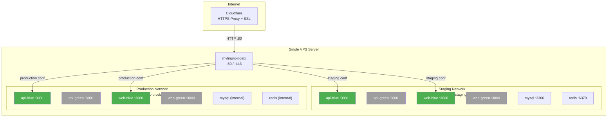
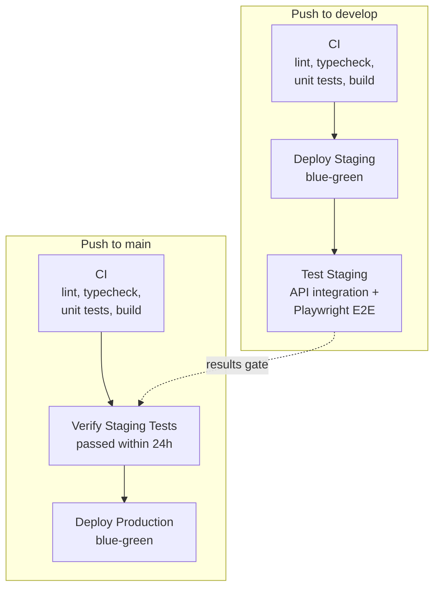

# MyFinPro — Project Progress

> **Last updated:** 2026-03-14
> **Current Phase:** Phase 1 — Basic Authentication ✅ Complete
> **Next Phase:** Phase 2 — Google Authentication

---

## 1. Project Overview

**MyFinPro** is a personal/family finance management application spanning a web app, Telegram bot, and Telegram mini app. It supports multi-provider authentication, group management, income/expense tracking (including loans, mortgages, and installment plans), budgets, receipt ingestion, analytics, and LLM-assisted insights.

### Tech Stack

| Layer          | Technology                               |
| -------------- | ---------------------------------------- |
| Frontend (Web) | Next.js 15 + TypeScript                  |
| Frontend i18n  | next-intl                                |
| Backend API    | NestJS + TypeScript                      |
| Database       | MySQL + Prisma                           |
| Cache / Queue  | Redis + BullMQ                           |
| Telegram Bot   | grammy.js                                |
| API Docs       | @nestjs/swagger                          |
| Testing        | Jest, Vitest, Playwright, Testcontainers |
| CI/CD          | GitHub Actions                           |
| Infrastructure | Docker Compose + Nginx                   |
| Rate Limiting  | @nestjs/throttler                        |

### Architecture

- **Monorepo** managed with pnpm workspaces
- **Apps:** `api` (NestJS), `web` (Next.js), `bot` (grammy.js)
- **Packages:** `shared` (DTOs, types, constants), `eslint-config`, `tsconfig`

---

## 2. Implementation Progress

| Phase | Name                       | Iterations | Status         | Completion Date |
| ----- | -------------------------- | ---------- | -------------- | --------------- |
| 0     | Foundation                 | 8/8        | ✅ Complete    | 2026-02-13      |
| 1     | Basic Authentication       | 13/13      | ✅ Complete    | 2026-03-14      |
| 2     | Google Authentication      | 0/4        | ⬜ Not Started | —               |
| 3     | Telegram Authentication    | 0/4        | ⬜ Not Started | —               |
| 4     | Family/Group Management    | 0/14       | ⬜ Not Started | —               |
| 5     | Income Management          | 0/10       | ⬜ Not Started | —               |
| 6     | Expense Management         | 0/13       | ⬜ Not Started | —               |
| 7     | Budgets & Spending Targets | 0/10       | ⬜ Not Started | —               |
| 8     | Receipt Processing         | 0/8        | ⬜ Not Started | —               |
| 9     | Purchase Analytics         | 0/8        | ⬜ Not Started | —               |
| 10    | Telegram Bot               | 0/16       | ⬜ Not Started | —               |
| 11    | Telegram Mini App          | 0/10       | ⬜ Not Started | —               |
| 12    | Bot Receipt Processing     | 0/8        | ⬜ Not Started | —               |
| 13    | Bot Analytics              | 0/4        | ⬜ Not Started | —               |
| 14    | LLM Assistant              | 0/8        | ⬜ Not Started | —               |

**Total iterations:** 128 | **Completed:** 21 | **Remaining:** 107

---

## 3. Phase 0 — Detailed Breakdown

### Iteration 0.1 + 0.2: Local Dev Readiness & Project Scaffolding

**What was implemented:**

- Docker Compose configuration for MySQL, Redis, and all services
- Environment templates (`.env.example`, `.env.staging.example`, `.env.production.example`)
- Monorepo structure with pnpm workspaces
- NestJS API scaffolding with API versioning (`/api/v1/`)
- @nestjs/swagger setup with OpenAPI docs
- Next.js web app with next-intl (English + Hebrew locales)
- Telegram bot scaffolding with grammy.js and @grammyjs/fluent
- Playwright E2E configuration
- Testcontainers integration test setup
- Prisma ORM with MySQL schema and seed script

**Key files created:**

- [`docker-compose.yml`](../docker-compose.yml) — Local dev services
- [`pnpm-workspace.yaml`](../pnpm-workspace.yaml) — Workspace configuration
- [`apps/api/src/main.ts`](../apps/api/src/main.ts) — API entry point
- [`apps/api/prisma/schema.prisma`](../apps/api/prisma/schema.prisma) — Database schema
- [`apps/api/src/config/swagger.config.ts`](../apps/api/src/config/swagger.config.ts) — Swagger/OpenAPI setup
- [`apps/web/src/app/[locale]/layout.tsx`](../apps/web/src/app/[locale]/layout.tsx) — i18n layout
- [`apps/web/src/i18n/routing.ts`](../apps/web/src/i18n/routing.ts) — Locale routing
- [`apps/bot/src/main.ts`](../apps/bot/src/main.ts) — Bot entry point
- [`apps/web/playwright.config.ts`](../apps/web/playwright.config.ts) — E2E config
- [`apps/api/test/helpers/testcontainers.ts`](../apps/api/test/helpers/testcontainers.ts) — Integration test container setup
- [`infrastructure/docker/api.Dockerfile`](../infrastructure/docker/api.Dockerfile) — API Docker image
- [`infrastructure/docker/web.Dockerfile`](../infrastructure/docker/web.Dockerfile) — Web Docker image
- [`infrastructure/docker/bot.Dockerfile`](../infrastructure/docker/bot.Dockerfile) — Bot Docker image
- [`infrastructure/nginx/nginx.conf`](../infrastructure/nginx/nginx.conf) — Nginx reverse proxy
- [`infrastructure/mysql/init/01-create-databases.sql`](../infrastructure/mysql/init/01-create-databases.sql) — DB initialization

**Tests added:**

- [`apps/api/src/app.controller.spec.ts`](../apps/api/src/app.controller.spec.ts) — Controller unit tests
- [`apps/api/test/integration/app.integration.spec.ts`](../apps/api/test/integration/app.integration.spec.ts) — Integration smoke tests
- [`apps/web/e2e/smoke.spec.ts`](../apps/web/e2e/smoke.spec.ts) — E2E smoke test

**Acceptance criteria met:**

- ✅ Dev stack runs with `docker compose up`
- ✅ Repo builds end-to-end
- ✅ OpenAPI docs accessible at `/api/docs`
- ✅ Playwright configured with sample test
- ✅ Testcontainers configured for isolated MySQL

---

### Iteration 0.3: Shared DTOs

**What was implemented:**

- Pagination DTOs with cursor-based pagination support
- Error response DTOs with standardized error codes
- Currency types with ISO 4217 support
- Common types (timestamps, IDs, etc.)
- Shared constants

**Key files created:**

- [`packages/shared/src/dto/pagination.dto.ts`](../packages/shared/src/dto/pagination.dto.ts) — Pagination request/response DTOs
- [`packages/shared/src/dto/api-response.dto.ts`](../packages/shared/src/dto/api-response.dto.ts) — Standard API response envelope
- [`packages/shared/src/dto/error-response.dto.ts`](../packages/shared/src/dto/error-response.dto.ts) — Error response DTO
- [`packages/shared/src/types/currency.types.ts`](../packages/shared/src/types/currency.types.ts) — Currency types
- [`packages/shared/src/types/common.types.ts`](../packages/shared/src/types/common.types.ts) — Common types
- [`packages/shared/src/index.ts`](../packages/shared/src/index.ts) — Package exports

**Tests added:**

- [`packages/shared/src/__tests__/common.test.ts`](../packages/shared/src/__tests__/common.test.ts) — Common type tests
- [`packages/shared/src/__tests__/currency.test.ts`](../packages/shared/src/__tests__/currency.test.ts) — Currency type tests
- [`packages/shared/src/__tests__/pagination.test.ts`](../packages/shared/src/__tests__/pagination.test.ts) — Pagination DTO tests

**Acceptance criteria met:**

- ✅ Shared types importable across packages
- ✅ All DTOs have unit tests

---

### Iteration 0.4: Baseline CI

**What was implemented:**

- GitHub Actions CI pipeline with lint, typecheck, unit test, and build jobs
- PR check workflow blocking merges on CI failure
- Dependabot configuration for automated dependency updates
- Pull request template
- Branch protection documentation

**Key files created:**

- [`.github/workflows/ci.yml`](../.github/workflows/ci.yml) — Main CI pipeline
- [`.github/workflows/pr-check.yml`](../.github/workflows/pr-check.yml) — PR check workflow
- [`.github/dependabot.yml`](../.github/dependabot.yml) — Dependabot config
- [`.github/PULL_REQUEST_TEMPLATE.md`](../.github/PULL_REQUEST_TEMPLATE.md) — PR template
- [`.github/BRANCH_PROTECTION.md`](../.github/BRANCH_PROTECTION.md) — Branch protection guide

**Acceptance criteria met:**

- ✅ PRs blocked on CI failure
- ✅ Lint, typecheck, and test checks run automatically

---

### Iteration 0.5: Basic CD

**What was implemented:**

- Staging deployment workflow (deploy on push to `main`)
- Production deployment workflow (manual trigger with approval)
- Docker Compose configurations for staging and production
- Deploy script with zero-downtime deployment
- Rollback script

**Key files created:**

- [`.github/workflows/deploy-staging.yml`](../.github/workflows/deploy-staging.yml) — Staging deploy pipeline
- [`.github/workflows/deploy-production.yml`](../.github/workflows/deploy-production.yml) — Production deploy pipeline
- [`docker-compose.staging.yml`](../docker-compose.staging.yml) — Staging Docker Compose
- [`docker-compose.production.yml`](../docker-compose.production.yml) — Production Docker Compose
- [`scripts/deploy.sh`](../scripts/deploy.sh) — Deployment script
- [`scripts/rollback.sh`](../scripts/rollback.sh) — Rollback script
- [`.env.staging.example`](../.env.staging.example) — Staging env template
- [`.env.production.example`](../.env.production.example) — Production env template

**Acceptance criteria met:**

- ✅ Staging environment reachable after deploy
- ✅ Production deploy with manual approval gate
- ✅ Zero-downtime deployment strategy

**Security improvement (post-Phase 0):**

- Migrated to ephemeral secret injection pattern — GitHub Secrets as single source of truth
- Deploy workflow: write temp `.env` → `docker compose up` → `shred .env`
- Docker Compose uses `env_file:` directive (not `environment:`) to prevent `docker inspect` exposure
- Replaced `.env.*.example` with `.env.*.template` (schema-only, no sample values)
- Updated all deployment documentation and server setup guides

---

### Iteration 0.6: Backup Strategy

**What was implemented:**

- Automated MySQL backup script with compression
- Restore script with verification
- Backup age alerting (alert if > 26 hours old)
- CI verification job for backup integrity
- Cron configuration for scheduled backups
- Backup documentation

**Key files created:**

- [`scripts/backup.sh`](../scripts/backup.sh) — Backup script
- [`scripts/restore.sh`](../scripts/restore.sh) — Restore script
- [`scripts/check-backup-age.sh`](../scripts/check-backup-age.sh) — Backup age monitor
- [`infrastructure/backup/crontab`](../infrastructure/backup/crontab) — Cron schedule
- [`infrastructure/backup/backup.env.example`](../infrastructure/backup/backup.env.example) — Backup env template
- [`.github/workflows/backup-verify.yml`](../.github/workflows/backup-verify.yml) — Backup verification CI job
- [`docs/backup.md`](backup.md) — Backup documentation

**Acceptance criteria met:**

- ✅ Backups verified and restorable
- ✅ Alert if backup older than 26 hours
- ✅ CI verification job configured

---

### Iteration 0.7: Observability Baseline

**What was implemented:**

- Structured JSON logging with request context (correlation IDs)
- Health check endpoints (`/health`) with database, Redis, and memory indicators
- Prometheus-compatible metrics collection
- Metrics interceptor for request duration and count tracking
- Request context middleware for tracing

**Key files created:**

- [`apps/api/src/common/logger/logger.service.ts`](../apps/api/src/common/logger/logger.service.ts) — Structured logger
- [`apps/api/src/common/logger/logger.module.ts`](../apps/api/src/common/logger/logger.module.ts) — Logger module
- [`apps/api/src/health/health.controller.ts`](../apps/api/src/health/health.controller.ts) — Health check endpoint
- [`apps/api/src/health/health.module.ts`](../apps/api/src/health/health.module.ts) — Health module
- [`apps/api/src/health/indicators/database.indicator.ts`](../apps/api/src/health/indicators/database.indicator.ts) — DB health indicator
- [`apps/api/src/health/indicators/redis.indicator.ts`](../apps/api/src/health/indicators/redis.indicator.ts) — Redis health indicator
- [`apps/api/src/health/indicators/memory.indicator.ts`](../apps/api/src/health/indicators/memory.indicator.ts) — Memory health indicator
- [`apps/api/src/common/metrics/metrics.service.ts`](../apps/api/src/common/metrics/metrics.service.ts) — Metrics service
- [`apps/api/src/common/metrics/metrics.controller.ts`](../apps/api/src/common/metrics/metrics.controller.ts) — Metrics endpoint
- [`apps/api/src/common/metrics/metrics.interceptor.ts`](../apps/api/src/common/metrics/metrics.interceptor.ts) — Request metrics interceptor
- [`apps/api/src/common/context/request-context.middleware.ts`](../apps/api/src/common/context/request-context.middleware.ts) — Request context
- [`apps/api/src/common/filters/all-exceptions.filter.ts`](../apps/api/src/common/filters/all-exceptions.filter.ts) — Global exception filter
- [`apps/api/src/common/filters/http-exception.filter.ts`](../apps/api/src/common/filters/http-exception.filter.ts) — HTTP exception filter
- [`apps/api/src/common/interceptors/transform.interceptor.ts`](../apps/api/src/common/interceptors/transform.interceptor.ts) — Response transform

**Tests added:**

- [`apps/api/src/health/health.controller.spec.ts`](../apps/api/src/health/health.controller.spec.ts) — Health endpoint tests
- [`apps/api/src/common/logger/logger.service.spec.ts`](../apps/api/src/common/logger/logger.service.spec.ts) — Logger tests
- [`apps/api/src/common/metrics/metrics.service.spec.ts`](../apps/api/src/common/metrics/metrics.service.spec.ts) — Metrics tests

**Acceptance criteria met:**

- ✅ Health endpoint returns component status
- ✅ Structured JSON logs with correlation IDs
- ✅ Metrics collection active

---

### Iteration 0.8: Rate Limiting

**What was implemented:**

- @nestjs/throttler global rate limiting
- Proxy-aware rate limiting guard (trust X-Forwarded-For)
- Custom `@Throttle()` decorator for per-endpoint overrides
- Throttler configuration module with environment-based settings

**Key files created:**

- [`apps/api/src/common/throttler/throttler.module.ts`](../apps/api/src/common/throttler/throttler.module.ts) — Throttler module
- [`apps/api/src/common/throttler/throttler.guard.ts`](../apps/api/src/common/throttler/throttler.guard.ts) — Custom throttler guard
- [`apps/api/src/common/throttler/throttler-behind-proxy.guard.ts`](../apps/api/src/common/throttler/throttler-behind-proxy.guard.ts) — Proxy-aware guard
- [`apps/api/src/common/decorators/throttle.decorator.ts`](../apps/api/src/common/decorators/throttle.decorator.ts) — Throttle decorator
- [`apps/api/src/config/throttler.config.ts`](../apps/api/src/config/throttler.config.ts) — Throttler config

**Tests added:**

- [`apps/api/src/common/throttler/throttler.guard.spec.ts`](../apps/api/src/common/throttler/throttler.guard.spec.ts) — Guard tests
- [`apps/api/src/common/decorators/throttle.decorator.spec.ts`](../apps/api/src/common/decorators/throttle.decorator.spec.ts) — Decorator tests

**Acceptance criteria met:**

- ✅ Rate limiting active on all endpoints
- ✅ Proxy-aware IP extraction
- ✅ Per-endpoint override capability

---

## 3b. Blue-Green Deployment — Post-Phase 0 Infrastructure Upgrade (2026-03-07)

### Overview

Upgraded the deployment system from monolithic Docker Compose to a **blue-green deployment** architecture with a shared Nginx reverse proxy, enabling zero-downtime deployments for both staging and production on a single VPS.

### What was implemented:

**Blue-Green Deployment System:**

- [`scripts/deploy.sh`](../scripts/deploy.sh) — Blue-green deploy script with slot alternation, health checks, nginx config generation, and smart cleanup
- [`scripts/rollback.sh`](../scripts/rollback.sh) — Rollback script that reverts to previous slot
- [`scripts/cleanup-images.sh`](../scripts/cleanup-images.sh) — Smart Docker image cleanup per environment
- [`docker-compose.staging.app.yml`](../docker-compose.staging.app.yml) — Staging app services (blue/green slots)
- [`docker-compose.staging.infra.yml`](../docker-compose.staging.infra.yml) — Staging infrastructure (MySQL, Redis)
- [`docker-compose.production.app.yml`](../docker-compose.production.app.yml) — Production app services
- [`docker-compose.production.infra.yml`](../docker-compose.production.infra.yml) — Production infrastructure
- [`docker-compose.shared-nginx.yml`](../docker-compose.shared-nginx.yml) — Shared Nginx reverse proxy

**Shared Nginx Architecture:**

- Single Nginx container (`myfinpro-nginx`) serves both staging and production
- Connected to both `myfinpro-staging-net` and `myfinpro-production-net` Docker networks
- Per-environment configs generated at deploy time via `envsubst` from [`infrastructure/nginx/conf.d/ssl.conf.template`](../infrastructure/nginx/conf.d/ssl.conf.template)
- [`infrastructure/nginx/conf.d/_default.conf`](../infrastructure/nginx/conf.d/_default.conf) — Default server with `/health` endpoint
- [`infrastructure/nginx/conf.d/cloudflare-ips.conf`](../infrastructure/nginx/conf.d/cloudflare-ips.conf) — Cloudflare IP trust for real IP detection

**CI/CD Workflows:**

- [`.github/workflows/deploy-staging.yml`](../.github/workflows/deploy-staging.yml) — Staging deploy (auto on push to `develop`)
- [`.github/workflows/deploy-production.yml`](../.github/workflows/deploy-production.yml) — Production deploy (auto on push to `main`, manual with confirmation)
- [`.github/workflows/infra-maintenance.yml`](../.github/workflows/infra-maintenance.yml) — Infrastructure maintenance (cleanup + Cloudflare DNS setup)

**Cloudflare Integration:**

- DNS records managed via Cloudflare API in infra-maintenance workflow
- SSL mode: Flexible (Cloudflare handles HTTPS, origin serves HTTP)
- Staging: staging domain (single-level subdomain for Universal SSL compatibility)
- Production: production domain

**Documentation:**

- [`docs/blue-green-deployment.md`](blue-green-deployment.md) — Blue-green deployment architecture and procedures

### Issues encountered and resolved:

1. **Port 80 conflict** — Old per-environment nginx containers held port 80. Fixed by stopping old containers before starting shared nginx.
2. **Invalid Cloudflare IP in trust proxy** — `104.16.0/12` is not valid CIDR. Fixed to `104.16.0.0/13` + `104.24.0.0/14`.
3. **Missing database tables** — Prisma migrations not run on first deploy. Added `prisma db push` to deploy script.
4. **Multi-level subdomain SSL** — `<old staging domain>` not covered by Cloudflare Universal SSL wildcard. Changed to staging domain.
5. **Missing Cloudflare secrets** — `CLOUDFLARE_API_TOKEN` and `CLOUDFLARE_ZONE_ID` needed for DNS automation.

### Deployment verification (2026-03-07):

| URL                           | Expected       | Result                     |
| ----------------------------- | -------------- | -------------------------- |
| `https://<staging domain>`    | HTTPS response | ✅ `HTTP/2 307` → `/en`    |
| `http://<staging domain>`     | 301 → HTTPS    | ✅ `301 Moved Permanently` |
| `https://<production domain>` | HTTPS response | ✅ `HTTP/2 307` → `/en`    |
| `http://<production domain>`  | 301 → HTTPS    | ✅ `301 Moved Permanently` |

### Server architecture:



> Green-highlighted containers are the active (blue) slot. Grey containers are the inactive (green) slot, started during the next deployment.

---

## 3c. Testing & Deployment Pipeline — Post-Phase 0 Enhancement (2026-03-07)

### Overview

Implemented a comprehensive testing and deployment pipeline that covers unit tests, staging integration tests, and a test-gated production deployment workflow. This ensures every production deploy is validated against the staging environment.

### Pipeline Architecture



### What was implemented:

**Unit Tests — API (Jest, 13 suites, ~90 tests):**

- [`apps/api/src/app.controller.spec.ts`](../apps/api/src/app.controller.spec.ts) — App controller tests
- [`apps/api/src/app.service.spec.ts`](../apps/api/src/app.service.spec.ts) — App service tests
- [`apps/api/src/health/health.controller.spec.ts`](../apps/api/src/health/health.controller.spec.ts) — Health endpoint tests
- [`apps/api/src/common/logger/logger.service.spec.ts`](../apps/api/src/common/logger/logger.service.spec.ts) — Logger tests
- [`apps/api/src/common/metrics/metrics.service.spec.ts`](../apps/api/src/common/metrics/metrics.service.spec.ts) — Metrics tests
- [`apps/api/src/common/throttler/throttler.guard.spec.ts`](../apps/api/src/common/throttler/throttler.guard.spec.ts) — Throttler guard tests
- [`apps/api/src/common/decorators/throttle.decorator.spec.ts`](../apps/api/src/common/decorators/throttle.decorator.spec.ts) — Throttle decorator tests
- [`apps/api/src/prisma/prisma.service.spec.ts`](../apps/api/src/prisma/prisma.service.spec.ts) — Prisma service tests
- [`apps/api/src/common/filters/all-exceptions.filter.spec.ts`](../apps/api/src/common/filters/all-exceptions.filter.spec.ts) — Exception filter tests
- [`apps/api/src/common/interceptors/transform.interceptor.spec.ts`](../apps/api/src/common/interceptors/transform.interceptor.spec.ts) — Transform interceptor tests
- [`apps/api/src/common/pipes/validation.pipe.spec.ts`](../apps/api/src/common/pipes/validation.pipe.spec.ts) — Validation pipe tests
- [`apps/api/src/common/context/request-context.middleware.spec.ts`](../apps/api/src/common/context/request-context.middleware.spec.ts) — Request context middleware tests
- [`apps/api/src/common/context/request-context.spec.ts`](../apps/api/src/common/context/request-context.spec.ts) — Request context tests

**Unit Tests — Web (Vitest, 3 suites, 35 tests):**

- [`apps/web/src/components/ui/Button.spec.tsx`](../apps/web/src/components/ui/Button.spec.tsx) — Button component tests
- [`apps/web/src/components/layout/Header.spec.tsx`](../apps/web/src/components/layout/Header.spec.tsx) — Header component tests
- [`apps/web/src/lib/api-client.spec.ts`](../apps/web/src/lib/api-client.spec.ts) — API client tests

**Unit Tests — Shared (Vitest, 3 suites, 46 tests):**

- [`packages/shared/src/__tests__/common.test.ts`](../packages/shared/src/__tests__/common.test.ts) — Common type tests
- [`packages/shared/src/__tests__/currency.test.ts`](../packages/shared/src/__tests__/currency.test.ts) — Currency type tests
- [`packages/shared/src/__tests__/pagination.test.ts`](../packages/shared/src/__tests__/pagination.test.ts) — Pagination DTO tests

**Staging Integration Tests — API (Jest HTTP-based, 4 suites, 16 tests):**

- [`apps/api/test/staging/health.staging.spec.ts`](../apps/api/test/staging/health.staging.spec.ts) — Health endpoint against live staging
- [`apps/api/test/staging/api-root.staging.spec.ts`](../apps/api/test/staging/api-root.staging.spec.ts) — API root endpoint tests
- [`apps/api/test/staging/swagger.staging.spec.ts`](../apps/api/test/staging/swagger.staging.spec.ts) — Swagger docs accessibility
- [`apps/api/test/staging/rate-limiting.staging.spec.ts`](../apps/api/test/staging/rate-limiting.staging.spec.ts) — Rate limiting verification
- [`apps/api/test/staging/helpers.ts`](../apps/api/test/staging/helpers.ts) — Staging test helpers
- [`apps/api/test/staging/setup.ts`](../apps/api/test/staging/setup.ts) — Staging test setup
- [`apps/api/jest.staging.config.ts`](../apps/api/jest.staging.config.ts) — Staging Jest config

**Staging E2E Tests — Playwright (4 suites, 14 tests):**

- [`apps/web/e2e/staging/homepage.staging.spec.ts`](../apps/web/e2e/staging/homepage.staging.spec.ts) — Homepage loads, key elements present
- [`apps/web/e2e/staging/api-proxy.staging.spec.ts`](../apps/web/e2e/staging/api-proxy.staging.spec.ts) — Frontend API proxy forwarding
- [`apps/web/e2e/staging/i18n.staging.spec.ts`](../apps/web/e2e/staging/i18n.staging.spec.ts) — i18n locale switching
- [`apps/web/e2e/staging/responsive.staging.spec.ts`](../apps/web/e2e/staging/responsive.staging.spec.ts) — Responsive layout
- [`apps/web/playwright.staging.config.ts`](../apps/web/playwright.staging.config.ts) — Staging Playwright config

**Workflow files created/modified:**

- [`.github/workflows/ci.yml`](../.github/workflows/ci.yml) — CI pipeline (lint, typecheck, unit tests, build)
- [`.github/workflows/deploy-staging.yml`](../.github/workflows/deploy-staging.yml) — Staging deployment (blue-green)
- [`.github/workflows/test-staging.yml`](../.github/workflows/test-staging.yml) — **New**: Staging tests (API + Playwright E2E)
- [`.github/workflows/deploy-production.yml`](../.github/workflows/deploy-production.yml) — **Updated**: Production deployment with staging test gate

**Production Deployment Gating:**

- Production deploy verifies latest `test-staging.yml` run was successful and < 24 hours old
- Blocks deployment with clear error message if staging tests are stale or failed
- Ensures every production deploy is validated against the staging environment

### Quality metrics after this enhancement:

| Metric              | Count | Breakdown                                                                         |
| ------------------- | ----- | --------------------------------------------------------------------------------- |
| **Unit Tests**      | ~171  | API: 13 suites / ~90 tests, Web: 3 suites / 35 tests, Shared: 3 suites / 46 tests |
| **Staging Tests**   | 30    | API integration: 4 suites / 16 tests, Playwright E2E: 4 suites / 14 tests         |
| **Total Tests**     | ~201  | All automated, running in CI/CD pipeline                                          |
| **Test Frameworks** | 3     | Jest (API), Vitest (Web + Shared), Playwright (E2E)                               |

---

## 4. Phase 1 — Basic Authentication

### Overview

Phase 1 implements a complete authentication system with email/password registration and login, JWT-based session management with refresh token rotation, protected routes, and a basic dashboard. Security is the top priority as this phase begins collecting user data.

### Architecture Decisions

- **Password Hashing**: Argon2id (64MB memory, 3 iterations, 4 parallelism) — winner of Password Hashing Competition
- **JWT Access Tokens**: 15-minute expiry, HS256, stored in React state (memory only — never localStorage)
- **Refresh Tokens**: 7-day expiry, random UUID, SHA-256 hashed before storage, httpOnly Secure SameSite=Strict cookie
- **Token Rotation**: Every refresh issues new tokens; old refresh token immediately revoked
- **Reuse Detection**: If a revoked refresh token is reused, all user tokens are revoked (compromised session detected)
- **Rate Limiting**: 5 req/min on register + login endpoints (brute force protection)
- **Error Codes**: Structured `errorCode` field in all auth error responses for frontend i18n mapping

### Iteration 1.0: Infrastructure Prerequisites (commit ea6629b)

**What was implemented:**

- Added cookie-parser middleware for httpOnly refresh token cookies
- Added Helmet security headers middleware
- Changed backup crontab from daily to hourly (security — user data collection starts)
- Changed deploy script to use `prisma migrate deploy` (production-safe migrations)
- Added JWT_SECRET and JWT_EXPIRATION to env templates

---

### Iteration 1.1: User Schema (commit f19c1cf)

**What was implemented:**

- Created User model (UUID id, email unique, passwordHash, name, defaultCurrency, locale, timezone, isActive, emailVerified, lastLoginAt)
- Created RefreshToken model (tokenHash, userId FK, expiresAt, revokedAt, replacedBy) with cascade delete
- Created AuditLog model (action, entityType, entityId, userId, metadata JSON, ipAddress, userAgent)
- Created HealthCheck model (status, responseTime, details JSON)

**Key files created:**

- [`apps/api/prisma/migrations/20260314123440_phase1_auth_schema/migration.sql`](../apps/api/prisma/migrations/20260314123440_phase1_auth_schema/migration.sql) — Database migration
- [`apps/api/prisma/schema.prisma`](../apps/api/prisma/schema.prisma) — Updated with User, RefreshToken, AuditLog, HealthCheck models

---

### Iteration 1.2+1.3: Registration API + Password Hashing (commit 5dbe79f)

**What was implemented:**

- Implemented PasswordService with Argon2id (64MB memory, 3 iterations, 4 parallelism)
- Implemented RegisterDto with class-validator (email, password 8-128 chars + complexity, name, currency, locale)
- POST /api/v1/auth/register — creates user, hashes password, returns user + access token + sets refresh cookie

**Tests added:**

- 28 unit tests + 5 integration tests (using Testcontainers)

---

### Iteration 1.4: Login API (commit 367c59d)

**What was implemented:**

- Implemented Passport LocalStrategy for email/password validation
- Created LocalAuthGuard
- POST /api/v1/auth/login — validates credentials, returns user + tokens
- Account disabled check (isActive flag)
- Updates lastLoginAt on successful login

**Key files created:**

- [`apps/api/src/auth/strategies/local.strategy.ts`](../apps/api/src/auth/strategies/local.strategy.ts) — Passport local strategy
- [`apps/api/src/auth/guards/local-auth.guard.ts`](../apps/api/src/auth/guards/local-auth.guard.ts) — Local auth guard

---

### Iteration 1.5: JWT Issuance (commit 11119ee)

**What was implemented:**

- Implemented TokenService for JWT generation (HS256, 15min expiry)
- JWT payload: { sub: userId, email, name }
- Refresh token: crypto.randomUUID(), SHA-256 hashed before DB storage
- Cookie options: httpOnly, Secure (production), SameSite=Strict, path=/api/v1/auth, maxAge=7d
- JwtStrategy for extracting user from Bearer token

**Key files created:**

- [`apps/api/src/auth/services/token.service.ts`](../apps/api/src/auth/services/token.service.ts) — JWT + refresh token generation
- [`apps/api/src/auth/strategies/jwt.strategy.ts`](../apps/api/src/auth/strategies/jwt.strategy.ts) — JWT extraction strategy
- [`apps/api/src/auth/guards/jwt-auth.guard.ts`](../apps/api/src/auth/guards/jwt-auth.guard.ts) — JWT auth guard
- [`apps/api/src/auth/interfaces/jwt-payload.interface.ts`](../apps/api/src/auth/interfaces/jwt-payload.interface.ts) — JWT payload type

---

### Iteration 1.6: Token Refresh + Rotation + Logout (commit 36f8494)

**What was implemented:**

- POST /api/v1/auth/refresh — validates refresh cookie, issues new token pair, revokes old
- Token rotation: old refresh token revoked, replaced by new one (replacedBy chain)
- Reuse detection: if revoked token reused, all user's refresh tokens revoked
- POST /api/v1/auth/logout — revokes current refresh token, clears cookie
- RefreshTokenService with create, validate, rotate, revokeAll methods

**Key files created:**

- [`apps/api/src/auth/services/refresh-token.service.ts`](../apps/api/src/auth/services/refresh-token.service.ts) — Refresh token lifecycle management
- [`apps/api/src/auth/auth.controller.ts`](../apps/api/src/auth/auth.controller.ts) — Auth controller (register, login, refresh, logout, me)

---

### Iteration 1.7: Login UI (commit de518bd)

**What was implemented:**

- Created reusable Input component (label, error, accessibility, RTL support)
- Created LoginForm component (email + password fields, loading state, error display)
- Created /[locale]/auth/login page
- Added auth i18n translations (en + he) for all form elements
- Added Sign In / Sign Up links to Header navigation
- Migrated middleware.ts → proxy.ts (Next.js 16 convention)

**Key files created:**

- [`apps/web/src/components/ui/Input.tsx`](../apps/web/src/components/ui/Input.tsx) — Reusable form input
- [`apps/web/src/components/auth/LoginForm.tsx`](../apps/web/src/components/auth/LoginForm.tsx) — Login form
- [`apps/web/src/app/[locale]/auth/login/page.tsx`](../apps/web/src/app/[locale]/auth/login/page.tsx) — Login page

**Tests added:**

- [`apps/web/src/components/ui/Input.spec.tsx`](../apps/web/src/components/ui/Input.spec.tsx) — Input component tests (16 tests)
- [`apps/web/src/components/auth/LoginForm.spec.tsx`](../apps/web/src/components/auth/LoginForm.spec.tsx) — LoginForm tests (11 tests)
- 64 web tests passing

---

### Iteration 1.8: Registration UI (commit 18fa7c7)

**What was implemented:**

- Created RegisterForm component (name, email, password, confirm password, currency selector)
- Created PasswordStrength indicator (visual bar + text, 5 levels: very-weak to very-strong)
- Password validation: 8+ chars, uppercase, lowercase, number, special character
- Created /[locale]/auth/register page

**Key files created:**

- [`apps/web/src/components/auth/RegisterForm.tsx`](../apps/web/src/components/auth/RegisterForm.tsx) — Registration form
- [`apps/web/src/components/auth/PasswordStrength.tsx`](../apps/web/src/components/auth/PasswordStrength.tsx) — Password strength indicator
- [`apps/web/src/app/[locale]/auth/register/page.tsx`](../apps/web/src/app/[locale]/auth/register/page.tsx) — Register page

**Tests added:**

- [`apps/web/src/components/auth/RegisterForm.spec.tsx`](../apps/web/src/components/auth/RegisterForm.spec.tsx) — RegisterForm tests
- [`apps/web/src/components/auth/PasswordStrength.spec.tsx`](../apps/web/src/components/auth/PasswordStrength.spec.tsx) — PasswordStrength tests
- 89 web tests passing

---

### Iteration 1.9: Frontend Auth Integration (commit f8e8c6a)

**What was implemented:**

- Created AuthProvider React context (user state, accessToken in memory, login/register/logout functions)
- Silent refresh on page load (POST /auth/refresh with credentials: include)
- Connected LoginForm and RegisterForm to real API via auth context
- Header shows user name + Dashboard + Logout when authenticated; Sign In/Up when not

**Key files created:**

- [`apps/web/src/lib/auth/auth-context.tsx`](../apps/web/src/lib/auth/auth-context.tsx) — Auth context provider
- [`apps/web/src/lib/auth/types.ts`](../apps/web/src/lib/auth/types.ts) — Auth type definitions

**Tests added:**

- [`apps/web/src/lib/auth/auth-context.spec.tsx`](../apps/web/src/lib/auth/auth-context.spec.tsx) — Auth context tests
- 111 web tests passing

---

### Iteration 1.10: Protected Routes + E2E Tests (commit f9c88e7)

**What was implemented:**

- Created CurrentUser decorator for extracting JWT payload
- Added GET /api/v1/auth/me — returns authenticated user's profile (no passwordHash)
- Created ProtectedRoute component (redirects to login if unauthenticated, shows spinner while loading)
- Created /[locale]/dashboard placeholder page (wrapped in ProtectedRoute)
- Login redirect support: preserves `?redirect=` URL after login
- Playwright E2E tests: 9 tests across login/register pages, navigation, button states, dashboard redirect

**Key files created:**

- [`apps/web/src/components/auth/ProtectedRoute.tsx`](../apps/web/src/components/auth/ProtectedRoute.tsx) — Protected route component
- [`apps/web/src/app/[locale]/dashboard/page.tsx`](../apps/web/src/app/[locale]/dashboard/page.tsx) — Dashboard page
- [`apps/web/e2e/auth.spec.ts`](../apps/web/e2e/auth.spec.ts) — Playwright auth E2E tests

**Tests added:**

- [`apps/web/src/components/auth/ProtectedRoute.spec.tsx`](../apps/web/src/components/auth/ProtectedRoute.spec.tsx) — ProtectedRoute tests
- [`apps/web/src/app/[locale]/dashboard/dashboard.spec.tsx`](../apps/web/src/app/[locale]/dashboard/dashboard.spec.tsx) — Dashboard tests
- 171 API tests, 118 web unit tests, 9 E2E tests

---

### Iteration 1.11: Error Handling (commit 94d0516)

**What was implemented:**

- Created AUTH_ERRORS constants (9 structured error codes)
- Updated all auth service throws to include errorCode field
- Updated AllExceptionsFilter + HttpExceptionFilter to pass errorCode in response
- Created Toast notification system (success/error/warning/info, auto-dismiss, stack, accessible)
- Created ErrorBoundary class component (fallback UI, reset, custom fallback prop)
- Integrated toasts into login/register forms (success messages on auth)

**Key files created:**

- [`apps/web/src/components/ui/Toast.tsx`](../apps/web/src/components/ui/Toast.tsx) — Toast notification system
- [`apps/web/src/components/ui/ErrorBoundary.tsx`](../apps/web/src/components/ui/ErrorBoundary.tsx) — React error boundary

**Tests added:**

- [`apps/web/src/components/ui/Toast.spec.tsx`](../apps/web/src/components/ui/Toast.spec.tsx) — Toast component tests
- [`apps/web/src/components/ui/ErrorBoundary.spec.tsx`](../apps/web/src/components/ui/ErrorBoundary.spec.tsx) — ErrorBoundary tests
- 171 API tests, 138 web unit tests, 45 E2E tests (5 browsers)

---

### Iteration 1.12: Auth Rate Limiting (commit 0ce0c89)

**What was implemented:**

- Applied @CustomThrottle({ limit: 5, ttl: 60000 }) to register + login (5 req/min)
- Applied @CustomThrottle({ limit: 10, ttl: 60000 }) to refresh + logout (10 req/min)
- GET /auth/me uses global default (60 req/min)
- Frontend handles 429 responses with "Too many attempts" message
- Added Swagger @ApiTooManyRequestsResponse annotations

**Tests added:**

- 176 API tests, 138 web unit tests, 45 E2E tests

**Acceptance criteria met:**

- ✅ Email/password registration and login working end-to-end
- ✅ JWT access tokens (15min) + refresh tokens (7d) with rotation
- ✅ Reuse detection revokes all tokens on compromised refresh token
- ✅ Protected routes redirect unauthenticated users to login
- ✅ Dashboard accessible only when authenticated
- ✅ Toast notifications for auth success/error states
- ✅ Error boundary catches unexpected React errors
- ✅ Rate limiting on auth endpoints (5/min register + login)
- ✅ All tests passing (176 API + 138 web + 45 E2E)

### Test Summary

| Category           | Count | Framework                                                        |
| ------------------ | ----- | ---------------------------------------------------------------- |
| API Unit Tests     | 176   | Jest                                                             |
| API Integration    | ~15   | Jest + Testcontainers                                            |
| Web Unit Tests     | 138   | Vitest + Testing Library                                         |
| Playwright E2E     | 45    | Playwright (chromium, firefox, webkit, mobile-chrome, mobile-safari) |
| Shared Package     | 15    | Vitest                                                           |
| **Total**          | **~389** |                                                               |

### Security Measures

1. Argon2id password hashing (memory-hard, side-channel resistant)
2. JWT access tokens in memory only (XSS-safe — no localStorage)
3. Refresh tokens in httpOnly Secure SameSite=Strict cookies (CSRF-safe)
4. Token rotation on every refresh (limits window of compromised tokens)
5. Reuse detection (revokes all tokens if compromised token reused)
6. Rate limiting on auth endpoints (5/min register + login)
7. Helmet security headers (CSP, HSTS, X-Frame-Options, etc.)
8. CORS configured for specific origins only
9. Structured error codes (no sensitive info leakage in error messages)
10. Hourly database backups (data persistence since user data collection begins)

### Files Created/Modified (Phase 1)

**API — Auth Module:**

- [`apps/api/src/auth/auth.module.ts`](../apps/api/src/auth/auth.module.ts) — Auth module
- [`apps/api/src/auth/auth.controller.ts`](../apps/api/src/auth/auth.controller.ts) — Auth controller (register, login, refresh, logout, me)
- [`apps/api/src/auth/auth.service.ts`](../apps/api/src/auth/auth.service.ts) — Auth service
- [`apps/api/src/auth/dto/`](../apps/api/src/auth/dto/) — Register and Login DTOs
- [`apps/api/src/auth/guards/`](../apps/api/src/auth/guards/) — JWT and Local auth guards
- [`apps/api/src/auth/strategies/`](../apps/api/src/auth/strategies/) — Passport JWT and Local strategies
- [`apps/api/src/auth/services/`](../apps/api/src/auth/services/) — Token, Password, and RefreshToken services
- [`apps/api/src/auth/interfaces/`](../apps/api/src/auth/interfaces/) — JWT payload interface
- [`apps/api/prisma/migrations/20260314123440_phase1_auth_schema/`](../apps/api/prisma/migrations/20260314123440_phase1_auth_schema/) — Database migration

**Web — Auth Components:**

- [`apps/web/src/lib/auth/auth-context.tsx`](../apps/web/src/lib/auth/auth-context.tsx) — Auth context provider
- [`apps/web/src/lib/auth/types.ts`](../apps/web/src/lib/auth/types.ts) — Auth type definitions
- [`apps/web/src/components/auth/LoginForm.tsx`](../apps/web/src/components/auth/LoginForm.tsx) — Login form
- [`apps/web/src/components/auth/RegisterForm.tsx`](../apps/web/src/components/auth/RegisterForm.tsx) — Registration form
- [`apps/web/src/components/auth/PasswordStrength.tsx`](../apps/web/src/components/auth/PasswordStrength.tsx) — Password strength indicator
- [`apps/web/src/components/auth/ProtectedRoute.tsx`](../apps/web/src/components/auth/ProtectedRoute.tsx) — Protected route component
- [`apps/web/src/components/ui/Input.tsx`](../apps/web/src/components/ui/Input.tsx) — Reusable form input
- [`apps/web/src/components/ui/Toast.tsx`](../apps/web/src/components/ui/Toast.tsx) — Toast notification system
- [`apps/web/src/components/ui/ErrorBoundary.tsx`](../apps/web/src/components/ui/ErrorBoundary.tsx) — React error boundary

**Web — Pages:**

- [`apps/web/src/app/[locale]/auth/login/page.tsx`](../apps/web/src/app/[locale]/auth/login/page.tsx) — Login page
- [`apps/web/src/app/[locale]/auth/register/page.tsx`](../apps/web/src/app/[locale]/auth/register/page.tsx) — Register page
- [`apps/web/src/app/[locale]/dashboard/page.tsx`](../apps/web/src/app/[locale]/dashboard/page.tsx) — Protected dashboard page

**E2E Tests:**

- [`apps/web/e2e/auth.spec.ts`](../apps/web/e2e/auth.spec.ts) — Playwright auth E2E tests

**Documentation:**

- [`docs/phase-1-design.md`](phase-1-design.md) — Phase 1 design document

### Status: ✅ COMPLETE

- All 13 iterations implemented and tested
- All tests passing (176 API + 138 web + 45 E2E)
- Build clean, typecheck clean
- Ready for staging and production deployment

---

## 5. Current Project Structure

```
myfinpro/
├── apps/
│   ├── api/                    # NestJS backend API
│   │   ├── prisma/             # Database schema & migrations
│   │   ├── src/
│   │   │   ├── auth/           # Authentication module (Phase 1)
│   │   │   │   ├── dto/        # Register, Login DTOs
│   │   │   │   ├── guards/     # JWT and Local auth guards
│   │   │   │   ├── interfaces/ # JWT payload interface
│   │   │   │   ├── services/   # Token, Password, RefreshToken services
│   │   │   │   └── strategies/ # Passport JWT and Local strategies
│   │   │   ├── common/         # Shared middleware, filters, guards, decorators
│   │   │   ├── config/         # App, database, swagger, throttler config
│   │   │   ├── health/         # Health check endpoints & indicators
│   │   │   └── prisma/         # Prisma service module
│   │   └── test/               # Test setup, helpers, integration tests, staging tests
│   ├── web/                    # Next.js frontend
│   │   ├── e2e/                # Playwright E2E tests (smoke, auth, staging)
│   │   ├── messages/           # i18n translation files (en, he)
│   │   ├── src/
│   │   │   ├── app/            # App router pages & layouts
│   │   │   │   └── [locale]/
│   │   │   │       ├── auth/   # Login and register pages
│   │   │   │       └── dashboard/ # Protected dashboard page
│   │   │   ├── components/     # UI + auth + layout components
│   │   │   │   ├── auth/       # LoginForm, RegisterForm, PasswordStrength, ProtectedRoute
│   │   │   │   ├── layout/     # Header
│   │   │   │   └── ui/         # Button, Input, Toast, ErrorBoundary
│   │   │   ├── i18n/           # Internationalization config
│   │   │   ├── hooks/          # Custom React hooks
│   │   │   └── lib/            # Utility libraries (API client, auth context)
│   │   │       └── auth/       # Auth context, types
│   │   └── public/             # Static assets
│   └── bot/                    # Telegram bot (grammy.js)
│       └── src/
│           └── locales/        # Bot i18n fluent files (en, he)
├── packages/
│   ├── shared/                 # Shared DTOs, types, constants
│   │   └── src/
│   │       ├── dto/            # Pagination, API response, error DTOs
│   │       ├── types/          # Currency, common types
│   │       ├── constants/      # Shared constants
│   │       └── __tests__/      # Unit tests
│   ├── eslint-config/          # Shared ESLint configurations
│   └── tsconfig/               # Shared TypeScript configurations
├── infrastructure/
│   ├── docker/                 # Dockerfiles (api, web, bot)
│   ├── nginx/                  # Nginx reverse proxy config
│   ├── mysql/                  # Database initialization scripts
│   └── backup/                 # Backup configuration
├── scripts/                    # DevOps scripts (deploy, backup, restore, rollback)
├── docs/                       # Project documentation
└── .github/                    # CI/CD workflows, PR template, dependabot
```

---

## 6. Quality Metrics

| Metric                  | Result                                                                         |
| ----------------------- | ------------------------------------------------------------------------------ |
| **Lint**                | 0 errors, 0 warnings                                                          |
| **Typecheck**           | 0 errors                                                                       |
| **API Unit Tests**      | 176 passing (Jest)                                                             |
| **API Integration**     | ~15 passing (Jest + Testcontainers)                                            |
| **Web Unit Tests**      | 138 passing (Vitest + Testing Library)                                         |
| **Shared Unit Tests**   | 15 passing (Vitest)                                                            |
| **Playwright E2E**      | 45 passing (chromium, firefox, webkit, mobile-chrome, mobile-safari)           |
| **Staging Integration** | 16 passing (4 suites: health, api-root, swagger, rate-limiting)                |
| **Staging E2E**         | 14 passing (4 suites: homepage, api-proxy, i18n, responsive)                   |
| **Total Tests**         | ~419 across all test types                                                     |
| **Build**               | All packages successful                                                        |
| **Production Gate**     | Staging tests must pass within 24h before production deploy                    |

---

## 7. Git History

**Phase 0:**

```
58293a9 feat(phase-0.1+0.2): local dev readiness & project scaffolding
8198c58 feat(phase-0.3): shared DTOs — pagination, error responses, currency types
cdc8707 feat(phase-0.4): baseline CI — lint, typecheck, test, build pipelines
956dc70 feat(phase-0.5): basic CD — staging and production deploy pipelines
92c0144 feat(phase-0.6): backup strategy — automated MySQL backup, restore, alerting
68dda84 feat(phase-0.7): observability — structured logging, health checks, metrics
4bfec1a feat(phase-0.8): rate limiting — @nestjs/throttler with proxy support
ccdb29f docs: add server setup guide for staging and production environments
```

**Phase 1:**

```
ea6629b feat(phase-1.0): infrastructure prerequisites — cookie-parser, helmet, hourly backup, prisma migrate deploy
f19c1cf feat(phase-1.1): user schema — User, RefreshToken, AuditLog Prisma models + migration
5dbe79f feat(phase-1.2+1.3): registration API + Argon2id password hashing
367c59d feat(phase-1.4): login API — Passport local strategy
11119ee feat(phase-1.5): JWT issuance — access tokens + refresh tokens
36f8494 feat(phase-1.6): token refresh with rotation + reuse detection + logout
de518bd feat(phase-1.7): login UI page with Input component + i18n
18fa7c7 feat(phase-1.8): registration UI with password strength indicator
f8e8c6a feat(phase-1.9): frontend auth integration — auth context, JWT in memory, auto-refresh
f9c88e7 feat(phase-1.10): protected routes — dashboard, /auth/me endpoint, Playwright E2E tests
94d0516 feat(phase-1.11): error handling — structured error codes, toast notifications, error boundary
0ce0c89 feat(phase-1.12): auth rate limiting — 5/min on register + login
```

---

## 8. Documentation Index

| Document                                                                  | Description                                             |
| ------------------------------------------------------------------------- | ------------------------------------------------------- |
| [`docs/phase-0-design.md`](phase-0-design.md)                             | Phase 0 architecture design decisions                   |
| [`docs/phase-1-design.md`](phase-1-design.md)                             | Phase 1 authentication architecture and design          |
| [`docs/deployment.md`](deployment.md)                                     | Deployment guide — full pipeline, test gating, rollback |
| [`docs/blue-green-deployment.md`](blue-green-deployment.md)               | Blue-green deployment architecture and procedures       |
| [`docs/backup.md`](backup.md)                                             | Backup strategy, schedules, and restore procedures      |
| [`docs/server-setup-guide.md`](server-setup-guide.md)                     | Server provisioning guide for Ubuntu + Docker           |
| [`docs/progress.md`](progress.md)                                         | This document — project progress tracking               |
| [`IMPLEMENTATION-PLAN.md`](../IMPLEMENTATION-PLAN.md)                     | Full implementation roadmap (15 phases, 128 iterations) |
| [`SPECIFICATION-USER-STORIES.md`](../SPECIFICATION-USER-STORIES.md)       | User stories and requirements                           |
| [`.github/BRANCH_PROTECTION.md`](../.github/BRANCH_PROTECTION.md)         | Branch protection rules                                 |
| [`.github/PULL_REQUEST_TEMPLATE.md`](../.github/PULL_REQUEST_TEMPLATE.md) | Pull request template                                   |

---

## 9. Infrastructure Status

| Component                | Status        | Notes                                                                                |
| ------------------------ | ------------- | ------------------------------------------------------------------------------------ |
| Local development        | ✅ Ready      | Docker Compose with MySQL, Redis, all services                                       |
| CI pipeline              | ✅ Configured | GitHub Actions: lint, typecheck, test, build                                         |
| CD pipeline — Staging    | ✅ Live       | Blue-green deploy on push to `develop`                                               |
| CD pipeline — Production | ✅ Live       | Blue-green deploy on push to `main` + manual trigger                                 |
| PR checks                | ✅ Configured | Block merge on CI failure                                                            |
| Dependabot               | ✅ Configured | Automated dependency updates                                                         |
| Backup scripts           | ✅ Configured | Automated MySQL backup + restore + alerting                                          |
| Backup verification      | ✅ Configured | CI job validates backup integrity                                                    |
| Health checks            | ✅ Configured | `/health` endpoint with DB, Redis, memory indicators                                 |
| Metrics                  | ✅ Configured | Prometheus-compatible metrics endpoint                                               |
| Structured logging       | ✅ Configured | JSON logs with correlation IDs                                                       |
| Rate limiting            | ✅ Configured | Global + per-endpoint throttling                                                     |
| Blue-green deployment    | ✅ Live       | Shared nginx, blue/green slots, Cloudflare DNS                                       |
| Staging tests            | ✅ Configured | API integration (16 tests) + Playwright E2E (14 tests) auto-run after staging deploy |
| Production test gate     | ✅ Configured | Production deploy blocked unless staging tests passed within 24h                     |
| Cloudflare DNS           | ✅ Configured | Automated via infra-maintenance workflow                                             |
| Server provisioning      | ✅ Complete   | VPS running (IP stored in GitHub Secrets)                                            |

---

## 10. Next Steps

### Phase 2: Google Authentication (4 iterations)

| Iteration | Objective                                                          |
| --------- | ------------------------------------------------------------------ |
| 2.1       | Google OAuth setup — Client credentials, Passport Google strategy  |
| 2.2       | Google login flow — Redirect, callback, account linking            |
| 2.3       | Frontend Google login — Login button, OAuth redirect handling      |
| 2.4       | Account linking — Link Google to existing email/password accounts  |

### Other Upcoming Work

- **Phase 3** — Telegram authentication (4 iterations)
- **Phase 4** — Family/Group management (14 iterations)
- **Phase 5** — Income management (10 iterations)
