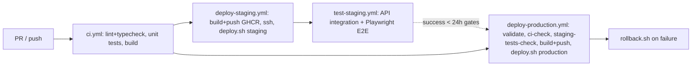

# Deployment and operations (checked 2026-09-24)

Read when: changing a workflow, a compose file, `scripts/*.sh`, nginx config, a migration that ships to a live environment, or when operating a deploy, rollback or restore.

> Public repo: never write host names, IP addresses, domains or user names into this repo. They live in GitHub Secrets and in the private sibling infra repo. Describe by role.

## Environments and branch mapping

|                          | Local                                                                      | Staging                                  | Production                                    |
| ------------------------ | -------------------------------------------------------------------------- | ---------------------------------------- | --------------------------------------------- |
| Trigger                  | `scripts/dev.sh` / `docker compose up`                                     | push to `develop` (+ dispatch)           | push to `main` (+ dispatch with confirmation) |
| Compose                  | `docker-compose.yml` (mysql, redis, api, web, nginx on one `myfinpro-net`) | `docker-compose.staging.{infra,app}.yml` | `docker-compose.production.{infra,app}.yml`   |
| Deploy dir               | —                                                                          | `/opt/myfinpro/staging`                  | `/opt/myfinpro/production`                    |
| Container prefix         | `myfinpro-*`                                                               | `myfinpro-staging-*`                     | `myfinpro-prod-*`                             |
| Network                  | `myfinpro-net`                                                             | `myfinpro-staging-net`                   | `myfinpro-production-net`                     |
| Image tag                | built locally                                                              | `staging`, `staging-<sha>`               | `latest`, `<sha>`, optional version tag       |
| `NODE_ENV` / `LOG_LEVEL` | development / debug                                                        | staging / debug                          | production / warn                             |
| Swagger                  | on                                                                         | on                                       | off (`SWAGGER_ENABLED=false`)                 |
| Rate limit               | `.env`                                                                     | 60 req / 60 s                            | 30 req / 60 s                                 |
| DB ports                 | published to host                                                          | internal only                            | internal only                                 |

**Production is triggered today by a push to `main`** (`.github/workflows/deploy-production.yml` `on.push.branches: [main]`) as well as by `workflow_dispatch` with a `confirm` input that must equal `deploy-production`. **Owner decision (2026-09-24, sibling infra repo): the push trigger must be removed — production becomes dispatch-only with an explicit `ref` and the literal confirmation.** Until that lands, treat any merge to `main` as a production release. See [decisions.md](decisions.md).

## Pipeline

| Workflow                | Trigger                                                 | Jobs / gates                                                                                                                                                                                                        |
| ----------------------- | ------------------------------------------------------- | ------------------------------------------------------------------------------------------------------------------------------------------------------------------------------------------------------------------- |
| `ci.yml`                | push + PR on `main`,`develop`                           | `lint-and-typecheck` → `unit-tests`, `build`                                                                                                                                                                        |
| `pr-check.yml`          | PR on `main`,`develop`                                  | semantic PR title; changed-package summary                                                                                                                                                                          |
| `deploy-staging.yml`    | push `develop`, dispatch                                | `ci-check` (polls CI for the same sha) → `build-and-push` → `deploy` (environment `staging`), rollback step `if: failure()`                                                                                         |
| `test-staging.yml`      | `workflow_run` of Deploy Staging on `develop`, dispatch | API integration (4 suites), Playwright E2E, summary                                                                                                                                                                 |
| `deploy-production.yml` | push `main`, dispatch                                   | `validate` (confirm text) → `ci-check` → `staging-tests-check` (latest `test-staging` run must be `success` and < 24 h old) → `build-and-push` → `deploy` (environment `production`), rollback step `if: failure()` |
| `backup-verify.yml`     | cron Sun 03:00 UTC, dispatch                            | backup → restore → integrity checks against a `mysql:9.7` service                                                                                                                                                   |
| `infra-maintenance.yml` | dispatch, `workflow_call`                               | server prune; Cloudflare DNS record upsert                                                                                                                                                                          |

Pinned actions: `actions/checkout@v6` (`@v4` in `backup-verify.yml`), `actions/setup-node@v6`, `pnpm/action-setup@v5`, `actions/upload-artifact@v7`, `actions/github-script@v8`, `docker/setup-buildx-action@v4`, `docker/login-action@v4`, `docker/build-push-action@v7`, `appleboy/scp-action@v0.1.7`, `appleboy/ssh-action@v1.2.2`, `amannn/action-semantic-pull-request@v6`, `tj-actions/changed-files@v47`.

## Blue/green mechanics (`scripts/deploy.sh <env> <tag>`)

1. `flock` on `.deploy.lock`; read `.active-slot` (`blue`/`green`) → deploy to the other; `.deploy-metadata` keeps the previous tag (it is `source`d, so the intended `IMAGE_TAG` is saved and restored around that line — do not remove that dance).
2. Prune old logs/dangling images, `docker compose pull` the slot, `up -d` the infra stack, wait for `<prefix>-mysql` and `<prefix>-redis` to report healthy.
3. Start the slot with `--force-recreate` after `docker rm -f` of stale slot containers.
4. `docker exec <api slot> npx prisma migrate deploy` — **the container boots before the migration runs**; code must tolerate the pre-migration schema for a few seconds (`0150a24`).
5. Wait for Docker healthchecks on the new api and web containers (90 s each).
6. Render `infrastructure/nginx/conf.d/ssl.conf.template` with `envsubst '$SERVER_NAME $ACTIVE_SLOT $ENVIRONMENT'` into the shared nginx `conf.d/<env>.conf`, then `nginx -t` **inside the shared container**, then `nginx -s reload`. Never `restart` and never `--force-recreate` the edge — that drops its DNS cache for running containers.
7. Drain 5 s, verify `GET /api/v1/health` through nginx; on failure re-render the previous slot, reload, stop the new slot, exit 1.
8. Write `.active-slot` + `.deploy-metadata`, stop the old slot, run `cleanup-images.sh`.

Upstreams are rendered literally (`upstream <env>_api { server <env>-api-<slot>:3001; }`), so nginx resolves the slot container at config load — a missing slot container fails `nginx -t`. Aliases are env-prefixed because the edge sits on both env networks (`docs/phase-1-progress.md` "DNS Collision"). The HTTPS `server` block in `ssl.conf.template` is **commented out**: the origin is HTTP-only and TLS terminates at the CDN. Enabling it is infra Phase 5 work.

Rollback: `scripts/rollback.sh <env>` reads `.deploy-metadata`, starts the previous slot from the locally retained N-1 image, health-checks, re-renders and reloads nginx, stops the failed slot (`docs/blue-green-deployment.md` §7).

## Shared edge nginx

`docker-compose.shared-nginx.yml` runs one `nginx:1.28-alpine` (`myfinpro-nginx`, project `myfinpro-shared`, ports 80/443) attached to both env networks, with `/opt/myfinpro/shared/{nginx,ssl}` mounted. Both deploy workflows copy `nginx.conf`, `conf.d/cloudflare-ips.conf`, `conf.d/_default.conf` and the compose file into the shared dir and `up -d` it. This repo owns that config **today**, but the edge is shared with other tenants on the host; it moves to the infra repo after the WordPress cutover. Rule: edit config, `nginx -t`, reload — never restart, never recreate.

## Migrations

Expand-then-contract only (`IMPLEMENTATION-PLAN.md` §8.3): additive migration first; remove columns/tables in a later migration after the old slot is gone. Both slots can serve traffic during a swap, so every migration must be compatible with N-1 code. `prisma migrate deploy` runs in the new slot; a non-baseline failure is only **warned** about and the deploy continues (`scripts/deploy.sh` step 4.5) — check deploy logs for `Migration failure is NOT a baseline issue`.

## Backups

`scripts/backup.sh` (mysqldump | gzip → `/var/backups/myfinpro`), retention 7 daily + 4 weekly, config from `infrastructure/backup/backup.env` (gitignored; `backup.env.example` lists the names). `infrastructure/backup/crontab` installs an **hourly** backup and a 6-hourly age check (`--max-age 2`); `docs/backup.md` still describes a 2:00 AM daily job and a 26 h threshold — the crontab wins. `backup-verify.yml` re-runs backup → restore → integrity weekly in CI. Restore procedure: `docs/backup.md` "Disaster Recovery Procedure" (stop app slots → `scripts/restore.sh` → verify → start).

**Status reported 2026-09-24 by the infra session (server-side facts, _unverified from this repo_):** no crontab is installed for the deploy user or root, the production and staging backup directories are empty apart from July's pre-MySQL-9.7 dumps, and `deploy-production.yml` has no pre-deploy dump step (that part is verifiable here: the workflow has none). Until this is fixed, treat every production deploy as running without a fresh backup; details in the infra repo's deploy runbook §5 and §7.

## Secrets

GitHub Actions secrets are the only source; the workflow exports them into the SSH session and compose reads them from the shell. No `.env` is written on a server — except the DKIM private key, which both deploy workflows write to `infrastructure/haraka/dkim-keys/private` (mode 600) on the host. Names referenced by workflows:

- SSH: `STAGING_HOST`, `STAGING_USER`, `STAGING_SSH_KEY`, `PRODUCTION_HOST`, `PRODUCTION_USER`, `PRODUCTION_SSH_KEY`.
- Per env (`STAGING_*` / `PRODUCTION_*`): `MYSQL_ROOT_PASSWORD`, `MYSQL_DATABASE`, `MYSQL_USER`, `MYSQL_PASSWORD`, `DATABASE_URL`, `JWT_SECRET`, `JWT_REFRESH_SECRET`, `REDIS_PASSWORD`.
- Shared: `GOOGLE_CLIENT_ID`, `GOOGLE_CLIENT_SECRET`, `TELEGRAM_BOT_TOKEN`, `TELEGRAM_BOT_USERNAME`, `TELEGRAM_BOT_TOKEN_STAGE`, `TELEGRAM_BOT_USERNAME_STAGE`, `DKIM_PRIVATE_KEY`, `ANTHROPIC_API_KEY`, `OPENAI_API_KEY`, `LLM_SECRETS_ENCRYPTION_KEY`, `CLOUDFLARE_STAGING_SUBDOMAIN`, `CLOUDFLARE_PRODUCTION_SUBDOMAIN`, `CLOUDFLARE_API_TOKEN`, `CLOUDFLARE_ZONE_ID`, `GITHUB_TOKEN` (GHCR login).
- Repo **variables** (not secrets): `RECEIPT_EXTRACTION_PROVIDER`, `RECEIPT_EXTRACTION_MODEL`.
- Env var names by concern are documented in `.env.example` (local infra ports/credentials) and `.env.{staging,production}.template` (reference only, no values). `COOKIE_SECRET` and `JWT_EXPIRATION` appear in those templates but are injected nowhere — stale entries.

## Images, volumes, observability

- Images: `ghcr.io/<owner>/myfinpro/{api,web}` built from `infrastructure/docker/{api,web,bot}.Dockerfile` (`node:26-alpine`, multi-stage). `scripts/cleanup-images.sh <env>` keeps current + previous tags and floating `latest`/`staging`, prunes dangling images and build cache, and **never touches volumes**.
- Data volumes (fixed names, shared by both slots): `myfinpro-{staging,production}-mysql`, `-redis`, `-receipts`, `-products`, `-haraka-queue`. `RECEIPT_STORAGE_DIR=/data/receipts` and `PRODUCT_IMAGE_STORAGE_DIR=/data/products` must point at them or a swap deletes user files (`17b7974`).
- Health: `GET /api/v1/health` (db + RSS memory) and `/api/v1/health/details` (+ redis, disk); nginx serves `GET /health`. Metrics: `GET /api/v1/metrics` (`apps/api/src/common/metrics/`) — unauthenticated and rate-limit exempt, so keep it off the public path.
- Logs: json-file driver, 10 MB × 5 per container; deploy logs at `<deploy dir>/deploy-*.log` (last 5 kept).

## Mail (current state)

Each app signs DKIM itself in `apps/api/src/mail/mail.service.ts` (Nodemailer `dkim` option) because Haraka's signing plugin crashes the message stream (`docs/phase-4-progress.md` "Haraka SMTP Email Delivery Fix"). `SMTP_HOST=haraka`, port 25, no TLS, no auth on the internal network; `SMTP_FROM` uses `MAIL_DOMAIN` (the production mail domain in **both** environments, for SPF alignment). `docs/phase-4-smtp-design.md` describes a per-project Haraka in each env's infra compose — that design is being retired: outbound mail moves to a shared relay owned by the sibling infra repo, reachable at the alias `haraka` on a shared Docker network, with app-side DKIM unchanged.

## Scripts

| Script                              | Does                                                                           | Needs                                                 |
| ----------------------------------- | ------------------------------------------------------------------------------ | ----------------------------------------------------- |
| `deploy.sh <env> <tag>`             | blue/green deploy, migrate, switch edge, verify, cleanup                       | all app env vars exported; networks + infra + edge up |
| `rollback.sh <env>`                 | switch back to the previous slot/image                                         | `.deploy-metadata`, same env vars                     |
| `cleanup-images.sh <env>`           | prune images/build cache, keep N and N-1                                       | `.deploy-metadata`                                    |
| `backup.sh [--docker]`              | gzipped mysqldump + retention sweep                                            | `backup.env` or MYSQL\_\* env                         |
| `verify-backup.sh [--test-restore]` | existence, age, gzip/SQL integrity, optional restore                           | backup dir, MySQL access                              |
| `check-backup-age.sh --max-age <h>` | alert (optional webhook) when the newest dump is too old                       | `BACKUP_DIR`, `ALERT_WEBHOOK_URL`                     |
| `restore.sh <file>`                 | restore a dump into a database (`--force` skips the prompt)                    | dump file, MySQL access                               |
| `seed.sh`                           | `prisma db seed` via the api package                                           | local DB up                                           |
| `dev.sh`                            | create missing `.env` files, start mysql+redis, migrate, seed, run dev servers | docker, pnpm                                          |

## Never

- Never `docker compose down -v` an `*.infra.yml` stack — it declares the production MySQL, Redis, receipt, product and mail-queue volumes.
- Never `restart`/`--force-recreate` the shared edge nginx; `nginx -t` then `nginx -s reload`.
- Never deploy production without the owner; never push to `main` from an agent (a merge deploys today).
- Never point receipt/product storage at a container-local path.
- Never bump the MySQL image and push without a fresh backup — the staging infra `up -d` performs the in-place datadir upgrade on the next deploy (`docs/platform-upgrade-2026.md` §3).

## Runbook pointers

Deploy watch and CLI monitoring → `docs/deployment.md` "Real-Time Deployment Monitoring". Blocked production gate → `docs/deployment.md` "Production Deployment Gating". Rollback → `docs/deployment.md` "Rollback Procedures", `docs/blue-green-deployment.md` §7. Restore → `docs/backup.md` "Disaster Recovery Procedure". Origin certificates → `docs/server-setup-guide.md` Part 3 (issuance itself is now the infra repo's job). Mail verification → `docs/phase-4-smtp-design.md` §11. LLM provider switch and its failure modes → `docs/runbook-llm-extraction.md`. Host provisioning → `docs/server-setup-guide.md`. Also see [gotchas.md](gotchas.md).
