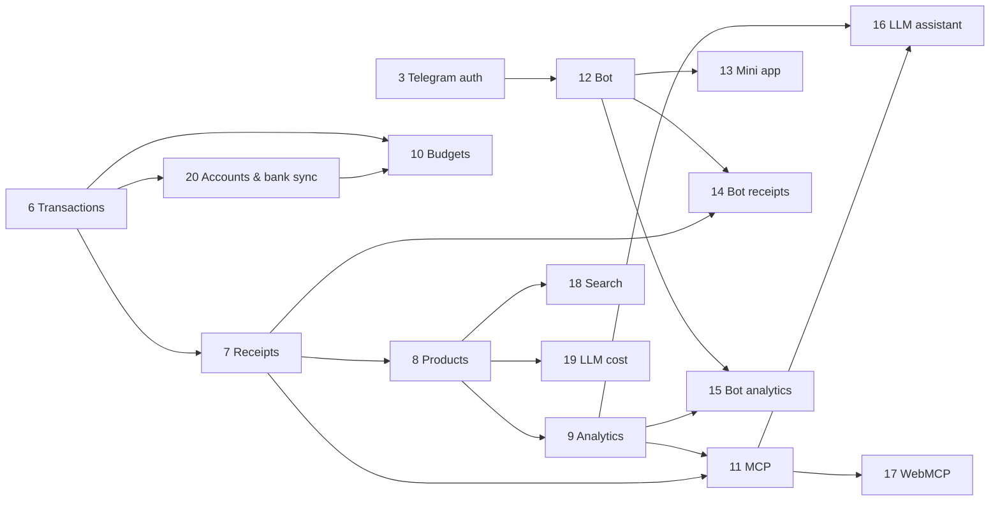

# Roadmap (checked 2026-09-24)

Read when: picking the next iteration, judging whether two pieces of work can run in parallel, or checking what a phase number means. `IMPLEMENTATION-PLAN.md` §5 owns the scope; `docs/progress.md` owns what shipped. This page mirrors both and adds nothing.

## Status per phase

Dependencies are from `IMPLEMENTATION-PLAN.md` §9.1–§9.2. "Last shipped" comes from the phase
progress doc, cross-checked against `git log` on `develop`.

| Phase                        | Status         | Last shipped         | Next | Hard deps               | External blockers                                                |
| ---------------------------- | -------------- | -------------------- | ---- | ----------------------- | ---------------------------------------------------------------- |
| 0–5 Foundation → Groups      | ✅ complete    | 2026-04-24           | —    | —                       | —                                                                |
| 6 Transactions (unified)     | ✅ complete    | 2026-07-04 (21 its.) | —    | 5                       | —                                                                |
| 7 Receipts & LLM extraction  | ✅ complete    | 2026-07-09 (13 its.) | —    | 6                       | —                                                                |
| 8 Product catalog & barcode  | 🔄 in progress | 8.28 (2026-07-24)    | 8.16 | 7                       | device camera for 8.6 scanning; Open Food Facts API              |
| 9 Purchase analytics         | 🔄 in progress | 9.1 (2026-07-20)     | 9.2  | 8                       | production-size fixtures for the 9.8 p95 < 500 ms gate           |
| 10 Budgets                   | 🔄 in progress | 10.4 (2026-07-20)    | 10.5 | 6 only                  | none (10.9/10.10 workers ship behind `BUDGET_ALERTS_ENABLED`)    |
| 11 MCP server                | ⬜ not started | —                    | 11.1 | 9.7 + 7                 | OAuth consent screen; live Claude/ChatGPT connectors for 11.7    |
| 12 Telegram bot              | ⬜ not started | —                    | 12.1 | 3                       | **BotFather registration + public webhook**                      |
| 13 Telegram mini app         | ⬜ not started | —                    | 13.1 | 12A (12.1–12.4)         | Telegram mini-app hosting/registration                           |
| 14 Bot receipt processing    | ⬜ not started | —                    | 14.1 | 7 + 12A                 | same bot registration                                            |
| 15 Bot analytics             | ⬜ not started | —                    | 15.1 | 9 + 12                  | same bot registration                                            |
| 16 LLM assistant (in-app)    | ⬜ not started | —                    | 16.1 | 7 + 9 (+11)             | LLM provider keys (BYOK layer exists from 8.11)                  |
| 17 WebMCP                    | ⬜ not started | —                    | 17.1 | 11                      | **moving spec** — `navigator.modelContext` Chromium origin trial |
| 18 Centralized search        | ⬜ not started | —                    | 18.1 | 7 + 8                   | none                                                             |
| 19 LLM usage & cost tracking | ⬜ not started | —                    | 19.1 | 8.11                    | per-model pricing map must be maintained by hand                 |
| 20 Accounts & bank sync      | 🔄 in progress | design (2026-09-25)  | 20.1 | 6 (+7–8 for enrichment) | export formats drift; the connector needs the user's own machine |

Iteration budgets (plan §5 "Phase Size Guidelines"): 8 → 10 + follow-ups, 9 → 8, 10 → 10, 11 → 8,
12 → 4 + 12, 13 → 10, 14 → 6, 15 → 4, 16 → 7, 17 → 4, 18 → 7, 19 → 6. Target size is 6–10
iterations; larger phases split into lettered sub-sections (12A/12B).

## Shipped but not yet in the progress docs

`docs/progress.md` says "last updated 2026-07-20"; `docs/phase-8-progress.md` ends at 8.28
(2026-07-24). Everything below is on `develop` with **no progress entry and no plan iteration row** —
fold it into the docs before claiming a phase is complete.

| Date       | Commits                                                          | What                                                                                                                    |
| ---------- | ---------------------------------------------------------------- | ----------------------------------------------------------------------------------------------------------------------- |
| 2026-07-24 | `6b05f3c`                                                        | 8.28 link receipts ⇄ transactions (in `phase-8-progress.md`, absent from `progress.md`)                                 |
| 2026-07-24 | `3b60b5d`, `bac3969`, `d7dd7b7`                                  | multiple categories per transaction — `transaction_categories` schema + API + UI + delete/direction guards              |
| 2026-07-24 | `0ad9f8c`, `9e8d1cf`, `c44fef1`, `446fb9e`, `0073b5a`, `45058d9` | Pets/Pharmacy/Sport default categories, i18n badge fix, product-image encode fix, Playwright 1.61, stack-versions skill |
| 2026-07-25 | `c599642`, `659bce6`, `9965c88`                                  | auto-import scanned barcodes from Open Food Facts; nightly OFF enrichment sweep                                         |
| 2026-07-25 | `92b8c3f`                                                        | persist full extraction reasoning on the receipt                                                                        |
| 2026-08-15 | `7435217`                                                        | printed discount lines no longer fail extraction                                                                        |

The multi-category work partly pre-empts **18.1** (many-to-many entity↔category attribution now
exists; the _hierarchy_ — `Category.parent` — does not). Re-scope 18.1 before starting Phase 18.

## Dependency graph

## What can run in parallel right now

- **9 ∥ 10** — budgets only need Phase 6; they share no module, no table and no shared type.
  This is how 10.1–10.4 shipped alongside the receipts/catalog track.
- **8 follow-ups ∥ 9 ∥ 10** — three separate API modules (`product`/`receipt`, `analytics`,
  `budget`) and three separate web areas.
- **11.1 (OAuth 2.1 server) ∥ 9.2–9.6** — the plan lets the OAuth groundwork start right after
  Phase 6; only the MCP _read tools_ (11.3) need habit summaries (9.7).
- **API ∥ web inside a phase**, once the API shape is fixed (plan §9.1).

Must be serialized:

- **Prisma migrations.** Expand-only, one migration per iteration, applied in order; two phases
  writing migrations in the same window will collide on migration ordering. Coordinate 9.2/9.7
  (`analytics_views`, `habit_summaries`), 10.9 (`dedup_key`), 18.1 (taxonomy) and 20.2/20.7 (accounts, `api_tokens`).
- **`packages/shared` types** consumed by both apps — land the shared change first, then API, then
  web, so typecheck never breaks mid-stack.
- **Phase 11 → 17**: WebMCP reuses the Phase 11 tool contracts; there is one canonical tool surface.
- **Phase 12A before 12B/13/14/15** — everything Telegram needs the linked-account foundation.

## Per-phase scope (keep the iteration numbering)

**8 — Product catalog, matching & barcode.** Two-layer product DB (global barcode registry +
private purchase data), staged matcher, walkthrough, OFF enrichment, images. 8.1–8.15, 8.17–8.28
shipped; **8.16 (receipt⇄transaction invariant: no receipt without a transaction) is the one
outstanding row** and 8.28 already advanced it.

**9 — Purchase analytics.** Configurable engine over the hybrid purchase-row grain. 9.1 shipped;
9.2 saved views + query builder, 9.3 dashboards (Recharts, code-split), 9.4 price dynamics, 9.5
merchant analytics, 9.6 group analytics, 9.7 habit summaries, 9.8 performance gate.
See [analytics-and-budgets.md](analytics-and-budgets.md).

**10 — Budgets & spending targets.** 10.1–10.4 shipped (schema, `resolvePeriod`, CRUD API, form
dialogs, list page). 10.5 progress API, 10.6 dashboard + detail, 10.7–10.8 group budgets,
10.9 alert worker + `dedup_key` migration, 10.10 due-transaction reminders + E2E + merge.

**11 — MCP server.** Remote Streamable-HTTP MCP with OAuth 2.1 (auth code + PKCE + dynamic client
registration) on the existing auth stack: 11.1 OAuth, 11.2 endpoint, 11.3 read tools, 11.4 write
tools (receipt upload from chat), 11.5 purchase comments, 11.6 hardening, 11.7 real-client
verification, 11.8 tests + merge. 11.3 is blocked on 9.7.

**12 — Telegram bot.** 12A core (12.1 BotFather setup, 12.2 grammy framework, 12.3 commands,
12.4 account linking) then 12B transactions (12.5 balance, 12.6a–e expense flow, 12.7a–d income
flow, 12.8 recent, 12.9 notifications). 12.1 cannot start without the bot token.

**13 — Telegram mini app.** 13.1–13.10: scaffolding, auth, shell, expense/income entry, analytics
views, receipt upload into the Phase 7 pipeline, budget view, group views, per-member expenses.

**14 — Bot receipt processing.** 14.1–14.6: photo and URL intake into the Phase 7 pipeline,
completion notifications with deep links, quick confirm, simplified in-chat item walkthrough,
tests. Deliberately thin — the pipeline is Phases 7–8.

**15 — Bot analytics.** 15.1 `/stats`, 15.2 `/breakdown`, 15.3 `/groupstats`, 15.4 inline charts —
all canned compositions over the Phase 9 engine, no parallel aggregation code.

**16 — LLM assistant (in-app).** 16.1–16.7: reuse the Phase 7 provider layer for chat, context
builder over summaries/budgets/habits, chat API + UI, personal and group Q&A, insight generation.

**17 — WebMCP.** 17.1–17.4: feature detection, read tools, write tools, hardening + docs.
Deliberately last, everything behind feature detection with zero impact when the API is absent.

**18 — Centralized search.** 18.1 hierarchical + many-to-many category taxonomy, 18.2 LLM
enrichment at intake, 18.3 indexed search backend (EN+HE), 18.4 `GET /search` with include/exclude,
18.5 omnibox + facets, 18.6 relevance and locale folding, 18.7 tests. Complements Phase 9 — search
finds, analytics aggregates.

**19 — LLM usage & cost tracking.** 19.1 `llm_usage_events` ledger, 19.2 provider metering,
19.3 pricing map + cost, 19.4 entity attribution, 19.5 usage API + BYOK dashboard, 19.6 tests +
retention. Matters most for BYOK users (8.11). Ledger writes must never block the metered call.

**20 — Accounts, balances & bank sync** (added 2026-09-25). 20.1 UI kit, 20.2 schema + API,
20.3 accounts UI, 20.4 statement parsing + import API, 20.5 import/review UI, 20.6 two-way
enrichment, 20.7 user-run connector, 20.8 balance alerts + release. Design:
`docs/phase-20-accounts-design.md`; wiki [accounts-and-sync.md](accounts-and-sync.md).

## Renumbering map

Re-plan **2026-07-03** (`IMPLEMENTATION-PLAN.md` §5): Budgets 8→10, Receipts 9→7 (rewritten),
Analytics 10→9 (rewritten), Bot 11→12, Mini App 12→13, Bot Receipts 13→14 (8→6 iterations),
Bot Analytics 14→15, LLM Assistant 15→16 (extraction moved into 7); **new**: 8 (product catalog),
11 (MCP server), 17 (WebMCP). Added **2026-07-15**: 18 (search), 19 (LLM cost). Total 174
iterations. Phase 6 also absorbed the original Phase 7 (income + expense unified), and Phase 8.20
renamed Payment → Transaction everywhere — old docs and old column names reflect that.

## Rules for changing this page

1. **Scope belongs to the owner.** Never add, remove, re-order or re-number a phase or iteration
   here — change `IMPLEMENTATION-PLAN.md` first (owner-approved), then mirror it.
2. Iteration numbers are permanent identifiers: they appear in commit subjects (`feat(phase-10.4): …`),
   progress headings and migration names. Renumber only via a dated re-plan note in plan §5.
3. "Last shipped" is updated from the phase progress doc, not from memory; if `git log` disagrees
   with the progress doc, fix the progress doc and record the commit here.
4. One line per fact. If a phase needs more than four lines of scope, the detail belongs in its
   design doc.
